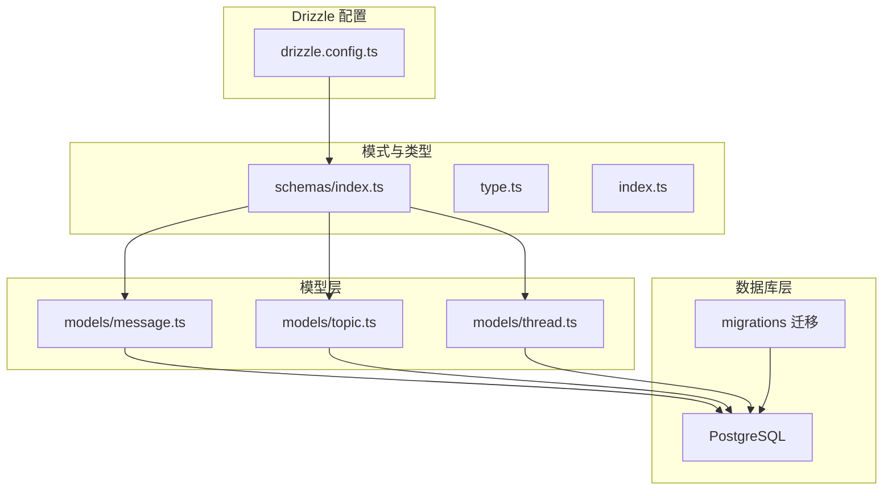
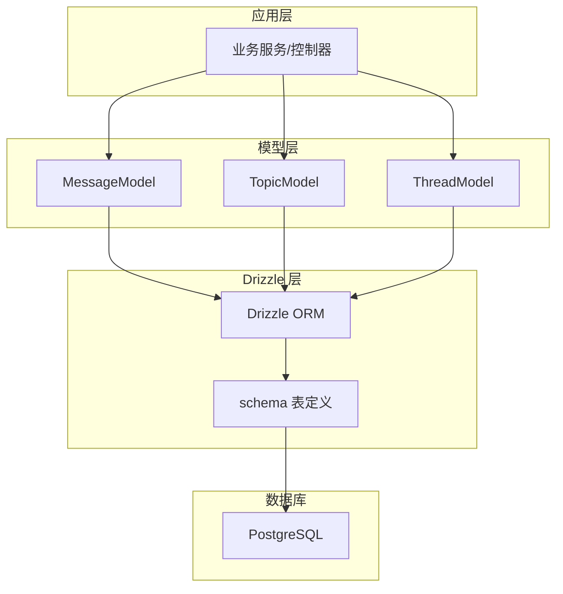
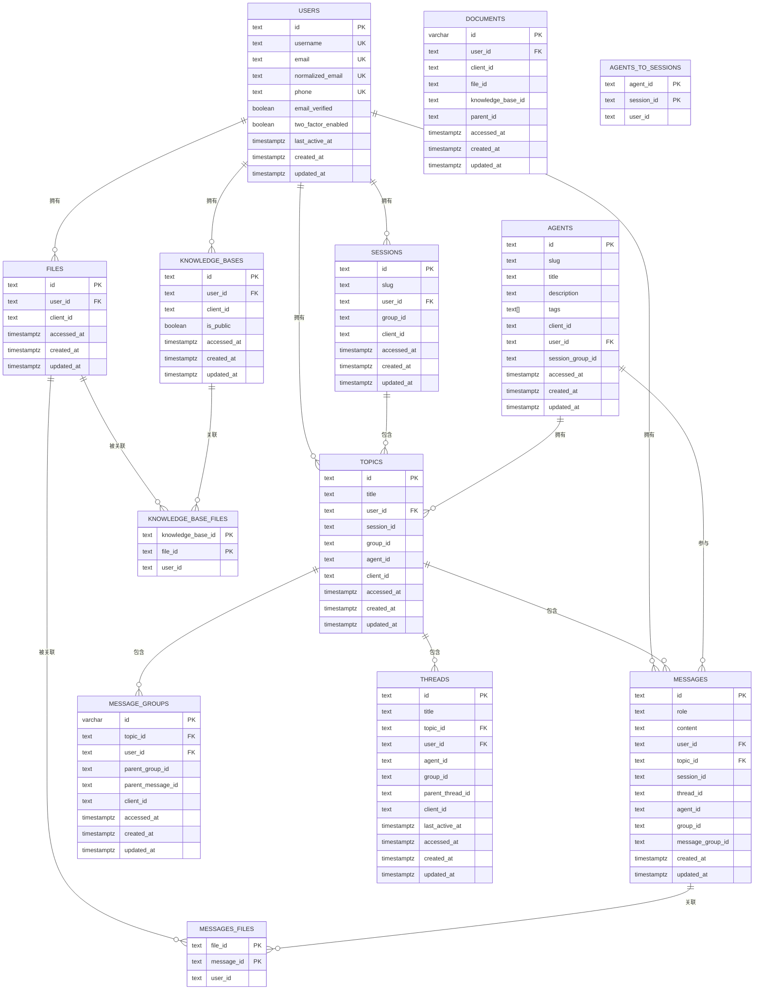
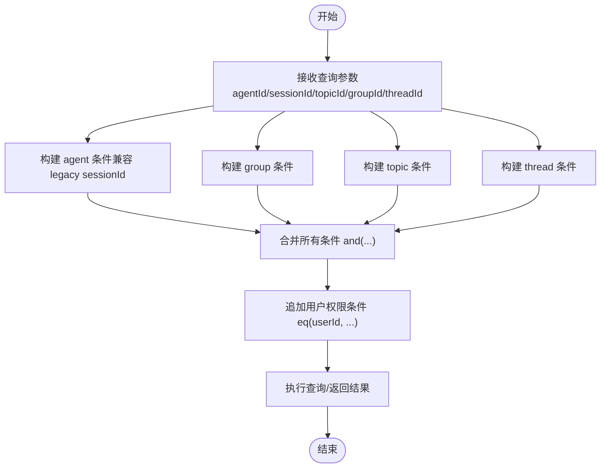
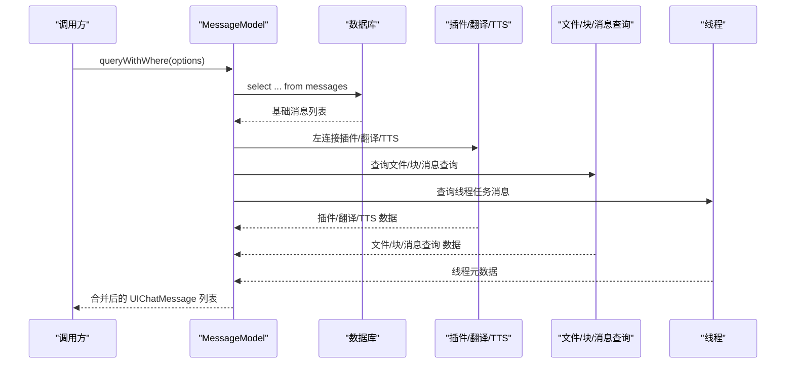
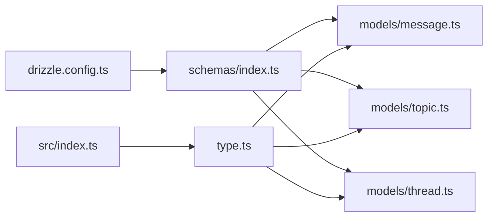

# 关系与约束

<cite>
**本文引用的文件**
- [database-schema.dbml](file://docs/development/database-schema.dbml)
- [drizzle.config.ts](file://drizzle.config.ts)
- [packages/database/src/index.ts](file://packages/database/src/index.ts)
- [packages/database/src/type.ts](file://packages/database/src/type.ts)
- [packages/database/src/schemas/index.ts](file://packages/database/src/schemas/index.ts)
- [packages/database/src/models/message.ts](file://packages/database/src/models/message.ts)
- [packages/database/src/models/topic.ts](file://packages/database/src/models/topic.ts)
- [packages/database/src/models/thread.ts](file://packages/database/src/models/thread.ts)
</cite>

## 目录
1. [简介](#简介)
2. [项目结构](#项目结构)
3. [核心组件](#核心组件)
4. [架构总览](#架构总览)
5. [详细组件分析](#详细组件分析)
6. [依赖分析](#依赖分析)
7. [性能考虑](#性能考虑)
8. [故障排查指南](#故障排查指南)
9. [结论](#结论)
10. [附录](#附录)

## 简介
本文件聚焦于 LobeHub 项目的数据库关系与约束，系统化梳理实体间的关系映射、外键约束、级联操作设计；详解完整性约束（主键、唯一、检查）、动态过滤与权限控制；给出完整 ERD 图谱；并总结性能优化策略、索引设计原则与查询优化技巧，以及数据一致性、事务与并发控制的关键实践。

## 项目结构
数据库层采用 Drizzle ORM + PostgreSQL，通过统一的 schema 定义与迁移管理，结合模型层封装查询逻辑与权限控制。核心目录与职责如下：
- 文档与模式：docs/development/database-schema.dbml 提供全量表结构与索引定义
- 配置：drizzle.config.ts 指定数据库方言、迁移输出路径与 schema 路径
- 类型与入口：packages/database/src/type.ts 定义数据库类型别名；src/index.ts 导出核心能力
- 模式导出：packages/database/src/schemas/index.ts 统一导出各领域模型 schema
- 模型层：packages/database/src/models 下按领域拆分，如消息、话题、线程等，封装查询、过滤与事务

图表来源
- [drizzle.config.ts](file://drizzle.config.ts#L1-L22)
- [packages/database/src/schemas/index.ts](file://packages/database/src/schemas/index.ts#L1-L24)
- [packages/database/src/type.ts](file://packages/database/src/type.ts#L1-L10)
- [packages/database/src/index.ts](file://packages/database/src/index.ts#L1-L5)
- [packages/database/src/models/message.ts](file://packages/database/src/models/message.ts#L1-L120)
- [packages/database/src/models/topic.ts](file://packages/database/src/models/topic.ts#L1-L80)
- [packages/database/src/models/thread.ts](file://packages/database/src/models/thread.ts#L1-L40)

章节来源
- [drizzle.config.ts](file://drizzle.config.ts#L1-L22)
- [packages/database/src/schemas/index.ts](file://packages/database/src/schemas/index.ts#L1-L24)
- [packages/database/src/type.ts](file://packages/database/src/type.ts#L1-L10)
- [packages/database/src/index.ts](file://packages/database/src/index.ts#L1-L5)

## 核心组件
- 数据库类型与适配器
  - LobeChatDatabaseSchema 与 LobeChatDatabase 类型别名，确保 Drizzle 与 Neon 的类型安全
  - Transaction 类型用于跨模型事务编排
- 模式导出
  - 统一从 schemas/index.ts 导出各领域表结构，便于模型层按需引用
- 模型层职责
  - 消息模型：构建动态 WHERE 条件、多表关联查询、压缩组与对比组聚合、任务线程关联
  - 话题模型：支持按 agentId/groupId/containerId 查询、关键词检索、统计与内存提取游标
  - 线程模型：围绕任务线程的增删改查与按话题查询

章节来源
- [packages/database/src/type.ts](file://packages/database/src/type.ts#L1-L10)
- [packages/database/src/schemas/index.ts](file://packages/database/src/schemas/index.ts#L1-L24)
- [packages/database/src/models/message.ts](file://packages/database/src/models/message.ts#L1-L120)
- [packages/database/src/models/topic.ts](file://packages/database/src/models/topic.ts#L1-L80)
- [packages/database/src/models/thread.ts](file://packages/database/src/models/thread.ts#L1-L40)

## 架构总览
下图展示数据库层与应用层的交互关系，重点标注权限控制（用户维度）与动态过滤（会话/话题/线程/群组）。

图表来源
- [packages/database/src/models/message.ts](file://packages/database/src/models/message.ts#L1-L120)
- [packages/database/src/models/topic.ts](file://packages/database/src/models/topic.ts#L1-L80)
- [packages/database/src/models/thread.ts](file://packages/database/src/models/thread.ts#L1-L40)
- [packages/database/src/schemas/index.ts](file://packages/database/src/schemas/index.ts#L1-L24)

## 详细组件分析

### 实体关系与约束（ERD）
以下 ERD 基于 database-schema.dbml 的表与索引定义，展示核心实体与连接关系。为避免冗长，仅列出关键主键、外键与索引。

图表来源
- [database-schema.dbml](file://docs/development/database-schema.dbml#L1-L1786)

章节来源
- [database-schema.dbml](file://docs/development/database-schema.dbml#L1-L1786)

### 外键与级联设计
- 用户维度强隔离
  - 所有实体均包含 user_id 字段，并在查询时强制加上 eq(messages.userId, this.userId) 等条件，确保跨表查询的权限边界
- 会话/话题/线程/群组
  - SESSIONS.id 与 TOPICS.session_id 关联；TOPICS.id 与 MESSAGES.topic_id 关联；THREADS.topic_id 与 TOPICS.id 关联
  - AGENTS_TO_SESSIONS 作为 agent 与 session 的多对多桥接，支撑历史兼容查询
- 文件与知识库
  - FILES 与 MESSAGES_FILES、FILES 与 KNOWLEDGE_BASE_FILES 通过复合主键建立多对多关系
  - KNOWLEDGE_BASES 与 KNOWLEDGE_BASE_FILES 一对多
- 文档与嵌入
  - DOCUMENTS 与 FILES 通过 file_id 关联；嵌入向量存储于单独表，chunk_id 唯一索引

章节来源
- [packages/database/src/models/message.ts](file://packages/database/src/models/message.ts#L260-L280)
- [packages/database/src/models/topic.ts](file://packages/database/src/models/topic.ts#L120-L185)
- [database-schema.dbml](file://docs/development/database-schema.dbml#L1-L1786)

### 完整性约束与唯一性
- 主键
  - 多数表使用 text/uuid/复合主键，如 MESSAGES、MESSAGE_GROUPS、THREADS、FILES、DOCUMENTS、KNOWLEDGE_BASES、MESSAGES_FILES、KNOWLEDGE_BASE_FILES
- 唯一性
  - USERS.email/username/normalized_email/phone 唯一
  - AGENTS.client_id+user_id 唯一；AGENTS.slug+user_id 唯一
  - SESSIONS.slug+user_id 唯一；SESSIONS.client_id+user_id 唯一
  - TOPICS.client_id+user_id 唯一
  - DOCUMENTS.client_id+user_id 唯一；DOCUMENTS.slug+user_id 唯一
  - FILES.client_id+user_id 唯一
  - KNOWLEDGE_BASES.client_id+user_id 唯一
  - MESSAGE_GROUPS.client_id+user_id 唯一
  - MESSAGE_QUERIES.client_id+user_id 唯一
  - MESSAGE_TTS.client_id+user_id 唯一
  - MESSAGE_TRANSLATE.client_id+user_id 唯一
  - AGENT_EVAL_RUN_TOPICS(run_id, topic_id) 唯一
  - AGENT_EVAL_RUNS(dataset_id, user_id) 唯一
  - AGENT_EVAL_TEST_CASES(user_id, dataset_id) 唯一
  - AGENT_SKILLS(user_id, name) 唯一
  - AI_MODELS(id, provider_id, user_id) 唯一
  - AI_PROVIDERS(id, user_id) 唯一
  - NEXTAUTH_ACCOUNTS(provider, providerAccountId) 唯一
  - NEXTAUTH_AUTHENTICATORS(user_id, credentialID) 唯一
  - PASSKEY.credentialID 唯一
  - OIDC_ACCESS_TOKENS.user_id 索引
  - OIDC_REFRESH_TOKENS.user_id 索引
  - OIDC_DEVICE_CODES.user_id 索引
  - OIDC_GRANTS.user_id 索引
  - OIDC_SESSIONS.user_id 索引
  - CHUNKS.client_id+user_id 唯一
  - EMBEDDINGS.client_id+user_id 唯一
  - UNSTRUCTURED_CHUNKS.client_id+user_id 唯一
  - RBAC_ROLE_PERMISSIONS(role_id, permission_id) 唯一
  - RBAC_USER_ROLES(user_id, role_id) 唯一
  - AGENTS_TO_SESSIONS(agent_id, session_id) 唯一
  - FILE_CHUNKS(file_id, chunk_id) 唯一
  - FILES_TO_SESSIONS(file_id, session_id) 唯一
  - SESSION_GROUPS.client_id+user_id 唯一
  - THREADS.client_id+user_id 唯一
  - API_KEYS.key 唯一
  - AUTH_SESSIONS.token 唯一
  - OIDC_CONSENTS(user_id, client_id) 唯一
- 检查约束
  - 未见显式 CHECK 约束定义；通过字段默认值与索引策略保障数据质量

章节来源
- [database-schema.dbml](file://docs/development/database-schema.dbml#L1-L1786)

### 动态过滤与权限控制
- 权限控制
  - 所有查询均以 eq(userId, ...) 作为基础条件，确保用户只能访问自身数据
- 动态过滤
  - 消息模型：query/queryWithWhere 支持 agentId/sessionId/topicId/groupId/threadId 组合过滤；支持自定义 where 条件
  - 话题模型：query 支持 agentId/groupId/containerId/isInbox/excludeTriggers 等参数；关键词检索同时匹配标题与消息内容
  - 线程模型：按用户与话题过滤
- 时间范围与游标
  - 话题模型提供内存提取游标查询，基于 createdAt/id 排序与游标条件
- 生成 WHERE 的工具
  - 模型层通过 genWhere/genRangeWhere/genStartDateWhere/genEndDateWhere 组合条件，形成可复用的过滤链

图表来源
- [packages/database/src/models/message.ts](file://packages/database/src/models/message.ts#L125-L193)
- [packages/database/src/models/topic.ts](file://packages/database/src/models/topic.ts#L76-L125)

章节来源
- [packages/database/src/models/message.ts](file://packages/database/src/models/message.ts#L125-L193)
- [packages/database/src/models/topic.ts](file://packages/database/src/models/topic.ts#L76-L125)

### 复杂查询与 JOIN 顺序
- 消息查询
  - 基础消息表与插件、翻译、TTS 表左连接，排除属于消息组的消息，支持分页与时间窗口内的消息组节点
  - 并行查询文件、块、消息查询、线程信息，再进行统一转换
- 话题查询
  - 支持按 agentId（含 legacy sessionId 映射）、groupId、containerId、触发器过滤
  - 关键词搜索先按标题匹配，再按消息内容匹配并去重
- 线程查询
  - 按用户与话题过滤，返回线程元数据与状态

图表来源
- [packages/database/src/models/message.ts](file://packages/database/src/models/message.ts#L210-L530)

章节来源
- [packages/database/src/models/message.ts](file://packages/database/src/models/message.ts#L210-L530)

### 事务与并发控制
- 事务边界
  - 话题创建/批量创建/复制：在单事务内插入话题并更新消息 topicId，保证原子性
  - 话题删除：按用户与 ID 删除，或按容器（会话/群组/代理）批量删除
- 并发控制
  - 通过用户维度过滤与唯一索引（client_id+user_id 等）避免写冲突
  - 对于高并发写入场景，建议在应用层做幂等（如 ON CONFLICT DO NOTHING）

章节来源
- [packages/database/src/models/topic.ts](file://packages/database/src/models/topic.ts#L414-L479)
- [packages/database/src/models/thread.ts](file://packages/database/src/models/thread.ts#L33-L42)

## 依赖分析
- 模型到模式
  - 模型层通过导入 schemas/*.ts 中的表定义，直接使用 Drizzle 的表对象进行查询
- 配置到模式
  - drizzle.config.ts 指定 schema 路径与迁移输出目录，确保迁移与运行时 schema 一致
- 入口导出
  - src/index.ts 将数据库适配器、压缩仓库、类型与 ID 生成器统一导出，便于上层使用

图表来源
- [drizzle.config.ts](file://drizzle.config.ts#L1-L22)
- [packages/database/src/schemas/index.ts](file://packages/database/src/schemas/index.ts#L1-L24)
- [packages/database/src/type.ts](file://packages/database/src/type.ts#L1-L10)
- [packages/database/src/index.ts](file://packages/database/src/index.ts#L1-L5)

章节来源
- [drizzle.config.ts](file://drizzle.config.ts#L1-L22)
- [packages/database/src/schemas/index.ts](file://packages/database/src/schemas/index.ts#L1-L24)
- [packages/database/src/type.ts](file://packages/database/src/type.ts#L1-L10)
- [packages/database/src/index.ts](file://packages/database/src/index.ts#L1-L5)

## 性能考虑
- 索引设计原则
  - 用户维度过滤：所有表均包含 user_id，建议在高频过滤列上建立复合索引（如 client_id+user_id）
  - 时间序列：messages.created_at、topics.updated_at、threads.last_active_at 等建立索引
  - 多对多桥接：agents_to_sessions、messages_files、knowledge_base_files 等复合主键天然具备索引
- 查询优化技巧
  - 使用并行查询：消息模型在 queryByIds 中对文件、块、消息查询、线程信息采用 Promise.all 并行获取
  - 分页与时间窗口：消息模型在分页时对消息组节点按时间窗口裁剪，避免重复与冗余
  - 关联裁剪：先过滤主表，再左连接次表，减少中间结果集
- 向量化与 RAG
  - 嵌入表 embedding_id 唯一索引，chunk_id 唯一索引；向量字段建立 GIN/Gist 索引（如 user_memories 的向量字段）
- 迁移与自动维护
  - 迁移脚本中包含自动清理与索引优化（autovacuum tuning），建议定期运行维护任务

章节来源
- [packages/database/src/models/message.ts](file://packages/database/src/models/message.ts#L614-L676)
- [database-schema.dbml](file://docs/development/database-schema.dbml#L1482-L1486)

## 故障排查指南
- 权限问题
  - 现象：查询无结果或报错
  - 排查：确认请求上下文中的 userId 是否正确注入；检查是否遗漏 eq(userId, ...)
- 外键缺失
  - 现象：插入失败或数据不一致
  - 排查：核对关联表 client_id+user_id 唯一索引是否满足；检查 legacy sessionId 映射是否正确
- 查询性能差
  - 现象：分页卡顿、关键词搜索慢
  - 排查：确认相关索引是否存在；检查是否遗漏并行查询；评估时间窗口与分页策略
- 事务异常
  - 现象：批量插入后部分成功
  - 排查：确认事务包裹范围；检查幂等策略（如 ON CONFLICT）

章节来源
- [packages/database/src/models/message.ts](file://packages/database/src/models/message.ts#L260-L280)
- [packages/database/src/models/topic.ts](file://packages/database/src/models/topic.ts#L120-L185)
- [packages/database/src/models/thread.ts](file://packages/database/src/models/thread.ts#L33-L42)

## 结论
本项目通过清晰的 ERD 设计、严格的用户维度权限控制与完善的动态过滤机制，实现了高内聚、低耦合的数据层。配合 Drizzle ORM 的类型安全与迁移体系，既保障了开发效率，也兼顾了生产环境的稳定性与可演进性。建议在后续迭代中持续完善索引覆盖与查询路径，强化向量化检索与批处理能力。

## 附录
- 数据库配置
  - dialect: postgresql
  - schema: packages/database/src/schemas
  - migrations 输出: packages/database/migrations
- 关键类型
  - LobeChatDatabaseSchema、LobeChatDatabase、Transaction
- 模型导出
  - 通过 schemas/index.ts 统一导出，便于按需引入

章节来源
- [drizzle.config.ts](file://drizzle.config.ts#L10-L21)
- [packages/database/src/type.ts](file://packages/database/src/type.ts#L1-L10)
- [packages/database/src/schemas/index.ts](file://packages/database/src/schemas/index.ts#L1-L24)