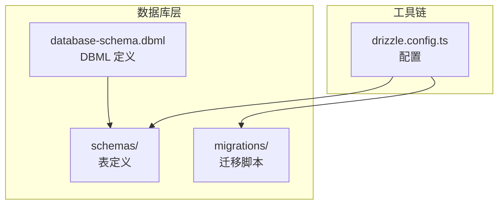
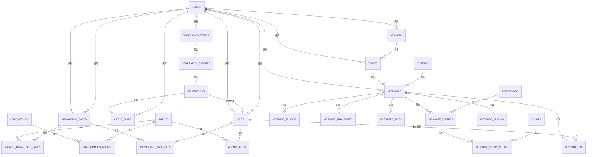
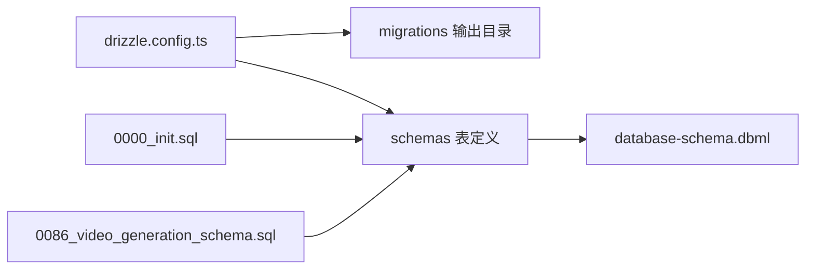

# 数据模型

<cite>
**本文引用的文件**
- [docs/development/database-schema.dbml](file://docs/development/database-schema.dbml)
- [drizzle.config.ts](file://drizzle.config.ts)
- [packages/database/src/schemas/index.ts](file://packages/database/src/schemas/index.ts)
- [packages/database/src/schemas/agent.ts](file://packages/database/src/schemas/agent.ts)
- [packages/database/src/schemas/message.ts](file://packages/database/src/schemas/message.ts)
- [packages/database/src/schemas/user.ts](file://packages/database/src/schemas/user.ts)
- [packages/database/src/schemas/chatGroup.ts](file://packages/database/src/schemas/chatGroup.ts)
- [packages/database/src/schemas/generation.ts](file://packages/database/src/schemas/generation.ts)
- [packages/database/src/models/generation.ts](file://packages/database/src/models/generation.ts)
- [packages/database/src/models/generationBatch.ts](file://packages/database/src/models/generationBatch.ts)
- [packages/database/src/models/generationTopic.ts](file://packages/database/src/models/generationTopic.ts)
- [packages/database/src/types/generation.ts](file://packages/database/src/types/generation.ts)
- [src/server/routers/lambda/generation.ts](file://src/server/routers/lambda/generation.ts)
- [src/server/routers/lambda/generationBatch.ts](file://src/server/routers/lambda/generationBatch.ts)
- [src/server/routers/lambda/generationTopic.ts](file://src/server/routers/lambda/generationTopic.ts)
- [packages/database/migrations/0000_init.sql](file://packages/database/migrations/0000_init.sql)
- [packages/database/migrations/0086_video_generation_schema.sql](file://packages/database/migrations/0086_video_generation_schema.sql)
</cite>

## 更新摘要

**所做更改**

- 新增艺术作品生成功能相关数据模型
- 扩展生成主题、批次和单个生成的完整数据结构
- 增强模型能力以支持图像和视频生成
- 新增异步任务与生成系统的集成
- 更新实体关系图以反映新的生成架构

## 目录

1. [简介](#简介)
2. [项目结构](#项目结构)
3. [核心组件](#核心组件)
4. [架构总览](#架构总览)
5. [详细组件分析](#详细组件分析)
6. [依赖分析](#依赖分析)
7. [性能考量](#性能考量)
8. [故障排查指南](#故障排查指南)
9. [结论](#结论)
10. [附录](#附录)

## 简介

本文件系统化梳理 LobeHub 的核心数据模型，覆盖 Agent、Message、User、Group、KnowledgeBase 等关键实体，明确字段语义、数据类型、约束与索引，并阐释实体间关系（一对多、多对多）、生命周期与软删除策略、以及版本演进与向后兼容性。文档同时提供 ER 图与字段说明表，帮助开发者与产品人员快速理解与使用。

**更新** 本次更新重点扩展了艺术作品生成功能的数据模型，新增了 generation_topics、generation_batches 和 generations 三个核心表，支持图像和视频的异步生成任务管理。

## 项目结构

数据库层采用 Drizzle ORM + PostgreSQL，通过 Drizzle Kit 管理迁移与模式导出。核心目录与职责如下：

- packages/database/src/schemas：按领域划分的表结构定义（Drizzle 表对象）
- packages/database/migrations：SQL 迁移脚本，记录数据库演进历史
- docs/development/database-schema.dbml：DBML 模式定义，用于生成 ER 图与文档
- drizzle.config.ts：Drizzle Kit 配置，指定连接串、输出路径与 schema 路径

**图表来源**

- [drizzle.config.ts:1-22](file://drizzle.config.ts#L1-L22)
- [packages/database/src/schemas/index.ts:1-24](file://packages/database/src/schemas/index.ts#L1-L24)
- [docs/development/database-schema.dbml:1-800](file://docs/development/database-schema.dbml#L1-L800)

**章节来源**

- [drizzle.config.ts:1-22](file://drizzle.config.ts#L1-L22)
- [packages/database/src/schemas/index.ts:1-24](file://packages/database/src/schemas/index.ts#L1-L24)

## 核心组件

本节聚焦 Agent、Message、User、Group、KnowledgeBase 以及新增的艺术作品生成功能的核心表结构与关系。

- 用户与身份
  - users：用户主表，含邮箱、用户名、手机号等唯一标识，偏好设置、管理员与两步验证等字段
  - user_settings：用户设置聚合表（一对一）

- 会话与主题
  - sessions：会话表，支持分组与固定
  - topics：主题表，关联会话与用户

- 消息与消息组
  - messages：消息表，支持角色、内容、工具调用、错误、追踪等字段
  - message_groups：消息组，支持并行 / 压缩场景的嵌套结构
  - message_plugins /message_tts/message_translates：消息扩展能力
  - messages_files /message_chunks/message_queries /message_query_chunks：消息与文件、向量化检索的桥接

- Agent 与聊天组
  - agents：智能体定义，含聊天 / 代理参数、插件、虚拟 / 固定等
  - chat_groups：群聊会话，支持多 Agent 参与
  - chat_groups_agents：聊天组与 Agent 的多对多关系

- 文件与知识库
  - files：文件元数据
  - documents：文档条目（可来源于文件或外部源）
  - knowledge_bases：知识库
  - knowledge_base_files /agents_files/agents_knowledge_bases：多对多关系

- **新增：艺术作品生成系统**
  - generation_topics：生成主题，用于组织和管理 AI 生成内容的主题
  - generation_batches：生成批次，存储单个生成请求的配置信息
  - generations：单个 AI 生成记录，包含异步任务和文件关联
  - async_tasks：异步任务表，支持生成任务的状态跟踪

- 其他
  - async_tasks：异步任务
  - api_keys：API Key
  - ai_models /ai_providers：模型与提供商

**章节来源**

- [packages/database/src/schemas/user.ts:9-66](file://packages/database/src/schemas/user.ts#L9-L66)
- [packages/database/src/schemas/message.ts:86-153](file://packages/database/src/schemas/message.ts#L86-L153)
- [packages/database/src/schemas/agent.ts:30-84](file://packages/database/src/schemas/agent.ts#L30-L84)
- [packages/database/src/schemas/chatGroup.ts:23-57](file://packages/database/src/schemas/chatGroup.ts#L23-L57)
- [packages/database/src/schemas/generation.ts:1-149](file://packages/database/src/schemas/generation.ts#L1-L149)
- [docs/development/database-schema.dbml:1-800](file://docs/development/database-schema.dbml#L1-L800)

## 架构总览

下图展示核心实体与关系，涵盖一对一、一对多与多对多，**新增**了艺术作品生成系统的完整架构：

**图表来源**

- [packages/database/src/schemas/user.ts:9-66](file://packages/database/src/schemas/user.ts#L9-L66)
- [packages/database/src/schemas/message.ts:86-153](file://packages/database/src/schemas/message.ts#L86-L153)
- [packages/database/src/schemas/agent.ts:30-84](file://packages/database/src/schemas/agent.ts#L30-L84)
- [packages/database/src/schemas/chatGroup.ts:23-57](file://packages/database/src/schemas/chatGroup.ts#L23-L57)
- [packages/database/src/schemas/generation.ts:1-149](file://packages/database/src/schemas/generation.ts#L1-L149)
- [docs/development/database-schema.dbml:1-800](file://docs/development/database-schema.dbml#L1-L800)

## 详细组件分析

### 用户（User）模型

- 字段要点
  - 唯一标识：id（主键）、username、email、normalized_email、phone
  - 身份与安全：emailVerified、emailVerifiedAt、role、banned、banReason、banExpires、twoFactorEnabled、phoneNumberVerified、lastActiveAt
  - 偏好与引导：preference、onboarding、isOnboarded
  - 时间戳：created_at、updated_at
- 约束与索引
  - 多个唯一索引（username、email、normalized_email、phone）
  - 部分索引加速管理员查询（banned=true）
- 生命周期与软删除
  - 用户删除通过外键级联删除其关联资源；未见软删除字段
- 字段说明表

| 字段名                | 类型        | 约束     | 默认值 / 备注      | 说明             |
| --------------------- | ----------- | -------- | ------------------ | ---------------- |
| id                    | text        | 主键     | -                  | 用户唯一标识     |
| username              | text        | 唯一     | -                  | 用户名           |
| email                 | text        | 唯一     | -                  | 邮箱             |
| normalized_email      | text        | 唯一     | -                  | 规范化邮箱       |
| phone                 | text        | 唯一     | -                  | 手机号           |
| first_name            | text        | -        | -                  | 名字             |
| last_name             | text        | -        | -                  | 姓氏             |
| full_name             | text        | -        | -                  | 全名             |
| interests             | varchar\[]  | -        | -                  | 兴趣标签数组     |
| is_onboarded          | boolean     | -        | false              | 是否完成引导     |
| onboarding            | jsonb       | -        | -                  | 引导状态         |
| clerk_created_at      | timestamptz | -        | -                  | Clerk 创建时间   |
| email_verified        | boolean     | not null | false              | 邮箱已验证       |
| email_verified_at     | timestamptz | -        | -                  | 验证时间         |
| preference            | jsonb       | 默认值   | DEFAULT_PREFERENCE | 偏好设置         |
| role                  | text        | -        | -                  | 角色（如 admin） |
| banned                | boolean     | -        | false              | 是否封禁         |
| ban_reason            | text        | -        | -                  | 封禁原因         |
| ban_expires           | timestamptz | -        | -                  | 封禁到期时间     |
| two_factor_enabled    | boolean     | -        | false              | 启用两步验证     |
| phone_number_verified | boolean     | -        | -                  | 手机号已验证     |
| last_active_at        | timestamptz | not null | now()              | 最后活跃时间     |
| created_at            | timestamptz | not null | now()              | 创建时间         |
| updated_at            | timestamptz | not null | now()              | 更新时间         |

**章节来源**

- [packages/database/src/schemas/user.ts:9-66](file://packages/database/src/schemas/user.ts#L9-L66)

### 消息（Message）模型

- 字段要点
  - 基础：id、role、content、editor_data、summary、reasoning、search、metadata、model、provider、favorite、error、tools、trace_id、observation_id
  - 关联：user_id、session_id、topic_id、thread_id、parent_id、quota_id、agent_id、group_id、target_id、message_group_id
  - 扩展：message_plugins、message_tts、message_translates、messages_files、message_chunks、message_queries、message_query_chunks
- 纺织：部分外键使用级联删除，部分使用 set null；未见统一软删除字段
- 字段说明表

| 字段名           | 类型         | 约束                     | 默认值 / 备注 | 说明                             |
| ---------------- | ------------ | ------------------------ | ------------- | -------------------------------- |
| id               | text         | 主键                     | -             | 消息唯一标识                     |
| role             | varchar(255) | not null                 | -             | 角色（如 user/assistant/system） |
| content          | text         | -                        | -             | 内容                             |
| editor_data      | jsonb        | -                        | -             | 富文本编辑器数据                 |
| summary          | text         | -                        | -             | 摘要                             |
| reasoning        | jsonb        | -                        | -             | 推理结构化数据                   |
| search           | jsonb        | -                        | -             | 搜索结构化数据                   |
| metadata         | jsonb        | -                        | -             | 元数据                           |
| model            | text         | -                        | -             | 使用模型                         |
| provider         | text         | -                        | -             | 提供方                           |
| favorite         | boolean      | -                        | false         | 收藏                             |
| error            | jsonb        | -                        | -             | 错误信息                         |
| tools            | jsonb        | -                        | -             | 工具调用                         |
| trace_id         | text         | -                        | -             | 链路追踪 ID                      |
| observation_id   | text         | -                        | -             | 观察 ID                          |
| client_id        | text         | -                        | -             | 客户端生成 ID（唯一）            |
| user_id          | text         | 外键 (users.id)          | -             | 所属用户                         |
| session_id       | text         | 外键 (sessions.id)       | -             | 会话                             |
| topic_id         | text         | 外键 (topics.id)         | -             | 主题                             |
| thread_id        | text         | 外键 (threads.id)        | -             | 线程                             |
| parent_id        | text         | 外键 (messages.id)       | -             | 父消息（可空）                   |
| quota_id         | text         | 外键 (messages.id)       | -             | 配额归属（可空）                 |
| agent_id         | text         | 外键 (agents.id)         | -             | 关联智能体                       |
| group_id         | text         | 外键 (chat_groups.id)    | -             | 群聊组（可空）                   |
| target_id        | text         | -                        | -             | 目标（agent/user/null）          |
| message_group_id | varchar(255) | 外键 (message_groups.id) | -             | 所属消息组                       |
| created_at       | timestamptz  | not null                 | now()         | 创建时间                         |
| updated_at       | timestamptz  | not null                 | now()         | 更新时间                         |

**章节来源**

- [packages/database/src/schemas/message.ts:86-153](file://packages/database/src/schemas/message.ts#L86-L153)

### 智能体（Agent）模型

- 字段要点
  - 基础：id、slug、title、description、tags、avatar、background_color、market_identifier、plugins、clientId、userId、virtual、pinned、opening_message、opening_questions
  - 配置：agency_config、chat_config、few_shots、model、params、provider、system_role、tts
  - 分组：session_group_id（可空）
  - 时间戳：accessed_at、created_at、updated_at
- 约束与索引
  - 唯一索引：(client_id, user_id)、(slug, user_id)
  - 索引：user_id、title、description、session_group_id
- 关系
  - 与 users：一对多（外键）
  - 与 session_groups：一对多（可空）
  - 与 knowledge_bases /files：多对多（agents_knowledge_bases /agents_files）
- 字段说明表

| 字段名            | 类型          | 约束                     | 默认值 / 备注 | 说明                  |
| ----------------- | ------------- | ------------------------ | ------------- | --------------------- |
| id                | text          | 主键                     | -             | 智能体唯一标识        |
| slug              | varchar(100)  | -                        | -             | 智能体 slug           |
| title             | varchar(255)  | -                        | -             | 标题                  |
| description       | varchar(1000) | -                        | -             | 描述                  |
| tags              | jsonb         | -                        | \[]           | 标签数组              |
| editor_data       | jsonb         | -                        | -             | 编辑器数据            |
| avatar            | text          | -                        | -             | 头像                  |
| background_color  | text          | -                        | -             | 背景色                |
| market_identifier | text          | -                        | -             | 市场标识              |
| plugins           | jsonb         | -                        | -             | 插件列表              |
| client_id         | text          | -                        | -             | 客户端生成 ID（唯一） |
| user_id           | text          | 外键 (users.id)          | -             | 所属用户              |
| agency_config     | jsonb         | -                        | -             | 代理配置              |
| chat_config       | jsonb         | -                        | -             | 聊天配置              |
| few_shots         | jsonb         | -                        | -             | 示例对话              |
| model             | text          | -                        | -             | 默认模型              |
| params            | jsonb         | -                        | {}            | 参数                  |
| provider          | text          | -                        | -             | 默认提供商            |
| system_role       | text          | -                        | -             | 系统角色              |
| tts               | jsonb         | -                        | -             | 文转语音配置          |
| virtual           | boolean       | -                        | false         | 是否虚拟智能体        |
| pinned            | boolean       | -                        | -             | 是否固定              |
| opening_message   | text          | -                        | -             | 开场消息              |
| opening_questions | text\[]       | -                        | \[]           | 开场问题数组          |
| session_group_id  | text          | 外键 (session_groups.id) | -             | 会话分组（可空）      |
| accessed_at       | timestamptz   | not null                 | now()         | 访问时间              |
| created_at        | timestamptz   | not null                 | now()         | 创建时间              |
| updated_at        | timestamptz   | not null                 | now()         | 更新时间              |

**章节来源**

- [packages/database/src/schemas/agent.ts:30-84](file://packages/database/src/schemas/agent.ts#L30-L84)

### 聊天组（Chat Group）模型

- 字段要点
  - 基础：id、title、description、avatar、background_color、market_identifier、content、editor_data、config、clientId、userId、groupId、pinned
  - 与 agents：多对多（chat_groups_agents）
- 约束与索引
  - 唯一索引：(client_id, user_id)
  - 索引：user_id、group_id
- 字段说明表

| 字段名            | 类型        | 约束                     | 默认值 / 备注 | 说明                  |
| ----------------- | ----------- | ------------------------ | ------------- | --------------------- |
| id                | text        | 主键                     | -             | 聊天组唯一标识        |
| title             | text        | -                        | -             | 标题                  |
| description       | text        | -                        | -             | 描述                  |
| avatar            | text        | -                        | -             | 头像                  |
| background_color  | text        | -                        | -             | 背景色                |
| market_identifier | text        | -                        | -             | 市场标识              |
| content           | text        | -                        | -             | 内容                  |
| editor_data       | jsonb       | -                        | -             | 编辑器数据            |
| config            | jsonb       | -                        | -             | 组配置（结构化）      |
| client_id         | text        | -                        | -             | 客户端生成 ID（唯一） |
| user_id           | text        | 外键 (users.id)          | -             | 所属用户              |
| group_id          | text        | 外键 (session_groups.id) | -             | 会话分组（可空）      |
| pinned            | boolean     | -                        | false         | 是否固定              |
| created_at        | timestamptz | not null                 | now()         | 创建时间              |
| updated_at        | timestamptz | not null                 | now()         | 更新时间              |

**章节来源**

- [packages/database/src/schemas/chatGroup.ts:23-57](file://packages/database/src/schemas/chatGroup.ts#L23-L57)

### 知识库（Knowledge Base）与文档（Documents）

- 字段要点
  - knowledge_bases：id、name、description、avatar、type、user_id、client_id、is_public、settings、accessed_at、created_at、updated_at
  - documents：id、title、description、content、file_type、filename、total_char_count、total_line_count、metadata、pages、source_type、source、file_id、knowledge_base_id、parent_id、user_id、client_id、editor_data、slug、accessed_at、created_at、updated_at
  - 多对多：knowledge_bases ↔ documents（通过 knowledge_base_files）
- 约束与索引
  - 唯一索引：(client_id, user_id)、(slug, user_id)
  - 索引：source、file_type、source_type、user_id、file_id、parent_id、knowledge_base_id
- 字段说明表

| 字段名      | 类型        | 约束            | 默认值 / 备注 | 说明                  |
| ----------- | ----------- | --------------- | ------------- | --------------------- |
| id          | text        | 主键            | -             | 知识库唯一标识        |
| name        | text        | not null        | -             | 名称                  |
| description | text        | -               | -             | 描述                  |
| avatar      | text        | -               | -             | 头像                  |
| type        | text        | -               | -             | 类型                  |
| user_id     | text        | 外键 (users.id) | -             | 所属用户              |
| client_id   | text        | -               | -             | 客户端生成 ID（唯一） |
| is_public   | boolean     | -               | false         | 是否公开              |
| settings    | jsonb       | -               | -             | 设置                  |
| accessed_at | timestamptz | not null        | now()         | 访问时间              |
| created_at  | timestamptz | not null        | now()         | 创建时间              |
| updated_at  | timestamptz | not null        | now()         | 更新时间              |

**章节来源**

- [docs/development/database-schema.dbml:562-580](file://docs/development/database-schema.dbml#L562-L580)
- [docs/development/database-schema.dbml:468-503](file://docs/development/database-schema.dbml#L468-L503)

### 文件（Files）与消息文件关联

- 字段要点
  - files：id、user_id、file_type、file_hash、name、size、url、source、parent_id、client_id、metadata、chunk_task_id、embedding_task_id、accessed_at、created_at、updated_at
  - messages_files：file_id、message_id、user_id（复合主键）
- 约束与索引
  - 唯一索引：(client_id, user_id)
  - 索引：file_hash、user_id、parent_id、chunk_task_id、embedding_task_id
- 字段说明表

| 字段名            | 类型         | 约束            | 默认值 / 备注 | 说明                  |
| ----------------- | ------------ | --------------- | ------------- | --------------------- |
| id                | text         | 主键            | -             | 文件唯一标识          |
| user_id           | text         | 外键 (users.id) | -             | 所属用户              |
| file_type         | varchar(255) | not null        | -             | 文件类型              |
| file_hash         | varchar(64)  | -               | -             | 文件哈希              |
| name              | text         | not null        | -             | 文件名                |
| size              | integer      | not null        | -             | 大小（字节）          |
| url               | text         | not null        | -             | 下载地址              |
| source            | text         | -               | -             | 来源                  |
| parent_id         | varchar(255) | -               | -             | 父节点                |
| client_id         | text         | -               | -             | 客户端生成 ID（唯一） |
| metadata          | jsonb        | -               | -             | 元数据                |
| chunk_task_id     | uuid         | -               | -             | 分块任务 ID           |
| embedding_task_id | uuid         | -               | -             | 向量化任务 ID         |
| accessed_at       | timestamptz  | not null        | now()         | 访问时间              |
| created_at        | timestamptz  | not null        | now()         | 创建时间              |
| updated_at        | timestamptz  | not null        | now()         | 更新时间              |

**章节来源**

- [docs/development/database-schema.dbml:505-531](file://docs/development/database-schema.dbml#L505-L531)
- [packages/database/src/schemas/message.ts:230-248](file://packages/database/src/schemas/message.ts#L230-L248)

### 消息查询与检索（RAG）

- 字段要点
  - message_queries：id（uuid）、message_id、rewrite_query、user_query、client_id、user_id、embeddings_id
  - message_query_chunks：message_id、query_id、chunk_id、similarity、user_id（复合主键）
  - message_chunks：message_id、chunk_id、user_id（复合主键）
  - 依赖：chunks、embeddings
- 约束与索引
  - 唯一索引：(client_id, user_id)
  - 索引：user_id、message_id、embeddings_id、query_id、chunk_id
- 字段说明表

| 字段名        | 类型 | 约束                 | 默认值 / 备注     | 说明                  |
| ------------- | ---- | -------------------- | ----------------- | --------------------- |
| id            | uuid | 主键                 | gen_random_uuid() | 查询唯一标识          |
| message_id    | text | 外键 (messages.id)   | -                 | 关联消息              |
| rewrite_query | text | -                    | -                 | 重写查询              |
| user_query    | text | -                    | -                 | 用户原始查询          |
| client_id     | text | -                    | -                 | 客户端生成 ID（唯一） |
| user_id       | text | 外键 (users.id)      | -                 | 所属用户              |
| embeddings_id | uuid | 外键 (embeddings.id) | -                 | 嵌入 ID（可空）       |

**章节来源**

- [packages/database/src/schemas/message.ts:250-295](file://packages/database/src/schemas/message.ts#L250-L295)

### **新增：艺术作品生成系统**

#### 生成主题（Generation Topic）模型

- 字段要点
  - 基础：id、userId、title、coverUrl、type（默认 'image'）
  - 关系：与 users 一对多，与 generation_batches 多对多
  - 时间戳：created_at、updated_at
- 约束与索引
  - 唯一索引：(client_id, user_id)（通过 client_id 生成）
  - 索引：userId
- 字段说明表

| 字段名     | 类型        | 约束            | 默认值 / 备注 | 说明                         |
| ---------- | ----------- | --------------- | ------------- | ---------------------------- |
| id         | text        | 主键            | 自动生成      | 生成主题唯一标识             |
| userId     | text        | 外键 (users.id) | -             | 所属用户                     |
| title      | text        | -               | -             | 主题标题                     |
| coverUrl   | text        | -               | -             | 主题封面图片 URL             |
| type       | varchar(32) | not null        | 'image'       | 主题类型：'image' 或 'video' |
| created_at | timestamptz | not null        | now()         | 创建时间                     |
| updated_at | timestamptz | not null        | now()         | 更新时间                     |

**章节来源**

- [packages/database/src/schemas/generation.ts:15-39](file://packages/database/src/schemas/generation.ts#L15-L39)
- [packages/database/src/types/generation.ts:1-2](file://packages/database/src/types/generation.ts#L1-L2)

#### 生成批次（Generation Batch）模型

- 字段要点
  - 基础：id、userId、generationTopicId、provider、model、prompt
  - 图像参数：width、height、ratio
  - 配置：config（JSONB 存储通用设置）
  - 关系：与 users 一对多，与 generationTopics 多对一，与 generations 一对多
  - 时间戳：created_at、updated_at
- 约束与索引
  - 唯一索引：(client_id, user_id)（通过 client_id 生成）
  - 索引：userId、generationTopicId
- 字段说明表

| 字段名            | 类型        | 约束                        | 默认值 / 备注 | 说明              |
| ----------------- | ----------- | --------------------------- | ------------- | ----------------- |
| id                | text        | 主键                        | 自动生成      | 生成批次唯一标识  |
| userId            | text        | 外键 (users.id)             | -             | 所属用户          |
| generationTopicId | text        | 外键 (generation_topics.id) | -             | 关联生成主题      |
| provider          | text        | not null                    | -             | 生成提供商        |
| model             | text        | not null                    | -             | 生成模型          |
| prompt            | text        | not null                    | -             | 生成提示词        |
| width             | integer     | -                           | -             | 图像宽度          |
| height            | integer     | -                           | -             | 图像高度          |
| ratio             | varchar(64) | -                           | -             | 图像宽高比        |
| config            | jsonb       | -                           | -             | 批次配置（JSONB） |
| created_at        | timestamptz | not null                    | now()         | 创建时间          |
| updated_at        | timestamptz | not null                    | now()         | 更新时间          |

**章节来源**

- [packages/database/src/schemas/generation.ts:49-92](file://packages/database/src/schemas/generation.ts#L49-L92)

#### 单个生成（Generation）模型

- 字段要点
  - 基础：id、userId、generationBatchId
  - 异步任务：asyncTaskId（可空）
  - 文件关联：fileId（级联删除）
  - 资产信息：seed（随机种子）、asset（GenerationAsset）
  - 关系：与 users 一对多，与 generationBatches 多对一，与 asyncTasks 多对一，与 files 多对一
  - 时间戳：created_at、updated_at
- 约束与索引
  - 唯一索引：(client_id, user_id)（通过 client_id 生成）
  - 索引：userId、generationBatchId、fileId
- 字段说明表

| 字段名            | 类型        | 约束                         | 默认值 / 备注 | 说明                            |
| ----------------- | ----------- | ---------------------------- | ------------- | ------------------------------- |
| id                | text        | 主键                         | 自动生成      | 生成记录唯一标识                |
| userId            | text        | 外键 (users.id)              | -             | 所属用户                        |
| generationBatchId | text        | 外键 (generation_batches.id) | -             | 关联生成批次                    |
| asyncTaskId       | uuid        | 外键 (async_tasks.id)        | set null      | 关联异步任务                    |
| fileId            | text        | 外键 (files.id)              | cascade       | 关联生成文件                    |
| seed              | integer     | -                            | -             | 生成随机种子                    |
| asset             | jsonb       | -                            | -             | 生成资产信息（GenerationAsset） |
| created_at        | timestamptz | not null                     | now()         | 创建时间                        |
| updated_at        | timestamptz | not null                     | now()         | 更新时间                        |

**章节来源**

- [packages/database/src/schemas/generation.ts:105-142](file://packages/database/src/schemas/generation.ts#L105-L142)

## 依赖分析

- Drizzle 配置
  - 连接字符串来自环境变量 DATABASE_URL
  - 输出目录为 packages/database/migrations
  - schema 路径为 packages/database/src/schemas
- 迁移与模式一致性
  - 初始迁移 0000_init.sql 定义了早期版本的 agents、messages、users、sessions、topics 等表及外键约束
  - **新增**迁移 0086_video_generation_schema.sql 定义了艺术作品生成系统的核心表结构
  - DBML 与 Drizzle 表定义共同维护当前模型视图，建议以 Drizzle 表定义为准进行开发，DBML 作为文档与 ER 图来源

**图表来源**

- [drizzle.config.ts:10-21](file://drizzle.config.ts#L10-L21)
- [packages/database/migrations/0000_init.sql:1-440](file://packages/database/migrations/0000_init.sql#L1-L440)
- [packages/database/migrations/0086_video_generation_schema.sql:1-200](file://packages/database/migrations/0086_video_generation_schema.sql#L1-L200)
- [docs/development/database-schema.dbml:1-800](file://docs/development/database-schema.dbml#L1-L800)

**章节来源**

- [drizzle.config.ts:10-21](file://drizzle.config.ts#L10-L21)
- [packages/database/migrations/0000_init.sql:1-440](file://packages/database/migrations/0000_init.sql#L1-L440)
- [packages/database/migrations/0086_video_generation_schema.sql:1-200](file://packages/database/migrations/0086_video_generation_schema.sql#L1-L200)

## 性能考量

- 索引策略
  - 消息表在 created_at、topic_id、parent_id、quota_id、user_id、session_id、thread_id、agent_id、group_id、message_group_id 上建立索引，满足常见查询路径
  - 用户表对 email、username、created_at 建立索引，部分索引仅对 banned=true 生效以优化管理员查询
  - **新增**生成系统表在 userId、generationTopicId、generationBatchId、fileId 等关键字段上建立索引，支持异步任务和文件关联查询
- 外键与删除策略
  - 多处使用级联删除（如 agents → agents_knowledge_bases、messages → message_plugins），减少孤儿数据
  - 部分外键使用 set null（如 messages.parent_id、messages.quota_id），避免删除阻断
  - **新增**生成系统采用级联删除策略，确保删除主题时自动清理批次和生成记录
- 向量化与检索
  - message_queries 与 message_query_chunks 通过 embeddings_id 与 chunks 建立检索桥接，需配合向量索引与相似度阈值优化
- **新增**异步任务优化
  - generation 表与 async_tasks 通过 asyncTaskId 关联，支持异步生成任务的状态跟踪
  - 文件服务集成确保生成完成后及时清理临时文件

## 故障排查指南

- 常见约束冲突
  - 唯一索引冲突：client_id+user_id 组合唯一（如 agents、messages、message_groups、files、**新增 generation_topics、generation_batches、generations** 等），插入时需确保组合唯一性
  - 外键约束失败：确认被引用对象存在且类型匹配（如 user_id 存在、agent_id / 文件存在、**新增 generationTopicId、generationBatchId 存在**）
- 删除异常
  - 级联删除可能批量清理相关记录（如删除 agent 会删除其知识库 / 文件关联，**删除 generation_topics 会级联删除其批次和生成记录**），请评估影响范围
  - set null 场景（如父消息删除）不会阻断子消息，但可能影响上下文关联
- **新增**生成系统故障排查
  - 生成主题删除：删除主题时会级联删除所有相关批次和生成记录，注意检查文件清理是否成功
  - 异步任务状态：通过 asyncTaskId 关联异步任务，检查任务状态和错误信息
  - 文件关联：生成记录与文件通过 fileId 关联，删除生成记录时会级联删除文件
- 版本迁移
  - 使用 Drizzle Kit 生成 / 应用迁移，确保 DATABASE_URL 正确
  - 初次初始化可参考 0000_init.sql，**新增**生成系统可参考 0086_video_generation_schema.sql
  - 后续变更通过 schema 定义与迁移脚本同步

**章节来源**

- [packages/database/migrations/0000_init.sql:228-436](file://packages/database/migrations/0000_init.sql#L228-L436)
- [packages/database/migrations/0086_video_generation_schema.sql:1-200](file://packages/database/migrations/0086_video_generation_schema.sql#L1-L200)
- [packages/database/src/schemas/message.ts:139-152](file://packages/database/src/schemas/message.ts#L139-L152)
- [packages/database/src/schemas/agent.ts:76-83](file://packages/database/src/schemas/agent.ts#L76-L83)
- [packages/database/src/schemas/generation.ts:23-38](file://packages/database/src/schemas/generation.ts#L23-L38)

## 结论

本数据模型围绕用户、会话、消息、智能体与知识库构建，辅以文件与检索子系统，形成完整的对话与知识处理闭环。**新增的艺术作品生成系统**进一步扩展了平台的多媒体生成能力，通过 generation_topics、generation_batches 和 generations 三层架构支持图像和视频的异步生成任务管理。通过清晰的外键关系、索引策略与迁移体系，既保障了业务灵活性，也兼顾了查询性能与演进可维护性。建议在新增字段或表时遵循现有命名与约束风格，并同步更新 Drizzle 表定义与迁移脚本。

## 附录

### 字段验证与业务约束（示例）

- 消息角色必须为预定义枚举值之一（如 user/assistant/system）
- 智能体 slug 在用户维度唯一
- 文件 client_id 在用户维度唯一
- 消息 client_id 在用户维度唯一
- 知识库与文档的 client_id、slug 在用户维度唯一
- 用户 phone、email、normalized_email、username 唯一
- **新增**生成主题 type 必须为 'image' 或 'video'
- **新增**生成批次的 provider、model、prompt 必须存在
- **新增**生成记录的 generationBatchId 必须有效

**章节来源**

- [packages/database/src/schemas/message.ts:86-153](file://packages/database/src/schemas/message.ts#L86-L153)
- [packages/database/src/schemas/agent.ts:30-84](file://packages/database/src/schemas/agent.ts#L30-L84)
- [packages/database/src/schemas/user.ts:9-66](file://packages/database/src/schemas/user.ts#L9-L66)
- [packages/database/src/schemas/generation.ts:33-34](file://packages/database/src/schemas/generation.ts#L33-L34)
- [docs/development/database-schema.dbml:468-503](file://docs/development/database-schema.dbml#L468-L503)

### 数据模型生命周期与软删除

- 生命周期
  - 创建：各表均包含 created_at、updated_at，默认值为 now ()
  - 访问：accessed_at 字段用于记录最近访问时间
  - 更新：通过 updated_at 字段记录变更
- 软删除
  - 当前模型未发现软删除字段（如 deleted_at）。删除行为主要通过外键级联与 set null 实现
  - **新增**生成系统采用级联删除策略，确保数据完整性

**章节来源**

- [packages/database/src/schemas/agent.ts:74-75](file://packages/database/src/schemas/agent.ts#L74-L75)
- [packages/database/src/schemas/message.ts:137-138](file://packages/database/src/schemas/message.ts#L137-L138)
- [packages/database/src/schemas/user.ts:49-50](file://packages/database/src/schemas/user.ts#L49-L50)
- [packages/database/src/schemas/generation.ts:117-124](file://packages/database/src/schemas/generation.ts#L117-L124)

### 版本演进与向后兼容

- 初始版本
  - 0000_init.sql 定义了早期 agents、messages、users、sessions、topics 等核心表
- 近期演进
  - 新增 chat_groups、chat_groups_agents、message_groups、message_plugins、message_tts、message_translates、message_chunks、message_queries、message_query_chunks、knowledge_bases、documents、knowledge_base_files 等表
  - 引入向量化检索与嵌入表（embeddings、chunks）支持 RAG
  - **新增** generation_topics、generation_batches、generations 表支持艺术作品生成功能
  - **新增** generation 类型定义支持图像和视频生成资产
- 兼容性建议
  - 新增字段建议提供默认值或可空，避免破坏既有数据
  - 外键变更需谨慎，优先使用级联或 set null 策略
  - 保持唯一索引组合的一致性（如 client_id+user_id）
  - **新增**生成系统采用级联删除策略，确保删除操作的数据一致性

**章节来源**

- [packages/database/migrations/0000_init.sql:1-440](file://packages/database/migrations/0000_init.sql#L1-L440)
- [packages/database/migrations/0086_video_generation_schema.sql:1-200](file://packages/database/migrations/0086_video_generation_schema.sql#L1-L200)
- [docs/development/database-schema.dbml:426-800](file://docs/development/database-schema.dbml#L426-L800)

### **新增**艺术作品生成系统 API 接口定义

#### 生成主题接口

- createTopic：创建新的生成主题
  - 输入：{type?: 'image' | 'video'}
  - 输出：生成主题 ID
- getAllGenerationTopics：获取用户的所有生成主题
  - 输入：{type?: 'image' | 'video'}
  - 输出：GenerationTopic 数组
- updateTopic：更新生成主题信息
  - 输入：{id: string, value: { title?: string, coverUrl?: string | null} }
  - 输出：更新后的 GenerationTopic
- updateTopicCover：更新生成主题封面
  - 输入：{id: string, coverUrl: string}
  - 输出：更新后的 GenerationTopic

#### 生成批次接口

- getGenerationBatches：获取指定主题下的所有生成批次
  - 输入：{topicId: string, type?: 'image' | 'video'}
  - 输出：GenerationBatch 数组
- deleteGenerationBatch：删除生成批次及其关联文件
  - 输入：{batchId: string}
  - 输出：删除的 GenerationBatch

#### 单个生成接口

- getGenerationStatus：获取生成任务状态
  - 输入：{asyncTaskId: string, generationId: string}
  - 输出：{status: AsyncTaskStatus, error?: AsyncTaskError, generation?: Generation}
- deleteGeneration：删除生成记录（仅删除数据库记录，保留文件）
  - 输入：{generationId: string}
  - 输出：删除的 Generation

**章节来源**

- [src/server/routers/lambda/generationTopic.ts:36-90](file://src/server/routers/lambda/generationTopic.ts#L36-L90)
- [src/server/routers/lambda/generationBatch.ts:20-74](file://src/server/routers/lambda/generationBatch.ts#L20-L74)
- [src/server/routers/lambda/generation.ts:31-85](file://src/server/routers/lambda/generation.ts#L31-L85)
