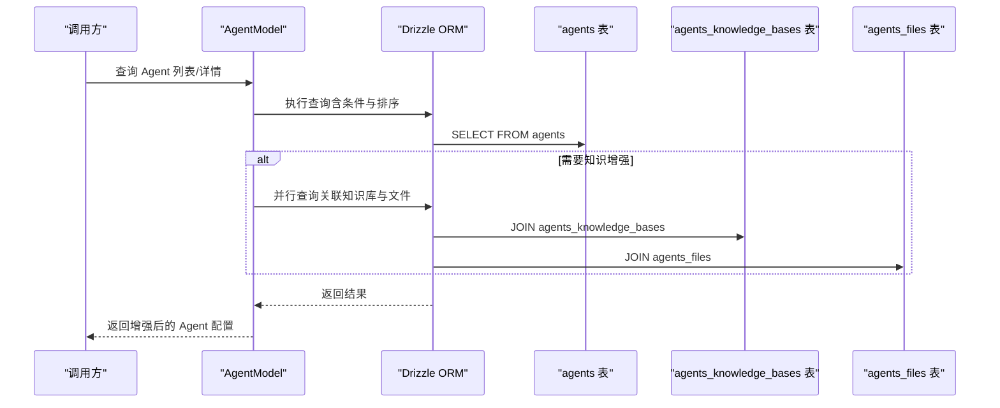
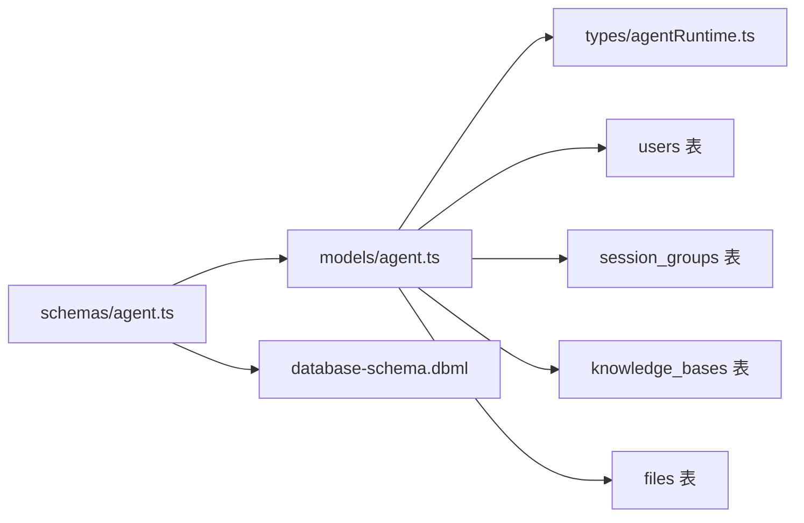

# Agent 实体模型

<cite>
**本文引用的文件**
- [database-schema.dbml](file://docs/development/database-schema.dbml)
- [agent.ts（模式定义）](file://packages/database/src/schemas/agent.ts)
- [agent.ts（模型实现）](file://packages/database/src/models/agent.ts)
- [agentRuntime.ts（运行时错误类型）](file://packages/types/src/agentRuntime.ts)
- [0021_add_agent_opening_settings.sql](file://packages/database/migrations/0021_add_agent_opening_settings.sql)
- [0009_snapshot.json](file://packages/database/migrations/meta/0009_snapshot.json)
- [0069_snapshot.json](file://packages/database/migrations/meta/0069_snapshot.json)
- [0064_snapshot.json](file://packages/database/migrations/meta/0064_snapshot.json)
- [0045_snapshot.json](file://packages/database/migrations/meta/0045_snapshot.json)
- [0084_snapshot.json](file://packages/database/migrations/meta/0084_snapshot.json)
</cite>

## 目录
1. [简介](#简介)
2. [项目结构](#项目结构)
3. [核心组件](#核心组件)
4. [架构总览](#架构总览)
5. [详细组件分析](#详细组件分析)
6. [依赖分析](#依赖分析)
7. [性能考量](#性能考量)
8. [故障排查指南](#故障排查指南)
9. [结论](#结论)
10. [附录：字段说明与操作示例](#附录字段说明与操作示例)

## 简介
本文件系统性梳理 Agent 实体模型的设计与实现，覆盖数据库层面的主键生成、唯一索引、外键约束，以及核心字段与高级配置字段的语义与用途；解释虚拟 Agent 与固定 Agent 的差异，以及 openingMessage 与 openingQuestions 的作用；阐明 Agent 与 User、KnowledgeBase、File、SessionGroup 的关系映射与多对多中间表设计；并提供字段说明表与数据库操作示例路径。

## 项目结构
围绕 Agent 的相关文件主要分布在以下位置：
- 数据库模式与迁移：docs/development/database-schema.dbml、packages/database/migrations
- 模式定义（Drizzle ORM）：packages/database/src/schemas/agent.ts
- 模型实现（业务封装）：packages/database/src/models/agent.ts
- 运行时错误类型：packages/types/src/agentRuntime.ts

```mermaid
graph TB
subgraph "数据库层"
AG["agents 表"]
AK["agents_knowledge_bases 中间表"]
AF["agents_files 中间表"]
U["users 表"]
KB["knowledge_bases 表"]
F["files 表"]
SG["session_groups 表"]
end
subgraph "应用层"
M["AgentModel业务模型"]
end
U <- --> AG
AG <- --> AK
KB <- --> AK
AG <- --> AF
F <- --> AF
SG -.-> AG
M --> AG
M --> AK
M --> AF
```

图表来源
- [database-schema.dbml](file://docs/development/database-schema.dbml#L1-L80)
- [agent.ts（模式定义）](file://packages/database/src/schemas/agent.ts#L30-L84)
- [agent.ts（模式定义）](file://packages/database/src/schemas/agent.ts#L95-L142)
- [agent.ts（模型实现）](file://packages/database/src/models/agent.ts#L1-L576)

章节来源
- [database-schema.dbml](file://docs/development/database-schema.dbml#L1-L80)
- [agent.ts（模式定义）](file://packages/database/src/schemas/agent.ts#L30-L84)
- [agent.ts（模式定义）](file://packages/database/src/schemas/agent.ts#L95-L142)
- [agent.ts（模型实现）](file://packages/database/src/models/agent.ts#L1-L50)

## 核心组件
- agents 表：存储 Agent 的元数据与配置，包含主键、唯一索引、外键约束及时间戳。
- agents_knowledge_bases 中间表：Agent 与 KnowledgeBase 的多对多关联。
- agents_files 中间表：Agent 与 File 的多对多关联。
- AgentModel：封装查询、创建、更新、删除、复制、知识增强等业务逻辑。

章节来源
- [agent.ts（模式定义）](file://packages/database/src/schemas/agent.ts#L30-L84)
- [agent.ts（模式定义）](file://packages/database/src/schemas/agent.ts#L95-L142)
- [agent.ts（模型实现）](file://packages/database/src/models/agent.ts#L21-L576)

## 架构总览
Agent 的数据流从应用层的 AgentModel 出发，通过 Drizzle ORM 访问 agents 及其关联表；同时通过中间表实现与 KnowledgeBase、File 的多对多关系，并可选地与 SessionGroup 建立一对多关系。



图表来源
- [agent.ts（模型实现）](file://packages/database/src/models/agent.ts#L45-L151)
- [agent.ts（模式定义）](file://packages/database/src/schemas/agent.ts#L95-L142)

## 详细组件分析

### 数据库表设计与约束
- 主键与标识
  - agents.id：主键，UUID 生成器，默认非空。
  - agents_knowledge_bases、agents_files：复合主键，确保唯一组合。
- 唯一索引
  - (client_id, user_id)：保证同一用户下 client_id 唯一。
  - (slug, user_id)：保证同一用户下 slug 唯一。
- 外键约束
  - agents.user_id → users.id（级联删除）。
  - agents.session_group_id → session_groups.id（删除时设为空）。
  - agents_knowledge_bases.agent_id → agents.id（级联删除）。
  - agents_knowledge_bases.knowledge_base_id → knowledge_bases.id（级联删除）。
  - agents_knowledge_bases.user_id → users.id（级联删除）。
  - agents_files.file_id → files.id（级联删除）。
  - agents_files.agent_id → agents.id（级联删除）。
  - agents_files.user_id → users.id（级联删除）。
- 时间戳
  - agents 表包含 created_at、updated_at、accessed_at 默认值与自动更新行为。

章节来源
- [database-schema.dbml](file://docs/development/database-schema.dbml#L1-L80)
- [agent.ts（模式定义）](file://packages/database/src/schemas/agent.ts#L30-L84)
- [agent.ts（模式定义）](file://packages/database/src/schemas/agent.ts#L95-L142)
- [0009_snapshot.json](file://packages/database/migrations/meta/0009_snapshot.json#L381-L432)
- [0069_snapshot.json](file://packages/database/migrations/meta/0069_snapshot.json#L388-L427)
- [0064_snapshot.json](file://packages/database/migrations/meta/0064_snapshot.json#L388-L427)
- [0045_snapshot.json](file://packages/database/migrations/meta/0045_snapshot.json#L438-L477)
- [0084_snapshot.json](file://packages/database/migrations/meta/0084_snapshot.json#L8006-L8038)

### 字段说明与用途
- 基础字段
  - id：Agent 唯一标识（主键）。
  - slug：友好标识，配合 user_id 唯一。
  - title/description：标题与描述。
  - avatar/backgroundColor：头像与背景色。
  - tags：标签数组（JSONB）。
  - editorData：编辑器数据（JSONB）。
  - clientId：客户端标识（唯一索引与 user_id 联合唯一）。
  - userId：所属用户（外键，级联删除）。
  - sessionGroupId：会话组标识（外键，删除时设为空）。
  - virtual/pinned：是否为虚拟 Agent、是否置顶。
  - openingMessage/openingQuestions：首次消息与引导问题（数组）。
  - created_at/updated_at/accessed_at：时间戳。
- 高级配置字段
  - marketIdentifier：市场标识符。
  - plugins：插件列表（JSONB）。
  - agencyConfig：智能体编排配置（JSONB）。
  - chatConfig：聊天配置（JSONB，使用专用 Schema）。
  - fewShots：示例对话（JSONB）。
  - model/provider/systemRole/tts：模型、提供商、系统角色、语音合成配置。
  - params：动态参数（JSONB，默认空对象）。

章节来源
- [database-schema.dbml](file://docs/development/database-schema.dbml#L1-L80)
- [agent.ts（模式定义）](file://packages/database/src/schemas/agent.ts#L30-L84)
- [0021_add_agent_opening_settings.sql](file://packages/database/migrations/0021_add_agent_opening_settings.sql#L1-L2)

### 虚拟 Agent 与固定 Agent
- 固定 Agent：通常与会话绑定，具备会话生命周期管理，支持删除时级联清理会话与消息。
- 虚拟 Agent：不绑定会话，主要用于群成员、内置助手等场景，创建时不生成会话，删除时仅删除记录本身。
- 区分方式：通过 virtual 字段或是否存在会话关联判断。

章节来源
- [agent.ts（模型实现）](file://packages/database/src/models/agent.ts#L45-L74)
- [agent.ts（模型实现）](file://packages/database/src/models/agent.ts#L251-L293)
- [agent.ts（模型实现）](file://packages/database/src/models/agent.ts#L523-L574)

### openingMessage 与 openingQuestions
- openingMessage：Agent 首次对话显示的消息内容。
- openingQuestions：Agent 首次对话显示的引导问题数组。
- 作用：提升用户体验，提供初始交互入口。

章节来源
- [0021_add_agent_opening_settings.sql](file://packages/database/migrations/0021_add_agent_opening_settings.sql#L1-L2)
- [agent.ts（模式定义）](file://packages/database/src/schemas/agent.ts#L67-L68)

### 关系映射与中间表设计
- Agent ↔ KnowledgeBase：多对多，中间表 agents_knowledge_bases，包含启用状态与用户维度。
- Agent ↔ File：多对多，中间表 agents_files，包含启用状态与用户维度。
- Agent → SessionGroup：一对多（外键，删除时设为空）。
- Agent → User：多对一（外键，级联删除）。

```mermaid
erDiagram
USERS {
text id PK
}
SESSION_GROUPS {
text id PK
}
AGENTS {
text id PK
text slug
text title
text description
text avatar
text background_color
text market_identifier
text client_id
text user_id FK
text session_group_id FK
boolean virtual
boolean pinned
text opening_message
text[] opening_questions
jsonb tags
jsonb plugins
jsonb agency_config
jsonb chat_config
jsonb few_shots
text model
jsonb params
text provider
text system_role
jsonb tts
}
KNOWLEDGE_BASES {
text id PK
}
FILES {
text id PK
}
USERS ||--o{ AGENTS : "拥有"
SESSION_GROUPS ||--o{ AGENTS : "归属"
AGENTS ||--o{| KNOWLEDGE_BASES : "关联(中间表)"
AGENTS ||--o{| FILES : "关联(中间表)"
```

图表来源
- [database-schema.dbml](file://docs/development/database-schema.dbml#L1-L80)
- [agent.ts（模式定义）](file://packages/database/src/schemas/agent.ts#L30-L84)
- [agent.ts（模式定义）](file://packages/database/src/schemas/agent.ts#L95-L142)

## 依赖分析
- 模式层依赖
  - agents 表依赖 users、session_groups。
  - 中间表依赖 agents、knowledge_bases/files/users。
- 模型层依赖
  - AgentModel 依赖 agents、agents_knowledge_bases、agentsFiles、knowledgeBases、files、sessions、agentsToSessions。
- 运行时错误类型
  - agentRuntime.ts 定义 Agent 运行时错误枚举，供上层业务处理。



图表来源
- [agent.ts（模式定义）](file://packages/database/src/schemas/agent.ts#L30-L84)
- [agent.ts（模型实现）](file://packages/database/src/models/agent.ts#L1-L50)
- [agentRuntime.ts（运行时错误类型）](file://packages/types/src/agentRuntime.ts#L1-L48)

章节来源
- [agent.ts（模式定义）](file://packages/database/src/schemas/agent.ts#L30-L84)
- [agent.ts（模型实现）](file://packages/database/src/models/agent.ts#L1-L50)
- [agentRuntime.ts（运行时错误类型）](file://packages/types/src/agentRuntime.ts#L1-L48)

## 性能考量
- 查询优化
  - 使用联合唯一索引 (client_id, user_id) 与 (slug, user_id) 加速定位。
  - 对 userId、title、description、session_group_id 建立普通索引，支撑过滤与排序。
- 关联查询
  - 知识增强采用并行查询 agents_knowledge_bases 与 agents_files，减少往返次数。
- 写入优化
  - 批量插入虚拟 Agent 以降低事务开销。
  - 去重插入 agents_files 时先查询已存在项，避免重复写入。

章节来源
- [agent.ts（模式定义）](file://packages/database/src/schemas/agent.ts#L76-L84)
- [agent.ts（模型实现）](file://packages/database/src/models/agent.ts#L122-L151)
- [agent.ts（模型实现）](file://packages/database/src/models/agent.ts#L209-L233)

## 故障排查指南
- 常见运行时错误类型
  - 模型未找到、配额不足、权限拒绝、上下文窗口超限、提供商凭据无效、流式分片错误、图像生成失败等。
- 排查建议
  - 核对 provider/model/params 是否正确配置。
  - 检查用户配额与提供商密钥有效性。
  - 查看 AgentModel 的更新/查询日志，确认 userId 与 agentId 条件匹配。

章节来源
- [agentRuntime.ts（运行时错误类型）](file://packages/types/src/agentRuntime.ts#L1-L48)
- [agent.ts（模型实现）](file://packages/database/src/models/agent.ts#L346-L457)

## 结论
Agent 实体模型通过清晰的主键、唯一索引与外键约束，结合中间表实现与知识库、文件的多对多关系，并通过 AgentModel 提供完善的 CRUD 与知识增强能力。虚拟 Agent 与固定 Agent 的区分满足不同使用场景，openingMessage 与 openingQuestions 则提升了初始交互体验。整体设计兼顾扩展性与性能，适合在多租户与复杂业务场景中稳定演进。

## 附录：字段说明与操作示例

### 字段说明表
- 基础字段
  - id：主键，UUID。
  - slug：varchar(100)，唯一索引(user_id, slug)。
  - title/description：varchar(255)/varchar(1000)。
  - avatar/backgroundColor：text。
  - tags：jsonb，默认[]。
  - editorData：jsonb。
  - clientId：text，唯一索引(user_id, clientId)。
  - userId：text，NOT NULL，FK(users.id)，级联删除。
  - sessionGroupId：text，FK(session_groups.id)，删除设空。
  - virtual/pinned：boolean，默认false/默认false。
  - openingMessage：text。
  - openingQuestions：text[]，默认{}。
  - created_at/updated_at/accessed_at：timestamp with time zone。
- 高级配置字段
  - marketIdentifier：text。
  - plugins：jsonb。
  - agencyConfig：jsonb。
  - chatConfig：jsonb，使用专用 Schema。
  - fewShots：jsonb。
  - model/provider/systemRole/tts：text/jsonb。
  - params：jsonb，默认{}。

章节来源
- [database-schema.dbml](file://docs/development/database-schema.dbml#L1-L80)
- [agent.ts（模式定义）](file://packages/database/src/schemas/agent.ts#L30-L84)
- [0021_add_agent_opening_settings.sql](file://packages/database/migrations/0021_add_agent_opening_settings.sql#L1-L2)

### 数据库操作示例（路径）
- 创建 Agent（不含会话）
  - 示例路径：[agent.ts（模型实现）](file://packages/database/src/models/agent.ts#L312-L325)
- 批量创建虚拟 Agent
  - 示例路径：[agent.ts（模型实现）](file://packages/database/src/models/agent.ts#L331-L344)
- 查询非虚拟 Agent（关键词搜索）
  - 示例路径：[agent.ts（模型实现）](file://packages/database/src/models/agent.ts#L45-L74)
- 获取 Agent 配置（含知识增强）
  - 示例路径：[agent.ts（模型实现）](file://packages/database/src/models/agent.ts#L30-L38)
- 删除 Agent（含会话级联）
  - 示例路径：[agent.ts（模型实现）](file://packages/database/src/models/agent.ts#L251-L280)
- 批量删除（仅记录）
  - 示例路径：[agent.ts（模型实现）](file://packages/database/src/models/agent.ts#L287-L293)
- 关联知识库
  - 新增：[agent.ts（模型实现）](file://packages/database/src/models/agent.ts#L171-L182)
  - 删除：[agent.ts（模型实现）](file://packages/database/src/models/agent.ts#L184-L194)
  - 切换启用状态：[agent.ts（模型实现）](file://packages/database/src/models/agent.ts#L196-L207)
- 关联文件
  - 新增：[agent.ts（模型实现）](file://packages/database/src/models/agent.ts#L209-L233)
  - 删除：[agent.ts（模型实现）](file://packages/database/src/models/agent.ts#L235-L245)
  - 切换启用状态：[agent.ts（模型实现）](file://packages/database/src/models/agent.ts#L295-L306)
- 更新 Agent 配置（含 params 合并策略）
  - 示例路径：[agent.ts（模型实现）](file://packages/database/src/models/agent.ts#L399-L457)
- 复制 Agent
  - 示例路径：[agent.ts（模型实现）](file://packages/database/src/models/agent.ts#L476-L516)
- 获取内置 Agent（不存在则创建）
  - 示例路径：[agent.ts（模型实现）](file://packages/database/src/models/agent.ts#L523-L574)