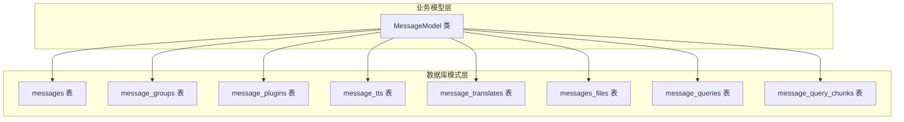
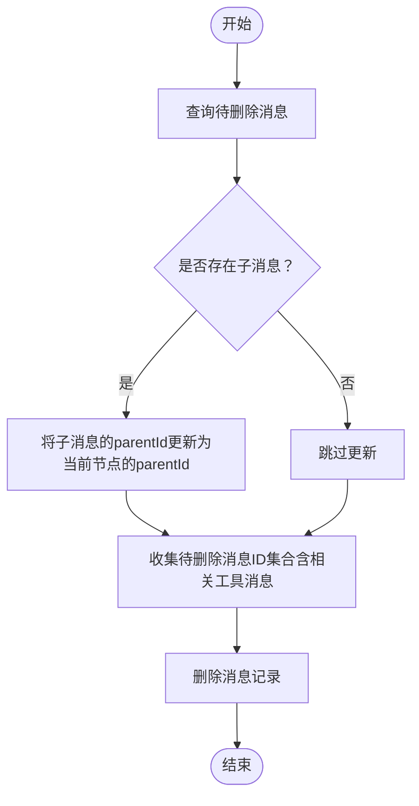
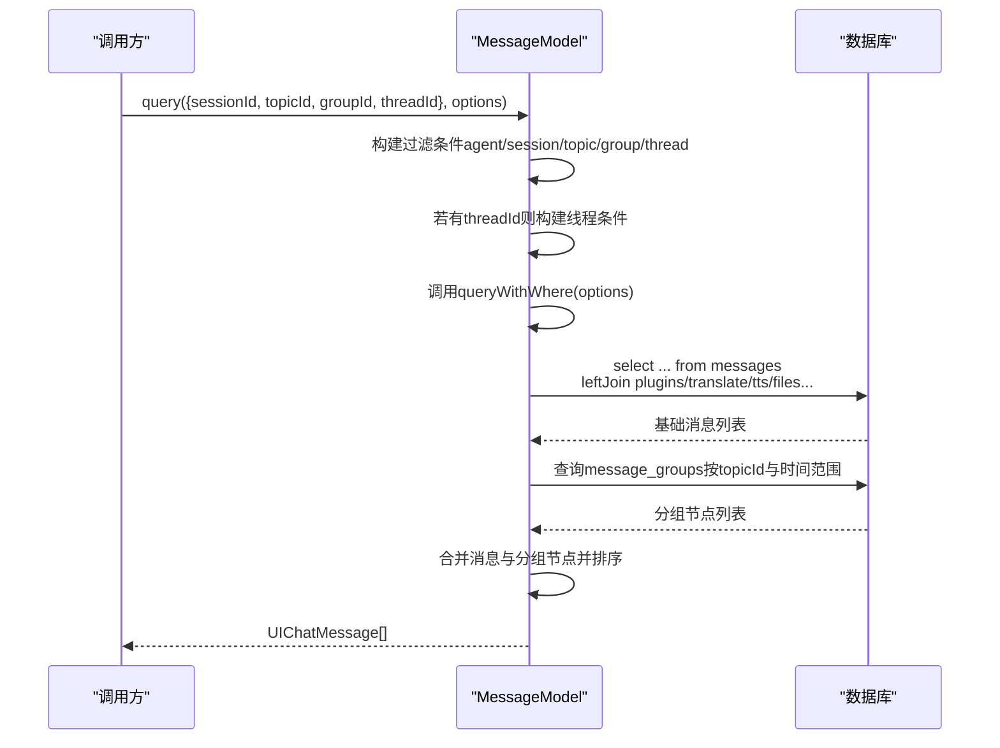
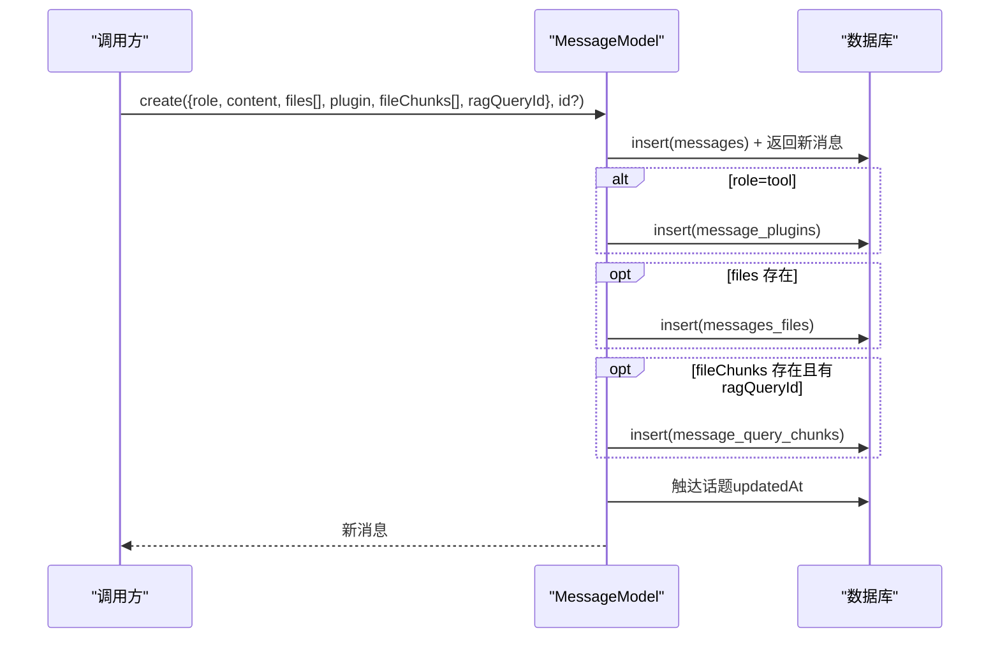
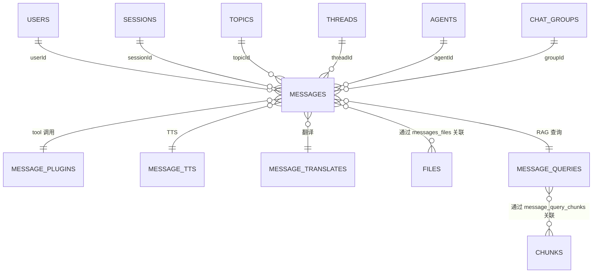

# Message 实体模型

<cite>
**本文档引用的文件**
- [packages/database/src/schemas/message.ts](file://packages/database/src/schemas/message.ts)
- [packages/database/src/models/message.ts](file://packages/database/src/models/message.ts)
- [packages/database/src/models/__tests__/messages/message.create.test.ts](file://packages/database/src/models/__tests__/messages/message.create.test.ts)
- [packages/database/src/models/__tests__/messages/message.query.test.ts](file://packages/database/src/models/__tests__/messages/message.query.test.ts)
- [packages/const/src/message.ts](file://packages/const/src/message.ts)
</cite>

## 目录

1. [简介](#简介)
2. [项目结构](#项目结构)
3. [核心组件](#核心组件)
4. [架构总览](#架构总览)
5. [详细组件分析](#详细组件分析)
6. [依赖关系分析](#依赖关系分析)
7. [性能考量](#性能考量)
8. [故障排查指南](#故障排查指南)
9. [结论](#结论)
10. [附录](#附录)

## 简介

本文件系统性梳理 Message 实体模型的设计理念与实现细节，覆盖消息类型分类（user、assistant、system、function、tool）、核心字段语义、嵌套关系与消息树结构、内容数据结构（文本、工具调用、文件附件等）、与 Topic、Agent、User 的关系映射，以及消息的查询、插入、更新的完整示例与最佳实践。

## 项目结构

Message 模型由两部分组成：

- 数据库模式层：定义表结构、索引、外键约束与枚举值
- 业务模型层：封装查询、插入、更新、删除等操作，提供事务保证与多表关联转换



图表来源

- [packages/database/src/schemas/message.ts](file://packages/database/src/schemas/message.ts#L86-L153)
- [packages/database/src/models/message.ts](file://packages/database/src/models/message.ts#L97-L104)

章节来源

- [packages/database/src/schemas/message.ts](file://packages/database/src/schemas/message.ts#L1-L315)
- [packages/database/src/models/message.ts](file://packages/database/src/models/message.ts#L97-L104)

## 核心组件

- 消息表（messages）：承载对话消息主体，支持角色、内容、工具调用、元数据、模型 / 提供商信息、父子关系、话题 / 会话 / 线程 / 代理 / 群组等关联
- 消息分组表（message_groups）：用于并行 / 压缩场景的消息容器，支持父分组与父消息引用
- 插件消息表（message_plugins）：存储工具调用相关扩展信息（插件标识、参数、干预状态等）
- TTS 表（message_tts）：消息对应的语音合成产物
- 翻译表（message_translates）：消息的翻译内容
- 文件关联表（messages_files）：消息与文件的多对多关联
- RAG 查询表（message_queries）：消息的检索重写查询
- RAG 查询块关联（message_query_chunks）：消息与检索块的相似度关联

章节来源

- [packages/database/src/schemas/message.ts](file://packages/database/src/schemas/message.ts#L86-L153)
- [packages/database/src/schemas/message.ts](file://packages/database/src/schemas/message.ts#L156-L203)
- [packages/database/src/schemas/message.ts](file://packages/database/src/schemas/message.ts#L205-L226)
- [packages/database/src/schemas/message.ts](file://packages/database/src/schemas/message.ts#L230-L248)
- [packages/database/src/schemas/message.ts](file://packages/database/src/schemas/message.ts#L250-L274)
- [packages/database/src/schemas/message.ts](file://packages/database/src/schemas/message.ts#L278-L295)
- [packages/database/src/schemas/message.ts](file://packages/database/src/schemas/message.ts#L300-L314)

## 架构总览

消息模型通过统一的业务模型类对外提供一致的查询与变更接口，内部以事务包裹关键写操作，确保一致性与原子性；查询侧通过多表 JOIN 将消息与其扩展信息（插件、翻译、TTS、文件、RAG 块）聚合为 UI 友好的结构。

```mermaid
classDiagram
class MessageModel {
+query(params, options) UIChatMessage[]
+queryWithWhere(options) UIChatMessage[]
+queryByIds(ids, options) UIChatMessage[]
+findById(id) DBMessageItem
+create(params, id) DBMessageItem
+batchCreate(messages) void
+update(id, params) {success : boolean}
+updateMetadata(id, metadata) void
+updateToolMessage(id, params) {success : boolean}
+updateToolArguments(toolCallId, args) {success : boolean}
+updateTranslate(id, translate) void
+updateTTS(id, tts) void
+updateMessageRAG(id, payload) void
+deleteMessage(id) void
+deleteMessages(ids) void
+addFiles(messageId, fileIds) {success : boolean}
+deleteMessageTranslate(id) void
+deleteMessageTTS(id) void
+deleteMessageQuery(id) void
+deleteMessagesBySession(sessionId, topicId, groupId) void
+batchDeleteByAgentId(agentId) void
}
class Messages {
<<table>>
}
class MessagePlugins {
<<table>>
}
class MessageTTS {
<<table>>
}
class MessageTranslates {
<<table>>
}
class MessagesFiles {
<<table>>
}
class MessageQueries {
<<table>>
}
class MessageQueryChunks {
<<table>>
}
class MessageGroups {
<<table>>
}
MessageModel --> Messages : "读写"
MessageModel --> MessagePlugins : "读写"
MessageModel --> MessageTTS : "读写"
MessageModel --> MessageTranslates : "读写"
MessageModel --> MessagesFiles : "读写"
MessageModel --> MessageQueries : "读写"
MessageModel --> MessageQueryChunks : "读写"
MessageModel --> MessageGroups : "读写"
```

图表来源

- [packages/database/src/models/message.ts](file://packages/database/src/models/message.ts#L97-L1834)
- [packages/database/src/schemas/message.ts](file://packages/database/src/schemas/message.ts#L86-L153)

## 详细组件分析

### 消息类型与角色

- 角色字段（role）用于区分消息来源与用途，常见取值包括：
  - user：用户输入
  - assistant：助手 / 模型回复
  - system：系统提示词
  - tool：工具执行结果
  - 其他扩展角色（如 task、function 等，依据业务需要扩展）

这些角色在查询与渲染时决定 UI 展示与交互行为。

章节来源

- [packages/database/src/models/message.ts](file://packages/database/src/models/message.ts#L125-L193)
- [packages/database/src/models/message.ts](file://packages/database/src/models/message.ts#L210-L530)

### 核心字段与语义

- id：消息唯一标识，自动生成
- role：消息角色（user、assistant、system、tool 等）
- content：消息文本内容
- editorData：富文本编辑器数据（可选）
- summary：摘要（可选）
- reasoning：推理链路数据（可选）
- search：检索相关数据（可选）
- metadata：通用元数据（可选）
- model/provider：使用的模型与提供商
- favorite：是否收藏（用于压缩分组中的精选消息）
- error：错误信息（可选）
- tools：工具调用数组（用于 assistant 消息携带工具调用）
- traceId/observationId：可观测性追踪标识
- clientId：客户端生成的去重 / 幂等标识
- userId/sessionId/topicId/threadId/agentId/groupId/targetId/messageGroupId：多维关联字段
- parentId：父子消息引用，形成消息树
- quotaId：配额引用（可选）
- createdAt/updatedAt：时间戳

章节来源

- [packages/database/src/schemas/message.ts](file://packages/database/src/schemas/message.ts#L86-L153)

### 嵌套关系与消息树

- 父子关系：通过 parentId 字段建立一对一的父子引用，支持树形结构维护
- 线程关系：threadId 用于将消息归入特定线程，配合线程源消息构建上下文
- 分组关系：messageGroupId 将消息归入消息分组，用于并行 / 压缩展示
- 删除策略：删除节点时，子节点的 parentId 会被更新为当前节点的父节点，保持树结构稳定



图表来源

- [packages/database/src/models/message.ts](file://packages/database/src/models/message.ts#L1614-L1658)

章节来源

- [packages/database/src/models/message.ts](file://packages/database/src/models/message.ts#L125-L126)
- [packages/database/src/models/message.ts](file://packages/database/src/models/message.ts#L1614-L1658)

### 内容数据结构

- 文本内容：content 字段承载纯文本或序列化后的结构化文本
- 工具调用：assistant 消息的 tools 字段保存工具调用列表；对应插件表记录插件标识、参数、干预状态、状态与错误
- 文件附件：通过 messages_files 关联消息与文件，查询时自动映射为 fileList、imageList、videoList
- RAG 查询与块：message_queries 记录检索重写查询；message_query_chunks 记录消息与检索块的相似度关联
- 翻译与 TTS：message_translates 与 message_tts 分别记录翻译与语音合成信息

章节来源

- [packages/database/src/schemas/message.ts](file://packages/database/src/schemas/message.ts#L156-L203)
- [packages/database/src/schemas/message.ts](file://packages/database/src/schemas/message.ts#L205-L226)
- [packages/database/src/schemas/message.ts](file://packages/database/src/schemas/message.ts#L230-L248)
- [packages/database/src/schemas/message.ts](file://packages/database/src/schemas/message.ts#L250-L274)
- [packages/database/src/schemas/message.ts](file://packages/database/src/schemas/message.ts#L278-L295)
- [packages/database/src/schemas/message.ts](file://packages/database/src/schemas/message.ts#L300-L314)
- [packages/database/src/models/message.ts](file://packages/database/src/models/message.ts#L210-L530)

### 与 Topic、Agent、User 的关系映射

- 用户维度：所有消息均绑定 userId，确保数据隔离
- 话题维度：topicId 关联到 Topic，用于按主题组织消息
- 会话维度：sessionId 关联到 Session，用于按会话组织消息
- 线程维度：threadId 关联到 Thread，用于任务 / 线程上下文
- 代理维度：agentId 关联到 Agent，用于按代理组织消息
- 群组维度：groupId 关联到 ChatGroup，用于群聊场景
- 客户端幂等：clientId 与 userId 组成唯一索引，避免重复插入

章节来源

- [packages/database/src/schemas/message.ts](file://packages/database/src/schemas/message.ts#L115-L136)
- [packages/database/src/schemas/message.ts](file://packages/database/src/schemas/message.ts#L140-L151)
- [packages/database/src/schemas/message.ts](file://packages/database/src/schemas/message.ts#L70-L77)

### 查询 API 与最佳实践

- query：高层查询入口，支持按 sessionId、topicId、groupId、threadId、agentId 等条件组合过滤
- queryWithWhere：底层查询入口，支持自定义 where 条件与分页
- queryByIds：按消息 ID 列表批量查询，复用相同转换逻辑
- 线程查询：buildThreadQueryCondition 与 getThreadParentMessages 支持线程上下文的父消息与线程消息合并
- 分页与去重：查询中对消息分组节点采用时间范围过滤，避免分页时重复显示



图表来源

- [packages/database/src/models/message.ts](file://packages/database/src/models/message.ts#L125-L193)
- [packages/database/src/models/message.ts](file://packages/database/src/models/message.ts#L210-L530)
- [packages/database/src/models/message.ts](file://packages/database/src/models/message.ts#L800-L918)

章节来源

- [packages/database/src/models/message.ts](file://packages/database/src/models/message.ts#L125-L193)
- [packages/database/src/models/message.ts](file://packages/database/src/models/message.ts#L210-L530)
- [packages/database/src/models/message.ts](file://packages/database/src/models/message.ts#L800-L918)

### 插入与更新 API 与最佳实践

- create：支持自定义 ID、文件关联、工具插件、RAG 查询与块、时间戳等
- batchCreate：批量插入，自动触达话题更新时间
- update：支持图片文件追加、metadata 合并、插件状态与错误更新
- updateToolMessage：原子性更新工具消息内容、metadata、插件状态与错误
- updateToolArguments：通过 toolCallId 更新工具参数，同时同步父 assistant 消息的 tools 列表
- updateTranslate/updateTTS：翻译与 TTS 的增改
- updateMessageRAG：为已有消息补充 RAG 块关联



图表来源

- [packages/database/src/models/message.ts](file://packages/database/src/models/message.ts#L1235-L1309)

章节来源

- [packages/database/src/models/message.ts](file://packages/database/src/models/message.ts#L1235-L1309)
- [packages/database/src/models/message.ts](file://packages/database/src/models/message.ts#L1338-L1489)
- [packages/database/src/models/message.ts](file://packages/database/src/models/message.ts#L1492-L1561)
- [packages/database/src/models/message.ts](file://packages/database/src/models/message.ts#L1600-L1610)

### 删除 API 与最佳实践

- deleteMessage：删除单条消息及其相关工具消息，调整子节点父引用
- deleteMessages：批量删除，计算最终祖先并迁移子节点父引用
- deleteMessagesBySession/batchDeleteByAgentId：按会话或代理批量清理

章节来源

- [packages/database/src/models/message.ts](file://packages/database/src/models/message.ts#L1614-L1731)
- [packages/database/src/models/message.ts](file://packages/database/src/models/message.ts#L1770-L1812)

### 测试用例与示例参考

- 创建消息：验证角色、内容、自定义 ID、工具插件、文件、RAG 查询与块、时间戳等
- 批量创建：验证批量插入与话题更新时间
- 查询消息：验证分页、过滤、JOIN 扩展信息（翻译、TTS、文件、RAG 块）、线程上下文
- 更新消息：验证 metadata 合并、工具参数更新、翻译 / TTS 更新

章节来源

- [packages/database/src/models/**tests**/messages/message.create.test.ts](file://packages/database/src/models/__tests__/messages/message.create.test.ts#L69-L400)
- [packages/database/src/models/**tests**/messages/message.create.test.ts](file://packages/database/src/models/__tests__/messages/message.create.test.ts#L403-L454)
- [packages/database/src/models/**tests**/messages/message.create.test.ts](file://packages/database/src/models/__tests__/messages/message.create.test.ts#L456-L594)
- [packages/database/src/models/**tests**/messages/message.query.test.ts](file://packages/database/src/models/__tests__/messages/message.query.test.ts#L75-L784)

## 依赖关系分析

- 模式层依赖：各扩展表通过外键与 messages 关联，确保数据完整性
- 模型层依赖：MessageModel 统一管理事务、过滤条件、JOIN 聚合与 UI 结果转换
- 外部常量：消息常量（如线程占位符、加载标记等）用于前端渲染与控制流



图表来源

- [packages/database/src/schemas/message.ts](file://packages/database/src/schemas/message.ts#L86-L153)
- [packages/database/src/schemas/message.ts](file://packages/database/src/schemas/message.ts#L156-L203)
- [packages/database/src/schemas/message.ts](file://packages/database/src/schemas/message.ts#L205-L226)
- [packages/database/src/schemas/message.ts](file://packages/database/src/schemas/message.ts#L230-L248)
- [packages/database/src/schemas/message.ts](file://packages/database/src/schemas/message.ts#L250-L274)
- [packages/database/src/schemas/message.ts](file://packages/database/src/schemas/message.ts#L278-L295)
- [packages/database/src/schemas/message.ts](file://packages/database/src/schemas/message.ts#L300-L314)

章节来源

- [packages/database/src/schemas/message.ts](file://packages/database/src/schemas/message.ts#L1-L315)

## 性能考量

- 索引设计：按 userId、topicId、parentId、quotaId、agentId、groupId、messageGroupId 等常用过滤字段建立索引，提升查询效率
- 分页与时间窗口：分页时对消息分组节点采用时间范围过滤，避免重复与过度扫描
- 并行查询：queryByIds 使用 Promise.all 并行获取文件、块、查询与线程信息，降低延迟
- 事务边界：写操作（创建、更新、删除）均在事务内执行，保证一致性与回滚能力

章节来源

- [packages/database/src/schemas/message.ts](file://packages/database/src/schemas/message.ts#L139-L152)
- [packages/database/src/models/message.ts](file://packages/database/src/models/message.ts#L542-L788)
- [packages/database/src/models/message.ts](file://packages/database/src/models/message.ts#L1235-L1309)

## 故障排查指南

- 插件状态 / 参数包含空字节：创建工具消息时会对插件状态与参数进行空字节清理，避免 PostgreSQL 拒绝写入
- 线程查询无父消息：当线程缺少源消息时，回退为仅按 threadId 查询
- 翻译 / TTS 不存在：更新翻译 / TTS 时若不存在则插入，存在则更新
- 删除后树结构异常：删除消息会迁移子节点父引用，确保树结构稳定

章节来源

- [packages/database/src/models/**tests**/messages/message.create.test.ts](file://packages/database/src/models/__tests__/messages/message.create.test.ts#L207-L249)
- [packages/database/src/models/message.ts](file://packages/database/src/models/message.ts#L925-L951)
- [packages/database/src/models/message.ts](file://packages/database/src/models/message.ts#L1563-L1598)
- [packages/database/src/models/message.ts](file://packages/database/src/models/message.ts#L1614-L1658)

## 结论

Message 实体模型通过清晰的角色分类、完善的扩展表体系与严谨的事务封装，实现了从简单文本到复杂工具调用、文件与 RAG 的全栈支持。其查询与更新 API 在保证一致性的同时提供了灵活的过滤与聚合能力，适合在多会话、多主题、多代理与群组协作的复杂场景下稳定运行。

## 附录

- 常量参考：消息加载标记、线程占位符、欢迎引导 ID 等常量用于前端控制与渲染

章节来源

- [packages/const/src/message.ts](file://packages/const/src/message.ts#L1-L12)
