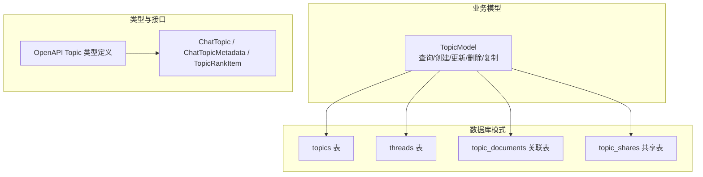
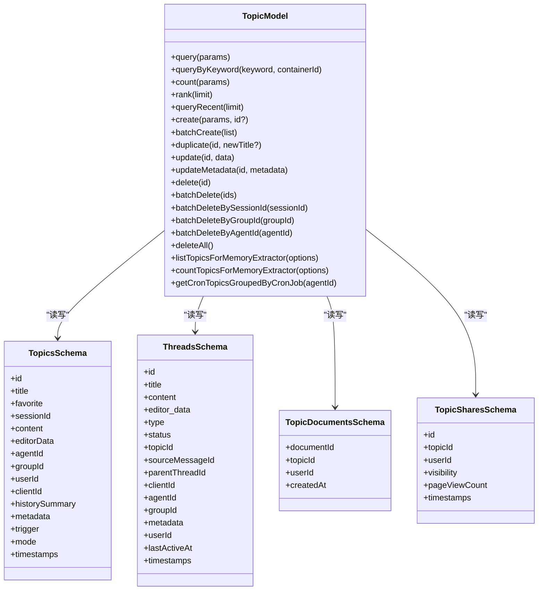
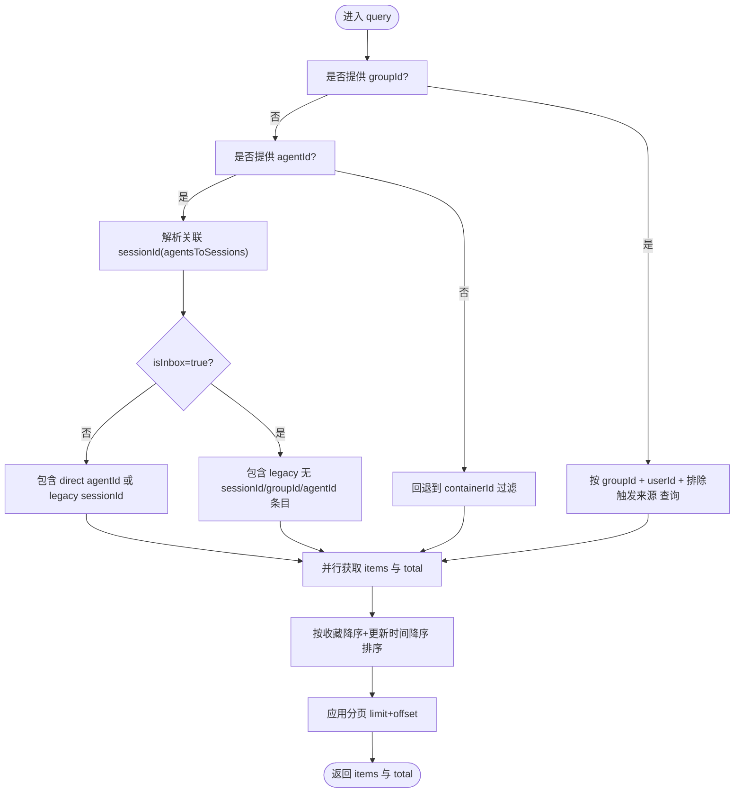
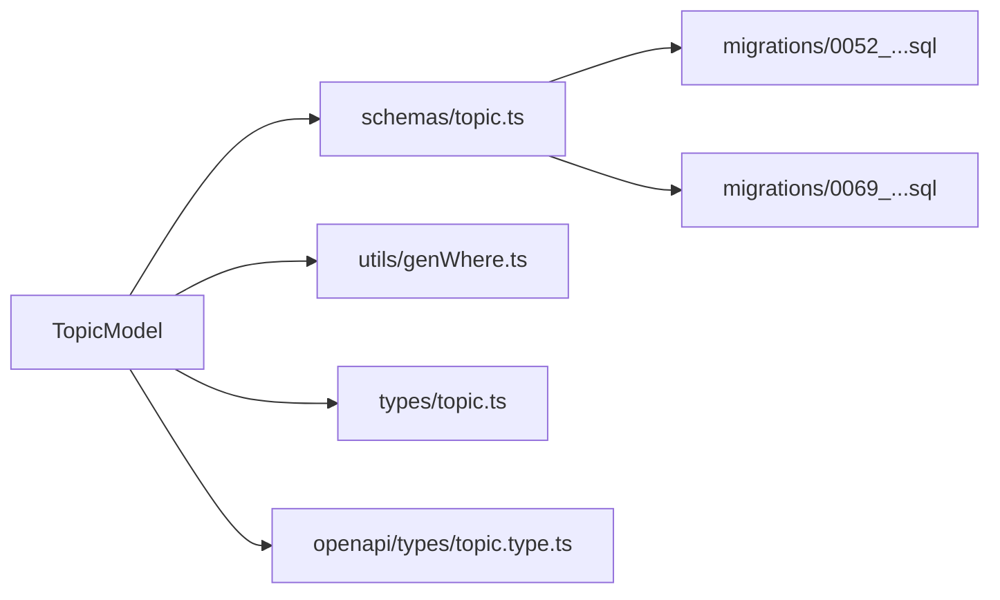

# Topic 实体模型

<cite>
**本文引用的文件**
- [packages/database/src/schemas/topic.ts](file://packages/database/src/schemas/topic.ts)
- [packages/database/src/models/topic.ts](file://packages/database/src/models/topic.ts)
- [packages/types/src/topic/topic.ts](file://packages/types/src/topic/topic.ts)
- [packages/openapi/src/types/topic.type.ts](file://packages/openapi/src/types/topic.type.ts)
- [packages/database/migrations/0052_topic_and_messages.sql](file://packages/database/migrations/0052_topic_and_messages.sql)
- [packages/database/migrations/0069_add_topic_shares_table.sql](file://packages/database/migrations/0069_add_topic_shares_table.sql)
- [packages/database/src/models/__tests__/topics/topic.create.test.ts](file://packages/database/src/models/__tests__/topics/topic.create.test.ts)
- [packages/database/src/models/__tests__/topics/topic.query.test.ts](file://packages/database/src/models/__tests__/topics/topic.query.test.ts)
- [packages/database/src/models/__tests__/topics/topic.update.test.ts](file://packages/database/src/models/__tests__/topics/topic.update.test.ts)
- [packages/database/src/models/__tests__/topics/topic.memoryExtractor.test.ts](file://packages/database/src/models/__tests__/topics/topic.memoryExtractor.test.ts)
</cite>

## 目录

1. [简介](#简介)
2. [项目结构](#项目结构)
3. [核心组件](#核心组件)
4. [架构总览](#架构总览)
5. [详细组件分析](#详细组件分析)
6. [依赖分析](#依赖分析)
7. [性能考量](#性能考量)
8. [故障排查指南](#故障排查指南)
9. [结论](#结论)
10. [附录](#附录)

## 简介

本文件系统性梳理 Topic 实体模型的设计理念、数据结构、生命周期管理与自动命名机制，并深入解析 Topic 与 Agent、User、Message 的关系映射，以及与 Threads、TopicDocument、TopicShare 的扩展关联。同时，文档覆盖 Topic 的搜索、排序、分页查询实现，以及创建、重命名（更新）、删除的完整流程与性能优化建议。

## 项目结构

Topic 模型由三层组成：

- 数据层：定义 topics、threads、topic_documents、topic_shares 表结构与索引
- 业务层：TopicModel 提供查询、创建、更新、删除、复制等操作
- 类型与接口层：统一 Topic 的对外类型定义与 API 参数 / 返回 Schema

图表来源

- [packages/database/src/schemas/topic.ts](file://packages/database/src/schemas/topic.ts#L23-L186)
- [packages/database/src/models/topic.ts](file://packages/database/src/models/topic.ts#L66-L816)
- [packages/types/src/topic/topic.ts](file://packages/types/src/topic/topic.ts#L43-L117)
- [packages/openapi/src/types/topic.type.ts](file://packages/openapi/src/types/topic.type.ts#L11-L95)

章节来源

- [packages/database/src/schemas/topic.ts](file://packages/database/src/schemas/topic.ts#L23-L186)
- [packages/database/src/models/topic.ts](file://packages/database/src/models/topic.ts#L66-L816)
- [packages/types/src/topic/topic.ts](file://packages/types/src/topic/topic.ts#L43-L117)
- [packages/openapi/src/types/topic.type.ts](file://packages/openapi/src/types/topic.type.ts#L11-L95)

## 核心组件

- topics 表：存储话题基本信息、触发来源、使用场景、元数据、收藏标记、所属会话 / 群组 / 代理等
- threads 表：话题下的线程（延续 / 独立 / 隔离等类型），支持父子线程关系
- topic_documents 关联表：话题与文档的多对多关系
- topic_shares 共享表：话题公开分享链接与访问统计
- TopicModel：封装 Topic 的增删改查、分页、排序、关键字检索、内存提取游标查询、按代理 / 群组 / 会话批量删除等
- 类型系统：ChatTopic、ChatTopicMetadata、TopicRankItem 等，统一前后端交互契约

章节来源

- [packages/database/src/schemas/topic.ts](file://packages/database/src/schemas/topic.ts#L23-L186)
- [packages/database/src/models/topic.ts](file://packages/database/src/models/topic.ts#L66-L816)
- [packages/types/src/topic/topic.ts](file://packages/types/src/topic/topic.ts#L43-L117)

## 架构总览

Topic 在数据库层面通过外键与用户、代理、会话、群组建立强约束关系；在业务层通过 TopicModel 统一处理跨版本兼容（新旧代理关系）与复杂查询；在接口层通过 OpenAPI 类型定义保证请求 / 响应一致性。

图表来源

- [packages/database/src/models/topic.ts](file://packages/database/src/models/topic.ts#L66-L816)
- [packages/database/src/schemas/topic.ts](file://packages/database/src/schemas/topic.ts#L23-L186)

## 详细组件分析

### 数据模型与字段语义

- 基础字段
  - id：话题唯一标识，自动生成
  - title：标题（可为空）
  - favorite：是否收藏
  - content：内容正文（可为空）
  - editorData：编辑器数据（JSONB）
  - historySummary：历史摘要（可为空）
  - metadata：元数据（JSONB），承载模型 / 提供商、工作目录、定时任务信息、用户记忆提取状态等
  - trigger：话题创建触发来源（如 cron、chat、api、eval 等）
  - mode：使用场景（如 temp、test、default）
  - timestamps：createdAt、updatedAt、accessedAt
- 外键关系
  - sessionId：指向 sessions.id（级联删除）
  - agentId：指向 agents.id（级联删除）
  - groupId：指向 chatGroups.id（级联删除）
  - userId：指向 users.id（级联删除）

章节来源

- [packages/database/src/schemas/topic.ts](file://packages/database/src/schemas/topic.ts#L23-L59)
- [packages/database/migrations/0052_topic_and_messages.sql](file://packages/database/migrations/0052_topic_and_messages.sql#L1-L10)

### 生命周期管理

- 创建：支持单条与批量创建，可选择指定 clientId 与消息集合绑定
- 更新：支持常规字段更新与元数据合并更新
- 删除：支持单条、批量、按会话 / 群组 / 代理维度批量删除，以及全量清空
- 复制：深拷贝话题及其消息链路（含工具调用 ID 映射与父消息引用修复）

章节来源

- [packages/database/src/models/topic.ts](file://packages/database/src/models/topic.ts#L413-L647)
- [packages/database/src/models/**tests**/topics/topic.create.test.ts](file://packages/database/src/models/__tests__/topics/topic.create.test.ts#L29-L162)
- [packages/database/src/models/**tests**/topics/topic.update.test.ts](file://packages/database/src/models/__tests__/topics/topic.update.test.ts#L26-L54)

### 自动命名机制

- 当前模型未内置 “自动命名” 逻辑；标题字段 title 可为空，由上层业务或外部服务决定何时填充
- 若需实现自动命名，可在创建前基于消息内容抽取首句 / 摘要生成标题，或结合 trigger/mode 等元信息进行命名策略化

章节来源

- [packages/database/src/schemas/topic.ts](file://packages/database/src/schemas/topic.ts#L29-L44)
- [packages/types/src/topic/topic.ts](file://packages/types/src/topic/topic.ts#L66-L73)

### 话题与 Agent/User 的关系映射

- 用户维度：所有操作均以 userId 作为安全边界
- 代理维度：支持直接 agentId 匹配与通过 agentsToSessions 关联的 legacy sessionId 匹配
- 群组 / 会话维度：通过 groupId/sessionId 进行容器过滤

章节来源

- [packages/database/src/models/topic.ts](file://packages/database/src/models/topic.ts#L76-L225)
- [packages/database/src/schemas/topic.ts](file://packages/database/src/schemas/topic.ts#L31-L37)

### 话题与 Message 的一对多关系

- topics.id → messages.topicId（外键约束）
- 查询时可按关键词在消息内容中匹配并回推话题列表
- 批量创建时可将消息集合一次性绑定到新话题

章节来源

- [packages/database/src/models/topic.ts](file://packages/database/src/models/topic.ts#L241-L299)
- [packages/database/src/models/topic.ts](file://packages/database/src/models/topic.ts#L415-L479)

### 话题与 Threads 的一对多关系

- threads.topicId → topics.id（外键约束）
- 支持线程类型（延续 / 独立 / 隔离 / 评估）与状态机管理

章节来源

- [packages/database/src/schemas/topic.ts](file://packages/database/src/schemas/topic.ts#L89-L106)

### 话题与 TopicDocument 的多对多关系

- topic_documents (documentId, topicId) 复合主键
- 支持文档 - 话题关联与按用户维度的权限控制

章节来源

- [packages/database/src/schemas/topic.ts](file://packages/database/src/schemas/topic.ts#L126-L149)

### 话题与 TopicShare 的一对多关系

- topic_shares.topic_id → topics.id（唯一索引，限制每个话题仅有一个分享记录）
- 支持私有 / 链接两种可见性与访问计数

章节来源

- [packages/database/src/schemas/topic.ts](file://packages/database/src/schemas/topic.ts#L157-L182)
- [packages/database/migrations/0069_add_topic_shares_table.sql](file://packages/database/migrations/0069_add_topic_shares_table.sql#L1-L23)

### 自动话题生成与摘要能力

- 模型未内建自动标题 / 摘要生成算法
- 可通过 metadata 中的 userMemoryExtractStatus 字段与 listTopicsForMemoryExtractor 游标查询配合外部任务完成 “用户记忆提取” 类功能
- 历史摘要字段 historySummary 可用于展示简要总结

章节来源

- [packages/database/src/models/topic.ts](file://packages/database/src/models/topic.ts#L698-L766)
- [packages/types/src/topic/topic.ts](file://packages/types/src/topic/topic.ts#L28-L58)

### 搜索、排序与分页查询

- 搜索
  - 标题模糊匹配（大小写不敏感）
  - 消息内容关键词匹配，再回推话题并去重合并
- 排序
  - 默认优先收藏（降序），其次按更新时间（降序）
- 分页
  - 使用 current 与 pageSize 计算 offset 并限制返回数量
- 高级过滤
  - agentId：兼容新旧代理关系（direct agentId 或 legacy sessionId）
  - groupId/containerId：按群组或容器过滤
  - excludeTriggers：排除特定触发来源
  - isInbox：包含遗留收件箱话题（无 sessionId/groupId/agentId）

图表来源

- [packages/database/src/models/topic.ts](file://packages/database/src/models/topic.ts#L76-L225)

章节来源

- [packages/database/src/models/topic.ts](file://packages/database/src/models/topic.ts#L76-L225)
- [packages/database/src/models/**tests**/topics/topic.query.test.ts](file://packages/database/src/models/__tests__/topics/topic.query.test.ts#L35-L210)

### 创建、重命名、删除的完整示例

- 创建
  - 单条：传入 title、agentId/sessionId、messages 等，返回话题并绑定消息
  - 批量：一次插入多个话题并批量更新消息 topicId
- 重命名 / 更新
  - update：更新标题、收藏、摘要、元数据等
  - updateMetadata：合并 JSONB 元数据，避免覆盖
- 删除
  - delete：单条删除
  - batchDelete：批量删除
  - 按容器删除：按 sessionId/groupId/agentId 批量删除

章节来源

- [packages/database/src/models/topic.ts](file://packages/database/src/models/topic.ts#L415-L647)
- [packages/database/src/models/**tests**/topics/topic.create.test.ts](file://packages/database/src/models/__tests__/topics/topic.create.test.ts#L29-L162)
- [packages/database/src/models/**tests**/topics/topic.update.test.ts](file://packages/database/src/models/__tests__/topics/topic.update.test.ts#L26-L125)

## 依赖分析

- TopicModel 对 topics、messages、agents、agentsToSessions、chatGroups、users 等表存在直接依赖
- OpenAPI 类型与 Topic 类型定义保持一致，确保前后端契约稳定
- 数据库迁移脚本逐步引入 agent_id、editor_data、content 等列并添加索引

图表来源

- [packages/database/src/models/topic.ts](file://packages/database/src/models/topic.ts#L20-L25)
- [packages/database/src/schemas/topic.ts](file://packages/database/src/schemas/topic.ts#L1-L22)
- [packages/types/src/topic/topic.ts](file://packages/types/src/topic/topic.ts#L1-L10)
- [packages/openapi/src/types/topic.type.ts](file://packages/openapi/src/types/topic.type.ts#L1-L7)
- [packages/database/migrations/0052_topic_and_messages.sql](file://packages/database/migrations/0052_topic_and_messages.sql#L1-L10)
- [packages/database/migrations/0069_add_topic_shares_table.sql](file://packages/database/migrations/0069_add_topic_shares_table.sql#L1-L23)

章节来源

- [packages/database/src/models/topic.ts](file://packages/database/src/models/topic.ts#L20-L25)
- [packages/database/src/schemas/topic.ts](file://packages/database/src/schemas/topic.ts#L1-L22)
- [packages/types/src/topic/topic.ts](file://packages/types/src/topic/topic.ts#L1-L10)
- [packages/openapi/src/types/topic.type.ts](file://packages/openapi/src/types/topic.type.ts#L1-L7)
- [packages/database/migrations/0052_topic_and_messages.sql](file://packages/database/migrations/0052_topic_and_messages.sql#L1-L10)
- [packages/database/migrations/0069_add_topic_shares_table.sql](file://packages/database/migrations/0069_add_topic_shares_table.sql#L1-L23)

## 性能考量

- 索引策略
  - topics_user_id_idx、topics_id_user_id_idx、topics_session_id_idx、topics_group_id_idx、topics_agent_id_idx、topics_trigger_idx 等，覆盖常见过滤与排序场景
  - GIN 索引 topics_extract_status_gin_idx 用于 JSONB 元数据中的 userMemoryExtractStatus 快速筛选
- 查询优化
  - 并行查询 items 与 total，减少往返
  - 使用 inArray 与子查询回推话题 ID，避免 N+1
- 写入优化
  - 批量创建 topics 与批量更新 messages.topicId，降低事务开销
- 元数据与向量字段
  - schema 中存在 title_vector/description_vector 字段，但当前模型未启用，若启用需额外迁移与向量化流程

章节来源

- [packages/database/src/schemas/topic.ts](file://packages/database/src/schemas/topic.ts#L46-L58)
- [packages/database/src/models/topic.ts](file://packages/database/src/models/topic.ts#L444-L479)

## 故障排查指南

- 无法查询到代理相关话题
  - 检查 agentsToSessions 是否存在对应关系；确认 isInbox 参数是否正确
- 更新失败或无结果
  - 确认 userId 与话题 userId 一致；检查字段名是否符合类型定义
- 元数据更新被覆盖
  - 使用 updateMetadata 合并策略，避免直接替换整个 metadata
- 内存提取游标异常
  - 检查 ignoreExtracted 选项与 metadata.userMemoryExtractStatus 字段值

章节来源

- [packages/database/src/models/topic.ts](file://packages/database/src/models/topic.ts#L618-L634)
- [packages/database/src/models/topic.ts](file://packages/database/src/models/topic.ts#L663-L680)
- [packages/database/src/models/**tests**/topics/topic.memoryExtractor.test.ts](file://packages/database/src/models/__tests__/topics/topic.memoryExtractor.test.ts#L22-L76)

## 结论

Topic 实体模型通过清晰的表结构、完善的索引与兼容性查询逻辑，支撑了从话题创建、消息绑定、到多维过滤与分页展示的完整链路。虽然未内置自动命名与摘要算法，但通过 metadata 与外部任务可灵活扩展。建议在生产环境中配合批量写入、并行查询与 GIN 索引进一步提升性能。

## 附录

- API 类型定义
  - 列表查询参数：agentId、excludeTriggers、groupId、isInbox、分页参数
  - 创建请求：agentId、clientId、favorite、groupId、title
  - 更新请求：favorite、historySummary、metadata、title
- 测试覆盖
  - 创建 / 批量创建 / 复制流程
  - 关键词搜索与去重合并
  - 元数据合并更新
  - 内存提取游标与计数

章节来源

- [packages/openapi/src/types/topic.type.ts](file://packages/openapi/src/types/topic.type.ts#L11-L95)
- [packages/database/src/models/**tests**/topics/topic.create.test.ts](file://packages/database/src/models/__tests__/topics/topic.create.test.ts#L29-L162)
- [packages/database/src/models/**tests**/topics/topic.query.test.ts](file://packages/database/src/models/__tests__/topics/topic.query.test.ts#L35-L210)
- [packages/database/src/models/**tests**/topics/topic.update.test.ts](file://packages/database/src/models/__tests__/topics/topic.update.test.ts#L26-L125)
- [packages/database/src/models/**tests**/topics/topic.memoryExtractor.test.ts](file://packages/database/src/models/__tests__/topics/topic.memoryExtractor.test.ts#L22-L76)
