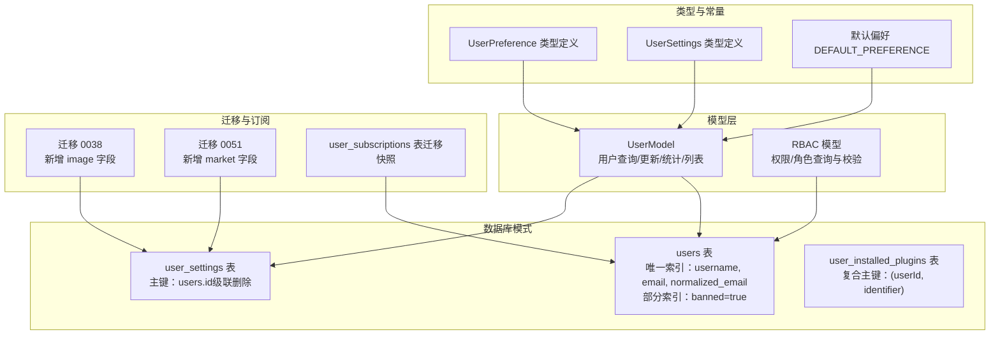
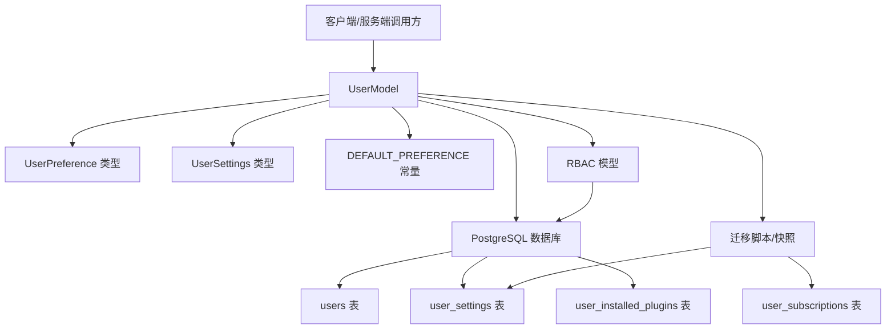
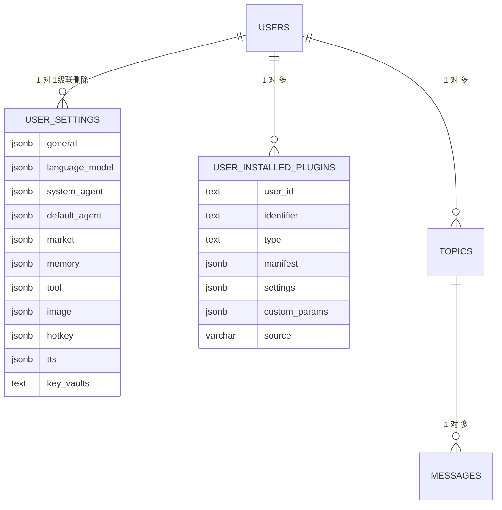
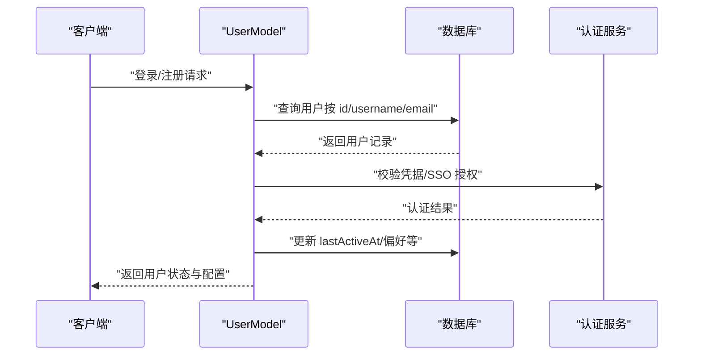
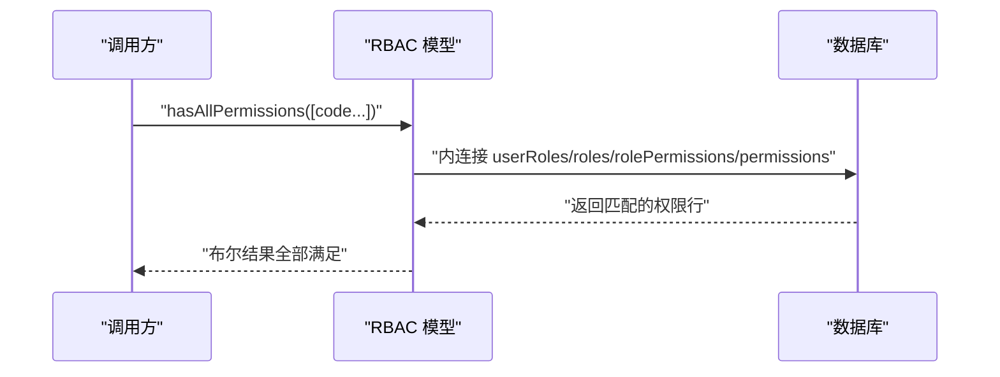
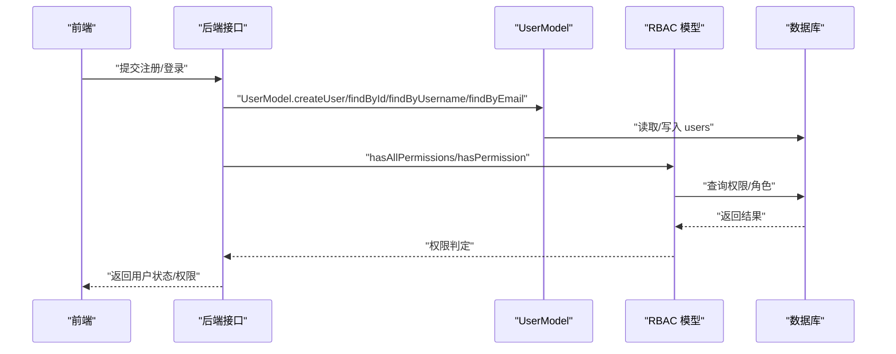
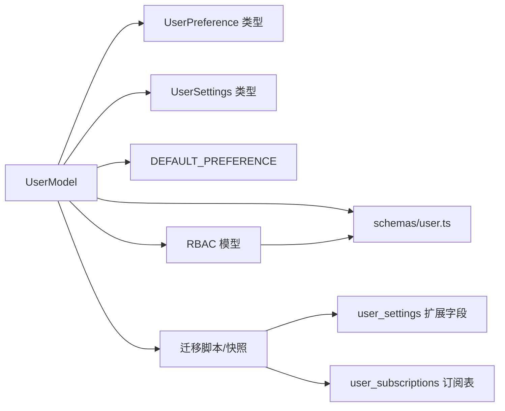

# 用户实体模型

<cite>
**本文引用的文件**
- [packages/database/src/schemas/user.ts](file://packages/database/src/schemas/user.ts)
- [packages/database/src/models/user.ts](file://packages/database/src/models/user.ts)
- [packages/database/src/models/__tests__/user.test.ts](file://packages/database/src/models/__tests__/user.test.ts)
- [packages/const/src/user.ts](file://packages/const/src/user.ts)
- [packages/types/src/user/preference.ts](file://packages/types/src/user/preference.ts)
- [packages/types/src/user/settings.ts](file://packages/types/src/user/settings.ts)
- [packages/database/src/models/rbac.ts](file://packages/database/src/models/rbac.ts)
- [packages/database/migrations/0038_add_image_user_settings.sql](file://packages/database/migrations/0038_add_image_user_settings.sql)
- [packages/database/migrations/0051_add_market_into_user_settings.sql](file://packages/database/migrations/0051_add_market_into_user_settings.sql)
- [packages/database/migrations/meta/0006_snapshot.json](file://packages/database/migrations/meta/0006_snapshot.json)
- [packages/database/migrations/meta/0007_snapshot.json](file://packages/database/migrations/meta/0007_snapshot.json)
</cite>

## 目录

1. [简介](#简介)
2. [项目结构](#项目结构)
3. [核心组件](#核心组件)
4. [架构总览](#架构总览)
5. [详细组件分析](#详细组件分析)
6. [依赖关系分析](#依赖关系分析)
7. [性能考量](#性能考量)
8. [故障排查指南](#故障排查指南)
9. [结论](#结论)
10. [附录](#附录)

## 简介

本文件系统性梳理并解释 User 实体模型的设计理念与实现细节，覆盖用户标识符生成策略、账户状态管理（邮箱验证、两步验证、封禁）、权限控制（基于角色与权限的 RBAC）、配置字段（settings、blocked、subscription）以及与 Agent、KnowledgeBase、File 等实体的关系映射。同时给出认证状态、订阅状态、权限等级的业务逻辑说明，并提供用户注册、登录、权限验证的完整示例流程与安全最佳实践。

## 项目结构

围绕 User 的核心代码分布在数据库模式层、模型层、类型与常量定义、RBAC 权限模型以及迁移脚本中，形成 “模式定义 → 模型封装 → 类型约束 → 权限控制 → 订阅扩展” 的分层设计。

图表来源

- [packages/database/src/schemas/user.ts](file://packages/database/src/schemas/user.ts#L9-L63)
- [packages/database/src/models/user.ts](file://packages/database/src/models/user.ts#L50-L418)
- [packages/database/src/models/rbac.ts](file://packages/database/src/models/rbac.ts#L49-L164)
- [packages/types/src/user/preference.ts](file://packages/types/src/user/preference.ts#L52-L73)
- [packages/types/src/user/settings.ts](file://packages/types/src/user/settings.ts)
- [packages/const/src/user.ts](file://packages/const/src/user.ts#L11-L21)
- [packages/database/migrations/0038_add_image_user_settings.sql](file://packages/database/migrations/0038_add_image_user_settings.sql#L1-L1)
- [packages/database/migrations/0051_add_market_into_user_settings.sql](file://packages/database/migrations/0051_add_market_into_user_settings.sql#L1-L1)
- [packages/database/migrations/meta/0006_snapshot.json](file://packages/database/migrations/meta/0006_snapshot.json#L2836-L2890)
- [packages/database/migrations/meta/0007_snapshot.json](file://packages/database/migrations/meta/0007_snapshot.json#L2783-L2834)

章节来源

- [packages/database/src/schemas/user.ts](file://packages/database/src/schemas/user.ts#L9-L63)
- [packages/database/src/models/user.ts](file://packages/database/src/models/user.ts#L50-L418)
- [packages/types/src/user/preference.ts](file://packages/types/src/user/preference.ts#L52-L73)
- [packages/const/src/user.ts](file://packages/const/src/user.ts#L11-L21)

## 核心组件

- 数据表与字段
  - users：用户主表，包含唯一标识 id、用户名 username、邮箱 email、标准化邮箱 normalized_email、头像 avatar、电话 phone、姓名系列字段、兴趣数组、引导状态与数据、邮箱 / 手机号验证标志、偏好 preference、角色 role、封禁状态 banned 及原因与到期时间、两步验证开关 twoFactorEnabled、最后活跃时间 lastActiveAt、时间戳等。
  - user_settings：用户配置表，以 users.id 作为主键并级联删除；包含通用、语言模型、系统代理、默认代理、市场、记忆、工具、图片、热键、TTS、密钥库等配置项。
  - user_installed_plugins：用户安装插件清单，复合主键 (userId, identifier)，记录插件类型、清单、设置、自定义参数与来源。
- 模型方法
  - 用户查询与更新：按 id/username/email 查询、更新用户信息、偏好合并更新、引导设置更新、设置增删改查。
  - 统计与列表：注册时长计算、按游标分页的用户列表、按小时记忆提取的用户筛选（含内存启用与至少一次用户消息）。
  - 安全与合规：空字符串字段归一化为 null 以维持唯一约束；SSO 提供商查询；API Key 解密获取。
- 类型与默认值
  - UserPreference：包含引导、实验室特性、主题显示模式、发送快捷键等；默认偏好 DEFAULT_PREFERENCE 在常量包中定义。
  - UserSettings：由类型包导出，涵盖多类配置域。
- 权限控制
  - RBAC 模型支持查询用户权限详情、判断是否拥有某权限或一组权限（AND 逻辑）、查询用户有效角色等。
- 订阅扩展
  - 迁移脚本与迁移快照显示 user_subscriptions 表的存在，用于存储订阅状态、周期、价格等信息。

章节来源

- [packages/database/src/schemas/user.ts](file://packages/database/src/schemas/user.ts#L9-L63)
- [packages/database/src/models/user.ts](file://packages/database/src/models/user.ts#L50-L418)
- [packages/types/src/user/preference.ts](file://packages/types/src/user/preference.ts#L52-L73)
- [packages/types/src/user/settings.ts](file://packages/types/src/user/settings.ts)
- [packages/const/src/user.ts](file://packages/const/src/user.ts#L11-L21)
- [packages/database/src/models/rbac.ts](file://packages/database/src/models/rbac.ts#L49-L164)
- [packages/database/migrations/0038_add_image_user_settings.sql](file://packages/database/migrations/0038_add_image_user_settings.sql#L1-L1)
- [packages/database/migrations/0051_add_market_into_user_settings.sql](file://packages/database/migrations/0051_add_market_into_user_settings.sql#L1-L1)
- [packages/database/migrations/meta/0006_snapshot.json](file://packages/database/migrations/meta/0006_snapshot.json#L2836-L2890)
- [packages/database/migrations/meta/0007_snapshot.json](file://packages/database/migrations/meta/0007_snapshot.json#L2783-L2834)

## 架构总览

下图展示用户实体在系统中的位置与交互关系：模型层封装数据库访问，类型与常量提供约束与默认值，RBAC 提供权限校验，迁移脚本扩展配置与订阅能力。

图表来源

- [packages/database/src/models/user.ts](file://packages/database/src/models/user.ts#L50-L418)
- [packages/database/src/schemas/user.ts](file://packages/database/src/schemas/user.ts#L9-L63)
- [packages/types/src/user/preference.ts](file://packages/types/src/user/preference.ts#L52-L73)
- [packages/types/src/user/settings.ts](file://packages/types/src/user/settings.ts)
- [packages/const/src/user.ts](file://packages/const/src/user.ts#L11-L21)
- [packages/database/src/models/rbac.ts](file://packages/database/src/models/rbac.ts#L49-L164)
- [packages/database/migrations/0038_add_image_user_settings.sql](file://packages/database/migrations/0038_add_image_user_settings.sql#L1-L1)
- [packages/database/migrations/0051_add_market_into_user_settings.sql](file://packages/database/migrations/0051_add_market_into_user_settings.sql#L1-L1)
- [packages/database/migrations/meta/0006_snapshot.json](file://packages/database/migrations/meta/0006_snapshot.json#L2836-L2890)
- [packages/database/migrations/meta/0007_snapshot.json](file://packages/database/migrations/meta/0007_snapshot.json#L2783-L2834)

## 详细组件分析

### 用户表设计与字段语义

- 标识与凭证
  - id：主键，UUID 或自定义字符串，全局唯一。
  - username：唯一索引，允许空值，用于登录名。
  - email/normalized_email：唯一索引，标准化邮箱，便于统一匹配与去重。
  - phone：唯一索引，手机号。
  - emailVerified/emailVerifiedAt：邮箱验证状态与时间，兼容不同认证方案。
  - phoneNumberVerified：手机号验证标记。
- 个人资料
  - avatar、firstName、lastName、fullName、interests \[]：头像、姓名、全名、兴趣数组。
- 引导与偏好
  - isOnboarded、onboarding：引导完成状态与流程版本。
  - preference：JSONB 存储用户偏好，默认值来自 DEFAULT_PREFERENCE。
- 安全与合规
  - role：角色（如管理员），配合 RBAC 使用。
  - banned/banReason/banExpires：封禁状态、原因与到期时间。
  - twoFactorEnabled：两步验证开关。
  - lastActiveAt：最后活跃时间，用于审计与统计。
- 时间戳
  - createdAt、updatedAt、clerkCreatedAt：创建时间、更新时间、Clerk 创建时间。

章节来源

- [packages/database/src/schemas/user.ts](file://packages/database/src/schemas/user.ts#L9-L63)
- [packages/const/src/user.ts](file://packages/const/src/user.ts#L11-L21)

### 用户配置字段（settings）

- user_settings 主键为 users.id，随用户删除级联删除。
- 配置域（由类型与迁移脚本共同演进）：
  - 通用：general（如响应语言、字体大小等）
  - 语言模型：languageModel
  - 系统代理：systemAgent
  - 默认代理：defaultAgent
  - 市场：market（迁移 0051 新增）
  - 记忆：memory（含 enabled 开关等）
  - 工具：tool
  - 图片：image（迁移 0038 新增）
  - 热键：hotkey
  - TTS：tts
  - 密钥库：keyVaults（加密存储，运行时解密）
- 用户模型对 settings 的操作：
  - 读取：getUserSettings、getUserSettingsDefaultAgentConfig、getUserState（聚合用户与 settings）。
  - 更新：updateSetting（INSERT/ON CONFLICT DO UPDATE）、deleteSetting、updatePreference（偏好合并）、updateGuide（引导子集合并）。
  - 获取 API Key：getUserApiKeys（通过解密器解密 settings.keyVaults）。

章节来源

- [packages/database/src/schemas/user.ts](file://packages/database/src/schemas/user.ts#L68-L84)
- [packages/database/src/models/user.ts](file://packages/database/src/models/user.ts#L166-L222)
- [packages/database/src/models/user.ts](file://packages/database/src/models/user.ts#L201-L212)
- [packages/database/src/models/user.ts](file://packages/database/src/models/user.ts#L297-L317)
- [packages/database/migrations/0038_add_image_user_settings.sql](file://packages/database/migrations/0038_add_image_user_settings.sql#L1-L1)
- [packages/database/migrations/0051_add_market_into_user_settings.sql](file://packages/database/migrations/0051_add_market_into_user_settings.sql#L1-L1)

### 用户与 Agent、KnowledgeBase、File 的关系映射

- 与 Agent 的关系
  - defaultAgent/systemAgent：用户设置中可指定默认或系统代理配置，体现用户与 Agent 的绑定关系。
- 与 KnowledgeBase 的关系
  - user_installed_plugins：用户安装的插件（含知识库相关能力）与用户关联，体现用户对知识库能力的使用范围。
- 与 File 的关系
  - 虽未在 schema 中直接出现 File 表，但 user_installed_plugins 中的插件清单与设置可用于扩展文件处理能力；结合迁移脚本新增的 image、market 等配置，可间接影响文件上传与知识库检索行为。
- 关系图（概念示意）

图表来源

- [packages/database/src/schemas/user.ts](file://packages/database/src/schemas/user.ts#L68-L105)

### 认证状态、订阅状态与权限等级

#### 认证状态

- 邮箱与手机号验证：emailVerified、emailVerifiedAt、phoneNumberVerified。
- 两步验证：twoFactorEnabled。
- SSO 提供商：getUserSSOProviders 返回用户已绑定的第三方提供商信息。
- 认证流程（序列示意）

图表来源

- [packages/database/src/models/user.ts](file://packages/database/src/models/user.ts#L155-L164)
- [packages/database/src/schemas/user.ts](file://packages/database/src/schemas/user.ts#L29-L47)

#### 订阅状态

- 订阅表 user_subscriptions（迁移快照显示）包含用户订阅的 stripe_id、currency、pricing、账期起止、状态等字段，用于支撑桌面端订阅页面与计费流程。
- 订阅状态与用户偏好 / 功能限制的联动可通过 settings.memory.enabled 与用户活跃度筛选（如仅对有聊天记录且启用记忆的用户进行小时记忆提取）间接体现。

章节来源

- [packages/database/migrations/meta/0006_snapshot.json](file://packages/database/migrations/meta/0006_snapshot.json#L2836-L2890)
- [packages/database/migrations/meta/0007_snapshot.json](file://packages/database/migrations/meta/0007_snapshot.json#L2783-L2834)
- [packages/database/src/models/user.ts](file://packages/database/src/models/user.ts#L345-L389)

#### 权限等级与 RBAC

- 角色与权限
  - 用户角色：userRoles（用户 - 角色关联），角色状态 isActive，角色过期检查。
  - 权限集合：permissions（分类、编码、名称、状态）。
  - 角色 - 权限映射：rolePermissions。
- 权限查询与校验
  - getUserPermissionDetails：返回用户拥有的权限明细（分类、编码、名称、角色名）。
  - hasPermission/hasAllPermissions：单个或多个权限（AND）校验。
  - getUserRoles：查询用户当前有效角色。
- 权限流程（序列示意）

图表来源

- [packages/database/src/models/rbac.ts](file://packages/database/src/models/rbac.ts#L49-L164)

### 用户标识符生成与规范化

- 标识符生成
  - id 由外部系统生成并插入；UserModel.makeSureUserExist 支持幂等创建。
- 唯一字段规范化
  - normalizeUniqueUserFields 将空字符串字段（email/phone/username）归一为 null，避免破坏唯一约束。
- 查询与匹配
  - findByUsername 自动去除空白字符并精确匹配；findByEmail 直接匹配。
- 测试覆盖
  - 单测验证空字符串归一化、空白用户名返回 null、trim 后匹配等行为。

章节来源

- [packages/database/src/models/user.ts](file://packages/database/src/models/user.ts#L261-L295)
- [packages/database/src/models/user.ts](file://packages/database/src/models/user.ts#L238-L258)
- [packages/database/src/models/**tests**/user.test.ts](file://packages/database/src/models/__tests__/user.test.ts#L140-L202)
- [packages/database/src/models/**tests**/user.test.ts](file://packages/database/src/models/__tests__/user.test.ts#L417-L447)

### 用户注册、登录与权限验证示例

- 注册
  - 调用 UserModel.createUser，传入 id 与基础信息；若 id 已存在则返回 duplicate 标记。
  - 归一化唯一字段后写入 users。
- 登录
  - 通过 UserModel.findById/findByUsername/findByEmail 获取用户；结合认证服务校验凭据；更新 lastActiveAt。
- 权限验证
  - 使用 RBAC.hasAllPermissions 判断是否具备所需权限；或 getUserPermissionDetails 获取权限明细辅助前端展示。
- 示例流程（序列示意）

图表来源

- [packages/database/src/models/user.ts](file://packages/database/src/models/user.ts#L265-L295)
- [packages/database/src/models/rbac.ts](file://packages/database/src/models/rbac.ts#L149-L156)

### 安全最佳实践

- 输入规范化
  - 使用 normalizeUniqueUserFields 将空字符串转为 null，确保唯一约束稳定。
- 最小权限
  - 通过 RBAC.hasAllPermissions 进行细粒度权限校验，避免越权操作。
- 配置加密
  - settings.keyVaults 加密存储，运行时通过解密器解密；失败时优雅降级为空对象。
- 会话与活跃度
  - lastActiveAt 记录用于审计与统计；结合封禁策略（banned/banExpires）实施治理。
- 认证兼容
  - emailVerified/emailVerifiedAt、phoneNumberVerified、twoFactorEnabled 兼容多种认证方案。

章节来源

- [packages/database/src/models/user.ts](file://packages/database/src/models/user.ts#L238-L258)
- [packages/database/src/models/user.ts](file://packages/database/src/models/user.ts#L119-L137)
- [packages/database/src/schemas/user.ts](file://packages/database/src/schemas/user.ts#L29-L47)
- [packages/database/src/models/rbac.ts](file://packages/database/src/models/rbac.ts#L149-L156)

## 依赖关系分析

- 内部依赖
  - UserModel 依赖 schemas 定义的 users/userSettings 表结构与索引；依赖类型包的 UserPreference/UserSettings；依赖常量包 DEFAULT_PREFERENCE。
  - RBAC 模型依赖用户 - 角色 - 权限三层关系表，进行权限判定。
- 外部依赖
  - 认证：better-auth（role、banned、twoFactorEnabled、emailVerified）、nextauth（emailVerifiedAt）。
  - 订阅：user_subscriptions 表（迁移快照）。
- 迁移演进
  - image、market 字段的引入体现了配置域的持续扩展。

图表来源

- [packages/database/src/models/user.ts](file://packages/database/src/models/user.ts#L50-L418)
- [packages/database/src/schemas/user.ts](file://packages/database/src/schemas/user.ts#L9-L63)
- [packages/types/src/user/preference.ts](file://packages/types/src/user/preference.ts#L52-L73)
- [packages/types/src/user/settings.ts](file://packages/types/src/user/settings.ts)
- [packages/const/src/user.ts](file://packages/const/src/user.ts#L11-L21)
- [packages/database/src/models/rbac.ts](file://packages/database/src/models/rbac.ts#L49-L164)
- [packages/database/migrations/0038_add_image_user_settings.sql](file://packages/database/migrations/0038_add_image_user_settings.sql#L1-L1)
- [packages/database/migrations/0051_add_market_into_user_settings.sql](file://packages/database/migrations/0051_add_market_into_user_settings.sql#L1-L1)
- [packages/database/migrations/meta/0006_snapshot.json](file://packages/database/migrations/meta/0006_snapshot.json#L2836-L2890)
- [packages/database/migrations/meta/0007_snapshot.json](file://packages/database/migrations/meta/0007_snapshot.json#L2783-L2834)

## 性能考量

- 索引优化
  - users 表对 email/username/createdAt 建有唯一与普通索引；对 banned=true 的部分索引加速封禁用户查询。
- 分页与过滤
  - listUsersForMemoryExtractor 支持游标分页与白名单过滤，避免全表扫描。
  - listUsersForHourlyMemoryExtractor 结合 userSettings.memory.enabled 与 topics/messages 的存在性过滤，仅选择符合条件的用户。
- JSONB 查询
  - settings.memory.enabled 通过 COALESCE 处理缺失配置时的默认启用行为，减少额外分支判断。

章节来源

- [packages/database/src/schemas/user.ts](file://packages/database/src/schemas/user.ts#L51-L62)
- [packages/database/src/models/user.ts](file://packages/database/src/models/user.ts#L319-L389)

## 故障排查指南

- 用户不存在
  - getUserState/getUserApiKeys 在找不到用户或设置时抛出 UserNotFoundError，需检查用户 id 是否正确。
- 解密失败
  - settings.keyVaults 解密异常时，getUserState 将回退为空对象，确认解密器配置与密钥有效性。
- 唯一冲突
  - 更新 email/phone/username 时若为空字符串会被归一为 null，避免违反唯一约束；若仍报错，请检查是否存在重复值。
- 权限不足
  - hasAllPermissions 返回 false 时，检查用户角色是否过期、权限是否激活、是否在有效期范围内。

章节来源

- [packages/database/src/models/user.ts](file://packages/database/src/models/user.ts#L110-L112)
- [packages/database/src/models/user.ts](file://packages/database/src/models/user.ts#L119-L137)
- [packages/database/src/models/user.ts](file://packages/database/src/models/user.ts#L238-L258)
- [packages/database/src/models/rbac.ts](file://packages/database/src/models/rbac.ts#L71-L80)

## 结论

User 实体模型通过清晰的表结构、完善的类型约束与默认值、严谨的权限控制与安全实践，构建了从认证到配置再到订阅的完整用户生命周期支持。其分层设计（模式 → 模型 → 类型 / 常量 → 权限 → 迁移）既保证了可维护性，也为未来扩展（如更多配置域、订阅策略）提供了稳定基座。

## 附录

### 字段对照与用途速查

- 核心字段
  - id：用户唯一标识
  - email/username/phone：登录与联系信息（唯一）
  - avatar/firstName/lastName/fullName：个人资料
  - interests \[]：兴趣标签数组
  - isOnboarded/onboarding：引导状态与流程版本
  - preference：用户偏好（默认值 DEFAULT_PREFERENCE）
  - role/banned/banReason/banExpires：角色与封禁治理
  - twoFactorEnabled：两步验证
  - emailVerified/emailVerifiedAt/phoneNumberVerified：验证状态
  - lastActiveAt：活跃度审计
- 配置字段（user_settings）
  - general、languageModel、systemAgent、defaultAgent、market、memory、tool、image、hotkey、tts、keyVaults
- 订阅字段（user_subscriptions）
  - stripe_id、currency、pricing、billing_cycle_start/end、status 等（迁移快照）

章节来源

- [packages/database/src/schemas/user.ts](file://packages/database/src/schemas/user.ts#L9-L63)
- [packages/types/src/user/preference.ts](file://packages/types/src/user/preference.ts#L52-L73)
- [packages/const/src/user.ts](file://packages/const/src/user.ts#L11-L21)
- [packages/database/migrations/meta/0006_snapshot.json](file://packages/database/migrations/meta/0006_snapshot.json#L2836-L2890)
- [packages/database/migrations/meta/0007_snapshot.json](file://packages/database/migrations/meta/0007_snapshot.json#L2783-L2834)
