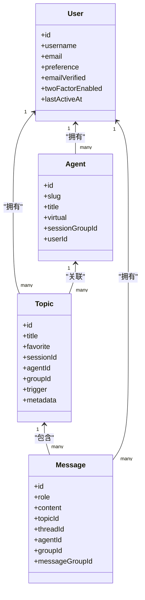
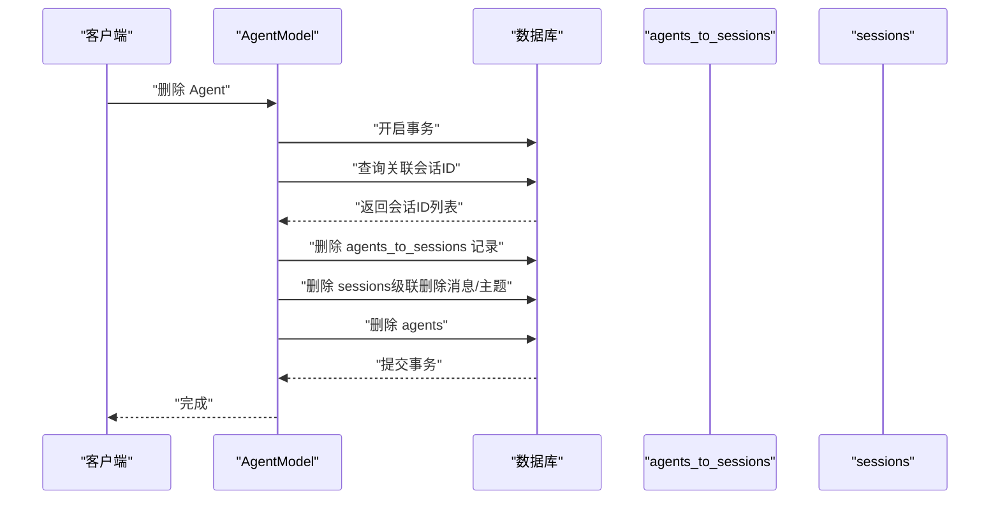
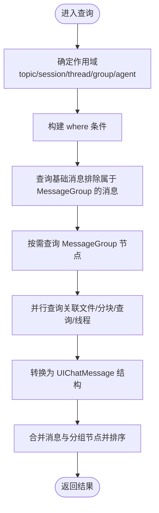
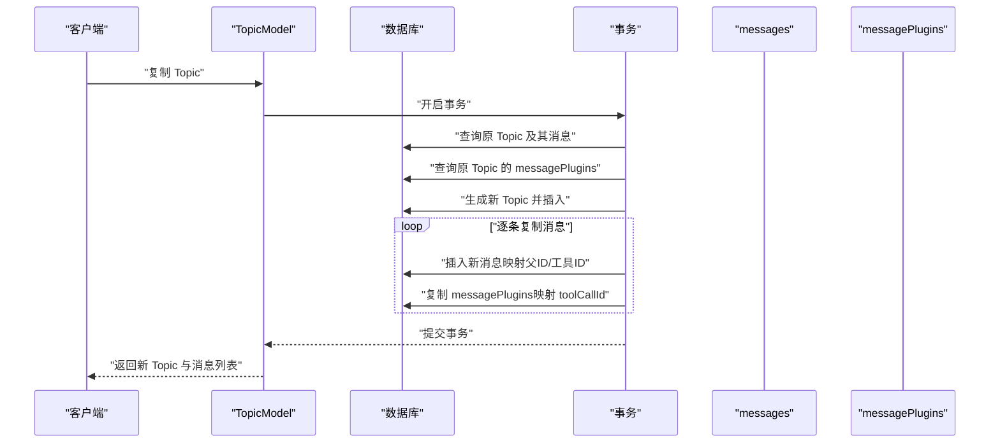
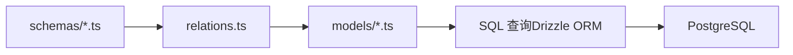

# 核心实体模型

<cite>
**本文引用的文件**
- [database-schema.dbml](file://docs/development/database-schema.dbml)
- [drizzle.config.ts](file://drizzle.config.ts)
- [agent.ts（模型）](file://packages/database/src/models/agent.ts)
- [message.ts（模型）](file://packages/database/src/models/message.ts)
- [user.ts（模型）](file://packages/database/src/models/user.ts)
- [topic.ts（模型）](file://packages/database/src/models/topic.ts)
- [relations.ts（关系）](file://packages/database/src/schemas/relations.ts)
- [agent.ts（模式）](file://packages/database/src/schemas/agent.ts)
- [message.ts（模式）](file://packages/database/src/schemas/message.ts)
- [user.ts（模式）](file://packages/database/src/schemas/user.ts)
- [topic.ts（模式）](file://packages/database/src/schemas/topic.ts)
</cite>

## 目录
1. [简介](#简介)
2. [项目结构](#项目结构)
3. [核心组件](#核心组件)
4. [架构总览](#架构总览)
5. [详细组件分析](#详细组件分析)
6. [依赖分析](#依赖分析)
7. [性能考量](#性能考量)
8. [故障排查指南](#故障排查指南)
9. [结论](#结论)
10. [附录：字段说明表](#附录字段说明表)

## 简介
本文件系统化梳理 LobeHub 的核心实体模型，聚焦 Agent、Message、User、Topic 四大实体的设计理念、字段定义、约束条件、业务含义与关系映射，并结合仓库中的数据库模式与 Drizzle 模型代码，给出查询与事务处理的最佳实践与常见问题排查建议。

## 项目结构
- 数据库模式与迁移由 Drizzle 管理，使用 PostgreSQL 作为后端。
- 实体模式定义位于 packages/database/src/schemas 下，关系定义集中在 relations.ts 中。
- 领域模型封装在 packages/database/src/models 下，提供面向业务的 CRUD、聚合查询与事务操作。

```mermaid
graph TB
subgraph "模式层schemas"
U["users"]
US["user_settings"]
A["agents"]
AG["agents_knowledge_bases"]
AF["agents_files"]
S["sessions"]
SG["session_groups"]
T["topics"]
M["messages"]
MG["message_groups"]
MQ["message_queries"]
MC["message_chunks"]
MT["message_tts"]
MP["message_plugins"]
MD["message_translates"]
F["files"]
D["documents"]
CG["chat_groups"]
CGA["chat_groups_agents"]
TH["threads"]
TD["topic_documents"]
TS["topic_shares"]
end
subgraph "关系层relations.ts"
RA["agents<->agents_knowledge_bases"]
RF["agents<->agents_files"]
RS["sessions<->agents_to_sessions"]
RT["topics<->messages"]
RM["messages<->message_groups"]
RQ["messages<->message_queries"]
RC["messages<->message_chunks"]
RTTS["messages<->message_tts"]
RP["messages<->message_plugins"]
RTR["messages<->message_translates"]
RFM["files<->messagesFiles"]
RFD["files<->documents"]
RDT["documents<->topicDocuments"]
RCG["chat_groups<->chat_groups_agents"]
RTH["threads<->messages"]
end
A --- RA
A --- RF
S --- RS
T --- RT
M --- RM
M --- RQ
M --- RC
M --- RTTS
M --- RP
M --- RTR
F --- RFM
F --- RFD
D --- RDT
CG --- RCG
TH --- RTH
```

图表来源
- [relations.ts（关系）](file://packages/database/src/schemas/relations.ts#L84-L130)
- [agent.ts（模式）](file://packages/database/src/schemas/agent.ts#L30-L84)
- [message.ts（模式）](file://packages/database/src/schemas/message.ts#L86-L153)
- [topic.ts（模式）](file://packages/database/src/schemas/topic.ts#L23-L59)

章节来源
- [drizzle.config.ts](file://drizzle.config.ts#L1-L22)
- [database-schema.dbml](file://docs/development/database-schema.dbml#L1-L800)

## 核心组件
本节从“实体-字段-约束-关系”的维度，对 Agent、Message、User、Topic 进行深入解析，并给出字段说明表与关系图。

- 用户 User
  - 职责：存储用户基本信息、偏好、认证状态与设置。
  - 关键字段：id（PK）、username/email/phone（唯一索引）、normalized_email、preference、emailVerified、twoFactorEnabled、phoneNumberVerified、lastActiveAt、createdAt/updatedAt。
  - 约束：唯一性索引覆盖 email/username/phone；部分索引加速管理员查询。
  - 业务含义：统一身份标识、个性化配置、安全与合规标记。

- 代理 Agent
  - 职责：代表用户创建的智能体，可绑定知识库与文件，支持会话分组。
  - 关键字段：id（PK）、slug（唯一索引）、title/description/tags、plugins、clientId（唯一索引）、userId（外键）、chatConfig/params/systemRole/tts、virtual/pinned/openingMessage/openingQuestions、sessionGroupId（外键，可空）。
  - 约束：clientId+userId 唯一；slug+userId 唯一；索引覆盖 userId/title/description/sessionGroupId。
  - 业务含义：智能体配置、市场标识、虚拟代理（如收件箱）。

- 主题 Topic
  - 职责：对话主题容器，承载消息集合，支持收藏、摘要、元数据与触发器。
  - 关键字段：id（PK）、title/favorite、sessionId/agentId/groupId（外键，三者互斥或组合）、clientId（唯一索引）、historySummary、metadata（JSONB，含提取状态等）、trigger/mode、createdAt/updatedAt。
  - 约束：clientId+userId 唯一；索引覆盖 user_id/session_id/group_id/agent_id/trigger；metadata 提供 GIN 路径索引以支持 JSONB 查询。
  - 业务含义：话题组织、记忆提取、定时任务触发。

- 消息 Message
  - 职责：对话内容载体，支持工具调用、翻译、TTS、RAG 查询与分组压缩。
  - 关键字段：id（PK）、role/content/reasoning/search/metadata/model/provider/favorite/error/tools、traceId/observationId、clientId（唯一索引）、userId（外键）、sessionId/topicId/threadId/parentId/agentId/groupId/targetId/messageGroupId（外键，部分可空）。
  - 约束：clientId+userId 唯一；索引覆盖 topic_id/user_id/session_id/thread_id/agent_id/group_id/message_group_id。
  - 业务含义：消息级关系、并行/压缩分组、RAG 重写查询、工具干预。

章节来源
- [user.ts（模式）](file://packages/database/src/schemas/user.ts#L9-L66)
- [agent.ts（模式）](file://packages/database/src/schemas/agent.ts#L30-L84)
- [topic.ts（模式）](file://packages/database/src/schemas/topic.ts#L23-L59)
- [message.ts（模式）](file://packages/database/src/schemas/message.ts#L86-L153)

## 架构总览
下图展示四大实体在系统中的角色与交互：

图表来源
- [user.ts（模式）](file://packages/database/src/schemas/user.ts#L9-L66)
- [agent.ts（模式）](file://packages/database/src/schemas/agent.ts#L30-L84)
- [topic.ts（模式）](file://packages/database/src/schemas/topic.ts#L23-L59)
- [message.ts（模式）](file://packages/database/src/schemas/message.ts#L86-L153)

## 详细组件分析

### Agent 实体
- 设计理念
  - Agent 作为“智能体”抽象，支持虚拟代理（如收件箱）、会话分组、插件与 TTS 等扩展能力。
  - 通过 clientId/slug 唯一性保证前端一致性与可发现性。
- 字段与约束
  - 唯一性：clientId+userId、slug+userId。
  - 外键：userId → users；sessionGroupId → session_groups；agents_knowledge_bases/agents_files/agentsToSessions/聊天群组均与之关联。
- 生命周期与状态
  - 创建/更新/删除：模型提供批量创建、更新、删除与复制逻辑；删除时通过事务联动清理会话与消息。
  - 虚拟代理：virtual 字段用于区分内置/虚拟代理。
- 关系映射
  - 一对多：agents → agents_knowledge_bases、agents_files、agentsToSessions。
  - 多对多：agents ↔ knowledgeBases（经 agents_knowledge_bases）；agents ↔ files（经 agents_files）。
- 查询与事务
  - 支持按关键词检索、按会话查找、按市场标识查询、按 forkedFromIdentifier 查询。
  - 删除采用事务：先解绑会话，再删除会话（级联删除消息/主题），最后删除 Agent。

图表来源
- [agent.ts（模型）](file://packages/database/src/models/agent.ts#L251-L280)

章节来源
- [agent.ts（模式）](file://packages/database/src/schemas/agent.ts#L30-L84)
- [agent.ts（模型）](file://packages/database/src/models/agent.ts#L1-L576)
- [relations.ts（关系）](file://packages/database/src/schemas/relations.ts#L132-L137)

### Message 实体
- 设计理念
  - 消息是对话的最小单元，支持工具调用、翻译、TTS、RAG 重写查询、分组压缩与并行响应。
  - 通过 message_groups 支持“并行/压缩”两类分组节点，提升复杂对话的可视化与可读性。
- 字段与约束
  - 唯一性：clientId+userId。
  - 外键：userId → users；topicId/threadId/agentId/groupId → topics/threads/agents/chat_groups；parentId/quotaId → messages；messageGroupId → message_groups。
- 生命周期与状态
  - 创建：支持按 ID 批量查询、按条件过滤、按时间范围与分页聚合。
  - 更新/删除：通过模型方法进行，涉及多表关联（文件、插件、翻译、TTS、RAG 查询）。
- 关系映射
  - 一对多：messages → messagePlugins、messageTranslates、messageTTS、messagesFiles、messageChunks、messageQueryChunks。
  - 多对一：messages → topics/threads/sessions/agents/chatGroups/messageGroups。
- 查询与事务
  - 支持按 topicId/threadId/sessionId/groupId/agentId 组合查询；支持 MessageGroup 节点合并与去重。
  - 任务消息（role=task）与线程（threads）建立关联，便于任务详情聚合。

图表来源
- [message.ts（模型）](file://packages/database/src/models/message.ts#L210-L530)

章节来源
- [message.ts（模式）](file://packages/database/src/schemas/message.ts#L86-L153)
- [message.ts（模型）](file://packages/database/src/models/message.ts#L1-L800)
- [relations.ts（关系）](file://packages/database/src/schemas/relations.ts#L99-L130)

### User 实体
- 设计理念
  - 统一用户身份与偏好，支持 SSO 提供商、设置项（TTS、热键、语言模型、工具等）与隐私/安全标记。
  - 提供用户状态聚合、设置合并与解密流程。
- 字段与约束
  - 唯一性：username/email/phone（空字符串归一化为 NULL，保持唯一约束安全）。
  - 索引：email/username/createdAt；部分索引加速封禁用户查询。
- 生命周期与状态
  - 创建/更新：normalizeUniqueUserFields 归一化唯一字段；支持设置项插入与 ON CONFLICT 更新。
  - 删除：提供删除接口。
- 关系映射
  - 一对一：users → user_settings（主键关联）。
  - 多对多：通过 user_installed_plugins 与插件生态关联（非本文重点）。

章节来源
- [user.ts（模式）](file://packages/database/src/schemas/user.ts#L9-L109)
- [user.ts（模型）](file://packages/database/src/models/user.ts#L1-L418)
- [relations.ts（关系）](file://packages/database/src/schemas/relations.ts#L261-L267)

### Topic 实体
- 设计理念
  - Topic 作为对话主题容器，支持收藏、摘要、元数据（含记忆提取状态）、触发器（定时/聊天/API/评测）与场景模式（临时/测试/默认）。
  - 支持与文档的多对多关联，便于知识检索与溯源。
- 字段与约束
  - 唯一性：clientId+userId。
  - 外键：userId → users；sessionId/agentId/groupId → sessions/agents/chat_groups；topicDocuments 多对多。
  - 索引：trigger、metadata JSONB 路径索引（用于提取状态查询）。
- 生命周期与状态
  - 创建/复制/更新/删除：支持按消息批量归档到新 Topic；复制时保留父子关系与工具调用 ID 映射。
  - 批量删除：按 sessionId/groupId/agentId 清理。
- 关系映射
  - 一对多：topics → messages、topicDocuments。
  - 多对多：topics ↔ documents（经 topicDocuments）。

图表来源
- [topic.ts（模型）](file://packages/database/src/models/topic.ts#L481-L582)

章节来源
- [topic.ts（模式）](file://packages/database/src/schemas/topic.ts#L23-L186)
- [topic.ts（模型）](file://packages/database/src/models/topic.ts#L1-L816)
- [relations.ts（关系）](file://packages/database/src/schemas/relations.ts#L84-L90)

## 依赖分析
- 模式层（schemas）
  - 定义表结构、主键/唯一索引、外键约束与 JSONB 字段类型。
- 关系层（relations.ts）
  - 使用 relations(...) 声明实体间的一对一/一对多/多对多关系，明确级联策略（CASCADE/SET NULL）。
- 模型层（models）
  - 封装业务逻辑：查询、聚合、事务、字段合并与归一化。
- 查询与索引
  - 大量基于 userId 的过滤；多处 unique(clientId, userId) 保障前端幂等；针对高频查询字段建立索引。

图表来源
- [relations.ts（关系）](file://packages/database/src/schemas/relations.ts#L1-L407)
- [agent.ts（模式）](file://packages/database/src/schemas/agent.ts#L30-L84)
- [message.ts（模式）](file://packages/database/src/schemas/message.ts#L86-L153)
- [topic.ts（模式）](file://packages/database/src/schemas/topic.ts#L23-L59)
- [user.ts（模式）](file://packages/database/src/schemas/user.ts#L9-L66)

章节来源
- [relations.ts（关系）](file://packages/database/src/schemas/relations.ts#L1-L407)
- [drizzle.config.ts](file://drizzle.config.ts#L1-L22)

## 性能考量
- 索引策略
  - 唯一性：clientId+userId 在多表上广泛存在，确保幂等与前端一致性。
  - 高频过滤：userId、topicId、sessionId、threadId、agentId、groupId 等字段建立索引。
  - JSONB 查询：metadata 上的 GIN 路径索引用于提取状态等键查询。
- 查询优化
  - 分页与时间窗口：消息查询支持 current/pageSize 与时间范围过滤，避免全表扫描。
  - 并行查询：消息聚合时对文件、分块、查询、线程等进行并行拉取，减少往返。
- 写入优化
  - 事务批处理：复制 Topic 与批量创建 Topic 时使用事务，降低锁竞争与重复写入。
  - 字段归一化：创建/更新时对唯一字段进行空串归一化，避免唯一约束破坏。

## 故障排查指南
- 唯一冲突
  - 现象：插入失败，提示唯一约束冲突。
  - 排查：检查 clientId+userId 是否重复；确认 slug+userId 或 email/username/phone 是否已存在。
  - 参考：[agent.ts（模式）](file://packages/database/src/schemas/agent.ts#L77-L78)、[user.ts（模式）](file://packages/database/src/schemas/user.ts#L13-L15)
- 外键约束失败
  - 现象：删除/更新失败，提示外键约束。
  - 排查：确认关联记录是否存在；注意 CASCADE/SET NULL 的影响。
  - 参考：[relations.ts（关系）](file://packages/database/src/schemas/relations.ts#L139-L148)
- 查询性能差
  - 现象：按 topicId/sessionId/threadId 查询慢。
  - 排查：确认相应索引是否存在；避免在未索引列上做 LIKE/模糊匹配。
  - 参考：[message.ts（模式）](file://packages/database/src/schemas/message.ts#L140-L152)、[topic.ts（模式）](file://packages/database/src/schemas/topic.ts#L46-L58)
- JSONB 查询不命中
  - 现象：metadata 查询无结果。
  - 排查：确认是否使用了 GIN 路径索引；核对键名与路径表达式。
  - 参考：[topic.ts（模式）](file://packages/database/src/schemas/topic.ts#L54-L57)

章节来源
- [agent.ts（模式）](file://packages/database/src/schemas/agent.ts#L77-L78)
- [user.ts（模式）](file://packages/database/src/schemas/user.ts#L13-L15)
- [relations.ts（关系）](file://packages/database/src/schemas/relations.ts#L139-L148)
- [message.ts（模式）](file://packages/database/src/schemas/message.ts#L140-L152)
- [topic.ts（模式）](file://packages/database/src/schemas/topic.ts#L54-L57)

## 结论
本文件基于仓库中的数据库模式与 Drizzle 模型，系统化梳理了 Agent、Message、User、Topic 的设计与实现要点。通过唯一性约束、外键关系与索引策略，确保了数据一致性与查询效率；通过模型层的事务封装与字段归一化，提升了业务可用性与可维护性。建议在后续迭代中持续关注 JSONB 查询优化与幂等写入策略，以进一步提升系统稳定性与性能。

## 附录：字段说明表

### 用户 User
- 字段
  - id：文本，主键，必填
  - username：文本，唯一，可空
  - email：文本，唯一，可空
  - normalized_email：文本，唯一，可空
  - phone：文本，唯一，可空
  - avatar/firstName/lastName/fullName：文本，可空
  - interests：数组，可空
  - isOnboarded：布尔，默认 false
  - onboarding：JSONB，可空
  - clerkCreatedAt：时间戳（带时区），可空
  - emailVerified：布尔，默认 false，必填
  - emailVerifiedAt：时间戳（带时区），可空
  - preference：JSONB，默认值（常量），必填
  - role：文本，可空
  - banned：布尔，默认 false
  - banReason：文本，可空
  - banExpires：时间戳（带时区），可空
  - twoFactorEnabled：布尔，默认 false
  - phoneNumberVerified：布尔，可空
  - lastActiveAt：时间戳（带时区），必填，默认当前时间
  - createdAt/updatedAt：时间戳（带时区），必填，默认当前时间

- 约束
  - 唯一：username、email、phone、normalized_email
  - 索引：email、username、createdAt；部分索引加速封禁用户查询

章节来源
- [user.ts（模式）](file://packages/database/src/schemas/user.ts#L9-L66)

### 代理 Agent
- 字段
  - id：文本，主键，必填
  - slug：文本，唯一，必填
  - title/description/tags：文本/JSONB，可空
  - editorData：JSONB，可空
  - avatar/background_color：文本，可空
  - marketIdentifier：文本，可空
  - plugins：JSONB，可空
  - clientId：文本，唯一，可空
  - userId：文本，外键 users.id，必填
  - agencyConfig/chatConfig：JSONB，可空
  - fewShots：JSONB，可空
  - model/provider/systemRole：文本，可空
  - tts：JSONB，可空
  - virtual/pinned：布尔，默认 false
  - openingMessage：文本，可空
  - openingQuestions：数组，默认空数组
  - sessionGroupId：文本，外键 session_groups.id，可空
  - createdAt/updatedAt：时间戳（带时区），必填，默认当前时间

- 约束
  - 唯一：clientId+userId、slug+userId
  - 索引：userId、title、description、sessionGroupId

章节来源
- [agent.ts（模式）](file://packages/database/src/schemas/agent.ts#L30-L84)

### 主题 Topic
- 字段
  - id：文本，主键，必填
  - title/favorite：文本/布尔，默认 false
  - sessionId/agentId/groupId：文本，外键 sessions/agents/chat_groups，可空
  - content/editorData：文本/JSONB，可空
  - userId：文本，外键 users.id，必填
  - clientId：文本，唯一，可空
  - historySummary：文本，可空
  - metadata：JSONB，可空
  - trigger：文本，枚举（cron/chat/api/eval），可空
  - mode：文本，枚举（temp/test/default），可空
  - createdAt/updatedAt：时间戳（带时区），必填，默认当前时间

- 约束
  - 唯一：clientId+userId
  - 索引：userId、sessionId、groupId、agentId、trigger；metadata GIN 路径索引

章节来源
- [topic.ts（模式）](file://packages/database/src/schemas/topic.ts#L23-L59)

### 消息 Message
- 字段
  - id：文本，主键，必填
  - role：文本，必填
  - content/editorData/summary/reasoning/search/metadata：文本/JSONB，可空
  - model/provider：文本，可空
  - favorite：布尔，默认 false
  - error：JSONB，可空
  - tools：JSONB，可空
  - traceId/observationId：文本，可空
  - clientId：文本，唯一，可空
  - userId：文本，外键 users.id，必填
  - sessionId/topicId/threadId：文本，外键 sessions/topics/threads，可空
  - parentId/quotaId：文本，外键 messages，可空
  - agentId/groupId/targetId/messageGroupId：文本，外键 agents/chat_groups/threads/message_groups，可空

- 约束
  - 唯一：clientId+userId
  - 索引：topicId/userId/sessionId/threadId/agentId/groupId/messageGroupId

章节来源
- [message.ts（模式）](file://packages/database/src/schemas/message.ts#L86-L153)