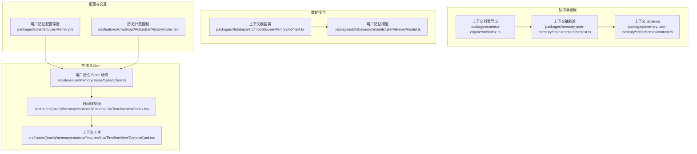
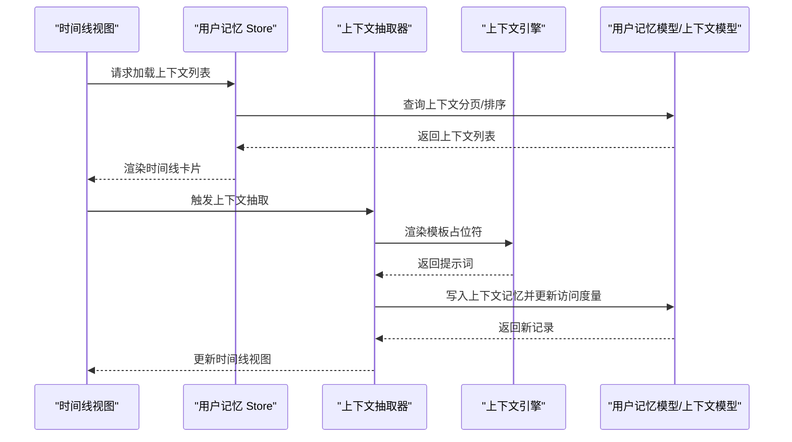
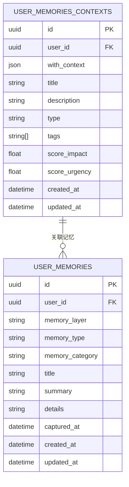
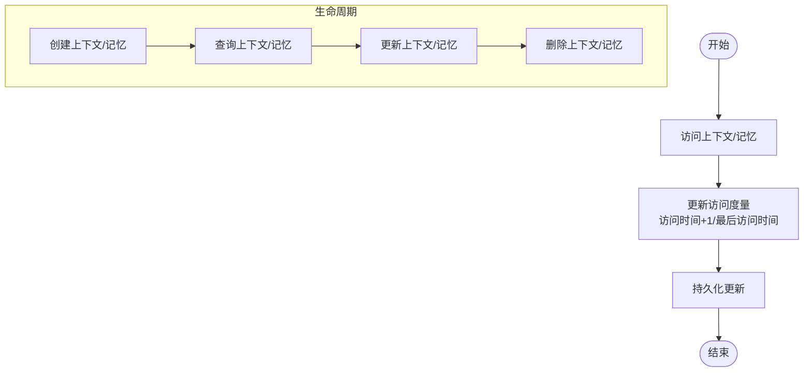
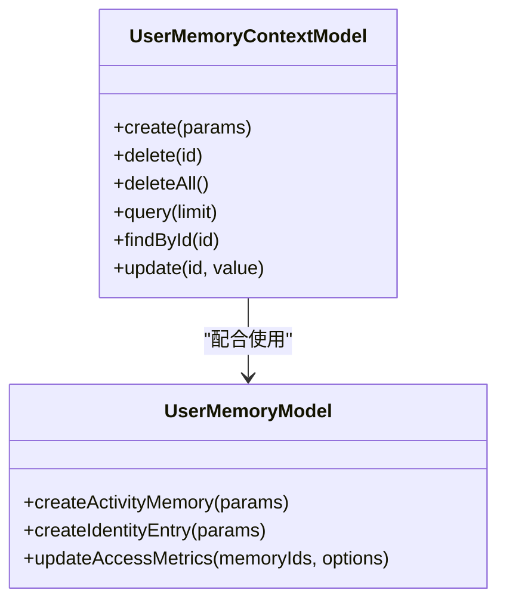
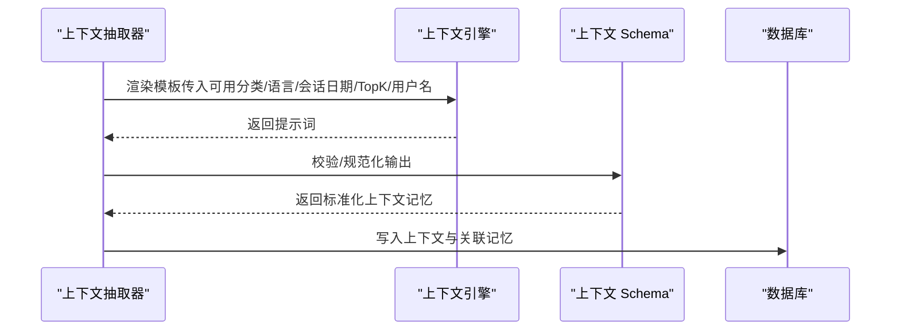
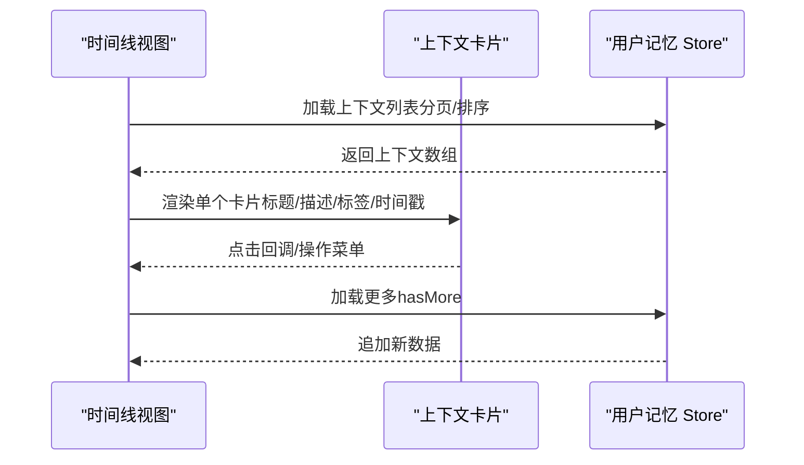
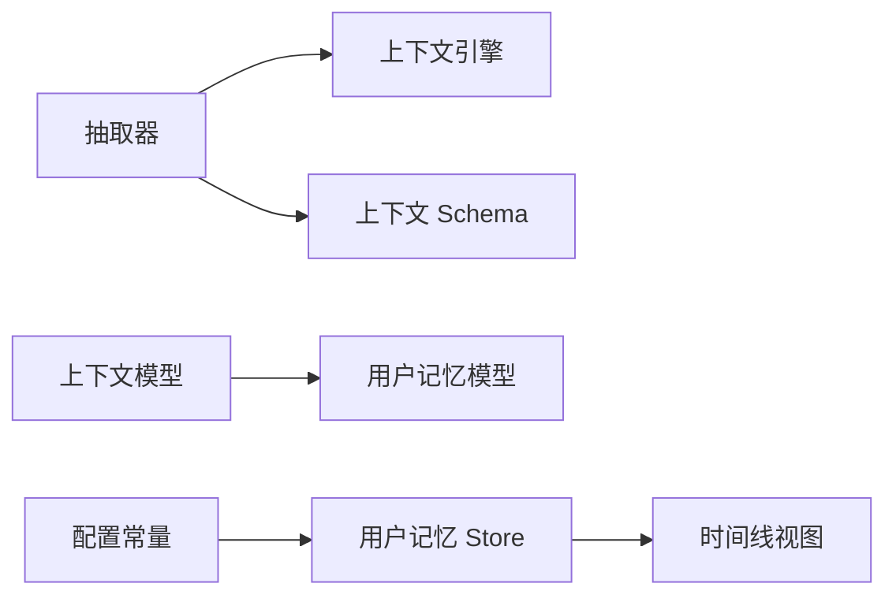

# 上下文记忆（Context Memory）

<cite>
**本文引用的文件**
- [packages/context-engine/src/index.ts](file://packages/context-engine/src/index.ts)
- [packages/context-engine/src/types.ts](file://packages/context-engine/src/types.ts)
- [packages/memory-user-memory/src/schemas/context.ts](file://packages/memory-user-memory/src/schemas/context.ts)
- [packages/memory-user-memory/src/extractors/context.ts](file://packages/memory-user-memory/src/extractors/context.ts)
- [packages/database/src/models/userMemory/context.ts](file://packages/database/src/models/userMemory/context.ts)
- [packages/database/src/models/userMemory/model.ts](file://packages/database/src/models/userMemory/model.ts)
- [packages/const/src/userMemory.ts](file://packages/const/src/userMemory.ts)
- [src/store/userMemory/slices/base/action.ts](file://src/store/userMemory/slices/base/action.ts)
- [src/routes/(main)/memory/contexts/features/List/TimelineView/ContextCard.tsx](file://src/routes/(main)/memory/contexts/features/List/TimelineView/ContextCard.tsx)
- [src/routes/(main)/memory/contexts/features/List/TimelineView/index.tsx](file://src/routes/(main)/memory/contexts/features/List/TimelineView/index.tsx)
- [src/features/ChatInput/ActionBar/History/index.tsx](file://src/features/ChatInput/ActionBar/History/index.tsx)
</cite>

## 目录
1. [简介](#简介)
2. [项目结构](#项目结构)
3. [核心组件](#核心组件)
4. [架构总览](#架构总览)
5. [详细组件分析](#详细组件分析)
6. [依赖关系分析](#依赖关系分析)
7. [性能考量](#性能考量)
8. [故障排查指南](#故障排查指南)
9. [结论](#结论)
10. [附录](#附录)

## 简介
本文件面向“用户上下文记忆”模块，系统化梳理其数据模型、动态特性与运行机制。上下文记忆用于捕获与表达用户的瞬时性情境要素，如当前会话状态、环境信息、时间背景、社交情境等，并通过抽取器从对话与行为中提取结构化上下文，形成可检索、可更新、可可视化的记忆单元。本文将从数据模型、实时更新机制、生命周期管理、内存优化、多轮对话与场景感知、结构化存储方案、隐私与清理策略等方面进行深入说明。

## 项目结构
围绕上下文记忆的关键代码分布在以下层次：
- 抽取与建模层：上下文抽取器负责生成符合 Schema 的上下文记忆；上下文引擎提供模板渲染与处理能力。
- 数据模型层：数据库模型定义上下文实体及其关联关系，支持创建、查询、删除与访问度量更新。
- 存储与检索层：用户记忆 Store 负责拉取、缓存与分页加载上下文列表；UI 展示采用时间线视图。
- 配置与常量：默认检索参数、Top-K 限制与嵌入维度等配置贯穿于检索与展示流程。

图表来源
- [packages/memory-user-memory/src/extractors/context.ts](file://packages/memory-user-memory/src/extractors/context.ts#L1-L46)
- [packages/memory-user-memory/src/schemas/context.ts](file://packages/memory-user-memory/src/schemas/context.ts#L1-L102)
- [packages/context-engine/src/index.ts](file://packages/context-engine/src/index.ts#L1-L32)
- [packages/database/src/models/userMemory/context.ts](file://packages/database/src/models/userMemory/context.ts#L1-L82)
- [packages/database/src/models/userMemory/model.ts](file://packages/database/src/models/userMemory/model.ts#L1-L200)
- [src/store/userMemory/slices/base/action.ts](file://src/store/userMemory/slices/base/action.ts#L126-L226)
- [src/routes/(main)/memory/contexts/features/List/TimelineView/index.tsx](file://src/routes/(main)/memory/contexts/features/List/TimelineView/index.tsx#L1-L39)
- [src/routes/(main)/memory/contexts/features/List/TimelineView/ContextCard.tsx](file://src/routes/(main)/memory/contexts/features/List/TimelineView/ContextCard.tsx#L1-L28)
- [packages/const/src/userMemory.ts](file://packages/const/src/userMemory.ts#L1-L37)
- [src/features/ChatInput/ActionBar/History/index.tsx](file://src/features/ChatInput/ActionBar/History/index.tsx#L1-L39)

章节来源
- [packages/memory-user-memory/src/extractors/context.ts](file://packages/memory-user-memory/src/extractors/context.ts#L1-L46)
- [packages/memory-user-memory/src/schemas/context.ts](file://packages/memory-user-memory/src/schemas/context.ts#L1-L102)
- [packages/context-engine/src/index.ts](file://packages/context-engine/src/index.ts#L1-L32)
- [packages/database/src/models/userMemory/context.ts](file://packages/database/src/models/userMemory/context.ts#L1-L82)
- [packages/database/src/models/userMemory/model.ts](file://packages/database/src/models/userMemory/model.ts#L1-L200)
- [src/store/userMemory/slices/base/action.ts](file://src/store/userMemory/slices/base/action.ts#L126-L226)
- [src/routes/(main)/memory/contexts/features/List/TimelineView/index.tsx](file://src/routes/(main)/memory/contexts/features/List/TimelineView/index.tsx#L1-L39)
- [src/routes/(main)/memory/contexts/features/List/TimelineView/ContextCard.tsx](file://src/routes/(main)/memory/contexts/features/List/TimelineView/ContextCard.tsx#L1-L28)
- [packages/const/src/userMemory.ts](file://packages/const/src/userMemory.ts#L1-L37)
- [src/features/ChatInput/ActionBar/History/index.tsx](file://src/features/ChatInput/ActionBar/History/index.tsx#L1-L39)

## 核心组件
- 上下文抽取器：基于模板与 Schema，从会话与检索结果中抽取结构化上下文记忆项。
- 上下文引擎：提供占位符渲染、消息处理流水线等能力，支撑抽取器生成最终提示词。
- 上下文 Schema：定义上下文对象、标签、重要度、紧急度、关联主体与客体等字段。
- 用户记忆模型与上下文模型：封装上下文实体的增删改查、访问度量更新与向量列处理。
- 用户记忆 Store 动作：负责检索、缓存、分页加载上下文列表，并与 UI 进行联动。
- 时间线视图与卡片：以时间线方式展示上下文，支持分组、加载更多与操作菜单。

章节来源
- [packages/memory-user-memory/src/extractors/context.ts](file://packages/memory-user-memory/src/extractors/context.ts#L1-L46)
- [packages/context-engine/src/index.ts](file://packages/context-engine/src/index.ts#L1-L32)
- [packages/memory-user-memory/src/schemas/context.ts](file://packages/memory-user-memory/src/schemas/context.ts#L1-L102)
- [packages/database/src/models/userMemory/context.ts](file://packages/database/src/models/userMemory/context.ts#L1-L82)
- [packages/database/src/models/userMemory/model.ts](file://packages/database/src/models/userMemory/model.ts#L1-L200)
- [src/store/userMemory/slices/base/action.ts](file://src/store/userMemory/slices/base/action.ts#L126-L226)
- [src/routes/(main)/memory/contexts/features/List/TimelineView/index.tsx](file://src/routes/(main)/memory/contexts/features/List/TimelineView/index.tsx#L1-L39)
- [src/routes/(main)/memory/contexts/features/List/TimelineView/ContextCard.tsx](file://src/routes/(main)/memory/contexts/features/List/TimelineView/ContextCard.tsx#L1-L28)

## 架构总览
上下文记忆的端到端流程如下：
- 会话输入进入抽取器，结合检索到的相似记忆与模板生成抽取提示词；
- 大模型输出符合 Schema 的上下文记忆项；
- 将上下文记忆写入数据库，同时更新访问度量；
- Store 拉取上下文并按天分组展示在时间线视图中，支持加载更多与操作。

图表来源
- [src/routes/(main)/memory/contexts/features/List/TimelineView/index.tsx](file://src/routes/(main)/memory/contexts/features/List/TimelineView/index.tsx#L1-L39)
- [src/store/userMemory/slices/base/action.ts](file://src/store/userMemory/slices/base/action.ts#L126-L226)
- [packages/memory-user-memory/src/extractors/context.ts](file://packages/memory-user-memory/src/extractors/context.ts#L1-L46)
- [packages/context-engine/src/index.ts](file://packages/context-engine/src/index.ts#L1-L32)
- [packages/database/src/models/userMemory/model.ts](file://packages/database/src/models/userMemory/model.ts#L637-L639)
- [packages/database/src/models/userMemory/context.ts](file://packages/database/src/models/userMemory/context.ts#L1-L82)

## 详细组件分析

### 数据模型与 Schema
- 上下文 Schema 定义了上下文对象的丰富属性，包括标题、描述、类型、标签、重要度、紧急度、关联主体与客体等，确保上下文具备可检索性与可标注性。
- 上下文记忆项进一步将这些字段与记忆的标题、摘要、详情、标签、类别等组合，形成完整的记忆单元。
- 用户记忆模型提供统一的插入与更新逻辑，支持向量列的构建与访问度量的维护。

图表来源
- [packages/memory-user-memory/src/schemas/context.ts](file://packages/memory-user-memory/src/schemas/context.ts#L36-L86)
- [packages/database/src/models/userMemory/context.ts](file://packages/database/src/models/userMemory/context.ts#L1-L82)
- [packages/database/src/models/userMemory/model.ts](file://packages/database/src/models/userMemory/model.ts#L109-L177)

章节来源
- [packages/memory-user-memory/src/schemas/context.ts](file://packages/memory-user-memory/src/schemas/context.ts#L1-L102)
- [packages/database/src/models/userMemory/context.ts](file://packages/database/src/models/userMemory/context.ts#L1-L82)
- [packages/database/src/models/userMemory/model.ts](file://packages/database/src/models/userMemory/model.ts#L109-L177)

### 实时更新机制与生命周期
- 访问度量更新：当上下文被检索或使用时，系统通过事务更新访问时间与次数，保证并发安全与一致性。
- 生命周期管理：上下文支持创建、查询、更新与删除；删除上下文时可级联删除其关联的记忆条目，避免脏数据。
- 模型方法覆盖：用户记忆模型提供创建活动、身份、偏好、体验与上下文等方法，统一抽象不同记忆类型的插入流程。

图表来源
- [packages/database/src/models/userMemory/model.ts](file://packages/database/src/models/userMemory/model.ts#L2550-L2575)
- [packages/database/src/models/userMemory/context.ts](file://packages/database/src/models/userMemory/context.ts#L25-L54)
- [packages/database/src/models/userMemory/model.ts](file://packages/database/src/models/userMemory/model.ts#L637-L639)

章节来源
- [packages/database/src/models/userMemory/model.ts](file://packages/database/src/models/userMemory/model.ts#L2550-L2575)
- [packages/database/src/models/userMemory/context.ts](file://packages/database/src/models/userMemory/context.ts#L25-L54)
- [packages/database/src/models/userMemory/model.ts](file://packages/database/src/models/userMemory/model.ts#L637-L639)

### 结构化存储方案
- 嵌套上下文：上下文模型类提供创建、查询、更新与删除接口，支持按用户隔离与时间排序。
- 历史上下文链：通过时间线视图按日分组展示上下文卡片，支持加载更多，形成可追溯的历史链。
- 上下文快照：用户记忆模型提供访问度量更新与向量列处理，便于后续检索与排序。

图表来源
- [packages/database/src/models/userMemory/context.ts](file://packages/database/src/models/userMemory/context.ts#L1-L82)
- [packages/database/src/models/userMemory/model.ts](file://packages/database/src/models/userMemory/model.ts#L637-L639)
- [packages/database/src/models/userMemory/model.ts](file://packages/database/src/models/userMemory/model.ts#L2550-L2575)

章节来源
- [packages/database/src/models/userMemory/context.ts](file://packages/database/src/models/userMemory/context.ts#L1-L82)
- [packages/database/src/models/userMemory/model.ts](file://packages/database/src/models/userMemory/model.ts#L637-L639)
- [packages/database/src/models/userMemory/model.ts](file://packages/database/src/models/userMemory/model.ts#L2550-L2575)

### 抽取器与引擎集成
- 抽取器基于模板与 Schema，结合检索到的相似上下文，生成抽取提示词并调用大模型输出结构化结果。
- 上下文引擎提供占位符渲染与处理管线，确保抽取过程的可配置与可扩展。

图表来源
- [packages/memory-user-memory/src/extractors/context.ts](file://packages/memory-user-memory/src/extractors/context.ts#L27-L44)
- [packages/context-engine/src/index.ts](file://packages/context-engine/src/index.ts#L1-L32)
- [packages/memory-user-memory/src/schemas/context.ts](file://packages/memory-user-memory/src/schemas/context.ts#L78-L97)

章节来源
- [packages/memory-user-memory/src/extractors/context.ts](file://packages/memory-user-memory/src/extractors/context.ts#L1-L46)
- [packages/context-engine/src/index.ts](file://packages/context-engine/src/index.ts#L1-L32)
- [packages/memory-user-memory/src/schemas/context.ts](file://packages/memory-user-memory/src/schemas/context.ts#L1-L102)

### UI 展示与交互
- 时间线视图：按天分组展示上下文卡片，支持加载更多与点击回调。
- 卡片组件：承载标题、描述、标签、时间戳与操作菜单，便于快速浏览与管理。
- 历史计数控制：聊天配置中的历史计数开关与阈值影响上下文的展示与截断策略。

图表来源
- [src/routes/(main)/memory/contexts/features/List/TimelineView/index.tsx](file://src/routes/(main)/memory/contexts/features/List/TimelineView/index.tsx#L18-L36)
- [src/routes/(main)/memory/contexts/features/List/TimelineView/ContextCard.tsx](file://src/routes/(main)/memory/contexts/features/List/TimelineView/ContextCard.tsx#L13-L25)
- [src/features/ChatInput/ActionBar/History/index.tsx](file://src/features/ChatInput/ActionBar/History/index.tsx#L14-L39)

章节来源
- [src/routes/(main)/memory/contexts/features/List/TimelineView/index.tsx](file://src/routes/(main)/memory/contexts/features/List/TimelineView/index.tsx#L1-L39)
- [src/routes/(main)/memory/contexts/features/List/TimelineView/ContextCard.tsx](file://src/routes/(main)/memory/contexts/features/List/TimelineView/ContextCard.tsx#L1-L28)
- [src/features/ChatInput/ActionBar/History/index.tsx](file://src/features/ChatInput/ActionBar/History/index.tsx#L1-L39)

## 依赖关系分析
- 抽取器依赖上下文引擎进行模板渲染，依赖 Schema 进行输出校验。
- 数据库模型依赖 Drizzle ORM 提供的查询与事务能力，确保并发安全与一致性。
- Store 动作依赖服务层检索结果，结合缓存键与分页参数，驱动 UI 更新。
- 配置常量提供默认 Top-K 与嵌入维度，影响检索精度与性能。

图表来源
- [packages/memory-user-memory/src/extractors/context.ts](file://packages/memory-user-memory/src/extractors/context.ts#L1-L46)
- [packages/context-engine/src/index.ts](file://packages/context-engine/src/index.ts#L1-L32)
- [packages/memory-user-memory/src/schemas/context.ts](file://packages/memory-user-memory/src/schemas/context.ts#L1-L102)
- [packages/database/src/models/userMemory/context.ts](file://packages/database/src/models/userMemory/context.ts#L1-L82)
- [packages/database/src/models/userMemory/model.ts](file://packages/database/src/models/userMemory/model.ts#L1-L200)
- [src/store/userMemory/slices/base/action.ts](file://src/store/userMemory/slices/base/action.ts#L126-L226)
- [packages/const/src/userMemory.ts](file://packages/const/src/userMemory.ts#L1-L37)

章节来源
- [packages/memory-user-memory/src/extractors/context.ts](file://packages/memory-user-memory/src/extractors/context.ts#L1-L46)
- [packages/context-engine/src/index.ts](file://packages/context-engine/src/index.ts#L1-L32)
- [packages/memory-user-memory/src/schemas/context.ts](file://packages/memory-user-memory/src/schemas/context.ts#L1-L102)
- [packages/database/src/models/userMemory/context.ts](file://packages/database/src/models/userMemory/context.ts#L1-L82)
- [packages/database/src/models/userMemory/model.ts](file://packages/database/src/models/userMemory/model.ts#L1-L200)
- [src/store/userMemory/slices/base/action.ts](file://src/store/userMemory/slices/base/action.ts#L126-L226)
- [packages/const/src/userMemory.ts](file://packages/const/src/userMemory.ts#L1-L37)

## 性能考量
- 向量检索与 Top-K 控制：通过配置常量设置不同粒度下的 Top-K，平衡召回质量与性能。
- 分页加载：时间线视图支持按天分组与加载更多，降低单次渲染压力。
- 并发访问度量：访问度量更新采用事务与确定性锁顺序，避免死锁并提升并发稳定性。
- 历史计数与截断：聊天配置中的历史计数开关与阈值可控制上下文长度，减少 Token 消耗。

章节来源
- [packages/const/src/userMemory.ts](file://packages/const/src/userMemory.ts#L5-L16)
- [src/routes/(main)/memory/contexts/features/List/TimelineView/index.tsx](file://src/routes/(main)/memory/contexts/features/List/TimelineView/index.tsx#L18-L36)
- [packages/database/src/models/userMemory/model.ts](file://packages/database/src/models/userMemory/model.ts#L2550-L2575)
- [src/features/ChatInput/ActionBar/History/index.tsx](file://src/features/ChatInput/ActionBar/History/index.tsx#L14-L39)

## 故障排查指南
- 抽取失败：检查抽取器模板是否正确渲染，以及输出是否符合 Schema；确认上下文引擎占位符是否完整。
- 数据不一致：关注访问度量更新事务是否成功提交，确认并发更新时的锁顺序与时间戳来源。
- 删除异常：确认上下文删除是否触发级联回收，避免残留关联记忆导致查询异常。
- UI 不刷新：检查 Store 的缓存键与分页参数，确认 hasMore 与 onLoadMore 是否正确传递至视图。

章节来源
- [packages/memory-user-memory/src/extractors/context.ts](file://packages/memory-user-memory/src/extractors/context.ts#L1-L46)
- [packages/context-engine/src/index.ts](file://packages/context-engine/src/index.ts#L1-L32)
- [packages/database/src/models/userMemory/model.ts](file://packages/database/src/models/userMemory/model.ts#L2550-L2575)
- [packages/database/src/models/userMemory/context.ts](file://packages/database/src/models/userMemory/context.ts#L25-L54)
- [src/store/userMemory/slices/base/action.ts](file://src/store/userMemory/slices/base/action.ts#L126-L226)

## 结论
上下文记忆模块通过抽取器与上下文引擎实现对瞬时情境的结构化捕获，借助数据库模型与 Store 动作完成高效存储与展示。其设计兼顾实时性、可检索性与可扩展性，适用于多轮对话、连续任务与场景感知等复杂交互场景。通过合理的 Top-K 控制、分页加载与访问度量更新，系统在保证性能的同时提升了用户体验。

## 附录
- 关键路径参考
  - 上下文抽取器：[extractors/context.ts](file://packages/memory-user-memory/src/extractors/context.ts#L1-L46)
  - 上下文引擎导出：[context-engine/src/index.ts](file://packages/context-engine/src/index.ts#L1-L32)
  - 上下文 Schema：[schemas/context.ts](file://packages/memory-user-memory/src/schemas/context.ts#L1-L102)
  - 上下文模型类：[models/userMemory/context.ts](file://packages/database/src/models/userMemory/context.ts#L1-L82)
  - 用户记忆模型：[models/userMemory/model.ts](file://packages/database/src/models/userMemory/model.ts#L1-L200)
  - 用户记忆 Store 动作：[store/userMemory/slices/base/action.ts](file://src/store/userMemory/slices/base/action.ts#L126-L226)
  - 时间线视图与卡片：[TimelineView/index.tsx](file://src/routes/(main)/memory/contexts/features/List/TimelineView/index.tsx#L1-L39)、[ContextCard.tsx](file://src/routes/(main)/memory/contexts/features/List/TimelineView/ContextCard.tsx#L1-L28)
  - 配置常量：[const/src/userMemory.ts](file://packages/const/src/userMemory.ts#L1-L37)
  - 历史计数控制：[features/ChatInput/ActionBar/History/index.tsx](file://src/features/ChatInput/ActionBar/History/index.tsx#L1-L39)