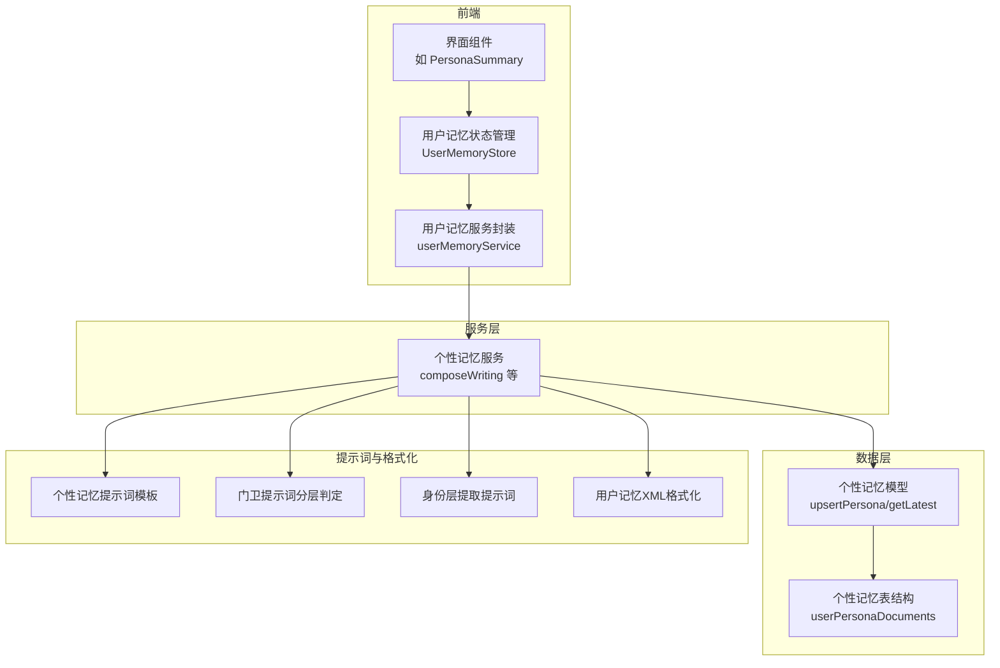
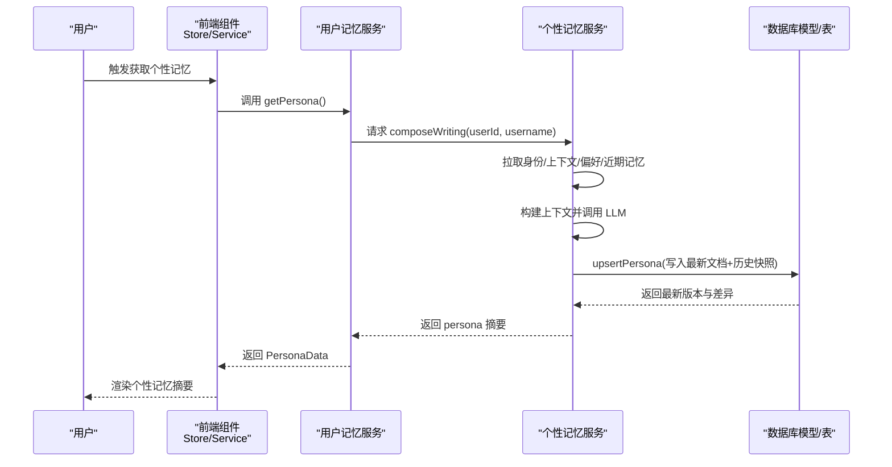
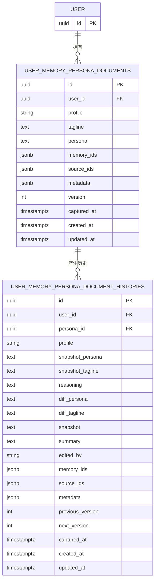
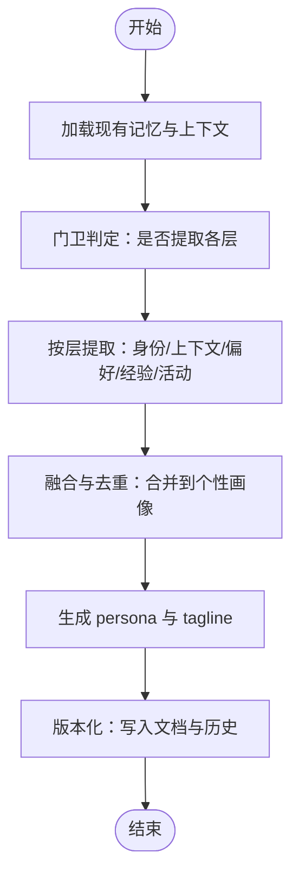
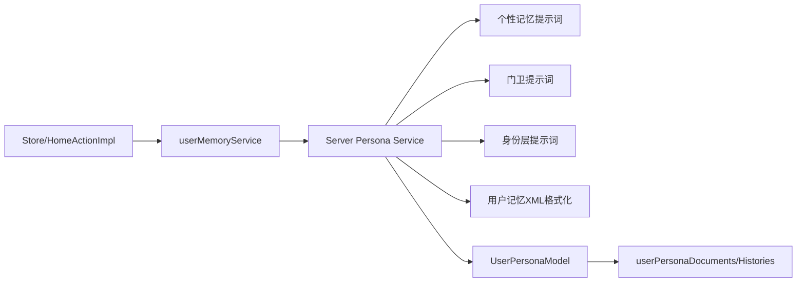

# 个性记忆（Persona Memory）

<cite>
**本文引用的文件**
- [packages/memory-user-memory/src/prompts/persona.ts](file://packages/memory-user-memory/src/prompts/persona.ts)
- [packages/memory-user-memory/src/prompts/layers/identity.ts](file://packages/memory-user-memory/src/prompts/layers/identity.ts)
- [packages/memory-user-memory/src/prompts/gatekeeper.ts](file://packages/memory-user-memory/src/prompts/gatekeeper.ts)
- [packages/prompts/src/prompts/userMemory/index.ts](file://packages/prompts/src/prompts/userMemory/index.ts)
- [packages/database/src/schemas/userMemories/persona.ts](file://packages/database/src/schemas/userMemories/persona.ts)
- [packages/database/src/models/userMemory/persona.ts](file://packages/database/src/models/userMemory/persona.ts)
- [src/services/userMemory/index.ts](file://src/services/userMemory/index.ts)
- [src/store/userMemory/slices/home/action.ts](file://src/store/userMemory/slices/home/action.ts)
- [src/store/userMemory/initialState.ts](file://src/store/userMemory/initialState.ts)
- [src/server/services/memory/userMemory/persona/service.ts](file://src/server/services/memory/userMemory/persona/service.ts)
- [packages/database/src/schemas/userMemories/index.ts](file://packages/database/src/schemas/userMemories/index.ts)
- [packages/database/src/models/userMemory/__tests__/preference.test.ts](file://packages/database/src/models/userMemory/__tests__/preference.test.ts)
</cite>

## 目录

1. [简介](#简介)
2. [项目结构](#项目结构)
3. [核心组件](#核心组件)
4. [架构总览](#架构总览)
5. [组件详解](#组件详解)
6. [依赖关系分析](#依赖关系分析)
7. [性能考量](#性能考量)
8. [故障排查指南](#故障排查指南)
9. [结论](#结论)
10. [附录](#附录)

## 简介

本文件系统化梳理 “个性记忆（Persona Memory）” 模块的数据模型与实现，围绕用户性格特征、行为模式、偏好倾向、价值观等抽象概念的数字化表示展开，给出多维度建模方法、学习与适应机制、动态调整策略，并结合 Agent 个性化交互场景说明其应用价值。同时，明确隐私边界、数据安全与用户控制权设计原则，确保在增强体验的同时尊重用户权利。

## 项目结构

个性记忆模块横跨提示词工程、数据库模型、服务层、前端状态与存储、以及后端服务编排等多个层次，形成从 “输入对话信号” 到 “生成并维护个性画像” 的闭环。

图表来源

- [src/store/userMemory/slices/home/action.ts](file://src/store/userMemory/slices/home/action.ts#L28-L45)
- [src/services/userMemory/index.ts](file://src/services/userMemory/index.ts#L74-L76)
- [src/server/services/memory/userMemory/persona/service.ts](file://src/server/services/memory/userMemory/persona/service.ts#L132-L166)
- [packages/memory-user-memory/src/prompts/persona.ts](file://packages/memory-user-memory/src/prompts/persona.ts#L1-L61)
- [packages/memory-user-memory/src/prompts/gatekeeper.ts](file://packages/memory-user-memory/src/prompts/gatekeeper.ts#L1-L128)
- [packages/memory-user-memory/src/prompts/layers/identity.ts](file://packages/memory-user-memory/src/prompts/layers/identity.ts#L1-L227)
- [packages/prompts/src/prompts/userMemory/index.ts](file://packages/prompts/src/prompts/userMemory/index.ts#L146-L209)
- [packages/database/src/schemas/userMemories/persona.ts](file://packages/database/src/schemas/userMemories/persona.ts#L13-L86)
- [packages/database/src/models/userMemory/persona.ts](file://packages/database/src/models/userMemory/persona.ts#L71-L151)

章节来源

- [src/store/userMemory/slices/home/action.ts](file://src/store/userMemory/slices/home/action.ts#L1-L73)
- [src/services/userMemory/index.ts](file://src/services/userMemory/index.ts#L1-L165)
- [src/server/services/memory/userMemory/persona/service.ts](file://src/server/services/memory/userMemory/persona/service.ts#L132-L166)
- [packages/memory-user-memory/src/prompts/persona.ts](file://packages/memory-user-memory/src/prompts/persona.ts#L1-L61)
- [packages/memory-user-memory/src/prompts/gatekeeper.ts](file://packages/memory-user-memory/src/prompts/gatekeeper.ts#L1-L128)
- [packages/memory-user-memory/src/prompts/layers/identity.ts](file://packages/memory-user-memory/src/prompts/layers/identity.ts#L1-L227)
- [packages/prompts/src/prompts/userMemory/index.ts](file://packages/prompts/src/prompts/userMemory/index.ts#L1-L209)
- [packages/database/src/schemas/userMemories/persona.ts](file://packages/database/src/schemas/userMemories/persona.ts#L1-L86)
- [packages/database/src/models/userMemory/persona.ts](file://packages/database/src/models/userMemory/persona.ts#L1-L151)

## 核心组件

- 提示词与规则
  - 个性记忆提示词：定义个性画像的覆盖范围、结构与刷新规则，输出包含 tagline、persona、diff、reasoning、memoryIds、sourceIds 的 JSON 结构。
  - 门卫提示词：对对话进行分层判定，决定是否提取到活动、身份、上下文、偏好、经验五个层。
  - 身份层提取提示词：聚焦身份信息的提取，强调去重、更新与移除的 CRUD 风格操作。
- 数据模型与表结构
  - 个性记忆文档表与历史表：支持版本号、快照、变更摘要、编辑来源、关联的记忆与来源 ID 等字段。
  - 其他记忆层（身份、上下文、偏好、经验、活动）：统一的 XML 格式化与检索接口。
- 服务与状态
  - 用户记忆服务：封装增删改查、检索、标签查询、上下文注入等能力；提供获取个性记忆摘要的入口。
  - 前端状态：PersonaData 结构、初始化标志位、标签与角色缓存、记忆映射与时间戳等。
  - 服务端编排：按层拉取记忆、构建上下文、调用 LLM 写作个性记忆。

章节来源

- [packages/memory-user-memory/src/prompts/persona.ts](file://packages/memory-user-memory/src/prompts/persona.ts#L1-L61)
- [packages/memory-user-memory/src/prompts/gatekeeper.ts](file://packages/memory-user-memory/src/prompts/gatekeeper.ts#L1-L128)
- [packages/memory-user-memory/src/prompts/layers/identity.ts](file://packages/memory-user-memory/src/prompts/layers/identity.ts#L1-L227)
- [packages/database/src/schemas/userMemories/persona.ts](file://packages/database/src/schemas/userMemories/persona.ts#L1-L86)
- [packages/database/src/models/userMemory/persona.ts](file://packages/database/src/models/userMemory/persona.ts#L1-L151)
- [packages/prompts/src/prompts/userMemory/index.ts](file://packages/prompts/src/prompts/userMemory/index.ts#L1-L209)
- [src/services/userMemory/index.ts](file://src/services/userMemory/index.ts#L74-L76)
- [src/store/userMemory/initialState.ts](file://src/store/userMemory/initialState.ts#L16-L41)

## 架构总览

个性记忆的生成与维护遵循 “输入信号 → 分层判定 → 提取与融合 → 写入与版本化 → 历史记录” 的流程。前端通过服务层调用后端，后端聚合多层记忆，驱动 LLM 生成个性画像，并持久化到数据库。

图表来源

- [src/services/userMemory/index.ts](file://src/services/userMemory/index.ts#L74-L76)
- [src/server/services/memory/userMemory/persona/service.ts](file://src/server/services/memory/userMemory/persona/service.ts#L132-L166)
- [packages/database/src/models/userMemory/persona.ts](file://packages/database/src/models/userMemory/persona.ts#L71-L151)

## 组件详解

### 数据模型与版本化

- 表结构要点
  - 文档表：保存最新 persona 与 tagline，记录关联的记忆 ID 与来源 ID、元数据、版本号、捕获时间等。
  - 历史表：记录每次变更的快照、diff、reasoning、编辑来源、版本号等，便于审计与回溯。
- 版本控制
  - upsert 流程在事务中完成，先计算下一个版本号，再根据是否存在旧文档选择更新或插入；若存在变更，则写入历史项。
- 字段语义
  - memoryIds/sourceIds：用于追踪触发本次更新的记忆与话题来源，便于溯源与重算。
  - metadata：扩展字段，可用于标注生成过程中的参数或外部上下文。
  - editedBy：标识编辑来源（用户、代理、代理工具），便于治理与审计。

图表来源

- [packages/database/src/schemas/userMemories/persona.ts](file://packages/database/src/schemas/userMemories/persona.ts#L13-L86)
- [packages/database/src/models/userMemory/persona.ts](file://packages/database/src/models/userMemory/persona.ts#L71-L151)

章节来源

- [packages/database/src/schemas/userMemories/persona.ts](file://packages/database/src/schemas/userMemories/persona.ts#L1-L86)
- [packages/database/src/models/userMemory/persona.ts](file://packages/database/src/models/userMemory/persona.ts#L71-L151)

### 提示词与格式化

- 个性记忆提示词
  - 明确覆盖范围（身份、动机、当前焦点、近期里程碑、关系、工作 / 学校、互动线索、目标与风险）、结构要求（标题 + 清晰标题、叙述性段落、灵活增删）、刷新规则（语言、合并现有、字数、避免虚构、避免暴露内部 ID）。
  - 输出 JSON 包含 tagline、persona、diff、reasoning、memoryIds、sourceIds。
- 门卫提示词
  - 对五层记忆进行判定：活动（事件与反馈）、身份（背景与角色）、上下文（新情境框架）、偏好（持久偏好与指令）、经验（可复用的洞察）。
  - 强调去重与价值判断，区分任务特定约束与用户持久偏好。
- 身份层提取提示词
  - 强调 “谁是用户”“什么重要”“什么令人惊讶或激励”，避免虚构默认值；使用 CRUD 风格动作保持记录精炼。
- 用户记忆 XML 格式化
  - 将 persona、identities、contexts、experiences、preferences 组织为统一 XML，便于注入到下游提示词或检索。

图表来源

- [packages/memory-user-memory/src/prompts/gatekeeper.ts](file://packages/memory-user-memory/src/prompts/gatekeeper.ts#L1-L128)
- [packages/memory-user-memory/src/prompts/layers/identity.ts](file://packages/memory-user-memory/src/prompts/layers/identity.ts#L1-L227)
- [packages/prompts/src/prompts/userMemory/index.ts](file://packages/prompts/src/prompts/userMemory/index.ts#L146-L209)

章节来源

- [packages/memory-user-memory/src/prompts/persona.ts](file://packages/memory-user-memory/src/prompts/persona.ts#L1-L61)
- [packages/memory-user-memory/src/prompts/gatekeeper.ts](file://packages/memory-user-memory/src/prompts/gatekeeper.ts#L1-L128)
- [packages/memory-user-memory/src/prompts/layers/identity.ts](file://packages/memory-user-memory/src/prompts/layers/identity.ts#L1-L227)
- [packages/prompts/src/prompts/userMemory/index.ts](file://packages/prompts/src/prompts/userMemory/index.ts#L1-L209)

### 学习算法、适应机制与动态调整

- 自适应更新
  - 通过门卫提示词识别新增或增量信息，避免重复与冗余；当内容与现有记忆高度重合时抑制提取。
- 多源信号融合
  - 聚合身份、上下文、偏好、近期记忆等多层信号，以 LLM 作为 “叙事整合器”，生成连贯且有结构的个性画像。
- 版本与差异追踪
  - 每次更新生成 diff 与快照，保留 “为何更新”“哪些部分变化” 的理由与证据，便于回滚与审计。
- 动态调整策略
  - 基于最近记忆与用户反馈，优先更新 “当前焦点”“关系”“互动线索” 等高价值区域；对模糊或不确定的信息降低置信度，避免错误固化。

章节来源

- [src/server/services/memory/userMemory/persona/service.ts](file://src/server/services/memory/userMemory/persona/service.ts#L132-L166)
- [packages/database/src/models/userMemory/persona.ts](file://packages/database/src/models/userMemory/persona.ts#L71-L151)

### 在 Agent 个性化交互中的应用

- 上下文注入
  - 将格式化的用户记忆注入到对话提示词中，帮助 Agent 在多轮对话中维持一致性与连续性。
- 个性化响应
  - 基于偏好与互动线索，调整语言风格、节奏与建议方式，提升亲和力与有效性。
- 场景示例
  - 当用户偏好简洁与代码示例时，Agent 在回答中优先采用要点与最小可运行示例。
  - 当用户处于特定工作 / 学习阶段时，Agent 更关注相关领域知识与进度反馈。

章节来源

- [packages/prompts/src/prompts/userMemory/index.ts](file://packages/prompts/src/prompts/userMemory/index.ts#L146-L209)
- [packages/database/src/models/userMemory/**tests**/preference.test.ts](file://packages/database/src/models/userMemory/__tests__/preference.test.ts#L36-L81)

### 隐私边界、数据安全与用户控制权

- 最小化采集
  - 仅提取与用户画像相关的非敏感事实，严格禁止提取密码、密钥、金融、医疗等敏感信息。
- 可追溯与可撤销
  - memoryIds/sourceIds 记录来源，支持用户请求删除或修正；历史表保留变更轨迹，便于审计。
- 用户控制
  - 用户可查看、导出、删除个人记忆；编辑来源（editedBy）标注生成方，保障透明度。
- 合规与治理
  - 通过门卫提示词过滤任务特定约束与一次性指令，避免将临时需求误判为持久偏好。

章节来源

- [packages/memory-user-memory/src/prompts/gatekeeper.ts](file://packages/memory-user-memory/src/prompts/gatekeeper.ts#L205-L214)
- [packages/database/src/schemas/userMemories/persona.ts](file://packages/database/src/schemas/userMemories/persona.ts#L7-L11)
- [packages/database/src/models/userMemory/persona.ts](file://packages/database/src/models/userMemory/persona.ts#L114-L149)

## 依赖关系分析

- 前端到服务层
  - Store 使用 SWR 获取 persona 并设置初始化标志；Service 封装了 getPersona 等调用。
- 服务层到服务编排
  - 个性记忆服务按层拉取记忆、构建上下文、调用 LLM 并写入数据库。
- 数据层
  - 模型负责事务性 upsert 与历史写入；表结构定义字段与索引，支撑查询与审计。

图表来源

- [src/store/userMemory/slices/home/action.ts](file://src/store/userMemory/slices/home/action.ts#L28-L45)
- [src/services/userMemory/index.ts](file://src/services/userMemory/index.ts#L74-L76)
- [src/server/services/memory/userMemory/persona/service.ts](file://src/server/services/memory/userMemory/persona/service.ts#L132-L166)
- [packages/memory-user-memory/src/prompts/persona.ts](file://packages/memory-user-memory/src/prompts/persona.ts#L1-L61)
- [packages/memory-user-memory/src/prompts/gatekeeper.ts](file://packages/memory-user-memory/src/prompts/gatekeeper.ts#L1-L128)
- [packages/memory-user-memory/src/prompts/layers/identity.ts](file://packages/memory-user-memory/src/prompts/layers/identity.ts#L1-L227)
- [packages/prompts/src/prompts/userMemory/index.ts](file://packages/prompts/src/prompts/userMemory/index.ts#L146-L209)
- [packages/database/src/models/userMemory/persona.ts](file://packages/database/src/models/userMemory/persona.ts#L71-L151)
- [packages/database/src/schemas/userMemories/persona.ts](file://packages/database/src/schemas/userMemories/persona.ts#L13-L86)

章节来源

- [src/store/userMemory/slices/home/action.ts](file://src/store/userMemory/slices/home/action.ts#L1-L73)
- [src/services/userMemory/index.ts](file://src/services/userMemory/index.ts#L1-L165)
- [src/server/services/memory/userMemory/persona/service.ts](file://src/server/services/memory/userMemory/persona/service.ts#L132-L166)
- [packages/database/src/models/userMemory/persona.ts](file://packages/database/src/models/userMemory/persona.ts#L1-L151)
- [packages/database/src/schemas/userMemories/persona.ts](file://packages/database/src/schemas/userMemories/persona.ts#L1-L86)

## 性能考量

- 查询与排序
  - 通过索引与唯一键优化按用户与 profile 的查询；限制返回数量以减少传输与渲染压力。
- 批量与并发
  - 服务端按层并行拉取记忆，缩短等待时间；事务内完成 upsert 与历史写入，保证一致性。
- 缓存与去重
  - 前端 SWR 缓存 persona 与标签结果；门卫提示词先比对相似记忆，避免重复提取。

章节来源

- [packages/database/src/schemas/userMemories/persona.ts](file://packages/database/src/schemas/userMemories/persona.ts#L35-L38)
- [src/store/userMemory/slices/home/action.ts](file://src/store/userMemory/slices/home/action.ts#L28-L45)
- [src/server/services/memory/userMemory/persona/service.ts](file://src/server/services/memory/userMemory/persona/service.ts#L134-L145)

## 故障排查指南

- 无法获取 persona
  - 检查服务端 getPersona 是否成功返回；确认 Store 的 onSuccess 回调是否设置 personaInit。
- 版本未递增或历史缺失
  - 确认 upsert 参数中是否存在 diff 或 memoryIds/sourceIds；检查事务是否正常提交。
- 偏好未生效
  - 核对偏好类型与持久性标记；确保格式化 XML 中包含偏好节点。
- 权限与隐私
  - 若出现敏感信息泄露迹象，立即检查门卫提示词过滤逻辑与数据清理流程。

章节来源

- [src/store/userMemory/slices/home/action.ts](file://src/store/userMemory/slices/home/action.ts#L28-L45)
- [packages/database/src/models/userMemory/persona.ts](file://packages/database/src/models/userMemory/persona.ts#L114-L149)
- [packages/prompts/src/prompts/userMemory/index.ts](file://packages/prompts/src/prompts/userMemory/index.ts#L146-L209)
- [packages/memory-user-memory/src/prompts/gatekeeper.ts](file://packages/memory-user-memory/src/prompts/gatekeeper.ts#L205-L214)

## 结论

个性记忆模块通过 “提示词工程 + 多层记忆融合 + 版本化与历史追踪 + 前后端协同” 的体系，实现了对用户抽象特征的持续建模与动态演进。它不仅提升了 Agent 的个性化交互质量，也通过严格的隐私与治理设计保障了用户权益。未来可在多人格档案、跨会话一致性校验、以及更细粒度的偏好权重等方面进一步完善。

## 附录

- 关键接口与数据结构路径
  - 个性记忆提示词：[packages/memory-user-memory/src/prompts/persona.ts](file://packages/memory-user-memory/src/prompts/persona.ts#L1-L61)
  - 门卫提示词：[packages/memory-user-memory/src/prompts/gatekeeper.ts](file://packages/memory-user-memory/src/prompts/gatekeeper.ts#L1-L128)
  - 身份层提取提示词：[packages/memory-user-memory/src/prompts/layers/identity.ts](file://packages/memory-user-memory/src/prompts/layers/identity.ts#L1-L227)
  - 用户记忆 XML 格式化：[packages/prompts/src/prompts/userMemory/index.ts](file://packages/prompts/src/prompts/userMemory/index.ts#L146-L209)
  - 个性记忆表结构：[packages/database/src/schemas/userMemories/persona.ts](file://packages/database/src/schemas/userMemories/persona.ts#L13-L86)
  - 个性记忆模型：[packages/database/src/models/userMemory/persona.ts](file://packages/database/src/models/userMemory/persona.ts#L71-L151)
  - 用户记忆服务：[src/services/userMemory/index.ts](file://src/services/userMemory/index.ts#L74-L76)
  - 前端 Store 与状态：[src/store/userMemory/slices/home/action.ts](file://src/store/userMemory/slices/home/action.ts#L28-L45)、[src/store/userMemory/initialState.ts](file://src/store/userMemory/initialState.ts#L16-L41)
  - 服务端编排：[src/server/services/memory/userMemory/persona/service.ts](file://src/server/services/memory/userMemory/persona/service.ts#L132-L166)
  - 偏好模型测试参考：[packages/database/src/models/userMemory/**tests**/preference.test.ts](file://packages/database/src/models/userMemory/__tests__/preference.test.ts#L36-L81)
