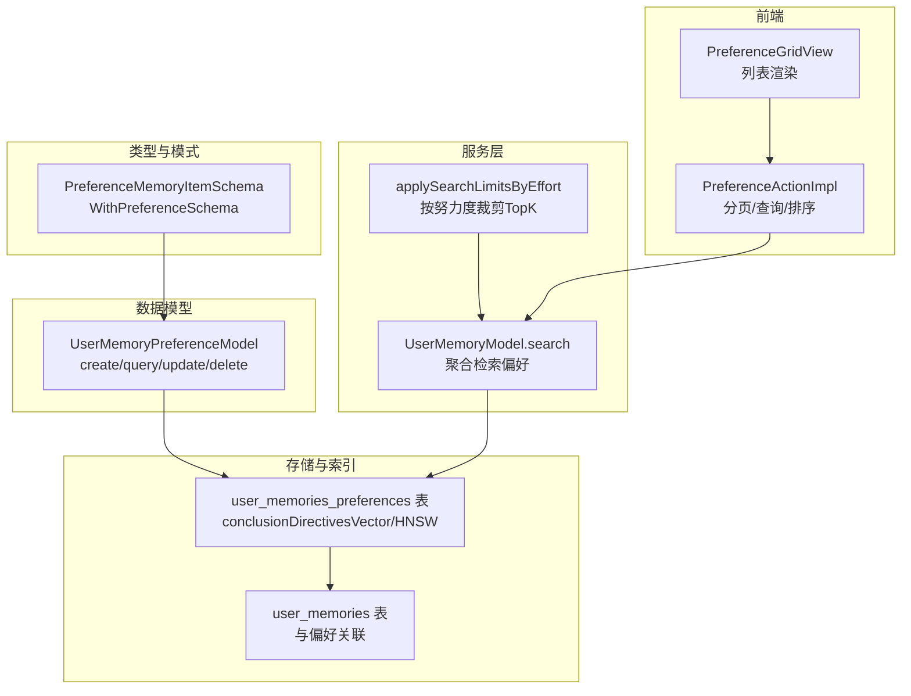
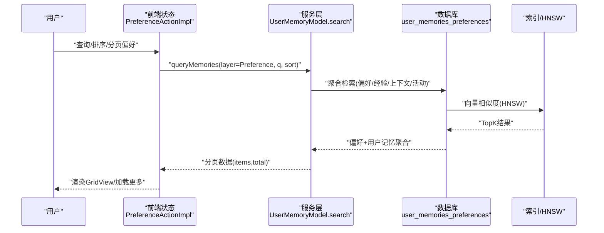
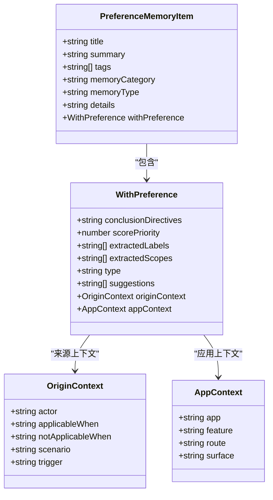
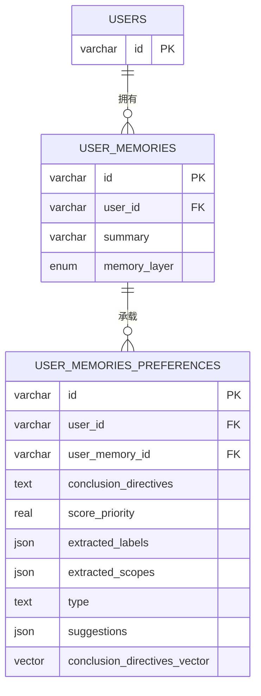
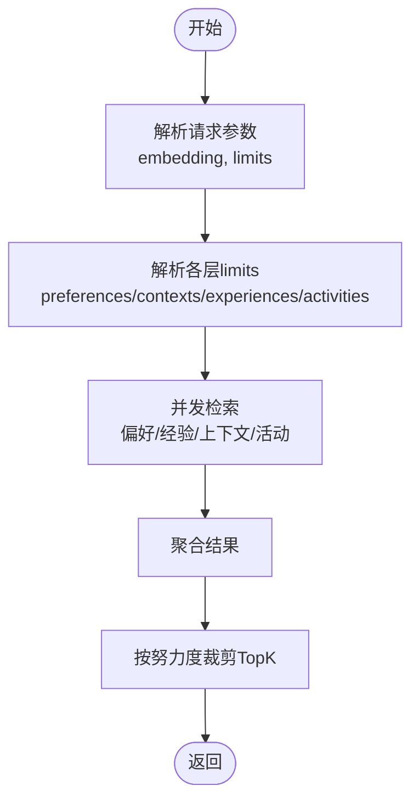
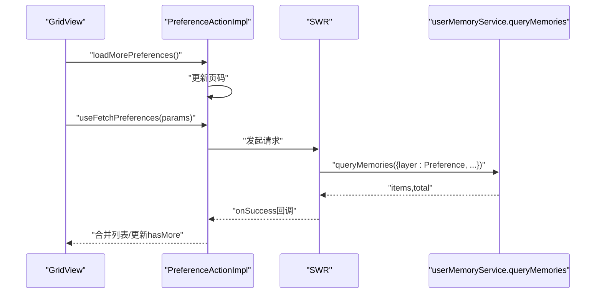
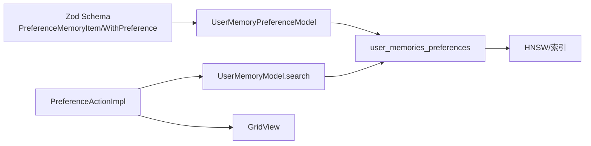

# 偏好记忆 (Preference Memory)

<cite>
**本文引用的文件**
- [packages/memory-user-memory/src/schemas/preference.ts](file://packages/memory-user-memory/src/schemas/preference.ts)
- [packages/database/src/models/userMemory/preference.ts](file://packages/database/src/models/userMemory/preference.ts)
- [packages/database/migrations/meta/0090_snapshot.json](file://packages/database/migrations/meta/0090_snapshot.json)
- [packages/types/src/userMemory/layers.ts](file://packages/types/src/userMemory/layers.ts)
- [src/store/userMemory/slices/preference/action.ts](file://src/store/userMemory/slices/preference/action.ts)
- [src/store/userMemory/slices/preference/initialState.ts](file://src/store/userMemory/slices/preference/initialState.ts)
- [src/routes/(main)/memory/preferences/features/List/GridView/index.tsx](file://src/routes/(main)/memory/preferences/features/List/GridView/index.tsx)
- [packages/database/src/models/userMemory/model.ts](file://packages/database/src/models/userMemory/model.ts)
- [packages/prompts/src/prompts/userMemory/index.test.ts](file://packages/prompts/src/prompts/userMemory/index.test.ts)
- [packages/memory-user-memory/src/extractors/preference.test.ts](file://packages/memory-user-memory/src/extractors/preference.test.ts)
- [src/server/services/toolExecution/serverRuntimes/memory.ts](file://src/server/services/toolExecution/serverRuntimes/memory.ts)
</cite>

## 目录
1. [简介](#简介)
2. [项目结构](#项目结构)
3. [核心组件](#核心组件)
4. [架构总览](#架构总览)
5. [详细组件分析](#详细组件分析)
6. [依赖关系分析](#依赖关系分析)
7. [性能考量](#性能考量)
8. [故障排查指南](#故障排查指南)
9. [结论](#结论)
10. [附录](#附录)

## 简介
本文件聚焦“偏好记忆”模块，系统化梳理其数据模型、存储结构、检索与排序策略、前端展示与交互、以及在个性化推荐与内容定制中的应用路径。该模块以“显式偏好（明确表达）”为核心，结合“隐式偏好（行为推断）”与“潜在偏好（未来需求预测）”的建模思路，构建可向量化检索、可优先级排序、可上下文标注的偏好记忆体系，并通过数据库索引与服务层限制策略保障性能与隐私。

## 项目结构
偏好记忆模块横跨“类型定义 → 数据模型 → 存储与索引 → 服务层检索 → 前端状态与展示”全链路，关键位置如下：
- 类型与模式：定义偏好记忆的字段、优先级、来源上下文与应用上下文等
- 数据模型：封装偏好表的增删改查、事务删除与关联用户记忆
- 存储与索引：向量字段、HNSW索引、BTree索引、外键约束
- 服务层检索：聚合检索（偏好/经验/上下文/活动）与按努力度限制
- 前端状态：分页、查询、排序、加载状态与列表渲染
- 提示工程：偏好过滤空值、格式化输出
- 推理提取：偏好抽取器与生成对象模式校验

**图表来源**
- [packages/memory-user-memory/src/schemas/preference.ts](file://packages/memory-user-memory/src/schemas/preference.ts#L29-L84)
- [packages/database/src/models/userMemory/preference.ts](file://packages/database/src/models/userMemory/preference.ts#L16-L80)
- [packages/database/migrations/meta/0090_snapshot.json](file://packages/database/migrations/meta/0090_snapshot.json#L11996-L12041)
- [packages/database/src/models/userMemory/model.ts](file://packages/database/src/models/userMemory/model.ts#L711-L738)
- [src/store/userMemory/slices/preference/action.ts](file://src/store/userMemory/slices/preference/action.ts#L27-L136)
- [src/routes/(main)/memory/preferences/features/List/GridView/index.tsx](file://src/routes/(main)/memory/preferences/features/List/GridView/index.tsx#L15-L30)

**章节来源**
- [packages/memory-user-memory/src/schemas/preference.ts](file://packages/memory-user-memory/src/schemas/preference.ts#L1-L91)
- [packages/database/src/models/userMemory/preference.ts](file://packages/database/src/models/userMemory/preference.ts#L1-L81)
- [packages/database/migrations/meta/0090_snapshot.json](file://packages/database/migrations/meta/0090_snapshot.json#L11973-L12068)
- [packages/database/src/models/userMemory/model.ts](file://packages/database/src/models/userMemory/model.ts#L707-L738)
- [src/store/userMemory/slices/preference/action.ts](file://src/store/userMemory/slices/preference/action.ts#L1-L140)
- [src/routes/(main)/memory/preferences/features/List/GridView/index.tsx](file://src/routes/(main)/memory/preferences/features/List/GridView/index.tsx#L1-L32)

## 核心组件
- 偏好记忆数据模型
  - 显式偏好字段：结论指令、优先级、标签、范围、建议、类型、来源上下文、应用上下文
  - 关联用户记忆：偏好可挂载到用户记忆条目，支持事务删除联动
- 存储与索引
  - 向量字段：结论指令向量，支持余弦距离的HNSW索引
  - 索引与约束：用户ID、用户记忆ID的BTree索引；外键级联删除
- 服务层检索
  - 聚合检索：同时检索偏好/经验/上下文/活动，按请求限制裁剪
  - 努力度限制：根据“高/中/低”内存检索努力度，自动限制TopK
- 前端状态与展示
  - 分页与查询：支持关键词、排序（捕获时间/优先级）
  - 列表渲染：网格视图，懒加载更多

**章节来源**
- [packages/memory-user-memory/src/schemas/preference.ts](file://packages/memory-user-memory/src/schemas/preference.ts#L29-L84)
- [packages/database/src/models/userMemory/preference.ts](file://packages/database/src/models/userMemory/preference.ts#L16-L80)
- [packages/database/migrations/meta/0090_snapshot.json](file://packages/database/migrations/meta/0090_snapshot.json#L11996-L12041)
- [packages/database/src/models/userMemory/model.ts](file://packages/database/src/models/userMemory/model.ts#L711-L738)
- [src/store/userMemory/slices/preference/action.ts](file://src/store/userMemory/slices/preference/action.ts#L16-L136)
- [src/routes/(main)/memory/preferences/features/List/GridView/index.tsx](file://src/routes/(main)/memory/preferences/features/List/GridView/index.tsx#L15-L30)

## 架构总览
偏好记忆从“抽取/输入”到“持久化/检索/排序”，再到“前端展示/交互”的完整闭环如下：

**图表来源**
- [src/store/userMemory/slices/preference/action.ts](file://src/store/userMemory/slices/preference/action.ts#L73-L136)
- [packages/database/src/models/userMemory/model.ts](file://packages/database/src/models/userMemory/model.ts#L711-L738)
- [packages/database/migrations/meta/0090_snapshot.json](file://packages/database/migrations/meta/0090_snapshot.json#L11996-L12041)

**章节来源**
- [src/store/userMemory/slices/preference/action.ts](file://src/store/userMemory/slices/preference/action.ts#L27-L136)
- [packages/database/src/models/userMemory/model.ts](file://packages/database/src/models/userMemory/model.ts#L711-L738)

## 详细组件分析

### 数据模型与字段设计
- 字段层次
  - 偏好元信息：标题、摘要、标签、分类、类型
  - 偏好内容：结论指令（直接行动指令）、优先级权重、建议、标签与范围
  - 上下文：来源上下文（触发条件、适用场景、不适用条件）、应用上下文（产品/功能/路由/表面）
- 设计要点
  - 结论指令强调“做什么”而非“怎么做”，便于下游执行器直接消费
  - 优先级权重用于排序与资源分配
  - 标签与范围用于检索与过滤
  - 来源与应用上下文用于解释偏好产生的背景与边界

**图表来源**
- [packages/memory-user-memory/src/schemas/preference.ts](file://packages/memory-user-memory/src/schemas/preference.ts#L8-L84)

**章节来源**
- [packages/memory-user-memory/src/schemas/preference.ts](file://packages/memory-user-memory/src/schemas/preference.ts#L1-L91)

### 存储与索引
- 表结构要点
  - 用户偏好表：包含用户ID、用户记忆ID、结论指令、优先级、标签、类型、建议、向量字段等
  - 用户记忆表：作为偏好载体，支持事务删除时级联删除偏好
- 索引与约束
  - HNSW向量索引：基于结论指令向量的余弦距离检索
  - BTree索引：用户ID、用户记忆ID，加速过滤与关联
  - 外键约束：偏好到用户与用户记忆的级联删除

**图表来源**
- [packages/database/migrations/meta/0090_snapshot.json](file://packages/database/migrations/meta/0090_snapshot.json#L11996-L12061)

**章节来源**
- [packages/database/migrations/meta/0090_snapshot.json](file://packages/database/migrations/meta/0090_snapshot.json#L11973-L12068)

### 服务层检索与限制策略
- 聚合检索
  - 同步检索偏好、经验、上下文、活动，分别按请求限制裁剪
- 努力度限制
  - 根据“高/中/低”内存检索努力度，自动限制TopK，平衡性能与召回

**图表来源**
- [packages/database/src/models/userMemory/model.ts](file://packages/database/src/models/userMemory/model.ts#L711-L738)
- [src/server/services/toolExecution/serverRuntimes/memory.ts](file://src/server/services/toolExecution/serverRuntimes/memory.ts#L55-L67)

**章节来源**
- [packages/database/src/models/userMemory/model.ts](file://packages/database/src/models/userMemory/model.ts#L711-L738)
- [src/server/services/toolExecution/serverRuntimes/memory.ts](file://src/server/services/toolExecution/serverRuntimes/memory.ts#L46-L67)

### 前端状态与展示
- 状态字段
  - 偏好列表、是否还有更多、初始化状态、当前页、查询关键词、排序方式、总数
- 行为
  - 加载更多、重置列表（含查询与排序）、SWR拉取与去重累积
- 展示
  - 网格视图渲染，支持懒加载与加载状态

**图表来源**
- [src/store/userMemory/slices/preference/action.ts](file://src/store/userMemory/slices/preference/action.ts#L46-L136)
- [src/routes/(main)/memory/preferences/features/List/GridView/index.tsx](file://src/routes/(main)/memory/preferences/features/List/GridView/index.tsx#L15-L30)

**章节来源**
- [src/store/userMemory/slices/preference/action.ts](file://src/store/userMemory/slices/preference/action.ts#L1-L140)
- [src/store/userMemory/slices/preference/initialState.ts](file://src/store/userMemory/slices/preference/initialState.ts#L1-L23)
- [src/routes/(main)/memory/preferences/features/List/GridView/index.tsx](file://src/routes/(main)/memory/preferences/features/List/GridView/index.tsx#L1-L32)

### 推理抽取与提示工程
- 抽取器
  - 偏好抽取器基于模板与LLM生成对象模式，严格约束输出结构
- 提示工程
  - 过滤空的结论指令，保证偏好内容有效
  - 统一格式化输出，便于下游处理

**章节来源**
- [packages/memory-user-memory/src/extractors/preference.test.ts](file://packages/memory-user-memory/src/extractors/preference.test.ts#L26-L39)
- [packages/prompts/src/prompts/userMemory/index.test.ts](file://packages/prompts/src/prompts/userMemory/index.test.ts#L200-L235)

## 依赖关系分析
- 类型与模式
  - 偏好项与偏好字段由Zod Schema定义，确保数据一致性
- 数据模型
  - 偏好模型封装CRUD与事务删除，保证偏好与用户记忆的一致性
- 存储与索引
  - HNSW向量索引支撑高效相似度检索；BTree索引支撑用户维度过滤
- 服务层
  - 聚合检索与努力度限制，避免过度计算
- 前端
  - SWR驱动的分页与去重，提升用户体验

**图表来源**
- [packages/memory-user-memory/src/schemas/preference.ts](file://packages/memory-user-memory/src/schemas/preference.ts#L29-L84)
- [packages/database/src/models/userMemory/preference.ts](file://packages/database/src/models/userMemory/preference.ts#L16-L80)
- [packages/database/migrations/meta/0090_snapshot.json](file://packages/database/migrations/meta/0090_snapshot.json#L11996-L12041)
- [packages/database/src/models/userMemory/model.ts](file://packages/database/src/models/userMemory/model.ts#L711-L738)
- [src/store/userMemory/slices/preference/action.ts](file://src/store/userMemory/slices/preference/action.ts#L73-L136)

**章节来源**
- [packages/types/src/userMemory/layers.ts](file://packages/types/src/userMemory/layers.ts#L113-L129)
- [packages/database/src/models/userMemory/preference.ts](file://packages/database/src/models/userMemory/preference.ts#L16-L80)
- [packages/database/migrations/meta/0090_snapshot.json](file://packages/database/migrations/meta/0090_snapshot.json#L11996-L12041)
- [packages/database/src/models/userMemory/model.ts](file://packages/database/src/models/userMemory/model.ts#L711-L738)
- [src/store/userMemory/slices/preference/action.ts](file://src/store/userMemory/slices/preference/action.ts#L27-L136)

## 性能考量
- 向量检索
  - HNSW索引与余弦距离适合大规模向量相似度检索；建议控制向量维度与批量大小
- 并发检索
  - 偏好/经验/上下文/活动并发检索，减少总延迟；按层独立限制TopK
- 努力度裁剪
  - 高/中/低努力度自动限制TopK，避免昂贵查询
- 前端缓存
  - SWR去重与分页累积，降低重复请求与渲染成本

[本节为通用性能建议，无需特定文件引用]

## 故障排查指南
- 查询不到其他用户的偏好
  - 确认查询与更新均带有用户ID过滤，避免越权读写
- 更新失败或未生效
  - 检查用户ID匹配与updatedAt更新逻辑
- 删除偏好后残留
  - 确认事务删除已级联删除用户记忆
- 空结论指令导致偏好被跳过
  - 提示工程会过滤空值，确保抽取器输出有效结论指令
- 排序与分页异常
  - 检查前端分页参数与服务层排序字段

**章节来源**
- [packages/database/src/models/userMemory/preference.ts](file://packages/database/src/models/userMemory/preference.ts#L55-L80)
- [packages/database/src/models/userMemory/__tests__/preference.test.ts](file://packages/database/src/models/userMemory/__tests__/preference.test.ts#L83-L216)
- [packages/prompts/src/prompts/userMemory/index.test.ts](file://packages/prompts/src/prompts/userMemory/index.test.ts#L200-L235)

## 结论
偏好记忆模块以“显式偏好”为核心，结合向量化检索、优先级排序与上下文标注，形成可扩展、可演化的用户偏好体系。通过严格的类型约束、索引策略与服务层限制，兼顾性能与隐私；前端分页与去重进一步优化用户体验。该模块为个性化推荐、内容定制与服务优化提供了坚实基础。

[本节为总结性内容，无需特定文件引用]

## 附录

### 多层级偏好与学习算法建议
- 显式偏好（明确表达）
  - 以结论指令与优先级为主，直接用于排序与执行
- 隐式偏好（行为推断）
  - 可结合用户行为日志与偏好历史，采用协同过滤与内容推荐方法进行偏好推断
- 潜在偏好（未来需求预测）
  - 可引入序列模型与深度学习方法，基于时间序列与上下文趋势预测未来偏好

[本节为概念性说明，无需特定文件引用]

### 动态演化机制
- 时间衰减与热度重估：对长期未触达的偏好降低权重，对高频偏好提升权重
- 场景自适应：结合应用上下文与触发场景，动态调整偏好适用性
- 生命周期管理：对过期或不再适用的偏好进行归档或清理

[本节为概念性说明，无需特定文件引用]

### 公平性与用户选择权
- 公平性
  - 避免对特定群体的刻板印象：定期审查偏好标签与范围，防止偏见固化
  - 多样性注入：在排序中引入多样性因子，避免极化推荐
- 用户选择权
  - 提供偏好可见性与编辑能力，允许用户撤销、修改或删除偏好
  - 透明度：解释偏好来源与影响，保障知情同意

[本节为概念性说明，无需特定文件引用]