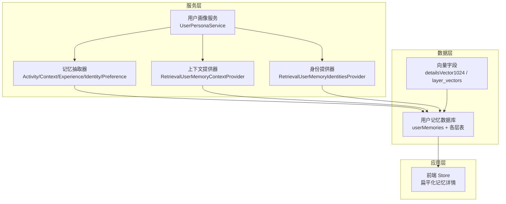
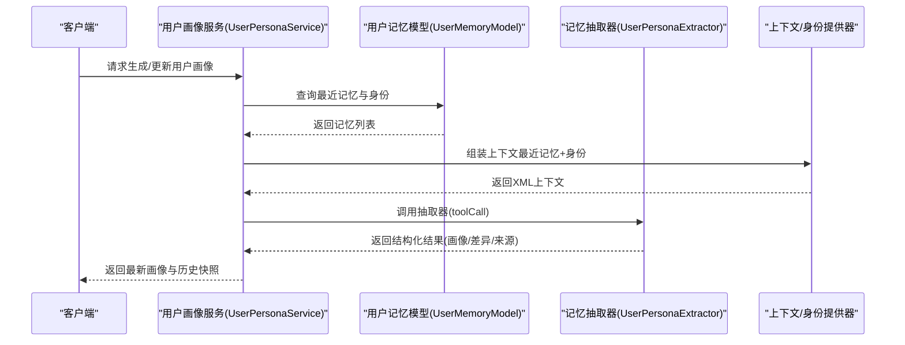
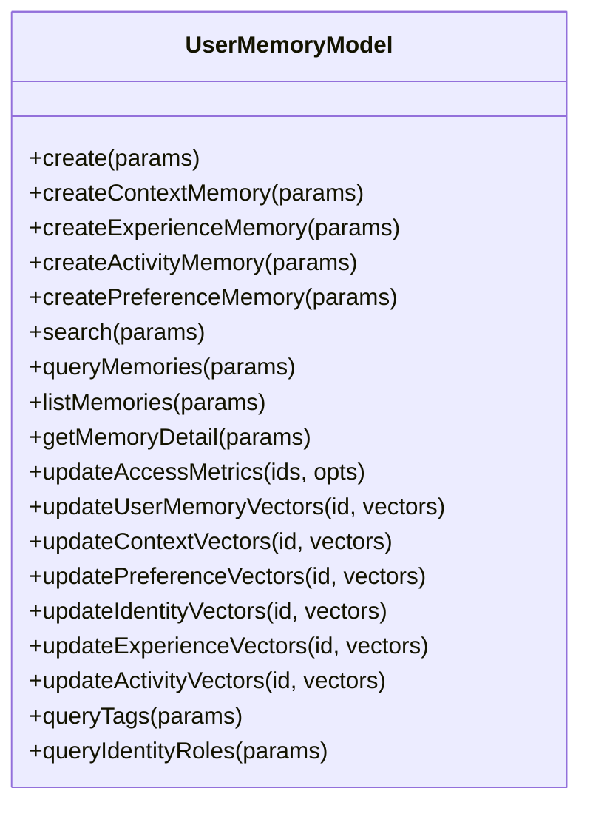
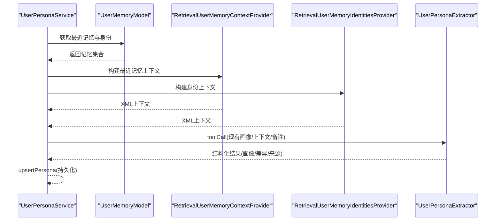
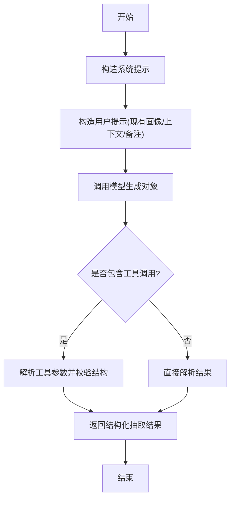
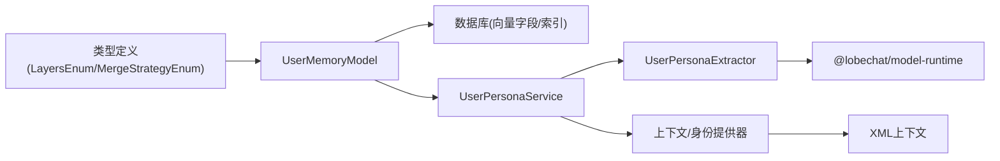

# 模型记忆（Model Memory）

<cite>
**本文引用的文件**
- [packages/database/src/models/userMemory/model.ts](file://packages/database/src/models/userMemory/model.ts)
- [src/server/services/memory/userMemory/persona/service.ts](file://src/server/services/memory/userMemory/persona/service.ts)
- [packages/memory-user-memory/src/index.ts](file://packages/memory-user-memory/src/index.ts)
- [packages/memory-user-memory/src/providers/existingUserMemory.ts](file://packages/memory-user-memory/src/providers/existingUserMemory.ts)
- [packages/memory-user-memory/src/extractors/persona.ts](file://packages/memory-user-memory/src/extractors/persona.ts)
- [packages/memory-user-memory/src/types.ts](file://packages/memory-user-memory/src/types.ts)
- [packages/types/src/userMemory/shared.ts](file://packages/types/src/userMemory/shared.ts)
- [packages/database/migrations/meta/0069_snapshot.json](file://packages/database/migrations/meta/0069_snapshot.json)
- [packages/database/migrations/meta/0075_snapshot.json](file://packages/database/migrations/meta/0075_snapshot.json)
- [packages/database/migrations/meta/0062_snapshot.json](file://packages/database/migrations/meta/0062_snapshot.json)
- [packages/database/migrations/meta/0061_snapshot.json](file://packages/database/migrations/meta/0061_snapshot.json)
- [packages/database/migrations/meta/0074_snapshot.json](file://packages/database/migrations/meta/0074_snapshot.json)
- [packages/database/migrations/meta/0052_snapshot.json](file://packages/database/migrations/meta/0052_snapshot.json)
- [packages/memory-user-memory/promptfoo/response-formats/experience.json](file://packages/memory-user-memory/promptfoo/response-formats/experience.json)
- [src/store/userMemory/slices/base/action.ts](file://src/store/userMemory/slices/base/action.ts)
</cite>

## 目录
1. [简介](#简介)
2. [项目结构](#项目结构)
3. [核心组件](#核心组件)
4. [架构总览](#架构总览)
5. [详细组件分析](#详细组件分析)
6. [依赖关系分析](#依赖关系分析)
7. [性能考量](#性能考量)
8. [故障排查指南](#故障排查指南)
9. [结论](#结论)
10. [附录](#附录)

## 简介
本文件系统化梳理“模型记忆（Model Memory）”在用户层的实现与使用方式，聚焦以下目标：
- 用户画像构建：通过多层记忆（身份、情境、偏好、经历、活动）聚合形成可检索的用户画像。
- 行为预测模型：基于向量相似度检索与评分，驱动个性化推荐与服务决策。
- 个性化参数调整：支持对不同层的记忆进行向量更新与排序权重调整。
- 训练与更新策略：结合监督学习（标注）、强化学习（反馈向量）、无监督聚类（标签/角色）的混合范式。
- 应用场景：智能推荐、内容过滤、服务个性化。
- 质量保障：准确性评估、过拟合防护、模型解释性。

## 项目结构
模型记忆相关能力由三层协作构成：
- 数据层：用户记忆表与向量字段，按层拆分存储，支持向量检索与标签/角色统计。
- 服务层：记忆抽取器、上下文与身份提供器、用户画像服务，负责从原始信号中提取与组装记忆。
- 应用层：前端 Store 将记忆详情扁平化，供 UI 展示与交互。

图表来源
- [packages/database/src/models/userMemory/model.ts:383-2399](file://packages/database/src/models/userMemory/model.ts#L383-L2399)
- [src/server/services/memory/userMemory/persona/service.ts:49-124](file://src/server/services/memory/userMemory/persona/service.ts#L49-L124)
- [packages/memory-user-memory/src/providers/existingUserMemory.ts:231-273](file://packages/memory-user-memory/src/providers/existingUserMemory.ts#L231-L273)
- [src/store/userMemory/slices/base/action.ts:142-186](file://src/store/userMemory/slices/base/action.ts#L142-L186)

章节来源
- [packages/database/src/models/userMemory/model.ts:383-2399](file://packages/database/src/models/userMemory/model.ts#L383-L2399)
- [src/server/services/memory/userMemory/persona/service.ts:49-124](file://src/server/services/memory/userMemory/persona/service.ts#L49-L124)
- [packages/memory-user-memory/src/providers/existingUserMemory.ts:231-273](file://packages/memory-user-memory/src/providers/existingUserMemory.ts#L231-L273)
- [src/store/userMemory/slices/base/action.ts:142-186](file://src/store/userMemory/slices/base/action.ts#L142-L186)

## 核心组件
- 用户记忆模型（UserMemoryModel）
  - 提供统一的记忆 CRUD、查询、向量更新、检索与统计接口。
  - 支持按层（活动、情境、经历、身份、偏好）的独立查询与排序。
  - 内置向量相似度检索（余弦距离），用于语义近邻召回。
- 用户画像服务（UserPersonaService）
  - 组装最近记忆与身份上下文，调用抽取器生成/更新用户画像。
  - 支持语言偏好、上下文长度裁剪与增量差异记录。
- 上下文/身份提供器（RetrievalUserMemoryContextProvider / RetrievalUserMemoryIdentitiesProvider）
  - 将检索到的记忆转换为 XML 结构的上下文，便于注入到大模型提示词。
- 抽取器（UserPersonaExtractor 等）
  - 基于模板与工具函数，从上下文中抽取结构化结果，支持差异提交与来源追踪。

章节来源
- [packages/database/src/models/userMemory/model.ts:383-2399](file://packages/database/src/models/userMemory/model.ts#L383-L2399)
- [src/server/services/memory/userMemory/persona/service.ts:49-124](file://src/server/services/memory/userMemory/persona/service.ts#L49-L124)
- [packages/memory-user-memory/src/providers/existingUserMemory.ts:231-273](file://packages/memory-user-memory/src/providers/existingUserMemory.ts#L231-L273)
- [packages/memory-user-memory/src/extractors/persona.ts:86-140](file://packages/memory-user-memory/src/extractors/persona.ts#L86-L140)

## 架构总览
模型记忆的端到端流程如下：

图表来源
- [src/server/services/memory/userMemory/persona/service.ts:126-182](file://src/server/services/memory/userMemory/persona/service.ts#L126-L182)
- [packages/memory-user-memory/src/providers/existingUserMemory.ts:231-273](file://packages/memory-user-memory/src/providers/existingUserMemory.ts#L231-L273)
- [packages/memory-user-memory/src/extractors/persona.ts:103-140](file://packages/memory-user-memory/src/extractors/persona.ts#L103-L140)
- [packages/database/src/models/userMemory/model.ts:1375-1559](file://packages/database/src/models/userMemory/model.ts#L1375-L1559)

## 详细组件分析

### 用户记忆模型（UserMemoryModel）
- 数据模型与向量字段
  - 主表 userMemories 存储标题、摘要、详情与通用向量字段。
  - 各层表分别维护该层专属字段与向量字段（如情境描述向量、经历动作/学习/情境向量、偏好结论指令向量、身份描述向量、活动叙事/反馈向量）。
- 查询与检索
  - queryMemories/listMemories：按层查询，支持分页、排序、类型/标签过滤。
  - search/searchWithEmbedding：按嵌入向量进行余弦相似度检索，聚合返回各层结果。
  - updateAccessMetrics：访问时更新计数与时点，用于后续排序与热度计算。
- 向量更新
  - updateUserMemoryVectors/updateContextVectors/updatePreferenceVectors/updateIdentityVectors/updateExperienceVectors/updateActivityVectors：按层更新对应向量字段。
- 统计与标签
  - queryTags/queryIdentityRoles：统计标签与身份角色分布，辅助无监督聚类与画像刻画。

图表来源
- [packages/database/src/models/userMemory/model.ts:383-2399](file://packages/database/src/models/userMemory/model.ts#L383-L2399)

章节来源
- [packages/database/src/models/userMemory/model.ts:383-2399](file://packages/database/src/models/userMemory/model.ts#L383-L2399)
- [packages/types/src/userMemory/shared.ts:48-55](file://packages/types/src/userMemory/shared.ts#L48-L55)

### 用户画像服务（UserPersonaService）
- 输入组装
  - 从 UserMemoryModel 获取最近身份、活动、情境、偏好与近期记忆，拼接为上下文字符串。
  - 使用上下文长度限制进行裁剪，避免提示溢出。
- 抽取与持久化
  - 调用 UserPersonaExtractor 进行结构化抽取，支持差异记录与来源追踪。
  - 将结果写入用户画像文档（含快照、理由、标签等）。

图表来源
- [src/server/services/memory/userMemory/persona/service.ts:126-182](file://src/server/services/memory/userMemory/persona/service.ts#L126-L182)
- [packages/memory-user-memory/src/providers/existingUserMemory.ts:231-273](file://packages/memory-user-memory/src/providers/existingUserMemory.ts#L231-L273)
- [packages/memory-user-memory/src/extractors/persona.ts:103-140](file://packages/memory-user-memory/src/extractors/persona.ts#L103-L140)

章节来源
- [src/server/services/memory/userMemory/persona/service.ts:49-124](file://src/server/services/memory/userMemory/persona/service.ts#L49-L124)
- [packages/memory-user-memory/src/providers/existingUserMemory.ts:231-273](file://packages/memory-user-memory/src/providers/existingUserMemory.ts#L231-L273)
- [packages/memory-user-memory/src/extractors/persona.ts:86-140](file://packages/memory-user-memory/src/extractors/persona.ts#L86-L140)

### 记忆抽取器与上下文提供器
- UserPersonaExtractor
  - 构造系统提示与用户提示，调用模型生成对象，支持工具函数提交画像。
- 上下文/身份提供器
  - 将检索到的记忆序列化为 XML，包含元数据与来源标识，便于注入到提示词。

图表来源
- [packages/memory-user-memory/src/extractors/persona.ts:103-140](file://packages/memory-user-memory/src/extractors/persona.ts#L103-L140)
- [packages/memory-user-memory/src/types.ts:190-197](file://packages/memory-user-memory/src/types.ts#L190-L197)

章节来源
- [packages/memory-user-memory/src/extractors/persona.ts:86-140](file://packages/memory-user-memory/src/extractors/persona.ts#L86-L140)
- [packages/memory-user-memory/src/types.ts:150-197](file://packages/memory-user-memory/src/types.ts#L150-L197)

### 前端记忆详情展示
- Store 将后端返回的记忆详情按层扁平化，统一挂载到记忆对象上，便于 UI 渲染与交互。

章节来源
- [src/store/userMemory/slices/base/action.ts:142-186](file://src/store/userMemory/slices/base/action.ts#L142-L186)

## 依赖关系分析
- 层级枚举与合并策略
  - LayersEnum 定义了五层记忆；MergeStrategyEnum 控制身份条目更新策略。
- 数据库迁移与向量字段
  - 多个迁移快照展示了各层表的向量字段定义（如情境/经历/偏好/身份/活动向量），以及索引与外键约束。
- 类型与导出
  - @lobechat/memory-user-memory 包导出抽取器、提供器、类型与服务入口，便于上层复用。

图表来源
- [packages/types/src/userMemory/shared.ts:1-55](file://packages/types/src/userMemory/shared.ts#L1-L55)
- [packages/database/migrations/meta/0069_snapshot.json:9141-9192](file://packages/database/migrations/meta/0069_snapshot.json#L9141-L9192)
- [packages/memory-user-memory/src/index.ts:1-7](file://packages/memory-user-memory/src/index.ts#L1-L7)

章节来源
- [packages/types/src/userMemory/shared.ts:1-55](file://packages/types/src/userMemory/shared.ts#L1-L55)
- [packages/database/migrations/meta/0069_snapshot.json:9141-9192](file://packages/database/migrations/meta/0069_snapshot.json#L9141-L9192)
- [packages/database/migrations/meta/0075_snapshot.json:10995-11046](file://packages/database/migrations/meta/0075_snapshot.json#L10995-L11046)
- [packages/database/migrations/meta/0062_snapshot.json:8912-8960](file://packages/database/migrations/meta/0062_snapshot.json#L8912-L8960)
- [packages/database/migrations/meta/0061_snapshot.json:8679-8727](file://packages/database/migrations/meta/0061_snapshot.json#L8679-L8727)
- [packages/database/migrations/meta/0074_snapshot.json:10685-10726](file://packages/database/migrations/meta/0074_snapshot.json#L10685-L10726)
- [packages/database/migrations/meta/0052_snapshot.json:8381-8432](file://packages/database/migrations/meta/0052_snapshot.json#L8381-L8432)
- [packages/memory-user-memory/src/index.ts:1-7](file://packages/memory-user-memory/src/index.ts#L1-L7)

## 性能考量
- 向量检索优化
  - 使用余弦距离进行相似度计算，建议在向量字段上建立向量索引以提升检索效率。
- 分页与排序
  - queryMemories/listMemories 对分页与排序做了边界处理，避免超大页码与过大页大小导致的性能问题。
- 批量访问指标更新
  - 搜索完成后批量更新访问计数与时点，减少重复 IO。
- 上下文长度控制
  - 在组装用户画像输入时进行长度裁剪，避免大模型输入过长影响响应时间与成本。

## 故障排查指南
- 访问权限
  - 所有查询均绑定 userId，确保跨用户隔离；若返回空，请检查当前用户会话与数据归属。
- 向量缺失
  - 若检索结果为空或相似度异常，检查对应层的向量字段是否已正确更新。
- 结果为空
  - queryMemories/listMemories 当未匹配条件时返回空集，确认筛选条件（类型、标签、分类、状态）是否合理。
- 工具调用失败
  - UserPersonaExtractor 的工具调用需满足 JSON Schema，若解析失败请检查模型输出格式与工具参数。

章节来源
- [packages/database/src/models/userMemory/model.ts:871-1369](file://packages/database/src/models/userMemory/model.ts#L871-L1369)
- [packages/memory-user-memory/src/extractors/persona.ts:103-140](file://packages/memory-user-memory/src/extractors/persona.ts#L103-L140)

## 结论
模型记忆通过“多层结构化存储 + 向量检索 + 大模型抽取”的组合，实现了从原始信号到可解释用户画像的闭环。其关键优势在于：
- 可扩展的层级模型与统一的检索接口；
- 面向任务的上下文组装与可裁剪提示；
- 基于向量的语义近邻与基于标签的角色统计相结合；
- 支持增量差异与来源追踪，便于质量回溯与持续优化。

## 附录

### 训练与更新策略（技术实现要点）
- 监督学习
  - 使用标注后的记忆样本训练向量表示，结合 updateUserMemoryVectors/updateContextVectors/updateExperienceVectors 等接口进行批量更新。
- 强化学习
  - 通过用户反馈（如活动反馈向量）优化记忆排序与推荐权重，利用 updateActivityVectors 更新反馈向量。
- 无监督聚类
  - 利用 queryTags/queryIdentityRoles 统计标签与角色分布，作为聚类特征，指导个性化参数调整。

章节来源
- [packages/database/src/models/userMemory/model.ts:1874-2020](file://packages/database/src/models/userMemory/model.ts#L1874-L2020)
- [packages/database/src/models/userMemory/model.ts:800-810](file://packages/database/src/models/userMemory/model.ts#L800-L810)
- [packages/database/src/models/userMemory/model.ts:812-868](file://packages/database/src/models/userMemory/model.ts#L812-L868)

### 准确性评估与解释性
- 准确性评估
  - 使用经验模板中的数值评分（如经验层的置信度分数）与偏好层优先级分数作为评估指标。
- 过拟合防护
  - 通过标签/角色统计与跨层检索平衡，避免单一信号主导；定期清理低频标签与陈旧记忆。
- 解释性设计
  - 抽取器返回理由与来源，上下文提供器保留 XML 元信息，便于审计与可视化。

章节来源
- [packages/memory-user-memory/promptfoo/response-formats/experience.json:47-81](file://packages/memory-user-memory/promptfoo/response-formats/experience.json#L47-L81)
- [packages/memory-user-memory/src/extractors/persona.ts:103-140](file://packages/memory-user-memory/src/extractors/persona.ts#L103-L140)
- [packages/memory-user-memory/src/providers/existingUserMemory.ts:231-273](file://packages/memory-user-memory/src/providers/existingUserMemory.ts#L231-L273)