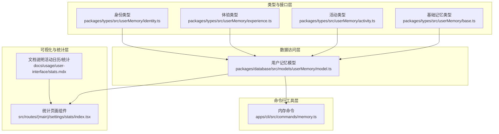
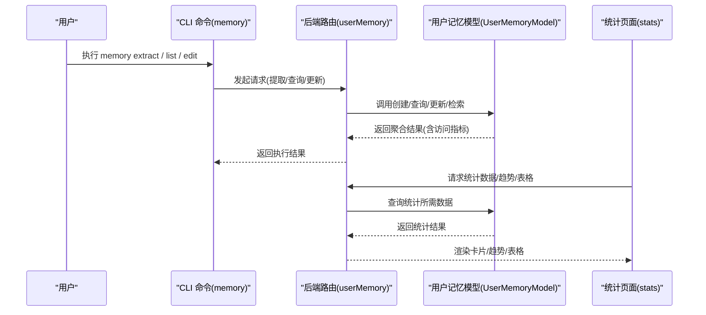
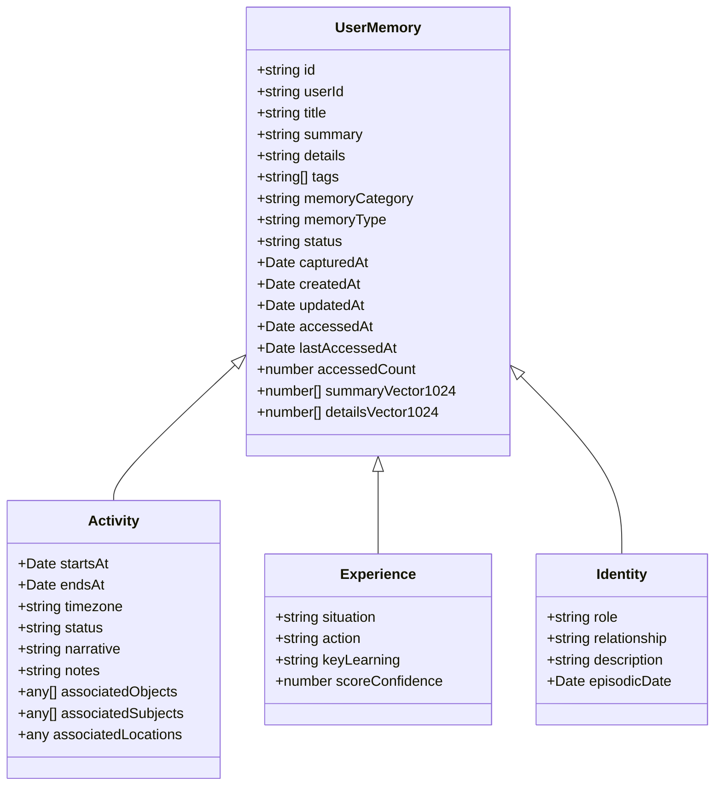
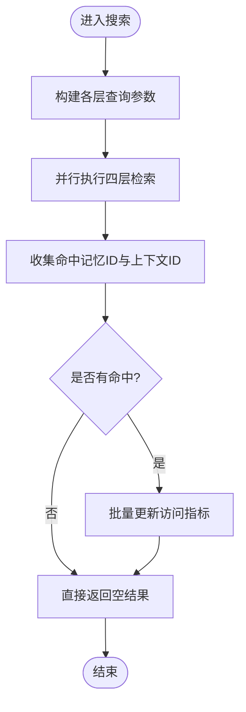
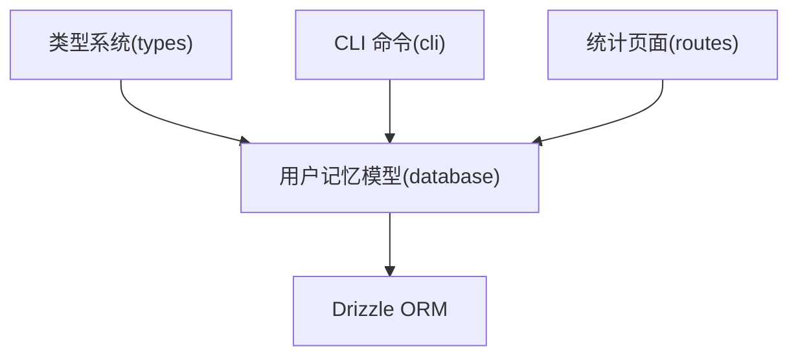

# 活动记忆 (Activity Memory)

<cite>
**本文引用的文件**
- [packages/database/src/models/userMemory/model.ts](file://packages/database/src/models/userMemory/model.ts)
- [apps/cli/src/commands/memory.ts](file://apps/cli/src/commands/memory.ts)
- [packages/types/src/userMemory/base.ts](file://packages/types/src/userMemory/base.ts)
- [packages/types/src/userMemory/activity.ts](file://packages/types/src/userMemory/activity.ts)
- [packages/types/src/userMemory/experience.ts](file://packages/types/src/userMemory/experience.ts)
- [packages/types/src/userMemory/identity.ts](file://packages/types/src/userMemory/identity.ts)
- [src/routes/(main)/settings/stats/index.tsx](file://src/routes/(main)/settings/stats/index.tsx)
- [docs/usage/user-interface/stats.mdx](file://docs/usage/user-interface/stats.mdx)
</cite>

## 目录

1. [简介](#简介)
2. [项目结构](#项目结构)
3. [核心组件](#核心组件)
4. [架构总览](#架构总览)
5. [详细组件分析](#详细组件分析)
6. [依赖关系分析](#依赖关系分析)
7. [性能考量](#性能考量)
8. [故障排查指南](#故障排查指南)
9. [结论](#结论)
10. [附录](#附录)

## 简介

本文件面向 “活动记忆” 模块，系统性梳理其数据模型、记录范围、统计分析方法、可视化呈现以及隐私保护策略。活动记忆用于记录用户的使用频率、活跃时段、功能偏好、交互模式等行为数据，支持趋势分析、模式识别与异常检测，并为产品优化、功能改进与用户体验提升提供数据支撑。

## 项目结构

活动记忆相关能力由以下层次构成：

- 类型与接口层：定义通用记忆项、分层（上下文 / 活动 / 体验 / 偏好 / 身份）及列表参数 / 结果的类型约束
- 数据访问层：封装用户记忆的增删改查、向量检索、标签与角色查询、访问指标更新等
- 命令行工具层：提供内存提取、查看、编辑、删除等 CLI 能力
- 可视化与统计层：在设置页提供统计数据卡片、趋势图与表格；文档中提供活动日历与分享能力

图表来源

- [packages/types/src/userMemory/base.ts](file://packages/types/src/userMemory/base.ts#L1-L32)
- [packages/types/src/userMemory/activity.ts](file://packages/types/src/userMemory/activity.ts#L1-L20)
- [packages/types/src/userMemory/experience.ts](file://packages/types/src/userMemory/experience.ts#L1-L26)
- [packages/types/src/userMemory/identity.ts](file://packages/types/src/userMemory/identity.ts#L1-L96)
- [packages/database/src/models/userMemory/model.ts](file://packages/database/src/models/userMemory/model.ts#L383-L770)
- [apps/cli/src/commands/memory.ts](file://apps/cli/src/commands/memory.ts#L17-L91)
- [src/routes/(main)/settings/stats/index.tsx](<file://src/routes/(main)/settings/stats/index.tsx#L99-L126>)
- [docs/usage/user-interface/stats.mdx](file://docs/usage/user-interface/stats.mdx#L35-L61)

章节来源

- [packages/types/src/userMemory/base.ts](file://packages/types/src/userMemory/base.ts#L1-L32)
- [packages/types/src/userMemory/activity.ts](file://packages/types/src/userMemory/activity.ts#L1-L20)
- [packages/types/src/userMemory/experience.ts](file://packages/types/src/userMemory/experience.ts#L1-L26)
- [packages/types/src/userMemory/identity.ts](file://packages/types/src/userMemory/identity.ts#L1-L96)
- [packages/database/src/models/userMemory/model.ts](file://packages/database/src/models/userMemory/model.ts#L383-L770)
- [apps/cli/src/commands/memory.ts](file://apps/cli/src/commands/memory.ts#L17-L91)
- [src/routes/(main)/settings/stats/index.tsx](<file://src/routes/(main)/settings/stats/index.tsx#L99-L126>)
- [docs/usage/user-interface/stats.mdx](file://docs/usage/user-interface/stats.mdx#L35-L61)

## 核心组件

- 用户记忆模型（UserMemoryModel）
  - 提供统一的记忆创建、查询、搜索与访问指标更新能力
  - 支持多层记忆（上下文 / 活动 / 体验 / 偏好 / 身份）的聚合检索与排序
  - 内置标签与角色查询、向量字段管理与访问计数 / 时间戳更新
- 类型系统（Types）
  - 定义通用记忆项字段（标题、摘要、详情、标签、分类、类型、状态、向量等）
  - 分层类型定义（活动、体验、身份）的列表参数、排序与结果结构
- CLI 命令（memory）
  - 支持列出 / 创建 / 编辑 / 删除各类记忆条目，以及从聊天主题提取记忆、查看提取任务状态
- 统计与可视化（Stats 页面与文档）
  - 设置页统计卡片、趋势图与表格
  - 文档中的活动日历与数据分享能力

章节来源

- [packages/database/src/models/userMemory/model.ts](file://packages/database/src/models/userMemory/model.ts#L383-L770)
- [packages/types/src/userMemory/base.ts](file://packages/types/src/userMemory/base.ts#L1-L32)
- [packages/types/src/userMemory/activity.ts](file://packages/types/src/userMemory/activity.ts#L1-L20)
- [packages/types/src/userMemory/experience.ts](file://packages/types/src/userMemory/experience.ts#L1-L26)
- [packages/types/src/userMemory/identity.ts](file://packages/types/src/userMemory/identity.ts#L1-L96)
- [apps/cli/src/commands/memory.ts](file://apps/cli/src/commands/memory.ts#L17-L91)
- [src/routes/(main)/settings/stats/index.tsx](<file://src/routes/(main)/settings/stats/index.tsx#L99-L126>)
- [docs/usage/user-interface/stats.mdx](file://docs/usage/user-interface/stats.mdx#L35-L61)

## 架构总览

活动记忆的端到端流程如下：

- 行为采集：通过聊天会话、操作事件等生成记忆条目（活动 / 体验 / 身份等）
- 记忆入库：调用 UserMemoryModel 创建并写入数据库，同时维护访问指标
- 检索与聚合：按层检索、向量相似度搜索、标签 / 类型过滤、排序
- 统计与可视化：基于检索结果生成统计数据卡片、趋势图与表格
- CLI 与文档：提供命令行管理与文档中的活动日历 / 分享能力

图表来源

- [apps/cli/src/commands/memory.ts](file://apps/cli/src/commands/memory.ts#L22-L91)
- [packages/database/src/models/userMemory/model.ts](file://packages/database/src/models/userMemory/model.ts#L554-L770)
- [src/routes/(main)/settings/stats/index.tsx](<file://src/routes/(main)/settings/stats/index.tsx#L99-L126>)

## 详细组件分析

### 数据模型与记录范围

- 通用记忆字段
  - 标识与归属：id、userId
  - 标题 / 摘要 / 详情：title、summary、details
  - 向量嵌入：summaryVector1024、detailsVector1024（用于语义检索）
  - 分类 / 类型 / 标签 / 状态：memoryCategory、memoryType、tags、status
  - 时间戳：capturedAt、createdAt、updatedAt、accessedAt、lastAccessedAt、accessedCount
  - 元数据：metadata
- 分层记忆
  - 活动（Activity）：开始 / 结束时间、时区、状态、叙述、备注、关联对象 / 主体 / 地点
  - 体验（Experience）：情境、行动、关键学习、置信度评分
  - 身份（Identity）：角色、关系、描述、纪实体日期
  - 上下文（Context）：标题 / 描述、当前状态、影响 / 紧急度评分、关联对象 / 主体
  - 偏好（Preference）：结论指令、建议、优先级评分

图表来源

- [packages/types/src/userMemory/base.ts](file://packages/types/src/userMemory/base.ts#L1-L32)
- [packages/types/src/userMemory/activity.ts](file://packages/types/src/userMemory/activity.ts#L10-L17)
- [packages/types/src/userMemory/experience.ts](file://packages/types/src/userMemory/experience.ts#L18-L23)
- [packages/types/src/userMemory/identity.ts](file://packages/types/src/userMemory/identity.ts#L23-L47)

章节来源

- [packages/types/src/userMemory/base.ts](file://packages/types/src/userMemory/base.ts#L1-L32)
- [packages/types/src/userMemory/activity.ts](file://packages/types/src/userMemory/activity.ts#L1-L20)
- [packages/types/src/userMemory/experience.ts](file://packages/types/src/userMemory/experience.ts#L1-L26)
- [packages/types/src/userMemory/identity.ts](file://packages/types/src/userMemory/identity.ts#L1-L96)

### 搜索与访问指标更新

- 聚合检索：支持按层并行检索（活动 / 上下文 / 体验 / 偏好），返回统一结构
- 向量检索：可传入 embedding 进行语义相似度搜索
- 访问指标：当检索命中相关记忆或上下文时，自动更新 accessedCount、accessedAt、lastAccessedAt，避免并发死锁

图表来源

- [packages/database/src/models/userMemory/model.ts](file://packages/database/src/models/userMemory/model.ts#L711-L770)
- [packages/database/src/models/userMemory/model.ts](file://packages/database/src/models/userMemory/model.ts#L2550-L2575)

章节来源

- [packages/database/src/models/userMemory/model.ts](file://packages/database/src/models/userMemory/model.ts#L711-L770)
- [packages/database/src/models/userMemory/model.ts](file://packages/database/src/models/userMemory/model.ts#L2550-L2575)

### 统计分析方法

- 使用趋势：基于 capturedAt 或 startsAt 排序，按时间窗口聚合使用次数
- 行为模式识别：结合 tags、memoryType、status、scoreImpact/scoreUrgency/scorePriority 等字段进行分组统计
- 异常检测：对访问频率、响应时长、错误率等指标建立阈值与规则，识别异常时段或异常用户行为

章节来源

- [packages/types/src/userMemory/activity.ts](file://packages/types/src/userMemory/activity.ts#L3-L8)
- [packages/types/src/userMemory/experience.ts](file://packages/types/src/userMemory/experience.ts#L8-L12)
- [packages/types/src/userMemory/identity.ts](file://packages/types/src/userMemory/identity.ts#L12-L17)

### 可视化展示方案

- 活动日历：以热力图形式展示过去一年每日使用强度
- 使用统计：按模型 / 代理 / 话题内容量等维度展示使用分布
- 统计卡片与趋势：在设置页提供卡片、趋势图与表格，支持按模型 / 供应商分组
- 数据分享：支持导出图片（JPG/PNG/SVG/WEBP）

图表来源

- [docs/usage/user-interface/stats.mdx](file://docs/usage/user-interface/stats.mdx#L35-L61)
- [src/routes/(main)/settings/stats/index.tsx](<file://src/routes/(main)/settings/stats/index.tsx#L99-L126>)

章节来源

- [docs/usage/user-interface/stats.mdx](file://docs/usage/user-interface/stats.mdx#L35-L61)
- [src/routes/(main)/settings/stats/index.tsx](<file://src/routes/(main)/settings/stats/index.tsx#L99-L126>)

### 匿名化、聚合与隐私保护

- 匿名化策略
  - 移除或脱敏个人身份信息（如真实姓名、完整地址），仅保留聚合标签与类型
  - 对向量嵌入与元数据进行最小化存储，避免存储可识别信息
- 数据聚合
  - 使用 tags、memoryType、memoryCategory 等字段进行分组聚合，输出统计卡片与趋势
  - 将明细数据降维为统计指标（如访问次数、平均时长、占比）
- 隐私保护
  - 严格限制访问范围（userId），默认仅用户可见
  - 提供导出选项时，确保不包含可识别的个人数据
  - 在 CLI 与 API 层对输入参数进行校验与清洗，防止注入与越权

章节来源

- [packages/database/src/models/userMemory/model.ts](file://packages/database/src/models/userMemory/model.ts#L525-L552)
- [packages/types/src/userMemory/base.ts](file://packages/types/src/userMemory/base.ts#L1-L32)

## 依赖关系分析

- 类型依赖：所有层的记忆项均实现通用 UserMemory 接口，保证统一字段与序列化
- 模块耦合：UserMemoryModel 作为核心数据访问层，被 CLI 与 UI 通过 API 调用
- 外部依赖：Drizzle ORM 用于数据库查询与事务控制；向量字段用于语义检索

图表来源

- [packages/types/src/userMemory/base.ts](file://packages/types/src/userMemory/base.ts#L1-L32)
- [packages/database/src/models/userMemory/model.ts](file://packages/database/src/models/userMemory/model.ts#L383-L505)
- [apps/cli/src/commands/memory.ts](file://apps/cli/src/commands/memory.ts#L17-L91)
- [src/routes/(main)/settings/stats/index.tsx](<file://src/routes/(main)/settings/stats/index.tsx#L99-L126>)

章节来源

- [packages/types/src/userMemory/base.ts](file://packages/types/src/userMemory/base.ts#L1-L32)
- [packages/database/src/models/userMemory/model.ts](file://packages/database/src/models/userMemory/model.ts#L383-L505)
- [apps/cli/src/commands/memory.ts](file://apps/cli/src/commands/memory.ts#L17-L91)
- [src/routes/(main)/settings/stats/index.tsx](<file://src/routes/(main)/settings/stats/index.tsx#L99-L126>)

## 性能考量

- 并行检索：聚合搜索采用 Promise.all 并行执行四层查询，降低延迟
- 有序更新：访问指标更新前对 ID 进行排序，避免并发事务死锁
- 分页与过滤：查询接口支持分页、标签 / 类型 / 状态过滤与排序，减少一次性传输数据量
- 向量检索：embedding 查询按需传入，避免不必要的向量计算

章节来源

- [packages/database/src/models/userMemory/model.ts](file://packages/database/src/models/userMemory/model.ts#L711-L770)
- [packages/database/src/models/userMemory/model.ts](file://packages/database/src/models/userMemory/model.ts#L2550-L2575)

## 故障排查指南

- 搜索无结果
  - 检查是否传入了正确的层与过滤条件（tags、types、status、q）
  - 确认 capturedAt/startsAt 排序字段是否符合预期
- 访问指标未更新
  - 确认检索是否命中相关记忆或上下文
  - 检查事务是否成功提交
- CLI 操作失败
  - 确认 category 是否在允许范围内（identity/activity/context/experience/preference）
  - 检查网络与认证状态，确认 tRPC 客户端可用

章节来源

- [packages/database/src/models/userMemory/model.ts](file://packages/database/src/models/userMemory/model.ts#L711-L770)
- [apps/cli/src/commands/memory.ts](file://apps/cli/src/commands/memory.ts#L22-L91)

## 结论

活动记忆模块通过统一的数据模型、完善的检索与统计能力、清晰的可视化呈现与严格的隐私保护策略，为产品优化与用户体验提升提供了坚实的数据基础。未来可在异常检测算法、跨层关联分析与更细粒度的行为画像方面持续演进。

## 附录

- 常用字段速览
  - 通用：id、userId、title、summary、details、tags、memoryCategory、memoryType、status、capturedAt、createdAt、updatedAt、accessedAt、lastAccessedAt、accessedCount、summaryVector1024、detailsVector1024、metadata
  - 活动：startsAt、endsAt、timezone、status、narrative、notes、associatedObjects、associatedSubjects、associatedLocations
  - 体验：situation、action、keyLearning、scoreConfidence
  - 身份：role、relationship、description、episodicDate
  - 上下文：title、description、currentStatus、scoreImpact、scoreUrgency、associatedObjects、associatedSubjects、userMemoryIds
  - 偏好：conclusionDirectives、suggestions、scorePriority

章节来源

- [packages/types/src/userMemory/base.ts](file://packages/types/src/userMemory/base.ts#L1-L32)
- [packages/types/src/userMemory/activity.ts](file://packages/types/src/userMemory/activity.ts#L10-L17)
- [packages/types/src/userMemory/experience.ts](file://packages/types/src/userMemory/experience.ts#L18-L23)
- [packages/types/src/userMemory/identity.ts](file://packages/types/src/userMemory/identity.ts#L23-L47)
