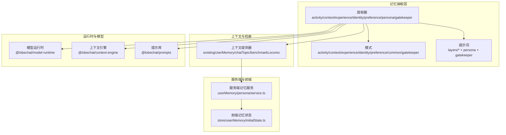
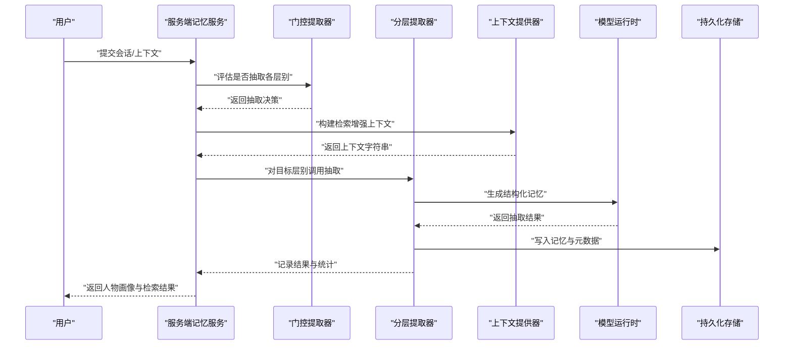
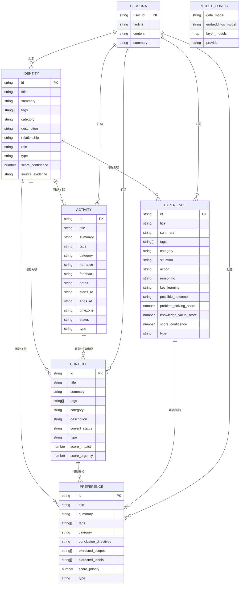
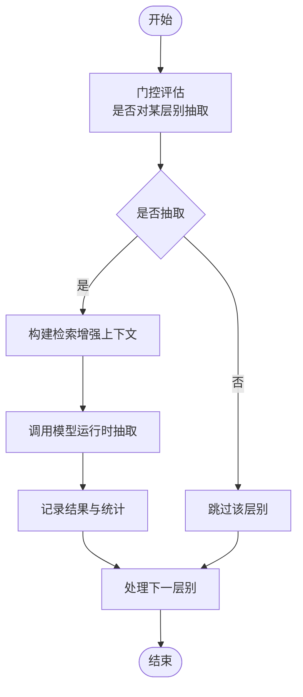
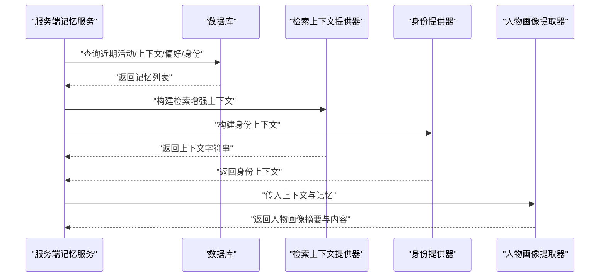
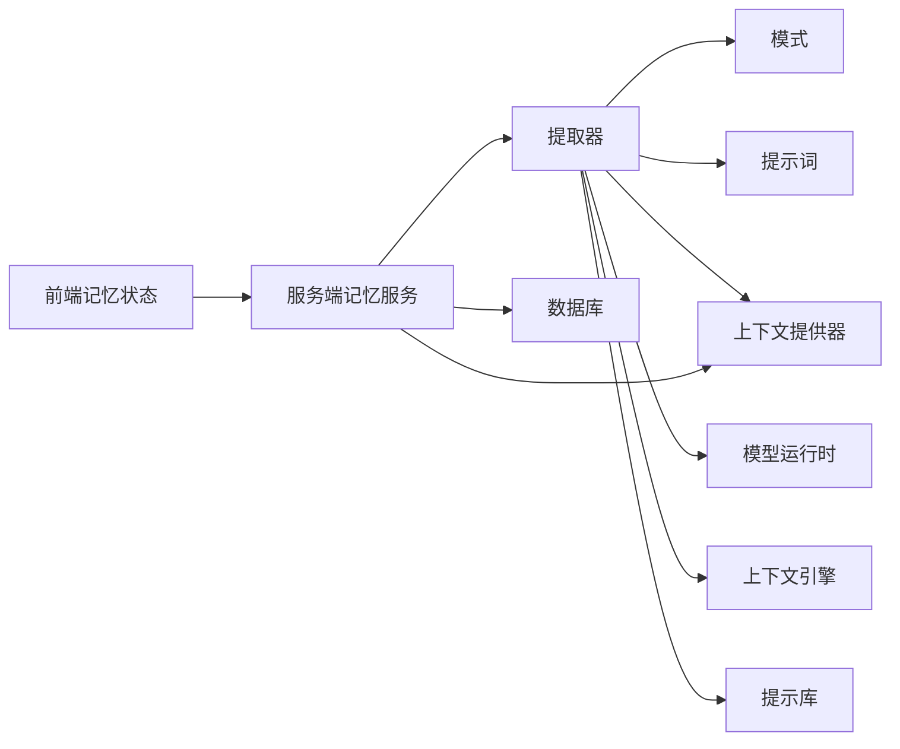

# 用户记忆系统

<cite>
**本文引用的文件**
- [packages/memory-user-memory/src/index.ts](file://packages/memory-user-memory/src/index.ts)
- [packages/memory-user-memory/src/types.ts](file://packages/memory-user-memory/src/types.ts)
- [packages/memory-user-memory/src/extractors/index.ts](file://packages/memory-user-memory/src/extractors/index.ts)
- [packages/memory-user-memory/src/extractors/activity.ts](file://packages/memory-user-memory/src/extractors/activity.ts)
- [packages/memory-user-memory/src/extractors/context.ts](file://packages/memory-user-memory/src/extractors/context.ts)
- [packages/memory-user-memory/src/extractors/experience.ts](file://packages/memory-user-memory/src/extractors/experience.ts)
- [packages/memory-user-memory/src/extractors/identity.ts](file://packages/memory-user-memory/src/extractors/identity.ts)
- [packages/memory-user-memory/src/extractors/preference.ts](file://packages/memory-user-memory/src/extractors/preference.ts)
- [packages/memory-user-memory/src/extractors/persona.ts](file://packages/memory-user-memory/src/extractors/persona.ts)
- [packages/memory-user-memory/src/extractors/gatekeeper.ts](file://packages/memory-user-memory/src/extractors/gatekeeper.ts)
- [packages/memory-user-memory/src/schemas/activity.ts](file://packages/memory-user-memory/src/schemas/activity.ts)
- [packages/memory-user-memory/src/schemas/context.ts](file://packages/memory-user-memory/src/schemas/context.ts)
- [packages/memory-user-memory/src/schemas/experience.ts](file://packages/memory-user-memory/src/schemas/experience.ts)
- [packages/memory-user-memory/src/schemas/identity.ts](file://packages/memory-user-memory/src/schemas/identity.ts)
- [packages/memory-user-memory/src/schemas/preference.ts](file://packages/memory-user-memory/src/schemas/preference.ts)
- [packages/memory-user-memory/src/schemas/common.ts](file://packages/memory-user-memory/src/schemas/common.ts)
- [packages/memory-user-memory/src/schemas/gatekeeper.ts](file://packages/memory-user-memory/src/schemas/gatekeeper.ts)
- [packages/memory-user-memory/src/providers/existingUserMemory.ts](file://packages/memory-user-memory/src/providers/existingUserMemory.ts)
- [packages/memory-user-memory/src/providers/chatTopic.ts](file://packages/memory-user-memory/src/providers/chatTopic.ts)
- [packages/memory-user-memory/src/providers/benchmarkLocomo.ts](file://packages/memory-user-memory/src/providers/benchmarkLocomo.ts)
- [packages/memory-user-memory/src/prompts/persona.ts](file://packages/memory-user-memory/src/prompts/persona.ts)
- [packages/memory-user-memory/src/prompts/gatekeeper.ts](file://packages/memory-user-memory/src/prompts/gatekeeper.ts)
- [packages/memory-user-memory/src/prompts/layers/index.ts](file://packages/memory-user-memory/src/prompts/layers/index.ts)
- [packages/memory-user-memory/src/prompts/layers/activity.ts](file://packages/memory-user-memory/src/prompts/layers/activity.ts)
- [packages/memory-user-memory/src/prompts/layers/context.ts](file://packages/memory-user-memory/src/prompts/layers/context.ts)
- [packages/memory-user-memory/src/prompts/layers/experience.ts](file://packages/memory-user-memory/src/prompts/layers/experience.ts)
- [packages/memory-user-memory/src/prompts/layers/identity.ts](file://packages/memory-user-memory/src/prompts/layers/identity.ts)
- [packages/memory-user-memory/src/prompts/layers/preference.ts](file://packages/memory-user-memory/src/prompts/layers/preference.ts)
- [src/server/services/memory/userMemory/persona/service.ts](file://src/server/services/memory/userMemory/persona/service.ts)
- [src/store/userMemory/initialState.ts](file://src/store/userMemory/initialState.ts)
- [packages/context-engine/src/index.ts](file://packages/context-engine/src/index.ts)
- [packages/model-runtime/src/index.ts](file://packages/model-runtime/src/index.ts)
- [packages/prompts/src/index.ts](file://packages/prompts/src/index.ts)
</cite>

## 目录

1. [引言](#引言)
2. [项目结构](#项目结构)
3. [核心组件](#核心组件)
4. [架构总览](#架构总览)
5. [详细组件分析](#详细组件分析)
6. [依赖分析](#依赖分析)
7. [性能考虑](#性能考虑)
8. [故障排查指南](#故障排查指南)
9. [结论](#结论)
10. [附录](#附录)

## 引言

本文件面向 LobeHub 的用户记忆系统，系统性梳理并说明 “身份（identity）”“人物画像（persona）”“经历（experience）”“上下文（context）”“偏好（preference）”“活动（activity）”“模型（model）” 等实体的设计与关系，解释用户记忆的层次结构、不同类型记忆的存储方式、记忆提取与应用机制，并阐述长期与短期记忆的边界、更新与遗忘策略，以及从记忆采集到智能应用的完整数据流程。同时，给出隐私保护、数据安全与访问控制的设计要点。

## 项目结构

用户记忆系统主要由以下模块构成：

- 提取器（Extractors）：按层别对会话内容进行结构化抽取，生成各类记忆条目。
- 模式（Schemas）：定义每类记忆的数据结构与约束，确保输出可持久化与可检索。
- 提示词（Prompts）：为不同层别与门控策略提供模板，驱动大模型生成结构化结果。
- 上下文提供器（Providers）：聚合已有记忆与话题信息，形成检索增强的上下文。
- 类型与接口（Types）：统一定义记忆抽取、门控决策、上下文构建、结果记录等类型。
- 服务端集成（Server Service）：在服务端组装检索上下文并触发记忆抽取。
- 前端状态（Store）：维护记忆的前端展示、编辑与检索参数。

图表来源

- [packages/memory-user-memory/src/extractors/index.ts](file://packages/memory-user-memory/src/extractors/index.ts#L1-L8)
- [packages/memory-user-memory/src/schemas/index.ts](file://packages/memory-user-memory/src/schemas/index.ts#L1-L8)
- [packages/memory-user-memory/src/prompts/layers/index.ts](file://packages/memory-user-memory/src/prompts/layers/index.ts)
- [packages/memory-user-memory/src/providers/existingUserMemory.ts](file://packages/memory-user-memory/src/providers/existingUserMemory.ts)
- [packages/model-runtime/src/index.ts](file://packages/model-runtime/src/index.ts)
- [packages/context-engine/src/index.ts](file://packages/context-engine/src/index.ts)
- [packages/prompts/src/index.ts](file://packages/prompts/src/index.ts)
- [src/server/services/memory/userMemory/persona/service.ts](file://src/server/services/memory/userMemory/persona/service.ts#L132-L166)
- [src/store/userMemory/initialState.ts](file://src/store/userMemory/initialState.ts#L16-L62)

章节来源

- [packages/memory-user-memory/src/index.ts](file://packages/memory-user-memory/src/index.ts#L1-L7)
- [packages/memory-user-memory/src/types.ts](file://packages/memory-user-memory/src/types.ts#L1-L198)
- [packages/memory-user-memory/src/extractors/index.ts](file://packages/memory-user-memory/src/extractors/index.ts#L1-L8)

## 核心组件

- 记忆层别（LayersEnum）：系统以 “身份、人物画像、经历、上下文、偏好、活动” 等层别组织记忆，分别对应不同的抽取器与模式。
- 抽取器（Extractor）：负责调用模型运行时，基于提示词与上下文生成结构化记忆；支持回调钩子、错误处理与结果记录。
- 模式（Schema）：为每类记忆定义字段、枚举与约束，保证数据一致性与可检索性。
- 上下文提供器（Context Provider）：将近期记忆、身份信息与话题等整合为检索增强的上下文字符串，供抽取器使用。
- 门控（Gatekeeper）：根据输入上下文与策略决定是否对某一层别进行抽取，避免冗余或敏感信息泄露。
- 人物画像（Persona）：综合多层记忆生成用户画像摘要与内容，用于对话与任务执行的个性化。
- 结果记录（Result Recorder）：记录抽取作业的完成状态、创建的记忆数量与分层统计，便于审计与重试。

章节来源

- [packages/memory-user-memory/src/types.ts](file://packages/memory-user-memory/src/types.ts#L16-L198)
- [packages/memory-user-memory/src/extractors/gatekeeper.ts](file://packages/memory-user-memory/src/extractors/gatekeeper.ts)
- [packages/memory-user-memory/src/prompts/gatekeeper.ts](file://packages/memory-user-memory/src/prompts/gatekeeper.ts)
- [packages/memory-user-memory/src/prompts/persona.ts](file://packages/memory-user-memory/src/prompts/persona.ts)

## 架构总览

用户记忆系统采用 “提示词驱动 + 分层抽取 + 检索增强 + 门控决策” 的流水线架构。整体流程如下：

- 输入会话与上下文 → 门控评估是否需要抽取 → 选择目标层别 → 构建上下文 → 调用模型运行时抽取 → 记录结果 → 更新人物画像与检索索引。

图表来源

- [src/server/services/memory/userMemory/persona/service.ts](file://src/server/services/memory/userMemory/persona/service.ts#L132-L166)
- [packages/memory-user-memory/src/extractors/gatekeeper.ts](file://packages/memory-user-memory/src/extractors/gatekeeper.ts)
- [packages/memory-user-memory/src/providers/existingUserMemory.ts](file://packages/memory-user-memory/src/providers/existingUserMemory.ts)
- [packages/memory-user-memory/src/prompts/layers/index.ts](file://packages/memory-user-memory/src/prompts/layers/index.ts)
- [packages/model-runtime/src/index.ts](file://packages/model-runtime/src/index.ts)

## 详细组件分析

### 数据模型与实体定义

用户记忆系统围绕以下实体展开，每类实体均通过模式定义其字段与约束：

- 身份（Identity）
  - 关键字段：标题、摘要、标签、类别、描述、关系、角色、类型、置信度、证据来源等。
  - 支持新增、更新、删除操作，更新时可指定合并策略。
  - 用于刻画用户在不同维度的身份特征与关系网络。

- 经历（Experience）
  - 关键字段：情境、行为、推理、问题解决评分、知识价值评分、标签、结论指令、适用范围等。
  - 用于沉淀可复用的经验与学习成果，指导后续决策。

- 上下文（Context）
  - 关键字段：关联对象 / 主体、当前状态、描述、标签、影响度、紧急度、类型等。
  - 用于描述当前所处的环境、事件与角色关系，辅助理解与决策。

- 偏好（Preference）
  - 关键字段：结论指令、优先级、建议、应用上下文、触发条件、适用场景等。
  - 用于表达用户在不同场景下的偏好与约束，提升交互一致性。

- 活动（Activity）
  - 关键字段：时间起止、地点、对象 / 主体、反馈、标签、类型、时区、状态等。
  - 用于记录事件的时间线、参与方与感受，支撑短期与长期记忆的衔接。

- 人物画像（Persona）
  - 由多层记忆汇总生成，包含摘要与内容，用于个性化对话与任务执行。

- 模型配置（Model）
  - 定义门控模型、各层别模型与嵌入模型，支持按层别切换与提供商配置。

图表来源

- [packages/memory-user-memory/src/schemas/identity.ts](file://packages/memory-user-memory/src/schemas/identity.ts#L1-L158)
- [packages/memory-user-memory/src/schemas/experience.ts](file://packages/memory-user-memory/src/schemas/experience.ts#L1-L60)
- [packages/memory-user-memory/src/schemas/context.ts](file://packages/memory-user-memory/src/schemas/context.ts#L1-L102)
- [packages/memory-user-memory/src/schemas/preference.ts](file://packages/memory-user-memory/src/schemas/preference.ts#L1-L91)
- [packages/memory-user-memory/src/schemas/activity.ts](file://packages/memory-user-memory/src/schemas/activity.ts#L1-L338)
- [packages/memory-user-memory/src/schemas/common.ts](file://packages/memory-user-memory/src/schemas/common.ts)

章节来源

- [packages/memory-user-memory/src/schemas/identity.ts](file://packages/memory-user-memory/src/schemas/identity.ts#L1-L158)
- [packages/memory-user-memory/src/schemas/experience.ts](file://packages/memory-user-memory/src/schemas/experience.ts#L1-L60)
- [packages/memory-user-memory/src/schemas/context.ts](file://packages/memory-user-memory/src/schemas/context.ts#L1-L102)
- [packages/memory-user-memory/src/schemas/preference.ts](file://packages/memory-user-memory/src/schemas/preference.ts#L1-L91)
- [packages/memory-user-memory/src/schemas/activity.ts](file://packages/memory-user-memory/src/schemas/activity.ts#L1-L338)

### 提取器与门控

- 提取器（Extractor）
  - 支持回调钩子：请求前、响应后、错误处理，便于可观测性与重试。
  - 可注入上下文提供器与现有身份上下文，实现检索增强抽取。
  - 输出按层别聚合，支持错误计数与统计上报。

- 门控（Gatekeeper）
  - 基于输入上下文与语言策略判断是否对某一层别抽取。
  - 返回每个层别的决策与理由，作为后续流程的依据。

图表来源

- [packages/memory-user-memory/src/extractors/gatekeeper.ts](file://packages/memory-user-memory/src/extractors/gatekeeper.ts)
- [packages/memory-user-memory/src/prompts/gatekeeper.ts](file://packages/memory-user-memory/src/prompts/gatekeeper.ts)
- [packages/memory-user-memory/src/types.ts](file://packages/memory-user-memory/src/types.ts#L150-L174)

章节来源

- [packages/memory-user-memory/src/types.ts](file://packages/memory-user-memory/src/types.ts#L25-L120)
- [packages/memory-user-memory/src/extractors/gatekeeper.ts](file://packages/memory-user-memory/src/extractors/gatekeeper.ts)
- [packages/memory-user-memory/src/prompts/gatekeeper.ts](file://packages/memory-user-memory/src/prompts/gatekeeper.ts)

### 人物画像（Persona）生成

- 服务端记忆服务会拉取近期活动、上下文、偏好与身份信息，构建检索增强上下文。
- 同步构建身份提供器，将身份层别注入上下文。
- 最终生成人物画像摘要与内容，供对话与任务执行使用。

图表来源

- [src/server/services/memory/userMemory/persona/service.ts](file://src/server/services/memory/userMemory/persona/service.ts#L132-L166)

章节来源

- [src/server/services/memory/userMemory/persona/service.ts](file://src/server/services/memory/userMemory/persona/service.ts#L132-L166)

### 上下文提供器与检索增强

- existingUserMemory：聚合已有记忆，形成检索增强上下文。
- chatTopic：基于聊天主题生成上下文，辅助抽取。
- benchmarkLocomo：基准数据转换与测试支持。

章节来源

- [packages/memory-user-memory/src/providers/existingUserMemory.ts](file://packages/memory-user-memory/src/providers/existingUserMemory.ts)
- [packages/memory-user-memory/src/providers/chatTopic.ts](file://packages/memory-user-memory/src/providers/chatTopic.ts)
- [packages/memory-user-memory/src/providers/benchmarkLocomo.ts](file://packages/memory-user-memory/src/providers/benchmarkLocomo.ts)

### 前端状态与交互

- 前端记忆状态包含各层别切片状态、活跃检索参数、编辑态记忆、记忆映射与时间戳等。
- 支持按层别编辑与查看最近记忆，便于调试与优化。

章节来源

- [src/store/userMemory/initialState.ts](file://src/store/userMemory/initialState.ts#L16-L62)

## 依赖分析

- 运行时依赖
  - 模型运行时：驱动结构化抽取与嵌入生成。
  - 上下文引擎：提供检索增强能力。
  - 提示库：封装各层别与门控提示词模板。
- 内部依赖
  - 提取器依赖模式与提示词，通过上下文提供器与门控决策协同工作。
  - 服务端记忆服务依赖数据库查询与上下文提供器，最终产出人物画像与检索结果。
  - 前端状态依赖后端返回的记忆映射与参数，支撑交互与可视化。

图表来源

- [packages/memory-user-memory/src/extractors/index.ts](file://packages/memory-user-memory/src/extractors/index.ts#L1-L8)
- [packages/memory-user-memory/src/schemas/index.ts](file://packages/memory-user-memory/src/schemas/index.ts#L1-L8)
- [packages/memory-user-memory/src/prompts/layers/index.ts](file://packages/memory-user-memory/src/prompts/layers/index.ts)
- [packages/model-runtime/src/index.ts](file://packages/model-runtime/src/index.ts)
- [packages/context-engine/src/index.ts](file://packages/context-engine/src/index.ts)
- [packages/prompts/src/index.ts](file://packages/prompts/src/index.ts)
- [src/server/services/memory/userMemory/persona/service.ts](file://src/server/services/memory/userMemory/persona/service.ts#L132-L166)
- [src/store/userMemory/initialState.ts](file://src/store/userMemory/initialState.ts#L16-L62)

章节来源

- [packages/memory-user-memory/src/index.ts](file://packages/memory-user-memory/src/index.ts#L1-L7)
- [packages/memory-user-memory/src/types.ts](file://packages/memory-user-memory/src/types.ts#L1-L198)

## 性能考虑

- 批量与并发：服务端在获取近期记忆与身份时采用并发查询，减少等待时间。
- 分层限制：对不同层别设置最大返回条数（如活动层取最近若干条），降低上下文膨胀。
- 缓存与去重：前端维护记忆映射与时间戳，避免重复渲染与重复请求。
- 模型成本控制：通过门控与分层限制，减少不必要的模型调用次数。
- 嵌入与检索：在上下文提供器中合理裁剪与排序，提升检索效率。

章节来源

- [src/server/services/memory/userMemory/persona/service.ts](file://src/server/services/memory/userMemory/persona/service.ts#L134-L145)
- [src/store/userMemory/initialState.ts](file://src/store/userMemory/initialState.ts#L34-L41)

## 故障排查指南

- 抽取失败
  - 检查回调钩子中的错误处理逻辑，确认是否捕获并记录异常。
  - 核对模型运行时配置与提供商可用性。
- 门控误判
  - 调整门控提示词与语言策略，确保对敏感信息的识别准确。
  - 查看决策理由与统计，定位具体层别与原因。
- 上下文缺失
  - 确认上下文提供器是否正确聚合了近期记忆与身份信息。
  - 检查检索增强上下文的长度与质量。
- 前端状态异常
  - 核对记忆映射与时间戳，确认是否因缓存导致旧数据未刷新。
  - 检查活跃检索参数与编辑态记忆是否冲突。

章节来源

- [packages/memory-user-memory/src/types.ts](file://packages/memory-user-memory/src/types.ts#L34-L44)
- [packages/memory-user-memory/src/extractors/gatekeeper.ts](file://packages/memory-user-memory/src/extractors/gatekeeper.ts)
- [packages/memory-user-memory/src/providers/existingUserMemory.ts](file://packages/memory-user-memory/src/providers/existingUserMemory.ts)
- [src/store/userMemory/initialState.ts](file://src/store/userMemory/initialState.ts#L31-L36)

## 结论

用户记忆系统通过 “提示词驱动 + 分层抽取 + 检索增强 + 门控决策” 的架构，实现了对身份、人物画像、经历、上下文、偏好与活动的结构化管理。系统在数据一致性、可扩展性与性能之间取得平衡，并通过门控与分层限制保障隐私与成本可控。结合前端状态与服务端集成，形成从记忆采集到智能应用的闭环。

## 附录

### 长期记忆与短期记忆

- 短期记忆：近期活动、上下文与偏好，用于即时对话与任务执行。
- 长期记忆：身份、经历与人物画像，用于跨会话的个性化与稳定性。
- 更新策略：通过门控与合并策略更新身份与偏好；活动与经历按时间与重要度归档。
- 遗忘策略：按时间衰减与容量限制，定期清理低价值条目，保持检索效率。

### 隐私保护、数据安全与访问控制

- 数据最小化：仅抽取必要信息，避免敏感字段泄漏。
- 门控策略：对高敏感层别（如身份）实施更严格的门控与审核。
- 访问控制：服务端在生成人物画像与检索上下文时，严格限定用户可见范围。
- 审计与追踪：通过结果记录与回调钩子，保留抽取日志与错误信息，便于审计与回溯。
