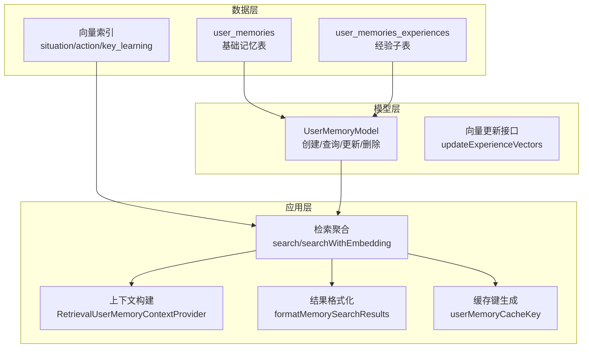
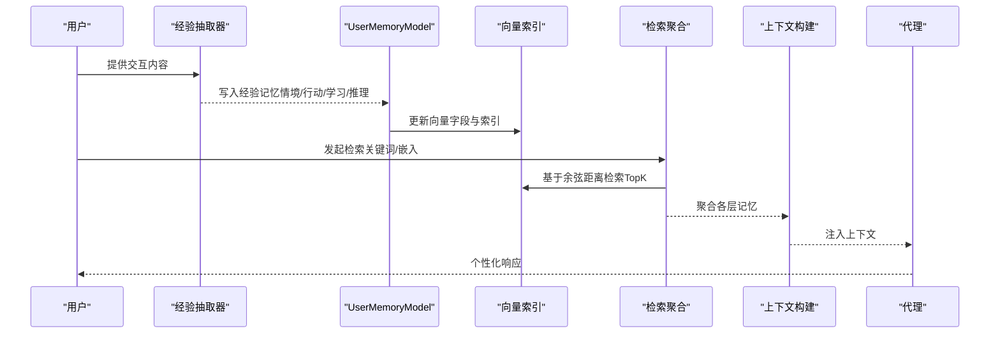
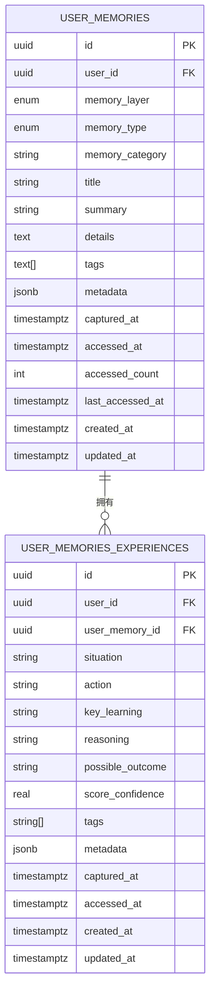
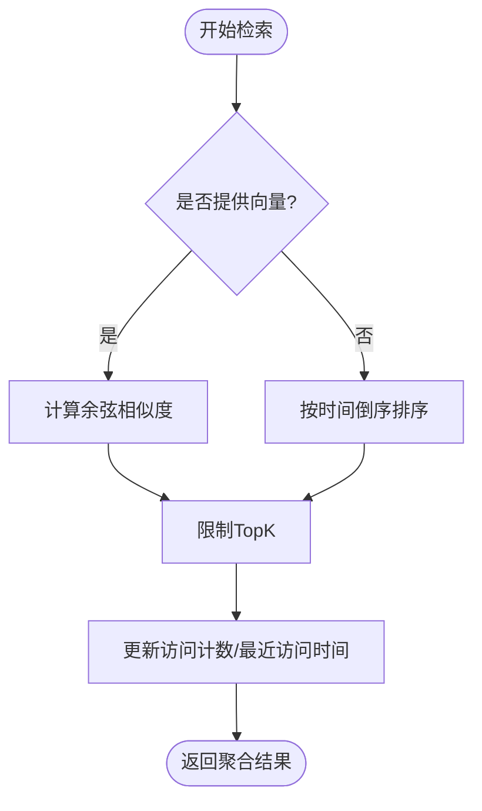
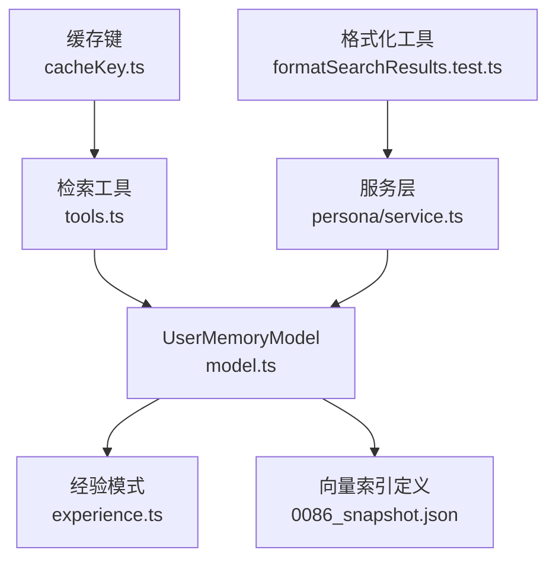

# 经验记忆（Experience Memory）

<cite>
**本文引用的文件**
- [packages/database/src/models/userMemory/model.ts](file://packages/database/src/models/userMemory/model.ts)
- [packages/database/migrations/meta/0086_snapshot.json](file://packages/database/migrations/meta/0086_snapshot.json)
- [packages/database/migrations/meta/0049_snapshot.json](file://packages/database/migrations/meta/0049_snapshot.json)
- [packages/database/migrations/meta/0037_snapshot.json](file://packages/database/migrations/meta/0037_snapshot.json)
- [packages/memory-user-memory/src/schemas/experience.ts](file://packages/memory-user-memory/src/schemas/experience.ts)
- [packages/memory-user-memory/src/index.ts](file://packages/memory-user-memory/src/index.ts)
- [packages/types/src/userMemory/tools.ts](file://packages/types/src/userMemory/tools.ts)
- [src/server/services/memory/userMemory/persona/service.ts](file://src/server/services/memory/userMemory/persona/service.ts)
- [packages/prompts/src/prompts/userMemory/formatSearchResults.test.ts](file://packages/prompts/src/prompts/userMemory/formatSearchResults.test.ts)
- [src/store/userMemory/utils/cacheKey.ts](file://src/store/userMemory/utils/cacheKey.ts)
- [docs/usage/getting-started/memory.mdx](file://docs/usage/getting-started/memory.mdx)
</cite>

## 目录
1. [简介](#简介)
2. [项目结构](#项目结构)
3. [核心组件](#核心组件)
4. [架构总览](#架构总览)
5. [详细组件分析](#详细组件分析)
6. [依赖关系分析](#依赖关系分析)
7. [性能考量](#性能考量)
8. [故障排查指南](#故障排查指南)
9. [结论](#结论)
10. [附录](#附录)

## 简介
本文件面向“经验记忆”模块，系统化梳理其数据模型、时间维度建模、分类体系、检索与相似度计算、以及在智能推荐、个性化教学与技能评估中的应用路径。经验记忆用于记录用户在交互中产生的可迁移经验，包含情境、行动、学习要点、推理过程、可能结果与置信度等要素，并通过向量索引支持语义检索与相似度匹配。

## 项目结构
经验记忆模块由三层组成：
- 数据层：数据库表结构与向量索引定义，确保高效检索与持久化
- 模型层：用户记忆模型封装，提供创建、查询、更新、删除与向量更新能力
- 应用层：服务与工具，负责检索聚合、上下文构建、格式化输出与缓存键生成

图示来源
- [packages/database/src/models/userMemory/model.ts](file://packages/database/src/models/userMemory/model.ts#L554-L770)
- [packages/database/migrations/meta/0086_snapshot.json](file://packages/database/migrations/meta/0086_snapshot.json#L11252-L11295)

章节来源
- [packages/database/src/models/userMemory/model.ts](file://packages/database/src/models/userMemory/model.ts#L554-L770)
- [packages/database/migrations/meta/0086_snapshot.json](file://packages/database/migrations/meta/0086_snapshot.json#L11252-L11295)

## 核心组件
- 用户记忆模型（UserMemoryModel）：统一管理记忆生命周期，支持多层记忆（上下文、经验、身份、偏好、活动），提供创建、查询、更新、删除与向量更新接口；内置访问计数与最近访问时间维护逻辑。
- 经验记忆模式（WithExperienceSchema）：定义经验记忆的核心字段，包括情境、行动、关键学习、推理、可能结果、置信度与标签等，支撑经验抽取与结构化存储。
- 向量索引与检索：经验子表包含情境、行动、关键学习的向量字段与对应的向量索引，支持余弦距离相似度检索。
- 检索聚合与上下文构建：检索接口聚合各层记忆，按层返回 TopK 结果；服务侧将检索到的记忆转化为上下文，供代理使用。
- 缓存与格式化：检索结果通过缓存键进行缓存，格式化工具将检索结果转换为提示词可用的结构化内容。

章节来源
- [packages/database/src/models/userMemory/model.ts](file://packages/database/src/models/userMemory/model.ts#L554-L770)
- [packages/memory-user-memory/src/schemas/experience.ts](file://packages/memory-user-memory/src/schemas/experience.ts#L8-L31)
- [packages/database/migrations/meta/0086_snapshot.json](file://packages/database/migrations/meta/0086_snapshot.json#L11252-L11295)
- [src/server/services/memory/userMemory/persona/service.ts](file://src/server/services/memory/userMemory/persona/service.ts#L132-L166)
- [packages/prompts/src/prompts/userMemory/formatSearchResults.test.ts](file://packages/prompts/src/prompts/userMemory/formatSearchResults.test.ts#L116-L145)
- [src/store/userMemory/utils/cacheKey.ts](file://src/store/userMemory/utils/cacheKey.ts#L1-L10)

## 架构总览
经验记忆从“抽取—存储—检索—应用”的闭环出发，形成如下流程：

图示来源
- [packages/database/src/models/userMemory/model.ts](file://packages/database/src/models/userMemory/model.ts#L598-L635)
- [packages/database/migrations/meta/0086_snapshot.json](file://packages/database/migrations/meta/0086_snapshot.json#L11252-L11295)
- [src/server/services/memory/userMemory/persona/service.ts](file://src/server/services/memory/userMemory/persona/service.ts#L132-L166)

## 详细组件分析

### 数据模型与时间维度建模
- 基础表（user_memories）：存储标题、摘要、详情、类别、类型、标签、元数据、捕获/访问/更新时间等通用字段；提供访问计数与最近访问时间，用于统计与排序。
- 经验子表（user_memories_experiences）：扩展经验特有字段，包括情境、行动、关键学习、推理、可能结果、置信度与标签；同时保留向量字段与索引，支持语义检索。
- 时间维度：
  - 捕获时间（capturedAt）：经验被提取或创建的时间点
  - 访问时间（accessedAt/lastAccessedAt）：单条经验与基础记忆的访问时间
  - 更新时间（updatedAt）：记录变更时间
  - 访问计数（accessedCount）：经验被检索次数，可用于经验权重计算

图示来源
- [packages/database/migrations/meta/0086_snapshot.json](file://packages/database/migrations/meta/0086_snapshot.json#L11252-L11295)
- [packages/database/migrations/meta/0049_snapshot.json](file://packages/database/migrations/meta/0049_snapshot.json#L7772-L7815)
- [packages/database/migrations/meta/0037_snapshot.json](file://packages/database/migrations/meta/0037_snapshot.json#L7162-L7211)

章节来源
- [packages/database/migrations/meta/0086_snapshot.json](file://packages/database/migrations/meta/0086_snapshot.json#L11252-L11295)
- [packages/database/migrations/meta/0049_snapshot.json](file://packages/database/migrations/meta/0049_snapshot.json#L7772-L7815)
- [packages/database/migrations/meta/0037_snapshot.json](file://packages/database/migrations/meta/0037_snapshot.json#L7162-L7211)

### 经验记忆的分类体系
经验记忆在系统中以“层”（Layer）与“类型”（Type）进行组织：
- 层（memoryLayer）：区分经验、上下文、身份、偏好、活动等不同抽象层级
- 类型（memoryType）：对同一层内的细粒度分类，例如经验类型、上下文类型、偏好类型等
- 标签（tags）：用于跨层检索与过滤
- 元数据（metadata）：可承载来源话题、时间戳等上下文信息

章节来源
- [packages/database/src/models/userMemory/model.ts](file://packages/database/src/models/userMemory/model.ts#L109-L177)
- [packages/database/src/models/userMemory/model.ts](file://packages/database/src/models/userMemory/model.ts#L1128-L1205)

### 经验记忆的时间维度建模
- 访问统计：每次检索后会更新经验与基础记忆的访问计数与最近访问时间，便于后续权重计算与排序
- 捕获时间：经验被提取或创建的时间点，作为默认排序依据之一
- 更新时间：记录最后一次修改时间，用于一致性判断

章节来源
- [packages/database/src/models/userMemory/model.ts](file://packages/database/src/models/userMemory/model.ts#L757-L762)
- [packages/database/src/models/userMemory/model.ts](file://packages/database/src/models/userMemory/model.ts#L1855-L1865)

### 经验记忆的检索与相似度计算
- 多层检索：支持同时检索经验、上下文、偏好、活动四类记忆，并可分别设置 TopK
- 嵌入检索：当提供向量时，基于余弦距离计算相似度，优先返回最相似的结果；否则按时间倒序返回
- 聚合与去重：检索完成后，会更新访问指标并去重关联的记忆 ID，避免重复统计

图示来源
- [packages/database/src/models/userMemory/model.ts](file://packages/database/src/models/userMemory/model.ts#L711-L770)
- [packages/database/src/models/userMemory/model.ts](file://packages/database/src/models/userMemory/model.ts#L2307-L2360)
- [packages/types/src/userMemory/tools.ts](file://packages/types/src/userMemory/tools.ts#L10-L30)

章节来源
- [packages/database/src/models/userMemory/model.ts](file://packages/database/src/models/userMemory/model.ts#L711-L770)
- [packages/database/src/models/userMemory/model.ts](file://packages/database/src/models/userMemory/model.ts#L2307-L2360)
- [packages/types/src/userMemory/tools.ts](file://packages/types/src/userMemory/tools.ts#L10-L30)

### 经验权重与置信度
- 置信度（scoreConfidence）：经验记忆包含置信度评分，范围 0–1，用于衡量经验细节的可信度
- 权重计算建议：可结合访问计数、最近访问时间、置信度与时间衰减因子综合计算最终权重，用于排序与推荐
- 标签与类型：通过标签与类型过滤，提升检索的相关性与准确性

章节来源
- [packages/memory-user-memory/src/schemas/experience.ts](file://packages/memory-user-memory/src/schemas/experience.ts#L24-L28)
- [packages/database/src/models/userMemory/model.ts](file://packages/database/src/models/userMemory/model.ts#L1128-L1205)

### 知识迁移机制
- 上下文构建：服务侧将检索到的经验与其他记忆组合，构建面向代理的上下文
- 格式化输出：将检索结果格式化为提示词可读的结构化文本，便于注入到代理对话中
- 缓存策略：通过缓存键对检索请求进行缓存，减少重复检索开销

章节来源
- [src/server/services/memory/userMemory/persona/service.ts](file://src/server/services/memory/userMemory/persona/service.ts#L132-L166)
- [packages/prompts/src/prompts/userMemory/formatSearchResults.test.ts](file://packages/prompts/src/prompts/userMemory/formatSearchResults.test.ts#L116-L145)
- [src/store/userMemory/utils/cacheKey.ts](file://src/store/userMemory/utils/cacheKey.ts#L1-L10)

## 依赖关系分析
经验记忆模块的关键依赖关系如下：

图示来源
- [packages/database/src/models/userMemory/model.ts](file://packages/database/src/models/userMemory/model.ts#L554-L770)
- [packages/memory-user-memory/src/schemas/experience.ts](file://packages/memory-user-memory/src/schemas/experience.ts#L8-L31)
- [packages/database/migrations/meta/0086_snapshot.json](file://packages/database/migrations/meta/0086_snapshot.json#L11252-L11295)
- [packages/types/src/userMemory/tools.ts](file://packages/types/src/userMemory/tools.ts#L10-L30)
- [src/server/services/memory/userMemory/persona/service.ts](file://src/server/services/memory/userMemory/persona/service.ts#L132-L166)
- [packages/prompts/src/prompts/userMemory/formatSearchResults.test.ts](file://packages/prompts/src/prompts/userMemory/formatSearchResults.test.ts#L116-L145)
- [src/store/userMemory/utils/cacheKey.ts](file://src/store/userMemory/utils/cacheKey.ts#L1-L10)

章节来源
- [packages/database/src/models/userMemory/model.ts](file://packages/database/src/models/userMemory/model.ts#L554-L770)
- [packages/types/src/userMemory/tools.ts](file://packages/types/src/userMemory/tools.ts#L10-L30)

## 性能考量
- 向量索引：使用 HNSW + 余弦距离索引，支持大规模高维向量的快速近似最近邻检索
- 分页与TopK：分层限制 TopK，避免一次性返回过多结果导致的性能与带宽压力
- 访问指标：通过访问计数与最近访问时间，辅助排序与权重计算，减少无效检索
- 缓存：对检索请求进行缓存，降低重复查询成本

章节来源
- [packages/database/migrations/meta/0086_snapshot.json](file://packages/database/migrations/meta/0086_snapshot.json#L11252-L11295)
- [packages/types/src/userMemory/tools.ts](file://packages/types/src/userMemory/tools.ts#L18-L29)
- [src/store/userMemory/utils/cacheKey.ts](file://src/store/userMemory/utils/cacheKey.ts#L1-L10)

## 故障排查指南
- 记忆未被检索到
  - 检查记忆是否属于当前层（经验/上下文/偏好/活动）
  - 检查置信度与时间是否过低或过旧
  - 确认检索参数（关键词、类型、标签、TopK）是否合理
- 记忆内容不正确
  - 直接编辑记忆项或删除后重建
  - 在对话中纠正记忆细节
- 检索性能问题
  - 减少 TopK 或增加过滤条件
  - 使用缓存键避免重复请求
  - 确保向量索引正常启用

章节来源
- [docs/usage/getting-started/memory.mdx](file://docs/usage/getting-started/memory.mdx#L308-L328)

## 结论
经验记忆模块通过结构化的数据模型、向量索引与检索聚合，实现了对用户交互经验的抽取、存储、检索与应用。结合置信度、访问统计与时间衰减，可为智能推荐、个性化教学与技能评估提供高质量的知识基座。建议在实际部署中配合缓存与过滤策略，持续优化检索性能与用户体验。

## 附录
- 经验记忆字段说明（节选）
  - 情境（situation）：经验发生的具体背景或事件
  - 行动（action）：在情境中采取的行为或表现
  - 关键学习（keyLearning）：从经验中总结出的要点或教训
  - 推理（reasoning）：当时的想法或动机
  - 可能结果（possibleOutcome）：经验可能带来的影响或启示
  - 置信度（scoreConfidence）：经验细节的可信度评分（0–1）
  - 标签（tags）：用于分类与检索的关键词

章节来源
- [packages/memory-user-memory/src/schemas/experience.ts](file://packages/memory-user-memory/src/schemas/experience.ts#L8-L31)