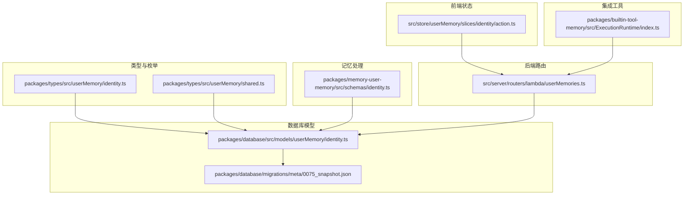
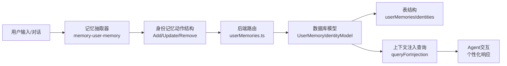
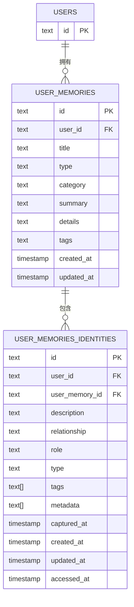
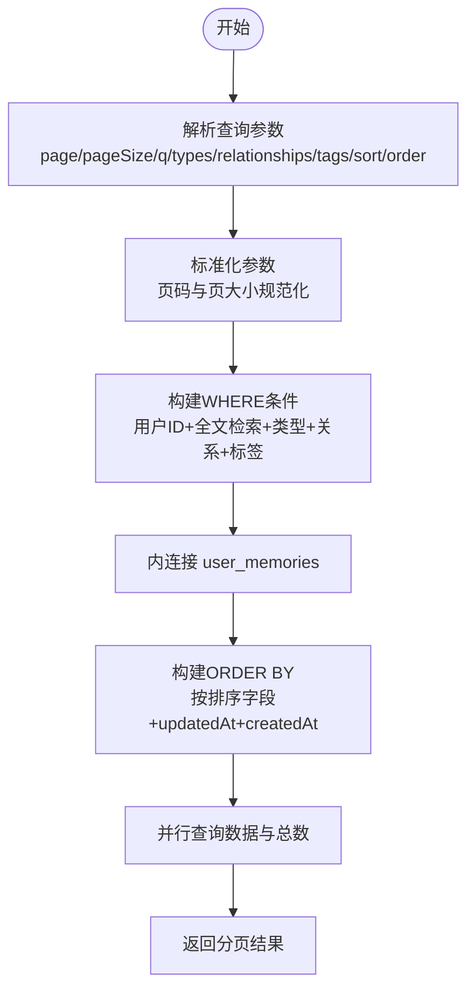
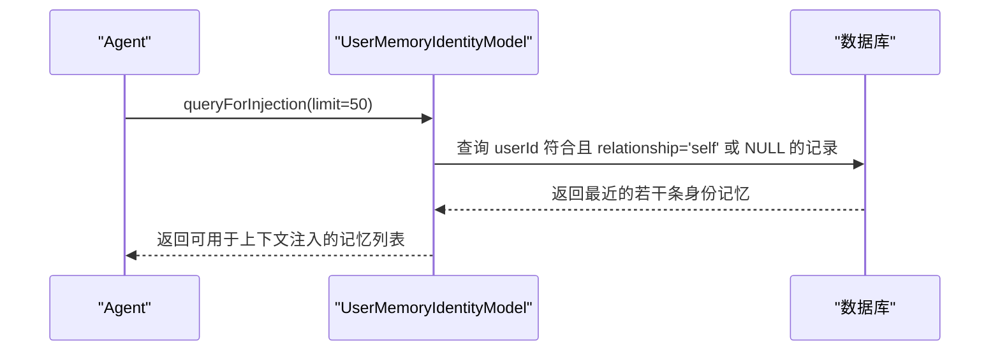
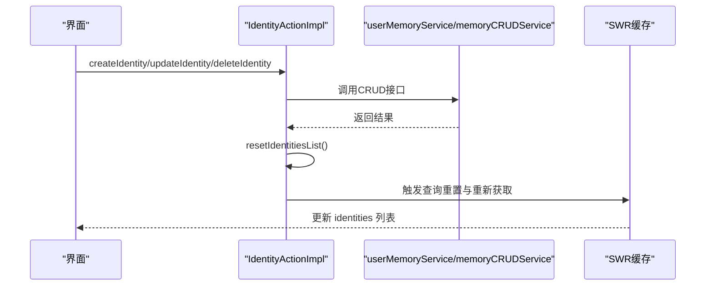
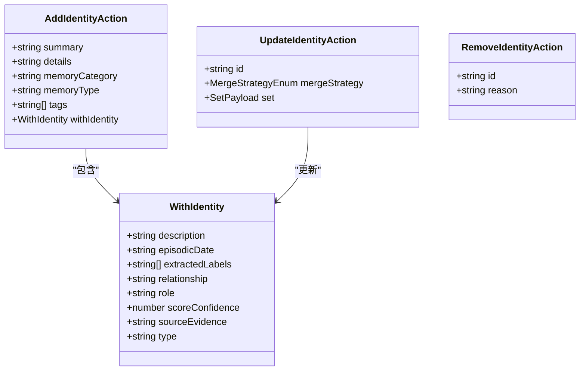
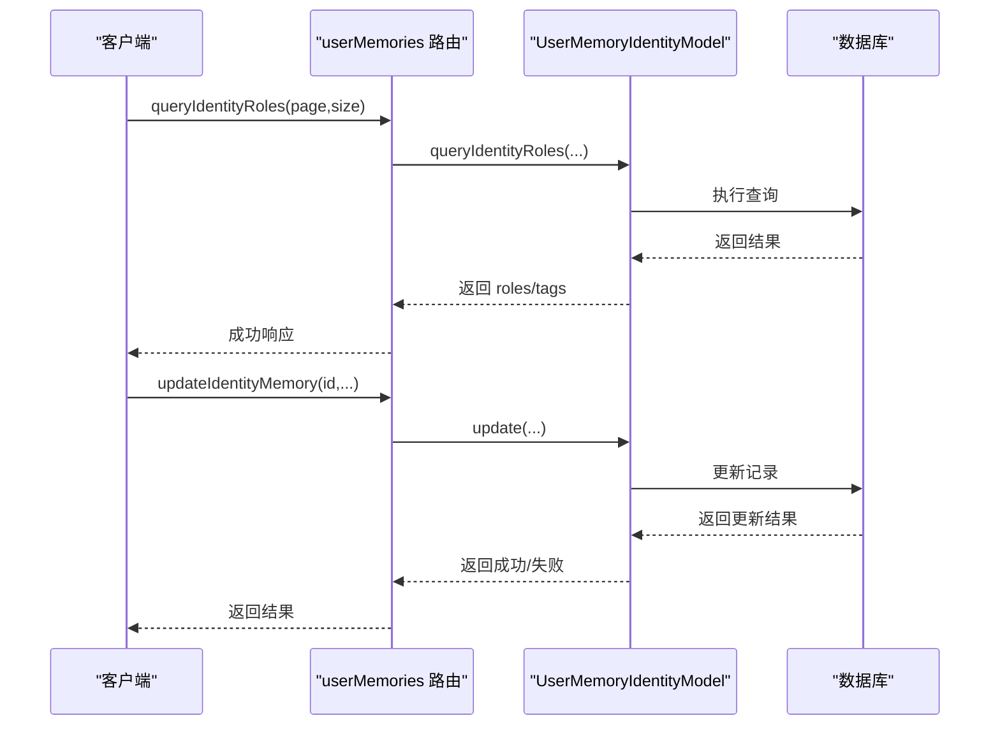
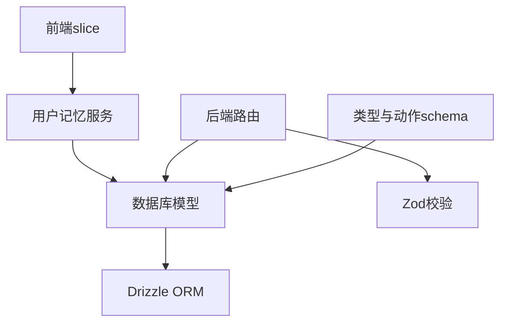
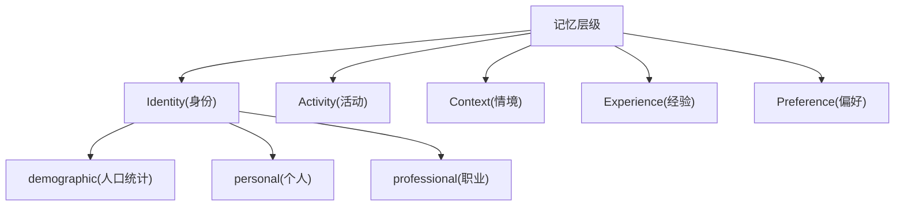

# 身份记忆 (Identity Memory)

<cite>
**本文档引用的文件**
- [packages/types/src/userMemory/identity.ts](file://packages/types/src/userMemory/identity.ts)
- [packages/types/src/userMemory/shared.ts](file://packages/types/src/userMemory/shared.ts)
- [packages/database/src/models/userMemory/identity.ts](file://packages/database/src/models/userMemory/identity.ts)
- [src/store/userMemory/slices/identity/action.ts](file://src/store/userMemory/slices/identity/action.ts)
- [packages/memory-user-memory/src/schemas/identity.ts](file://packages/memory-user-memory/src/schemas/identity.ts)
- [packages/database/migrations/meta/0075_snapshot.json](file://packages/database/migrations/meta/0075_snapshot.json)
- [packages/database/src/models/userMemory/__tests__/identity.test.ts](file://packages/database/src/models/userMemory/__tests__/identity.test.ts)
- [packages/database/src/models/userMemory/__tests__/model.test.ts](file://packages/database/src/models/userMemory/__tests__/model.test.ts)
- [src/server/routers/lambda/userMemories.ts](file://src/server/routers/lambda/userMemories.ts)
- [packages/builtin-tool-memory/src/ExecutionRuntime/index.ts](file://packages/builtin-tool-memory/src/ExecutionRuntime/index.ts)
</cite>

## 目录

1. [简介](#简介)
2. [项目结构](#项目结构)
3. [核心组件](#核心组件)
4. [架构总览](#架构总览)
5. [详细组件分析](#详细组件分析)
6. [依赖关系分析](#依赖关系分析)
7. [性能考量](#性能考量)
8. [故障排查指南](#故障排查指南)
9. [结论](#结论)
10. [附录](#附录)

## 简介

本文件聚焦于 “用户身份记忆” 模块的数据模型与实现机制，系统性阐述身份记忆的核心概念、存储结构、字段定义、约束条件与查询策略，并说明其在个性化体验与 Agent 交互中的作用。同时给出与其他记忆类型的关联关系图，展示完整的记忆体系架构，并提供更新策略、隐私保护与访问控制设计建议。

## 项目结构

身份记忆相关代码分布在以下层次：

- 类型与枚举：统一定义身份记忆的类型、关系、排序与列表参数等基础类型
- 数据库模型：封装对 userMemoriesIdentities 表的增删改查与上下文注入查询
- 前端状态：基于 zustand 的 slice 实现身份记忆的 CRUD、分页与查询缓存
- 记忆提取与处理：定义记忆层中身份记忆的添加 / 更新 / 删除动作结构
- 后端路由：提供身份记忆的查询与更新接口
- 集成工具：内置工具链对身份记忆进行执行与反馈

**图表来源**

- [packages/types/src/userMemory/identity.ts](file://packages/types/src/userMemory/identity.ts#L1-L96)
- [packages/types/src/userMemory/shared.ts](file://packages/types/src/userMemory/shared.ts#L1-L130)
- [packages/database/src/models/userMemory/identity.ts](file://packages/database/src/models/userMemory/identity.ts#L1-L202)
- [packages/database/migrations/meta/0075_snapshot.json](file://packages/database/migrations/meta/0075_snapshot.json#L11350-L11396)
- [src/store/userMemory/slices/identity/action.ts](file://src/store/userMemory/slices/identity/action.ts#L1-L166)
- [packages/memory-user-memory/src/schemas/identity.ts](file://packages/memory-user-memory/src/schemas/identity.ts#L1-L158)
- [src/server/routers/lambda/userMemories.ts](file://src/server/routers/lambda/userMemories.ts#L392-L408)
- [packages/builtin-tool-memory/src/ExecutionRuntime/index.ts](file://packages/builtin-tool-memory/src/ExecutionRuntime/index.ts#L212-L259)

**章节来源**

- [packages/types/src/userMemory/identity.ts](file://packages/types/src/userMemory/identity.ts#L1-L96)
- [packages/types/src/userMemory/shared.ts](file://packages/types/src/userMemory/shared.ts#L1-L130)
- [packages/database/src/models/userMemory/identity.ts](file://packages/database/src/models/userMemory/identity.ts#L1-L202)
- [src/store/userMemory/slices/identity/action.ts](file://src/store/userMemory/slices/identity/action.ts#L1-L166)
- [packages/memory-user-memory/src/schemas/identity.ts](file://packages/memory-user-memory/src/schemas/identity.ts#L1-L158)
- [packages/database/migrations/meta/0075_snapshot.json](file://packages/database/migrations/meta/0075_snapshot.json#L11350-L11396)
- [src/server/routers/lambda/userMemories.ts](file://src/server/routers/lambda/userMemories.ts#L392-L408)
- [packages/builtin-tool-memory/src/ExecutionRuntime/index.ts](file://packages/builtin-tool-memory/src/ExecutionRuntime/index.ts#L212-L259)

## 核心组件

- 类型与枚举
  - 定义身份记忆类型（personal/professional/demographic）、关系枚举（self/family/ 朋友 / 同事等）、排序字段与列表参数
- 数据库模型
  - 提供创建、删除、查询、分页查询、上下文注入查询等能力；默认仅返回 “自我” 关系或未设置关系的身份记忆
- 前端状态
  - 封装身份记忆的 CRUD 操作、分页加载、查询重置与 SWR 缓存
- 记忆处理
  - 定义添加 / 更新 / 删除身份记忆的动作结构，支持合并策略与标签体系
- 后端路由
  - 对外暴露身份记忆查询与更新接口，包含角色查询辅助接口
- 集成工具
  - 内置工具可执行身份记忆的更新与删除操作并返回结果

**章节来源**

- [packages/types/src/userMemory/identity.ts](file://packages/types/src/userMemory/identity.ts#L5-L96)
- [packages/types/src/userMemory/shared.ts](file://packages/types/src/userMemory/shared.ts#L1-L130)
- [packages/database/src/models/userMemory/identity.ts](file://packages/database/src/models/userMemory/identity.ts#L10-L202)
- [src/store/userMemory/slices/identity/action.ts](file://src/store/userMemory/slices/identity/action.ts#L20-L166)
- [packages/memory-user-memory/src/schemas/identity.ts](file://packages/memory-user-memory/src/schemas/identity.ts#L1-L158)
- [src/server/routers/lambda/userMemories.ts](file://src/server/routers/lambda/userMemories.ts#L392-L408)
- [packages/builtin-tool-memory/src/ExecutionRuntime/index.ts](file://packages/builtin-tool-memory/src/ExecutionRuntime/index.ts#L212-L259)

## 架构总览

身份记忆在整体记忆体系中的位置如下：

**图表来源**

- [packages/memory-user-memory/src/schemas/identity.ts](file://packages/memory-user-memory/src/schemas/identity.ts#L42-L146)
- [src/server/routers/lambda/userMemories.ts](file://src/server/routers/lambda/userMemories.ts#L392-L408)
- [packages/database/src/models/userMemory/identity.ts](file://packages/database/src/models/userMemory/identity.ts#L176-L200)

## 详细组件分析

### 数据模型与字段定义

- 关键实体
  - userMemoriesIdentities：存储身份记忆条目
  - userMemories：作为身份记忆的基础记忆条目，二者通过 userMemoryId 关联
- 字段与类型
  - id：主键
  - userId：所属用户
  - userMemoryId：关联的基础记忆条目
  - description：描述文本
  - descriptionVector：描述向量（用于相似度检索）
  - episodicDate：情节日期（可空）
  - relationship：关系（如 self/father/mother/...）
  - role：角色（如工程师 / 教师等）
  - type：类型（personal/professional/demographic）
  - tags：标签数组
  - metadata：附加元数据
  - capturedAt/createdAt/updatedAt：捕获 / 创建 / 更新时间
  - accessedAt：最近访问时间
- 约束与索引
  - 外键：user_id 指向 users.id；user_memory_id 指向 user_memories.id
  - 索引：user_memory_id 上建立索引以优化查询
  - 删除级联：删除 userMemoriesIdentities 时级联删除对应的 user_memories 条目

**图表来源**

- [packages/database/migrations/meta/0075_snapshot.json](file://packages/database/migrations/meta/0075_snapshot.json#L11350-L11396)

**章节来源**

- [packages/database/migrations/meta/0075_snapshot.json](file://packages/database/migrations/meta/0075_snapshot.json#L11350-L11396)
- [packages/types/src/userMemory/identity.ts](file://packages/types/src/userMemory/identity.ts#L32-L47)

### 查询与过滤逻辑

- 默认行为
  - 列表查询默认仅返回当前用户的身份记忆
  - 默认关系过滤为 “self” 或未设置关系（视为 self）
- 支持的过滤与排序
  - 全文检索：对标题、描述、角色进行模糊匹配
  - 类型过滤：按 type 过滤（personal/professional/demographic）
  - 关系过滤：按 relationship 数组过滤
  - 标签过滤：按 tags 数组过滤
  - 排序：按 capturedAt 或 type 排序
- 分页与并发查询
  - 并行执行数据查询与总数统计，提升性能
  - 限制每页最大 100 条，最小 1 条

**图表来源**

- [packages/database/src/models/userMemory/identity.ts](file://packages/database/src/models/userMemory/identity.ts#L70-L154)

**章节来源**

- [packages/database/src/models/userMemory/identity.ts](file://packages/database/src/models/userMemory/identity.ts#L58-L154)

### 上下文注入与个性化交互

- 注入规则
  - 仅注入 “自我” 关系或未设置关系的身份记忆
  - 限制数量上限（默认 50），按 capturedAt 倒序
- 作用机制
  - 在对话生成前，将符合条件的身份记忆注入到上下文中，使 Agent 能够根据用户的个人、职业与人口统计特征生成更贴合的回复
- 测试验证
  - 单测覆盖了仅返回 self 与 null 关系的行为，以及混合关系场景下的正确过滤

**图表来源**

- [packages/database/src/models/userMemory/identity.ts](file://packages/database/src/models/userMemory/identity.ts#L176-L200)
- [packages/database/src/models/userMemory/**tests**/identity.test.ts](file://packages/database/src/models/userMemory/__tests__/identity.test.ts#L38-L87)

**章节来源**

- [packages/database/src/models/userMemory/identity.ts](file://packages/database/src/models/userMemory/identity.ts#L176-L200)
- [packages/database/src/models/userMemory/**tests**/identity.test.ts](file://packages/database/src/models/userMemory/__tests__/identity.test.ts#L38-L87)

### 前端状态与交互流程

- 功能点
  - 创建 / 更新 / 删除身份记忆后自动刷新列表
  - 支持分页加载与查询重置
  - 使用 SWR 缓存查询结果，避免重复请求
- 关键流程
  - useFetchIdentities：根据参数生成 SWR key，调用服务查询并去重合并
  - loadMoreIdentities：页码递增并触发重新查询
  - resetIdentitiesList：清空列表并重置查询参数

**图表来源**

- [src/store/userMemory/slices/identity/action.ts](file://src/store/userMemory/slices/identity/action.ts#L43-L162)

**章节来源**

- [src/store/userMemory/slices/identity/action.ts](file://src/store/userMemory/slices/identity/action.ts#L20-L166)

### 记忆动作与合并策略

- 添加动作
  - 包含标题、摘要、详情、标签、记忆类别 / 类型、带身份信息的 withIdentity 结构
  - withIdentity 中包含 description、episodicDate、extractedLabels、relationship、role、type、scoreConfidence、sourceEvidence
- 更新动作
  - 支持选择合并策略（merge/replace）与部分字段更新（title/summary/details/tags/memoryType/memoryCategory/withIdentity）
- 删除动作
  - 通过 id 与删除原因进行删除

**图表来源**

- [packages/memory-user-memory/src/schemas/identity.ts](file://packages/memory-user-memory/src/schemas/identity.ts#L42-L122)

**章节来源**

- [packages/memory-user-memory/src/schemas/identity.ts](file://packages/memory-user-memory/src/schemas/identity.ts#L1-L158)

### 后端路由与权限控制

- 路由能力
  - queryIdentityRoles：分页查询身份角色与标签（带错误兜底）
  - updateIdentityMemory：更新身份记忆（带异常处理与返回状态）
- 权限与安全
  - 数据库层面：每个身份记忆绑定 userId，查询与更新均带有 userId 过滤
  - 事务删除：删除身份记忆时先校验归属，再级联删除基础记忆条目，保证一致性

**图表来源**

- [src/server/routers/lambda/userMemories.ts](file://src/server/routers/lambda/userMemories.ts#L392-L408)
- [src/server/routers/lambda/userMemories.ts](file://src/server/routers/lambda/userMemories.ts#L1398-L1418)

**章节来源**

- [src/server/routers/lambda/userMemories.ts](file://src/server/routers/lambda/userMemories.ts#L392-L408)
- [src/server/routers/lambda/userMemories.ts](file://src/server/routers/lambda/userMemories.ts#L1398-L1418)

## 依赖关系分析

- 组件耦合
  - 前端 slice 依赖服务层接口与 SWR；服务层依赖数据库模型
  - 数据库模型依赖类型定义与 Drizzle ORM
  - 后端路由依赖数据库模型与 Zod 输入校验
- 外部依赖
  - Drizzle ORM：用于数据库查询与事务
  - SWR：用于查询缓存与去重合并
  - Zod：用于输入参数与动作结构的严格校验

**图表来源**

- [src/store/userMemory/slices/identity/action.ts](file://src/store/userMemory/slices/identity/action.ts#L1-L166)
- [packages/database/src/models/userMemory/identity.ts](file://packages/database/src/models/userMemory/identity.ts#L1-L202)
- [src/server/routers/lambda/userMemories.ts](file://src/server/routers/lambda/userMemories.ts#L392-L408)
- [packages/memory-user-memory/src/schemas/identity.ts](file://packages/memory-user-memory/src/schemas/identity.ts#L1-L158)

**章节来源**

- [src/store/userMemory/slices/identity/action.ts](file://src/store/userMemory/slices/identity/action.ts#L1-L166)
- [packages/database/src/models/userMemory/identity.ts](file://packages/database/src/models/userMemory/identity.ts#L1-L202)
- [src/server/routers/lambda/userMemories.ts](file://src/server/routers/lambda/userMemories.ts#L392-L408)
- [packages/memory-user-memory/src/schemas/identity.ts](file://packages/memory-user-memory/src/schemas/identity.ts#L1-L158)

## 性能考量

- 查询优化
  - 并行执行数据与总数统计，减少往返延迟
  - 限制每页最大 100 条，避免过大数据集
  - 为 user_memory_id 建立索引，加速关联查询
- 缓存策略
  - 使用 SWR 缓存查询结果，避免重复请求
  - 列表去重（uniqBy）防止重复渲染
- 注入效率
  - 上下文注入查询限制数量（默认 50），并按 capturedAt 倒序，确保最新最相关

\[本节为通用性能建议，不直接分析具体文件]

## 故障排查指南

- 常见问题
  - 无法看到身份记忆：确认是否使用了默认关系过滤（仅 self 或 null），或是否传入了正确的 relationships 参数
  - 更新失败：检查 userId 是否匹配，以及是否存在 userMemoryId 关联
  - 删除异常：确认是否已存在 userMemoryId，删除会级联清理基础记忆条目
- 定位方法
  - 查看数据库模型的查询与更新条件，确保 userId 过滤生效
  - 检查后端路由的日志输出，定位异常堆栈
  - 使用单测覆盖点（如仅 self 与 null 关系的过滤）进行回归验证

**章节来源**

- [packages/database/src/models/userMemory/identity.ts](file://packages/database/src/models/userMemory/identity.ts#L28-L50)
- [packages/database/src/models/userMemory/**tests**/model.test.ts](file://packages/database/src/models/userMemory/__tests__/model.test.ts#L1142-L1184)
- [src/server/routers/lambda/userMemories.ts](file://src/server/routers/lambda/userMemories.ts#L1398-L1418)

## 结论

身份记忆模块通过严格的类型定义、完善的数据库模型与前后端协同，实现了对用户 “自我” 身份的认知与注入。其默认仅注入 “自我” 关系的记忆，确保了个性化交互的安全与贴合。配合上下文注入与分页查询，Agent 能够在保持性能的同时获得高质量的个性化体验。未来可在标签体系、向量检索与访问审计方面进一步增强。

\[本节为总结性内容，不直接分析具体文件]

## 附录

### 身份记忆与其他记忆类型的关联关系

- 层级关系
  - Identity 属于记忆体系的一个层级（LayersEnum.Identity）
  - 与 Activity/Context/Experience/Preference 等共同构成记忆层
- 类型关系
  - Identity 下包含多种类型（IdentityTypeEnum：demographic/personal/professional）
  - 与 Event/Fact/People/Technology/Topic 等类型共同组成记忆类型体系

**图表来源**

- [packages/types/src/userMemory/shared.ts](file://packages/types/src/userMemory/shared.ts#L48-L69)

**章节来源**

- [packages/types/src/userMemory/shared.ts](file://packages/types/src/userMemory/shared.ts#L41-L69)

### 更新策略与隐私保护

- 更新策略
  - 支持合并与替换两种策略，针对不同字段进行选择性更新
  - 提供标签体系与证据来源字段，便于追踪与审计
- 隐私保护
  - 数据库强制绑定 userId，查询与更新均进行用户隔离
  - 删除操作采用事务与级联策略，确保数据一致性与完整性
- 访问控制
  - 前端与后端均以 userId 作为访问边界
  - 默认关系过滤仅暴露 “自我” 视角的记忆，降低敏感信息泄露风险

**章节来源**

- [packages/memory-user-memory/src/schemas/identity.ts](file://packages/memory-user-memory/src/schemas/identity.ts#L69-L122)
- [packages/database/src/models/userMemory/identity.ts](file://packages/database/src/models/userMemory/identity.ts#L28-L50)
- [src/server/routers/lambda/userMemories.ts](file://src/server/routers/lambda/userMemories.ts#L1398-L1418)
