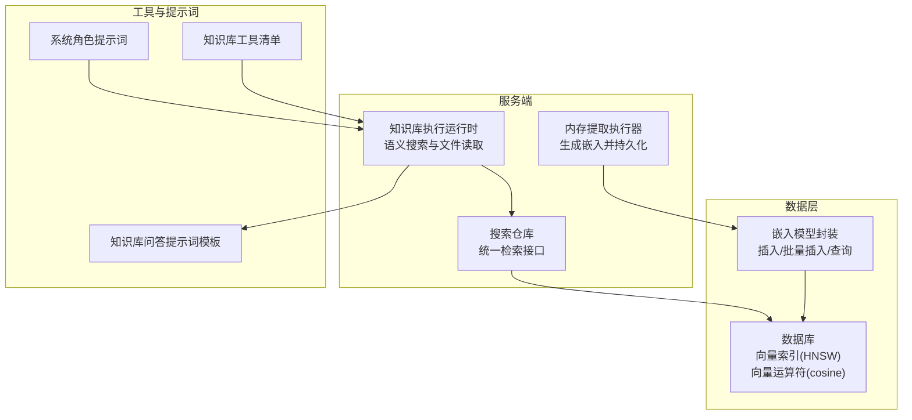
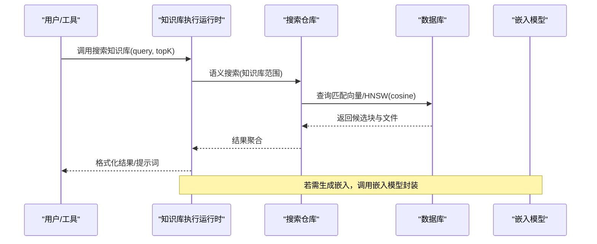
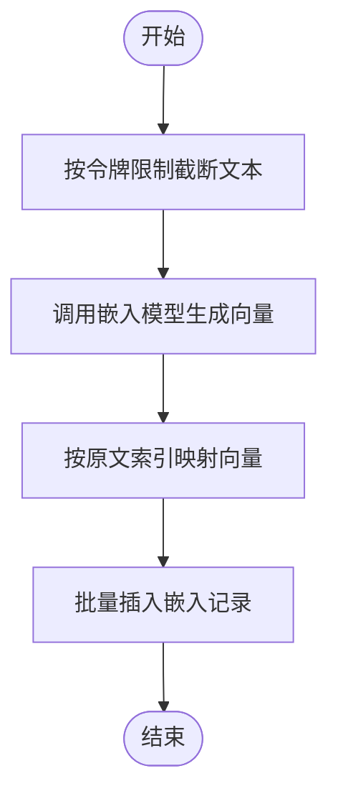
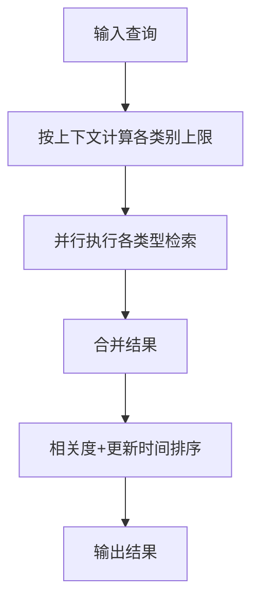
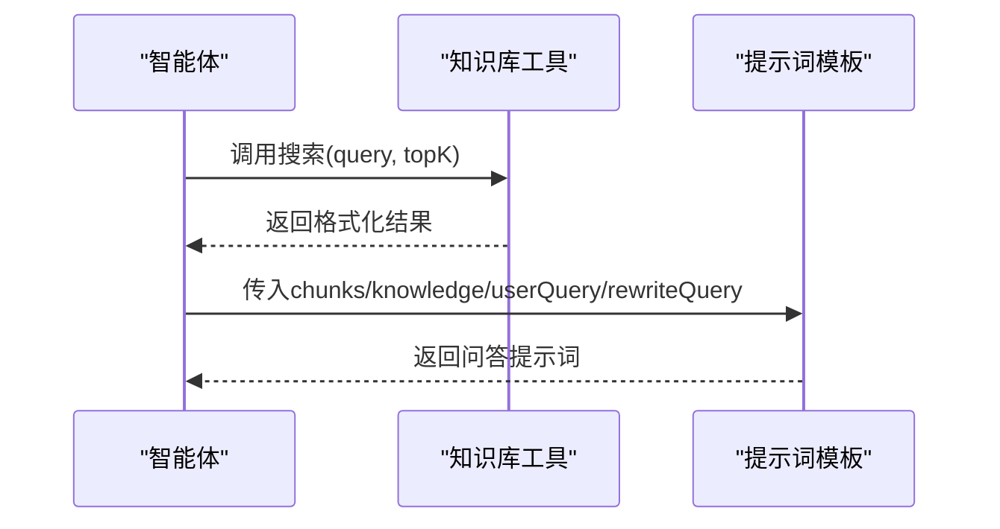
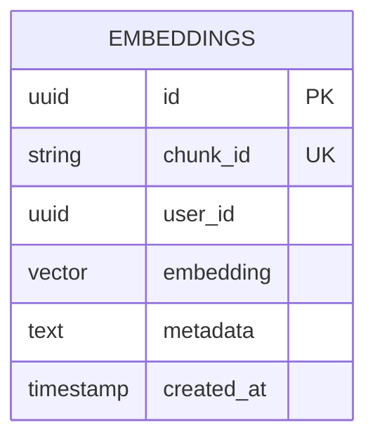
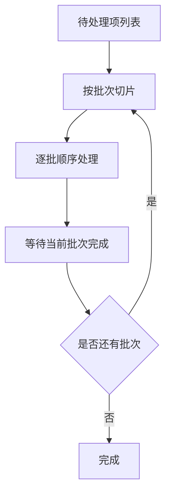
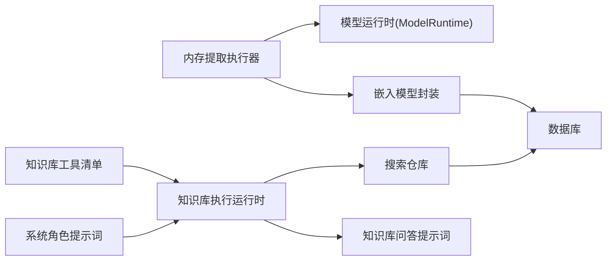

# 向量存储与检索

<cite>
**本文引用的文件**
- [packages/database/src/models/embedding.ts](file://packages/database/src/models/embedding.ts)
- [packages/database/src/repositories/search/index.ts](file://packages/database/src/repositories/search/index.ts)
- [packages/builtin-tool-knowledge-base/src/ExecutionRuntime/index.ts](file://packages/builtin-tool-knowledge-base/src/ExecutionRuntime/index.ts)
- [packages/builtin-tool-knowledge-base/src/manifest.ts](file://packages/builtin-tool-knowledge-base/src/manifest.ts)
- [packages/builtin-tool-knowledge-base/src/systemRole.ts](file://packages/builtin-tool-knowledge-base/src/systemRole.ts)
- [src/server/services/memory/userMemory/extract.ts](file://src/server/services/memory/userMemory/extract.ts)
- [packages/database/migrations/meta/0062_snapshot.json](file://packages/database/migrations/meta/0062_snapshot.json)
- [packages/database/migrations/meta/0061_snapshot.json](file://packages/database/migrations/meta/0061_snapshot.json)
- [packages/database/migrations/meta/0072_snapshot.json](file://packages/database/migrations/meta/0072_snapshot.json)
- [packages/types/src/user/settings/filesConfig.ts](file://packages/types/src/user/settings/filesConfig.ts)
- [src/server/globalConfig/parseFilesConfig.ts](file://src/server/globalConfig/parseFilesConfig.ts)
- [packages/prompts/src/prompts/knowledgeBaseQA/index.ts](file://packages/prompts/src/prompts/knowledgeBaseQA/index.ts)
- [packages/prompts/src/prompts/knowledgeBaseQA/index.test.ts](file://packages/prompts/src/prompts/knowledgeBaseQA/index.test.ts)
- [src/server/services/memory/userMemory/topicBatching.ts](file://src/server/services/memory/userMemory/topicBatching.ts)
- [src/server/services/memory/userMemory/__tests__/topicBatching.test.ts](file://src/server/services/memory/userMemory/__tests__/topicBatching.test.ts)
</cite>

## 目录
1. [简介](#简介)
2. [项目结构](#项目结构)
3. [核心组件](#核心组件)
4. [架构总览](#架构总览)
5. [详细组件分析](#详细组件分析)
6. [依赖关系分析](#依赖关系分析)
7. [性能考量](#性能考量)
8. [故障排查指南](#故障排查指南)
9. [结论](#结论)
10. [附录](#附录)

## 简介
本文件面向“向量存储与检索”系统，围绕向量嵌入的生成、存储、索引与检索进行系统化技术说明。内容涵盖嵌入模型选择、向量维度、相似度计算方法；向量数据库索引策略（如 HNSW、向量运算符）、查询优化与近似最近邻搜索；以及在知识问答、语义搜索中的应用模式。同时给出端到端检索流程、性能调优建议、缓存策略、批量处理与扩展性设计。

## 项目结构
该系统由以下关键模块构成：
- 嵌入生成与持久化：服务端内存提取与嵌入生成，向量写入数据库。
- 搜索与检索：统一搜索仓库支持多类型检索，并提供知识库语义检索入口。
- 工具与提示词：内置知识库工具、系统角色与问答提示词模板。
- 配置与运行时：文件配置解析、嵌入模型与重排器配置、运行时提供商解析。
- 数据层：嵌入模型封装、迁移脚本定义向量索引与运算符。

图示来源
- [src/server/services/memory/userMemory/extract.ts](file://src/server/services/memory/userMemory/extract.ts#L566-L634)
- [packages/database/src/models/embedding.ts](file://packages/database/src/models/embedding.ts#L16-L32)
- [packages/database/migrations/meta/0062_snapshot.json](file://packages/database/migrations/meta/0062_snapshot.json#L8521-L8527)
- [packages/builtin-tool-knowledge-base/src/ExecutionRuntime/index.ts](file://packages/builtin-tool-knowledge-base/src/ExecutionRuntime/index.ts#L39-L76)
- [packages/prompts/src/prompts/knowledgeBaseQA/index.ts](file://packages/prompts/src/prompts/knowledgeBaseQA/index.ts#L13-L39)

章节来源
- [packages/database/src/models/embedding.ts](file://packages/database/src/models/embedding.ts#L1-L63)
- [packages/database/src/repositories/search/index.ts](file://packages/database/src/repositories/search/index.ts#L1-L671)
- [packages/builtin-tool-knowledge-base/src/ExecutionRuntime/index.ts](file://packages/builtin-tool-knowledge-base/src/ExecutionRuntime/index.ts#L1-L120)
- [packages/builtin-tool-knowledge-base/src/manifest.ts](file://packages/builtin-tool-knowledge-base/src/manifest.ts#L1-L33)
- [packages/builtin-tool-knowledge-base/src/systemRole.ts](file://packages/builtin-tool-knowledge-base/src/systemRole.ts#L1-L16)
- [packages/prompts/src/prompts/knowledgeBaseQA/index.ts](file://packages/prompts/src/prompts/knowledgeBaseQA/index.ts#L1-L39)

## 核心组件
- 嵌入模型封装：提供单条与批量插入、删除、查询、计数等能力，确保按用户隔离。
- 内存提取执行器：负责将对话上下文切片，调用嵌入模型生成向量，再持久化到数据库。
- 搜索仓库：统一检索入口，支持多类型结果聚合与排序，兼顾上下文优先级。
- 知识库执行运行时：对外暴露搜索与读取文件的能力，内部委托检索服务完成语义搜索与文件内容读取。
- 提示词模板：为知识库问答构造上下文提示，整合检索块与用户问题。
- 配置解析：解析环境变量中的嵌入模型、重排器与查询模式，驱动运行时选择。

章节来源
- [packages/database/src/models/embedding.ts](file://packages/database/src/models/embedding.ts#L16-L61)
- [src/server/services/memory/userMemory/extract.ts](file://src/server/services/memory/userMemory/extract.ts#L566-L634)
- [packages/database/src/repositories/search/index.ts](file://packages/database/src/repositories/search/index.ts#L168-L213)
- [packages/builtin-tool-knowledge-base/src/ExecutionRuntime/index.ts](file://packages/builtin-tool-knowledge-base/src/ExecutionRuntime/index.ts#L39-L118)
- [packages/prompts/src/prompts/knowledgeBaseQA/index.ts](file://packages/prompts/src/prompts/knowledgeBaseQA/index.ts#L13-L39)
- [packages/types/src/user/settings/filesConfig.ts](file://packages/types/src/user/settings/filesConfig.ts#L1-L9)
- [src/server/globalConfig/parseFilesConfig.ts](file://src/server/globalConfig/parseFilesConfig.ts#L23-L63)

## 架构总览
系统采用“嵌入生成—向量存储—检索服务—工具调用”的分层架构。嵌入生成由服务端执行器完成，向量写入数据库并建立 HNSW 索引与向量运算符；检索通过统一仓库与知识库运行时完成；工具与提示词为上层应用提供可组合的检索与问答能力。

图示来源
- [packages/builtin-tool-knowledge-base/src/ExecutionRuntime/index.ts](file://packages/builtin-tool-knowledge-base/src/ExecutionRuntime/index.ts#L39-L76)
- [packages/database/src/repositories/search/index.ts](file://packages/database/src/repositories/search/index.ts#L168-L213)
- [packages/database/src/models/embedding.ts](file://packages/database/src/models/embedding.ts#L16-L32)
- [packages/database/migrations/meta/0062_snapshot.json](file://packages/database/migrations/meta/0062_snapshot.json#L8521-L8527)

## 详细组件分析

### 嵌入生成与存储
- 嵌入生成：执行器对每条文本进行截断与令牌限制，调用嵌入模型生成向量，返回按原文索引映射的结果。
- 存储策略：使用嵌入模型封装进行单条与批量插入，冲突时按 chunkId 去重。
- 维度与模型：默认维度与模型在常量中定义，运行时可按全局与私有配置覆盖。

图示来源
- [src/server/services/memory/userMemory/extract.ts](file://src/server/services/memory/userMemory/extract.ts#L566-L634)
- [packages/database/src/models/embedding.ts](file://packages/database/src/models/embedding.ts#L25-L32)

章节来源
- [src/server/services/memory/userMemory/extract.ts](file://src/server/services/memory/userMemory/extract.ts#L566-L634)
- [packages/database/src/models/embedding.ts](file://packages/database/src/models/embedding.ts#L16-L32)

### 检索与排序
- 多类型检索：统一搜索仓库支持代理、话题、消息、文件、页面、记忆、知识库等类型。
- 上下文感知限流：根据上下文类型动态调整各类别返回数量，提升相关性。
- 排序规则：先按相关度（精确/前缀/包含）升序，再按更新时间降序。
- 知识库检索：基于名称与描述的模糊匹配，结合向量检索结果进行排序与裁剪。

图示来源
- [packages/database/src/repositories/search/index.ts](file://packages/database/src/repositories/search/index.ts#L168-L213)
- [packages/database/src/repositories/search/index.ts](file://packages/database/src/repositories/search/index.ts#L218-L306)
- [packages/database/src/repositories/search/index.ts](file://packages/database/src/repositories/search/index.ts#L311-L318)

章节来源
- [packages/database/src/repositories/search/index.ts](file://packages/database/src/repositories/search/index.ts#L168-L318)

### 知识库工具与问答提示词
- 工具清单：明确搜索与读取文件的参数与约束，强调使用具体实体而非代词。
- 系统角色：指导工具使用顺序：理解需求→形成查询→搜索→阅读→合成回答。
- 问答提示词：在检索到的块基础上，构造包含知识域、检索块与用户问题的提示词，支持重写后的查询。

图示来源
- [packages/builtin-tool-knowledge-base/src/manifest.ts](file://packages/builtin-tool-knowledge-base/src/manifest.ts#L6-L32)
- [packages/builtin-tool-knowledge-base/src/systemRole.ts](file://packages/builtin-tool-knowledge-base/src/systemRole.ts#L1-L16)
- [packages/prompts/src/prompts/knowledgeBaseQA/index.ts](file://packages/prompts/src/prompts/knowledgeBaseQA/index.ts#L13-L39)

章节来源
- [packages/builtin-tool-knowledge-base/src/manifest.ts](file://packages/builtin-tool-knowledge-base/src/manifest.ts#L1-L33)
- [packages/builtin-tool-knowledge-base/src/systemRole.ts](file://packages/builtin-tool-knowledge-base/src/systemRole.ts#L1-L16)
- [packages/prompts/src/prompts/knowledgeBaseQA/index.ts](file://packages/prompts/src/prompts/knowledgeBaseQA/index.ts#L1-L39)

### 向量数据库索引与查询优化
- 索引策略：使用 HNSW（Hierarchical Navigable Small World）索引，适合高维向量的近似最近邻搜索。
- 运算符：cosine（余弦距离）作为向量相似度度量，适配归一化向量场景。
- 查询优化：通过并行检索多类型、按上下文调整限额、裁剪描述长度、在 SQL 层面进行模糊匹配与排序，减少无效扫描。

图示来源
- [packages/database/migrations/meta/0062_snapshot.json](file://packages/database/migrations/meta/0062_snapshot.json#L8521-L8527)
- [packages/database/migrations/meta/0061_snapshot.json](file://packages/database/migrations/meta/0061_snapshot.json#L8288-L8294)
- [packages/database/migrations/meta/0072_snapshot.json](file://packages/database/migrations/meta/0072_snapshot.json#L10254-L10260)

章节来源
- [packages/database/migrations/meta/0062_snapshot.json](file://packages/database/migrations/meta/0062_snapshot.json#L8521-L8527)
- [packages/database/migrations/meta/0061_snapshot.json](file://packages/database/migrations/meta/0061_snapshot.json#L8288-L8294)
- [packages/database/migrations/meta/0072_snapshot.json](file://packages/database/migrations/meta/0072_snapshot.json#L10254-L10260)

### 批量处理与并发控制
- 批处理：提供按批次顺序处理的工具函数，保证大列表的可控并发与顺序一致性。
- 并发与限流：工作流中对不同记忆层设置并行度，避免资源争用；对身份层采用串行处理保障一致性。

图示来源
- [src/server/services/memory/userMemory/topicBatching.ts](file://src/server/services/memory/userMemory/topicBatching.ts#L1-L14)

章节来源
- [src/server/services/memory/userMemory/topicBatching.ts](file://src/server/services/memory/userMemory/topicBatching.ts#L1-L14)
- [src/server/services/memory/userMemory/__tests__/topicBatching.test.ts](file://src/server/services/memory/userMemory/__tests__/topicBatching.test.ts#L1-L21)

### 配置与运行时
- 文件配置：支持嵌入模型、查询模式、重排器模型的配置项，便于在环境变量中指定。
- 解析逻辑：校验格式并填充默认值，保证运行时可用。

章节来源
- [packages/types/src/user/settings/filesConfig.ts](file://packages/types/src/user/settings/filesConfig.ts#L1-L9)
- [src/server/globalConfig/parseFilesConfig.ts](file://src/server/globalConfig/parseFilesConfig.ts#L23-L63)

## 依赖关系分析

图示来源
- [src/server/services/memory/userMemory/extract.ts](file://src/server/services/memory/userMemory/extract.ts#L566-L634)
- [packages/database/src/models/embedding.ts](file://packages/database/src/models/embedding.ts#L16-L32)
- [packages/database/src/repositories/search/index.ts](file://packages/database/src/repositories/search/index.ts#L168-L213)
- [packages/builtin-tool-knowledge-base/src/ExecutionRuntime/index.ts](file://packages/builtin-tool-knowledge-base/src/ExecutionRuntime/index.ts#L39-L76)
- [packages/prompts/src/prompts/knowledgeBaseQA/index.ts](file://packages/prompts/src/prompts/knowledgeBaseQA/index.ts#L13-L39)

章节来源
- [packages/database/src/models/embedding.ts](file://packages/database/src/models/embedding.ts#L1-L63)
- [packages/database/src/repositories/search/index.ts](file://packages/database/src/repositories/search/index.ts#L1-L671)
- [packages/builtin-tool-knowledge-base/src/ExecutionRuntime/index.ts](file://packages/builtin-tool-knowledge-base/src/ExecutionRuntime/index.ts#L1-L120)
- [packages/prompts/src/prompts/knowledgeBaseQA/index.ts](file://packages/prompts/src/prompts/knowledgeBaseQA/index.ts#L1-L39)

## 性能考量
- 向量维度与模型：默认维度与模型可在运行时配置，建议根据硬件与精度需求权衡。
- 索引与相似度：HNSW 与 cosine 运算符适合大规模高维向量检索；建议对向量进行归一化以提升余弦相似度稳定性。
- 查询路径优化：并行检索多类型、按上下文调整限额、裁剪描述长度、在 SQL 层做模糊匹配，减少无效扫描。
- 批量写入：使用批量插入去重策略，降低重复写入成本。
- 缓存策略：运行时缓存嵌入与层提取器的提供商实例，避免频繁初始化开销；注意缓存容量与淘汰策略。
- 并发与限流：工作流对不同层设置并行度，避免资源争用；身份层串行处理保障一致性。

## 故障排查指南
- 嵌入生成失败：检查令牌截断与上下文限制，确认模型请求参数与返回映射正确。
- 检索无结果：确认查询是否包含具体实体、是否命中索引列；检查上下文限额与排序逻辑。
- 工具调用异常：核对工具清单参数、信号中断与错误返回；查看提示词模板是否正确拼接。
- 配置解析错误：检查环境变量格式与必填项，确保 provider/model 格式正确。

章节来源
- [src/server/services/memory/userMemory/extract.ts](file://src/server/services/memory/userMemory/extract.ts#L599-L633)
- [packages/database/src/repositories/search/index.ts](file://packages/database/src/repositories/search/index.ts#L168-L213)
- [packages/builtin-tool-knowledge-base/src/ExecutionRuntime/index.ts](file://packages/builtin-tool-knowledge-base/src/ExecutionRuntime/index.ts#L69-L76)
- [src/server/globalConfig/parseFilesConfig.ts](file://src/server/globalConfig/parseFilesConfig.ts#L23-L63)

## 结论
本系统通过“嵌入生成—向量存储—检索服务—工具调用”的闭环，实现了面向知识问答与语义搜索的向量检索能力。借助 HNSW 索引与 cosine 相似度、上下文感知的检索策略与提示词模板，系统在准确性与性能之间取得平衡。通过批量处理、缓存与并发控制，进一步提升了可扩展性与稳定性。建议在生产环境中持续监控向量维度、索引质量与查询延迟，并根据业务场景迭代提示词与检索策略。

## 附录
- 应用模式
  - 知识问答：先检索后生成，利用提示词模板整合上下文与用户问题。
  - 语义搜索：针对文件、页面、记忆等多类型进行统一检索与排序。
- 扩展性设计
  - 支持多提供商与模型切换，运行时按偏好与密钥库解析。
  - 工作流并行与串行组合，满足不同层的处理需求。
- 容错机制
  - 嵌入生成失败时返回空向量占位，不影响整体流程。
  - 检索无结果时返回空提示词或兜底文案，保证用户体验。