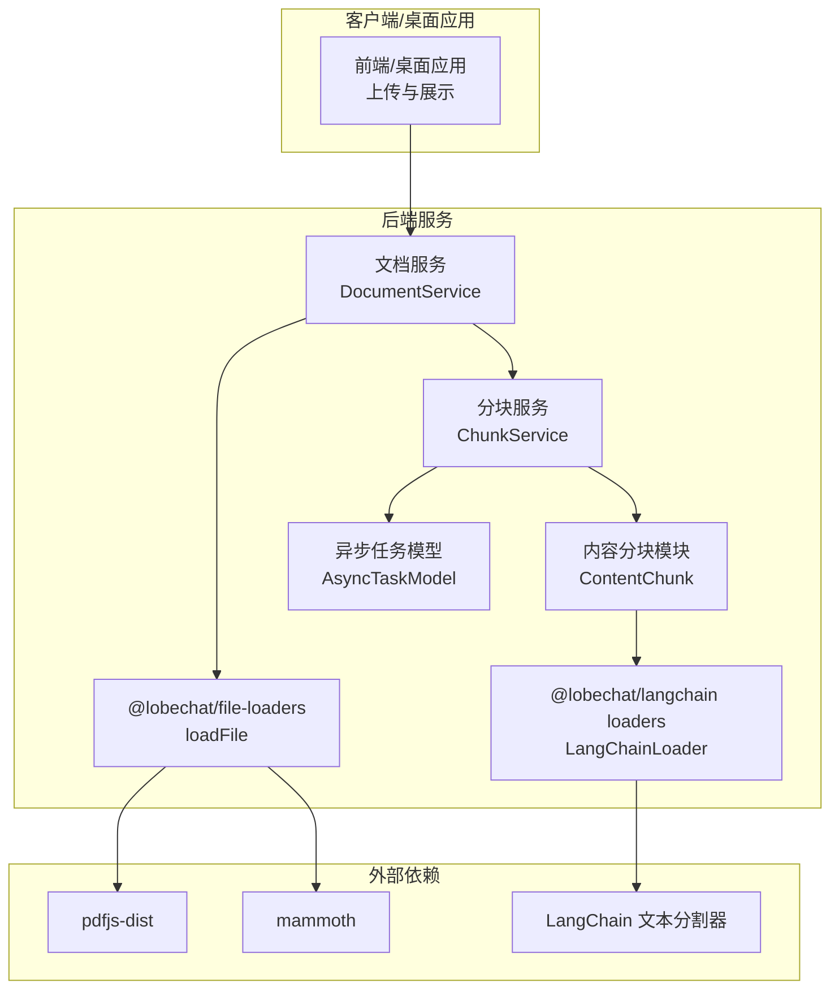
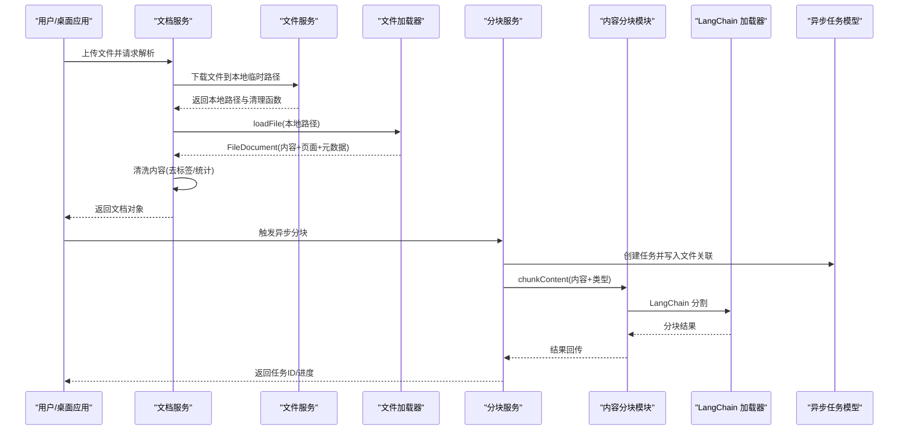
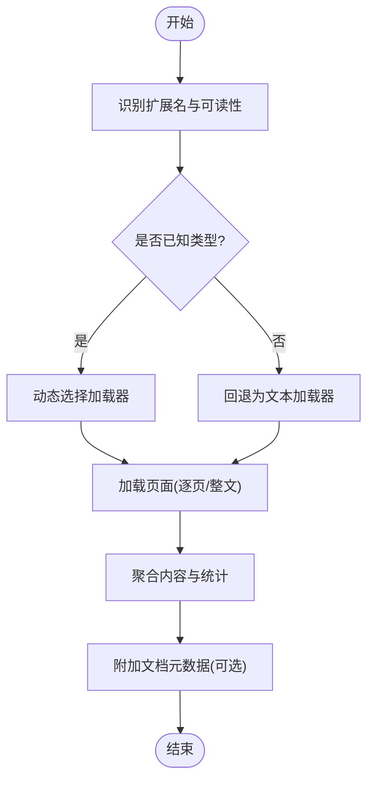
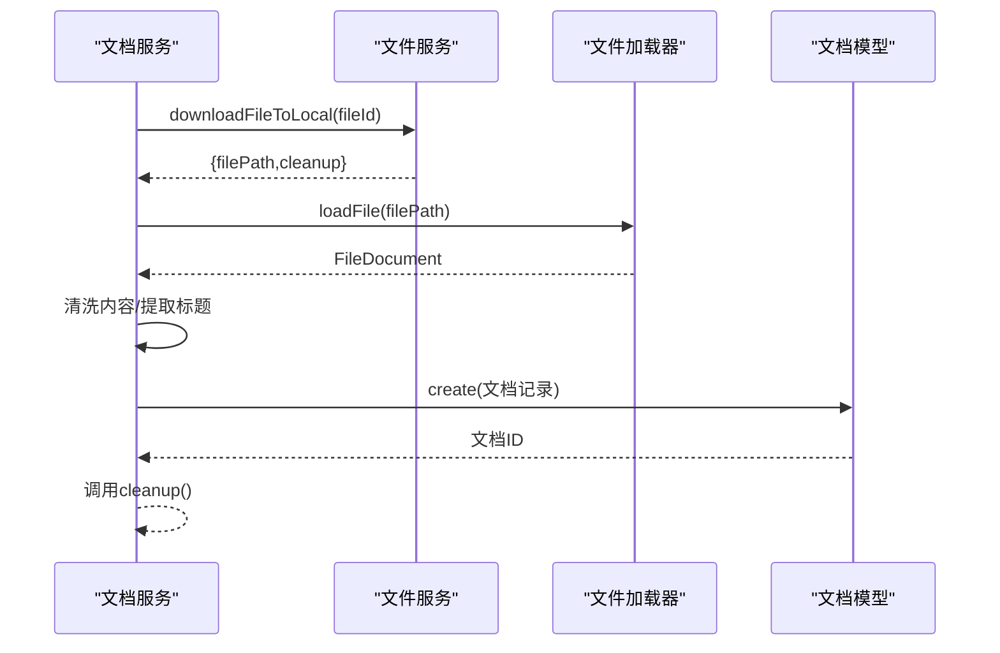
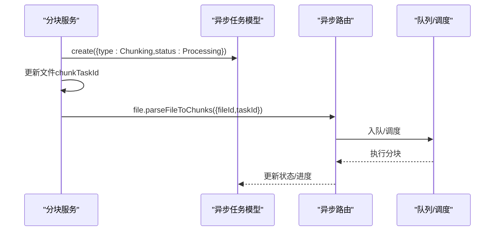
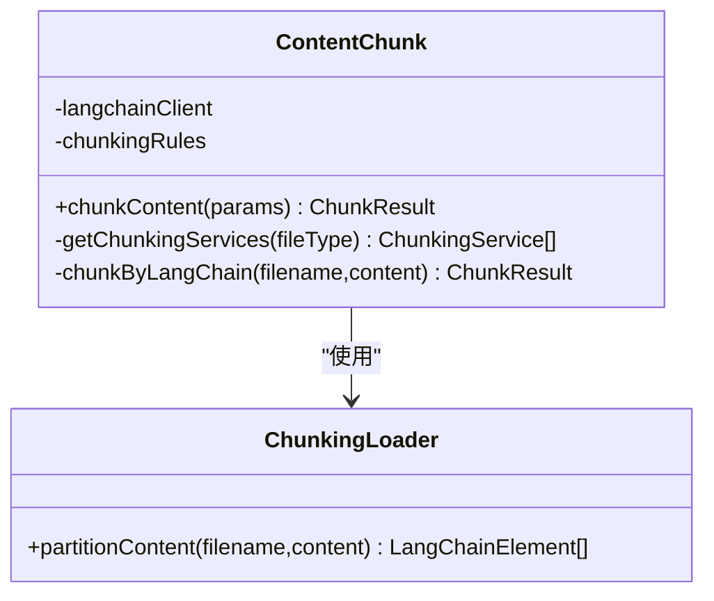
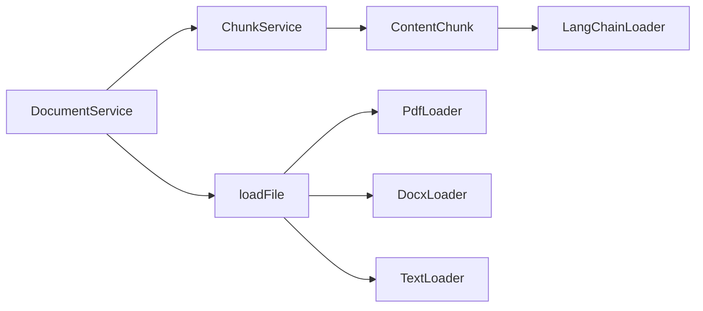

# 文档处理系统

<cite>
**本文引用的文件**
- [packages/file-loaders/src/loadFile.ts](file://packages/file-loaders/src/loadFile.ts)
- [packages/file-loaders/src/loaders/pdf/index.ts](file://packages/file-loaders/src/loaders/pdf/index.ts)
- [packages/file-loaders/src/loaders/docx/index.ts](file://packages/file-loaders/src/loaders/docx/index.ts)
- [packages/file-loaders/src/loaders/text/index.ts](file://packages/file-loaders/src/loaders/text/index.ts)
- [packages/file-loaders/src/loaders/index.ts](file://packages/file-loaders/src/loaders/index.ts)
- [src/libs/langchain/loaders/config.ts](file://src/libs/langchain/loaders/config.ts)
- [src/libs/langchain/loaders/pdf/index.ts](file://src/libs/langchain/loaders/pdf/index.ts)
- [src/libs/langchain/loaders/docx/index.ts](file://src/libs/langchain/loaders/docx/index.ts)
- [src/libs/langchain/loaders/txt/index.ts](file://src/libs/langchain/loaders/txt/index.ts)
- [src/server/services/document/index.ts](file://src/server/services/document/index.ts)
- [src/server/services/chunk/index.ts](file://src/server/services/chunk/index.ts)
- [src/server/modules/ContentChunk/index.ts](file://src/server/modules/ContentChunk/index.ts)
- [src/server/routers/lambda/chunk.ts](file://src/server/routers/lambda/chunk.ts)
- [packages/database/src/models/asyncTask.ts](file://packages/database/src/models/asyncTask.ts)
- [src/store/chat/agents/GroupOrchestration/createGroupOrchestrationExecutors.ts](file://src/store/chat/agents/GroupOrchestration/createGroupOrchestrationExecutors.ts)
- [apps/desktop/src/main/services/fileSrv.ts](file://apps/desktop/src/main/services/fileSrv.ts)
- [packages/file-loaders/src/types.ts](file://packages/file-loaders/src/types.ts)
</cite>

## 目录
1. [简介](#简介)
2. [项目结构](#项目结构)
3. [核心组件](#核心组件)
4. [架构总览](#架构总览)
5. [详细组件分析](#详细组件分析)
6. [依赖关系分析](#依赖关系分析)
7. [性能与并发优化](#性能与并发优化)
8. [故障排查指南](#故障排查指南)
9. [结论](#结论)
10. [附录：处理示例与配置](#附录处理示例与配置)

## 简介
本文件面向“文档处理系统”的技术文档，覆盖从文档上传、解析、预处理到分块与嵌入的完整链路。重点解释以下方面：
- 文档类型识别与格式转换
- 内容提取与元数据采集
- 分块策略与文本分割算法
- 质量检查、错误处理与重试机制
- 缓存策略、增量更新与版本管理
- 性能优化与并发控制

## 项目结构
系统围绕“文件加载器”“文档服务”“分块服务”“异步任务模型”“前端缓存”等模块协作完成端到端处理。

**图表来源**
- [src/server/services/document/index.ts](file://src/server/services/document/index.ts#L1-L352)
- [src/server/services/chunk/index.ts](file://src/server/services/chunk/index.ts#L1-L109)
- [src/server/modules/ContentChunk/index.ts](file://src/server/modules/ContentChunk/index.ts#L1-L82)
- [packages/file-loaders/src/loadFile.ts](file://packages/file-loaders/src/loadFile.ts#L1-L257)
- [src/libs/langchain/loaders/config.ts](file://src/libs/langchain/loaders/config.ts#L1-L7)

**章节来源**
- [src/server/services/document/index.ts](file://src/server/services/document/index.ts#L1-L352)
- [src/server/services/chunk/index.ts](file://src/server/services/chunk/index.ts#L1-L109)
- [src/server/modules/ContentChunk/index.ts](file://src/server/modules/ContentChunk/index.ts#L1-L82)
- [packages/file-loaders/src/loadFile.ts](file://packages/file-loaders/src/loadFile.ts#L1-L257)

## 核心组件
- 文件加载器体系：统一入口 loadFile，按扩展名动态选择 PDF/DOCX/TXT 等加载器；支持错误页回退与聚合统计。
- 文档服务：封装文档创建、查询、删除、更新；负责下载文件至本地、调用加载器、清洗内容并持久化。
- 分块服务：触发异步分块任务，协调文件与任务模型；内容分块由 ContentChunk 基于规则选择 LangChain 或其他分块服务。
- 异步任务模型：记录任务状态、进度与错误，支持超时检测与批量查询。
- 前端缓存：基于 SWR 的本地存储缓存，带过期与配额清理策略。

**章节来源**
- [packages/file-loaders/src/loadFile.ts](file://packages/file-loaders/src/loadFile.ts#L1-L257)
- [src/server/services/document/index.ts](file://src/server/services/document/index.ts#L1-L352)
- [src/server/services/chunk/index.ts](file://src/server/services/chunk/index.ts#L1-L109)
- [src/server/modules/ContentChunk/index.ts](file://src/server/modules/ContentChunk/index.ts#L1-L82)
- [packages/database/src/models/asyncTask.ts](file://packages/database/src/models/asyncTask.ts#L69-L111)
- [src/libs/swr/localStorageProvider.ts](file://src/libs/swr/localStorageProvider.ts#L98-L177)

## 架构总览
下图展示从“上传到分块”的端到端流程与关键交互：

**图表来源**
- [src/server/services/document/index.ts](file://src/server/services/document/index.ts#L250-L350)
- [packages/file-loaders/src/loadFile.ts](file://packages/file-loaders/src/loadFile.ts#L74-L256)
- [src/server/services/chunk/index.ts](file://src/server/services/chunk/index.ts#L72-L107)
- [src/server/modules/ContentChunk/index.ts](file://src/server/modules/ContentChunk/index.ts#L34-L80)

## 详细组件分析

### 组件A：文件加载器与类型识别
- 类型识别：根据扩展名优先判定文本可读性，再映射到具体类型（pdf/doc/docx/excel/pptx），无匹配则回退为文本。
- 动态加载：通过工厂延迟加载对应加载器，避免一次性引入重型依赖。
- 错误处理：任何阶段失败均返回含错误信息的页面，保证流程不中断。
- 聚合统计：计算字符数、行数，汇总为文档级统计字段。

**图表来源**
- [packages/file-loaders/src/loadFile.ts](file://packages/file-loaders/src/loadFile.ts#L17-L125)
- [packages/file-loaders/src/loaders/index.ts](file://packages/file-loaders/src/loaders/index.ts#L55-L65)

**章节来源**
- [packages/file-loaders/src/loadFile.ts](file://packages/file-loaders/src/loadFile.ts#L1-L257)
- [packages/file-loaders/src/loaders/pdf/index.ts](file://packages/file-loaders/src/loaders/pdf/index.ts#L1-L170)
- [packages/file-loaders/src/loaders/docx/index.ts](file://packages/file-loaders/src/loaders/docx/index.ts#L1-L86)
- [packages/file-loaders/src/loaders/text/index.ts](file://packages/file-loaders/src/loaders/text/index.ts#L1-L67)
- [packages/file-loaders/src/loaders/index.ts](file://packages/file-loaders/src/loaders/index.ts#L55-L65)

### 组件B：文档服务与内容清洗
- 下载与解析：下载文件到本地，调用 loadFile 获取 FileDocument。
- 标题与内容：优先使用元数据标题，否则从文件名推断；对 PDF 内容进行页面标签清洗。
- 持久化：创建文档记录，写入字符/行数统计与页面明细。

**图表来源**
- [src/server/services/document/index.ts](file://src/server/services/document/index.ts#L253-L350)

**章节来源**
- [src/server/services/document/index.ts](file://src/server/services/document/index.ts#L253-L350)

### 组件C：分块服务与异步任务
- 触发分块：创建异步任务，写入文件关联，动态调用异步路由触发实际分块执行。
- 任务状态：通过 AsyncTaskModel 记录状态、进度与错误，支持批量查询与超时检测。
- 路由查询：Lambda 路由提供分块查询与内容获取接口，支持游标分页。

**图表来源**
- [src/server/services/chunk/index.ts](file://src/server/services/chunk/index.ts#L72-L107)
- [packages/database/src/models/asyncTask.ts](file://packages/database/src/models/asyncTask.ts#L69-L111)
- [src/server/routers/lambda/chunk.ts](file://src/server/routers/lambda/chunk.ts#L114-L126)

**章节来源**
- [src/server/services/chunk/index.ts](file://src/server/services/chunk/index.ts#L1-L109)
- [packages/database/src/models/asyncTask.ts](file://packages/database/src/models/asyncTask.ts#L69-L111)
- [src/server/routers/lambda/chunk.ts](file://src/server/routers/lambda/chunk.ts#L114-L126)

### 组件D：内容分块与分割策略
- 规则驱动：依据知识库环境变量中的规则，按文件类型选择分块服务（默认 LangChain）。
- LangChain 分割：使用递归字符分割器，结合统一的分割参数（大小与重叠）。
- 失败回退：若某服务失败且非最后一个，切换到下一个；最后仍失败则抛出异常。

**图表来源**
- [src/server/modules/ContentChunk/index.ts](file://src/server/modules/ContentChunk/index.ts#L20-L82)
- [src/libs/langchain/loaders/config.ts](file://src/libs/langchain/loaders/config.ts#L1-L7)

**章节来源**
- [src/server/modules/ContentChunk/index.ts](file://src/server/modules/ContentChunk/index.ts#L1-L82)
- [src/libs/langchain/loaders/config.ts](file://src/libs/langchain/loaders/config.ts#L1-L7)

### 组件E：LangChain 加载器与分割器
- PDF/DOCX/TXT：分别使用 LangChain 对应加载器，随后以统一配置进行文本分割。
- 配置：chunkSize 与 chunkOverlap 作为全局分割参数，确保上下文连续性与可控片段长度。

**章节来源**
- [src/libs/langchain/loaders/pdf/index.ts](file://src/libs/langchain/loaders/pdf/index.ts#L1-L7)
- [src/libs/langchain/loaders/docx/index.ts](file://src/libs/langchain/loaders/docx/index.ts#L1-L13)
- [src/libs/langchain/loaders/txt/index.ts](file://src/libs/langchain/loaders/txt/index.ts#L1-L9)
- [src/libs/langchain/loaders/config.ts](file://src/libs/langchain/loaders/config.ts#L1-L7)

### 组件F：桌面端文件服务与 MIME 推断
- 文件读取：优先尝试旧路径，失败则回退到新存储根路径。
- MIME 推断：优先读取元数据文件中的类型，否则根据扩展名推断常见图像与 PDF 等类型。

**章节来源**
- [apps/desktop/src/main/services/fileSrv.ts](file://apps/desktop/src/main/services/fileSrv.ts#L190-L264)

## 依赖关系分析
- 组件耦合
  - DocumentService 依赖 FileService 与 @lobechat/file-loaders。
  - ChunkService 依赖 ContentChunk 与 AsyncTaskModel。
  - ContentChunk 依赖 LangChain 加载器与环境规则。
- 外部依赖
  - pdfjs-dist、mammoth、LangChain 文本分割器。
- 潜在循环依赖
  - 分块服务通过动态导入异步路由，避免直接循环引用。

**图表来源**
- [src/server/services/document/index.ts](file://src/server/services/document/index.ts#L1-L30)
- [src/server/services/chunk/index.ts](file://src/server/services/chunk/index.ts#L1-L27)
- [src/server/modules/ContentChunk/index.ts](file://src/server/modules/ContentChunk/index.ts#L1-L27)
- [packages/file-loaders/src/loadFile.ts](file://packages/file-loaders/src/loadFile.ts#L1-L10)

**章节来源**
- [src/server/services/document/index.ts](file://src/server/services/document/index.ts#L1-L30)
- [src/server/services/chunk/index.ts](file://src/server/services/chunk/index.ts#L1-L27)
- [src/server/modules/ContentChunk/index.ts](file://src/server/modules/ContentChunk/index.ts#L1-L27)
- [packages/file-loaders/src/loadFile.ts](file://packages/file-loaders/src/loadFile.ts#L1-L10)

## 性能与并发优化
- 动态加载与懒初始化：仅在需要时加载重型依赖，降低启动与内存占用。
- 并行批处理：文档批量创建、任务批量触发，提升吞吐。
- 并发执行：桌面端文件读取与元数据推断支持并发请求，减少等待。
- 缓存策略：前端 SWR 本地存储缓存，带 TTL 与容量上限，自动清理过期与超限条目。
- 任务并发：群组编排中支持并行执行多个异步任务，默认超时时间可配置。

**章节来源**
- [packages/file-loaders/src/loaders/index.ts](file://packages/file-loaders/src/loaders/index.ts#L55-L65)
- [src/store/chat/agents/GroupOrchestration/createGroupOrchestrationExecutors.ts](file://src/store/chat/agents/GroupOrchestration/createGroupOrchestrationExecutors.ts#L841-L883)
- [src/libs/swr/localStorageProvider.ts](file://src/libs/swr/localStorageProvider.ts#L98-L177)

## 故障排查指南
- 常见错误类型
  - 文件不可访问或统计失败：返回最小错误页，保留文件路径元信息。
  - PDF 解析失败：捕获底层异常，生成错误页并记录堆栈。
  - DOCX 解析失败：mammoth 抛错时返回空内容与错误元数据。
  - 任务触发失败：异步任务模型记录错误并标记状态为 Error。
- 诊断建议
  - 检查 APP_URL 可达性与代理/WAF 配置，避免异步路由无法访问。
  - 关注 pdfjs-dist 与 mammoth 的版本兼容性与内存占用。
  - 使用任务模型的批量查询接口定位卡住的任务。
- 重试机制
  - 异步任务触发失败时，可在上层逻辑中进行指数退避重试。
  - 前端缓存遇到配额超限会清空并重新写入，确保可用性。

**章节来源**
- [packages/file-loaders/src/loaders/pdf/index.ts](file://packages/file-loaders/src/loaders/pdf/index.ts#L103-L121)
- [packages/file-loaders/src/loaders/docx/index.ts](file://packages/file-loaders/src/loaders/docx/index.ts#L55-L70)
- [src/server/services/chunk/index.ts](file://src/server/services/chunk/index.ts#L94-L104)
- [packages/database/src/models/asyncTask.ts](file://packages/database/src/models/asyncTask.ts#L100-L111)
- [src/libs/swr/localStorageProvider.ts](file://src/libs/swr/localStorageProvider.ts#L160-L171)

## 结论
该文档处理系统通过“统一加载器 + 规则驱动分块 + 异步任务 + 前端缓存”的组合，实现了对多格式文档的稳定解析与高效分块。其设计强调：
- 可扩展的类型识别与动态加载
- 容错性强的错误页与元数据回退
- 可配置的分割策略与任务状态追踪
- 面向生产的缓存与并发优化

## 附录：处理示例与配置
- 支持的文件类型
  - 文本类：.txt、.csv、.md、.json、.xml、.yaml、.html 及多种代码/配置文件。
  - PDF：.pdf
  - Word：.docx、.doc
  - Excel：.xlsx、.xls（每工作表为一页）
  - PowerPoint：.pptx（每幻灯片为一页）
- 分割参数
  - chunkSize：800
  - chunkOverlap：400
- 环境变量
  - FILE_TYPE_CHUNKING_RULES：按扩展名配置分块服务序列（如 pdf=unstructured,default）。
  - UNSTRUCTURED_API_KEY / UNSTRUCTURED_SERVER_URL：启用 Unstructured 服务时使用。
- 数据结构
  - FileDocument：包含 content、pages、metadata、统计字段等。
  - DocumentPage：包含 pageContent、lineCount、charCount、metadata。

**章节来源**
- [packages/file-loaders/src/types.ts](file://packages/file-loaders/src/types.ts#L1-L65)
- [src/libs/langchain/loaders/config.ts](file://src/libs/langchain/loaders/config.ts#L1-L7)
- [src/server/modules/ContentChunk/rules.ts](file://src/server/modules/ContentChunk/rules.ts#L1-L23)
- [packages/file-loaders/README.md](file://packages/file-loaders/README.md#L1-L23)