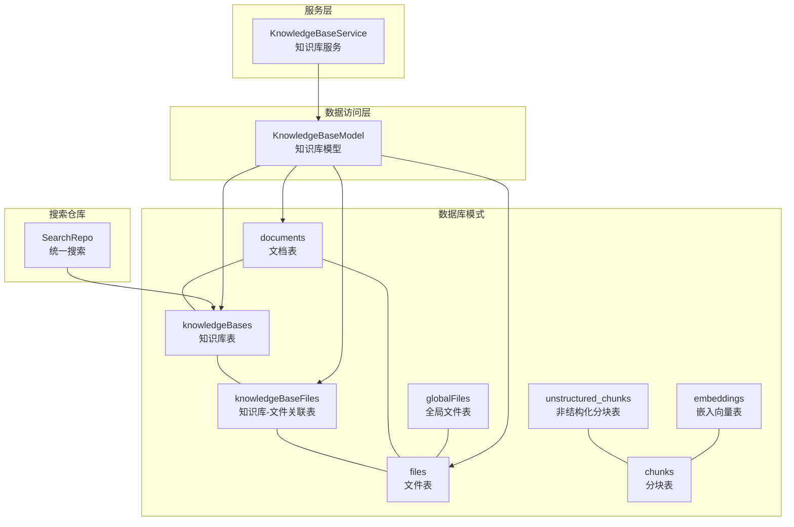
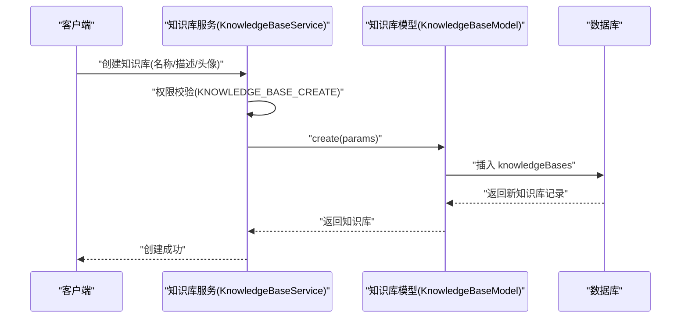
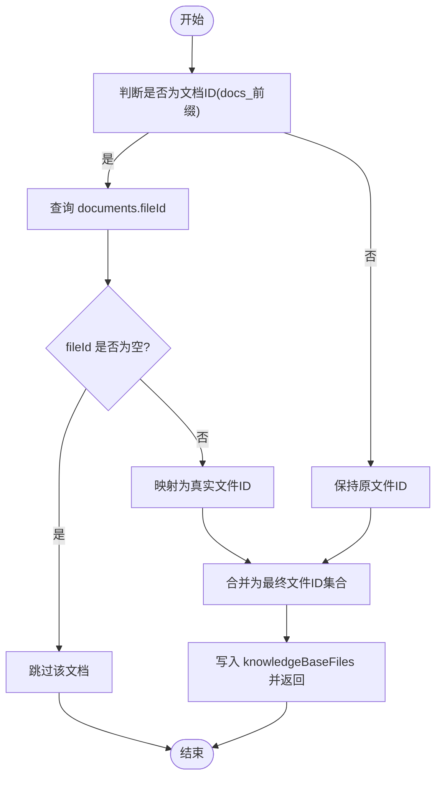
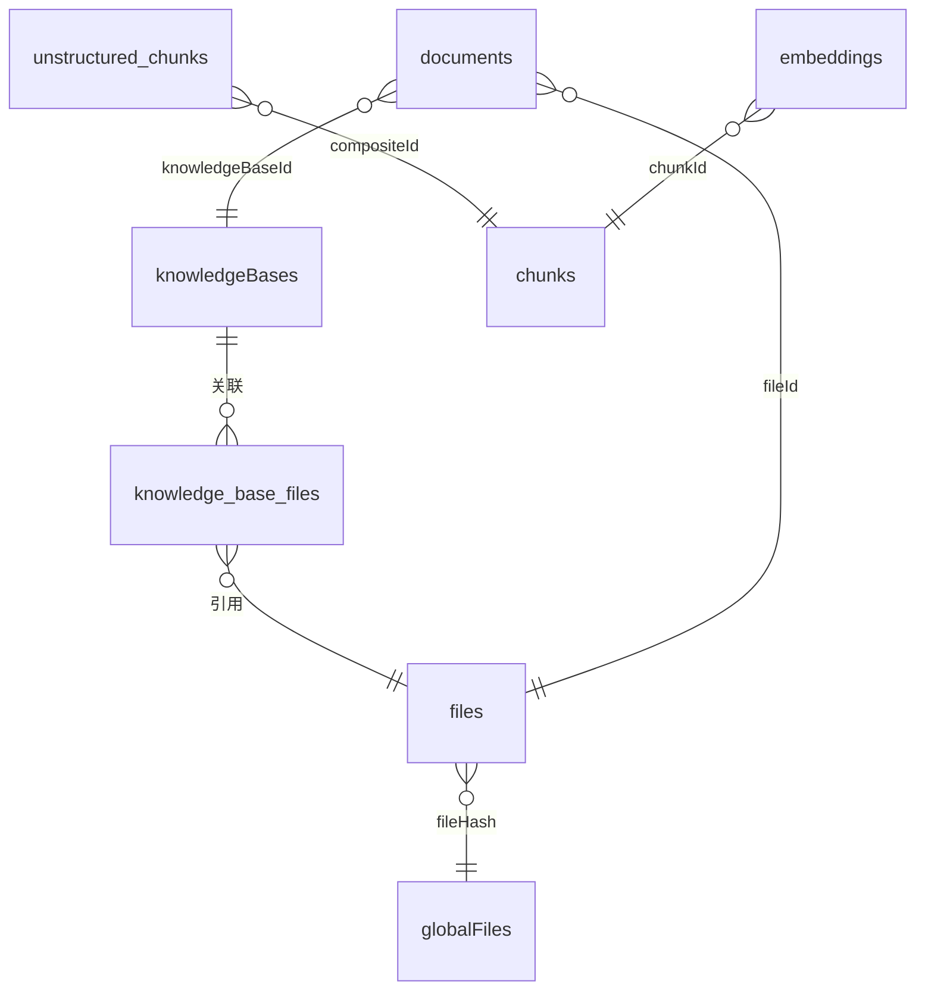
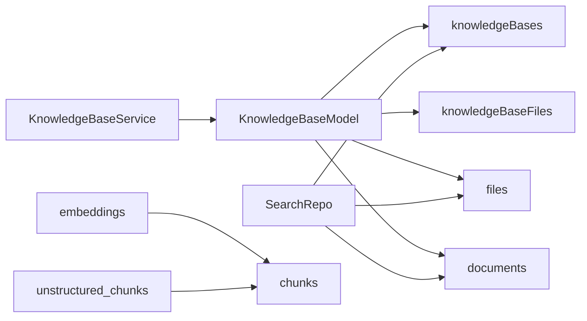

# 知识库数据模型

<cite>
**本文档引用的文件**
- [packages/database/src/schemas/file.ts](file://packages/database/src/schemas/file.ts)
- [packages/database/src/models/knowledgeBase.ts](file://packages/database/src/models/knowledgeBase.ts)
- [packages/database/src/models/__tests__/knowledgeBase.test.ts](file://packages/database/src/models/__tests__/knowledgeBase.test.ts)
- [packages/openapi/src/services/knowledge-base.service.ts](file://packages/openapi/src/services/knowledge-base.service.ts)
- [packages/openapi/src/types/knowledge-base.type.ts](file://packages/openapi/src/types/knowledge-base.type.ts)
- [packages/database/src/repositories/search/index.ts](file://packages/database/src/repositories/search/index.ts)
- [packages/database/src/schemas/rag.ts](file://packages/database/src/schemas/rag.ts)
- [packages/const/src/settings/knowledge.ts](file://packages/const/src/settings/knowledge.ts)
</cite>

## 目录

1. [简介](#简介)
2. [项目结构](#项目结构)
3. [核心组件](#核心组件)
4. [架构总览](#架构总览)
5. [详细组件分析](#详细组件分析)
6. [依赖关系分析](#依赖关系分析)
7. [性能考量](#性能考量)
8. [故障排查指南](#故障排查指南)
9. [结论](#结论)
10. [附录](#附录)

## 简介

本文件系统性梳理 “知识库数据模型” 的技术实现，覆盖实体字段定义、数据类型、约束条件与业务规则；详述知识库的创建流程、配置选项与权限控制；阐明知识库与文档、向量存储之间的关联关系；给出查询优化策略、索引设计与性能建议；提供完整的 CRUD 操作示例路径与最佳实践；解释知识库生命周期管理、版本控制与备份恢复机制。

## 项目结构

围绕知识库的数据模型，主要涉及以下模块：

- 数据库模式：定义知识库、文件、文档、知识库 - 文件关联等核心表结构与索引
- 数据访问层：封装知识库的 CRUD 与文件关联操作
- 服务层：对外暴露知识库管理接口，包含权限校验与分页查询
- 搜索仓库：统一检索入口，支持按名称 / 描述检索知识库
- 向量与分块：文档分块、嵌入向量、RAG 相关表，支撑检索增强
- 配置常量：默认嵌入 / 重排序模型配置，用于知识库处理流程

图表来源

- [packages/database/src/schemas/file.ts](file://packages/database/src/schemas/file.ts#L180-L239)
- [packages/database/src/schemas/rag.ts](file://packages/database/src/schemas/rag.ts#L18-L127)
- [packages/database/src/models/knowledgeBase.ts](file://packages/database/src/models/knowledgeBase.ts#L8-L162)
- [packages/openapi/src/services/knowledge-base.service.ts](file://packages/openapi/src/services/knowledge-base.service.ts#L26-L254)
- [packages/database/src/repositories/search/index.ts](file://packages/database/src/repositories/search/index.ts#L156-L671)

章节来源

- [packages/database/src/schemas/file.ts](file://packages/database/src/schemas/file.ts#L180-L239)
- [packages/database/src/schemas/rag.ts](file://packages/database/src/schemas/rag.ts#L18-L127)
- [packages/database/src/models/knowledgeBase.ts](file://packages/database/src/models/knowledgeBase.ts#L8-L162)
- [packages/openapi/src/services/knowledge-base.service.ts](file://packages/openapi/src/services/knowledge-base.service.ts#L26-L254)
- [packages/database/src/repositories/search/index.ts](file://packages/database/src/repositories/search/index.ts#L156-L671)

## 核心组件

- 知识库实体（knowledgeBases）
  - 字段：标识符、名称、描述、头像、类型、所属用户、客户端标识、公开标记、设置配置、时间戳
  - 约束：唯一索引（客户端标识 + 用户）、用户索引
  - 业务规则：每个知识库绑定单个用户；可配置是否公开；支持设置 JSON 结构
- 知识库 - 文件关联（knowledgeBaseFiles）
  - 字段：知识库 ID、文件 ID、用户 ID、创建时间
  - 约束：复合主键（KBID + 文件 ID），外键级联删除
  - 业务规则：多对多关联，支持按用户维度隔离
- 文件与文档（files、documents、globalFiles）
  - 文档表支持页面内容、统计信息、源类型、父级文档、知识库归属等
  - 文件表与全局文件表关联，支持分块与嵌入任务跟踪
- 搜索仓库（SearchRepo）
  - 提供统一检索能力，包含知识库名称 / 描述检索
- 知识库服务（KnowledgeBaseService）
  - 对外提供列表、详情、创建、更新、删除接口，并进行权限校验
- 知识库模型（KnowledgeBaseModel）
  - 封装知识库 CRUD 与文件关联（添加 / 移除）逻辑，含文档 ID 解析与镜像文件映射

章节来源

- [packages/database/src/schemas/file.ts](file://packages/database/src/schemas/file.ts#L180-L239)
- [packages/database/src/models/knowledgeBase.ts](file://packages/database/src/models/knowledgeBase.ts#L8-L162)
- [packages/openapi/src/services/knowledge-base.service.ts](file://packages/openapi/src/services/knowledge-base.service.ts#L26-L254)
- [packages/database/src/repositories/search/index.ts](file://packages/database/src/repositories/search/index.ts#L638-L669)

## 架构总览

知识库数据模型在服务层、数据访问层与数据库模式之间形成清晰分层：

- 服务层负责权限校验与业务编排
- 数据访问层负责具体数据操作与关联解析
- 数据库模式定义强一致的约束与索引
- 搜索仓库提供跨实体检索能力
- RAG 相关表支撑向量化检索

图表来源

- [packages/openapi/src/services/knowledge-base.service.ts](file://packages/openapi/src/services/knowledge-base.service.ts#L135-L171)
- [packages/database/src/models/knowledgeBase.ts](file://packages/database/src/models/knowledgeBase.ts#L19-L26)

## 详细组件分析

### 知识库实体字段定义与约束

- 主键与标识
  - id：文本型，主键，使用全局唯一生成器
  - clientId：文本型，配合 userId 建唯一索引，便于前端幂等
- 名称与元信息
  - name：非空文本，必填
  - description：可空文本
  - avatar：可空文本（URL）
  - type：可空文本，用于区分不同类型的知识库
- 所属与公开
  - userId：外键到 users，级联删除
  - isPublic：布尔，默认 false
- 设置与时间戳
  - settings：JSONB，存放配置项
  - createdAt/updatedAt：时间戳，默认值为 now ()

章节来源

- [packages/database/src/schemas/file.ts](file://packages/database/src/schemas/file.ts#L180-L208)

### 知识库 - 文件关联关系

- 关系说明
  - knowledgeBaseFiles 作为中间表，将 knowledgeBases 与 files 建立多对多关系
  - 复合主键确保同一用户下同一 KB 不会重复关联同一文件
- 关联解析与文档镜像
  - 支持传入以 docs\_ 前缀的文档 ID，内部解析为对应文件 ID（通过 documents.fileId）
  - 若文档未建立镜像文件（fileId 为空），则跳过该文档
  - 添加时同步更新 documents.knowledgeBaseId，移除时清空

图表来源

- [packages/database/src/models/knowledgeBase.ts](file://packages/database/src/models/knowledgeBase.ts#L28-L64)

章节来源

- [packages/database/src/models/knowledgeBase.ts](file://packages/database/src/models/knowledgeBase.ts#L28-L122)
- [packages/database/src/models/**tests**/knowledgeBase.test.ts](file://packages/database/src/models/__tests__/knowledgeBase.test.ts#L159-L356)

### 知识库创建流程与配置选项

- 创建接口
  - 请求体包含名称、可选头像、可选描述
  - 服务层进行权限校验（KNOWLEDGE_BASE_CREATE）
  - 调用模型创建并返回完整知识库信息
- 配置选项
  - settings：JSONB，可存放嵌入 / 重排序模型、查询模式等
  - 默认配置参考：嵌入模型、重排序模型、查询模式
- 权限控制
  - 服务层统一校验操作权限，失败抛出授权错误
  - 查询与删除均按 userId 进行用户隔离

章节来源

- [packages/openapi/src/types/knowledge-base.type.ts](file://packages/openapi/src/types/knowledge-base.type.ts#L108-L121)
- [packages/openapi/src/services/knowledge-base.service.ts](file://packages/openapi/src/services/knowledge-base.service.ts#L135-L171)
- [packages/const/src/settings/knowledge.ts](file://packages/const/src/settings/knowledge.ts#L11-L25)

### 知识库查询与权限控制

- 列表查询
  - 支持关键词模糊匹配（名称 / 描述）
  - 分页参数由通用分页工具处理
  - 返回时附加访问来源类型（当前实现为 owner）
- 详情查询
  - 权限校验后调用模型 findById，按用户隔离
- 权限模型
  - 每个知识库严格绑定 userId
  - 服务层在读取、更新、删除前均进行存在性与归属校验

章节来源

- [packages/openapi/src/services/knowledge-base.service.ts](file://packages/openapi/src/services/knowledge-base.service.ts#L37-L99)
- [packages/openapi/src/services/knowledge-base.service.ts](file://packages/openapi/src/services/knowledge-base.service.ts#L104-L130)
- [packages/database/src/models/knowledgeBase.ts](file://packages/database/src/models/knowledgeBase.ts#L144-L148)

### 知识库与文档、向量存储的关联

- 文档到知识库
  - documents.knowledgeBaseId 可直接指向某知识库
  - 通过 knowledgeBaseFiles 间接关联文件与知识库
- 向量与检索
  - chunks/unstructured_chunks：文档内容分块
  - embeddings：分块对应的向量表示（维度 1024）
  - document_chunks：文档与分块的关联表
- 搜索集成
  - SearchRepo 提供按名称 / 描述检索知识库的能力，结合 relevance 排序

图表来源

- [packages/database/src/schemas/file.ts](file://packages/database/src/schemas/file.ts#L48-L118)
- [packages/database/src/schemas/file.ts](file://packages/database/src/schemas/file.ts#L124-L176)
- [packages/database/src/schemas/file.ts](file://packages/database/src/schemas/file.ts#L180-L239)
- [packages/database/src/schemas/rag.ts](file://packages/database/src/schemas/rag.ts#L18-L127)

章节来源

- [packages/database/src/schemas/file.ts](file://packages/database/src/schemas/file.ts#L48-L118)
- [packages/database/src/schemas/file.ts](file://packages/database/src/schemas/file.ts#L124-L176)
- [packages/database/src/schemas/file.ts](file://packages/database/src/schemas/file.ts#L180-L239)
- [packages/database/src/schemas/rag.ts](file://packages/database/src/schemas/rag.ts#L18-L127)
- [packages/database/src/repositories/search/index.ts](file://packages/database/src/repositories/search/index.ts#L638-L669)

### CRUD 操作示例与最佳实践

- 创建
  - 示例路径：[创建知识库请求体定义](file://packages/openapi/src/types/knowledge-base.type.ts#L108-L121)
  - 示例路径：[服务层创建流程](file://packages/openapi/src/services/knowledge-base.service.ts#L135-L171)
  - 最佳实践：先校验权限，再写入；必要时预设 settings
- 查询
  - 示例路径：[列表查询与分页](file://packages/openapi/src/services/knowledge-base.service.ts#L37-L99)
  - 示例路径：[按名称 / 描述检索（搜索仓库）](file://packages/database/src/repositories/search/index.ts#L638-L669)
  - 最佳实践：使用关键词模糊匹配；结合时间戳排序
- 更新
  - 示例路径：[更新请求体定义](file://packages/openapi/src/types/knowledge-base.type.ts#L134-L147)
  - 示例路径：[服务层更新流程](file://packages/openapi/src/services/knowledge-base.service.ts#L176-L215)
  - 最佳实践：仅允许更新当前用户的知识库；更新时自动更新时间戳
- 删除
  - 示例路径：[删除流程](file://packages/openapi/src/services/knowledge-base.service.ts#L220-L252)
  - 注意：删除会级联清理关联表记录
- 文件关联
  - 示例路径：[添加文件到知识库](file://packages/database/src/models/knowledgeBase.ts#L28-L64)
  - 示例路径：[从知识库移除文件](file://packages/database/src/models/knowledgeBase.ts#L77-L122)
  - 最佳实践：混合传入文档 ID 与文件 ID 时，先解析再统一入库；注意文档无镜像文件的情况

章节来源

- [packages/openapi/src/types/knowledge-base.type.ts](file://packages/openapi/src/types/knowledge-base.type.ts#L108-L147)
- [packages/openapi/src/services/knowledge-base.service.ts](file://packages/openapi/src/services/knowledge-base.service.ts#L37-L252)
- [packages/database/src/models/knowledgeBase.ts](file://packages/database/src/models/knowledgeBase.ts#L28-L122)
- [packages/database/src/repositories/search/index.ts](file://packages/database/src/repositories/search/index.ts#L638-L669)

### 知识库生命周期管理、版本控制与备份恢复

- 生命周期
  - 创建：生成唯一标识，初始化时间戳
  - 更新：修改名称 / 描述 / 头像 / 设置，更新时间戳
  - 删除：删除知识库及其关联记录（外键级联）
- 版本控制
  - 建议通过 settings 中的模型版本字段或变更日志表实现版本追踪
  - clientId 可用于幂等创建与更新
- 备份恢复
  - 建议基于数据库导出 / 导入策略，保留 knowledgeBases、knowledgeBaseFiles、files、documents、globalFiles 等关键表
  - 恢复时注意 userId 映射与外键一致性

章节来源

- [packages/database/src/schemas/file.ts](file://packages/database/src/schemas/file.ts#L180-L239)
- [packages/database/src/models/knowledgeBase.ts](file://packages/database/src/models/knowledgeBase.ts#L67-L75)

## 依赖关系分析

- 服务层依赖数据访问层，数据访问层依赖数据库模式
- 搜索仓库依赖多个表，包括 knowledgeBases
- RAG 相关表与文件 / 文档表存在外键依赖，支撑向量化检索

图表来源

- [packages/openapi/src/services/knowledge-base.service.ts](file://packages/openapi/src/services/knowledge-base.service.ts#L26-L32)
- [packages/database/src/models/knowledgeBase.ts](file://packages/database/src/models/knowledgeBase.ts#L8-L15)
- [packages/database/src/repositories/search/index.ts](file://packages/database/src/repositories/search/index.ts#L1-L14)
- [packages/database/src/schemas/rag.ts](file://packages/database/src/schemas/rag.ts#L18-L127)

章节来源

- [packages/openapi/src/services/knowledge-base.service.ts](file://packages/openapi/src/services/knowledge-base.service.ts#L26-L32)
- [packages/database/src/models/knowledgeBase.ts](file://packages/database/src/models/knowledgeBase.ts#L8-L15)
- [packages/database/src/repositories/search/index.ts](file://packages/database/src/repositories/search/index.ts#L1-L14)
- [packages/database/src/schemas/rag.ts](file://packages/database/src/schemas/rag.ts#L18-L127)

## 性能考量

- 索引设计
  - knowledgeBases：用户索引、客户端标识唯一索引
  - knowledgeBaseFiles：复合主键、KBID / 文件 ID / 用户 ID 索引
  - documents：多种维度索引（source、fileType、sourceType、userId、fileId、parentId、knowledgeBaseId）
  - files：fileHash、userId、parentId、任务 ID 索引
  - embeddings：chunkId、userId 索引，提升删除与查询效率
- 查询优化
  - 列表查询使用分页与关键词模糊匹配，避免全表扫描
  - 搜索仓库并行执行多类型查询，按上下文动态调整限制
- 向量化检索
  - 使用向量维度 1024 的 embeddings 表，结合分块与非结构化分块表，提高召回质量
- 缓存与幂等
  - clientId 唯一索引支持幂等写入
  - 建议在高频读场景引入缓存层（如 Redis）

章节来源

- [packages/database/src/schemas/file.ts](file://packages/database/src/schemas/file.ts#L180-L239)
- [packages/database/src/schemas/rag.ts](file://packages/database/src/schemas/rag.ts#L71-L89)
- [packages/database/src/repositories/search/index.ts](file://packages/database/src/repositories/search/index.ts#L168-L213)

## 故障排查指南

- 权限不足
  - 现象：接口返回授权错误
  - 排查：确认当前用户是否具备相应操作权限（KNOWLEDGE_BASE\_\*）
- 资源不存在或越权
  - 现象：查询 / 更新 / 删除时报资源不存在或访问被拒
  - 排查：确认知识库归属当前用户；检查 userId 条件是否生效
- 文档无镜像文件
  - 现象：添加文档到知识库时未产生关联
  - 排查：确认 documents.fileId 是否为空；若为空则不会映射到任何文件
- 移除无效文件 ID
  - 现象：传入仅含无效文档 ID 导致无变化
  - 排查：解析后 resolvedFileIds 为空时会提前返回

章节来源

- [packages/openapi/src/services/knowledge-base.service.ts](file://packages/openapi/src/services/knowledge-base.service.ts#L40-L44)
- [packages/database/src/models/**tests**/knowledgeBase.test.ts](file://packages/database/src/models/__tests__/knowledgeBase.test.ts#L263-L294)
- [packages/database/src/models/**tests**/knowledgeBase.test.ts](file://packages/database/src/models/__tests__/knowledgeBase.test.ts#L451-L504)

## 结论

知识库数据模型通过清晰的表结构、严格的用户隔离与完善的关联解析，实现了对文档与文件的灵活组织。结合搜索仓库与 RAG 相关表，可进一步支撑检索增强与智能问答。建议在生产环境中强化权限校验、完善索引与缓存策略，并通过 settings 实现配置版本化管理。

## 附录

- 默认嵌入 / 重排序配置
  - 参考路径：[默认文件处理配置](file://packages/const/src/settings/knowledge.ts#L11-L25)
- 测试用例参考
  - 参考路径：[知识库模型测试](file://packages/database/src/models/__tests__/knowledgeBase.test.ts#L1-L560)
