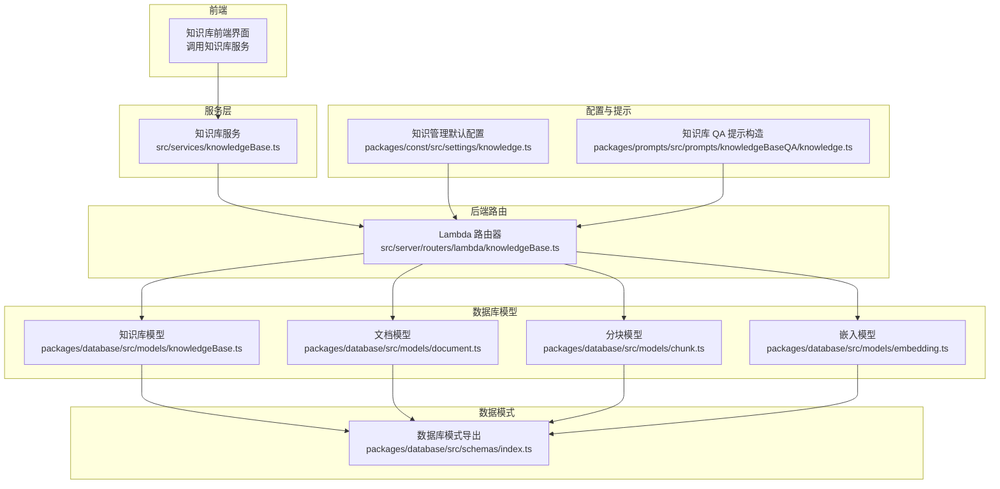
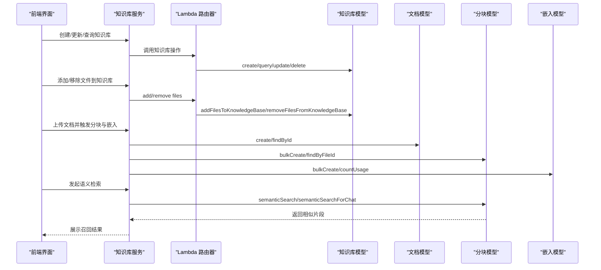
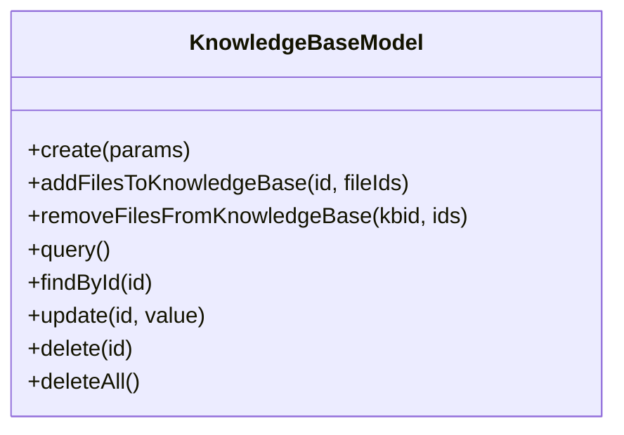
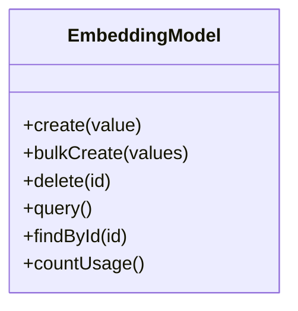
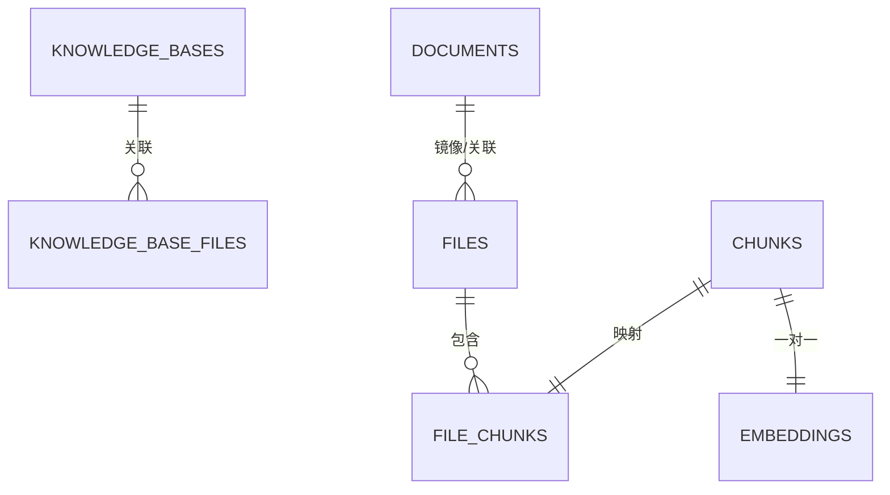
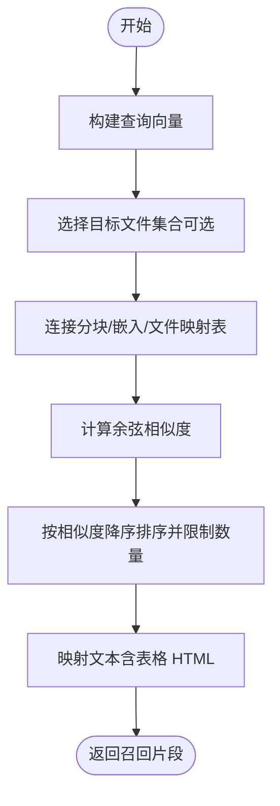
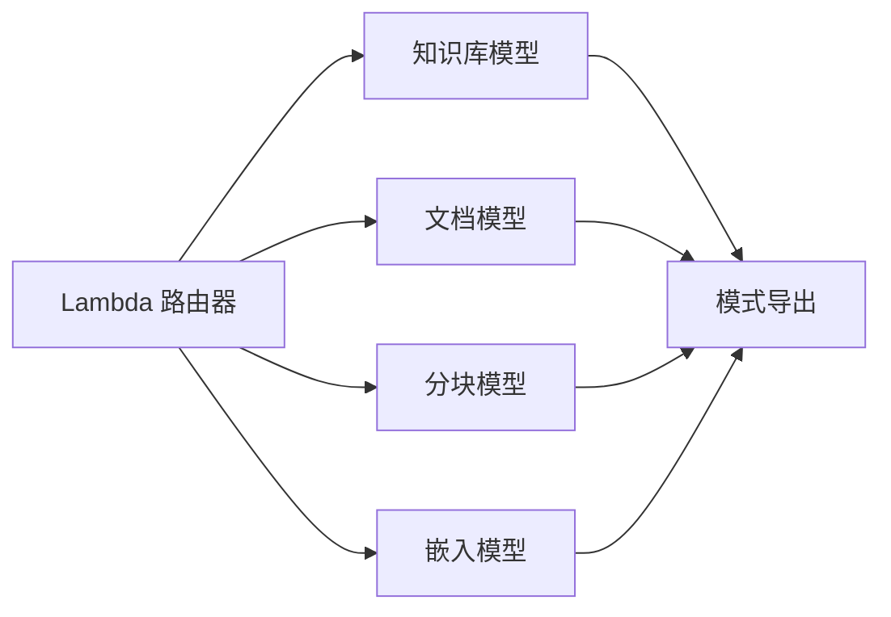

# 知识管理体系

<cite>
**本文引用的文件**
- [packages/database/src/models/knowledgeBase.ts](file://packages/database/src/models/knowledgeBase.ts)
- [packages/database/src/models/document.ts](file://packages/database/src/models/document.ts)
- [packages/database/src/models/chunk.ts](file://packages/database/src/models/chunk.ts)
- [packages/database/src/models/embedding.ts](file://packages/database/src/models/embedding.ts)
- [packages/database/src/schemas/index.ts](file://packages/database/src/schemas/index.ts)
- [packages/const/src/settings/knowledge.ts](file://packages/const/src/settings/knowledge.ts)
- [src/services/knowledgeBase.ts](file://src/services/knowledgeBase.ts)
- [src/server/routers/lambda/knowledgeBase.ts](file://src/server/routers/lambda/knowledgeBase.ts)
- [packages/prompts/src/prompts/knowledgeBaseQA/knowledge.ts](file://packages/prompts/src/prompts/knowledgeBaseQA/knowledge.ts)
- [packages/database/migrations/meta/0074_snapshot.json](file://packages/database/migrations/meta/0074_snapshot.json)
- [packages/database/migrations/meta/0026_snapshot.json](file://packages/database/migrations/meta/0026_snapshot.json)
- [packages/database/migrations/meta/0025_snapshot.json](file://packages/database/migrations/meta/0025_snapshot.json)
- [packages/database/migrations/meta/0022_snapshot.json](file://packages/database/migrations/meta/0022_snapshot.json)
</cite>

## 目录

1. [简介](#简介)
2. [项目结构](#项目结构)
3. [核心组件](#核心组件)
4. [架构总览](#架构总览)
5. [详细组件分析](#详细组件分析)
6. [依赖关系分析](#依赖关系分析)
7. [性能考量](#性能考量)
8. [故障排查指南](#故障排查指南)
9. [结论](#结论)
10. [附录](#附录)

## 简介

本文件系统化梳理 LobeHub 的知识管理体系，覆盖知识库（KnowledgeBase）、文档（Document）、分块（Chunk）与向量嵌入（Embedding）等核心实体及其数据模型、处理流程与交互关系。重点阐述：

- 知识库的组织结构与文档分类
- 文档内容的分割策略与分块映射
- 向量嵌入的存储机制与相似度检索算法
- 知识召回流程与端到端数据流
- 性能优化策略、缓存与索引设计
- 安全控制、访问权限与版本管理机制

## 项目结构

围绕知识管理的关键代码分布在数据库层（models/schemas）、服务层（services）、后端路由（lambda routers）以及常量配置中。下图展示与知识管理直接相关的模块与文件：



图表来源

- [src/services/knowledgeBase.ts](file://src/services/knowledgeBase.ts#L1-L35)
- [src/server/routers/lambda/knowledgeBase.ts](file://src/server/routers/lambda/knowledgeBase.ts#L1-L97)
- [packages/database/src/models/knowledgeBase.ts](file://packages/database/src/models/knowledgeBase.ts#L1-L162)
- [packages/database/src/models/document.ts](file://packages/database/src/models/document.ts#L1-L135)
- [packages/database/src/models/chunk.ts](file://packages/database/src/models/chunk.ts#L1-L236)
- [packages/database/src/models/embedding.ts](file://packages/database/src/models/embedding.ts#L1-L63)
- [packages/database/src/schemas/index.ts](file://packages/database/src/schemas/index.ts#L1-L24)
- [packages/const/src/settings/knowledge.ts](file://packages/const/src/settings/knowledge.ts#L1-L26)
- [packages/prompts/src/prompts/knowledgeBaseQA/knowledge.ts](file://packages/prompts/src/prompts/knowledgeBaseQA/knowledge.ts#L1-L15)

章节来源

- [src/services/knowledgeBase.ts](file://src/services/knowledgeBase.ts#L1-L35)
- [src/server/routers/lambda/knowledgeBase.ts](file://src/server/routers/lambda/knowledgeBase.ts#L1-L97)
- [packages/database/src/models/knowledgeBase.ts](file://packages/database/src/models/knowledgeBase.ts#L1-L162)
- [packages/database/src/models/document.ts](file://packages/database/src/models/document.ts#L1-L135)
- [packages/database/src/models/chunk.ts](file://packages/database/src/models/chunk.ts#L1-L236)
- [packages/database/src/models/embedding.ts](file://packages/database/src/models/embedding.ts#L1-L63)
- [packages/database/src/schemas/index.ts](file://packages/database/src/schemas/index.ts#L1-L24)
- [packages/const/src/settings/knowledge.ts](file://packages/const/src/settings/knowledge.ts#L1-L26)
- [packages/prompts/src/prompts/knowledgeBaseQA/knowledge.ts](file://packages/prompts/src/prompts/knowledgeBaseQA/knowledge.ts#L1-L15)

## 核心组件

- 知识库（KnowledgeBase）
  - 负责知识库的创建、查询、更新、删除；支持将文档或文件加入 / 移除至知识库，并维护用户维度的隔离。
- 文档（Document）
  - 维护文档元数据与来源类型（文件、网页、API），支持分页查询、按条件过滤与统计总数；对大字段进行延迟加载以优化性能。
- 分块（Chunk）
  - 将文档内容切分为可向量化的小块，记录类型、索引、元数据与文本；提供语义检索接口，基于余弦距离计算相似度。
- 嵌入（Embedding）
  - 存储向量表示与模型信息，支持批量插入并避免重复；提供用量统计与按用户维度的隔离。

章节来源

- [packages/database/src/models/knowledgeBase.ts](file://packages/database/src/models/knowledgeBase.ts#L1-L162)
- [packages/database/src/models/document.ts](file://packages/database/src/models/document.ts#L1-L135)
- [packages/database/src/models/chunk.ts](file://packages/database/src/models/chunk.ts#L1-L236)
- [packages/database/src/models/embedding.ts](file://packages/database/src/models/embedding.ts#L1-L63)

## 架构总览

下图展示从 “文档上传” 到 “知识检索” 的完整数据流程：前端通过服务层调用后端 Lambda 路由器，路由层委派给数据库模型完成持久化与检索，最终返回给前端。



图表来源

- [src/services/knowledgeBase.ts](file://src/services/knowledgeBase.ts#L1-L35)
- [src/server/routers/lambda/knowledgeBase.ts](file://src/server/routers/lambda/knowledgeBase.ts#L1-L97)
- [packages/database/src/models/knowledgeBase.ts](file://packages/database/src/models/knowledgeBase.ts#L1-L162)
- [packages/database/src/models/document.ts](file://packages/database/src/models/document.ts#L1-L135)
- [packages/database/src/models/chunk.ts](file://packages/database/src/models/chunk.ts#L1-L236)
- [packages/database/src/models/embedding.ts](file://packages/database/src/models/embedding.ts#L1-L63)

## 详细组件分析

### 知识库（KnowledgeBase）模型

- 关键职责
  - 创建知识库并绑定当前用户
  - 将文档或文件加入 / 移除至知识库，支持文档 ID 与文件 ID 的混用解析
  - 查询、更新、删除知识库，按用户维度隔离
- 数据关联
  - 通过中间表将知识库与文件 / 文档关联，支持多对多关系
  - 支持页面文档（documents）与镜像文件（documents.fileId）的双向映射
- 错误处理
  - 捕获唯一约束冲突（如重复添加文件）并转换为语义化的错误码



图表来源

- [packages/database/src/models/knowledgeBase.ts](file://packages/database/src/models/knowledgeBase.ts#L1-L162)

章节来源

- [packages/database/src/models/knowledgeBase.ts](file://packages/database/src/models/knowledgeBase.ts#L1-L162)
- [src/server/routers/lambda/knowledgeBase.ts](file://src/server/routers/lambda/knowledgeBase.ts#L20-L96)

### 文档（Document）模型

- 关键职责
  - 创建文档并绑定用户
  - 分页查询文档，支持按文件类型与来源类型过滤
  - 统计总数并并行查询以提升性能
  - 对大字段（内容、页面、编辑器数据）进行延迟加载，避免传输冗余
- 查询优化
  - 排除大字段，仅返回必要元数据
  - 并行执行列表与总数查询

```mermaid
classDiagram
class DocumentModel {
+create(params) DocumentItem
+delete(id)
+deleteAll()
+query(params) {items,total}
+findById(id) DocumentItem?
+findByFileId(fileId) DocumentItem?
+findBySlug(slug) DocumentItem?
+update(id, value)
}
```

图表来源

- [packages/database/src/models/document.ts](file://packages/database/src/models/document.ts#L1-L135)

章节来源

- [packages/database/src/models/document.ts](file://packages/database/src/models/document.ts#L1-L135)

### 分块（Chunk）模型

- 关键职责
  - 批量创建分块并建立与文件的映射关系
  - 提供按文件分页读取分块的能力
  - 语义检索：基于嵌入向量与余弦距离计算相似度，支持限定文件集合
  - 文本映射：针对表格类型分块拼接 HTML 内容以增强检索质量
- 性能特性
  - 使用事务批量写入，减少往返开销
  - 对孤儿分块进行定期清理，保持数据一致性
  - 限制检索返回条数，兼顾性能与召回

```mermaid
classDiagram
class ChunkModel {
+bulkCreate(params, fileId)
+bulkCreateUnstructuredChunks(params)
+delete(id)
+deleteOrphanChunks()
+findById(id)
+findByFileId(id, page)
+getChunksTextByFileId(id)
+countByFileIds(ids)
+countByFileId(id)
+semanticSearch({embedding,fileIds})
+semanticSearchForChat({embedding,fileIds,topK})
}
```

图表来源

- [packages/database/src/models/chunk.ts](file://packages/database/src/models/chunk.ts#L1-L236)

章节来源

- [packages/database/src/models/chunk.ts](file://packages/database/src/models/chunk.ts#L1-L236)

### 嵌入（Embedding）模型

- 关键职责
  - 单条与批量创建嵌入，自动绑定用户维度
  - 避免重复插入（基于 chunkId 冲突忽略）
  - 统计当前用户的嵌入用量



图表来源

- [packages/database/src/models/embedding.ts](file://packages/database/src/models/embedding.ts#L1-L63)

章节来源

- [packages/database/src/models/embedding.ts](file://packages/database/src/models/embedding.ts#L1-L63)

### 数据模型与索引设计

- 向量列与索引
  - 嵌入表使用向量类型列，配合唯一索引保证每 chunk 仅有一条嵌入
  - 外键指向分块表，确保级联删除与引用完整性
- 迁移快照
  - 多个迁移快照显示向量列、唯一索引与外键关系的演进



图表来源

- [packages/database/migrations/meta/0074_snapshot.json](file://packages/database/migrations/meta/0074_snapshot.json#L6516-L6569)
- [packages/database/migrations/meta/0026_snapshot.json](file://packages/database/migrations/meta/0026_snapshot.json#L3532-L3589)
- [packages/database/migrations/meta/0025_snapshot.json](file://packages/database/migrations/meta/0025_snapshot.json#L3538-L3592)
- [packages/database/migrations/meta/0022_snapshot.json](file://packages/database/migrations/meta/0022_snapshot.json#L3533-L3589)

章节来源

- [packages/database/migrations/meta/0074_snapshot.json](file://packages/database/migrations/meta/0074_snapshot.json#L6516-L6569)
- [packages/database/migrations/meta/0026_snapshot.json](file://packages/database/migrations/meta/0026_snapshot.json#L3532-L3589)
- [packages/database/migrations/meta/0025_snapshot.json](file://packages/database/migrations/meta/0025_snapshot.json#L3538-L3592)
- [packages/database/migrations/meta/0022_snapshot.json](file://packages/database/migrations/meta/0022_snapshot.json#L3533-L3589)

### 知识召回流程（语义检索）

以下流程图展示从 “输入查询向量” 到 “返回相似片段” 的端到端过程，包括文件范围限定与相似度排序。



图表来源

- [packages/database/src/models/chunk.ts](file://packages/database/src/models/chunk.ts#L139-L220)

章节来源

- [packages/database/src/models/chunk.ts](file://packages/database/src/models/chunk.ts#L139-L220)

### 知识库组织结构与文档分类

- 知识库维度
  - 每个知识库绑定一个用户，确保资源隔离
  - 支持公开 / 私有设置（根据模型字段推断）
- 文档分类
  - 文件类型与来源类型用于筛选与统计
  - 页面文档与镜像文件的双向映射，便于知识库与文档的灵活关联

章节来源

- [packages/database/src/models/knowledgeBase.ts](file://packages/database/src/models/knowledgeBase.ts#L28-L122)
- [packages/database/src/models/document.ts](file://packages/database/src/models/document.ts#L42-L108)

### 内容分割策略

- 分块粒度
  - 按索引顺序分页读取，支持每页固定数量
- 元数据保留
  - 记录分块类型与页码等元信息，用于后续检索与展示
- 表格增强
  - 表格类分块拼接 HTML 内容，提升检索准确性

章节来源

- [packages/database/src/models/chunk.ts](file://packages/database/src/models/chunk.ts#L74-L98)
- [packages/database/src/models/chunk.ts](file://packages/database/src/models/chunk.ts#L222-L234)

### 向量嵌入存储与检索

- 存储机制
  - 每个分块对应一条嵌入记录，避免重复插入
  - 基于 chunkId 的唯一性约束，批量插入时采用 “冲突忽略”
- 相似度算法
  - 使用余弦距离计算相似度，返回前若干高分片段
- 检索范围
  - 可限定文件集合，提高召回相关性与性能

章节来源

- [packages/database/src/models/embedding.ts](file://packages/database/src/models/embedding.ts#L25-L32)
- [packages/database/src/models/chunk.ts](file://packages/database/src/models/chunk.ts#L139-L220)

### 安全控制、访问权限与版本管理

- 用户隔离
  - 所有模型均在查询 / 更新 / 删除时附加用户维度条件，防止越权访问
- 权限控制
  - 路由层使用认证中间件，确保仅登录用户可操作
- 版本管理
  - 数据库迁移快照记录模式演进，确保部署一致性

章节来源

- [packages/database/src/models/knowledgeBase.ts](file://packages/database/src/models/knowledgeBase.ts#L19-L75)
- [packages/database/src/models/document.ts](file://packages/database/src/models/document.ts#L23-L40)
- [packages/database/src/models/chunk.ts](file://packages/database/src/models/chunk.ts#L43-L72)
- [packages/database/src/models/embedding.ts](file://packages/database/src/models/embedding.ts#L34-L50)
- [src/server/routers/lambda/knowledgeBase.ts](file://src/server/routers/lambda/knowledgeBase.ts#L10-L18)

## 依赖关系分析

- 模块耦合
  - 路由层依赖知识库 / 文档 / 分块 / 嵌入模型，形成清晰的业务边界
  - 模型层依赖统一的数据库类型与模式导出，便于扩展
- 外部依赖
  - 向量相似度计算依赖数据库向量类型与余弦距离函数
  - 前端通过服务层调用后端，降低直连数据库的风险



图表来源

- [src/server/routers/lambda/knowledgeBase.ts](file://src/server/routers/lambda/knowledgeBase.ts#L1-L97)
- [packages/database/src/models/knowledgeBase.ts](file://packages/database/src/models/knowledgeBase.ts#L1-L162)
- [packages/database/src/models/document.ts](file://packages/database/src/models/document.ts#L1-L135)
- [packages/database/src/models/chunk.ts](file://packages/database/src/models/chunk.ts#L1-L236)
- [packages/database/src/models/embedding.ts](file://packages/database/src/models/embedding.ts#L1-L63)
- [packages/database/src/schemas/index.ts](file://packages/database/src/schemas/index.ts#L1-L24)

章节来源

- [src/server/routers/lambda/knowledgeBase.ts](file://src/server/routers/lambda/knowledgeBase.ts#L1-L97)
- [packages/database/src/schemas/index.ts](file://packages/database/src/schemas/index.ts#L1-L24)

## 性能考量

- 查询优化
  - 文档查询排除大字段并并行统计总数，降低网络与解析开销
  - 分块查询限制每页数量并按索引排序，提升响应速度
- 写入优化
  - 分块批量写入使用事务，减少往返次数
  - 嵌入批量插入采用 “冲突忽略”，避免重复写入
- 检索优化
  - 限定文件集合与限制返回条数，兼顾召回与性能
  - 使用向量索引（迁移快照中定义）加速相似度计算
- 缓存与索引
  - 建议在应用层对热点知识库与常用文件集合进行缓存
  - 数据库层面已具备向量列与唯一索引，可进一步评估 GIN/HNSW 等索引策略（需结合具体数据库能力）

章节来源

- [packages/database/src/models/document.ts](file://packages/database/src/models/document.ts#L64-L108)
- [packages/database/src/models/chunk.ts](file://packages/database/src/models/chunk.ts#L19-L37)
- [packages/database/src/models/chunk.ts](file://packages/database/src/models/chunk.ts#L139-L220)
- [packages/database/migrations/meta/0074_snapshot.json](file://packages/database/migrations/meta/0074_snapshot.json#L6516-L6569)

## 故障排查指南

- 唯一约束冲突
  - 当尝试重复添加文件到知识库时，会触发唯一约束冲突；路由层捕获并转换为语义化错误码
- 权限问题
  - 若出现未授权或资源不存在，请检查认证中间件是否生效，以及用户维度条件是否正确传递
- 检索无结果
  - 检查是否正确生成了向量嵌入，确认分块与嵌入的映射关系是否存在
  - 若限定文件集合，请确认文件 ID 是否正确传入

章节来源

- [src/server/routers/lambda/knowledgeBase.ts](file://src/server/routers/lambda/knowledgeBase.ts#L29-L39)
- [packages/database/src/models/knowledgeBase.ts](file://packages/database/src/models/knowledgeBase.ts#L28-L64)
- [packages/database/src/models/chunk.ts](file://packages/database/src/models/chunk.ts#L139-L220)

## 结论

LobeHub 的知识管理体系以 “知识库 — 文档 — 分块 — 嵌入” 为主线，通过明确的用户隔离、规范的分块策略与高效的向量检索，实现了从文档上传到知识召回的闭环。数据库层的迁移快照与模式导出保障了结构演进的可追溯性；服务层与路由层的职责分离提升了系统的可维护性与安全性。建议在生产环境中结合缓存与索引策略进一步优化性能，并持续完善权限与审计机制。

## 附录

- 默认配置
  - 知识管理默认嵌入与重排模型配置，便于统一初始化与调试
- 提示工程
  - 知识库 QA 提示构造，用于将知识库范围注入到对话上下文中

章节来源

- [packages/const/src/settings/knowledge.ts](file://packages/const/src/settings/knowledge.ts#L1-L26)
- [packages/prompts/src/prompts/knowledgeBaseQA/knowledge.ts](file://packages/prompts/src/prompts/knowledgeBaseQA/knowledge.ts#L1-L15)
