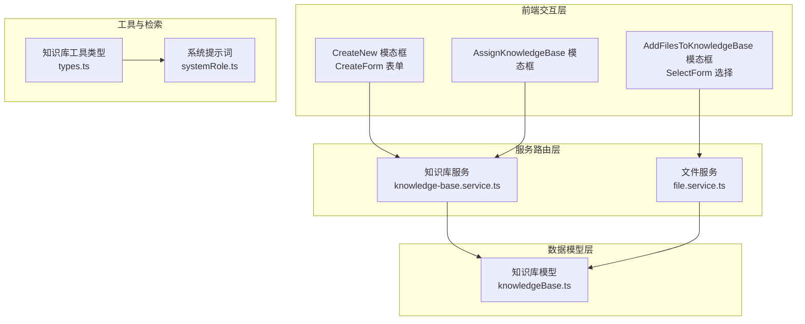
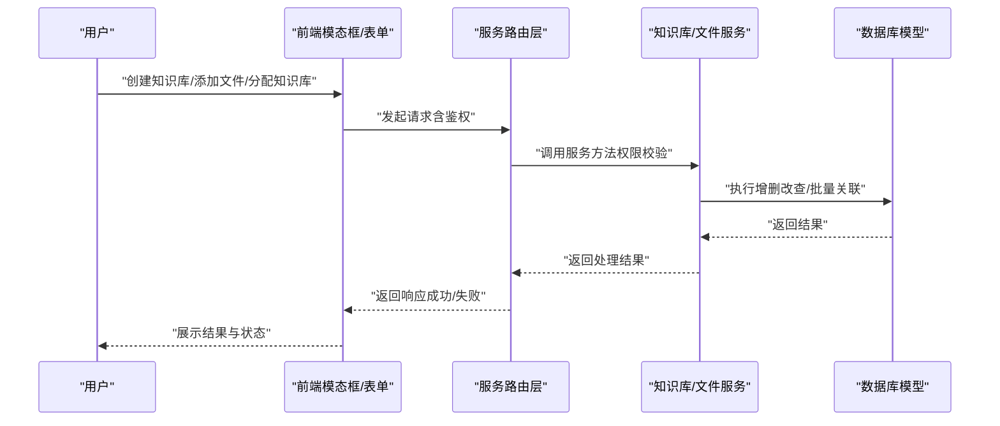
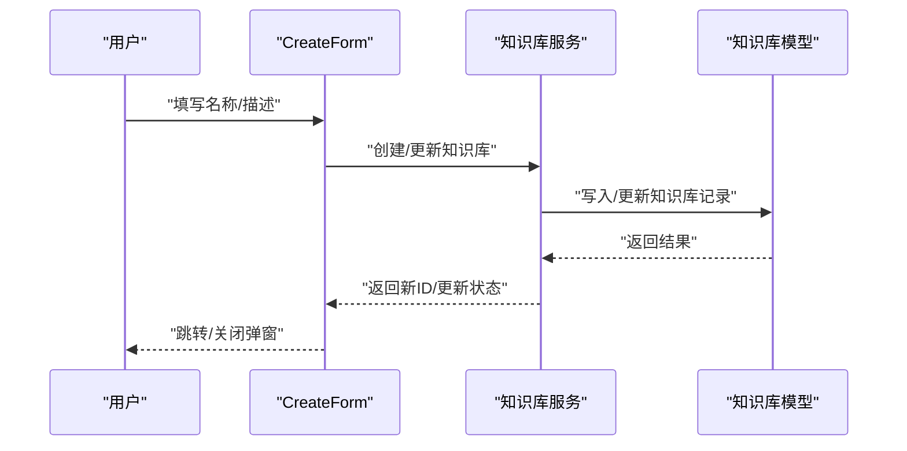
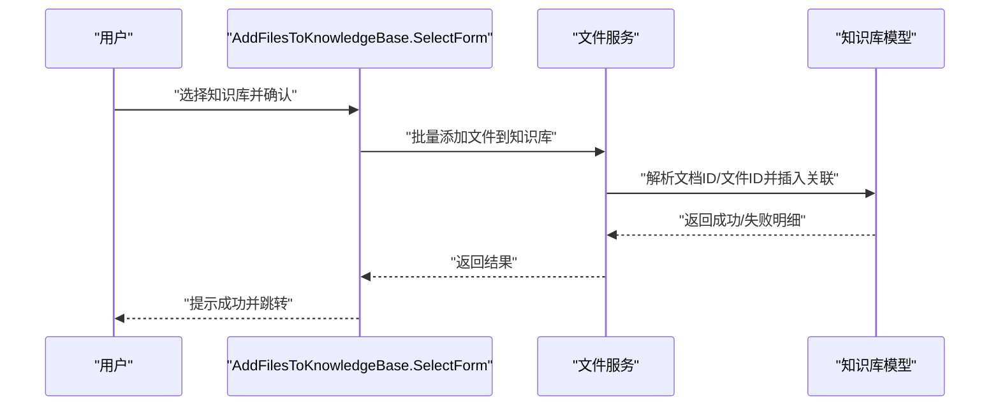
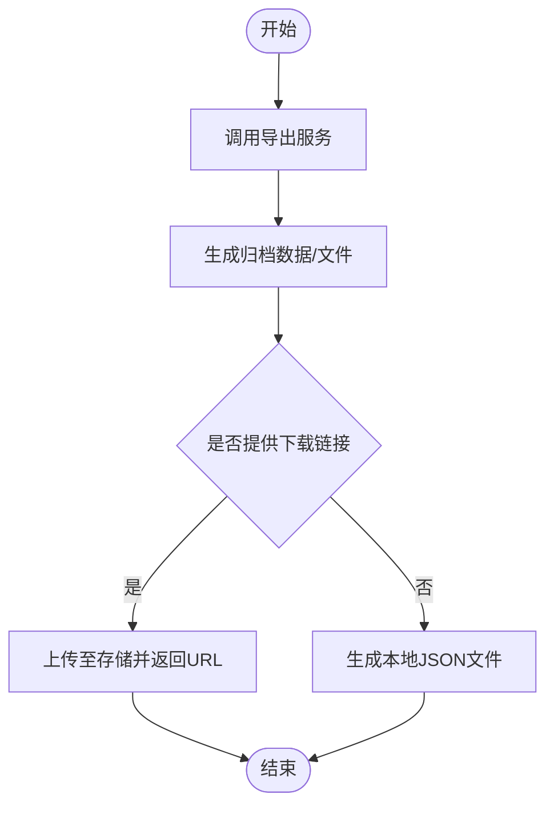
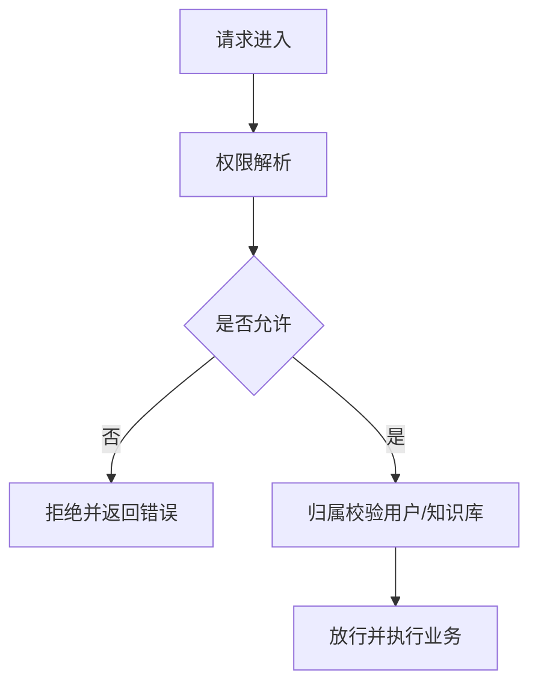
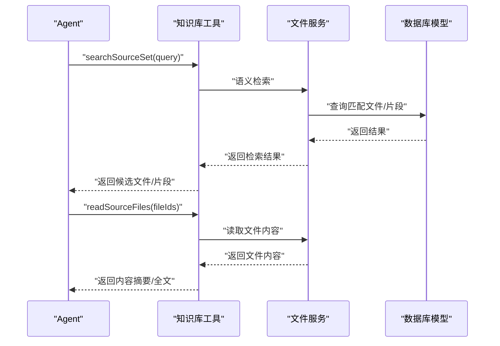
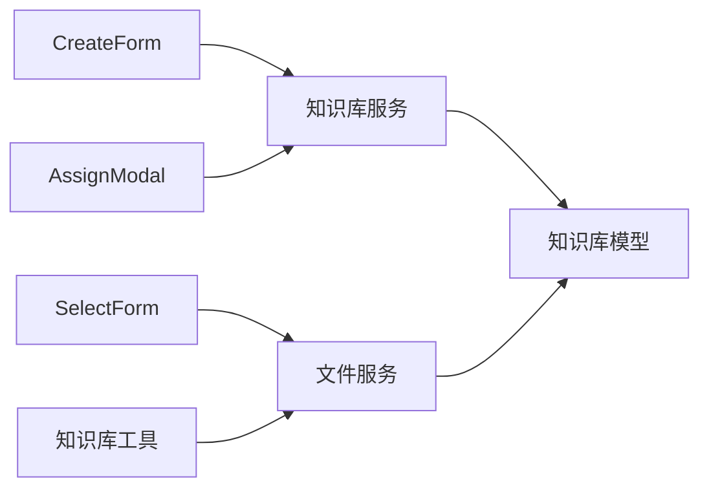

# 知识管理流程

<cite>
**本文引用的文件**
- [packages/openapi/src/services/file.service.ts](file://packages/openapi/src/services/file.service.ts)
- [packages/openapi/src/services/knowledge-base.service.ts](file://packages/openapi/src/services/knowledge-base.service.ts)
- [packages/database/src/models/knowledgeBase.ts](file://packages/database/src/models/knowledgeBase.ts)
- [src/services/knowledgeBase.ts](file://src/services/knowledgeBase.ts)
- [src/features/LibraryModal/CreateNew/index.tsx](file://src/features/LibraryModal/CreateNew/index.tsx)
- [src/features/LibraryModal/CreateNew/CreateForm.tsx](file://src/features/LibraryModal/CreateNew/CreateForm.tsx)
- [src/features/LibraryModal/AddFilesToKnowledgeBase/index.tsx](file://src/features/LibraryModal/AddFilesToKnowledgeBase/index.tsx)
- [src/features/LibraryModal/AddFilesToKnowledgeBase/SelectForm.tsx](file://src/features/LibraryModal/AddFilesToKnowledgeBase/SelectForm.tsx)
- [src/features/LibraryModal/AssignKnowledgeBase/index.tsx](file://src/features/LibraryModal/AssignKnowledgeBase/index.tsx)
- [src/server/routers/lambda/knowledge.ts](file://src/server/routers/lambda/knowledge.ts)
- [packages/builtin-tool-knowledge-base/src/types.ts](file://packages/builtin-tool-knowledge-base/src/types.ts)
- [packages/builtin-tool-knowledge-base/src/systemRole.ts](file://packages/builtin-tool-knowledge-base/src/systemRole.ts)
- [src/services/config.ts](file://src/services/config.ts)
- [packages/agent-runtime/src/audit/globalAudit.ts](file://packages/agent-runtime/src/audit/globalAudit.ts)
</cite>

## 目录

1. [引言](#引言)
2. [项目结构](#项目结构)
3. [核心组件](#核心组件)
4. [架构总览](#架构总览)
5. [详细组件分析](#详细组件分析)
6. [依赖分析](#依赖分析)
7. [性能考虑](#性能考虑)
8. [故障排查指南](#故障排查指南)
9. [结论](#结论)
10. [附录](#附录)

## 引言

本文件面向知识管理全流程，覆盖从 “文档上传” 到 “知识检索” 的完整闭环，包括知识库的创建、配置、管理；文档与文件的添加、分配、删除；导入导出与批量操作；权限与安全；以及最佳实践、审计与性能优化建议。读者无需深入技术背景，亦可通过图示与步骤理解各模块职责与协作方式。

## 项目结构

知识管理相关能力由 “前端交互层 + 服务路由层 + 数据模型层 + 工具与检索能力” 构成：

- 前端交互层：提供知识库创建、文件选择与分配等模态框与表单组件
- 服务路由层：封装知识库与文件的服务接口，负责权限校验、批量操作与状态查询
- 数据模型层：抽象知识库与文件的增删改查、文档镜像与文件映射
- 工具与检索能力：内置 “知识库工具”，提供语义检索与全文阅读能力

图表来源

- [src/features/LibraryModal/CreateNew/index.tsx](file://src/features/LibraryModal/CreateNew/index.tsx#L1-L58)
- [src/features/LibraryModal/CreateNew/CreateForm.tsx](file://src/features/LibraryModal/CreateNew/CreateForm.tsx#L1-L77)
- [src/features/LibraryModal/AddFilesToKnowledgeBase/index.tsx](file://src/features/LibraryModal/AddFilesToKnowledgeBase/index.tsx#L1-L53)
- [src/features/LibraryModal/AddFilesToKnowledgeBase/SelectForm.tsx](file://src/features/LibraryModal/AddFilesToKnowledgeBase/SelectForm.tsx#L1-L102)
- [src/features/LibraryModal/AssignKnowledgeBase/index.tsx](file://src/features/LibraryModal/AssignKnowledgeBase/index.tsx#L1-L40)
- [packages/openapi/src/services/knowledge-base.service.ts](file://packages/openapi/src/services/knowledge-base.service.ts#L1-L130)
- [packages/openapi/src/services/file.service.ts](file://packages/openapi/src/services/file.service.ts#L1-L1557)
- [packages/database/src/models/knowledgeBase.ts](file://packages/database/src/models/knowledgeBase.ts#L1-L162)
- [packages/builtin-tool-knowledge-base/src/types.ts](file://packages/builtin-tool-knowledge-base/src/types.ts#L1-L36)
- [packages/builtin-tool-knowledge-base/src/systemRole.ts](file://packages/builtin-tool-knowledge-base/src/systemRole.ts#L1-L16)

章节来源

- [packages/openapi/src/services/knowledge-base.service.ts](file://packages/openapi/src/services/knowledge-base.service.ts#L1-L130)
- [packages/openapi/src/services/file.service.ts](file://packages/openapi/src/services/file.service.ts#L1-L1557)
- [packages/database/src/models/knowledgeBase.ts](file://packages/database/src/models/knowledgeBase.ts#L1-L162)
- [src/features/LibraryModal/CreateNew/index.tsx](file://src/features/LibraryModal/CreateNew/index.tsx#L1-L58)
- [src/features/LibraryModal/CreateNew/CreateForm.tsx](file://src/features/LibraryModal/CreateNew/CreateForm.tsx#L1-L77)
- [src/features/LibraryModal/AddFilesToKnowledgeBase/index.tsx](file://src/features/LibraryModal/AddFilesToKnowledgeBase/index.tsx#L1-L53)
- [src/features/LibraryModal/AddFilesToKnowledgeBase/SelectForm.tsx](file://src/features/LibraryModal/AddFilesToKnowledgeBase/SelectForm.tsx#L1-L102)
- [src/features/LibraryModal/AssignKnowledgeBase/index.tsx](file://src/features/LibraryModal/AssignKnowledgeBase/index.tsx#L1-L40)
- [packages/builtin-tool-knowledge-base/src/types.ts](file://packages/builtin-tool-knowledge-base/src/types.ts#L1-L36)
- [packages/builtin-tool-knowledge-base/src/systemRole.ts](file://packages/builtin-tool-knowledge-base/src/systemRole.ts#L1-L16)

## 核心组件

- 知识库服务：提供知识库的创建、查询、详情、更新、删除等能力，并进行权限校验
- 文件服务：提供文件上传、批量上传、文件列表、文件详情、解析、分块与嵌入任务状态查询、批量关联 / 移除知识库、跨知识库移动等能力
- 知识库模型：封装知识库与文件的关联关系，支持文档 ID 与文件 ID 的混合解析与更新
- 前端模态框与表单：提供知识库创建 / 编辑、文件批量添加至知识库、知识库分配等交互
- 知识库工具：提供语义检索与全文阅读的工具类型与系统提示词

章节来源

- [packages/openapi/src/services/knowledge-base.service.ts](file://packages/openapi/src/services/knowledge-base.service.ts#L1-L130)
- [packages/openapi/src/services/file.service.ts](file://packages/openapi/src/services/file.service.ts#L1-L1557)
- [packages/database/src/models/knowledgeBase.ts](file://packages/database/src/models/knowledgeBase.ts#L1-L162)
- [src/features/LibraryModal/CreateNew/CreateForm.tsx](file://src/features/LibraryModal/CreateNew/CreateForm.tsx#L1-L77)
- [src/features/LibraryModal/AddFilesToKnowledgeBase/SelectForm.tsx](file://src/features/LibraryModal/AddFilesToKnowledgeBase/SelectForm.tsx#L1-L102)
- [packages/builtin-tool-knowledge-base/src/types.ts](file://packages/builtin-tool-knowledge-base/src/types.ts#L1-L36)

## 架构总览

下图展示从 “用户操作” 到 “服务处理” 再到 “数据持久化” 的整体流程，涵盖权限校验、批量操作与状态反馈。

图表来源

- [src/features/LibraryModal/CreateNew/CreateForm.tsx](file://src/features/LibraryModal/CreateNew/CreateForm.tsx#L1-L77)
- [src/features/LibraryModal/AddFilesToKnowledgeBase/SelectForm.tsx](file://src/features/LibraryModal/AddFilesToKnowledgeBase/SelectForm.tsx#L1-L102)
- [packages/openapi/src/services/knowledge-base.service.ts](file://packages/openapi/src/services/knowledge-base.service.ts#L1-L130)
- [packages/openapi/src/services/file.service.ts](file://packages/openapi/src/services/file.service.ts#L1-L1557)
- [packages/database/src/models/knowledgeBase.ts](file://packages/database/src/models/knowledgeBase.ts#L1-L162)

## 详细组件分析

### 知识库创建与管理

- 创建 / 编辑：通过模态框打开创建表单，提交后调用知识库服务创建或更新
- 列表与详情：服务层进行权限校验，返回当前用户的知识库列表与详情
- 删除：按用户维度删除知识库

图表来源

- [src/features/LibraryModal/CreateNew/CreateForm.tsx](file://src/features/LibraryModal/CreateNew/CreateForm.tsx#L1-L77)
- [packages/openapi/src/services/knowledge-base.service.ts](file://packages/openapi/src/services/knowledge-base.service.ts#L1-L130)
- [packages/database/src/models/knowledgeBase.ts](file://packages/database/src/models/knowledgeBase.ts#L1-L162)

章节来源

- [src/features/LibraryModal/CreateNew/index.tsx](file://src/features/LibraryModal/CreateNew/index.tsx#L1-L58)
- [src/features/LibraryModal/CreateNew/CreateForm.tsx](file://src/features/LibraryModal/CreateNew/CreateForm.tsx#L1-L77)
- [packages/openapi/src/services/knowledge-base.service.ts](file://packages/openapi/src/services/knowledge-base.service.ts#L1-L130)
- [packages/database/src/models/knowledgeBase.ts](file://packages/database/src/models/knowledgeBase.ts#L1-L162)

### 文档与文件的添加、分配与删除

- 添加文件到知识库：选择多个文件 ID，提交后服务层校验权限与归属，批量建立关联
- 分配知识库：在聊天等场景中，将当前会话 / 资源与知识库进行绑定
- 删除文件：支持删除文件并清理关联记录

图表来源

- [src/features/LibraryModal/AddFilesToKnowledgeBase/SelectForm.tsx](file://src/features/LibraryModal/AddFilesToKnowledgeBase/SelectForm.tsx#L1-L102)
- [packages/openapi/src/services/file.service.ts](file://packages/openapi/src/services/file.service.ts#L383-L474)
- [packages/database/src/models/knowledgeBase.ts](file://packages/database/src/models/knowledgeBase.ts#L28-L122)

章节来源

- [src/features/LibraryModal/AddFilesToKnowledgeBase/index.tsx](file://src/features/LibraryModal/AddFilesToKnowledgeBase/index.tsx#L1-L53)
- [src/features/LibraryModal/AddFilesToKnowledgeBase/SelectForm.tsx](file://src/features/LibraryModal/AddFilesToKnowledgeBase/SelectForm.tsx#L1-L102)
- [packages/openapi/src/services/file.service.ts](file://packages/openapi/src/services/file.service.ts#L383-L474)
- [packages/database/src/models/knowledgeBase.ts](file://packages/database/src/models/knowledgeBase.ts#L28-L122)

### 知识库的导入导出与批量操作

- 导出：提供统一导出入口，生成可下载的归档文件
- 批量操作：文件服务支持批量上传、批量关联 / 移除、跨知识库移动等

图表来源

- [src/services/config.ts](file://src/services/config.ts#L1-L27)
- [packages/openapi/src/services/file.service.ts](file://packages/openapi/src/services/file.service.ts#L144-L190)
- [packages/openapi/src/services/file.service.ts](file://packages/openapi/src/services/file.service.ts#L383-L474)

章节来源

- [src/services/config.ts](file://src/services/config.ts#L1-L27)
- [packages/openapi/src/services/file.service.ts](file://packages/openapi/src/services/file.service.ts#L144-L190)
- [packages/openapi/src/services/file.service.ts](file://packages/openapi/src/services/file.service.ts#L383-L474)

### 权限管理与安全

- 权限校验：服务层在每个关键操作前进行权限解析，确保仅能访问自身或授权范围内的资源
- 归属校验：知识库与文件均需满足 “当前用户” 归属要求
- 安全审计：提供全局审计配置入口，便于接入黑名单等安全策略

图表来源

- [packages/openapi/src/services/knowledge-base.service.ts](file://packages/openapi/src/services/knowledge-base.service.ts#L37-L99)
- [packages/openapi/src/services/file.service.ts](file://packages/openapi/src/services/file.service.ts#L119-L139)
- [packages/agent-runtime/src/audit/globalAudit.ts](file://packages/agent-runtime/src/audit/globalAudit.ts#L1-L7)

章节来源

- [packages/openapi/src/services/knowledge-base.service.ts](file://packages/openapi/src/services/knowledge-base.service.ts#L37-L99)
- [packages/openapi/src/services/file.service.ts](file://packages/openapi/src/services/file.service.ts#L119-L139)
- [packages/agent-runtime/src/audit/globalAudit.ts](file://packages/agent-runtime/src/audit/globalAudit.ts#L1-L7)

### 知识检索与工具集成

- 工具类型：定义 “搜索知识库” 和 “读取知识” 两个 API 名称与参数结构
- 系统提示词：指导 Agent 按 “理解需求 — 形成查询 — 检索 — 阅读 — 合成回答” 的流程使用工具

图表来源

- [packages/builtin-tool-knowledge-base/src/types.ts](file://packages/builtin-tool-knowledge-base/src/types.ts#L1-L36)
- [packages/builtin-tool-knowledge-base/src/systemRole.ts](file://packages/builtin-tool-knowledge-base/src/systemRole.ts#L1-L16)
- [packages/openapi/src/services/file.service.ts](file://packages/openapi/src/services/file.service.ts#L787-L894)

章节来源

- [packages/builtin-tool-knowledge-base/src/types.ts](file://packages/builtin-tool-knowledge-base/src/types.ts#L1-L36)
- [packages/builtin-tool-knowledge-base/src/systemRole.ts](file://packages/builtin-tool-knowledge-base/src/systemRole.ts#L1-L16)
- [packages/openapi/src/services/file.service.ts](file://packages/openapi/src/services/file.service.ts#L787-L894)

## 依赖分析

- 前端模态框依赖知识库服务与文件服务，实现 “创建 / 编辑 / 添加 / 分配”
- 服务层依赖数据库模型，实现 “权限校验 + 数据持久化”
- 工具层依赖服务层提供的检索与阅读能力

图表来源

- [src/features/LibraryModal/CreateNew/CreateForm.tsx](file://src/features/LibraryModal/CreateNew/CreateForm.tsx#L1-L77)
- [src/features/LibraryModal/AddFilesToKnowledgeBase/SelectForm.tsx](file://src/features/LibraryModal/AddFilesToKnowledgeBase/SelectForm.tsx#L1-L102)
- [src/features/LibraryModal/AssignKnowledgeBase/index.tsx](file://src/features/LibraryModal/AssignKnowledgeBase/index.tsx#L1-L40)
- [packages/openapi/src/services/knowledge-base.service.ts](file://packages/openapi/src/services/knowledge-base.service.ts#L1-L130)
- [packages/openapi/src/services/file.service.ts](file://packages/openapi/src/services/file.service.ts#L1-L1557)
- [packages/database/src/models/knowledgeBase.ts](file://packages/database/src/models/knowledgeBase.ts#L1-L162)
- [packages/builtin-tool-knowledge-base/src/types.ts](file://packages/builtin-tool-knowledge-base/src/types.ts#L1-L36)

章节来源

- [src/features/LibraryModal/CreateNew/CreateForm.tsx](file://src/features/LibraryModal/CreateNew/CreateForm.tsx#L1-L77)
- [src/features/LibraryModal/AddFilesToKnowledgeBase/SelectForm.tsx](file://src/features/LibraryModal/AddFilesToKnowledgeBase/SelectForm.tsx#L1-L102)
- [src/features/LibraryModal/AssignKnowledgeBase/index.tsx](file://src/features/LibraryModal/AssignKnowledgeBase/index.tsx#L1-L40)
- [packages/openapi/src/services/knowledge-base.service.ts](file://packages/openapi/src/services/knowledge-base.service.ts#L1-L130)
- [packages/openapi/src/services/file.service.ts](file://packages/openapi/src/services/file.service.ts#L1-L1557)
- [packages/database/src/models/knowledgeBase.ts](file://packages/database/src/models/knowledgeBase.ts#L1-L162)
- [packages/builtin-tool-knowledge-base/src/types.ts](file://packages/builtin-tool-knowledge-base/src/types.ts#L1-L36)

## 性能考虑

- 批量操作：文件服务支持批量上传、批量关联 / 移除，减少多次往返
- 去重与缓存：上传时基于哈希去重，避免重复解析与存储
- 分块与嵌入：按需触发分块与嵌入任务，降低即时计算压力
- 查询优化：分页与聚合统计分离，避免一次性加载过多数据
- 存储与网络：使用预签名 URL 与对象存储，提升大文件访问效率

章节来源

- [packages/openapi/src/services/file.service.ts](file://packages/openapi/src/services/file.service.ts#L144-L190)
- [packages/openapi/src/services/file.service.ts](file://packages/openapi/src/services/file.service.ts#L649-L785)
- [packages/openapi/src/services/file.service.ts](file://packages/openapi/src/services/file.service.ts#L899-L946)
- [packages/openapi/src/services/file.service.ts](file://packages/openapi/src/services/file.service.ts#L198-L334)

## 故障排查指南

- 权限不足：确认当前用户是否具备相应权限（如知识库读取 / 更新、文件上传 / 读取）
- 知识库不存在或无权访问：检查知识库 ID 与归属关系
- 文件不存在或无权访问：检查文件 ID 与用户归属
- 批量操作失败：查看失败明细，逐项排查文件归属与权限
- 导出 / 导入异常：参考迁移文档中的常见问题与解决步骤

章节来源

- [packages/openapi/src/services/file.service.ts](file://packages/openapi/src/services/file.service.ts#L119-L139)
- [packages/openapi/src/services/file.service.ts](file://packages/openapi/src/services/file.service.ts#L383-L474)
- [packages/openapi/src/services/file.service.ts](file://packages/openapi/src/services/file.service.ts#L144-L190)

## 结论

本知识管理流程以 “权限可控、批量高效、可追溯” 为核心设计原则，从前端交互到服务路由再到数据模型形成闭环。通过工具与检索能力的集成，实现从 “文档上传” 到 “知识检索” 的完整链路。建议在实际部署中结合容量规划与性能优化策略，持续完善权限与审计体系。

## 附录

### 最佳实践指南

- 文档命名规范：建议使用语义化前缀 + 日期 + 版本号，便于检索与版本追踪
- 分类策略：按项目 / 产品 / 主题划分知识库，避免单库过大
- 标签使用：为文件打上高价值标签，提升检索命中率
- 定期清理：定期移除过期 / 重复文件，保持知识库整洁
- 权限最小化：仅授予必要权限，避免越权访问

### 审计日志与变更追踪

- 服务层在关键操作前后记录日志，便于回溯
- 全局审计配置可接入黑名单等安全策略，强化合规

章节来源

- [packages/openapi/src/services/file.service.ts](file://packages/openapi/src/services/file.service.ts#L358-L381)
- [packages/agent-runtime/src/audit/globalAudit.ts](file://packages/agent-runtime/src/audit/globalAudit.ts#L1-L7)
