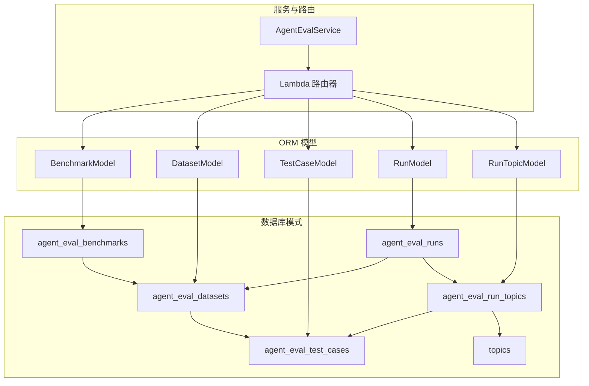
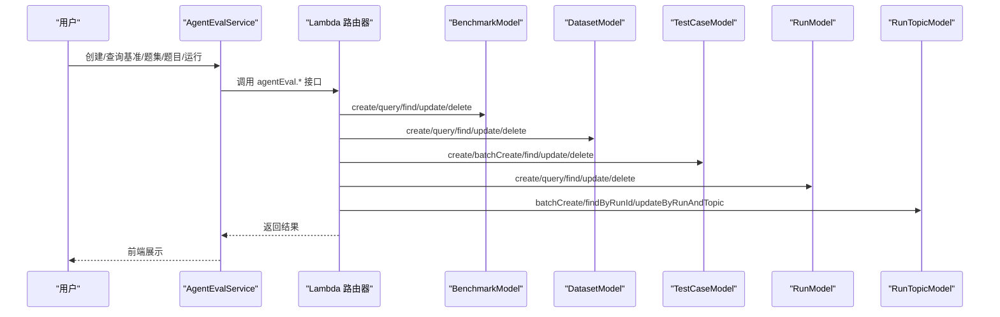
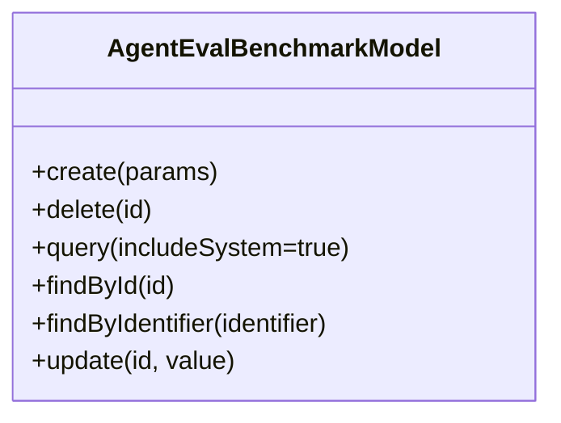
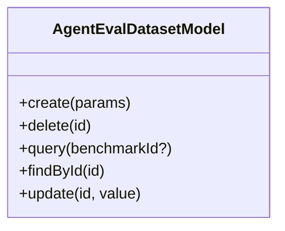
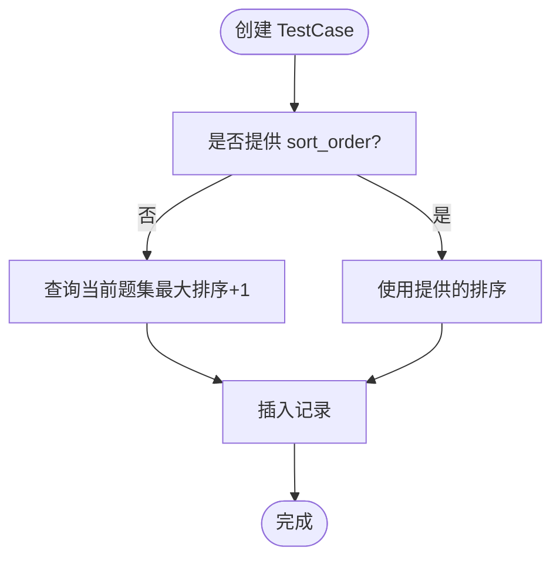
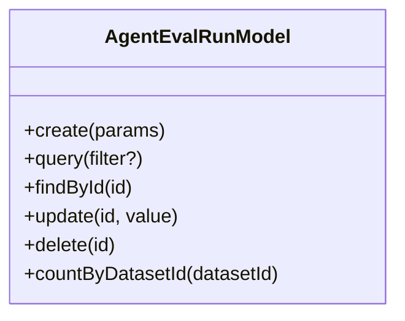
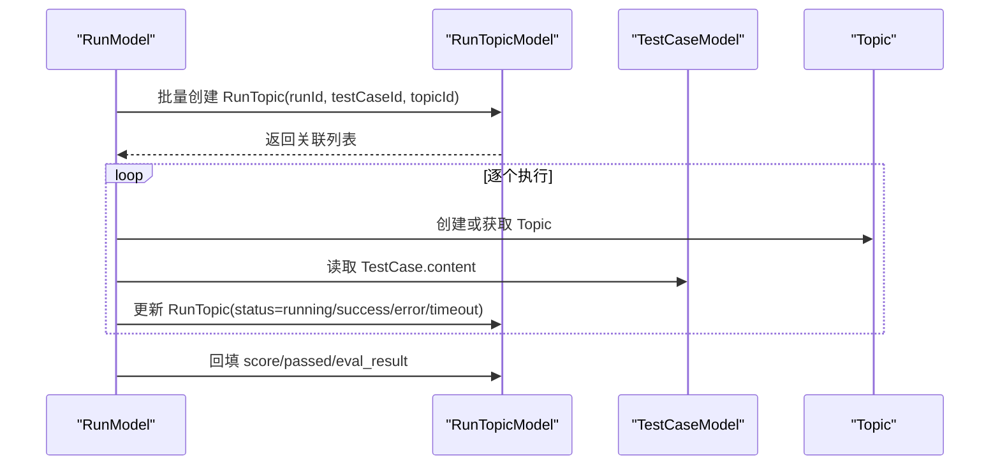
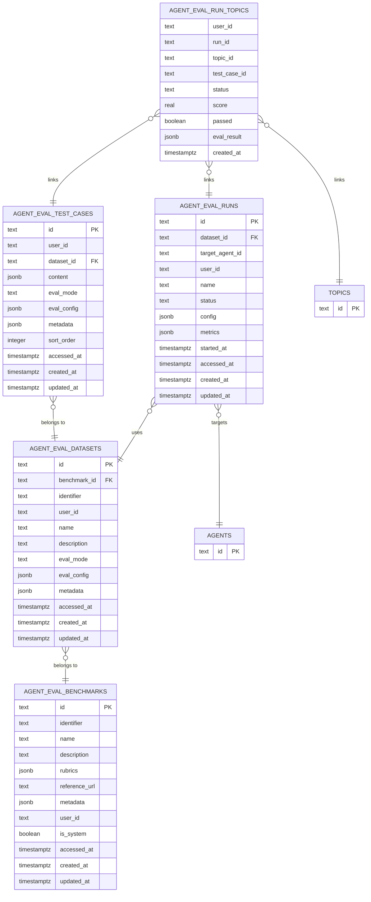

# Agent 评估模型

<cite>
**本文引用的文件**
- [database-schema.dbml](file://docs/development/database-schema.dbml)
- [benchmark.ts](file://packages/database/src/models/agentEval/benchmark.ts)
- [dataset.ts](file://packages/database/src/models/agentEval/dataset.ts)
- [testCase.ts](file://packages/database/src/models/agentEval/testCase.ts)
- [run.ts](file://packages/database/src/models/agentEval/run.ts)
- [runTopic.ts](file://packages/database/src/models/agentEval/runTopic.ts)
- [agentEval.ts](file://src/services/agentEval.ts)
- [agentEval.ts](file://src/server/routers/lambda/agentEval.ts)
- [agentEval.integration.test.ts](file://src/server/routers/lambda/__tests__/integration/agentEval.integration.test.ts)
- [_setup.ts](file://src/server/services/agentEvalRun/__tests__/_setup.ts)
</cite>

## 目录
1. [引言](#引言)
2. [项目结构](#项目结构)
3. [核心组件](#核心组件)
4. [架构总览](#架构总览)
5. [详细组件分析](#详细组件分析)
6. [依赖分析](#依赖分析)
7. [性能考虑](#性能考虑)
8. [故障排查指南](#故障排查指南)
9. [结论](#结论)

## 引言
本文件面向 Agent 评估系统，聚焦于评估基准（Benchmark）、评测题集（Dataset）、评测题目（TestCase）、评测运行（Run）以及运行与 Topic 的关联（RunTopic）五大核心数据模型，系统性梳理其字段设计、关系约束、索引策略与典型业务流程，帮助开发者与产品人员快速理解并高效使用该评估体系。

## 项目结构
评估相关的核心数据模型位于数据库模式文件中，配套的 ORM 模型封装在 packages/database 的 agentEval 目录下；服务层通过 src/services/agentEval.ts 提供前端调用接口，后端路由在 src/server/routers/lambda/agentEval.ts 中注入模型实例，集成测试覆盖了典型场景。

图表来源
- [database-schema.dbml](file://docs/development/database-schema.dbml#L125-L227)
- [benchmark.ts](file://packages/database/src/models/agentEval/benchmark.ts#L12-L192)
- [dataset.ts](file://packages/database/src/models/agentEval/dataset.ts#L6-L108)
- [testCase.ts](file://packages/database/src/models/agentEval/testCase.ts#L6-L116)
- [run.ts](file://packages/database/src/models/agentEval/run.ts#L6-L117)
- [runTopic.ts](file://packages/database/src/models/agentEval/runTopic.ts#L13-L214)
- [agentEval.ts](file://src/services/agentEval.ts#L1-L152)
- [agentEval.ts](file://src/server/routers/lambda/agentEval.ts#L48-L62)

章节来源
- [database-schema.dbml](file://docs/development/database-schema.dbml#L125-L227)
- [benchmark.ts](file://packages/database/src/models/agentEval/benchmark.ts#L12-L192)
- [dataset.ts](file://packages/database/src/models/agentEval/dataset.ts#L6-L108)
- [testCase.ts](file://packages/database/src/models/agentEval/testCase.ts#L6-L116)
- [run.ts](file://packages/database/src/models/agentEval/run.ts#L6-L117)
- [runTopic.ts](file://packages/database/src/models/agentEval/runTopic.ts#L13-L214)
- [agentEval.ts](file://src/services/agentEval.ts#L1-L152)
- [agentEval.ts](file://src/server/routers/lambda/agentEval.ts#L48-L62)

## 核心组件
- 评估基准（Benchmark）
  - 唯一标识与归属：identifier + user_id 唯一；is_system 标识系统内置；user_id 可空表示全局可见。
  - 关键字段：标识符、名称、描述、评分标准（rubrics）、参考链接、元数据、访问/更新时间。
  - 计数聚合：按基准统计 datasets/test_cases/runs 数量，便于概览。
- 评测题集（Dataset）
  - 关联基准：benchmark_id 外键；支持用户自有与系统共享。
  - 配置参数：评估模式（eval_mode）、评估配置（eval_config）、元数据。
  - 统计：按 dataset 聚合 test_cases 数量。
- 评测题目（TestCase）
  - 关联题集：dataset_id 外键；排序字段 sort_order。
  - 内容结构：content（包含输入、期望输出、可选类别/选项等），评估模式/配置/元数据。
- 评测运行（Run）
  - 关联题集：dataset_id 外键；目标被测 Agent：target_agent_id。
  - 状态管理：status（idle/pending/running/completed/failed/aborted/external）；索引优化查询。
  - 配置与指标：config（并发、超时等）、metrics（总数、通过数、失败数、平均分、通过率）。
- 运行-题集-话题关联（RunTopic）
  - 关联三元组：run_id、test_case_id、topic_id；复合主键（run_id, topic_id）。
  - 结果字段：status、score、passed、eval_result；用于记录每次测试的执行状态与评分。

章节来源
- [database-schema.dbml](file://docs/development/database-schema.dbml#L125-L227)
- [benchmark.ts](file://packages/database/src/models/agentEval/benchmark.ts#L51-L138)
- [dataset.ts](file://packages/database/src/models/agentEval/dataset.ts#L39-L68)
- [testCase.ts](file://packages/database/src/models/agentEval/testCase.ts#L15-L32)
- [run.ts](file://packages/database/src/models/agentEval/run.ts#L29-L71)
- [runTopic.ts](file://packages/database/src/models/agentEval/runTopic.ts#L34-L55)

## 架构总览
评估数据流从“基准—题集—题目—运行—结果”展开，RunTopic 将一次运行中的每个 TestCase 与一个 Topic（会话）绑定，形成可追溯的评估闭环。

图表来源
- [agentEval.ts](file://src/services/agentEval.ts#L1-L152)
- [agentEval.ts](file://src/server/routers/lambda/agentEval.ts#L48-L62)
- [benchmark.ts](file://packages/database/src/models/agentEval/benchmark.ts#L24-L190)
- [dataset.ts](file://packages/database/src/models/agentEval/dataset.ts#L18-L106)
- [testCase.ts](file://packages/database/src/models/agentEval/testCase.ts#L18-L114)
- [run.ts](file://packages/database/src/models/agentEval/run.ts#L18-L104)
- [runTopic.ts](file://packages/database/src/models/agentEval/runTopic.ts#L25-L212)

## 详细组件分析

### 评估基准（Benchmark）模型
- 设计要点
  - 支持系统内置与用户自建两类，通过 is_system 与 user_id 控制可见性与可编辑范围。
  - 提供聚合统计：datasets/test_cases/runs 数量，便于仪表盘与导航。
  - 查询支持 includeSystem 参数，控制是否包含系统基准。
- 关键方法
  - create / update / delete：受用户权限与 is_system 限制。
  - query：带子查询统计数量并附带最近运行列表。
  - findById / findByIdentifier：按 id 或 identifier 查询，支持系统级可见。
- 典型使用
  - 列表页聚合展示、详情页附带最近运行与统计。

图表来源
- [benchmark.ts](file://packages/database/src/models/agentEval/benchmark.ts#L12-L192)

章节来源
- [benchmark.ts](file://packages/database/src/models/agentEval/benchmark.ts#L24-L190)
- [database-schema.dbml](file://docs/development/database-schema.dbml#L125-L145)

### 评测题集（Dataset）模型
- 设计要点
  - 关联基准，支持用户自有与系统共享；提供 eval_mode、eval_config、metadata 等扩展字段。
  - 查询时按 dataset 聚合 test_cases 数量，便于筛选与排序。
- 关键方法
  - create / update / delete：仅允许用户自有题集。
  - query：支持按 benchmarkId 过滤。
  - findById：返回 dataset 并附带有序 testCases。
- 典型使用
  - 题集详情页加载题目列表，按 sort_order 排序。

图表来源
- [dataset.ts](file://packages/database/src/models/agentEval/dataset.ts#L6-L108)

章节来源
- [dataset.ts](file://packages/database/src/models/agentEval/dataset.ts#L18-L106)
- [database-schema.dbml](file://docs/development/database-schema.dbml#L147-L166)

### 评测题目（TestCase）模型
- 设计要点
  - 自动填充排序字段：未指定 sort_order 时基于同题集最大值+1生成。
  - 支持批量创建，便于导入题库。
  - 分页查询与计数，便于题集管理界面。
- 关键方法
  - create：自动补全排序；返回新记录。
  - batchCreate：批量插入。
  - findByDatasetId：带分页与排序。
  - countByDatasetId：统计数量。
  - update / delete：按用户维度保护。
- 典型使用
  - 导入题库时批量写入；题集编辑页分页浏览。

图表来源
- [testCase.ts](file://packages/database/src/models/agentEval/testCase.ts#L18-L32)

章节来源
- [testCase.ts](file://packages/database/src/models/agentEval/testCase.ts#L18-L114)
- [database-schema.dbml](file://docs/development/database-schema.dbml#L209-L227)

### 评测运行（Run）模型
- 设计要点
  - 默认状态 idle；支持按 datasetId、benchmarkId、status 过滤。
  - config 存放并发与超时等运行参数；metrics 存放统计指标。
- 关键方法
  - create：默认字段与用户归属。
  - query：动态拼接过滤条件与分页。
  - findById / update / delete：按用户维度保护。
  - countByDatasetId：统计题集下的运行次数。
- 典型使用
  - 启动评估任务时创建 Run；查询运行历史与状态。

图表来源
- [run.ts](file://packages/database/src/models/agentEval/run.ts#L6-L117)

章节来源
- [run.ts](file://packages/database/src/models/agentEval/run.ts#L18-L104)
- [database-schema.dbml](file://docs/development/database-schema.dbml#L187-L207)

### 运行-题集-话题关联（RunTopic）模型
- 设计要点
  - 复合主键（run_id, topic_id）确保同一运行下每个话题仅一条关联。
  - 支持批量创建、按 run 查询、按 run+testCase 查询、按 run+topic 更新。
  - 提供批量标记超时/错误并删除异常记录的能力，保障运行一致性。
- 关键方法
  - batchCreate：批量写入。
  - findByRunId：返回关联的 TestCase 与 Topic 明细。
  - findByTestCaseId：反向查询使用某题目的所有运行。
  - findByRunAndTestCase：按复合键查询单条。
  - batchMarkTimeout / batchMarkAborted：批量状态修正。
  - updateByRunAndTopic：按 run+topic 更新结果字段。
- 典型使用
  - 评估执行过程中为每个 TestCase 创建 Topic 并写入 RunTopic；完成后回填 score/passed/status/eval_result。

图表来源
- [runTopic.ts](file://packages/database/src/models/agentEval/runTopic.ts#L25-L212)
- [run.ts](file://packages/database/src/models/agentEval/run.ts#L18-L24)
- [testCase.ts](file://packages/database/src/models/agentEval/testCase.ts#L54-L61)

章节来源
- [runTopic.ts](file://packages/database/src/models/agentEval/runTopic.ts#L25-L212)
- [database-schema.dbml](file://docs/development/database-schema.dbml#L168-L185)

## 依赖分析
- 表间关系
  - agent_eval_datasets.benchmark_id → agent_eval_benchmarks.id
  - agent_eval_runs.dataset_id → agent_eval_datasets.id
  - agent_eval_runs.target_agent_id → agents.id
  - agent_eval_run_topics.run_id → agent_eval_runs.id
  - agent_eval_run_topics.test_case_id → agent_eval_test_cases.id
  - agent_eval_run_topics.topic_id → topics.id
- 索引与约束
  - 基准：identifier+user_id 唯一；is_system、user_id 索引。
  - 题集：benchmark_id、user_id 索引；identifier+user_id 唯一。
  - 运行：dataset_id、user_id、status、target_agent_id 索引。
  - 题目：dataset_id、sort_order 索引；user_id 索引。
  - 运行-题集-话题：run_id+topic_id 主键；run_id、test_case_id、user_id 索引。

图表来源
- [database-schema.dbml](file://docs/development/database-schema.dbml#L125-L227)
- [database-schema.dbml](file://docs/development/database-schema.dbml#L1691-L1700)
- [database-schema.dbml](file://docs/development/database-schema.dbml#L1702-L1704)

章节来源
- [database-schema.dbml](file://docs/development/database-schema.dbml#L125-L227)
- [database-schema.dbml](file://docs/development/database-schema.dbml#L1691-L1700)

## 性能考虑
- 索引策略
  - 基准：按 is_system 与 user_id 索引，加速查询与权限过滤。
  - 题集：按 benchmark_id 与 user_id 索引，支持题集列表与跨基准统计。
  - 运行：按 dataset_id、status、user_id、target_agent_id 索引，满足多维过滤与高频查询。
  - 题目：按 dataset_id 与 sort_order 索引，保证题集内顺序稳定与高效分页。
  - 运行-题集-话题：复合主键与 run_id、test_case_id、user_id 索引，支撑高并发写入与查询。
- 聚合与连接
  - 基准列表页使用子查询聚合 datasets/test_cases/runs 数量，避免多次扫描。
  - 题集详情页通过 left join 获取 testCases 并按 sort_order 排序，减少应用层处理。
- 批处理
  - TestCase 批量创建与 RunTopic 批量创建，降低网络往返与事务开销。
- 状态清理
  - 提供批量标记超时/错误并删除异常记录的方法，避免脏数据堆积影响查询性能。

## 故障排查指南
- 常见问题
  - 权限不足：删除/更新基准/题集/运行需满足 is_system 与 user_id 条件。
  - 数据不一致：RunTopic 状态异常（error/timeout）可通过批量清理与重试修复。
  - 排序错乱：TestCase 未显式提供 sort_order 时会自动续接最大值，检查是否重复插入导致跳号。
- 定位手段
  - 使用 findByRunId 查看 RunTopic 的状态与 eval_result，确认评估阶段与错误信息。
  - 使用 findByTestCaseId 查看某题目在不同运行中的表现，定位波动原因。
  - 使用 batchMarkTimeout/batchMarkAborted 对长时间 pending/running 的记录进行兜底处理。
- 测试验证
  - 集成测试覆盖了题集导入、运行创建与 RunTopic 关联等关键路径，可作为回归参考。

章节来源
- [runTopic.ts](file://packages/database/src/models/agentEval/runTopic.ts#L133-L161)
- [runTopic.ts](file://packages/database/src/models/agentEval/runTopic.ts#L179-L190)
- [agentEval.integration.test.ts](file://src/server/routers/lambda/__tests__/integration/agentEval.integration.test.ts#L481-L507)
- [_setup.ts](file://src/server/services/agentEvalRun/__tests__/_setup.ts#L120-L198)

## 结论
本评估数据模型以“基准—题集—题目—运行—结果”为主线，通过 RunTopic 将每次评估的 TestCase 与 Topic 绑定，形成可追踪、可统计、可复现的闭环。配合完善的索引与聚合查询，既能满足日常运营的高效检索，也能支撑大规模并发评估任务的稳定性与可观测性。建议在实际使用中遵循用户维度隔离、自动排序与批处理优先的原则，结合状态清理机制，持续保持数据健康。