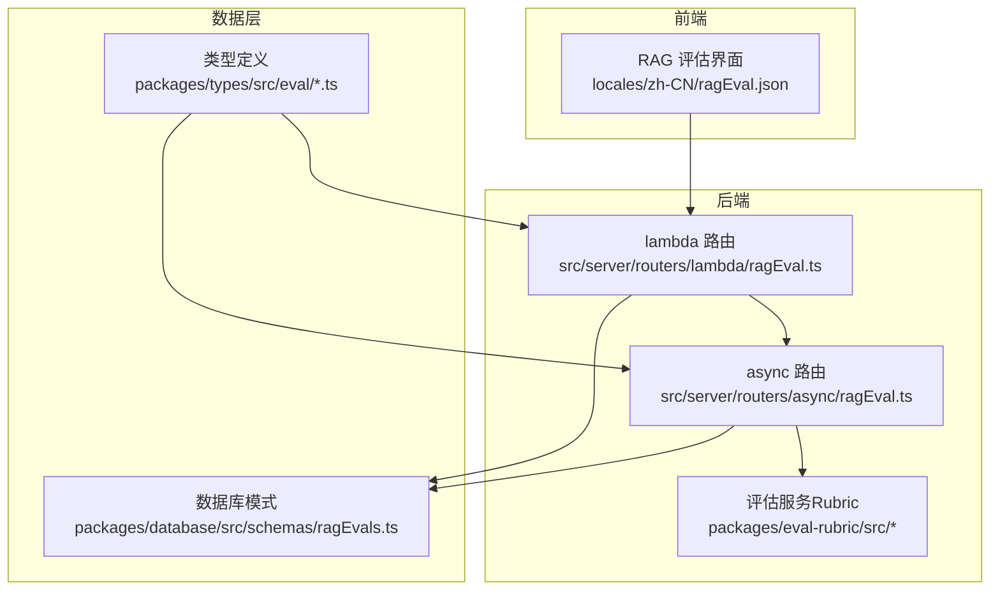
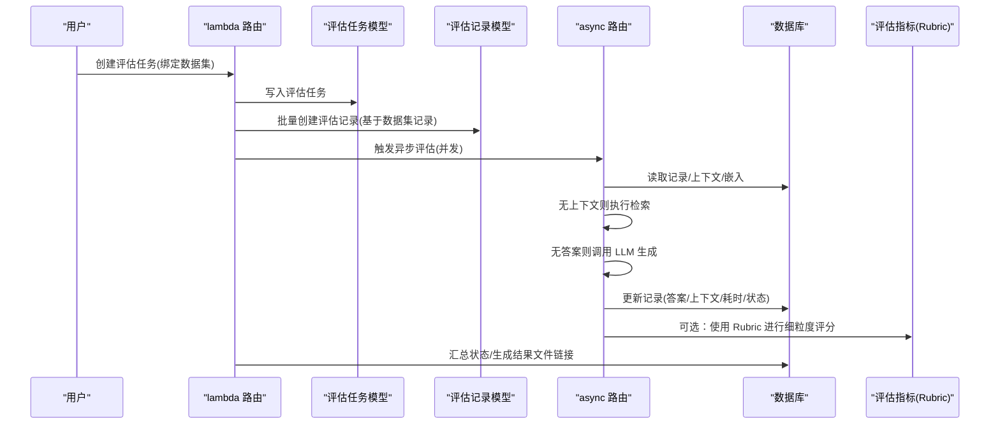
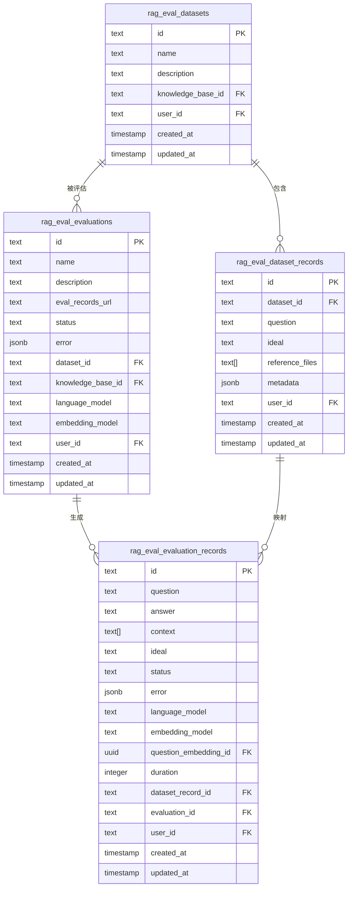
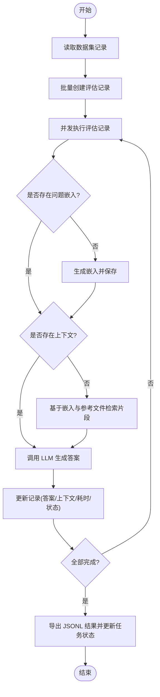
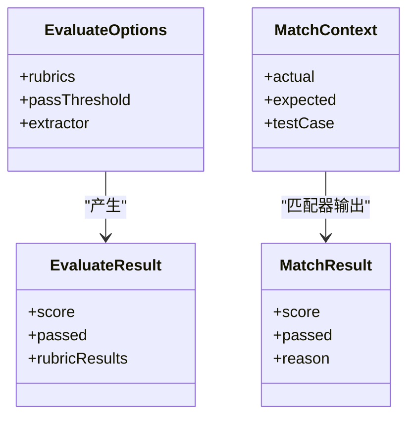
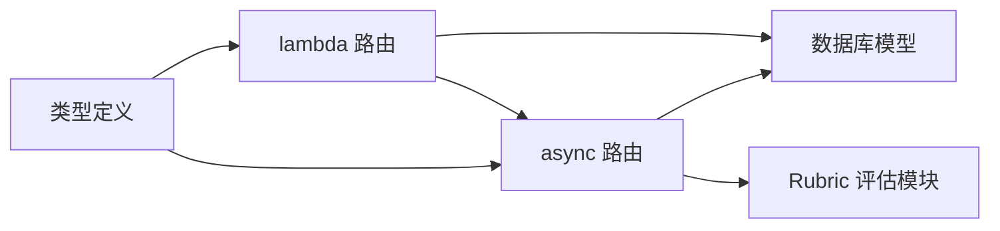

# RAG 评估模型

<cite>
**本文引用的文件**
- [packages/types/src/eval/ragas.ts](file://packages/types/src/eval/ragas.ts)
- [packages/types/src/eval/evaluation.ts](file://packages/types/src/eval/evaluation.ts)
- [packages/database/src/schemas/ragEvals.ts](file://packages/database/src/schemas/ragEvals.ts)
- [src/server/routers/lambda/ragEval.ts](file://src/server/routers/lambda/ragEval.ts)
- [src/server/routers/async/ragEval.ts](file://src/server/routers/async/ragEval.ts)
- [packages/eval-rubric/src/index.ts](file://packages/eval-rubric/src/index.ts)
- [packages/eval-rubric/src/matchers/levenshtein.ts](file://packages/eval-rubric/src/matchers/levenshtein.ts)
- [packages/eval-rubric/src/matchers/llmRubric.ts](file://packages/eval-rubric/src/matchers/llmRubric.ts)
- [src/server/services/agentEvalRun/index.ts](file://src/server/services/agentEvalRun/index.ts)
- [locales/zh-CN/ragEval.json](file://locales/zh-CN/ragEval.json)
</cite>

## 目录
1. [引言](#引言)
2. [项目结构](#项目结构)
3. [核心组件](#核心组件)
4. [架构总览](#架构总览)
5. [详细组件分析](#详细组件分析)
6. [依赖关系分析](#依赖关系分析)
7. [性能考量](#性能考量)
8. [故障排查指南](#故障排查指南)
9. [结论](#结论)
10. [附录](#附录)

## 引言
本文件面向 RAG（检索增强生成）评估系统，系统化梳理评估相关的数据模型与流程，覆盖评估基准、数据集、测试用例、评估运行、指标计算与结果存储等关键环节。重点解释检索质量、生成质量与答案相关性的建模方式，并给出端到端的数据流图、序列图与类图，帮助读者快速理解并扩展该评估体系。

## 项目结构
RAG 评估系统由前端界面、后端路由层、数据库模型、评估执行器与评估指标模块共同组成。核心文件分布如下：
- 类型定义：用于前后端一致的数据契约
- 数据库模式：持久化评估所需的核心实体
- 路由层：提供数据集与评估任务的 CRUD 与执行入口
- 异步执行：按记录并发执行检索与生成链路
- 指标模块：提供多种匹配与评分策略（包含编辑距离、LLM 律令打分等）

图表来源
- [src/server/routers/lambda/ragEval.ts](file://src/server/routers/lambda/ragEval.ts#L1-L303)
- [src/server/routers/async/ragEval.ts](file://src/server/routers/async/ragEval.ts#L1-L141)
- [packages/database/src/schemas/ragEvals.ts](file://packages/database/src/schemas/ragEvals.ts#L1-L133)
- [packages/types/src/eval/evaluation.ts](file://packages/types/src/eval/evaluation.ts#L1-L54)
- [packages/eval-rubric/src/index.ts](file://packages/eval-rubric/src/index.ts#L1-L7)

章节来源
- [src/server/routers/lambda/ragEval.ts](file://src/server/routers/lambda/ragEval.ts#L1-L303)
- [src/server/routers/async/ragEval.ts](file://src/server/routers/async/ragEval.ts#L1-L141)
- [packages/database/src/schemas/ragEvals.ts](file://packages/database/src/schemas/ragEvals.ts#L1-L133)
- [packages/types/src/eval/evaluation.ts](file://packages/types/src/eval/evaluation.ts#L1-L54)
- [locales/zh-CN/ragEval.json](file://locales/zh-CN/ragEval.json#L1-L44)

## 核心组件
- 评估数据集（Dataset）：承载一组问答样本，关联知识库与用户
- 评估数据集记录（DatasetRecord）：单条样本，包含问题、期望回答、参考文件元数据
- 评估任务（Evaluation）：一次完整的评估运行，绑定数据集与知识库，记录状态与结果链接
- 评估记录（EvaluationRecord）：单条样本的执行记录，包含检索上下文、生成答案、耗时、模型信息与错误
- 评估指标（Rubric）：对生成结果进行多维度评分与判定的规则集合，支持多种匹配器（如编辑距离、LLM 律令）

章节来源
- [packages/database/src/schemas/ragEvals.ts](file://packages/database/src/schemas/ragEvals.ts#L11-L133)
- [packages/types/src/eval/evaluation.ts](file://packages/types/src/eval/evaluation.ts#L1-L54)
- [packages/eval-rubric/src/index.ts](file://packages/eval-rubric/src/index.ts#L1-L7)

## 架构总览
下图展示从“数据集”到“评估任务”，再到“单条记录”的执行链路，以及异步执行与结果落库的关键节点。

图表来源
- [src/server/routers/lambda/ragEval.ts](file://src/server/routers/lambda/ragEval.ts#L176-L239)
- [src/server/routers/async/ragEval.ts](file://src/server/routers/async/ragEval.ts#L39-L139)
- [packages/eval-rubric/src/index.ts](file://packages/eval-rubric/src/index.ts#L1-L7)

## 详细组件分析

### 数据模型与表结构
RAG 评估涉及以下核心实体与字段：
- 评估数据集（rag_eval_datasets）
  - 关键字段：id、name、description、knowledgeBaseId、userId、时间戳
- 评估数据集记录（rag_eval_dataset_records）
  - 关键字段：id、datasetId、question、ideal、referenceFiles、metadata、userId、时间戳
- 评估任务（rag_eval_evaluations）
  - 关键字段：id、name、description、evalRecordsUrl、status、error、datasetId、knowledgeBaseId、languageModel、embeddingModel、userId、时间戳
- 评估记录（rag_eval_evaluation_records）
  - 关键字段：id、question、answer、context、ideal、status、error、languageModel、embeddingModel、questionEmbeddingId、duration、datasetRecordId、evaluationId、userId、时间戳

图表来源
- [packages/database/src/schemas/ragEvals.ts](file://packages/database/src/schemas/ragEvals.ts#L11-L133)

章节来源
- [packages/database/src/schemas/ragEvals.ts](file://packages/database/src/schemas/ragEvals.ts#L11-L133)

### 评估流程与数据流
- 数据集导入与记录创建
  - 支持通过 JSONL 导入数据集记录；记录包含问题、期望回答与参考文件名，导入时解析为文件 ID 并写入数据库
- 评估任务启动
  - 基于数据集记录批量创建评估记录；随后并发触发异步评估任务
- 异步执行链路
  - 若缺少嵌入向量，则先对问题做嵌入；若缺少上下文，则基于嵌入与参考文件执行语义检索；最后调用 LLM 生成答案并更新记录
- 结果汇总
  - 当所有记录均成功后，将评估记录导出为 JSONL 文件并回写评估任务的状态与结果链接

图表来源
- [src/server/routers/lambda/ragEval.ts](file://src/server/routers/lambda/ragEval.ts#L176-L239)
- [src/server/routers/async/ragEval.ts](file://src/server/routers/async/ragEval.ts#L45-L124)

章节来源
- [src/server/routers/lambda/ragEval.ts](file://src/server/routers/lambda/ragEval.ts#L138-L173)
- [src/server/routers/lambda/ragEval.ts](file://src/server/routers/lambda/ragEval.ts#L176-L239)
- [src/server/routers/async/ragEval.ts](file://src/server/routers/async/ragEval.ts#L39-L139)

### 评估指标与评分策略
- Rubric 评估框架
  - 提供统一的评估接口与匹配器，支持加权评分与阈值判定
- 匹配器示例
  - 编辑距离（Levenshtein）：归一化后计算相似度，支持阈值判断
  - LLM 律令（LLM Rubric）：构造系统提示词与用户提示，要求模型输出 JSON 包含分数与理由
- 默认行为
  - 若未提供 rubric 且存在期望答案，则默认使用“包含”匹配；若既无 rubric 也无期望答案，则返回失败

图表来源
- [packages/eval-rubric/src/index.ts](file://packages/eval-rubric/src/index.ts#L1-L7)
- [packages/eval-rubric/src/matchers/levenshtein.ts](file://packages/eval-rubric/src/matchers/levenshtein.ts#L1-L42)
- [packages/eval-rubric/src/matchers/llmRubric.ts](file://packages/eval-rubric/src/matchers/llmRubric.ts#L1-L36)

章节来源
- [packages/eval-rubric/src/index.ts](file://packages/eval-rubric/src/index.ts#L1-L7)
- [packages/eval-rubric/src/matchers/levenshtein.ts](file://packages/eval-rubric/src/matchers/levenshtein.ts#L1-L42)
- [packages/eval-rubric/src/matchers/llmRubric.ts](file://packages/eval-rubric/src/matchers/llmRubric.ts#L1-L36)

### RAG 特有数据字段说明
- 评估记录（EvaluationRecord）
  - 问题、期望回答、实际回答、检索上下文数组、耗时、语言模型与嵌入模型、错误信息、状态
- 数据集记录（EvalDatasetRecord）
  - 问题、期望回答、参考文件列表、元数据
- RAGAS 基准数据项（RAGASDataSetItem）
  - 问题、上下文、答案、期望答案（ground truth），用于与 RAGAS 生态兼容

章节来源
- [packages/types/src/eval/evaluation.ts](file://packages/types/src/eval/evaluation.ts#L10-L17)
- [packages/types/src/eval/ragas.ts](file://packages/types/src/eval/ragas.ts#L1-L10)
- [packages/database/src/schemas/ragEvals.ts](file://packages/database/src/schemas/ragEvals.ts#L94-L129)

### 评估运行与指标计算
- 评估运行（AgentEvalRun）
  - 在通用评估运行框架中，可结合 rubric 对检索与生成结果进行综合评分，支持 pass@k、pass^k 等聚合指标（当 k>1 时）
- 指标设计要点
  - 精确率、召回率、F1 分数：可通过二分类混淆矩阵推导，结合 rubric 的命中/非命中结果计算
  - 语义相似度：可采用编辑距离或嵌入相似度作为近似指标
  - 答案相关性：结合检索上下文与期望答案的匹配度，Rubric 可自定义相关性判定逻辑

章节来源
- [src/server/services/agentEvalRun/index.ts](file://src/server/services/agentEvalRun/index.ts#L1215-L1251)

## 依赖关系分析
- 路由层依赖数据库模型与嵌入/检索服务，负责任务编排与并发控制
- 异步执行器负责具体记录的检索与生成链路，必要时回写嵌入与上下文
- Rubric 模块独立于路由层，可被评估记录阶段复用以进行细粒度评分

图表来源
- [src/server/routers/lambda/ragEval.ts](file://src/server/routers/lambda/ragEval.ts#L1-L303)
- [src/server/routers/async/ragEval.ts](file://src/server/routers/async/ragEval.ts#L1-L141)
- [packages/eval-rubric/src/index.ts](file://packages/eval-rubric/src/index.ts#L1-L7)

章节来源
- [src/server/routers/lambda/ragEval.ts](file://src/server/routers/lambda/ragEval.ts#L1-L303)
- [src/server/routers/async/ragEval.ts](file://src/server/routers/async/ragEval.ts#L1-L141)
- [packages/eval-rubric/src/index.ts](file://packages/eval-rubric/src/index.ts#L1-L7)

## 性能考量
- 并发执行
  - 评估任务启动时使用并发池（例如并发度 30）批量触发记录级评估，显著缩短整体耗时
- 嵌入与检索缓存
  - 若记录已存在问题嵌入 ID 或上下文，直接复用以避免重复计算
- I/O 优化
  - 结果导出采用 JSONL 流式写入，降低内存占用
- 指标计算
  - Rubric 评分建议在异步执行完成后集中计算，避免阻塞主流程

章节来源
- [src/server/routers/lambda/ragEval.ts](file://src/server/routers/lambda/ragEval.ts#L212-L229)
- [src/server/routers/async/ragEval.ts](file://src/server/routers/async/ragEval.ts#L63-L100)

## 故障排查指南
- 常见错误与定位
  - 评估任务未找到：检查评估任务 ID 是否正确
  - 数据集记录为空：确保导入数据集记录后再启动评估
  - 异步执行失败：查看记录错误字段与评估任务状态，确认模型密钥与嵌入/检索服务可用
- 日志与可观测性
  - 异步执行器在异常时会回写错误并更新任务状态，便于前端轮询与用户反馈
- 建议流程
  - 先验证数据集导入与记录创建
  - 启动评估任务并观察状态变化
  - 检查单条记录的上下文与答案生成情况
  - 使用 Rubric 对关键样本进行抽样验证

章节来源
- [src/server/routers/lambda/ragEval.ts](file://src/server/routers/lambda/ragEval.ts#L180-L191)
- [src/server/routers/async/ragEval.ts](file://src/server/routers/async/ragEval.ts#L125-L138)

## 结论
本评估系统以“数据集-评估任务-评估记录”为主线，结合异步并发执行与 Rubric 评分策略，形成从检索到生成的闭环评估能力。通过标准化的数据模型与清晰的流程图，既满足工程落地的可维护性，也为后续扩展（如引入更多匹配器、指标与可视化）提供了良好基础。

## 附录
- 界面文案与交互
  - 评估任务列表、状态展示、运行与重试等交互由前端本地化资源驱动，便于多语言支持与用户引导

章节来源
- [locales/zh-CN/ragEval.json](file://locales/zh-CN/ragEval.json#L1-L44)