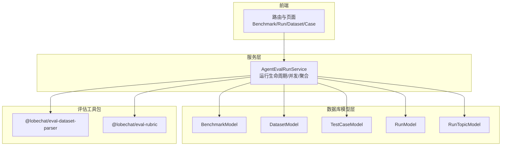
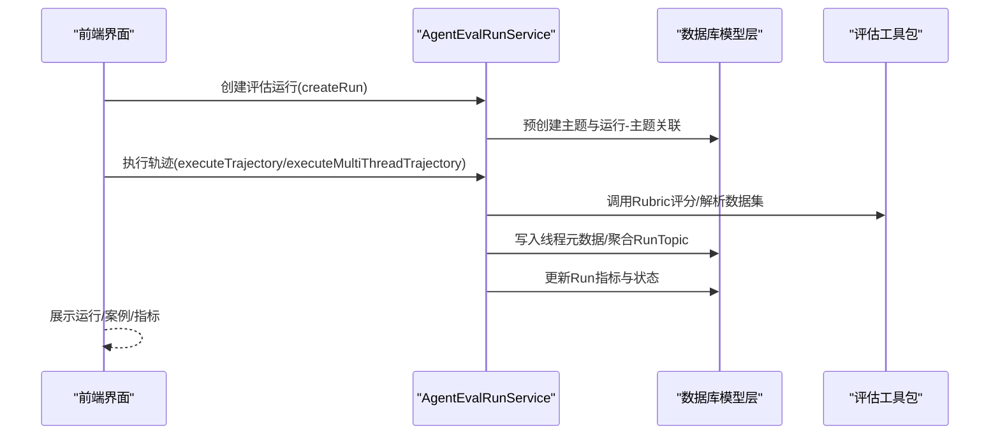
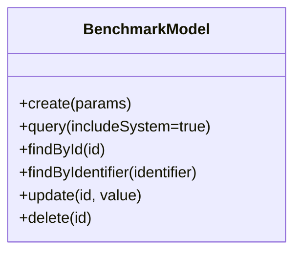
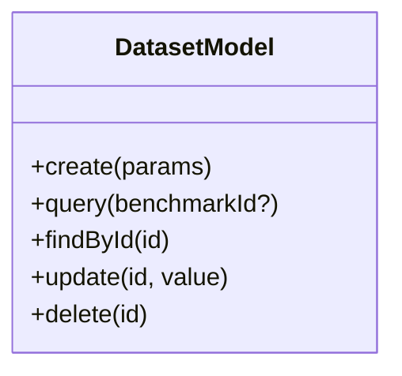
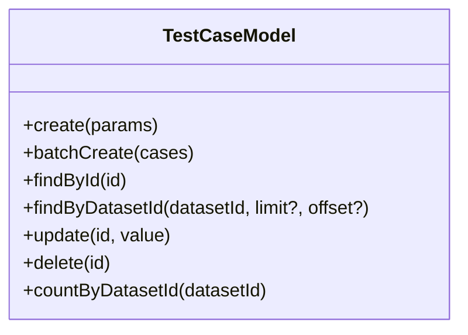
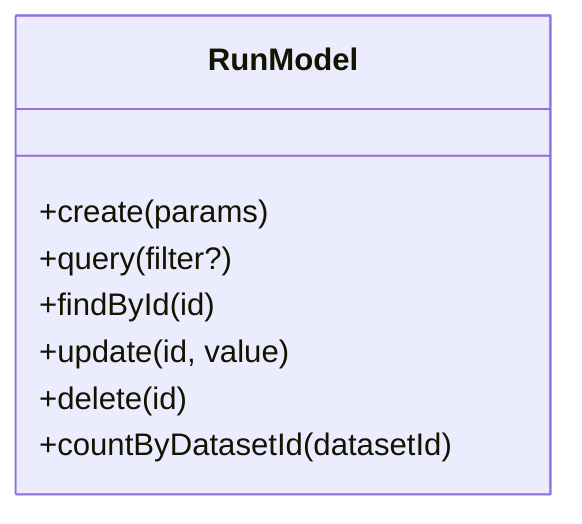
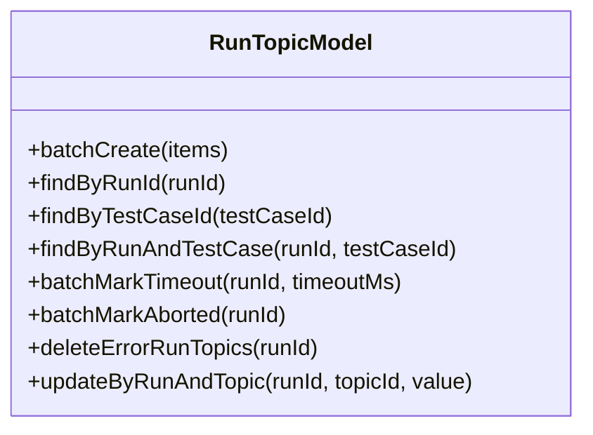
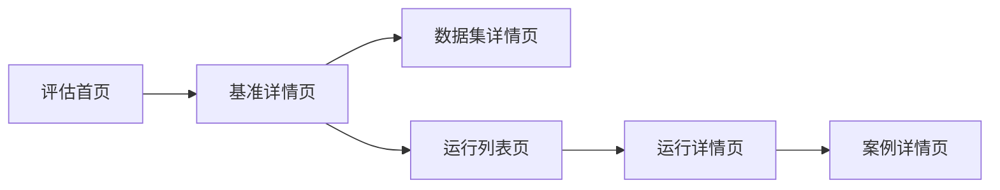
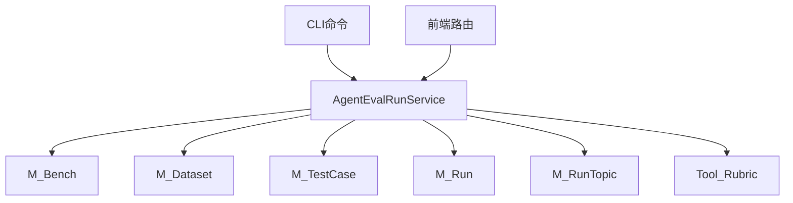

# 评估测试模型

<cite>
**本文引用的文件**   
- [apps/cli/src/commands/eval.ts](file://apps/cli/src/commands/eval.ts)
- [src/server/services/agentEvalRun/index.ts](file://src/server/services/agentEvalRun/index.ts)
- [packages/database/src/models/agentEval/benchmark.ts](file://packages/database/src/models/agentEval/benchmark.ts)
- [packages/database/src/models/agentEval/dataset.ts](file://packages/database/src/models/agentEval/dataset.ts)
- [packages/database/src/models/agentEval/run.ts](file://packages/database/src/models/agentEval/run.ts)
- [packages/database/src/models/agentEval/runTopic.ts](file://packages/database/src/models/agentEval/runTopic.ts)
- [packages/database/src/models/agentEval/testCase.ts](file://packages/database/src/models/agentEval/testCase.ts)
- [packages/eval-dataset-parser/src/index.ts](file://packages/eval-dataset-parser/src/index.ts)
- [packages/eval-rubric/src/index.ts](file://packages/eval-rubric/src/index.ts)
- [src/routes/(main)/eval/bench/[benchmarkId]/index.tsx](file://src/routes/(main)/eval/bench/[benchmarkId]/index.tsx)
- [src/routes/(main)/eval/features/BenchmarkCard/index.tsx](file://src/routes/(main)/eval/features/BenchmarkCard/index.tsx)
- [src/spa/router/desktopRouter.config.tsx](file://src/spa/router/desktopRouter.config.tsx)
</cite>

## 目录
1. [引言](#引言)
2. [项目结构](#项目结构)
3. [核心组件](#核心组件)
4. [架构总览](#架构总览)
5. [详细组件分析](#详细组件分析)
6. [依赖关系分析](#依赖关系分析)
7. [性能考虑](#性能考虑)
8. [故障排查指南](#故障排查指南)
9. [结论](#结论)
10. [附录](#附录)

## 引言
本文件面向 LobeHub 的评估测试系统，聚焦 AgentEvals 与 RAGEvals（检索增强评估）两大评估体系，系统化梳理评估基准、数据集、测试用例、评估运行、指标统计与报告生成的全链路数据模型与流程。文档旨在帮助开发者与评测工程师理解从数据准备、测试执行、结果聚合到报告输出的完整闭环，并提供可操作的优化建议与排障指引。

## 项目结构
评估系统由“前端路由与界面”、“服务层执行器”、“数据库模型层”、“评估工具包（数据解析与评分）”四部分协同构成：

- 前端路由与界面：负责展示评估基准、数据集、运行与案例详情，支持刷新与汇总统计。
- 服务层执行器：封装评估运行的生命周期管理、并发执行、指标聚合与状态推进。
- 数据库模型层：以领域模型抽象评估基准、数据集、测试用例、运行与运行-主题关联。
- 评估工具包：提供数据集格式检测与解析、Rubric 评分引擎与提取器。



图表来源
- [src/routes/(main)/eval/bench/[benchmarkId]/index.tsx](file://src/routes/(main)/eval/bench/[benchmarkId]/index.tsx#L61-L100)
- [src/server/services/agentEvalRun/index.ts](file://src/server/services/agentEvalRun/index.ts#L32-L57)
- [packages/database/src/models/agentEval/index.ts](file://packages/database/src/models/agentEval/index.ts#L1-L6)
- [packages/eval-dataset-parser/src/index.ts](file://packages/eval-dataset-parser/src/index.ts#L1-L4)
- [packages/eval-rubric/src/index.ts](file://packages/eval-rubric/src/index.ts#L1-L7)

章节来源
- [src/routes/(main)/eval/bench/[benchmarkId]/index.tsx](file://src/routes/(main)/eval/bench/[benchmarkId]/index.tsx#L61-L100)
- [src/spa/router/desktopRouter.config.tsx](file://src/spa/router/desktopRouter.config.tsx#L479-L509)

## 核心组件
- 评估基准（Benchmark）：定义评估目标、Rubric 规则集合、元数据与标签，支持系统内置与用户自建。
- 数据集（Dataset）：承载测试用例集合，支持按基准筛选与统计用例数量。
- 测试用例（TestCase）：单条评测输入与上下文配置，支持排序与批量管理。
- 评估运行（Run）：一次针对特定数据集的评测作业，记录状态、配置与指标。
- 运行-主题关联（RunTopic）：将测试用例映射到对话主题，跟踪每条用例的执行状态与结果。
- 评估工具包：
  - 数据集解析器：支持 CSV/XLSX/JSON/JSONL 等格式检测与解析。
  - Rubric 评分器：基于规则对模型输出进行评分与通过判定。

章节来源
- [packages/database/src/models/agentEval/benchmark.ts](file://packages/database/src/models/agentEval/benchmark.ts#L12-L191)
- [packages/database/src/models/agentEval/dataset.ts](file://packages/database/src/models/agentEval/dataset.ts#L6-L107)
- [packages/database/src/models/agentEval/testCase.ts](file://packages/database/src/models/agentEval/testCase.ts#L6-L115)
- [packages/database/src/models/agentEval/run.ts](file://packages/database/src/models/agentEval/run.ts#L6-L116)
- [packages/database/src/models/agentEval/runTopic.ts](file://packages/database/src/models/agentEval/runTopic.ts#L13-L213)
- [packages/eval-dataset-parser/src/index.ts](file://packages/eval-dataset-parser/src/index.ts#L1-L4)
- [packages/eval-rubric/src/index.ts](file://packages/eval-rubric/src/index.ts#L1-L7)

## 架构总览
评估系统采用“前端路由驱动 + 服务层编排 + 模型层持久化 + 工具包评分”的分层设计。前端负责展示与交互，服务层负责执行与聚合，模型层提供强一致的数据访问，工具包提供可插拔的评估能力。



图表来源
- [src/server/services/agentEvalRun/index.ts](file://src/server/services/agentEvalRun/index.ts#L59-L96)
- [src/server/services/agentEvalRun/index.ts](file://src/server/services/agentEvalRun/index.ts#L241-L310)
- [src/server/services/agentEvalRun/index.ts](file://src/server/services/agentEvalRun/index.ts#L316-L362)
- [src/server/services/agentEvalRun/index.ts](file://src/server/services/agentEvalRun/index.ts#L439-L590)
- [packages/eval-rubric/src/index.ts](file://packages/eval-rubric/src/index.ts#L1-L7)

## 详细组件分析

### 评估基准（Benchmark）
- 设计要点
  - 支持系统内置与用户自建，通过标识符与拥有者区分可见性。
  - 关联数据集与运行数量，便于统计与导航。
  - Rubric 规则作为评估依据，支持外部模式覆盖。
- 关键字段与关系
  - 字段：标识符、名称、描述、Rubric 列表、参考链接、元数据、标签、是否系统内置。
  - 关系：一对多（基准-数据集）、通过数据集反连测试用例与运行。
- 典型查询
  - 查询所有基准并附带数据集/用例/运行计数。
  - 按标识符或ID查询基准详情。



图表来源
- [packages/database/src/models/agentEval/benchmark.ts](file://packages/database/src/models/agentEval/benchmark.ts#L12-L191)

章节来源
- [packages/database/src/models/agentEval/benchmark.ts](file://packages/database/src/models/agentEval/benchmark.ts#L51-L137)

### 数据集（Dataset）
- 设计要点
  - 承载测试用例集合，支持按基准过滤与用例计数。
  - 可设置默认评估模式与配置，用于覆盖测试用例级配置。
- 关键字段与关系
  - 字段：基准ID、标识符、名称、描述、评估模式/配置、元数据。
  - 关系：一对多（数据集-测试用例），反连基准。
- 典型查询
  - 分页查询数据集列表并附带用例计数。
  - 按ID查询并返回测试用例明细。



图表来源
- [packages/database/src/models/agentEval/dataset.ts](file://packages/database/src/models/agentEval/dataset.ts#L6-L107)

章节来源
- [packages/database/src/models/agentEval/dataset.ts](file://packages/database/src/models/agentEval/dataset.ts#L39-L94)

### 测试用例（TestCase）
- 设计要点
  - 单条评测输入与上下文，支持自动排序与批量创建。
  - 可在用例级别覆盖评估模式与配置，优先级高于数据集。
- 关键字段与关系
  - 字段：所属数据集、内容（含输入）、排序序号、评估模式/配置。
  - 关系：一对多（数据集-测试用例）。
- 典型操作
  - 创建/更新/删除；按数据集分页查询；按ID查询；计数。



图表来源
- [packages/database/src/models/agentEval/testCase.ts](file://packages/database/src/models/agentEval/testCase.ts#L6-L115)

章节来源
- [packages/database/src/models/agentEval/testCase.ts](file://packages/database/src/models/agentEval/testCase.ts#L18-L86)

### 评估运行（Run）
- 设计要点
  - 记录一次评测作业的状态、配置与指标，支持目标Agent快照。
  - 提供运行生命周期管理：创建、删除、中断、重试错误用例、重试单条用例。
- 关键字段与关系
  - 字段：名称、目标Agent、数据集、配置（含阈值、步数、快照）、状态、指标。
  - 关系：一对多（运行-运行-主题），反连数据集与基准。
- 典型操作
  - 创建预置主题与运行-主题；更新状态与指标；删除并清理孤儿主题。



图表来源
- [packages/database/src/models/agentEval/run.ts](file://packages/database/src/models/agentEval/run.ts#L6-L116)

章节来源
- [src/server/services/agentEvalRun/index.ts](file://src/server/services/agentEvalRun/index.ts#L59-L96)
- [src/server/services/agentEvalRun/index.ts](file://src/server/services/agentEvalRun/index.ts#L98-L112)

### 运行-主题关联（RunTopic）
- 设计要点
  - 将测试用例映射到对话主题，跟踪每条用例的执行状态与结果。
  - 支持批量创建、按运行查询、按用例查询、超时与中断标记。
- 关键字段与关系
  - 字段：运行ID、主题ID、测试用例ID、状态、分数、是否通过、评估结果。
  - 关系：多对一（运行-主题-关联），反连测试用例与主题。
- 典型操作
  - 批量创建RunTopic；按运行/用例查询；标记超时/中断；删除错误用例。



图表来源
- [packages/database/src/models/agentEval/runTopic.ts](file://packages/database/src/models/agentEval/runTopic.ts#L13-L213)

章节来源
- [packages/database/src/models/agentEval/runTopic.ts](file://packages/database/src/models/agentEval/runTopic.ts#L34-L54)
- [packages/database/src/models/agentEval/runTopic.ts](file://packages/database/src/models/agentEval/runTopic.ts#L147-L161)

### 评估执行与指标聚合（AgentEvalRunService）
- 设计要点
  - 生命周期：创建运行、预建主题与RunTopic、执行轨迹（单线程/多线程 pass@k）、记录完成、聚合线程结果、更新运行指标。
  - 并发策略：多线程轨迹并行触发，完成后统一聚合。
  - 指标设计：累计成本、Token、LLM调用次数、步骤数、平均/每用例指标，以及 pass@k/pass^k。
- 关键流程
  - 创建运行：写入运行记录，批量创建主题与RunTopic。
  - 执行轨迹：单线程或K线程，写入operationId与webhook回调。
  - 记录完成：评估线程消息，写入线程元数据，检查是否全部完成。
  - 聚合结果：按pass@k逻辑汇总RunTopic，更新运行指标与状态。
- 外部接口
  - CLI命令：查询运行、设置状态、列出主题/线程/消息、上报结果等。

```mermaid
flowchart TD
Start(["开始"]) --> CreateRun["创建运行并预建主题/RunTopic"]
CreateRun --> ExecTraj{"执行轨迹类型？"}
ExecTraj --> |单线程| ExecOne["执行单线程轨迹"]
ExecTraj --> |多线程(K)| ExecK["创建K线程并并行执行"]
ExecOne --> RecordOne["记录完成并评估线程消息"]
ExecK --> RecordK["记录各线程完成并评估"]
RecordOne --> Aggregate["聚合RunTopic结果"]
RecordK --> Aggregate
Aggregate --> UpdateRun["更新运行指标与状态"]
UpdateRun --> End(["结束"])
```

图表来源
- [src/server/services/agentEvalRun/index.ts](file://src/server/services/agentEvalRun/index.ts#L59-L96)
- [src/server/services/agentEvalRun/index.ts](file://src/server/services/agentEvalRun/index.ts#L241-L310)
- [src/server/services/agentEvalRun/index.ts](file://src/server/services/agentEvalRun/index.ts#L316-L362)
- [src/server/services/agentEvalRun/index.ts](file://src/server/services/agentEvalRun/index.ts#L439-L590)

章节来源
- [src/server/services/agentEvalRun/index.ts](file://src/server/services/agentEvalRun/index.ts#L114-L138)
- [src/server/services/agentEvalRun/index.ts](file://src/server/services/agentEvalRun/index.ts#L140-L185)
- [src/server/services/agentEvalRun/index.ts](file://src/server/services/agentEvalRun/index.ts#L187-L223)
- [src/server/services/agentEvalRun/index.ts](file://src/server/services/agentEvalRun/index.ts#L225-L239)
- [src/server/services/agentEvalRun/index.ts](file://src/server/services/agentEvalRun/index.ts#L241-L310)
- [src/server/services/agentEvalRun/index.ts](file://src/server/services/agentEvalRun/index.ts#L316-L362)
- [src/server/services/agentEvalRun/index.ts](file://src/server/services/agentEvalRun/index.ts#L368-L432)
- [src/server/services/agentEvalRun/index.ts](file://src/server/services/agentEvalRun/index.ts#L439-L590)
- [src/server/services/agentEvalRun/index.ts](file://src/server/services/agentEvalRun/index.ts#L1215-L1222)

### 评估工具包
- 数据集解析器（@lobechat/eval-dataset-parser）
  - 功能：检测并解析 CSV/XLSX/JSON/JSONL 等格式，输出结构化数据集记录。
  - 用途：导入用户数据集，生成测试用例。
- Rubric 评分器（@lobechat/eval-rubric）
  - 功能：根据Rubric规则对模型输出进行评分，支持阈值通过判定与细项得分。
  - 用途：在执行轨迹完成后对线程消息进行评估，产出通过与否与分数。

章节来源
- [packages/eval-dataset-parser/src/index.ts](file://packages/eval-dataset-parser/src/index.ts#L1-L4)
- [packages/eval-rubric/src/index.ts](file://packages/eval-rubric/src/index.ts#L1-L7)

### 前端路由与界面
- 路由结构
  - 评估首页：展示基准卡片与运行概览。
  - 基准详情：加载基准、数据集与运行列表，计算用例总数。
  - 数据集详情：展示数据集与测试用例。
  - 运行详情：展示运行状态、指标与案例。
  - 案例详情：展示单条用例执行细节。
- 交互要点
  - 支持刷新数据集与基准信息。
  - 展示最佳分数、运行数量、数据集数量等聚合指标。



图表来源
- [src/routes/(main)/eval/bench/[benchmarkId]/index.tsx](file://src/routes/(main)/eval/bench/[benchmarkId]/index.tsx#L61-L100)
- [src/routes/(main)/eval/features/BenchmarkCard/index.tsx](file://src/routes/(main)/eval/features/BenchmarkCard/index.tsx#L136-L166)
- [src/spa/router/desktopRouter.config.tsx](file://src/spa/router/desktopRouter.config.tsx#L479-L509)

章节来源
- [src/routes/(main)/eval/bench/[benchmarkId]/index.tsx](file://src/routes/(main)/eval/bench/[benchmarkId]/index.tsx#L69-L98)
- [src/routes/(main)/eval/features/BenchmarkCard/index.tsx](file://src/routes/(main)/eval/features/BenchmarkCard/index.tsx#L136-L166)
- [src/spa/router/desktopRouter.config.tsx](file://src/spa/router/desktopRouter.config.tsx#L479-L509)

## 依赖关系分析
- 组件耦合
  - AgentEvalRunService 依赖数据库模型层（基准/数据集/测试用例/运行/运行-主题）与评估工具包。
  - 前端路由依赖服务层提供的数据与状态。
- 外部依赖
  - CLI 命令通过 tRPC 客户端与后端交互，支持外部评估工作流对接。
- 循环依赖
  - 当前结构以服务层为中心向外依赖模型与工具包，未见循环依赖迹象。



图表来源
- [src/server/services/agentEvalRun/index.ts](file://src/server/services/agentEvalRun/index.ts#L32-L57)
- [apps/cli/src/commands/eval.ts](file://apps/cli/src/commands/eval.ts#L182-L326)

章节来源
- [apps/cli/src/commands/eval.ts](file://apps/cli/src/commands/eval.ts#L182-L326)

## 性能考虑
- 并发执行
  - 多线程轨迹（pass@k）并行触发，减少整体耗时；完成后统一聚合，避免重复计算。
- 指标聚合
  - 使用累计求和与平均计算，保留必要精度（如成本保留6位小数）。
- 数据访问
  - 模型层提供分页与条件查询，避免一次性加载过多数据。
- 缓存与重试
  - 对错误/超时用例提供重试机制，减少人工干预。
- Webhook 回调
  - 通过回调异步推进执行进度，降低阻塞等待时间。

章节来源
- [src/server/services/agentEvalRun/index.ts](file://src/server/services/agentEvalRun/index.ts#L316-L362)
- [src/server/services/agentEvalRun/index.ts](file://src/server/services/agentEvalRun/index.ts#L439-L590)
- [src/server/services/agentEvalRun/index.ts](file://src/server/services/agentEvalRun/index.ts#L140-L185)

## 故障排查指南
- 常见问题
  - 运行状态异常：检查 RunTopic 的超时与中断标记，确认是否已正确写入 operationId。
  - 无评估结果：确认线程消息是否存在最后一条助手回复，Rubric 是否正确解析。
  - 指标缺失：检查聚合阶段是否遍历了已完成的 RunTopic，并正确累加各项指标。
- 排查步骤
  - 通过 CLI 命令查询运行、主题、线程与消息，定位异常用例。
  - 在服务层日志中查看执行轨迹与评估过程中的错误信息。
  - 对错误用例执行重试或删除后重建 RunTopic。
- 相关接口
  - CLI 查询运行、设置运行状态、列出主题/线程/消息、上报结果等。

章节来源
- [apps/cli/src/commands/eval.ts](file://apps/cli/src/commands/eval.ts#L182-L326)
- [src/server/services/agentEvalRun/index.ts](file://src/server/services/agentEvalRun/index.ts#L140-L185)
- [src/server/services/agentEvalRun/index.ts](file://src/server/services/agentEvalRun/index.ts#L292-L310)
- [src/server/services/agentEvalRun/index.ts](file://src/server/services/agentEvalRun/index.ts#L410-L432)

## 结论
评估测试系统围绕“基准-数据集-用例-运行-主题”的数据模型构建，结合并发执行与Rubric评分引擎，实现了从数据准备到结果统计与报告输出的完整闭环。通过清晰的分层设计与可扩展的工具包，系统具备良好的可维护性与可拓展性。建议在生产环境中进一步完善缓存策略与监控告警，持续优化并发与指标聚合性能。

## 附录
- 术语
  - 基准（Benchmark）：评估目标与Rubric规则集合。
  - 数据集（Dataset）：测试用例集合，支持默认评估模式与配置。
  - 测试用例（TestCase）：单条评测输入与上下文。
  - 评估运行（Run）：一次评测作业，记录状态与指标。
  - 运行-主题关联（RunTopic）：用例与对话主题的映射，跟踪执行状态与结果。
  - pass@k：至少一条线程通过即算通过；pass^k：所有线程均通过才算通过。