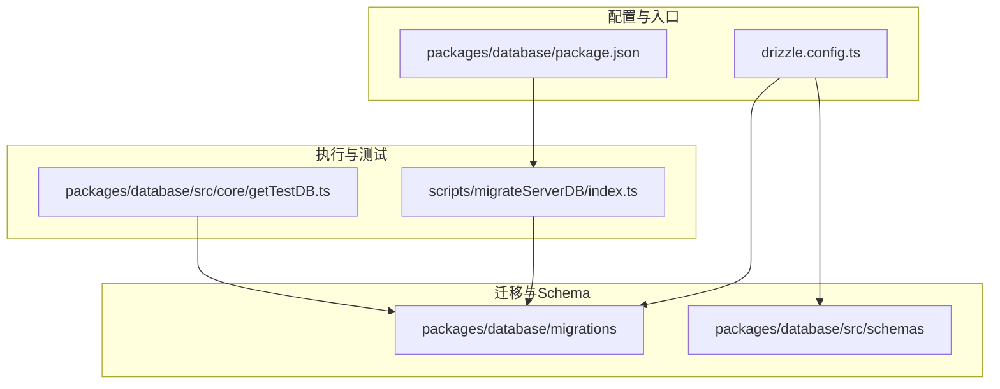
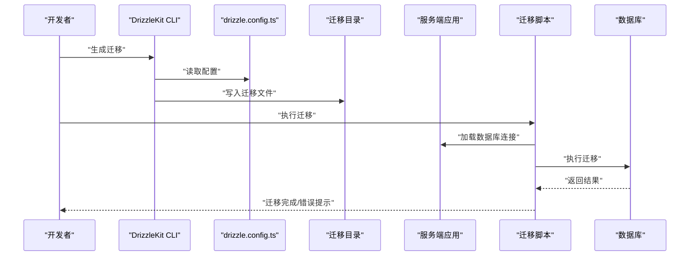
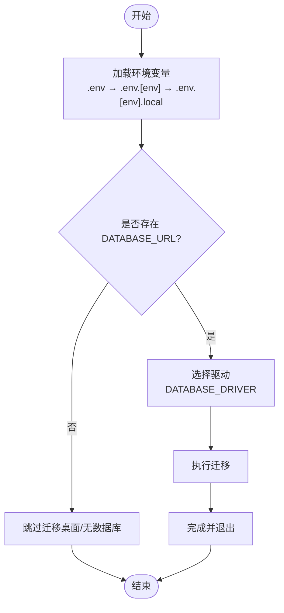
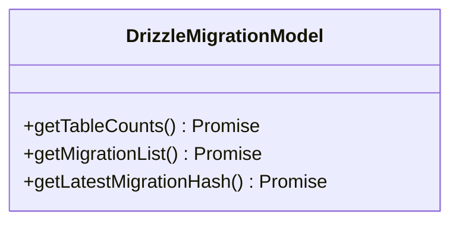
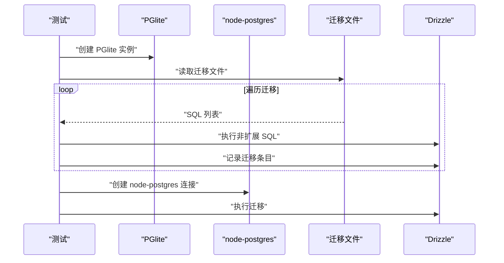
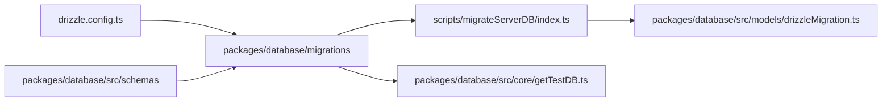

# 迁移管理

<cite>
**本文引用的文件**
- [drizzle.config.ts](file://drizzle.config.ts)
- [packages/database/package.json](file://packages/database/package.json)
- [.agents/skills/db-migrations/SKILL.md](file://.agents/skills/db-migrations/SKILL.md)
- [scripts/migrateServerDB/index.ts](file://scripts/migrateServerDB/index.ts)
- [packages/database/src/models/drizzleMigration.ts](file://packages/database/src/models/drizzleMigration.ts)
- [packages/database/src/core/getTestDB.ts](file://packages/database/src/core/getTestDB.ts)
- [packages/database/src/schemas/index.ts](file://packages/database/src/schemas/index.ts)
- [packages/database/migrations/0000_init.sql](file://packages/database/migrations/0000_init.sql)
- [packages/database/migrations/0090_enable_pg_search.sql](file://packages/database/migrations/0090_enable_pg_search.sql)
- [scripts/setup-test-postgres-db.sh](file://scripts/setup-test-postgres-db.sh)
- [packages/database/src/repositories/dataImporter/index.ts](file://packages/database/src/repositories/dataImporter/index.ts)
</cite>

## 目录

1. [引言](#引言)
2. [项目结构](#项目结构)
3. [核心组件](#核心组件)
4. [架构总览](#架构总览)
5. [详细组件分析](#详细组件分析)
6. [依赖关系分析](#依赖关系分析)
7. [性能考量](#性能考量)
8. [故障排查指南](#故障排查指南)
9. [结论](#结论)
10. [附录](#附录)

## 引言

本文件面向 LobeHub 的数据库迁移管理，系统性阐述基于 DrizzleKit 的迁移体系设计与实现，覆盖迁移生成、命名规范、版本控制策略、脚本编写规范、回滚机制、数据保护、执行流程、环境差异处理、生产部署策略、最佳实践、常见问题与故障恢复、迁移测试与验证、回滚测试流程，以及具体迁移示例与版本升级指南。

## 项目结构

LobeHub 的数据库迁移采用 “集中式迁移目录 + 分层模式” 的组织方式：

- 迁移文件统一存放于 packages/database/migrations，按时间戳前缀顺序编号，确保幂等与可追踪。
- Drizzle 配置位于仓库根目录 drizzle.config.ts，定义方言、输出目录、Schema 路径与严格模式。
- 数据库包在 packages/database，包含迁移目录、Schema 定义、服务端 / 客户端测试数据库初始化逻辑。
- 迁移执行脚本位于 scripts/migrateServerDB，支持 Neon 与 Node 驱动两种路径。
- 测试侧通过 packages/database/src/core/getTestDB.ts 提供 PGlite（客户端）与 node-postgres（服务端）双模式测试数据库，兼容迁移执行与校验。

图表来源

- [drizzle.config.ts](file://drizzle.config.ts#L10-L21)
- [packages/database/package.json](file://packages/database/package.json#L10-L15)
- [packages/database/migrations/0000_init.sql](file://packages/database/migrations/0000_init.sql#L1-L20)
- [packages/database/src/schemas/index.ts](file://packages/database/src/schemas/index.ts#L1-L24)
- [scripts/migrateServerDB/index.ts](file://scripts/migrateServerDB/index.ts#L21-L36)
- [packages/database/src/core/getTestDB.ts](file://packages/database/src/core/getTestDB.ts#L17-L78)

章节来源

- [drizzle.config.ts](file://drizzle.config.ts#L10-L21)
- [packages/database/package.json](file://packages/database/package.json#L10-L15)

## 核心组件

- Drizzle 配置：定义数据库方言、迁移输出目录、Schema 路径与严格模式，确保迁移生成与执行的一致性。
- 迁移目录：按时间戳前缀编号，包含初始 Schema 与后续演进脚本；部分自定义扩展脚本（如启用 pg_search）以注释形式说明限制。
- 迁移执行器：提供两套驱动路径（Neon 与 Node），自动加载环境变量与迁移目录，执行迁移并输出耗时统计。
- 模型与查询：提供迁移状态查询接口，用于获取迁移列表与最新哈希，辅助验证与回滚决策。
- 测试数据库：支持 PGlite（无外部依赖）与 node-postgres（完整功能）两种模式，测试中可跳过特定扩展 SQL 并手动记录迁移条目，保证测试稳定性。

章节来源

- [drizzle.config.ts](file://drizzle.config.ts#L10-L21)
- [packages/database/migrations/0000_init.sql](file://packages/database/migrations/0000_init.sql#L1-L20)
- [packages/database/migrations/0090_enable_pg_search.sql](file://packages/database/migrations/0090_enable_pg_search.sql#L1-L2)
- [scripts/migrateServerDB/index.ts](file://scripts/migrateServerDB/index.ts#L23-L36)
- [packages/database/src/models/drizzleMigration.ts](file://packages/database/src/models/drizzleMigration.ts#L26-L37)
- [packages/database/src/core/getTestDB.ts](file://packages/database/src/core/getTestDB.ts#L46-L78)

## 架构总览

下图展示从配置到迁移执行与验证的整体流程，涵盖开发态与生产态的关键节点。

图表来源

- [drizzle.config.ts](file://drizzle.config.ts#L10-L21)
- [scripts/migrateServerDB/index.ts](file://scripts/migrateServerDB/index.ts#L23-L36)
- [packages/database/migrations/0000_init.sql](file://packages/database/migrations/0000_init.sql#L1-L20)

## 详细组件分析

### 组件一：Drizzle 配置与迁移生成

- 配置要点
  - 方言：PostgreSQL
  - 输出目录：packages/database/migrations
  - Schema 目录：packages/database/src/schemas
  - 严格模式：开启
- 生成流程
  - 通过 DrizzleKit CLI 生成迁移文件，更新迁移日志与快照文件，避免手工修改日志导致不一致。
- 命名规范
  - 使用时间戳前缀 + 下划线 + 动作语义的文件名，便于排序与可读性。
- 自定义迁移
  - 对非 Drizzle Schema 的变更（如启用扩展）使用自定义标志生成空文件，再手动补充 SQL。

章节来源

- [drizzle.config.ts](file://drizzle.config.ts#L10-L21)
- [.agents/skills/db-migrations/SKILL.md](file://.agents/skills/db-migrations/SKILL.md#L8-L46)

### 组件二：迁移执行器（服务端）

- 环境变量加载顺序
  - 优先级：.env → .env.\[env] → .env.\[env].local，支持变量展开。
- 驱动选择
  - DATABASE_DRIVER=node 时使用 node-postgres 驱动；否则使用 Neon Serverless 驱动。
- 执行与错误处理
  - 成功：打印耗时并退出。
  - 失败：根据错误信息提示扩展缺失、唯一约束冲突或初始化失败等问题。
- 生产部署建议
  - 在 CI/CD 中显式设置 DATABASE_DRIVER 与 DATABASE_URL，确保迁移在部署阶段自动执行。

图表来源

- [scripts/migrateServerDB/index.ts](file://scripts/migrateServerDB/index.ts#L11-L36)

章节来源

- [scripts/migrateServerDB/index.ts](file://scripts/migrateServerDB/index.ts#L11-L36)

### 组件三：迁移状态查询与验证

- 查询迁移列表与最新哈希，用于：
  - 部署后验证迁移是否成功应用
  - 回滚前确认当前状态
- 查询实现
  - 通过底层 SQL 访问迁移表，返回迁移项列表与最新哈希值。

图表来源

- [packages/database/src/models/drizzleMigration.ts](file://packages/database/src/models/drizzleMigration.ts#L6-L38)

章节来源

- [packages/database/src/models/drizzleMigration.ts](file://packages/database/src/models/drizzleMigration.ts#L13-L37)

### 组件四：测试数据库与迁移兼容

- 双模式测试
  - PGlite：无需外部数据库，适合前端 / 客户端场景；对特定扩展 SQL（如 pg_search）进行跳过处理。
  - node-postgres：完整功能，适合服务端测试；直接应用迁移。
- 迁移兼容策略
  - 在测试中读取迁移文件，逐条执行非扩展 SQL，并手动维护迁移表，确保测试一致性。

图表来源

- [packages/database/src/core/getTestDB.ts](file://packages/database/src/core/getTestDB.ts#L46-L78)

章节来源

- [packages/database/src/core/getTestDB.ts](file://packages/database/src/core/getTestDB.ts#L24-L78)

### 组件五：Schema 与迁移的关系

- Schema 定义集中在 packages/database/src/schemas，迁移文件通过 DrizzleKit 生成与应用。
- 初始迁移包含大量基础表与索引，后续迁移逐步演进字段、索引与约束。

章节来源

- [packages/database/src/schemas/index.ts](file://packages/database/src/schemas/index.ts#L1-L24)
- [packages/database/migrations/0000_init.sql](file://packages/database/migrations/0000_init.sql#L1-L20)

### 组件六：扩展与兼容性（pg_search 示例）

- 某些迁移涉及 PostgreSQL 扩展（如 pg_search），但需特定运行环境（如 ParadeDB）才可用。
- 当目标环境不满足条件时，迁移文件会保留占位或注释，避免执行失败。

章节来源

- [packages/database/migrations/0090_enable_pg_search.sql](file://packages/database/migrations/0090_enable_pg_search.sql#L1-L2)

## 依赖关系分析

- 配置到迁移：drizzle.config.ts 决定迁移输出与 Schema 路径，影响迁移生成与执行。
- 迁移到执行：scripts/migrateServerDB/index.ts 读取迁移目录并执行，受 DATABASE_DRIVER 与 DATABASE_URL 控制。
- 执行到验证：packages/database/src/models/drizzleMigration.ts 提供迁移状态查询能力。
- 测试到迁移：packages/database/src/core/getTestDB.ts 在测试环境中读取迁移文件并执行，保证测试一致性。

图表来源

- [drizzle.config.ts](file://drizzle.config.ts#L10-L21)
- [packages/database/migrations/0000_init.sql](file://packages/database/migrations/0000_init.sql#L1-L20)
- [scripts/migrateServerDB/index.ts](file://scripts/migrateServerDB/index.ts#L21-L36)
- [packages/database/src/models/drizzleMigration.ts](file://packages/database/src/models/drizzleMigration.ts#L26-L37)
- [packages/database/src/core/getTestDB.ts](file://packages/database/src/core/getTestDB.ts#L17-L78)

章节来源

- [drizzle.config.ts](file://drizzle.config.ts#L10-L21)
- [scripts/migrateServerDB/index.ts](file://scripts/migrateServerDB/index.ts#L21-L36)
- [packages/database/src/models/drizzleMigration.ts](file://packages/database/src/models/drizzleMigration.ts#L26-L37)
- [packages/database/src/core/getTestDB.ts](file://packages/database/src/core/getTestDB.ts#L17-L78)

## 性能考量

- 迁移执行时间：迁移脚本会记录耗时，便于定位慢迁移。
- 索引与约束：初始迁移包含常用索引，后续迁移应尽量复用已有索引或分批添加，避免长事务锁表。
- 扩展兼容：对不支持的扩展（如 pg_search）在测试与生产环境分别处理，减少无效执行。

## 故障排查指南

- 扩展未安装
  - 现象：迁移报错提示扩展不可用。
  - 处理：根据提示启用所需扩展或调整迁移策略。
- 唯一约束冲突
  - 现象：邮箱唯一约束冲突。
  - 处理：清理重复数据或调整数据源。
- 初始化失败
  - 现象：无法读取迁移模块。
  - 处理：检查数据库连接与驱动配置。

章节来源

- [scripts/migrateServerDB/index.ts](file://scripts/migrateServerDB/index.ts#L49-L58)

## 结论

LobeHub 的数据库迁移体系以 DrizzleKit 为核心，结合严格的配置、清晰的命名与版本控制策略、完善的执行与验证机制，实现了从开发到生产的稳定迁移闭环。通过测试数据库的双模式支持与扩展兼容策略，进一步提升了迁移的可靠性与可维护性。

## 附录

### 迁移脚本编写规范

- 幂等性：所有 DDL 必须具备幂等特性，避免重复执行造成错误。
- 命名规范：使用时间戳前缀 + 语义化名称，保持可读性与顺序性。
- 自定义迁移：非 Schema 变更使用自定义标志生成空文件，再手动补充 SQL。
- 索引与约束：新增索引与约束需评估性能影响，必要时分批执行。

章节来源

- [.agents/skills/db-migrations/SKILL.md](file://.agents/skills/db-migrations/SKILL.md#L47-L74)

### 回滚机制与数据保护

- 回滚策略：优先采用 “向前修复”（新增安全迁移）而非破坏性回滚；若必须回滚，先备份数据库。
- 数据保护：在关键迁移前后导出增量数据快照，确保可恢复。
- 冲突处理：导入数据时遵循冲突策略（跳过 / 覆盖），并建立 ID 映射以保证关联完整性。

章节来源

- [packages/database/src/repositories/dataImporter/index.ts](file://packages/database/src/repositories/dataImporter/index.ts#L594-L623)

### 迁移执行流程与环境差异

- 开发环境：本地通过 DrizzleKit 生成迁移，使用 PGlite 或 node-postgres 进行测试。
- 测试 / 预发布环境：使用 node-postgres 执行完整迁移，验证索引与扩展。
- 生产环境：通过迁移脚本自动执行，严格区分 DATABASE_DRIVER 与 DATABASE_URL。

章节来源

- [packages/database/src/core/getTestDB.ts](file://packages/database/src/core/getTestDB.ts#L24-L78)
- [scripts/migrateServerDB/index.ts](file://scripts/migrateServerDB/index.ts#L11-L36)

### 生产环境部署策略

- CI/CD 集成：在构建完成后自动执行迁移脚本，失败即终止发布。
- 连接与驱动：明确设置 DATABASE_DRIVER 与 DATABASE_URL，避免默认行为差异。
- 监控与告警：对迁移耗时与失败进行监控，及时发现异常。

章节来源

- [packages/database/package.json](file://packages/database/package.json#L10-L15)
- [scripts/migrateServerDB/index.ts](file://scripts/migrateServerDB/index.ts#L11-L36)

### 迁移测试策略与验证方法

- 单元测试：验证迁移状态查询与计数逻辑。
- 集成测试：在 PGlite 与 node-postgres 两种模式下执行迁移，确保兼容性。
- 端到端：在测试数据库中模拟真实业务数据，验证迁移后的数据一致性。

章节来源

- [packages/database/src/models/drizzleMigration.ts](file://packages/database/src/models/drizzleMigration.ts#L13-L37)
- [packages/database/src/core/getTestDB.ts](file://packages/database/src/core/getTestDB.ts#L24-L78)

### 回滚测试流程

- 准备：在测试环境准备回滚目标版本的数据快照。
- 执行：对目标版本执行回滚迁移，验证数据一致性。
- 验证：通过迁移状态查询与关键表校验，确认回滚成功。
- 记录：记录回滚过程与结果，形成回滚预案。

章节来源

- [packages/database/src/models/drizzleMigration.ts](file://packages/database/src/models/drizzleMigration.ts#L26-L37)

### 具体迁移示例与版本升级指南

- 初始迁移：包含大量基础表与索引，作为后续演进的基线。
- 版本升级：每次 Schema 变更均通过 DrizzleKit 生成迁移文件，按顺序执行，确保版本一致性。
- 扩展迁移：对不兼容的扩展（如 pg_search）在目标环境不可用时跳过或降级处理。

章节来源

- [packages/database/migrations/0000_init.sql](file://packages/database/migrations/0000_init.sql#L1-L20)
- [packages/database/migrations/0090_enable_pg_search.sql](file://packages/database/migrations/0090_enable_pg_search.sql#L1-L2)

### 环境准备与测试数据库

- 测试数据库一键启动：通过脚本快速拉起带有扩展的测试数据库，便于本地验证。
- 测试模式切换：通过环境变量切换服务端 / 客户端测试模式，适配不同场景。

章节来源

- [scripts/setup-test-postgres-db.sh](file://scripts/setup-test-postgres-db.sh#L1-L22)
- [packages/database/src/core/getTestDB.ts](file://packages/database/src/core/getTestDB.ts#L19-L41)
