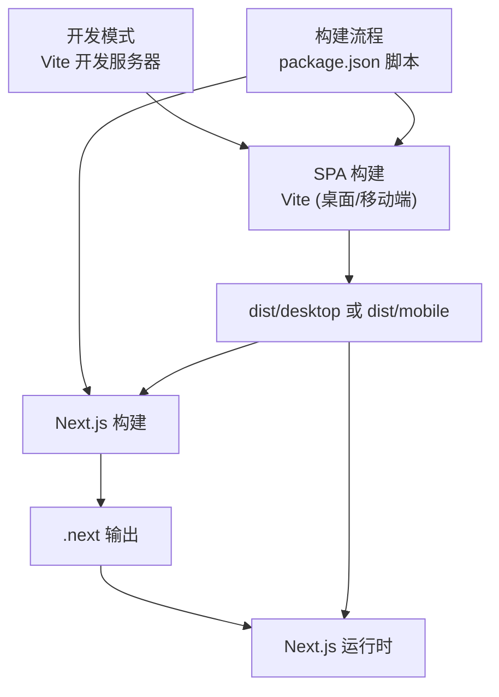
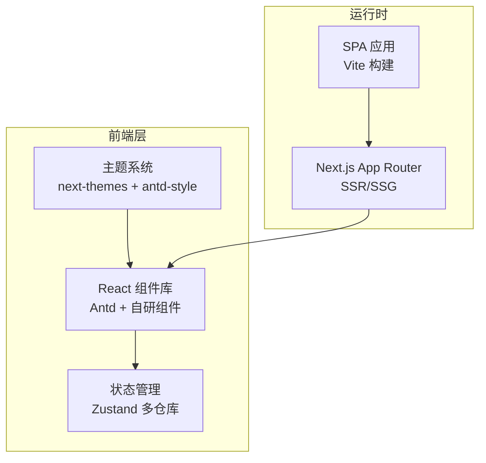
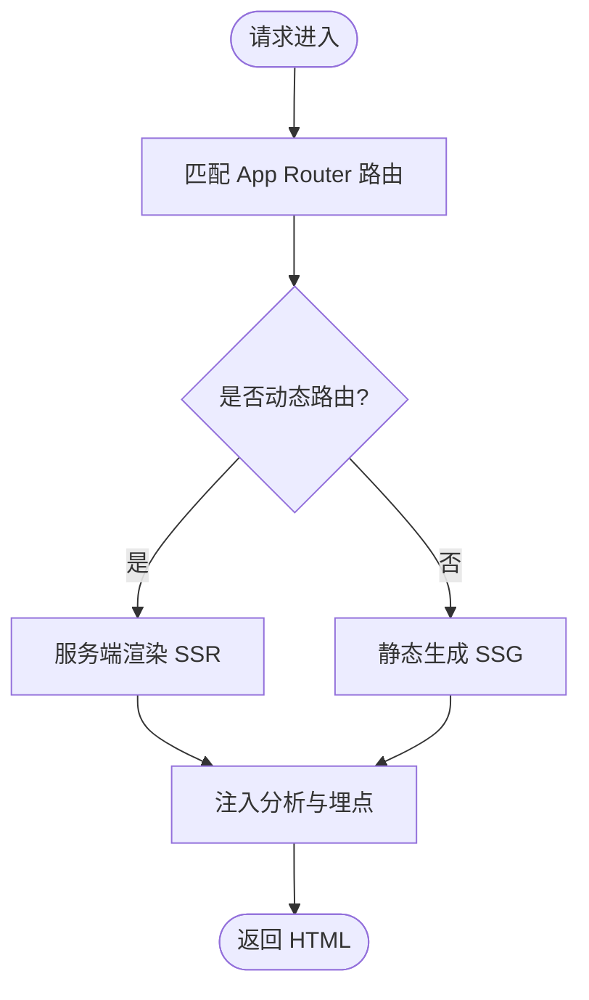
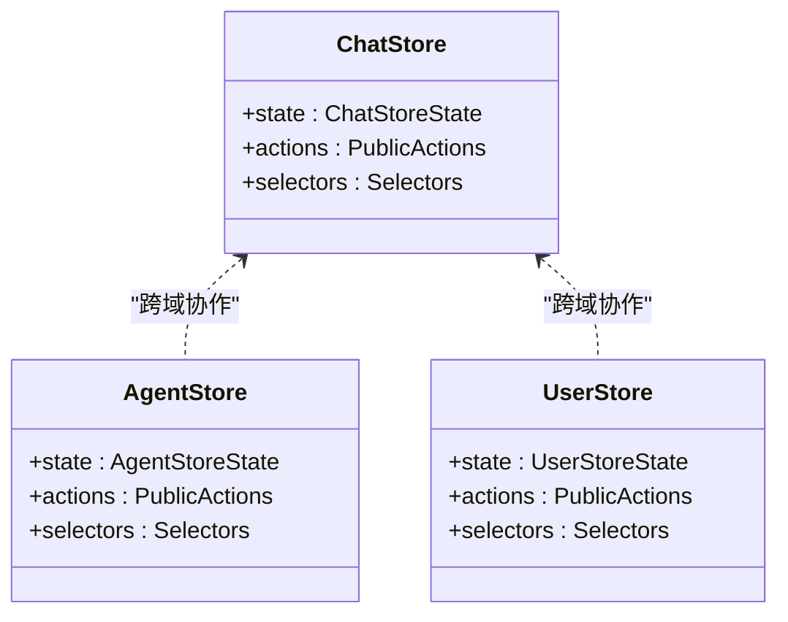
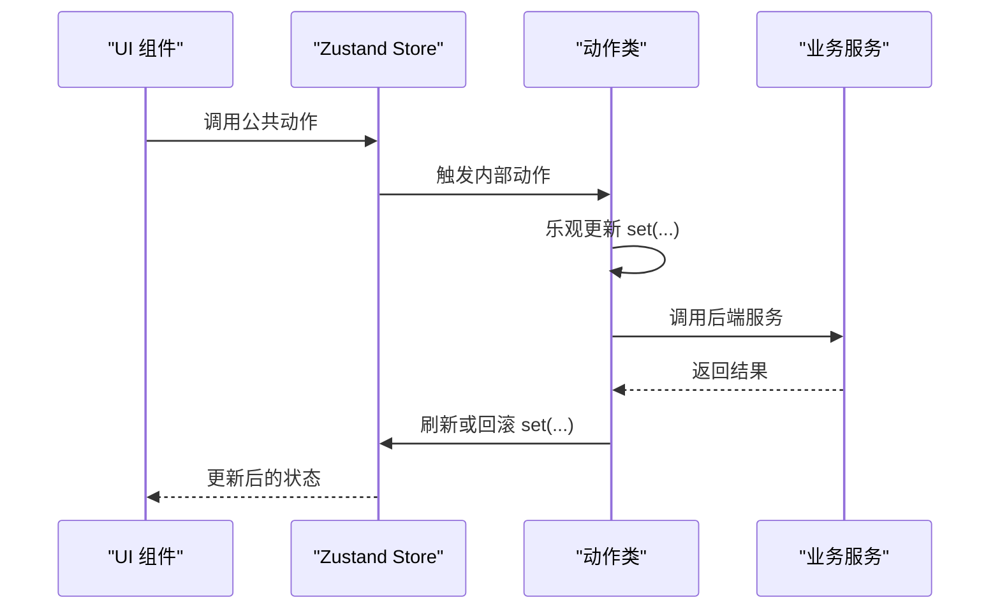
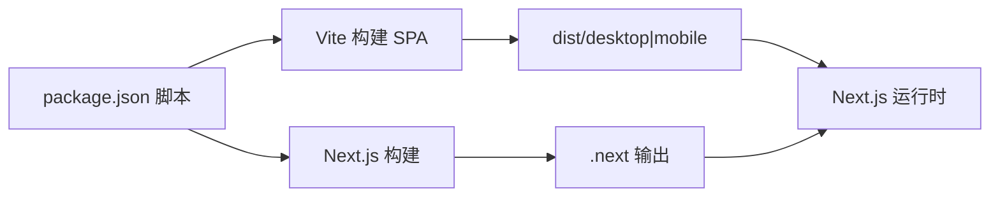
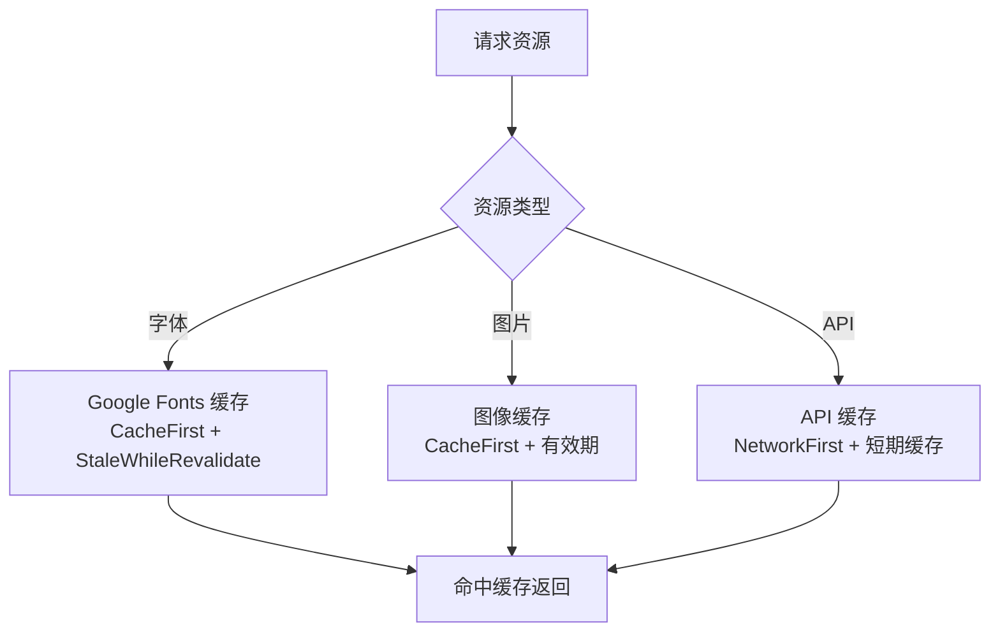

# 前端架构设计

<cite>
**本文引用的文件**
- [package.json](file://package.json)
- [next.config.ts](file://next.config.ts)
- [vite.config.ts](file://vite.config.ts)
- [src/app/layout.tsx](file://src/app/layout.tsx)
- [src/store/chat/index.ts](file://src/store/chat/index.ts)
- [src/store/agent/index.ts](file://src/store/agent/index.ts)
- [src/store/user/index.ts](file://src/store/user/index.ts)
- [src/store/types.ts](file://src/store/types.ts)
- [.agents/skills/zustand/SKILL.md](file://.agents/skills/zustand/SKILL.md)
- [.agents/skills/zustand/references/action-patterns.md](file://.agents/skills/zustand/references/action-patterns.md)
- [docs/development/state-management/state-management-intro.mdx](file://docs/development/state-management/state-management-intro.mdx)
</cite>

## 目录
1. [引言](#引言)
2. [项目结构](#项目结构)
3. [核心组件](#核心组件)
4. [架构总览](#架构总览)
5. [组件与页面架构详解](#组件与页面架构详解)
6. [依赖关系分析](#依赖关系分析)
7. [性能优化策略](#性能优化策略)
8. [故障排查指南](#故障排查指南)
9. [结论](#结论)

## 引言
本设计文档面向 LobeHub 前端（Next.js + SPA 混合）应用，系统性阐述其前端架构设计，包括：
- SSR/SSG 策略与路由系统设计
- 页面组件结构与布局体系
- 前端状态管理架构（Zustand 分层与持久化）
- 可复用组件库与 UI 架构、主题系统
- 响应式与移动端适配策略
- 性能优化（代码分割、懒加载、缓存）

## 项目结构
LobeHub 采用多入口混合架构：Next.js 提供服务端渲染与静态生成能力，同时通过 Vite 构建 SPA（桌面端/移动端），二者在构建脚本中协同输出到公共产物目录，最终由 Next.js 提供统一的运行时与部署。

图表来源
- [package.json](file://package.json#L36-L46)
- [vite.config.ts](file://vite.config.ts#L24-L32)
- [next.config.ts](file://next.config.ts#L22-L24)

章节来源
- [package.json](file://package.json#L36-L46)
- [vite.config.ts](file://vite.config.ts#L16-L32)
- [next.config.ts](file://next.config.ts#L1-L27)

## 核心组件
- 状态管理：Zustand 多仓库分层（chat、agent、user 等），支持选择器、内部动作与乐观更新模式
- 组件系统：Ant Design + 自研组件库，强调可组合性与可测试性
- 主题系统：基于 next-themes 与 antd-style，支持明暗主题切换与样式变量注入
- 路由与布局：Next.js App Router + 自定义根布局，提供全局 Suspense 与分析埋点
- 性能：Vercel 输出追踪裁剪、PWA 缓存策略、懒加载与代码分割

章节来源
- [src/store/chat/index.ts](file://src/store/chat/index.ts#L1-L4)
- [src/store/agent/index.ts](file://src/store/agent/index.ts#L1-L3)
- [src/store/user/index.ts](file://src/store/user/index.ts#L1-L2)
- [src/store/types.ts](file://src/store/types.ts#L1-L8)
- [src/app/layout.tsx](file://src/app/layout.tsx#L1-L23)

## 架构总览
整体架构由“服务端渲染（Next.js）+ SPA（Vite）”构成，二者通过统一的构建脚本与产物目录协同工作。SPA 作为独立单页应用，提供桌面/移动端体验；Next.js 提供 SEO、SSR/SSG 与服务端能力。

图表来源
- [src/app/layout.tsx](file://src/app/layout.tsx#L8-L20)
- [vite.config.ts](file://vite.config.ts#L24-L32)
- [package.json](file://package.json#L36-L46)

## 组件与页面架构详解

### SSR/SSG 策略与路由系统
- App Router：采用 Next.js App Router，根布局提供全局 Suspense 与分析埋点，支持 SSR/SSG
- 路由组织：通过 App 目录下的文件系统路由组织页面，支持动态路由与变体路由
- 静态资源：Vercel 输出追踪裁剪，排除 musl 二进制与 SPA/桌面/移动端构建产物，减少函数体积

图表来源
- [src/app/layout.tsx](file://src/app/layout.tsx#L8-L20)
- [next.config.ts](file://next.config.ts#L5-L21)

章节来源
- [src/app/layout.tsx](file://src/app/layout.tsx#L1-L23)
- [next.config.ts](file://next.config.ts#L1-L27)

### 页面组件结构
- 根布局：提供 html/body 包裹、Suspense 容器、分析埋点与 Vercel 性能指标
- 页面级布局：按需引入，支持多变体与嵌套布局
- 错误与兜底：404 页面与错误边界组件

章节来源
- [src/app/layout.tsx](file://src/app/layout.tsx#L8-L20)

### 组件系统与主题
- 组件库：Ant Design 与自研组件并用，强调可组合性与可测试性
- 主题系统：next-themes 提供主题切换，antd-style 注入样式变量，实现明暗主题一致切换
- 响应式：结合响应式断点与移动端适配策略，确保在不同设备上的一致体验

（本节为概念性说明，不直接分析具体源码文件）

### 前端状态管理架构（Zustand）

#### 分层与组织
- 低复杂度：store.ts + initialState.ts
- 中等复杂度：store.ts + initialState.ts + selectors.ts + reducer.ts
- 高复杂度：多 slice 组织，按领域拆分 CRUD、生命周期、成员管理等切片

图表来源
- [src/store/chat/index.ts](file://src/store/chat/index.ts#L1-L4)
- [src/store/agent/index.ts](file://src/store/agent/index.ts#L1-L3)
- [src/store/user/index.ts](file://src/store/user/index.ts#L1-L2)

章节来源
- [docs/development/state-management/state-management-intro.mdx](file://docs/development/state-management/state-management-intro.mdx#L28-L71)
- [src/store/chat/index.ts](file://src/store/chat/index.ts#L1-L4)
- [src/store/agent/index.ts](file://src/store/agent/index.ts#L1-L3)
- [src/store/user/index.ts](file://src/store/user/index.ts#L1-L2)

#### 动作类型与命名规范
- 公共动作：动词形式（createTopic、sendMessage），负责参数校验与流程编排
- 内部动作：internal_ 前缀（internal_createTopic），封装业务逻辑与错误处理
- 分发方法：internal_dispatchXxx，用于调用 reducer 并更新 store
- 命名约定：ID 数组（messageLoadingIds）、映射（topicMaps）、活跃项（activeTopicId）、初始化标志（topicsInit）

章节来源
- [.agents/skills/zustand/SKILL.md](file://.agents/skills/zustand/SKILL.md#L8-L84)

#### 类式动作实现与组合
- 使用类封装动作，构造函数接收 (set, get, api)，以 # 私有字段避免泄露
- 通过 flattenActions 合并多个动作类，暴露只读公共方法
- 支持多类组合与显式 store 增强类型

图表来源
- [.agents/skills/zustand/SKILL.md](file://.agents/skills/zustand/SKILL.md#L90-L139)

章节来源
- [.agents/skills/zustand/SKILL.md](file://.agents/skills/zustand/SKILL.md#L90-L139)

#### 加载状态与 SWR 集成
- 使用 SWR 管理远端数据获取与缓存失效
- 在 onSuccess 中批量写入映射表，避免重复 set
- 通过 mutate 触发缓存刷新

章节来源
- [.agents/skills/zustand/references/action-patterns.md](file://.agents/skills/zustand/references/action-patterns.md#L85-L105)

#### 乐观更新模式
- 创建类操作：先本地临时 ID 写入，再调用后端，最后刷新保证一致性
- 删除类操作：不使用乐观更新，避免复杂恢复

章节来源
- [.agents/skills/zustand/SKILL.md](file://.agents/skills/zustand/SKILL.md#L46-L68)

#### 状态持久化策略
- 仓库层面：通过中间件（如 devtools）与外部存储（浏览器 LocalStorage/IndexedDB）实现持久化
- 会话与用户偏好：将关键状态序列化保存，应用启动时恢复
- 注意：仅对必要状态持久化，避免过度占用存储空间

（本节为通用实践说明，不直接分析具体源码文件）

### 响应式设计与移动端适配
- 断点与布局：结合 Ant Design 的栅格与响应式组件，配合自定义断点实现移动端优先
- 移动端 SPA：通过 Vite 构建移动版入口，适配触摸交互与手势
- 图标与媒体：使用矢量图标与高分辨率图片，确保在高 DPI 设备清晰显示

章节来源
- [vite.config.ts](file://vite.config.ts#L16-L22)

## 依赖关系分析
- 构建链路：package.json 脚本驱动 Vite 与 Next.js 构建，产物合并至公共目录
- 运行时：Next.js 作为主运行时，SPA 作为独立入口被 Next.js 承载
- 依赖裁剪：Vercel 输出追踪排除非必要二进制与构建产物，降低冷启动与部署体积

图表来源
- [package.json](file://package.json#L36-L46)
- [vite.config.ts](file://vite.config.ts#L24-L32)
- [next.config.ts](file://next.config.ts#L22-L24)

章节来源
- [package.json](file://package.json#L36-L46)
- [next.config.ts](file://next.config.ts#L1-L27)

## 性能优化策略
- 代码分割与懒加载：按路由与组件进行动态导入，减少首屏包体
- 缓存策略（PWA）：Workbox 配置 Stale-While-Revalidate、Cache-First、NetworkFirst 等策略，分别针对字体、图片与 API
- 输出裁剪（Vercel）：排除 musl 二进制与 SPA/桌面/移动端构建产物，降低函数体积
- 开发体验：Vite 预热客户端文件，提升热更新速度

图表来源
- [vite.config.ts](file://vite.config.ts#L64-L103)

章节来源
- [vite.config.ts](file://vite.config.ts#L64-L103)
- [next.config.ts](file://next.config.ts#L5-L21)

## 故障排查指南
- 构建失败
  - 检查 package.json 脚本顺序与环境变量（如 MOBILE、DOCKER）
  - 确认 Vite 构建输出目录与 Next.js 产物合并路径
- SPA 无法访问
  - 核对 Vite server.proxy 是否指向 Next.js 服务端口
  - 确认 PWA 注册与缓存策略未阻断本地开发
- 性能问题
  - 查看 Vercel 输出追踪排除项是否正确
  - 检查 Workbox 缓存命中率与过期策略
- 状态异常
  - 排查动作命名与内部动作调用链
  - 确认乐观更新与刷新逻辑是否一致

章节来源
- [package.json](file://package.json#L36-L46)
- [vite.config.ts](file://vite.config.ts#L106-L121)
- [next.config.ts](file://next.config.ts#L5-L21)
- [.agents/skills/zustand/SKILL.md](file://.agents/skills/zustand/SKILL.md#L46-L68)

## 结论
LobeHub 前端采用“Next.js + SPA（Vite）”混合架构，结合 Zustand 多仓库分层与类式动作实现，形成高内聚、低耦合的状态管理方案；通过 PWA 缓存与 Vercel 输出裁剪，兼顾性能与可维护性；组件系统与主题体系保障了跨平台一致体验。建议在后续迭代中持续完善状态持久化策略与缓存治理，并保持动作命名与分层规范的一致性。