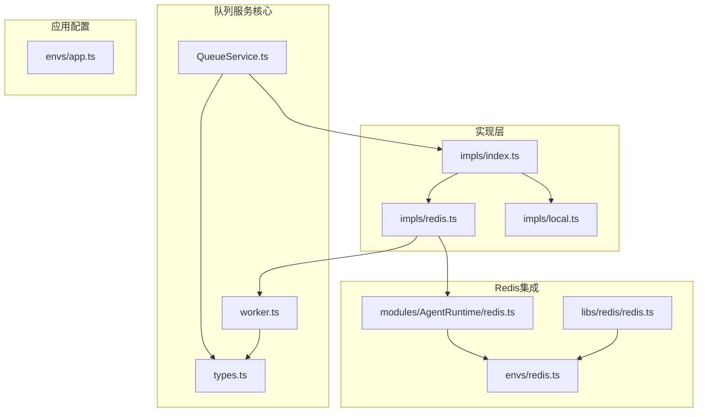
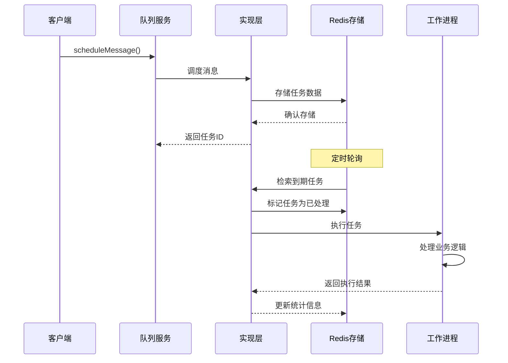
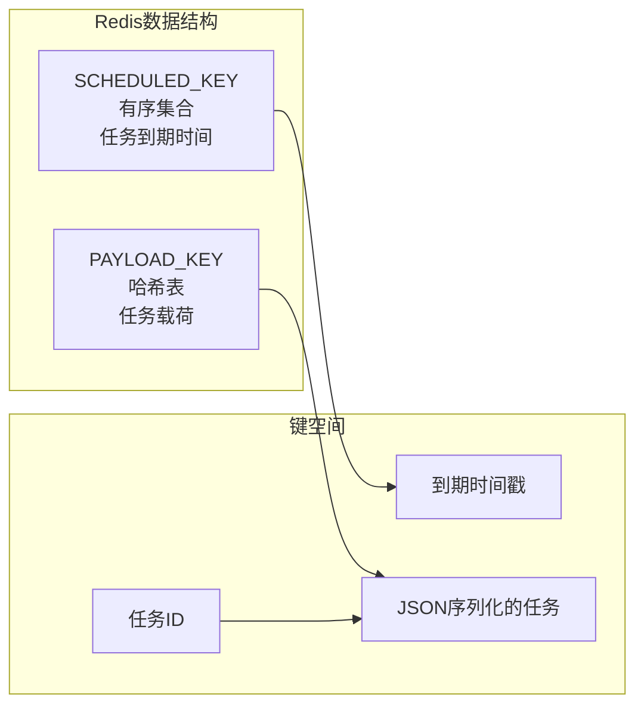
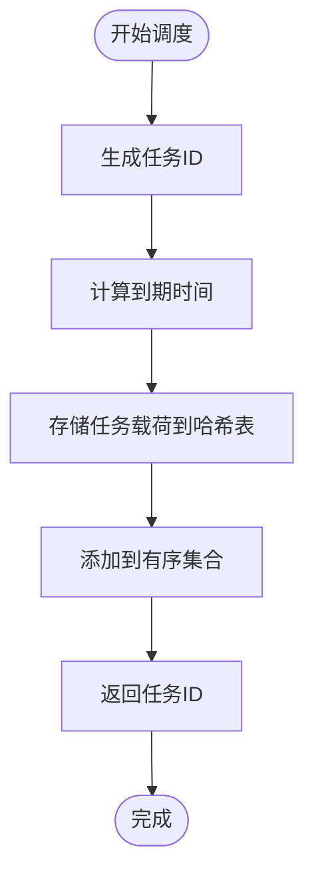
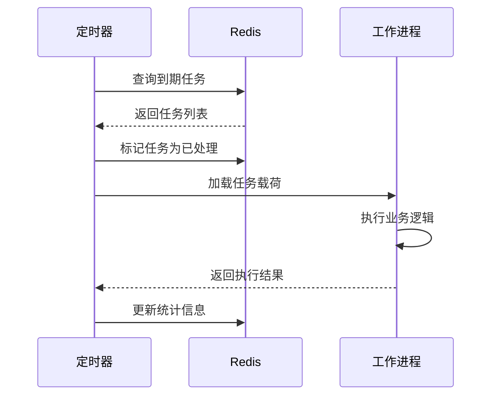
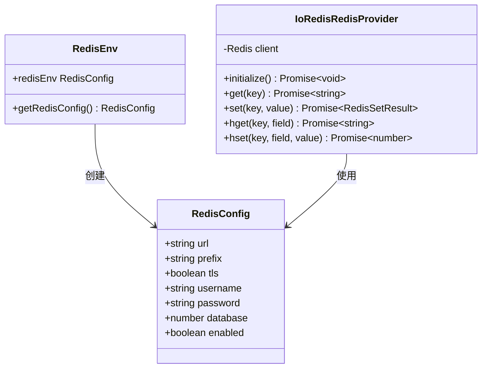
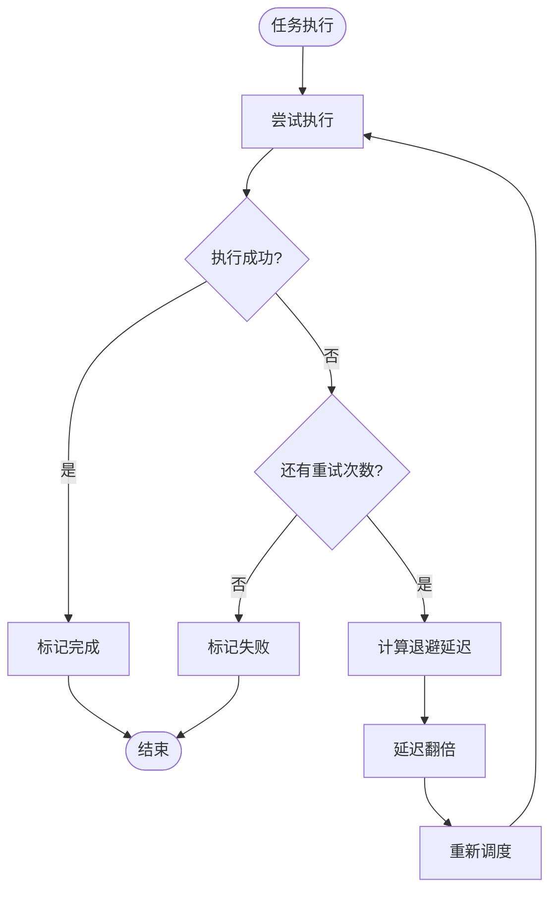
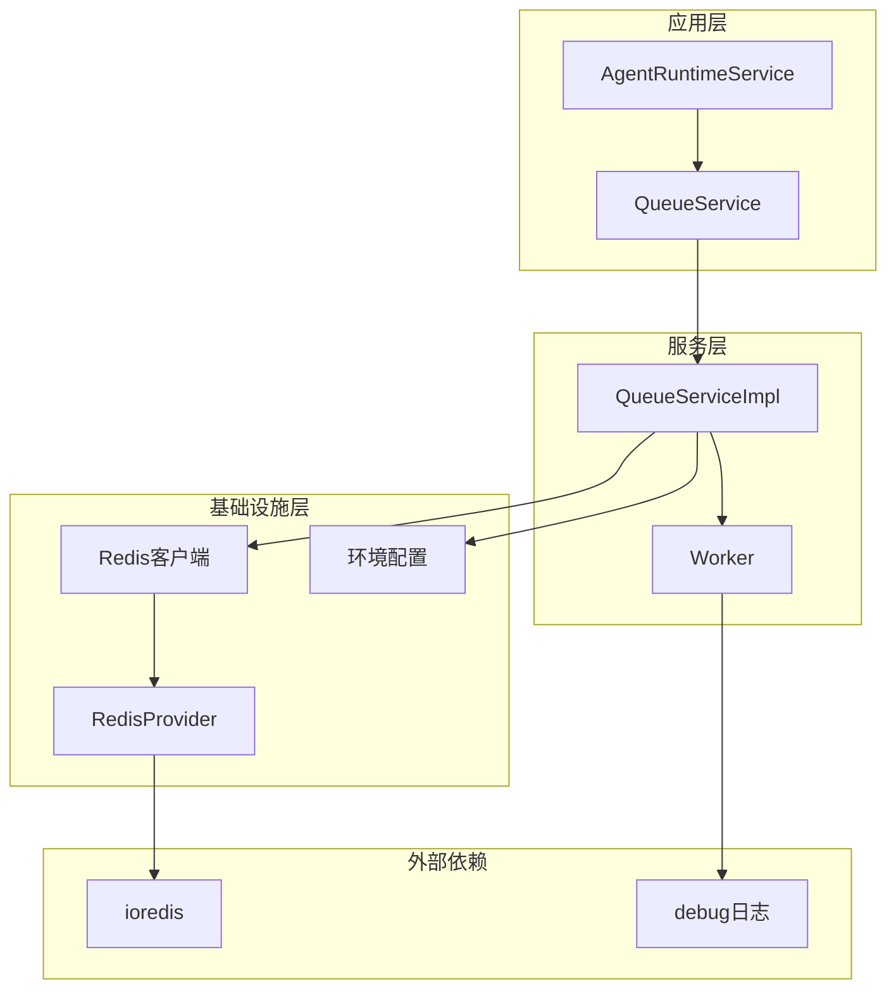

# Redis队列系统

<cite>
**本文档引用的文件**
- [src/server/services/queue/impls/redis.ts](file://src/server/services/queue/impls/redis.ts)
- [src/server/services/queue/impls/local.ts](file://src/server/services/queue/impls/local.ts)
- [src/server/services/queue/impls/index.ts](file://src/server/services/queue/impls/index.ts)
- [src/server/services/queue/QueueService.ts](file://src/server/services/queue/QueueService.ts)
- [src/server/services/queue/worker.ts](file://src/server/services/queue/worker.ts)
- [src/server/services/queue/types.ts](file://src/server/services/queue/types.ts)
- [src/server/modules/AgentRuntime/redis.ts](file://src/server/modules/AgentRuntime/redis.ts)
- [src/envs/redis.ts](file://src/envs/redis.ts)
- [src/envs/app.ts](file://src/envs/app.ts)
- [src/libs/redis/redis.ts](file://src/libs/redis/redis.ts)
- [src/server/services/queue/__tests__/QueueService.test.ts](file://src/server/services/queue/__tests__/QueueService.test.ts)
</cite>

## 目录
1. [简介](#简介)
2. [项目结构](#项目结构)
3. [核心组件](#核心组件)
4. [架构概览](#架构概览)
5. [详细组件分析](#详细组件分析)
6. [依赖关系分析](#依赖关系分析)
7. [性能考虑](#性能考虑)
8. [故障排除指南](#故障排除指南)
9. [结论](#结论)

## 简介

Redis队列系统是LobeHub项目中的一个关键组件，用于处理异步任务调度和执行。该系统提供了两种执行模式：本地模式（开发环境）和Redis队列模式（生产环境）。系统基于Redis的有序集合（Sorted Set）和哈希表（Hash）实现任务的持久化存储和调度。

该队列系统主要用于代理运行时（Agent Runtime）的任务调度，支持延迟执行、重试机制、健康检查等功能。通过模块化设计，系统可以在不同环境中灵活切换执行策略。

## 项目结构

Redis队列系统主要位于以下目录结构中：

**图表来源**
- [src/server/services/queue/QueueService.ts:1-47](file://src/server/services/queue/QueueService.ts#L1-L47)
- [src/server/services/queue/impls/index.ts:1-35](file://src/server/services/queue/impls/index.ts#L1-L35)
- [src/server/modules/AgentRuntime/redis.ts:1-107](file://src/server/modules/AgentRuntime/redis.ts#L1-L107)

**章节来源**
- [src/server/services/queue/impls/redis.ts:1-175](file://src/server/services/queue/impls/redis.ts#L1-L175)
- [src/server/services/queue/impls/local.ts:1-108](file://src/server/services/queue/impls/local.ts#L1-L108)
- [src/server/services/queue/impls/index.ts:1-35](file://src/server/services/queue/impls/index.ts#L1-L35)

## 核心组件

### QueueService类

QueueService是队列系统的主要入口点，采用装饰器模式提供统一的接口。它根据环境配置动态选择执行实现：

- **本地模式**：使用LocalQueueServiceImpl，基于setTimeout实现异步执行
- **Redis模式**：使用RedisQueueServiceImpl，基于Redis实现持久化调度

### RedisQueueServiceImpl实现

Redis实现提供了完整的队列功能：

- **任务存储**：使用Redis有序集合存储待执行任务，按到期时间排序
- **负载均衡**：通过轮询机制在多个工作进程间分配任务
- **错误处理**：支持任务重试和失败统计
- **健康监控**：提供Redis连接状态检查

### LocalQueueServiceImpl实现

本地实现适用于开发环境：

- **内存调度**：使用setTimeout进行本地任务调度
- **简单可靠**：无需外部依赖，适合单机部署
- **调试友好**：便于开发和测试环境使用

**章节来源**
- [src/server/services/queue/QueueService.ts:1-47](file://src/server/services/queue/QueueService.ts#L1-L47)
- [src/server/services/queue/impls/redis.ts:24-175](file://src/server/services/queue/impls/redis.ts#L24-L175)
- [src/server/services/queue/impls/local.ts:17-108](file://src/server/services/queue/impls/local.ts#L17-L108)

## 架构概览

Redis队列系统采用分层架构设计，确保了良好的可扩展性和可维护性：

**图表来源**
- [src/server/services/queue/impls/redis.ts:109-173](file://src/server/services/queue/impls/redis.ts#L109-L173)
- [src/server/services/queue/worker.ts:36-62](file://src/server/services/queue/worker.ts#L36-L62)

系统的核心特性包括：

1. **双模式支持**：根据环境变量自动切换执行模式
2. **持久化存储**：所有任务状态都存储在Redis中
3. **错误恢复**：支持任务重试和失败处理
4. **监控统计**：提供详细的队列状态和性能指标

## 详细组件分析

### Redis队列实现详解

RedisQueueServiceImpl是系统的核心组件，实现了完整的队列管理功能：

#### 数据结构设计

系统使用两个主要的Redis数据结构：

**图表来源**
- [src/server/services/queue/impls/redis.ts:11-15](file://src/server/services/queue/impls/redis.ts#L11-L15)

#### 任务调度流程

**图表来源**
- [src/server/services/queue/impls/redis.ts:72-83](file://src/server/services/queue/impls/redis.ts#L72-L83)

#### 轮询执行机制

系统通过定时器实现任务轮询：

**图表来源**
- [src/server/services/queue/impls/redis.ts:109-173](file://src/server/services/queue/impls/redis.ts#L109-L173)

### 配置管理系统

系统通过多层配置实现灵活的环境适配：

#### 应用环境配置

应用级别的配置主要通过环境变量控制：

| 配置项 | 类型 | 默认值 | 描述 |
|--------|------|--------|------|
| AGENT_RUNTIME_MODE | string | 'local' | 运行模式：'queue'启用Redis队列 |
| REDIS_URL | string | - | Redis服务器连接URL |
| REDIS_PREFIX | string | 'lobechat' | Redis键前缀 |
| REDIS_TLS | boolean | false | 是否启用TLS加密 |

#### Redis连接配置

**图表来源**
- [src/envs/redis.ts:45-64](file://src/envs/redis.ts#L45-L64)
- [src/libs/redis/redis.ts:18-40](file://src/libs/redis/redis.ts#L18-L40)

**章节来源**
- [src/envs/app.ts:78-84](file://src/envs/app.ts#L78-L84)
- [src/envs/redis.ts:21-41](file://src/envs/redis.ts#L21-L41)
- [src/libs/redis/redis.ts:18-144](file://src/libs/redis/redis.ts#L18-L144)

### 错误处理和重试机制

系统实现了完善的错误处理和重试策略：

#### 重试算法

**图表来源**
- [src/server/services/queue/impls/redis.ts:149-158](file://src/server/services/queue/impls/redis.ts#L149-L158)

#### 锁定机制

系统支持任务锁定功能，防止并发执行：

- **锁定状态**：当任务执行被锁定时，系统会自动重调度
- **重试延迟**：锁定重试使用固定的延迟时间
- **状态跟踪**：通过pendingExecutions集合跟踪进行中的任务

**章节来源**
- [src/server/services/queue/impls/redis.ts:136-168](file://src/server/services/queue/impls/redis.ts#L136-L168)
- [src/server/services/queue/worker.ts:32-62](file://src/server/services/queue/worker.ts#L32-L62)

## 依赖关系分析

Redis队列系统的依赖关系呈现清晰的分层结构：

**图表来源**
- [src/server/services/queue/QueueService.ts:13-18](file://src/server/services/queue/QueueService.ts#L13-L18)
- [src/server/modules/AgentRuntime/redis.ts:86-94](file://src/server/modules/AgentRuntime/redis.ts#L86-L94)

### 关键依赖关系

1. **QueueService → QueueServiceImpl**：通过工厂方法创建具体实现
2. **RedisQueueServiceImpl → AgentRuntimeService**：执行具体的业务逻辑
3. **RedisQueueServiceImpl → Redis客户端**：持久化存储和状态管理
4. **环境配置 → Redis配置**：运行时配置注入

### 循环依赖检测

系统设计避免了循环依赖：
- 接口层定义清晰，实现层依赖接口而非具体类
- Redis客户端通过模块化方式注入
- 配置系统独立于业务逻辑

**章节来源**
- [src/server/services/queue/impls/index.ts:1-35](file://src/server/services/queue/impls/index.ts#L1-L35)
- [src/server/modules/AgentRuntime/redis.ts:1-107](file://src/server/modules/AgentRuntime/redis.ts#L1-L107)

## 性能考虑

Redis队列系统在设计时充分考虑了性能优化：

### 内存使用优化

- **批量操作**：使用Redis MULTI命令减少网络往返
- **延迟加载**：任务载荷只在需要时从Redis读取
- **内存清理**：及时删除已处理的任务数据

### 并发处理

- **无锁设计**：通过Redis原子操作保证数据一致性
- **批处理**：每次轮询处理固定数量的任务
- **异步执行**：任务执行不阻塞主轮询线程

### 缓存策略

- **连接池**：复用Redis连接，减少连接开销
- **键前缀**：使用命名空间隔离不同服务的数据
- **TTL设置**：为临时数据设置过期时间

## 故障排除指南

### 常见问题诊断

#### Redis连接问题

**症状**：队列服务初始化失败或健康检查失败

**排查步骤**：
1. 检查REDIS_URL环境变量配置
2. 验证Redis服务器可达性
3. 确认认证凭据正确性
4. 检查网络防火墙设置

**解决方案**：
- 使用正确的Redis连接URL格式
- 配置适当的超时参数
- 启用TLS连接（推荐）

#### 任务积压问题

**症状**：队列中任务长时间未处理

**排查步骤**：
1. 检查轮询间隔设置
2. 分析任务处理时间
3. 监控Redis内存使用情况
4. 检查工作进程状态

**解决方案**：
- 增加工作进程数量
- 优化任务处理逻辑
- 调整批处理大小

#### 重试循环问题

**症状**：任务持续重试但无法完成

**排查步骤**：
1. 检查任务错误日志
2. 验证依赖服务可用性
3. 分析资源限制情况
4. 检查数据库连接状态

**解决方案**：
- 实施指数退避策略
- 添加最大重试次数限制
- 实现熔断机制

**章节来源**
- [src/server/services/queue/impls/redis.ts:59-66](file://src/server/services/queue/impls/redis.ts#L59-L66)
- [src/server/services/queue/__tests__/QueueService.test.ts:131-163](file://src/server/services/queue/__tests__/QueueService.test.ts#L131-L163)

## 结论

Redis队列系统为LobeHub提供了强大而灵活的任务调度能力。通过模块化设计，系统能够在不同的部署环境中无缝切换执行模式，既满足了开发环境的便利性要求，又保证了生产环境的可靠性。

### 主要优势

1. **双模式支持**：灵活的执行模式切换
2. **持久化存储**：基于Redis的可靠数据存储
3. **错误恢复**：完善的重试和故障转移机制
4. **监控统计**：全面的性能指标和状态监控
5. **易于扩展**：清晰的架构设计便于功能扩展

### 最佳实践建议

1. **生产环境配置**：确保Redis集群的高可用性
2. **监控告警**：建立完善的队列状态监控体系
3. **性能调优**：根据业务需求调整批处理大小和轮询频率
4. **安全配置**：启用TLS加密和适当的访问控制
5. **容量规划**：合理评估Redis内存和CPU资源需求

该系统为LobeHub的代理运行时提供了坚实的基础设施支持，是构建高性能AI应用的重要组成部分。