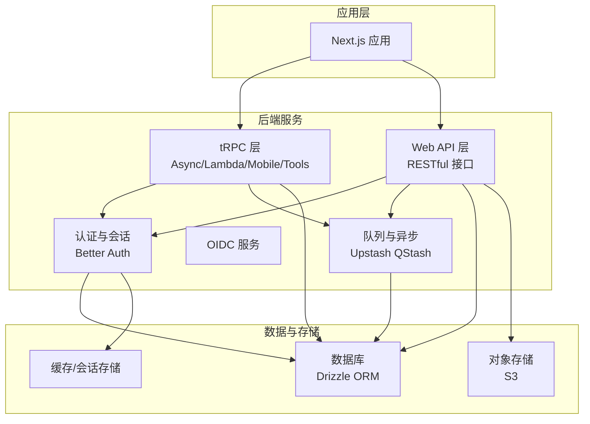
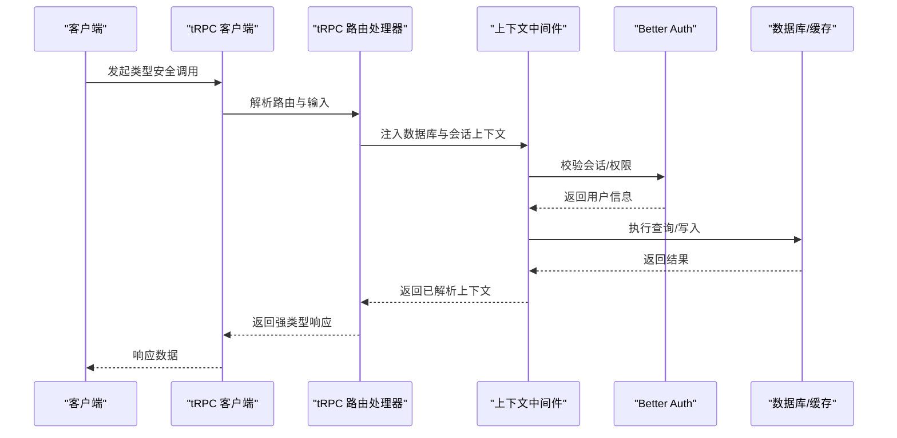
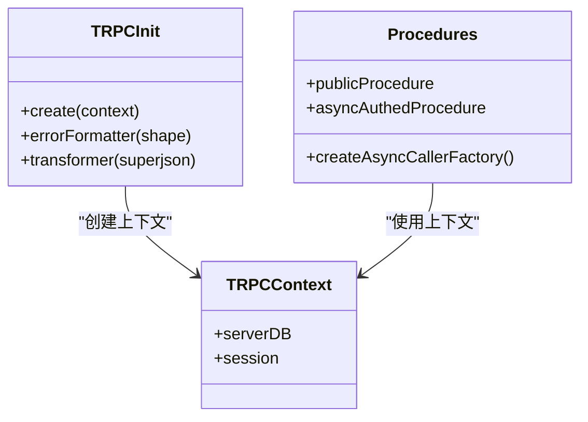
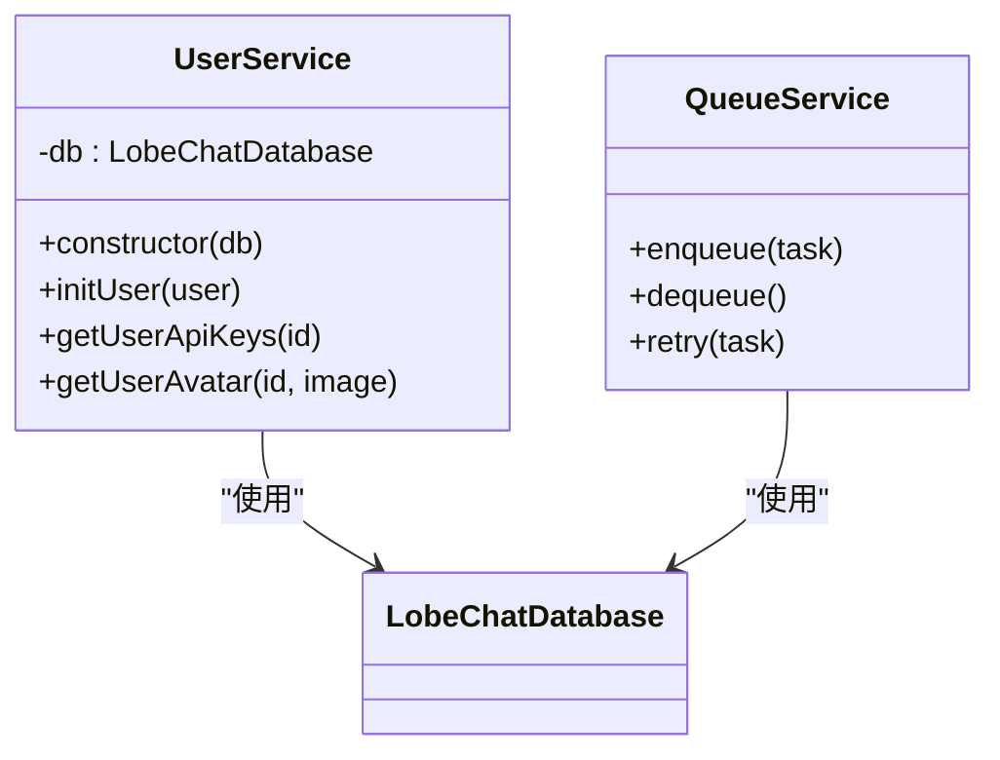
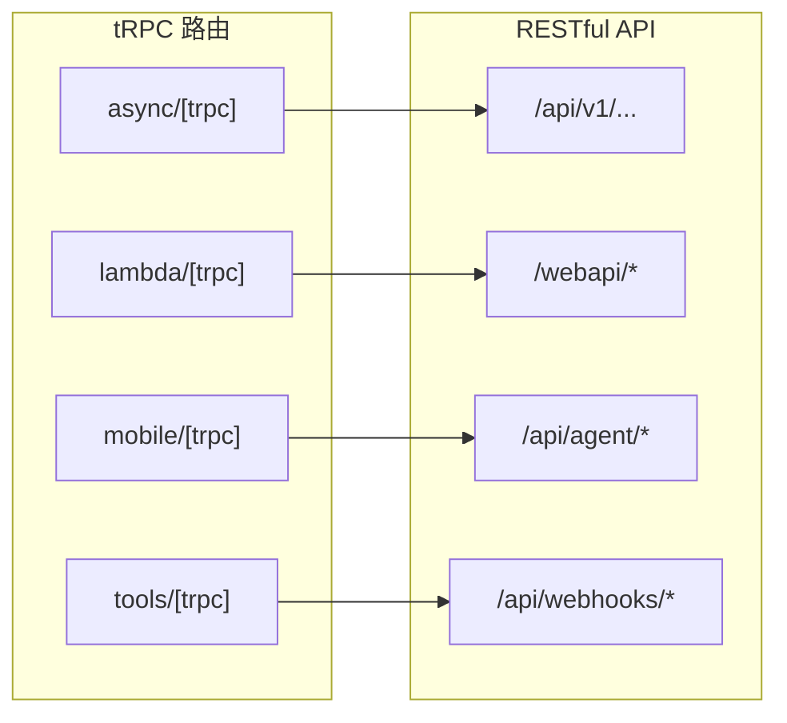
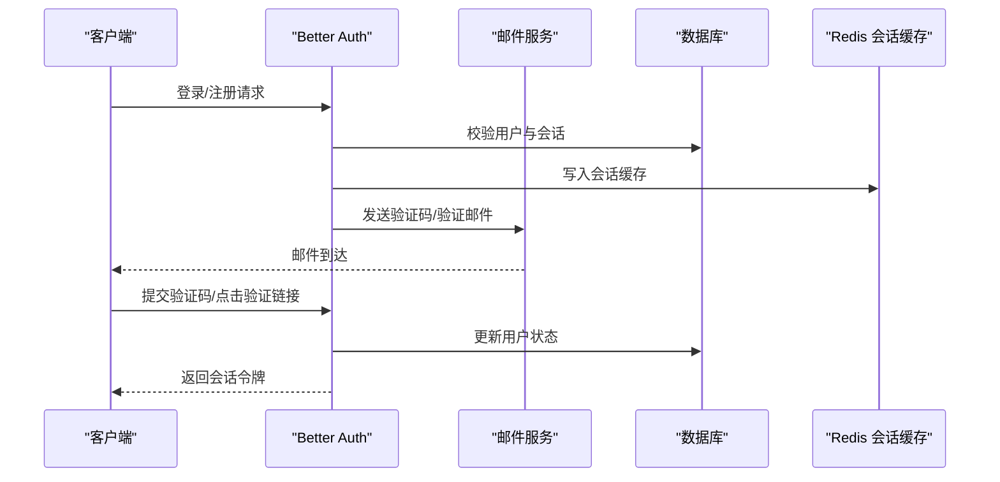
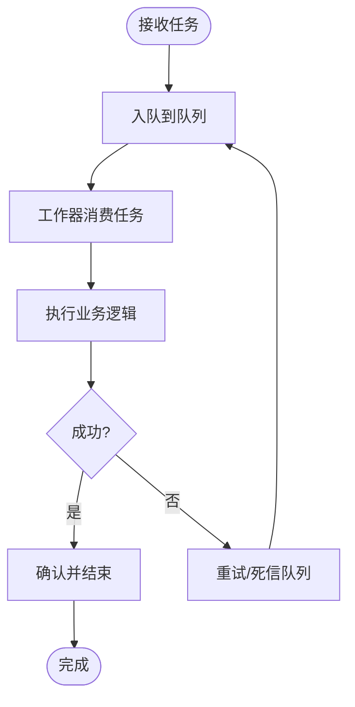
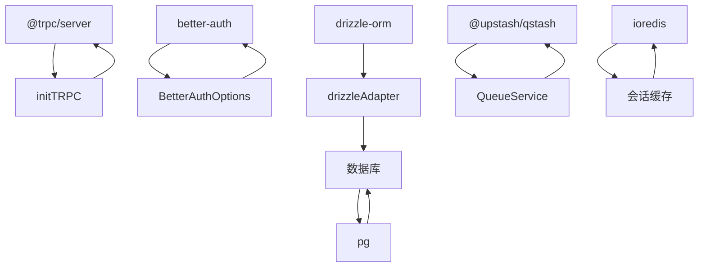

# 后端架构设计

<cite>
**本文引用的文件**
- [package.json](file://package.json)
- [src/auth.ts](file://src/auth.ts)
- [src/libs/better-auth/define-config.ts](file://src/libs/better-auth/define-config.ts)
- [src/libs/trpc/async/index.ts](file://src/libs/trpc/async/index.ts)
- [src/libs/trpc/async/init.ts](file://src/libs/trpc/async/init.ts)
- [src/server/services/user/index.ts](file://src/server/services/user/index.ts)
- [src/app/(backend)/trpc/async/[trpc]/route.ts](file://src/app/(backend)/trpc/async/[trpc]/route.ts)
- [src/app/(backend)/trpc/lambda/[trpc]/route.ts](file://src/app/(backend)/trpc/lambda/[trpc]/route.ts)
- [src/app/(backend)/trpc/mobile/[trpc]/route.ts](file://src/app/(backend)/trpc/mobile/[trpc]/route.ts)
- [src/app/(backend)/trpc/tools/[trpc]/route.ts](file://src/app/(backend)/trpc/tools/[trpc]/route.ts)
- [src/libs/trpc/lambda/index.ts](file://src/libs/trpc/lambda/index.ts)
- [src/libs/trpc/lambda/context.ts](file://src/libs/trpc/lambda/context.ts)
- [src/libs/trpc/lambda/context.test.ts](file://src/libs/trpc/lambda/context.test.ts)
- [src/libs/trpc/async/context.ts](file://src/libs/trpc/async/context.ts)
- [src/libs/trpc/client/index.ts](file://src/libs/trpc/client/index.ts)
- [src/libs/trpc/client/async.ts](file://src/libs/trpc/client/async.ts)
- [src/libs/trpc/client/lambda.ts](file://src/libs/trpc/client/lambda.ts)
- [src/libs/trpc/client/tools.ts](file://src/libs/trpc/client/tools.ts)
- [src/server/services/queue/QueueService.ts](file://src/server/services/queue/QueueService.ts)
- [src/server/services/queue/types.ts](file://src/server/services/queue/types.ts)
- [src/server/services/queue/impls/](file://src/server/services/queue/impls/)
- [src/server/services/oidc/index.ts](file://src/server/services/oidc/index.ts)
- [src/server/services/oidc/oidcProvider.ts](file://src/server/services/oidc/oidcProvider.ts)
- [src/app/(backend)/api/v1/[[...route]]/route.ts](file://src/app/(backend)/api/v1/[[...route]]/route.ts)
- [src/app/(backend)/webapi/chat/[provider]/route.ts](file://src/app/(backend)/webapi/chat/[provider]/route.ts)
- [src/app/(backend)/webapi/models/[provider]/route.ts](file://src/app/(backend)/webapi/models/[provider]/route.ts)
- [src/app/(backend)/webapi/proxy/route.ts](file://src/app/(backend)/webapi/proxy/route.ts)
- [src/app/(backend)/webapi/revalidate/route.ts](file://src/app/(backend)/webapi/revalidate/route.ts)
- [src/app/(backend)/webapi/tts/openai/route.ts](file://src/app/(backend)/webapi/tts/openai/route.ts)
- [src/app/(backend)/webapi/stt/openai/route.ts](file://src/app/(backend)/webapi/stt/openai/route.ts)
- [src/app/(backend)/webapi/plugin/gateway/route.ts](file://src/app/(backend)/webapi/plugin/gateway/route.ts)
- [src/app/(backend)/webapi/create-image/comfyui/route.ts](file://src/app/(backend)/webapi/create-image/comfyui/route.ts)
- [src/app/(backend)/webapi/trace/route.ts](file://src/app/(backend)/webapi/trace/route.ts)
- [src/app/(backend)/webapi/user/avatar/[id]/[image]/route.ts](file://src/app/(backend)/webapi/user/avatar/[id]/[image]/route.ts)
- [src/app/(backend)/api/auth/check-user/route.ts](file://src/app/(backend)/api/auth/check-user/route.ts)
- [src/app/(backend)/api/auth/resolve-username/route.ts](file://src/app/(backend)/api/auth/resolve-username/route.ts)
- [src/app/(backend)/api/agent/route.ts](file://src/app/(backend)/api/agent/route.ts)
- [src/app/(backend)/api/agent/run/route.ts](file://src/app/(backend)/api/agent/run/route.ts)
- [src/app/(backend)/api/agent/stream/route.ts](file://src/app/(backend)/api/agent/stream/route.ts)
- [src/app/(backend)/api/agent/webhooks/[...]/route.ts](file://src/app/(backend)/api/agent/webhooks/[...]/route.ts)
- [src/app/(backend)/api/version/route.ts](file://src/app/(backend)/api/version/route.ts)
- [src/app/(backend)/api/webhooks/logto/[...]/route.ts](file://src/app/(backend)/api/webhooks/logto/[...]/route.ts)
- [src/app/(backend)/api/webhooks/casdoor/[...]/route.ts](file://src/app/(backend)/api/webhooks/casdoor/[...]/route.ts)
- [src/app/(backend)/api/webhooks/memory-extraction/[...]/route.ts](file://src/app/(backend)/api/webhooks/memory-extraction/[...]/route.ts)
- [src/app/(backend)/api/webhooks/video/[provider]/route.ts](file://src/app/(backend)/api/webhooks/video/[provider]/route.ts)
- [src/app/(backend)/api/workflows/agent-eval-run/[...]/route.ts](file://src/app/(backend)/api/workflows/agent-eval-run/[...]/route.ts)
- [src/app/(backend)/api/workflows/memory-user-memory/[...]/route.ts](file://src/app/(backend)/api/workflows/memory-user-memory/[...]/route.ts)
- [src/app/(backend)/middleware/auth/index.ts](file://src/app/(backend)/middleware/auth/index.ts)
- [src/app/(backend)/middleware/auth/utils.ts](file://src/app/(backend)/middleware/auth/utils.ts)
- [src/app/(backend)/middleware/validate/createValidator.ts](file://src/app/(backend)/middleware/validate/createValidator.ts)
- [src/app/(backend)/middleware/validate/index.ts](file://src/app/(backend)/middleware/validate/index.ts)
- [src/app/(backend)/middleware/validate/createValidator.test.ts](file://src/app/(backend)/middleware/validate/createValidator.test.ts)
- [src/app/(backend)/oidc/callback/desktop/route.ts](file://src/app/(backend)/oidc/callback/desktop/route.ts)
- [src/app/(backend)/oidc/consent/route.ts](file://src/app/(backend)/oidc/consent/route.ts)
- [src/app/(backend)/oidc/handoff/route.ts](file://src/app/(backend)/oidc/handoff/route.ts)
- [src/app/(backend)/oidc/[...oidc]/route.ts](file://src/app/(backend)/oidc/[...oidc]/route.ts)
- [src/libs/better-auth/sso/index.ts](file://src/libs/better-auth/sso/index.ts)
- [src/libs/better-auth/email-templates/index.ts](file://src/libs/better-auth/email-templates/index.ts)
- [src/libs/better-auth/plugins/email-whitelist/index.ts](file://src/libs/better-auth/plugins/email-whitelist/index.ts)
- [src/libs/better-auth/utils/config.ts](file://src/libs/better-auth/utils/config.ts)
- [src/libs/better-auth/utils/server.ts](file://src/libs/better-auth/utils/server.ts)
- [src/libs/better-auth/define-config.ts](file://src/libs/better-auth/define-config.ts)
- [src/libs/better-auth/define-config.ts](file://src/libs/better-auth/define-config.ts)
- [src/libs/better-auth/define-config.ts](file://src/libs/better-auth/define-config.ts)
- [src/libs/better-auth/define-config.ts](file://src/libs/better-auth/define-config.ts)
- [src/libs/better-auth/define-config.ts](file://src/libs/better-auth/define-config.ts)
- [src/libs/better-auth/define-config.ts](file://src/libs/better-auth/define-config.ts)
- [src/libs/better-auth/define-config.ts](file://src/libs/better-auth/define-config.ts)
- [src/libs/better-auth/define-config.ts](file://src/libs/better-auth/define-config.ts)
- [src/libs/better-auth/define-config.ts](file://src/libs/better-auth/define-config.ts)
- [src/libs/better-auth/define-config.ts](file://src/libs/better-auth/define-config.ts)
- [src/libs/better-auth/define-config.ts](file://src/libs/better-auth/define-config.ts)
- [src/libs/better-auth/define-config.ts](file://src/libs/better-auth/define-config.ts)
- [src/libs/better-auth/define-config.ts](file://src/libs/better-auth/define-config.ts)
- [src/libs/better-auth/define-config.ts](file://src/libs/better-auth/define-config.ts)
- [src/libs/better-auth/define-config.ts](file://src/libs/better-auth/define-config.ts)
- [src/libs/better-auth/define-config.ts](file://src/libs/better-auth/define-config.ts)
- [src/libs/better-auth/define-config.ts](file://src/libs/better-auth/define-config.ts)
- [src/libs/better-auth/define-config.ts](file://src/libs/better-auth/define-config.ts)
- [src/libs/better-auth/define-config.ts](file://src/libs/better-auth/define-config.ts)
- [src/libs/better-auth/define-config.ts](file://src/libs/better-auth/define-config.ts)
- [src/libs/better-auth/define-config.ts](file://src/libs/better-auth/define-config.ts)
- [src/libs/better-auth/define-config.ts](file://src/libs......)
</cite>

## 目录
1. [简介](#简介)
2. [项目结构](#项目结构)
3. [核心组件](#核心组件)
4. [架构总览](#架构总览)
5. [详细组件分析](#详细组件分析)
6. [依赖关系分析](#依赖关系分析)
7. [性能考量](#性能考量)
8. [故障排查指南](#故障排查指南)
9. [结论](#结论)
10. [附录](#附录)

## 简介
本文件面向 LobeHub 项目的后端架构设计，重点覆盖以下方面：
- tRPC 类型安全的客户端-服务器通信与过程边界设计
- 服务层架构（业务逻辑封装、依赖注入、事务管理）
- API 接口设计（RESTful API 与 tRPC 接口的统一设计）
- 认证授权机制（Better Auth 集成、OIDC/OAuth 支持）
- 异步任务处理、队列系统、缓存策略等后端核心组件设计

## 项目结构
LobeHub 采用多包工作区与 Next.js 应用混合的组织方式，后端核心由以下模块构成：
- 认证与会话：Better Auth 配置与插件体系
- tRPC 层：统一的类型安全 RPC 框架，支持多运行时（Async、Lambda、Mobile、Tools）
- 服务层：按领域划分的服务类，封装业务逻辑与外部集成
- Web API：传统 RESTful 接口，用于代理、网关、工具链等场景
- 中间件：鉴权、参数校验、请求上下文注入
- OIDC：完整的 OpenID Connect 流程支持
- 队列与异步：基于 Upstash QStash 的异步任务与工作流

图表来源
- [src/libs/trpc/async/index.ts](file://src/libs/trpc/async/index.ts#L1-L34)
- [src/libs/trpc/async/init.ts](file://src/libs/trpc/async/init.ts#L1-L20)
- [src/libs/better-auth/define-config.ts](file://src/libs/better-auth/define-config.ts#L1-L333)
- [src/server/services/queue/QueueService.ts](file://src/server/services/queue/QueueService.ts)
- [src/app/(backend)/webapi/proxy/route.ts](file://src/app/(backend)/webapi/proxy/route.ts)

章节来源
- [package.json](file://package.json#L1-L517)

## 核心组件
- tRPC 类型安全 RPC：通过 initTRPC 创建上下文与序列化器，提供 procedure、router、中间件与调用工厂，确保客户端与服务端共享类型定义，减少运行时错误。
- Better Auth 认证：集中式配置账号策略、密码验证、邮件模板、会话缓存、二次存储（Redis）、速率限制与多种登录插件（邮箱、魔法链接、邮箱 OTP、Passkey、通用 OAuth）。
- 服务层：以领域服务为核心，如用户服务、队列服务、OIDC 服务等，封装业务规则与外部依赖，便于测试与复用。
- Web API：面向代理、网关、TTS/STT、图像生成等场景的 RESTful 接口，与 tRPC 协同工作。
- 中间件：统一鉴权与参数校验，注入数据库连接与会话信息到请求上下文。
- 队列与异步：基于 Upstash QStash 的消息队列与工作流，支持幂等与重试。

章节来源
- [src/libs/trpc/async/index.ts](file://src/libs/trpc/async/index.ts#L1-L34)
- [src/libs/trpc/async/init.ts](file://src/libs/trpc/async/init.ts#L1-L20)
- [src/libs/better-auth/define-config.ts](file://src/libs/better-auth/define-config.ts#L1-L333)
- [src/server/services/user/index.ts](file://src/server/services/user/index.ts#L1-L73)

## 架构总览
下图展示从客户端到后端服务的整体交互路径，涵盖 tRPC 调用、Better Auth 鉴权、数据库访问与外部服务集成。

图表来源
- [src/libs/trpc/async/index.ts](file://src/libs/trpc/async/index.ts#L14-L31)
- [src/libs/better-auth/define-config.ts](file://src/libs/better-auth/define-config.ts#L174-L184)
- [src/libs/trpc/async/context.ts](file://src/libs/trpc/async/context.ts)

## 详细组件分析

### tRPC 架构设计
- 类型安全通信：通过 initTRPC 创建上下文类型与序列化器，确保客户端与服务端共享类型定义，避免运行时类型不匹配。
- 过程边界定义：使用 procedure/router 组织业务过程，结合中间件注入数据库连接与认证上下文，形成清晰的调用边界。
- 错误处理策略：自定义 errorFormatter 输出统一错误形状，便于前端一致化处理；结合速率限制与异常捕获，提升稳定性。

图表来源
- [src/libs/trpc/async/init.ts](file://src/libs/trpc/async/init.ts#L11-L17)
- [src/libs/trpc/async/index.ts](file://src/libs/trpc/async/index.ts#L10-L33)

章节来源
- [src/libs/trpc/async/init.ts](file://src/libs/trpc/async/init.ts#L1-L20)
- [src/libs/trpc/async/index.ts](file://src/libs/trpc/async/index.ts#L1-L34)

### 服务层架构
- 业务逻辑封装：以领域服务为核心，如用户服务负责新用户初始化、分析埋点与头像获取；队列服务负责任务编排与执行。
- 依赖注入：构造函数注入数据库连接与外部模块（如 S3、加密门禁），便于替换与测试。
- 事务管理：通过 Drizzle Adapter 提供的数据库适配器与 hooks，在用户创建等关键流程中保证一致性。

图表来源
- [src/server/services/user/index.ts](file://src/server/services/user/index.ts#L20-L72)
- [src/server/services/queue/QueueService.ts](file://src/server/services/queue/QueueService.ts)

章节来源
- [src/server/services/user/index.ts](file://src/server/services/user/index.ts#L1-L73)

### API 接口设计（RESTful 与 tRPC 统一）
- RESTful API：提供代理、网关、TTS/STT、图像生成、用户头像等接口，便于第三方集成与浏览器直连。
- tRPC 接口：统一在 app/(backend)/trpc 下提供 Async/Lambda/Mobile/Tools 四套路由，分别适配不同运行时与客户端。
- 统一设计：两者共享认证与上下文，确保一致的鉴权与日志记录。

图表来源
- [src/app/(backend)/trpc/async/[trpc]/route.ts](file://src/app/(backend)/trpc/async/[trpc]/route.ts)
- [src/app/(backend)/trpc/lambda/[trpc]/route.ts](file://src/app/(backend)/trpc/lambda/[trpc]/route.ts)
- [src/app/(backend)/trpc/mobile/[trpc]/route.ts](file://src/app/(backend)/trpc/mobile/[trpc]/route.ts)
- [src/app/(backend)/trpc/tools/[trpc]/route.ts](file://src/app/(backend)/trpc/tools/[trpc]/route.ts)
- [src/app/(backend)/api/v1/[[...route]]/route.ts](file://src/app/(backend)/api/v1/[[...route]]/route.ts)
- [src/app/(backend)/webapi/chat/[provider]/route.ts](file://src/app/(backend)/webapi/chat/[provider]/route.ts)

章节来源
- [src/app/(backend)/trpc/async/[trpc]/route.ts](file://src/app/(backend)/trpc/async/[trpc]/route.ts)
- [src/app/(backend)/trpc/lambda/[trpc]/route.ts](file://src/app/(backend)/trpc/lambda/[trpc]/route.ts)
- [src/app/(backend)/trpc/mobile/[trpc]/route.ts](file://src/app/(backend)/trpc/mobile/[trpc]/route.ts)
- [src/app/(backend)/trpc/tools/[trpc]/route.ts](file://src/app/(backend)/trpc/tools/[trpc]/route.ts)
- [src/app/(backend)/api/v1/[[...route]]/route.ts](file://src/app/(backend)/api/v1/[[...route]]/route.ts)

### 认证授权机制（Better Auth 与 OIDC）
- Better Auth 集成：集中配置账号策略、密码验证兼容、邮件模板、会话缓存、二次存储与速率限制；启用邮箱白名单、邮箱 OTP、Passkey、通用 OAuth 与魔法链接插件。
- OIDC 支持：提供完整的 OIDC 流程，包括回调、同意页与设备端手递手流程，支持多种身份提供商。
- 插件扩展：通过 emailWhitelist、genericOAuth、admin 等插件扩展能力，满足企业级需求。

图表来源
- [src/libs/better-auth/define-config.ts](file://src/libs/better-auth/define-config.ts#L133-L172)
- [src/libs/better-auth/define-config.ts](file://src/libs/better-auth/define-config.ts#L262-L328)
- [src/app/(backend)/oidc/callback/desktop/route.ts](file://src/app/(backend)/oidc/callback/desktop/route.ts)
- [src/app/(backend)/oidc/consent/route.ts](file://src/app/(backend)/oidc/consent/route.ts)
- [src/app/(backend)/oidc/handoff/route.ts](file://src/app/(backend)/oidc/handoff/route.ts)

章节来源
- [src/libs/better-auth/define-config.ts](file://src/libs/better-auth/define-config.ts#L1-L333)
- [src/app/(backend)/oidc/[...oidc]/route.ts](file://src/app/(backend)/oidc/[...oidc]/route.ts)

### 异步任务处理、队列系统与缓存策略
- 队列系统：通过 QueueService 封装任务入队、出队与重试逻辑，支持多种实现（内存/Redis/Upstash），便于扩展与迁移。
- 缓存策略：Better Auth 使用 Cookie 缓存与 Redis 二次存储相结合，提升会话读取性能；tRPC 上下文中间件在请求生命周期内复用数据库连接。
- 异步处理：Web API 与 tRPC 可结合 Upstash QStash 实现异步任务编排与工作流，支持幂等与失败重试。

图表来源
- [src/server/services/queue/QueueService.ts](file://src/server/services/queue/QueueService.ts)
- [src/server/services/queue/types.ts](file://src/server/services/queue/types.ts)

章节来源
- [src/server/services/queue/QueueService.ts](file://src/server/services/queue/QueueService.ts)
- [src/server/services/queue/types.ts](file://src/server/services/queue/types.ts)

## 依赖关系分析
- 外部依赖：tRPC、Better Auth、Drizzle ORM、Upstash QStash、Redis、PostgreSQL 等。
- 内部依赖：服务层对数据库与外部模块的依赖通过构造函数注入，降低耦合度；tRPC 与 Web API 共享认证与上下文，保持一致性。

图表来源
- [package.json](file://package.json#L158-L403)
- [src/libs/trpc/async/init.ts](file://src/libs/trpc/async/init.ts#L1-L20)
- [src/libs/better-auth/define-config.ts](file://src/libs/better-auth/define-config.ts#L185-L189)
- [src/server/services/queue/QueueService.ts](file://src/server/services/queue/QueueService.ts)

章节来源
- [package.json](file://package.json#L158-L403)

## 性能考量
- 数据库连接池与上下文复用：tRPC 中间件在请求生命周期内建立并复用数据库连接，减少连接开销。
- 会话缓存：Better Auth 的 Cookie 缓存与 Redis 二次存储显著降低会话查询压力。
- 序列化优化：使用 superjson 进行复杂数据的序列化与反序列化，兼顾类型安全与传输效率。
- 异步解耦：通过队列与工作流将耗时操作异步化，避免阻塞主请求路径。

## 故障排查指南
- tRPC 错误格式化：检查 errorFormatter 是否正确输出错误形状，定位客户端错误处理问题。
- 认证失败：核对 Better Auth 的插件配置、邮件模板与二次存储设置，确认会话缓存是否生效。
- 队列异常：检查队列实现与重试策略，确认任务幂等性与死信队列配置。
- OIDC 回调：验证回调地址、同意页与手递手流程，确保提供商配置正确。

章节来源
- [src/libs/trpc/async/init.ts](file://src/libs/trpc/async/init.ts#L12-L15)
- [src/libs/better-auth/define-config.ts](file://src/libs/better-auth/define-config.ts#L174-L184)
- [src/server/services/queue/QueueService.ts](file://src/server/services/queue/QueueService.ts)

## 结论
LobeHub 的后端架构以 Better Auth 与 tRPC 为核心，结合服务层封装与 RESTful API，实现了类型安全、可扩展且高性能的后端系统。通过统一的认证与上下文、完善的队列与异步处理机制，以及对 OIDC 的完整支持，系统能够满足从个人到企业级的多样化需求。

## 附录
- 关键配置与环境变量：请参考 Better Auth 配置与 tRPC 初始化文件中的选项与默认值。
- 插件与扩展：通过插件体系扩展认证方式与业务能力，保持核心框架的简洁与稳定。