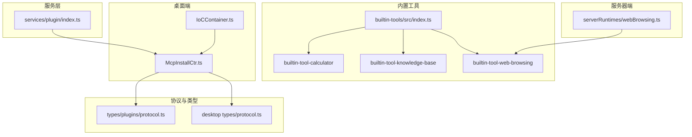
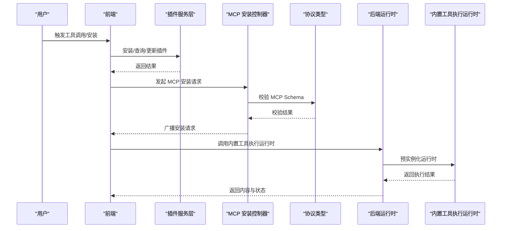
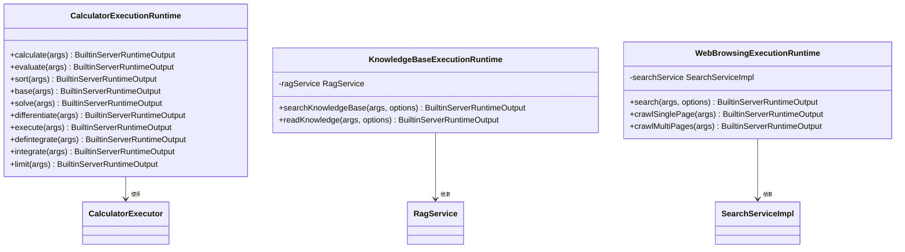
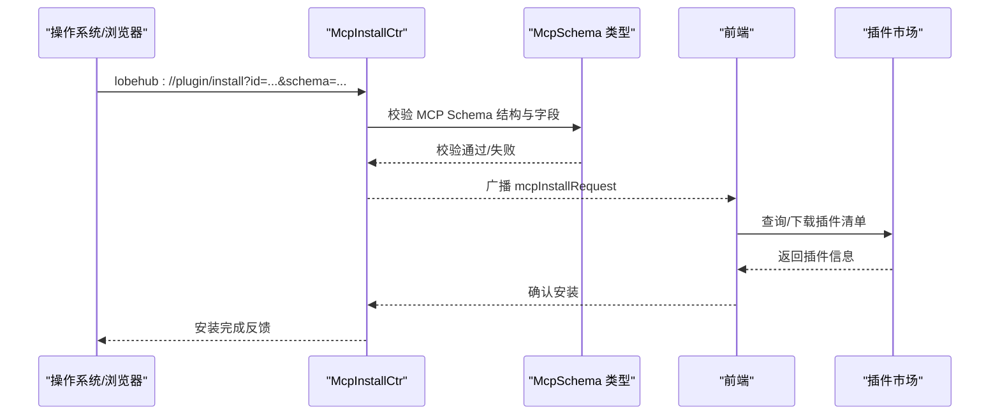
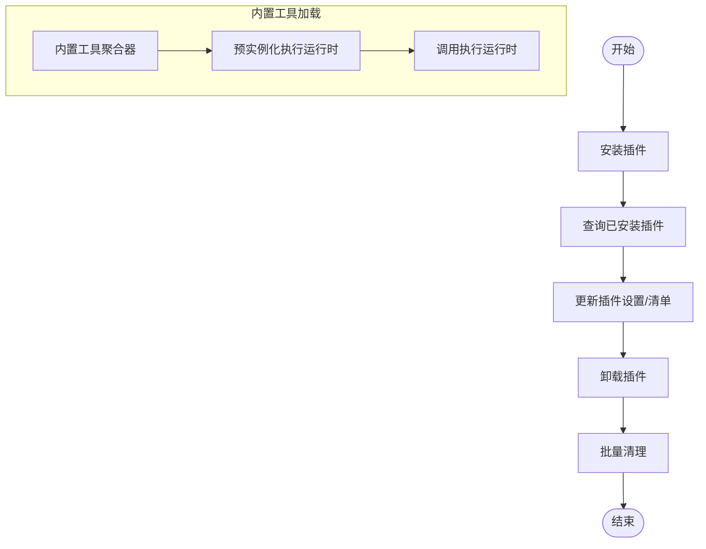
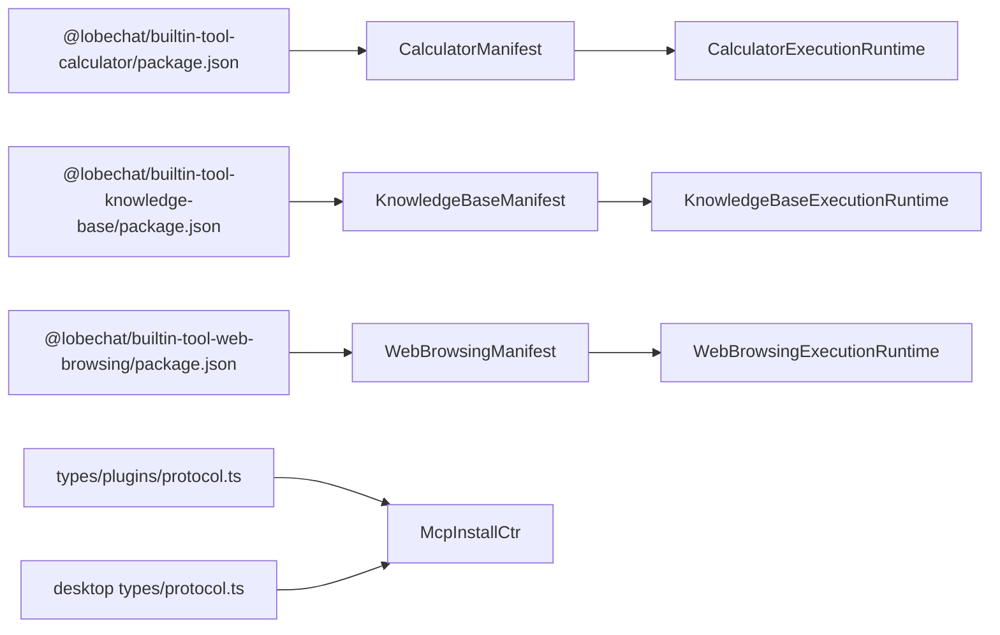

# 插件架构设计

<cite>
**本文引用的文件**
- [packages/builtin-tools/src/index.ts](file://packages/builtin-tools/src/index.ts)
- [packages/builtin-tool-calculator/src/index.ts](file://packages/builtin-tool-calculator/src/index.ts)
- [packages/builtin-tool-calculator/src/ExecutionRuntime/index.ts](file://packages/builtin-tool-calculator/src/ExecutionRuntime/index.ts)
- [packages/builtin-tool-knowledge-base/src/index.ts](file://packages/builtin-tool-knowledge-base/src/index.ts)
- [packages/builtin-tool-knowledge-base/src/ExecutionRuntime/index.ts](file://packages/builtin-tool-knowledge-base/src/ExecutionRuntime/index.ts)
- [packages/builtin-tool-web-browsing/src/index.ts](file://packages/builtin-tool-web-browsing/src/index.ts)
- [packages/builtin-tool-web-browsing/src/ExecutionRuntime/index.ts](file://packages/builtin-tool-web-browsing/src/ExecutionRuntime/index.ts)
- [src/services/plugin/index.ts](file://src/services/plugin/index.ts)
- [apps/desktop/src/main/controllers/McpInstallCtr.ts](file://apps/desktop/src/main/controllers/McpInstallCtr.ts)
- [apps/desktop/src/main/types/protocol.ts](file://apps/desktop/src/main/types/protocol.ts)
- [packages/types/src/plugins/protocol.ts](file://packages/types/src/plugins/protocol.ts)
- [packages/types/src/plugins/index.ts](file://packages/types/src/plugins/index.ts)
- [src/server/services/toolExecution/serverRuntimes/webBrowsing.ts](file://src/server/services/toolExecution/serverRuntimes/webBrowsing.ts)
- [src/store/chat/slices/builtinTool/actions/search.ts](file://src/store/chat/slices/builtinTool/actions/search.ts)
- [apps/desktop/src/main/core/infrastructure/IoCContainer.ts](file://apps/desktop/src/main/core/infrastructure/IoCContainer.ts)
- [apps/desktop/src/main/controllers/__tests__/McpInstallCtr.test.ts](file://apps/desktop/src/main/controllers/__tests__/McpInstallCtr.test.ts)
- [packages/builtin-tool-web-browsing/package.json](file://packages/builtin-tool-web-browsing/package.json)
- [packages/builtin-tool-calculator/package.json](file://packages/builtin-tool-calculator/package.json)
- [packages/builtin-tool-knowledge-base/package.json](file://packages/builtin-tool-knowledge-base/package.json)
</cite>

## 目录

1. [简介](#简介)
2. [项目结构](#项目结构)
3. [核心组件](#核心组件)
4. [架构总览](#架构总览)
5. [组件详解](#组件详解)
6. [依赖关系分析](#依赖关系分析)
7. [性能考量](#性能考量)
8. [故障排查指南](#故障排查指南)
9. [结论](#结论)
10. [附录](#附录)

## 简介

本设计文档面向 LobeHub 的插件体系，系统阐述插件生命周期管理、加载机制与依赖注入策略；解析内置工具插件（计算器、知识库、Web 浏览）的设计模式；说明第三方插件通过 MCP 协议的集成方式、插件市场与安装卸载流程、版本管理策略；并给出安全机制、沙箱执行与资源限制的设计建议。

## 项目结构

围绕插件系统的关键目录与文件如下：

- 内置工具聚合：packages/builtin-tools/src/index.ts 聚合所有内置工具清单与默认启用项
- 内置工具包：packages/builtin-tool-_/src/_ 提供各工具的清单、执行运行时与类型定义
- 插件服务层：src/services/plugin/index.ts 封装插件安装、卸载、更新等操作
- 桌面端 MCP 控制器：apps/desktop/src/main/controllers/McpInstallCtr.ts 处理 MCP 安装请求与校验
- 协议类型定义：packages/types/src/plugins/protocol.ts 与 apps/desktop/src/main/types/protocol.ts 统一 MCP Schema 与协议参数
- 服务器端运行时：src/server/services/toolExecution/serverRuntimes/webBrowsing.ts 预实例化 WebBrowsing 执行运行时
- 前端调用链：src/store/chat/slices/builtinTool/actions/search.ts 展示前端如何调用内置工具
- 依赖注入容器：apps/desktop/src/main/core/infrastructure/IoCContainer.ts 存储协议处理器元数据

图表来源

- [packages/builtin-tools/src/index.ts](file://packages/builtin-tools/src/index.ts#L1-L142)
- [packages/builtin-tool-calculator/src/index.ts](file://packages/builtin-tool-calculator/src/index.ts#L1-L15)
- [packages/builtin-tool-knowledge-base/src/index.ts](file://packages/builtin-tool-knowledge-base/src/index.ts#L1-L12)
- [packages/builtin-tool-web-browsing/src/index.ts](file://packages/builtin-tool-web-browsing/src/index.ts#L1-L4)
- [src/services/plugin/index.ts](file://src/services/plugin/index.ts#L1-L55)
- [apps/desktop/src/main/controllers/McpInstallCtr.ts](file://apps/desktop/src/main/controllers/McpInstallCtr.ts#L1-L153)
- [packages/types/src/plugins/protocol.ts](file://packages/types/src/plugins/protocol.ts#L1-L101)
- [apps/desktop/src/main/types/protocol.ts](file://apps/desktop/src/main/types/protocol.ts#L1-L60)
- [src/server/services/toolExecution/serverRuntimes/webBrowsing.ts](file://src/server/services/toolExecution/serverRuntimes/webBrowsing.ts#L1-L20)
- [apps/desktop/src/main/core/infrastructure/IoCContainer.ts](file://apps/desktop/src/main/core/infrastructure/IoCContainer.ts#L1-L11)

章节来源

- [packages/builtin-tools/src/index.ts](file://packages/builtin-tools/src/index.ts#L1-L142)
- [src/services/plugin/index.ts](file://src/services/plugin/index.ts#L1-L55)

## 核心组件

- 内置工具聚合器：统一导出默认工具 ID 列表与内置工具清单，确保前后端一致
- 插件服务层：封装插件安装、查询、卸载、自定义插件创建与更新等操作
- MCP 安装控制器：负责解析与校验 MCP Schema，广播安装请求到前端
- 协议与类型：定义 MCP Schema 结构、协议参数与解析结果
- 服务器端运行时：预实例化内置工具执行运行时，减少每次请求的初始化开销
- 依赖注入容器：存储协议处理器元数据，便于路由与分发

章节来源

- [packages/builtin-tools/src/index.ts](file://packages/builtin-tools/src/index.ts#L25-L32)
- [src/services/plugin/index.ts](file://src/services/plugin/index.ts#L15-L55)
- [apps/desktop/src/main/controllers/McpInstallCtr.ts](file://apps/desktop/src/main/controllers/McpInstallCtr.ts#L60-L153)
- [packages/types/src/plugins/protocol.ts](file://packages/types/src/plugins/protocol.ts#L45-L101)
- [apps/desktop/src/main/types/protocol.ts](file://apps/desktop/src/main/types/protocol.ts#L29-L60)
- [src/server/services/toolExecution/serverRuntimes/webBrowsing.ts](file://src/server/services/toolExecution/serverRuntimes/webBrowsing.ts#L1-L20)
- [apps/desktop/src/main/core/infrastructure/IoCContainer.ts](file://apps/desktop/src/main/core/infrastructure/IoCContainer.ts#L4-L10)

## 架构总览

下图展示从用户触发到插件执行的整体流程，涵盖内置工具与第三方 MCP 插件两条路径。

图表来源

- [src/services/plugin/index.ts](file://src/services/plugin/index.ts#L15-L55)
- [apps/desktop/src/main/controllers/McpInstallCtr.ts](file://apps/desktop/src/main/controllers/McpInstallCtr.ts#L66-L153)
- [packages/types/src/plugins/protocol.ts](file://packages/types/src/plugins/protocol.ts#L45-L101)
- [src/server/services/toolExecution/serverRuntimes/webBrowsing.ts](file://src/server/services/toolExecution/serverRuntimes/webBrowsing.ts#L17-L20)

## 组件详解

### 内置工具插件设计

内置工具以 “工具包” 形式提供，每个工具包含：

- 清单与类型导出：在工具包入口导出 Manifest、系统提示、API 名称与类型
- 执行运行时：在 server 端预实例化，避免每次请求重复初始化
- 默认启用策略：通过聚合器统一声明默认工具 ID 与可见性

图表来源

- [packages/builtin-tool-calculator/src/ExecutionRuntime/index.ts](file://packages/builtin-tool-calculator/src/ExecutionRuntime/index.ts#L33-L294)
- [packages/builtin-tool-knowledge-base/src/ExecutionRuntime/index.ts](file://packages/builtin-tool-knowledge-base/src/ExecutionRuntime/index.ts#L29-L120)
- [packages/builtin-tool-web-browsing/src/ExecutionRuntime/index.ts](file://packages/builtin-tool-web-browsing/src/ExecutionRuntime/index.ts#L13-L88)

章节来源

- [packages/builtin-tools/src/index.ts](file://packages/builtin-tools/src/index.ts#L25-L142)
- [packages/builtin-tool-calculator/src/index.ts](file://packages/builtin-tool-calculator/src/index.ts#L1-L15)
- [packages/builtin-tool-knowledge-base/src/index.ts](file://packages/builtin-tool-knowledge-base/src/index.ts#L1-L12)
- [packages/builtin-tool-web-browsing/src/index.ts](file://packages/builtin-tool-web-browsing/src/index.ts#L1-L4)
- [src/server/services/toolExecution/serverRuntimes/webBrowsing.ts](file://src/server/services/toolExecution/serverRuntimes/webBrowsing.ts#L1-L20)

### 第三方插件集成机制（MCP）

- 协议与 Schema：MCP Schema 定义了插件标识、名称、作者、描述、版本、配置（stdio/http）等字段，并支持可选主页与图标
- 安装流程：桌面端控制器解析协议参数，校验 MCP Schema 结构与必填字段，随后广播安装请求至前端
- 前端交互：前端接收广播后进行确认与安装，完成后回传状态
- 版本管理：MCP Schema 中的版本字段用于标识与比较，便于后续升级与兼容性处理

图表来源

- [apps/desktop/src/main/controllers/McpInstallCtr.ts](file://apps/desktop/src/main/controllers/McpInstallCtr.ts#L66-L153)
- [packages/types/src/plugins/protocol.ts](file://packages/types/src/plugins/protocol.ts#L45-L101)
- [apps/desktop/src/main/types/protocol.ts](file://apps/desktop/src/main/types/protocol.ts#L29-L60)

章节来源

- [apps/desktop/src/main/controllers/McpInstallCtr.ts](file://apps/desktop/src/main/controllers/McpInstallCtr.ts#L13-L48)
- [apps/desktop/src/main/controllers/**tests**/McpInstallCtr.test.ts](file://apps/desktop/src/main/controllers/__tests__/McpInstallCtr.test.ts#L60-L106)
- [packages/types/src/plugins/protocol.ts](file://packages/types/src/plugins/protocol.ts#L45-L101)
- [apps/desktop/src/main/types/protocol.ts](file://apps/desktop/src/main/types/protocol.ts#L29-L60)

### 插件生命周期管理与加载机制

- 生命周期：安装（createOrInstallPlugin）、查询（getPlugins）、更新（updatePlugin）、卸载（removePlugin）、批量清理（removeAllPlugins）
- 加载机制：内置工具通过聚合器统一注册；第三方 MCP 插件通过协议安装，安装后由前端或后端按需加载
- 前端调用内置工具：前端通过工具调用动作发起请求，后端使用预实例化的执行运行时处理

图表来源

- [src/services/plugin/index.ts](file://src/services/plugin/index.ts#L15-L55)
- [packages/builtin-tools/src/index.ts](file://packages/builtin-tools/src/index.ts#L25-L32)
- [src/server/services/toolExecution/serverRuntimes/webBrowsing.ts](file://src/server/services/toolExecution/serverRuntimes/webBrowsing.ts#L17-L20)

章节来源

- [src/services/plugin/index.ts](file://src/services/plugin/index.ts#L15-L55)
- [src/store/chat/slices/builtinTool/actions/search.ts](file://src/store/chat/slices/builtinTool/actions/search.ts#L82-L103)

### 依赖注入与协议处理

- 依赖注入容器：存储类的快捷方法与协议处理器元数据，便于在控制器中按装饰器注册的协议动作进行分发
- 协议处理器：通过装饰器注册的协议动作映射到具体方法，实现统一的协议入口

章节来源

- [apps/desktop/src/main/core/infrastructure/IoCContainer.ts](file://apps/desktop/src/main/core/infrastructure/IoCContainer.ts#L4-L10)
- [apps/desktop/src/main/controllers/McpInstallCtr.ts](file://apps/desktop/src/main/controllers/McpInstallCtr.ts#L66-L67)

## 依赖关系分析

- 工具包依赖：各内置工具包通过 package.json 暴露 client/executionRuntime 等导出，便于前后端复用
- 运行时依赖：知识库与 Web 浏览依赖 RAG 与搜索服务；计算器依赖数学计算库
- 协议依赖：MCP Schema 与协议参数在 types 与 desktop types 中分别定义，保证前后端一致性

图表来源

- [packages/builtin-tool-calculator/package.json](file://packages/builtin-tool-calculator/package.json#L1-L28)
- [packages/builtin-tool-knowledge-base/package.json](file://packages/builtin-tool-knowledge-base/package.json#L1-L27)
- [packages/builtin-tool-web-browsing/package.json](file://packages/builtin-tool-web-browsing/package.json#L1-L26)
- [packages/types/src/plugins/protocol.ts](file://packages/types/src/plugins/protocol.ts#L45-L101)
- [apps/desktop/src/main/types/protocol.ts](file://apps/desktop/src/main/types/protocol.ts#L29-L60)

章节来源

- [packages/builtin-tool-calculator/package.json](file://packages/builtin-tool-calculator/package.json#L1-L28)
- [packages/builtin-tool-knowledge-base/package.json](file://packages/builtin-tool-knowledge-base/package.json#L1-L27)
- [packages/builtin-tool-web-browsing/package.json](file://packages/builtin-tool-web-browsing/package.json#L1-L26)
- [packages/types/src/plugins/protocol.ts](file://packages/types/src/plugins/protocol.ts#L45-L101)
- [apps/desktop/src/main/types/protocol.ts](file://apps/desktop/src/main/types/protocol.ts#L29-L60)

## 性能考量

- 预实例化执行运行时：服务器端对内置工具执行运行时进行预实例化，降低请求时初始化成本
- 结果截断与格式化：Web 浏览在返回前对搜索与抓取结果进行截断与 XML 格式化，控制 Token 使用量
- 可取消信号：运行时方法支持 AbortSignal，便于在前端取消长耗时任务
- 依赖最小化：工具包仅导出必要模块，避免不必要的依赖加载

章节来源

- [src/server/services/toolExecution/serverRuntimes/webBrowsing.ts](file://src/server/services/toolExecution/serverRuntimes/webBrowsing.ts#L1-L20)
- [packages/builtin-tool-web-browsing/src/ExecutionRuntime/index.ts](file://packages/builtin-tool-web-browsing/src/ExecutionRuntime/index.ts#L37-L56)

## 故障排查指南

- MCP 安装校验失败：检查 MCP Schema 的必填字段与配置类型（stdio/http），确保 URL 格式正确
- 协议参数缺失：确认 lobehub://plugin/install 中的 id、schema、marketId 是否齐全
- 广播未到达前端：检查应用实例与浏览器管理器是否可用，日志中记录广播状态
- 前端调用异常：确认工具调用动作是否正确构造 payload，以及执行运行时是否可用

章节来源

- [apps/desktop/src/main/controllers/McpInstallCtr.ts](file://apps/desktop/src/main/controllers/McpInstallCtr.ts#L13-L48)
- [apps/desktop/src/main/controllers/**tests**/McpInstallCtr.test.ts](file://apps/desktop/src/main/controllers/__tests__/McpInstallCtr.test.ts#L60-L106)
- [src/store/chat/slices/builtinTool/actions/search.ts](file://src/store/chat/slices/builtinTool/actions/search.ts#L82-L103)

## 结论

LobeHub 的插件架构以 “内置工具包 + MCP 协议 + 服务层 + 依赖注入容器” 为核心，实现了统一的生命周期管理、清晰的加载机制与可扩展的第三方集成能力。内置工具通过预实例化运行时提升性能，MCP 安装流程通过严格的 Schema 校验与协议广播保障安全性与一致性。未来可在安全隔离、资源配额与自动降级方面进一步完善。

## 附录

- 默认工具 ID 列表：内置工具聚合器集中声明默认启用工具，确保前后端一致
- 工具包导出：各工具包提供 client/executionRuntime 等导出，便于跨端复用
- 协议常量：MCP Schema 字段与协议参数在 types 中统一定义，避免歧义

章节来源

- [packages/builtin-tools/src/index.ts](file://packages/builtin-tools/src/index.ts#L25-L32)
- [packages/builtin-tool-calculator/src/index.ts](file://packages/builtin-tool-calculator/src/index.ts#L1-L15)
- [packages/builtin-tool-knowledge-base/src/index.ts](file://packages/builtin-tool-knowledge-base/src/index.ts#L1-L12)
- [packages/builtin-tool-web-browsing/src/index.ts](file://packages/builtin-tool-web-browsing/src/index.ts#L1-L4)
- [packages/types/src/plugins/protocol.ts](file://packages/types/src/plugins/protocol.ts#L45-L101)
