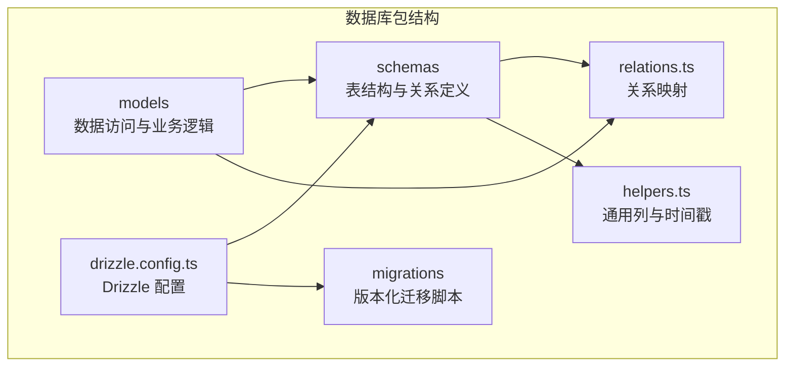
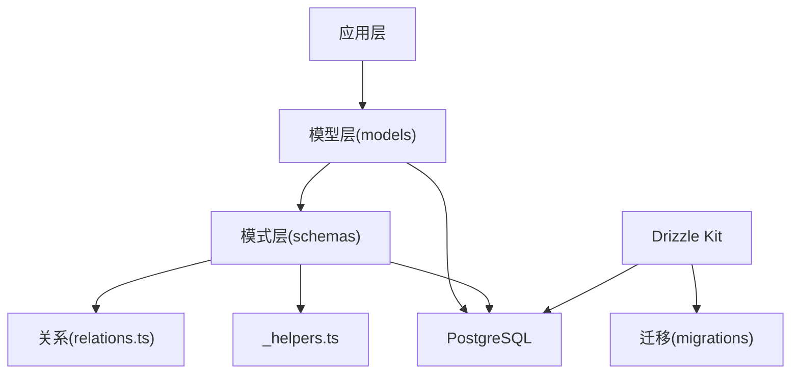
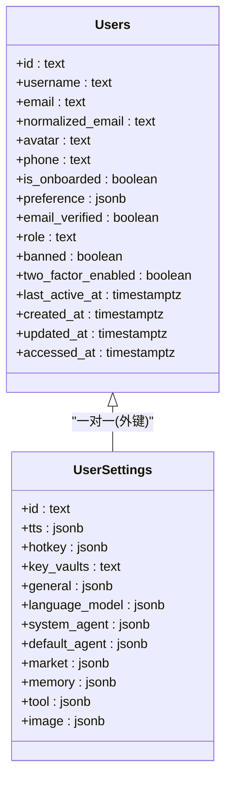
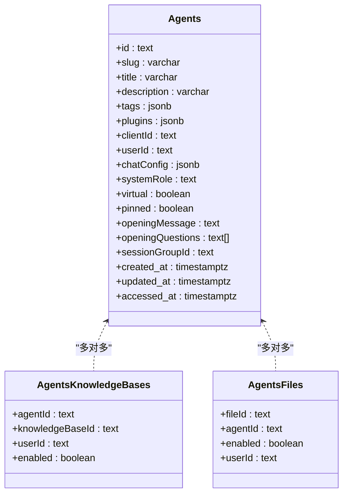
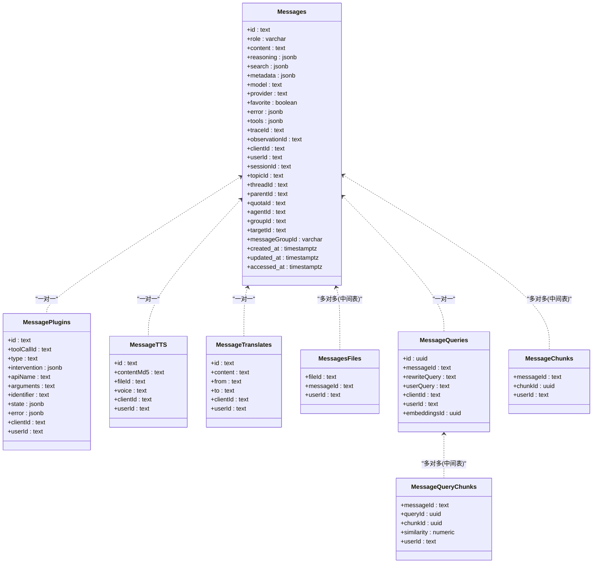
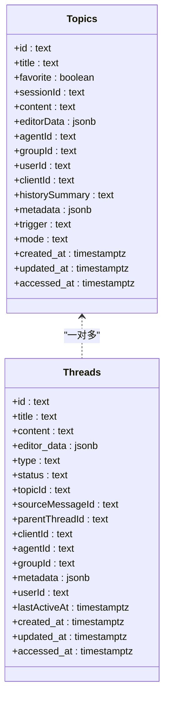
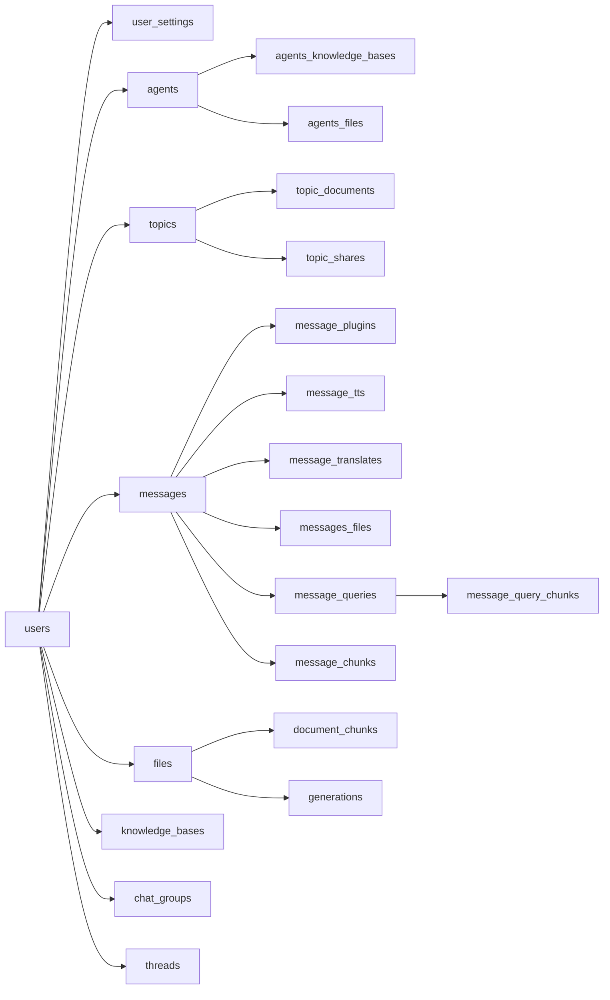

# 数据库架构设计

<cite>
**本文档引用的文件**
- [drizzle.config.ts](file://drizzle.config.ts)
- [database-schema.dbml](file://docs/development/database-schema.dbml)
- [_helpers.ts](file://packages/database/src/schemas/_helpers.ts)
- [relations.ts](file://packages/database/src/schemas/relations.ts)
- [user.ts](file://packages/database/src/schemas/user.ts)
- [agent.ts](file://packages/database/src/schemas/agent.ts)
- [message.ts](file://packages/database/src/schemas/message.ts)
- [topic.ts](file://packages/database/src/schemas/topic.ts)
- [user.ts](file://packages/database/src/models/user.ts)
- [message.ts](file://packages/database/src/models/message.ts)
- [SKILL.md](file://.agents/skills/drizzle/SKILL.md)
</cite>

## 目录
1. [简介](#简介)
2. [项目结构](#项目结构)
3. [核心组件](#核心组件)
4. [架构总览](#架构总览)
5. [详细组件分析](#详细组件分析)
6. [依赖关系分析](#依赖关系分析)
7. [性能考虑](#性能考虑)
8. [故障排除指南](#故障排除指南)
9. [结论](#结论)
10. [附录](#附录)

## 简介
本文件为 LobeHub 项目的数据库架构设计文档，聚焦于基于 Drizzle ORM 的数据库设计与实现。内容涵盖实体关系设计、字段定义、索引策略；Drizzle ORM 的查询构建器、迁移管理与类型安全设计；数据访问层（Repository 模式）与数据映射、事务处理；核心数据模型（用户、Agent、消息等）；数据迁移策略与版本管理、备份恢复机制；以及数据库性能优化与监控方案。

## 项目结构
数据库相关代码主要位于 packages/database 包中，采用“模式（Schema）+ 模型（Model）+ 迁移（Migrations）”三层结构：
- 模式（schemas）：定义表结构、索引、外键约束与关系
- 模型（models）：封装数据访问逻辑、查询组合、事务处理
- 迁移（migrations）：版本化数据库变更脚本
- 配置（drizzle.config.ts）：Drizzle Kit 配置，指定 schema、out、dialect 等

图表来源
- [drizzle.config.ts](file://drizzle.config.ts#L1-L22)
- [relations.ts](file://packages/database/src/schemas/relations.ts#L1-L407)
- [_helpers.ts](file://packages/database/src/schemas/_helpers.ts#L1-L33)

章节来源
- [drizzle.config.ts](file://drizzle.config.ts#L1-L22)
- [database-schema.dbml](file://docs/development/database-schema.dbml#L1-L800)

## 核心组件
- Drizzle ORM 配置与风格规范：通过 drizzle.config.ts 指定 PostgreSQL 方言、严格模式、schema 路径与迁移输出目录；遵循统一命名约定、主键/外键/索引风格与查询构建器使用规范。
- 模式层（schemas）：以 pgTable 定义表，使用 _helpers.ts 提供的时间戳与通用列工具；通过 relations.ts 建立实体间关系；在 DBML 中给出完整 ER 关系图。
- 模型层（models）：封装查询、插入、更新、删除与复杂联表查询；支持分页、聚合、并行查询与事务；提供类型安全的返回值。
- 迁移层（migrations）：按版本号顺序执行的 SQL 脚本，记录数据库演进历史；包含索引优化、字段变更、外键调整等。

章节来源
- [drizzle.config.ts](file://drizzle.config.ts#L1-L22)
- [SKILL.md](file://.agents/skills/drizzle/SKILL.md#L1-L139)
- [database-schema.dbml](file://docs/development/database-schema.dbml#L1-L800)

## 架构总览
下图展示数据库层的整体架构：模式层定义表与关系，模型层封装数据访问，Drizzle Kit 管理迁移，应用通过模型层进行类型安全的数据操作。

图表来源
- [drizzle.config.ts](file://drizzle.config.ts#L1-L22)
- [relations.ts](file://packages/database/src/schemas/relations.ts#L1-L407)
- [_helpers.ts](file://packages/database/src/schemas/_helpers.ts#L1-L33)

## 详细组件分析

### 用户模型（User）
- 表结构要点：用户主键、唯一标识（用户名、邮箱、标准化邮箱）、偏好设置、认证相关字段（better-auth/nextauth 兼容）、封禁状态与两步验证、活跃时间等。
- 索引策略：邮箱/用户名/创建时间复合索引；部分索引加速管理员查询。
- 类型安全：通过 Drizzle Zod schema 生成插入/选择类型，确保编译期校验。
- 模型能力：用户信息聚合、SSO 提供商查询、设置与偏好更新、批量用户筛选等。

图表来源
- [user.ts](file://packages/database/src/schemas/user.ts#L9-L109)

章节来源
- [user.ts](file://packages/database/src/schemas/user.ts#L9-L109)
- [user.ts](file://packages/database/src/models/user.ts#L1-L418)

### Agent 模型（Agent）
- 表结构要点：Agent 主键、slug/clientId 唯一性、所属用户、聊天配置、系统角色、插件列表、虚拟/置顶标记、会话组关联等。
- 索引策略：clientId+userId 唯一索引、slug+userId 唯一索引、用户索引、标题/描述/会话组索引。
- 关系：与知识库（多对多）、文件（多对多）、会话组、话题等存在关联。

图表来源
- [agent.ts](file://packages/database/src/schemas/agent.ts#L30-L142)

章节来源
- [agent.ts](file://packages/database/src/schemas/agent.ts#L30-L142)

### 消息模型（Message）
- 表结构要点：消息主键、角色、内容、推理/检索元数据、工具调用、错误信息、客户端 ID 唯一性、外键链（topic/thread/session/agent/group/message_group 等）。
- 索引策略：按创建时间排序、客户端 ID+用户唯一索引、主题/父消息/配额/用户/会话/线程/Agent/群组/消息组等多维索引。
- 复杂关系：消息可包含插件调用、翻译、TTS、文件附件、RAG 查询与块关联、消息组压缩/并行节点等。
- 查询模式：支持按会话/主题/线程/群组过滤，支持带关系的联表查询与分页，支持任务消息的线程详情聚合。

图表来源
- [message.ts](file://packages/database/src/schemas/message.ts#L86-L315)

章节来源
- [message.ts](file://packages/database/src/schemas/message.ts#L86-L315)
- [message.ts](file://packages/database/src/models/message.ts#L1-L800)

### 主题与线程（Topic & Thread）
- 主题（topics）：标题、收藏、会话/Agent/群组关联、客户端 ID 唯一性、摘要与元数据、触发来源与模式等。
- 线程（threads）：标题、内容、类型/状态、源消息、父子线程、元数据、用户与 Agent/群组关联。
- 关系：主题与消息、文档、分享表存在多对多或一对多关联；线程与消息形成树状结构。

图表来源
- [topic.ts](file://packages/database/src/schemas/topic.ts#L23-L186)

章节来源
- [topic.ts](file://packages/database/src/schemas/topic.ts#L23-L186)

### Drizzle ORM 使用与类型安全
- 查询构建器：严格要求使用 select() 构建器 API，避免使用易脆弱且难以调试的关系 API。
- 类型推断：通过 createInsertSchema/createSelectSchema 生成类型，结合 Drizzle Zod schema 实现运行时与编译期双重校验。
- 辅助函数：_helpers.ts 提供统一的时间戳列与金额数值列定义，简化重复列声明。

章节来源
- [SKILL.md](file://.agents/skills/drizzle/SKILL.md#L62-L139)
- [_helpers.ts](file://packages/database/src/schemas/_helpers.ts#L1-L33)

### 数据访问层（Repository 模式）
- 模型类职责：封装 CRUD、复杂联表查询、分页、聚合统计、并行查询与事务；提供类型安全的输入/输出。
- 事务处理：在需要一致性保证的场景（如更新消息并同步主题时间戳）使用事务包裹。
- 性能优化：通过并行查询减少往返次数；针对高频查询建立合适索引；使用分页与时间窗口控制结果集大小。

章节来源
- [message.ts](file://packages/database/src/models/message.ts#L97-L800)
- [user.ts](file://packages/database/src/models/user.ts#L50-L418)

### 实体关系设计与索引策略
- 实体关系：relations.ts 明确表间一对多/多对多关系与级联删除策略；消息与文件、消息与查询、消息与块、主题与文档等通过中间表实现灵活关联。
- 索引策略：覆盖常见查询维度（用户、主题、会话、线程、Agent、群组、创建时间、客户端 ID 唯一性），部分表使用部分索引提升特定场景查询效率。

章节来源
- [relations.ts](file://packages/database/src/schemas/relations.ts#L1-L407)
- [database-schema.dbml](file://docs/development/database-schema.dbml#L1-L800)

## 依赖关系分析
- 模式层依赖关系：各表通过外键相互约束，relations.ts 统一声明关系映射，便于生成类型安全的联表查询。
- 模型层依赖关系：模型类依赖 schema 定义与 relations 映射，实现复杂业务查询与事务处理。
- 工具与辅助：_helpers.ts 提供统一列定义；drizzle.config.ts 提供全局配置；DBML 提供可视化 ER 图。

图表来源
- [relations.ts](file://packages/database/src/schemas/relations.ts#L1-L407)
- [database-schema.dbml](file://docs/development/database-schema.dbml#L1-L800)

章节来源
- [relations.ts](file://packages/database/src/schemas/relations.ts#L1-L407)
- [database-schema.dbml](file://docs/development/database-schema.dbml#L1-L800)

## 性能考虑
- 索引优化：为高频过滤字段（用户、主题、会话、线程、Agent、群组、创建时间）建立索引；对 JSONB 字段使用 GIN 或专用索引（如主题提取状态）。
- 查询优化：优先使用 select() 构建器 API，避免复杂关系 API；对大结果集使用分页与时间窗口；对多表关联使用并行查询减少等待。
- 存储与归档：对历史消息与过期数据进行归档或分区（建议在迁移中引入），降低热数据表规模。
- 连接池与超时：合理配置连接池大小与查询超时，避免长事务占用资源。
- 监控指标：跟踪慢查询、索引命中率、锁等待、QPS/TPS、表膨胀与 WAL 增长。

## 故障排除指南
- 查询异常：检查 where 条件是否包含用户隔离字段；确认索引是否存在且未失效；核对客户端 ID 唯一性约束冲突。
- 迁移失败：查看迁移脚本中的外键/索引变更是否与现有数据兼容；必要时先清理不一致数据再重试。
- 事务回滚：在并发写入场景下，确保事务边界清晰，避免长时间持有锁；对热点行使用乐观锁或重试机制。
- 类型不匹配：确认 Drizzle Zod schema 与表结构一致；使用类型推断接口验证输入/输出。

## 结论
LobeHub 的数据库架构以 Drizzle ORM 为核心，采用严格的模式定义、关系映射与类型安全设计，配合模型层的复杂查询与事务处理，满足消息、Agent、用户等核心业务的数据需求。通过完善的索引策略与迁移管理，系统具备良好的扩展性与可维护性。建议持续关注查询性能与索引命中率，结合监控体系进行容量规划与优化。

## 附录
- 数据迁移策略：采用版本化迁移脚本，按序执行；每次变更前评估影响范围与回滚方案；在生产环境执行前进行预演与压测。
- 版本管理：迁移脚本命名规范与注释规范，确保可追溯性；对破坏性变更提供降级路径。
- 备份与恢复：定期全量备份与增量日志备份；制定恢复演练计划；对敏感数据（如用户密钥）进行脱敏处理。