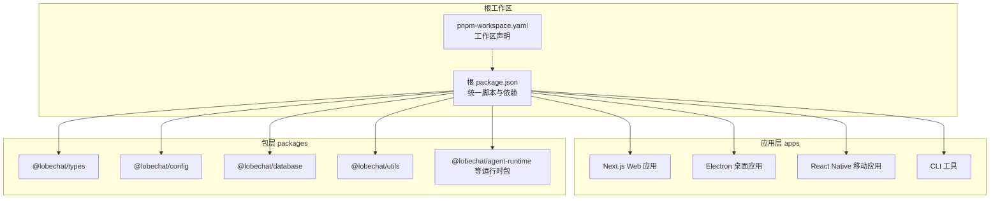
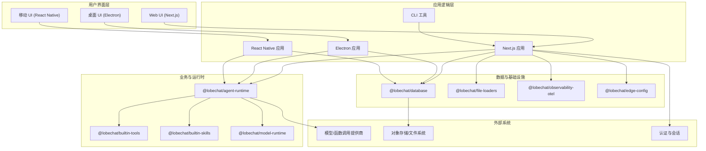
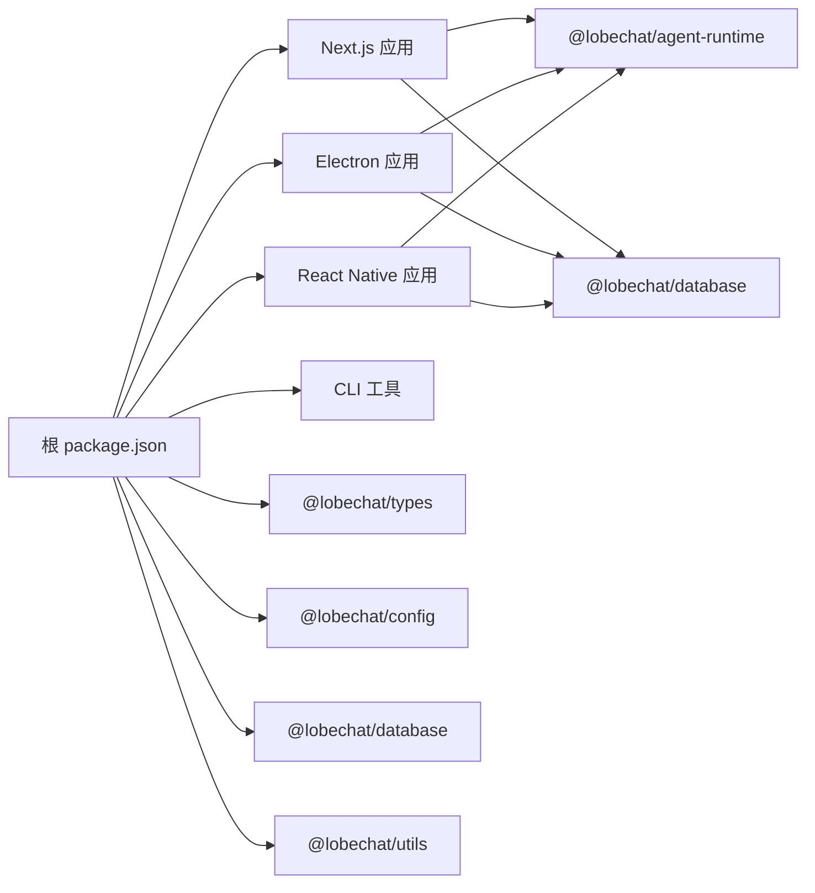

# 整体架构概览

<cite>
**本文引用的文件**
- [package.json](file://package.json)
- [pnpm-workspace.yaml](file://pnpm-workspace.yaml)
- [next.config.ts](file://next.config.ts)
- [vite.config.ts](file://vite.config.ts)
- [apps/desktop/package.json](file://apps/desktop/package.json)
- [apps/mobile/package.json](file://apps/mobile/package.json)
- [apps/cli/package.json](file://apps/cli/package.json)
- [apps/desktop/electron.vite.config.ts](file://apps/desktop/electron.vite.config.ts)
- [src/initialize.ts](file://src/initialize.ts)
- [apps/mobile/App.tsx](file://apps/mobile/App.tsx)
- [packages/types/package.json](file://packages/types/package.json)
- [packages/config/package.json](file://packages/config/package.json)
- [packages/database/package.json](file://packages/database/package.json)
- [packages/utils/package.json](file://packages/utils/package.json)
</cite>

## 目录

1. [引言](#引言)
2. [项目结构](#项目结构)
3. [核心组件](#核心组件)
4. [架构总览](#架构总览)
5. [详细组件分析](#详细组件分析)
6. [依赖分析](#依赖分析)
7. [性能考量](#性能考量)
8. [故障排查指南](#故障排查指南)
9. [结论](#结论)
10. [附录](#附录)

## 引言

本文件面向 LobeHub 项目，提供整体架构概览与分层设计说明，重点覆盖以下方面：

- 分层架构：表示层（Web / 桌面 / 移动）、业务层、数据层的职责划分与协作方式
- 微服务化包管理：通过 30+ 独立包实现功能解耦与复用
- 跨平台一致性：统一的 UI / 状态 / 工具链在 Web、桌面、移动上的适配策略
- 技术栈选择与权衡：React/Next.js、Electron、React Native 的架构决策依据
- 系统上下文与组件分解：以图示方式展示各层交互与数据流

## 项目结构

LobeHub 采用 Monorepo 架构，根目录通过工作区配置统一管理多个应用与包。核心组织方式如下：

- 应用层（apps）：Next.js Web 应用、Electron 桌面应用、React Native 移动应用、CLI 工具
- 包层（packages）：类型定义、配置、数据库、工具库、运行时等可复用模块
- 根级脚本与配置：构建、开发、测试、发布流程由根级 package.json 统一编排

图表来源

- [package.json](file://package.json#L30-L35)
- [pnpm-workspace.yaml](file://pnpm-workspace.yaml#L1-L5)

章节来源

- [package.json](file://package.json#L30-L35)
- [pnpm-workspace.yaml](file://pnpm-workspace.yaml#L1-L5)

## 核心组件

围绕三层架构，LobeHub 的核心组件与职责如下：

- 表示层（Presentation Layer）
  - Next.js Web 应用：基于 React 与 Next.js 的服务端渲染与静态优化，配合路由与 SSR/SSG 能力
  - Electron 桌面应用：使用 Electron-Vite 构建主进程与渲染进程，共享 Web 侧代码与状态
  - React Native 移动应用：基于 Expo/NativeWind 的移动端体验，统一主题与导航体系
  - CLI 工具：命令行入口，提供自动化与运维能力

- 业务层（Business Layer）
  - 运行时与工具：Agent 运行时、内置工具集、技能商店、模型运行时等
  - 配置与常量：集中式配置与常量管理，确保多端一致
  - 类型系统：统一的 TypeScript 类型定义，约束接口与数据结构

- 数据层（Data Layer）
  - 数据库与迁移：Drizzle ORM、迁移工具与客户端数据库（如 PGlite）支持
  - 文件加载器与爬虫：通用文件解析与网络爬取能力
  - 观测与指标：OpenTelemetry、分析与监控集成

章节来源

- [apps/desktop/electron.vite.config.ts](file://apps/desktop/electron.vite.config.ts#L45-L115)
- [vite.config.ts](file://vite.config.ts#L24-L122)
- [apps/mobile/App.tsx](file://apps/mobile/App.tsx#L17-L66)
- [packages/types/package.json](file://packages/types/package.json#L1-L23)
- [packages/config/package.json](file://packages/config/package.json#L1-L17)
- [packages/database/package.json](file://packages/database/package.json#L1-L38)
- [packages/utils/package.json](file://packages/utils/package.json#L1-L45)

## 架构总览

下图展示了 LobeHub 的系统上下文与组件分解：从用户交互到后端服务，再到数据库与第三方模型提供商的完整链路。

图表来源

- [package.json](file://package.json#L158-L403)
- [packages/database/package.json](file://packages/database/package.json#L16-L36)
- [packages/utils/package.json](file://packages/utils/package.json#L16-L41)

## 详细组件分析

### 分层架构与职责划分

- 表示层
  - Next.js Web：负责页面路由、SSR/SSG、静态资源与 CDN；通过环境变量与 Vercel 优化减少冷启动与体积
  - Electron 桌面：主进程负责系统集成与更新，渲染进程共享 Web 代码，实现 “一次编写，多端运行”
  - React Native 移动：基于 Expo 的跨平台原生体验，统一主题与导航，按需引入原生能力
- 业务层
  - Agent 运行时与工具：封装对话流程、工具调用、技能编排与上下文引擎
  - 配置与常量：集中化配置，避免多端分散配置带来的不一致
  - 类型系统：严格的类型约束，保障跨端接口一致性
- 数据层
  - 数据库：Drizzle ORM + 迁移工具，支持本地与云端数据库；提供客户端数据库适配
  - 文件与网络：文件加载器与网络爬虫，统一处理多种输入格式
  - 观测：OpenTelemetry 自动化注入与导出，结合分析与监控

章节来源

- [next.config.ts](file://next.config.ts#L5-L21)
- [apps/desktop/electron.vite.config.ts](file://apps/desktop/electron.vite.config.ts#L45-L115)
- [apps/mobile/App.tsx](file://apps/mobile/App.tsx#L17-L66)
- [packages/types/package.json](file://packages/types/package.json#L1-L23)
- [packages/config/package.json](file://packages/config/package.json#L1-L17)
- [packages/database/package.json](file://packages/database/package.json#L16-L36)
- [packages/utils/package.json](file://packages/utils/package.json#L16-L41)

### 微服务化包管理架构

- 包数量与覆盖范围
  - packages 目录包含 30+ 独立包，涵盖运行时、工具、数据库、配置、观测、文件加载等
  - 通过 workspace:\* 依赖统一版本与增量发布，降低耦合度与提升可维护性
- 解耦策略
  - 业务能力以包形式拆分：Agent 运行时、内置工具、技能商店、模型运行时等
  - 共享能力下沉：类型、配置、常量、工具库下沉为公共包，避免重复实现
- 版本与发布
  - 使用语义化版本与工作区统一管理，结合 CI/CD 实现增量发布与回滚

章节来源

- [packages/types/package.json](file://packages/types/package.json#L1-L23)
- [packages/config/package.json](file://packages/config/package.json#L1-L17)
- [packages/database/package.json](file://packages/database/package.json#L1-L38)
- [packages/utils/package.json](file://packages/utils/package.json#L1-L45)
- [package.json](file://package.json#L190-L237)

### 跨平台架构设计

- Web 与桌面
  - Electron 渲染进程共享 Next.js/Web 代码，通过条件编译与环境变量区分平台差异
  - 主进程负责系统集成（菜单、托盘、自动更新），渲染进程专注 UI 与业务
- 移动端
  - 基于 React Native + Expo，统一主题与导航；按需引入原生能力（存储、权限等）
- 一致性设计
  - 统一的状态管理（Zustand）、国际化（i18n）、主题（Ant Design + 自定义样式）
  - 通过共享包与类型约束，保证多端行为一致

章节来源

- [apps/desktop/electron.vite.config.ts](file://apps/desktop/electron.vite.config.ts#L96-L115)
- [apps/mobile/App.tsx](file://apps/mobile/App.tsx#L17-L66)
- [src/initialize.ts](file://src/initialize.ts#L1-L37)

### 技术栈选择与权衡

- React/Next.js
  - 优势：生态成熟、SSR/SSG、路由与构建优化完善；与 Vercel 集成良好
  - 权衡：对复杂桌面场景需要额外桥接（Electron），但通过共享代码降低重复
- Electron
  - 优势：原生系统能力、单次开发多端部署；与 Web 技术栈一致
  - 权衡：打包体积与内存占用；通过外部化原生依赖与分块策略优化
- React Native
  - 优势：跨平台原生体验、热重载与调试友好
  - 权衡：部分 Web 能力无法直接复用，需按平台适配

章节来源

- [apps/desktop/package.json](file://apps/desktop/package.json#L43-L106)
- [apps/mobile/package.json](file://apps/mobile/package.json#L11-L35)
- [next.config.ts](file://next.config.ts#L5-L21)

## 依赖分析

- 工作区与依赖
  - 根级 package.json 声明工作区与脚本，统一管理构建、测试、发布流程
  - pnpm-workspace.yaml 定义工作区范围与覆盖规则，确保包间依赖解析正确
- 平台特定依赖
  - Electron 应用包含桌面专用依赖（如 @napi-rs/canvas、electron-builder）
  - 移动应用依赖 Expo 生态与原生导航库
- 运行时与工具
  - Agent 运行时、模型运行时、内置工具与技能包作为 workspace:\* 依赖被多端共享
  - 数据库与文件加载器等基础能力通过独立包提供

图表来源

- [package.json](file://package.json#L30-L35)
- [package.json](file://package.json#L190-L237)
- [apps/desktop/package.json](file://apps/desktop/package.json#L43-L106)
- [apps/mobile/package.json](file://apps/mobile/package.json#L11-L35)
- [apps/cli/package.json](file://apps/cli/package.json#L21-L29)

章节来源

- [package.json](file://package.json#L30-L35)
- [pnpm-workspace.yaml](file://pnpm-workspace.yaml#L1-L5)
- [apps/desktop/package.json](file://apps/desktop/package.json#L43-L106)
- [apps/mobile/package.json](file://apps/mobile/package.json#L11-L35)
- [apps/cli/package.json](file://apps/cli/package.json#L21-L29)

## 性能考量

- 构建与体积优化
  - Next.js 在 Vercel 环境排除 musl 二进制与 SPA / 桌面 / 移动产物，显著减小函数体积
  - Vite/PWA 缓存策略针对字体、图片与 API 接口进行差异化缓存
- 运行时优化
  - Electron 主进程外部化原生依赖，避免捆绑导致的体积膨胀
  - 桌面应用按命名空间拆分 i18n 资源，提升按需加载效率
- 开发体验
  - Vite Dev Server 提供代理与热更新；Electron 开发中间件重写根路径，便于本地联调

章节来源

- [next.config.ts](file://next.config.ts#L5-L21)
- [vite.config.ts](file://vite.config.ts#L64-L103)
- [apps/desktop/electron.vite.config.ts](file://apps/desktop/electron.vite.config.ts#L45-L74)

## 故障排查指南

- 代码分割错误
  - 初始化阶段注册异步 chunk 加载失败监听，捕获并提示用户刷新或重试
- 开发代理与调试
  - Vite Dev Server 打印调试代理地址，便于本地联调 Next.js 与桌面 / 移动
  - Electron 开发中间件将根路径重定向至桌面入口，简化本地访问
- 状态与国际化
  - 移动端启动时先加载语言包与会话，若无服务端 URL 则进入配置流程

章节来源

- [src/initialize.ts](file://src/initialize.ts#L19-L32)
- [vite.config.ts](file://vite.config.ts#L40-L62)
- [apps/desktop/electron.vite.config.ts](file://apps/desktop/electron.vite.config.ts#L20-L32)
- [apps/mobile/App.tsx](file://apps/mobile/App.tsx#L28-L50)

## 结论

LobeHub 通过清晰的三层架构与微服务化包管理，实现了 Web、桌面与移动的统一与解耦。技术栈选择兼顾生态成熟度与跨平台一致性，配合完善的构建与观测体系，支撑了复杂 AI Agent 场景下的可扩展与可维护性。未来可在以下方向持续演进：

- 进一步细化运行时与工具包边界，提升复用率
- 强化跨端状态同步与离线策略
- 深化可观测性与性能监控，完善 APM 闭环

## 附录

- 关键配置参考
  - Next.js 构建与 Vercel 优化：见 [next.config.ts](file://next.config.ts#L5-L21)
  - Vite/PWA 与开发代理：见 [vite.config.ts](file://vite.config.ts#L24-L122)
  - Electron 开发与打包：见 [apps/desktop/electron.vite.config.ts](file://apps/desktop/electron.vite.config.ts#L45-L115)
  - 移动端启动流程：见 [apps/mobile/App.tsx](file://apps/mobile/App.tsx#L17-L66)
- 包清单与依赖
  - 类型与配置：见 [@lobechat/types](file://packages/types/package.json#L1-L23)、[@lobechat/config](file://packages/config/package.json#L1-L17)
  - 数据与工具：见 [@lobechat/database](file://packages/database/package.json#L1-L38)、[@lobechat/utils](file://packages/utils/package.json#L1-L45)
  - 应用与工具：见 [apps/desktop/package.json](file://apps/desktop/package.json#L43-L106)、[apps/mobile/package.json](file://apps/mobile/package.json#L11-L35)、[apps/cli/package.json](file://apps/cli/package.json#L21-L29)
