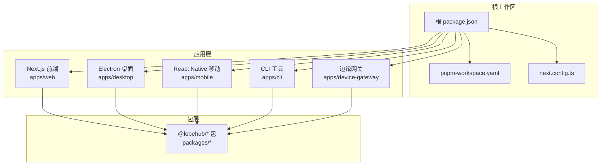
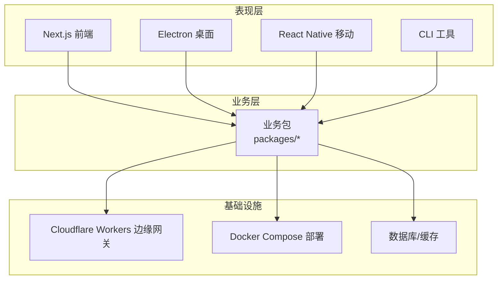
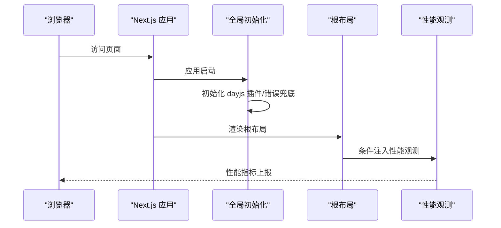
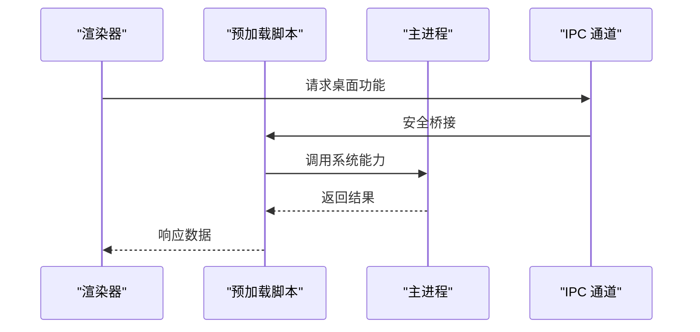
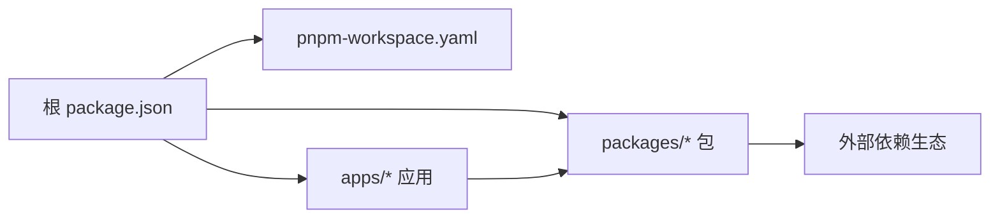

# 架构设计

<cite>
**本文引用的文件**
- [package.json](file://package.json)
- [pnpm-workspace.yaml](file://pnpm-workspace.yaml)
- [next.config.ts](file://next.config.ts)
- [apps/desktop/package.json](file://apps/desktop/package.json)
- [apps/mobile/package.json](file://apps/mobile/package.json)
- [apps/cli/package.json](file://apps/cli/package.json)
- [apps/device-gateway/package.json](file://apps/device-gateway/package.json)
- [src/app/layout.tsx](file://src/app/layout.tsx)
- [src/initialize.ts](file://src/initialize.ts)
</cite>

## 目录

1. [引言](#引言)
2. [项目结构](#项目结构)
3. [核心组件](#核心组件)
4. [架构总览](#架构总览)
5. [详细组件分析](#详细组件分析)
6. [依赖分析](#依赖分析)
7. [性能考量](#性能考量)
8. [故障排查指南](#故障排查指南)
9. [结论](#结论)
10. [附录](#附录)

## 引言

本架构设计文档面向 LobeHub 项目，系统性阐述其整体架构与关键设计决策，覆盖以下方面：

- 分层架构与微服务化包管理：以 monorepo 管理多应用与多业务包，统一工作区与依赖覆盖策略。
- 跨平台应用架构：前端 Next.js 应用、桌面 Electron 应用、移动端 React Native 应用、CLI 工具与边缘网关。
- 技术选型与权衡：React/Next.js 前端、Electron 桌面、React Native 移动、Cloudflare Workers 边缘网关等。
- 数据流与状态管理：全局初始化、错误兜底、路由与布局、构建与部署流水线。
- 组件交互与集成点：应用间 IPC、SPA 与 SSR 的协同、桌面渲染与主进程通信。
- 可扩展性、性能优化与安全：按需加载、输出追踪排除、服务端渲染优化、边缘计算与认证。

## 项目结构

LobeHub 采用 pnpm workspaces 的 monorepo 结构，将多个应用与业务包统一管理，并通过顶层脚本协调构建与发布流程。核心目录与职责如下：

- apps：多端应用入口
  - desktop：Electron 桌面应用（主进程、预加载、渲染器）
  - mobile：React Native 移动应用（Expo）
  - cli：命令行工具（打包为二进制）
  - device-gateway：Cloudflare Workers 边缘网关
- packages：业务与基础能力包（如 agent-runtime、database、observability-otel 等）
- src：Next.js 前端应用源码（页面、服务、状态、类型等）
- 根级配置：package.json、pnpm-workspace.yaml、next.config.ts 等

**图表来源**

- [package.json](file://package.json#L30-L35)
- [pnpm-workspace.yaml](file://pnpm-workspace.yaml#L1-L6)
- [next.config.ts](file://next.config.ts#L1-L27)

**章节来源**

- [package.json](file://package.json#L30-L35)
- [pnpm-workspace.yaml](file://pnpm-workspace.yaml#L1-L6)

## 核心组件

- 全局初始化与错误兜底
  - 初始化 dayjs 插件、启用 immer Map/Set 支持、在开发环境启用扫描。
  - 注册异步 chunk 加载失败事件监听，统一提示与回退。
- Next.js 根布局与性能观测
  - 根布局包裹子树，按环境注入性能观测组件。
- 构建与部署脚本
  - 顶层脚本统一协调 SPA/Vite 构建、Next.js 构建、桌面应用打包、数据库迁移、站点地图生成等。
- 工作区与依赖覆盖
  - pnpm workspaces 定义包范围；overrides 与 onlyBuiltDependencies 控制版本与原生依赖编译策略。

**章节来源**

- [src/initialize.ts](file://src/initialize.ts#L1-L37)
- [src/app/layout.tsx](file://src/app/layout.tsx#L1-L23)
- [package.json](file://package.json#L36-L122)
- [pnpm-workspace.yaml](file://pnpm-workspace.yaml#L11-L23)

## 架构总览

LobeHub 采用 “多端一体” 的分层架构：

- 表现层：Next.js（SSR/CSR）、Electron（桌面）、React Native（移动）、CLI（命令行）
- 业务层：统一的业务包（packages/\*）提供模型运行时、代理管理、工具集、数据库、可观测性等能力
- 基础设施层：Cloudflare Workers 边缘网关、容器化部署（Docker Compose）、数据库与缓存
- 集成与通信：应用间通过 IPC、HTTP、WebSocket、OpenAPI 等方式协作

**图表来源**

- [apps/desktop/package.json](file://apps/desktop/package.json#L43-L106)
- [apps/mobile/package.json](file://apps/mobile/package.json#L11-L43)
- [apps/cli/package.json](file://apps/cli/package.json#L21-L42)
- [apps/device-gateway/package.json](file://apps/device-gateway/package.json#L12-L22)

## 详细组件分析

### Next.js 前端架构

- 技术栈与特性
  - 使用 Next.js 进行服务端渲染与静态生成，结合性能观测组件提升用户体验。
  - 通过 next.config.ts 在 Vercel 环境下进行输出追踪排除，减少冷启动体积。
- 数据流与状态
  - 全局初始化在应用启动时完成，确保日期库插件与错误兜底生效。
  - 根布局负责注入分析与性能观测组件，保证首屏与交互体验。
- 错误处理
  - 对异步 chunk 加载失败进行统一拦截与提示，避免白屏或崩溃。

**图表来源**

- [src/initialize.ts](file://src/initialize.ts#L1-L37)
- [src/app/layout.tsx](file://src/app/layout.tsx#L1-L23)
- [next.config.ts](file://next.config.ts#L1-L27)

**章节来源**

- [src/initialize.ts](file://src/initialize.ts#L1-L37)
- [src/app/layout.tsx](file://src/app/layout.tsx#L1-L23)
- [next.config.ts](file://next.config.ts#L1-L27)

### Electron 桌面应用

- 技术栈与特性
  - 主进程与渲染器分离，支持多平台打包与更新。
  - 通过 electron-vite 构建，使用 IPC 与业务包交互。
- 数据流与状态
  - 预加载脚本与主进程通信，实现安全的渲染器到主进程调用。
  - 本地存储与窗口状态管理，保障用户体验一致性。
- 错误处理
  - 构建阶段排除不必要的原生二进制，降低打包体积与兼容性问题。

**图表来源**

- [apps/desktop/package.json](file://apps/desktop/package.json#L13-L42)

**章节来源**

- [apps/desktop/package.json](file://apps/desktop/package.json#L13-L42)

### React Native 移动应用

- 技术栈与特性
  - 基于 Expo 的 React Native 应用，支持多端运行与热重载。
  - 使用导航库与状态管理，结合业务包提供一致的功能体验。
- 数据流与状态
  - 通过 tRPC 客户端与后端交互，保持请求与响应的一致性。
- 错误处理
  - 与桌面应用类似，采用统一的错误兜底策略与日志记录。

**章节来源**

- [apps/mobile/package.json](file://apps/mobile/package.json#L11-L43)

### CLI 工具

- 功能定位
  - 提供命令行接口，支持与后端服务交互、文件操作、评估与连接等功能。
- 构建与分发
  - 使用 tsup 打包为可执行二进制，便于安装与使用。

**章节来源**

- [apps/cli/package.json](file://apps/cli/package.json#L11-L20)

### 边缘网关（Cloudflare Workers）

- 功能定位
  - 基于 Hono 的轻量服务，用于设备网关与鉴权相关逻辑。
- 部署与测试
  - 使用 Wrangler 开发与部署，配合 Vitest 进行单元测试。

**章节来源**

- [apps/device-gateway/package.json](file://apps/device-gateway/package.json#L5-L11)

## 依赖分析

- 工作区与包管理
  - pnpm workspaces 将 packages/_、apps/_、根项目统一纳入管理，避免重复安装。
  - overrides 与 onlyBuiltDependencies 控制关键依赖版本与原生模块编译。
- 应用间依赖
  - 各应用通过 workspace:\* 引用内部包，形成清晰的单向依赖链。
- 外部依赖
  - 前端使用 Next.js、React、Zustand、TanStack Query 等；桌面使用 Electron；移动使用 Expo；边缘使用 Cloudflare Workers。

**图表来源**

- [package.json](file://package.json#L30-L35)
- [pnpm-workspace.yaml](file://pnpm-workspace.yaml#L11-L23)

**章节来源**

- [package.json](file://package.json#L30-L35)
- [pnpm-workspace.yaml](file://pnpm-workspace.yaml#L11-L23)

## 性能考量

- 输出追踪排除（Vercel）
  - 在 next.config.ts 中对 musl 二进制与 SPA / 桌面 / 移动构建产物进行排除，减少函数体积与冷启动时间。
- 异步资源加载
  - 全局注册异步 chunk 加载失败监听，避免因网络波动导致的白屏。
- 原生依赖编译控制
  - 通过 onlyBuiltDependencies 仅编译必要原生模块，降低构建与运行成本。
- 构建脚本并行化
  - 顶层脚本拆分 SPA、桌面、Next.js 构建步骤，提升 CI/CD 效率。

**章节来源**

- [next.config.ts](file://next.config.ts#L5-L21)
- [src/initialize.ts](file://src/initialize.ts#L19-L32)
- [package.json](file://package.json#L36-L46)

## 故障排查指南

- 异步 chunk 加载失败
  - 症状：页面部分模块加载失败导致白屏或功能异常。
  - 处理：检查全局错误监听是否触发，确认网络与 CDN 状态，清理缓存后重试。
- Vercel 冷启动缓慢
  - 症状：首次访问响应时间较长。
  - 处理：确认 next.config.ts 的输出追踪排除配置已生效，避免携带不必要的二进制。
- 桌面应用打包体积过大
  - 症状：安装包体积偏大或启动慢。
  - 处理：核对 onlyBuiltDependencies 与原生模块编译策略，移除未使用的原生依赖。
- 移动端导航或状态异常
  - 症状：页面跳转或状态不一致。
  - 处理：检查 tRPC 客户端与后端接口一致性，确认状态管理与路由配置。

**章节来源**

- [src/initialize.ts](file://src/initialize.ts#L19-L32)
- [next.config.ts](file://next.config.ts#L5-L21)
- [apps/desktop/package.json](file://apps/desktop/package.json#L110-L121)

## 结论

LobeHub 通过 monorepo 与多端架构实现了统一的业务能力与一致的用户体验。前端采用 Next.js 与 SSR/CSR 混合模式，桌面与移动分别针对各自平台优化，边缘网关承担轻量服务与鉴权职责。整体设计强调可维护性、可扩展性与性能优化，适合在多端场景下持续演进。

## 附录

- 关键配置文件路径
  - 根工作区与脚本：[package.json](file://package.json#L36-L122)
  - 工作区定义：[pnpm-workspace.yaml](file://pnpm-workspace.yaml#L1-L6)
  - Next.js 配置：[next.config.ts](file://next.config.ts#L1-L27)
  - 桌面应用配置：[apps/desktop/package.json](file://apps/desktop/package.json#L13-L42)
  - 移动应用配置：[apps/mobile/package.json](file://apps/mobile/package.json#L11-L43)
  - CLI 配置：[apps/cli/package.json](file://apps/cli/package.json#L11-L20)
  - 边缘网关配置：[apps/device-gateway/package.json](file://apps/device-gateway/package.json#L5-L11)
  - 全局初始化：[src/initialize.ts](file://src/initialize.ts#L1-L37)
  - 根布局：[src/app/layout.tsx](file://src/app/layout.tsx#L1-L23)
