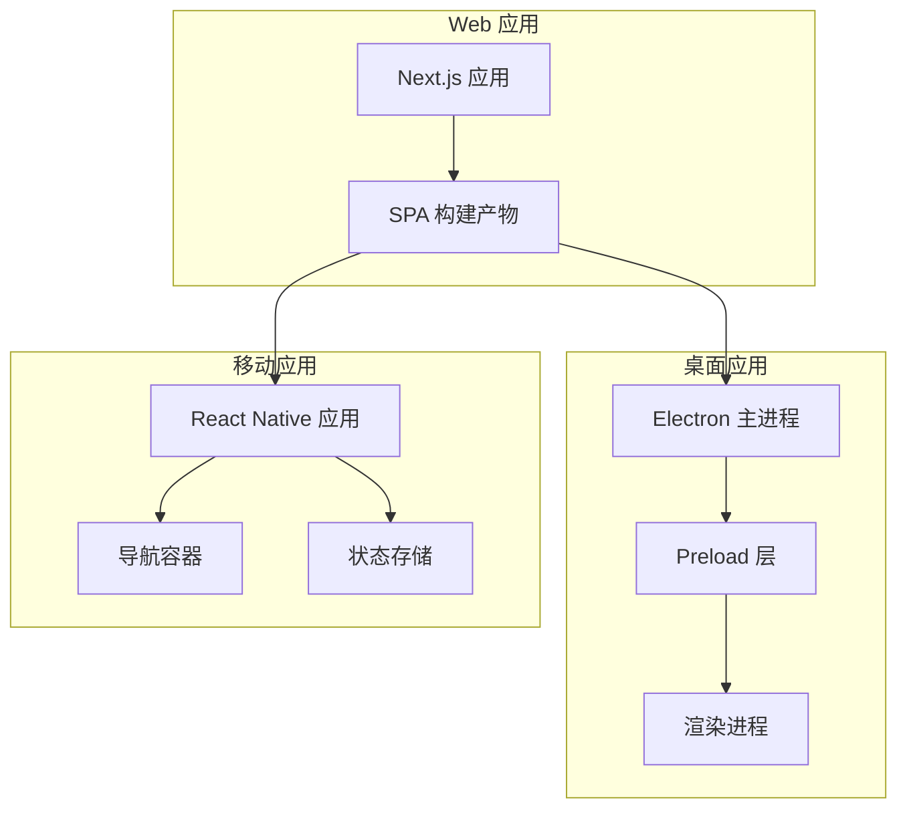
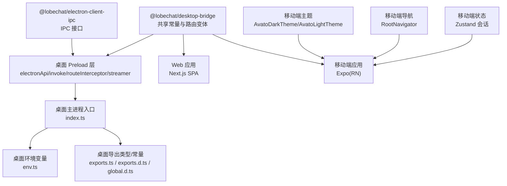
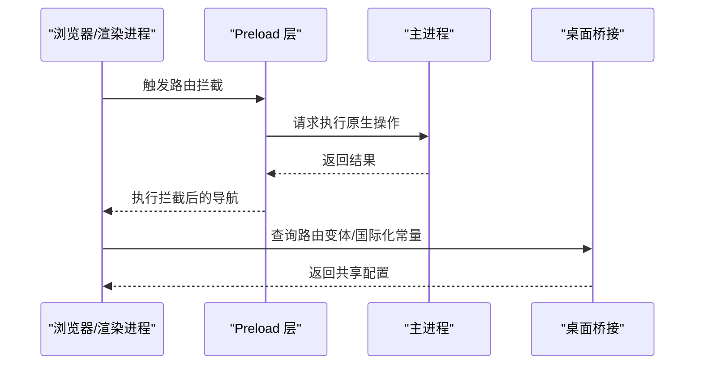
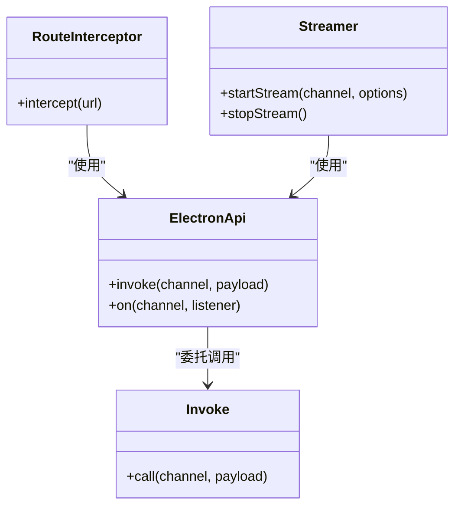
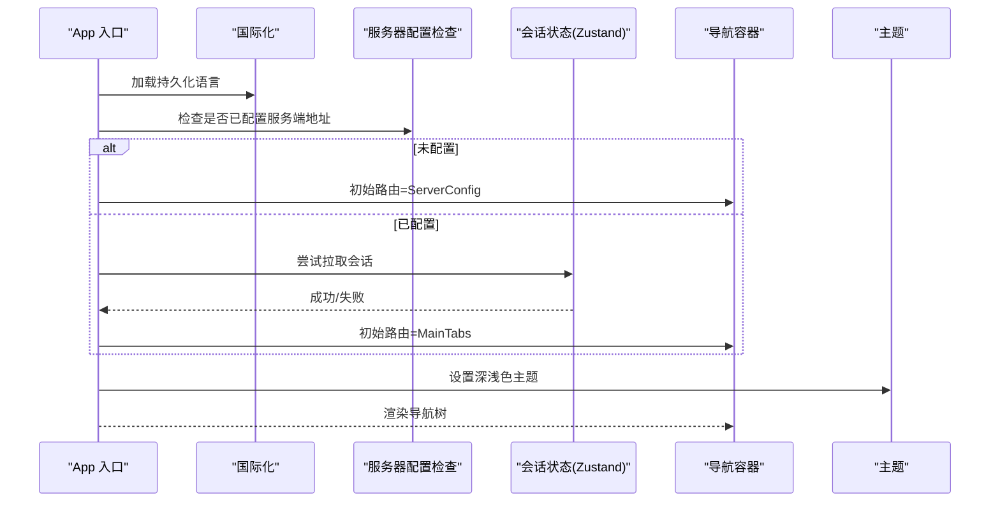
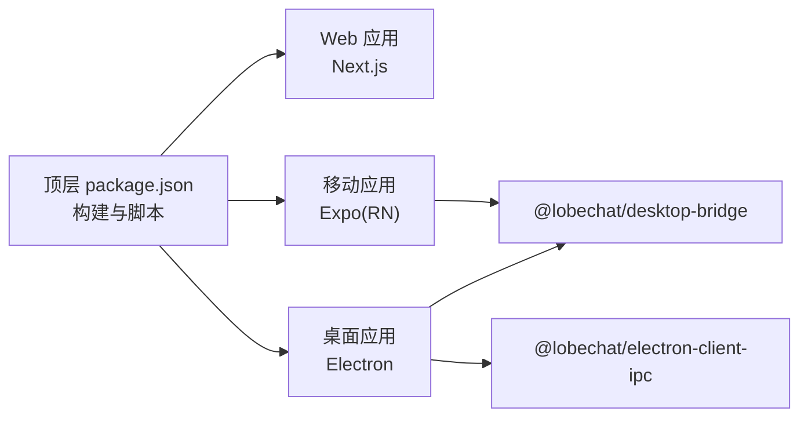

# 跨平台架构设计

<cite>
**本文引用的文件**
- [apps/desktop/package.json](file://apps/desktop/package.json)
- [apps/mobile/package.json](file://apps/mobile/package.json)
- [package.json](file://package.json)
- [apps/desktop/src/preload/electronApi.ts](file://apps/desktop/src/preload/electronApi.ts)
- [apps/desktop/src/preload/invoke.ts](file://apps/desktop/src/preload/invoke.ts)
- [apps/desktop/src/preload/routeInterceptor.ts](file://apps/desktop/src/preload/routeInterceptor.ts)
- [apps/desktop/src/preload/streamer.ts](file://apps/desktop/src/preload/streamer.ts)
- [packages/desktop-bridge/src/index.ts](file://packages/desktop-bridge/src/index.ts)
- [packages/electron-client-ipc/src/index.ts](file://packages/electron-client-ipc/src/index.ts)
- [apps/mobile/App.tsx](file://apps/mobile/App.tsx)
- [apps/mobile/src/navigation/index.ts](file://apps/mobile/src/navigation/index.ts)
- [apps/mobile/src/store/session.ts](file://apps/mobile/src/store/session.ts)
- [apps/mobile/src/services/trpc.ts](file://apps/mobile/src/services/trpc.ts)
- [apps/mobile/src/lib/api.ts](file://apps/mobile/src/lib/api.ts)
- [apps/mobile/src/theme/index.ts](file://apps/mobile/src/theme/index.ts)
- [apps/desktop/src/main/index.ts](file://apps/desktop/src/main/index.ts)
- [apps/desktop/src/main/env.ts](file://apps/desktop/src/main/env.ts)
- [apps/desktop/src/main/exports.ts](file://apps/desktop/src/main/exports.ts)
- [apps/desktop/src/main/exports.d.ts](file://apps/desktop/src/main/exports.d.ts)
- [apps/desktop/src/main/global.d.ts](file://apps/desktop/src/main/global.d.ts)
- [apps/desktop/src/main/exports.d.ts](file://apps/desktop/src/main/exports.d.ts)
- [apps/desktop/src/main/exports.ts](file://apps/desktop/src/main/exports.ts)
- [apps/desktop/src/main/env.ts](file://apps/desktop/src/main/env.ts)
- [apps/desktop/src/main/index.ts](file://apps/desktop/src/main/index.ts)
</cite>

## 目录

1. [引言](#引言)
2. [项目结构](#项目结构)
3. [核心组件](#核心组件)
4. [架构总览](#架构总览)
5. [详细组件分析](#详细组件分析)
6. [依赖关系分析](#依赖关系分析)
7. [性能考量](#性能考量)
8. [故障排查指南](#故障排查指南)
9. [结论](#结论)
10. [附录](#附录)

## 引言

本设计文档面向 LobeHub 项目的跨平台架构，聚焦于 Web、桌面（Electron）与移动（React Native/Expo）三端共享核心逻辑的设计与实现。文档从 SPA 架构、路由与状态同步、桌面 IPC 与原生能力集成、移动端导航与离线策略等方面进行系统化梳理，并总结跨平台状态管理、文件系统访问与设备权限等共享机制的设计要点。

## 项目结构

LobeHub 采用 monorepo 结构组织，核心应用位于 apps 目录，共享能力封装在 packages 目录，顶层 package.json 提供统一脚本与工作区配置。三端应用分别通过各自入口与构建脚本运行：

- Web 应用：基于 Next.js，SPA 构建产物由顶层脚本生成并复制到公共目录，支持桌面打包与移动 SPA 构建。
- 桌面应用：基于 Electron，主进程与渲染进程通过 preload 层暴露受控 API，并提供桌面桥接能力与 IPC 通道。
- 移动应用：基于 Expo（React Native），使用 React Navigation 进行路由管理，结合本地存储与离线策略。

图表来源

- [package.json](file://package.json#L37-L46)
- [apps/desktop/package.json](file://apps/desktop/package.json#L13-L41)
- [apps/mobile/package.json](file://apps/mobile/package.json#L5-L10)

章节来源

- [package.json](file://package.json#L30-L123)
- [apps/desktop/package.json](file://apps/desktop/package.json#L1-L123)
- [apps/mobile/package.json](file://apps/mobile/package.json#L1-L43)

## 核心组件

- 桌面桥接与常量：提供跨平台路由与国际化变体、窗口尺寸、认证头与 TRPC 错误码等共享常量。
- 桌面 IPC 客户端：为渲染层提供受控的 IPC 调用接口。
- 桌面 Preload 层：集中暴露安全的原生能力调用（如路由拦截、流式传输、invoke 等）。
- 移动端导航与主题：基于 React Navigation 的根导航器与主题体系，支持深浅色切换与初始路由控制。
- 移动端状态与服务：使用 Zustand 管理会话状态，通过 tRPC 客户端连接后端服务。

章节来源

- [packages/desktop-bridge/src/index.ts](file://packages/desktop-bridge/src/index.ts#L1-L35)
- [packages/electron-client-ipc/src/index.ts](file://packages/electron-client-ipc/src/index.ts#L1-L14)
- [apps/desktop/src/preload/electronApi.ts](file://apps/desktop/src/preload/electronApi.ts)
- [apps/desktop/src/preload/invoke.ts](file://apps/desktop/src/preload/invoke.ts)
- [apps/desktop/src/preload/routeInterceptor.ts](file://apps/desktop/src/preload/routeInterceptor.ts)
- [apps/desktop/src/preload/streamer.ts](file://apps/desktop/src/preload/streamer.ts)
- [apps/mobile/App.tsx](file://apps/mobile/App.tsx#L1-L67)
- [apps/mobile/src/navigation/index.ts](file://apps/mobile/src/navigation/index.ts)
- [apps/mobile/src/theme/index.ts](file://apps/mobile/src/theme/index.ts)

## 架构总览

下图展示三端共享核心与平台特有层的关系：Web 与移动端共享业务逻辑与状态模型，桌面通过 IPC 与原生能力增强用户体验；同时，桌面与移动端均依赖统一的路由与国际化变体常量。

图表来源

- [packages/desktop-bridge/src/index.ts](file://packages/desktop-bridge/src/index.ts#L1-L35)
- [packages/electron-client-ipc/src/index.ts](file://packages/electron-client-ipc/src/index.ts#L1-L14)
- [apps/desktop/src/preload/electronApi.ts](file://apps/desktop/src/preload/electronApi.ts)
- [apps/desktop/src/preload/invoke.ts](file://apps/desktop/src/preload/invoke.ts)
- [apps/desktop/src/preload/routeInterceptor.ts](file://apps/desktop/src/preload/routeInterceptor.ts)
- [apps/desktop/src/preload/streamer.ts](file://apps/desktop/src/preload/streamer.ts)
- [apps/desktop/src/main/index.ts](file://apps/desktop/src/main/index.ts)
- [apps/desktop/src/main/env.ts](file://apps/desktop/src/main/env.ts)
- [apps/desktop/src/main/exports.ts](file://apps/desktop/src/main/exports.ts)
- [apps/desktop/src/main/exports.d.ts](file://apps/desktop/src/main/exports.d.ts)
- [apps/desktop/src/main/global.d.ts](file://apps/desktop/src/main/global.d.ts)
- [apps/mobile/src/theme/index.ts](file://apps/mobile/src/theme/index.ts)
- [apps/mobile/src/navigation/index.ts](file://apps/mobile/src/navigation/index.ts)
- [apps/mobile/src/store/session.ts](file://apps/mobile/src/store/session.ts)

## 详细组件分析

### SPA 架构与路由

- Web 应用采用 Next.js，SPA 构建由顶层脚本触发并复制到公共目录，确保桌面与移动端可复用同一套前端资源。
- 桌面端通过 preload 层提供路由拦截能力，以处理协议拦截、页面跳转与安全策略。
- 路由变体与国际化常量由桌面桥接包统一导出，保证 Web、桌面与移动端在语言与路由行为上的一致性。

图表来源

- [apps/desktop/src/preload/routeInterceptor.ts](file://apps/desktop/src/preload/routeInterceptor.ts)
- [apps/desktop/src/preload/electronApi.ts](file://apps/desktop/src/preload/electronApi.ts)
- [packages/desktop-bridge/src/index.ts](file://packages/desktop-bridge/src/index.ts#L1-L35)

章节来源

- [package.json](file://package.json#L41-L43)
- [apps/desktop/src/preload/routeInterceptor.ts](file://apps/desktop/src/preload/routeInterceptor.ts)
- [packages/desktop-bridge/src/index.ts](file://packages/desktop-bridge/src/index.ts#L1-L35)

### 桌面应用架构（Electron）

- 主进程入口负责应用生命周期、窗口管理与原生能力初始化。
- Preload 层集中暴露安全 API，包括：
  - electronApi：封装与主进程交互的 API。
  - invoke：统一的 IPC 调用入口。
  - routeInterceptor：路由拦截与协议处理。
  - streamer：流式数据传输（如 SSE / 长连接）。
- 桌面桥接提供窗口最小尺寸、认证头与 TRPC 错误码等常量，便于统一处理认证与错误。

图表来源

- [apps/desktop/src/preload/electronApi.ts](file://apps/desktop/src/preload/electronApi.ts)
- [apps/desktop/src/preload/invoke.ts](file://apps/desktop/src/preload/invoke.ts)
- [apps/desktop/src/preload/routeInterceptor.ts](file://apps/desktop/src/preload/routeInterceptor.ts)
- [apps/desktop/src/preload/streamer.ts](file://apps/desktop/src/preload/streamer.ts)

章节来源

- [apps/desktop/src/main/index.ts](file://apps/desktop/src/main/index.ts)
- [apps/desktop/src/main/env.ts](file://apps/desktop/src/main/env.ts)
- [apps/desktop/src/main/exports.ts](file://apps/desktop/src/main/exports.ts)
- [apps/desktop/src/main/exports.d.ts](file://apps/desktop/src/main/exports.d.ts)
- [apps/desktop/src/main/global.d.ts](file://apps/desktop/src/main/global.d.ts)
- [packages/desktop-bridge/src/index.ts](file://packages/desktop-bridge/src/index.ts#L11-L35)

### 移动应用架构（React Native/Expo）

- 应用入口负责国际化加载、初始路由判定与主题设置，随后进入导航容器。
- 导航容器根据初始路由决定进入服务器配置或主标签页。
- 状态管理采用 Zustand，会话状态在启动时尝试拉取本地缓存，若失败则进入离线模式。
- tRPC 客户端用于与后端通信，配合本地存储实现离线体验。

图表来源

- [apps/mobile/App.tsx](file://apps/mobile/App.tsx#L28-L50)
- [apps/mobile/src/lib/api.ts](file://apps/mobile/src/lib/api.ts)
- [apps/mobile/src/store/session.ts](file://apps/mobile/src/store/session.ts)
- [apps/mobile/src/navigation/index.ts](file://apps/mobile/src/navigation/index.ts)
- [apps/mobile/src/theme/index.ts](file://apps/mobile/src/theme/index.ts)

章节来源

- [apps/mobile/App.tsx](file://apps/mobile/App.tsx#L1-L67)
- [apps/mobile/src/navigation/index.ts](file://apps/mobile/src/navigation/index.ts)
- [apps/mobile/src/store/session.ts](file://apps/mobile/src/store/session.ts)
- [apps/mobile/src/services/trpc.ts](file://apps/mobile/src/services/trpc.ts)
- [apps/mobile/src/lib/api.ts](file://apps/mobile/src/lib/api.ts)
- [apps/mobile/src/theme/index.ts](file://apps/mobile/src/theme/index.ts)

### 跨平台状态管理与共享机制

- 路由与国际化：桌面桥接导出路由变体与语言常量，Web 与移动端共享使用，避免重复配置。
- 认证与错误码：桌面通过 HTTP 头与 TRPC 错误码标识认证失败场景，统一触发重认证流程。
- 窗口与尺寸：桌面桥接提供窗口最小尺寸常量，确保 UI 在不同平台下的一致性。
- 离线策略：移动端在无网络时读取本地会话，保证基本可用性；Web 与桌面通过缓存与本地存储提升稳定性。

章节来源

- [packages/desktop-bridge/src/index.ts](file://packages/desktop-bridge/src/index.ts#L1-L35)
- [apps/mobile/src/store/session.ts](file://apps/mobile/src/store/session.ts)

## 依赖关系分析

- 顶层脚本统一协调 SPA 构建与复制，确保桌面与移动端可直接消费构建产物。
- 桌面应用依赖桌面桥接与 IPC 包，Preload 层作为渲染进程与主进程之间的安全桥梁。
- 移动应用依赖 Expo 生态与 React Navigation，状态与服务通过本地存储与 tRPC 客户端实现跨平台一致性。

图表来源

- [package.json](file://package.json#L37-L46)
- [apps/desktop/package.json](file://apps/desktop/package.json#L53-L56)
- [apps/mobile/package.json](file://apps/mobile/package.json#L11-L34)
- [packages/desktop-bridge/src/index.ts](file://packages/desktop-bridge/src/index.ts#L1-L9)
- [packages/electron-client-ipc/src/index.ts](file://packages/electron-client-ipc/src/index.ts#L1-L14)

章节来源

- [package.json](file://package.json#L36-L123)
- [apps/desktop/package.json](file://apps/desktop/package.json#L1-L123)
- [apps/mobile/package.json](file://apps/mobile/package.json#L1-L43)

## 性能考量

- SPA 构建优化：通过顶层脚本并行构建 Web 与移动端 SPA，并复制模板，减少重复编译时间。
- 桌面 IPC：Preload 层集中封装调用，避免渲染进程直接访问不安全 API，降低上下文切换开销。
- 移动端离线：在无网络时优先读取本地状态，缩短首屏等待时间；网络恢复后异步回写。
- 主题与导航：在应用入口统一设置主题与初始路由，减少不必要的重渲染。

## 故障排查指南

- 桌面认证失败：当响应头或 TRPC 错误码指示未授权时，触发重认证流程。
- 路由拦截异常：检查 preload 中 routeInterceptor 的拦截规则与 URL 匹配逻辑。
- IPC 调用失败：确认 invoke 的 channel 名称与主进程监听一致，必要时增加日志定位。
- 移动端离线问题：确认本地会话拉取逻辑与存储键名一致，网络恢复后触发同步。

章节来源

- [packages/desktop-bridge/src/index.ts](file://packages/desktop-bridge/src/index.ts#L19-L35)
- [apps/desktop/src/preload/routeInterceptor.ts](file://apps/desktop/src/preload/routeInterceptor.ts)
- [apps/desktop/src/preload/invoke.ts](file://apps/desktop/src/preload/invoke.ts)
- [apps/mobile/src/store/session.ts](file://apps/mobile/src/store/session.ts)

## 结论

LobeHub 的跨平台架构以 “共享核心、平台增强” 为核心思想：Web 与移动端共享业务与状态模型，桌面通过 IPC 与原生能力提供更丰富的用户体验。通过桌面桥接统一路由与国际化、预置窗口与认证常量，以及移动端的导航与离线策略，整体实现了高内聚、低耦合的跨平台设计。建议后续持续完善桌面与移动端的共享能力边界，确保三端在功能与体验上的持续一致性。

## 附录

- 构建与开发脚本：顶层脚本统一协调 SPA 构建、复制与 Next.js 构建，桌面与移动端分别提供独立的开发与打包脚本。
- 依赖与版本：各应用与包通过 workspaces 组织，依赖版本在顶层与应用层分别约束，确保一致性与可维护性。

章节来源

- [package.json](file://package.json#L36-L123)
- [apps/desktop/package.json](file://apps/desktop/package.json#L13-L41)
- [apps/mobile/package.json](file://apps/mobile/package.json#L5-L10)
