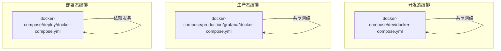
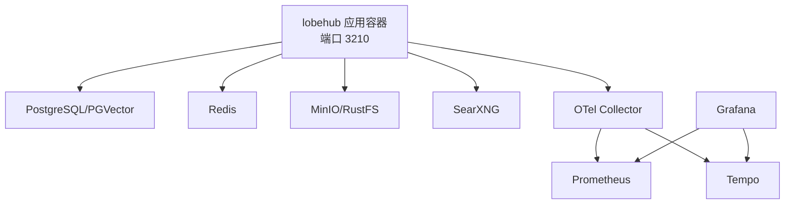
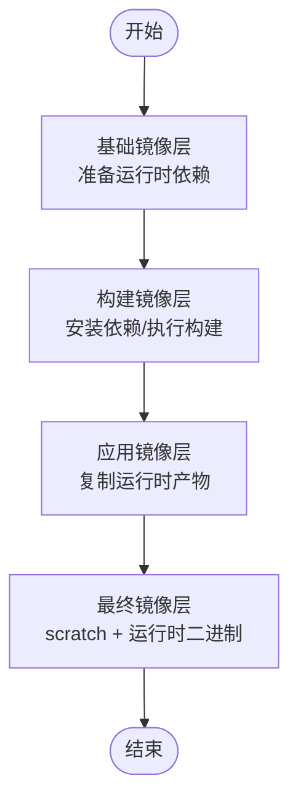
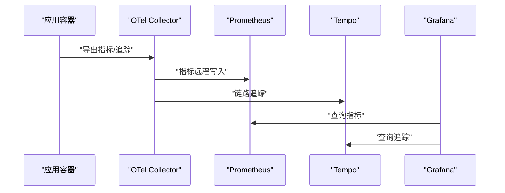
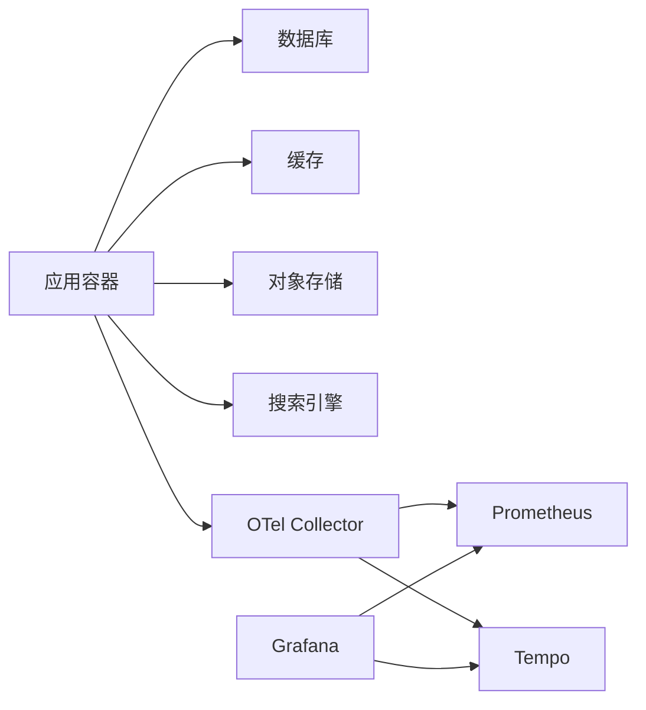

# 部署架构设计

<cite>
**本文档引用的文件**
- [Dockerfile](file://Dockerfile)
- [docker-compose/deploy/docker-compose.yml](file://docker-compose/deploy/docker-compose.yml)
- [docker-compose/dev/docker-compose.yml](file://docker-compose/dev/docker-compose.yml)
- [docker-compose/production/grafana/docker-compose.yml](file://docker-compose/production/grafana/docker-compose.yml)
- [docker-compose/deploy/searxng-settings.yml](file://docker-compose/deploy/searxng-settings.yml)
- [docker-compose/dev/searxng-settings.yml](file://docker-compose/dev/searxng-settings.yml)
- [docker-compose/production/grafana/prometheus/prometheus.yml](file://docker-compose/production/grafana/prometheus/prometheus.yml)
- [docker-compose/production/grafana/otel-collector/collector-config.yaml](file://docker-compose/production/grafana/otel-collector/collector-config.yaml)
- [docker-compose/production/grafana/tempo/tempo.yaml](file://docker-compose/production/grafana/tempo/tempo.yaml)
- [scripts/dockerPrebuild.mts](file://scripts/dockerPrebuild.mts)
</cite>

## 目录

1. [简介](#简介)
2. [项目结构](#项目结构)
3. [核心组件](#核心组件)
4. [架构总览](#架构总览)
5. [详细组件分析](#详细组件分析)
6. [依赖关系分析](#依赖关系分析)
7. [性能考虑](#性能考虑)
8. [故障排查指南](#故障排查指南)
9. [结论](#结论)
10. [附录](#附录)

## 简介

本文件面向 LobeHub 项目的部署架构设计，覆盖容器化部署、微服务部署与静态资源部署三类模式；深入解析 Docker 多阶段构建与镜像优化策略、环境变量管理机制；阐述云原生部署（Kubernetes）的配置思路、负载均衡与自动扩缩容实践；并给出 CI/CD 流程设计建议（自动化测试、构建流水线与发布策略），以及监控告警、日志收集与性能监控的运维架构方案。

## 项目结构

LobeHub 提供了三种部署形态的编排模板：

- 开发态编排：集中在一个网络中，便于本地联调与快速启动
- 生产态编排：集成 Grafana/Tempo/Prometheus/OpenTelemetry Collector，形成可观测性闭环
- 部署态编排：生产级最小可用组合，包含数据库、缓存、对象存储、搜索引擎等

图表来源

- [docker-compose/dev/docker-compose.yml](file://docker-compose/dev/docker-compose.yml#L1-L123)
- [docker-compose/production/grafana/docker-compose.yml](file://docker-compose/production/grafana/docker-compose.yml#L1-L251)
- [docker-compose/deploy/docker-compose.yml](file://docker-compose/deploy/docker-compose.yml#L1-L144)

章节来源

- [docker-compose/dev/docker-compose.yml](file://docker-compose/dev/docker-compose.yml#L1-L123)
- [docker-compose/production/grafana/docker-compose.yml](file://docker-compose/production/grafana/docker-compose.yml#L1-L251)
- [docker-compose/deploy/docker-compose.yml](file://docker-compose/deploy/docker-compose.yml#L1-L144)

## 核心组件

- 应用容器（lobehub）
  - 基于多阶段构建，最终运行在精简运行时镜像上，暴露固定端口并以独立进程启动
  - 通过环境变量注入数据库、认证、缓存、对象存储、搜索引擎等外部依赖
- 数据库（PostgreSQL/PGVector）
  - 开发态使用 pgvector:pg17，生产态使用 paradedb/paradedb:latest-pg17
  - 提供健康检查与持久化卷
- 缓存（Redis）
  - 使用官方 Alpine 镜像，启用 AOF 持久化
- 对象存储（MinIO 或 RustFS）
  - MinIO：生产态默认使用，支持桶初始化与 CORS
  - RustFS：开发态可选替代，提供 S3 兼容接口
- 搜索引擎（SearXNG）
  - 统一搜索入口，支持自定义配置文件与健康检查
- 可观测性（Prometheus、Tempo、Grafana、OTel Collector）
  - Prometheus 抓取指标，Tempo 接收链路追踪，Grafana 展示仪表盘，OTel Collector 负责聚合与导出

章节来源

- [Dockerfile](file://Dockerfile#L104-L153)
- [docker-compose/production/grafana/docker-compose.yml](file://docker-compose/production/grafana/docker-compose.yml#L19-L96)
- [docker-compose/production/grafana/docker-compose.yml](file://docker-compose/production/grafana/docker-compose.yml#L138-L149)
- [docker-compose/production/grafana/docker-compose.yml](file://docker-compose/production/grafana/docker-compose.yml#L160-L233)
- [docker-compose/production/grafana/docker-compose.yml](file://docker-compose/production/grafana/docker-compose.yml#L38-L62)
- [docker-compose/production/grafana/docker-compose.yml](file://docker-compose/production/grafana/docker-compose.yml#L85-L96)
- [docker-compose/production/grafana/docker-compose.yml](file://docker-compose/production/grafana/docker-compose.yml#L98-L149)

## 架构总览

下图展示了生产态编排的整体交互：应用容器依赖数据库、缓存与对象存储；应用通过 OTel Collector 导出指标与链路追踪至 Prometheus 与 Tempo；Grafana 作为统一可视化入口。

图表来源

- [docker-compose/production/grafana/docker-compose.yml](file://docker-compose/production/grafana/docker-compose.yml#L160-L233)
- [docker-compose/production/grafana/otel-collector/collector-config.yaml](file://docker-compose/production/grafana/otel-collector/collector-config.yaml#L1-L46)
- [docker-compose/production/grafana/prometheus/prometheus.yml](file://docker-compose/production/grafana/prometheus/prometheus.yml#L1-L12)
- [docker-compose/production/grafana/tempo/tempo.yaml](file://docker-compose/production/grafana/tempo/tempo.yaml#L1-L59)

## 详细组件分析

### Docker 容器化设计

- 多阶段构建
  - 基础镜像层：准备运行时依赖与代理链路
  - 构建镜像层：安装依赖、执行预构建脚本、执行构建输出
  - 应用镜像层：复制运行时产物与脚本，设置非 root 用户
  - 最终镜像层：基于 scratch，仅包含运行时所需二进制与证书
- 镜像优化
  - 使用 Next.js 输出文件追踪，仅复制必要静态与运行时文件
  - 采用分层缓存策略，减少重复构建时间
  - 运行时镜像极小化，降低攻击面
- 环境变量管理
  - 构建期与运行期变量分离，确保敏感信息不进入镜像层
  - 预构建阶段校验关键环境变量，避免运行期失败
  - 支持多种认证与第三方服务配置（如 SSO、邮件、S3）

图表来源

- [Dockerfile](file://Dockerfile#L5-L27)
- [Dockerfile](file://Dockerfile#L30-L103)
- [Dockerfile](file://Dockerfile#L105-L138)
- [Dockerfile](file://Dockerfile#L135-L153)

章节来源

- [Dockerfile](file://Dockerfile#L1-L344)
- [scripts/dockerPrebuild.mts](file://scripts/dockerPrebuild.mts#L1-L125)

### 微服务部署模式

- 单体容器模式
  - 将应用、搜索引擎与可观测性组件打包在同一网络中，适合开发与演示
- 分离服务模式
  - 将数据库、缓存、对象存储与应用解耦，便于弹性扩展与独立治理
- 云原生模式
  - 在 Kubernetes 中以 Deployment/StatefulSet/Service/Ingress 等资源抽象部署
  - 结合 HPA/VPAs 实现 CPU / 内存自动扩缩容
  - 使用 ConfigMap/Secret 管理配置与密钥

章节来源

- [docker-compose/dev/docker-compose.yml](file://docker-compose/dev/docker-compose.yml#L1-L123)
- [docker-compose/production/grafana/docker-compose.yml](file://docker-compose/production/grafana/docker-compose.yml#L1-L251)

### 静态资源部署

- 应用构建产物
  - Next.js Standalone 输出与 Vite SPA 资源均被复制到运行时镜像
- CDN / 边缘分发
  - 建议将静态资源托管于 CDN 并开启缓存与压缩
- 对象存储直传
  - 通过 S3 兼容接口上传媒体与附件，结合桶策略与访问控制

章节来源

- [Dockerfile](file://Dockerfile#L113-L118)

### 云原生部署（Kubernetes）配置思路

- 资源清单要点
  - Deployment：副本数、滚动更新策略、探针（liveness/readiness）
  - Service：ClusterIP/NodePort/LoadBalancer，端口映射与会话亲和
  - ConfigMap：非敏感配置（如搜索引擎设置）
  - Secret：数据库连接、认证密钥、第三方服务凭据
  - PersistentVolume：数据库与缓存数据持久化
  - Ingress：TLS 终止、路径路由、限流与重试
- 自动扩缩容
  - HPA：基于 CPU / 内存或自定义指标触发
  - VPA：动态调整资源请求与限制
- 负载均衡
  - Ingress 控制器（如 Nginx/Contour/Traefik）实现七层负载均衡
  - Service ClusterIP 模式用于内部服务间通信

\[本节为概念性说明，未直接分析具体文件，故无 “章节来源”]

### CI/CD 流程设计

- 自动化测试
  - 单元测试、集成测试、端到端测试在流水线中按优先级执行
  - 代码覆盖率阈值与质量门禁
- 构建流水线
  - 触发条件：分支保护、PR 合并、标签推送
  - 步骤：依赖安装、预构建检查、多阶段构建、镜像扫描、推送仓库
- 发布策略
  - 蓝绿 / 金丝雀发布：逐步替换流量，降低风险
  - 回滚策略：版本标记与一键回滚
  - 环境隔离：开发 / 测试 / 预发布 / 生产严格分离

\[本节为概念性说明，未直接分析具体文件，故无 “章节来源”]

### 监控告警、日志收集与性能监控

- 指标采集
  - Prometheus 抓取应用与基础设施指标，支持远程写入
- 链路追踪
  - OTel Collector 接收 OTLP，导出至 Tempo，支持分布式追踪
- 日志管理
  - 应用容器标准输出由 Collector 导出至日志系统（可选）
- 可视化与告警
  - Grafana 仪表盘展示关键指标，结合告警规则（Prometheus Alertmanager）

图表来源

- [docker-compose/production/grafana/otel-collector/collector-config.yaml](file://docker-compose/production/grafana/otel-collector/collector-config.yaml#L1-L46)
- [docker-compose/production/grafana/prometheus/prometheus.yml](file://docker-compose/production/grafana/prometheus/prometheus.yml#L1-L12)
- [docker-compose/production/grafana/tempo/tempo.yaml](file://docker-compose/production/grafana/tempo/tempo.yaml#L1-L59)

## 依赖关系分析

- 组件耦合
  - 应用对数据库、缓存、对象存储、搜索引擎存在强依赖
  - 可观测性组件与应用弱耦合，通过 OTLP/HTTP 协议对接
- 外部依赖
  - 第三方模型提供商、邮件服务、S3 存储等通过环境变量注入
- 潜在循环依赖
  - 编排层面通过网络隔离与健康检查避免循环依赖
- 配置契约
  - 关键环境变量在预构建阶段进行校验，确保运行期一致性

图表来源

- [docker-compose/production/grafana/docker-compose.yml](file://docker-compose/production/grafana/docker-compose.yml#L160-L233)
- [docker-compose/production/grafana/otel-collector/collector-config.yaml](file://docker-compose/production/grafana/otel-collector/collector-config.yaml#L1-L46)
- [docker-compose/production/grafana/prometheus/prometheus.yml](file://docker-compose/production/grafana/prometheus/prometheus.yml#L1-L12)
- [docker-compose/production/grafana/tempo/tempo.yaml](file://docker-compose/production/grafana/tempo/tempo.yaml#L1-L59)

章节来源

- [scripts/dockerPrebuild.mts](file://scripts/dockerPrebuild.mts#L24-L53)

## 性能考虑

- 镜像体积与启动时间
  - 多阶段构建与最小运行时镜像显著降低镜像体积与启动时间
- 资源分配
  - 为数据库与缓存预留充足内存，避免 GC 压力导致抖动
- 网络与存储
  - 对象存储与搜索引擎尽量与应用同可用区部署，降低延迟
- 指标与追踪
  - 启用细粒度指标与采样策略，避免过度开销

\[本节提供通用指导，未直接分析具体文件，故无 “章节来源”]

## 故障排查指南

- 环境变量缺失
  - 预构建阶段会检测关键变量，若缺失则打印错误并退出
- 认证配置冲突
  - 生产态编排包含 OIDC 配置校验逻辑，确保 Issuer 一致
- 健康检查失败
  - 数据库、缓存、对象存储与搜索引擎均配置健康检查，定位失败原因
- 日志与追踪
  - 通过 Grafana 查看指标与追踪，结合容器日志定位问题

章节来源

- [scripts/dockerPrebuild.mts](file://scripts/dockerPrebuild.mts#L24-L53)
- [docker-compose/production/grafana/docker-compose.yml](file://docker-compose/production/grafana/docker-compose.yml#L194-L233)

## 结论

LobeHub 的部署架构以 Docker 多阶段构建为核心，结合开发态、生产态与部署态三种编排模板，满足不同场景需求。通过清晰的环境变量管理、可观测性闭环与模块化服务编排，既保证了开发效率，也为生产环境的稳定性与可维护性提供了坚实基础。建议在 Kubernetes 环境中进一步细化资源配额、自动扩缩容策略与发布流程，持续提升系统的弹性与可靠性。

## 附录

- 搜索引擎配置
  - 开发与部署环境分别提供独立的 SearXNG 设置文件，便于按需定制
- 可观测性配置
  - Prometheus、Tempo、OTel Collector 的配置文件位于生产态编排目录中，可按需调整抓取间隔与导出目标

章节来源

- [docker-compose/deploy/searxng-settings.yml](file://docker-compose/deploy/searxng-settings.yml#L1-L200)
- [docker-compose/dev/searxng-settings.yml](file://docker-compose/dev/searxng-settings.yml#L1-L200)
- [docker-compose/production/grafana/prometheus/prometheus.yml](file://docker-compose/production/grafana/prometheus/prometheus.yml#L1-L12)
- [docker-compose/production/grafana/otel-collector/collector-config.yaml](file://docker-compose/production/grafana/otel-collector/collector-config.yaml#L1-L46)
- [docker-compose/production/grafana/tempo/tempo.yaml](file://docker-compose/production/grafana/tempo/tempo.yaml#L1-L59)
