# API 服务层

<cite>
**本文引用的文件**
- [src/services/agent.ts](file://src/services/agent.ts)
- [src/services/aiChat.ts](file://src/services/aiChat.ts)
- [src/services/user/index.ts](file://src/services/user/index.ts)
- [src/services/tool.ts](file://src/services/tool.ts)
- [src/services/agentRuntime/client.ts](file://src/services/agentRuntime/client.ts)
- [src/server/routers/lambda/index.ts](file://src/server/routers/lambda/index.ts)
- [src/server/routers/mobile/index.ts](file://src/server/routers/mobile/index.ts)
- [src/server/routers/mobile/topic.ts](file://src/server/routers/mobile/topic.ts)
- [src/libs/trpc/client/lambda.ts](file://src/libs/trpc/client/lambda.ts)
- [src/libs/trpc/lambda/init.ts](file://src/libs/trpc/lambda/init.ts)
- [src/business/server/trpc-middlewares/lambda.ts](file://src/business/server/trpc-middlewares/lambda.ts)
- [src/app/(backend)/trpc/mobile/[trpc]/route.ts](file://src/app/(backend)/trpc/mobile/[trpc]/route.ts)
- [src/spa/entry.mobile.tsx](file://src/spa/entry.mobile.tsx)
- [src/spa/router/mobileRouter.config.tsx](file://src/spa/router/mobileRouter.config.tsx)
- [src/app/spa/[variants]/[[...path]]/mobileHtmlTemplate.source.ts](file://src/app/spa/[variants]/[[...path]]/mobileHtmlTemplate.source.ts)
</cite>

## 更新摘要
**所做更改**
- 新增移动端路由模块支持，包括独立的 mobileRouter 和移动端 tRPC 端点
- 扩展 SPA 移动端入口和路由配置
- 新增移动端主题模板和国际化支持
- 增强移动端话题管理功能，支持批量操作和搜索

## 目录
1. [简介](#简介)
2. [项目结构](#项目结构)
3. [核心组件](#核心组件)
4. [架构总览](#架构总览)
5. [详细组件分析](#详细组件分析)
6. [移动端路由模块](#移动端路由模块)
7. [依赖关系分析](#依赖关系分析)
8. [性能考量](#性能考量)
9. [故障排查指南](#故障排查指南)
10. [结论](#结论)
11. [附录](#附录)

## 简介
本文件面向 API 服务层，系统性阐述基于 tRPC 的后端架构与前端服务封装，覆盖以下主题：
- 类型安全的客户端-服务器通信：通过 tRPC 的强类型定义与数据转换器，确保请求/响应在编译期与运行期均保持一致。
- 中间件与错误管理：统一的错误格式化、401 登录提示防抖、批量/非批量请求策略等。
- 服务层模块化设计：以"服务类"封装业务调用，暴露简洁方法，隐藏底层网络细节。
- 典型服务模块职责：Agent 服务、聊天服务（AiChat）、用户服务、工具服务等。
- **新增移动端路由模块**：支持独立的移动端 API 端点和话题管理功能。
- 新增 API 端点与业务逻辑实践：从路由到服务类的完整流程示例路径。
- 版本管理、性能监控与安全防护：基于现有实现的建议与最佳实践。
- 测试策略、部署配置与运维监控：结合仓库现有测试与中间件结构给出指导。

## 项目结构
服务层采用"前端服务类 + tRPC 路由器 + 业务服务"的分层设计，现已扩展支持移动端：
- 前端服务类：位于 src/services 下，封装对 lambdaClient 的调用，提供语义化方法名与参数校验。
- tRPC 路由器：位于 src/server/routers 下，包含 lambda（传统 Web）和 mobile（移动端）两个路由器。
- tRPC 客户端：位于 src/libs/trpc/client 下，支持 lambda 和移动端客户端配置。
- 中间件：位于 src/business/server/trpc-middlewares 下，用于权限、配额、存储使用检查等横切关注点。
- SPA 移动端：独立的移动端入口、路由配置和主题模板。

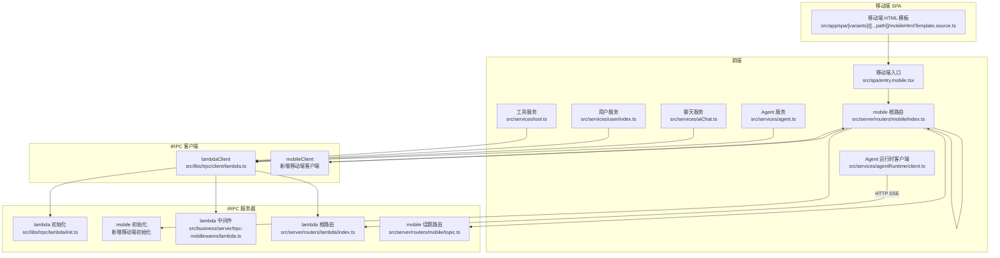

**图表来源**
- [src/services/agent.ts:63-231](file://src/services/agent.ts#L63-L231)
- [src/services/aiChat.ts:6-25](file://src/services/aiChat.ts#L6-L25)
- [src/services/user/index.ts:13-71](file://src/services/user/index.ts#L13-L71)
- [src/services/tool.ts:6-22](file://src/services/tool.ts#L6-L22)
- [src/services/agentRuntime/client.ts:11-77](file://src/services/agentRuntime/client.ts#L11-L77)
- [src/libs/trpc/client/lambda.ts:135-141](file://src/libs/trpc/client/lambda.ts#L135-L141)
- [src/libs/trpc/lambda/init.ts:15-33](file://src/libs/trpc/lambda/init.ts#L15-L33)
- [src/business/server/trpc-middlewares/lambda.ts:3-9](file://src/business/server/trpc-middlewares/lambda.ts#L3-L9)
- [src/server/routers/lambda/index.ts:56-107](file://src/server/routers/lambda/index.ts#L56-L107)
- [src/server/routers/mobile/index.ts:1-59](file://src/server/routers/mobile/index.ts#L1-L59)
- [src/server/routers/mobile/topic.ts:1-167](file://src/server/routers/mobile/topic.ts#L1-L167)
- [src/app/(backend)/trpc/mobile/[trpc]/route.ts](file://src/app/(backend)/trpc/mobile/[trpc]/route.ts#L1-L34)
- [src/spa/entry.mobile.tsx:1-18](file://src/spa/entry.mobile.tsx#L1-L18)
- [src/spa/router/mobileRouter.config.tsx:47-322](file://src/spa/router/mobileRouter.config.tsx#L47-L322)
- [src/app/spa/[variants]/[[...path]]/mobileHtmlTemplate.source.ts](file://src/app/spa/[variants]/[[...path]]/mobileHtmlTemplate.source.ts#L1-L6)

**章节来源**
- [src/server/routers/lambda/index.ts:56-107](file://src/server/routers/lambda/index.ts#L56-L107)
- [src/libs/trpc/client/lambda.ts:135-141](file://src/libs/trpc/client/lambda.ts#L135-L141)
- [src/libs/trpc/lambda/init.ts:15-33](file://src/libs/trpc/lambda/init.ts#L15-L33)
- [src/business/server/trpc-middlewares/lambda.ts:3-9](file://src/business/server/trpc-middlewares/lambda.ts#L3-L9)
- [src/server/routers/mobile/index.ts:1-59](file://src/server/routers/mobile/index.ts#L1-L59)
- [src/server/routers/mobile/topic.ts:1-167](file://src/server/routers/mobile/topic.ts#L1-L167)
- [src/app/(backend)/trpc/mobile/[trpc]/route.ts](file://src/app/(backend)/trpc/mobile/[trpc]/route.ts#L1-L34)
- [src/spa/entry.mobile.tsx:1-18](file://src/spa/entry.mobile.tsx#L1-L18)
- [src/spa/router/mobileRouter.config.tsx:47-322](file://src/spa/router/mobileRouter.config.tsx#L47-L322)
- [src/app/spa/[variants]/[[...path]]/mobileHtmlTemplate.source.ts](file://src/app/spa/[variants]/[[...path]]/mobileHtmlTemplate.source.ts#L1-L6)

## 核心组件
- 类型安全客户端：lambdaClient 提供统一的链接组合、错误处理与批处理策略，并通过 superjson 实现复杂数据的序列化传输。
- **移动端客户端**：新增独立的移动端 tRPC 客户端，支持移动端特有的路由和配置。
- 服务类封装：AgentService、AiChatService、UserService、ToolService 将 tRPC 调用包装为易用的方法，隐藏上下文、信号与通知控制。
- 根路由聚合：lambdaRouter 和 mobileRouter 分别将各领域路由聚合，形成统一入口，便于版本化与扩展。
- 错误格式化与中间件：统一错误形状，支持将底层 cause.data 注入返回体；中间件可扩展配额、存储使用等检查。

**章节来源**
- [src/libs/trpc/client/lambda.ts:19-75](file://src/libs/trpc/client/lambda.ts#L19-L75)
- [src/libs/trpc/client/lambda.ts:120-130](file://src/libs/trpc/client/lambda.ts#L120-L130)
- [src/libs/trpc/client/lambda.ts:135-141](file://src/libs/trpc/client/lambda.ts#L135-L141)
- [src/libs/trpc/lambda/init.ts:19-28](file://src/libs/trpc/lambda/init.ts#L19-L28)
- [src/server/routers/lambda/index.ts:56-107](file://src/server/routers/lambda/index.ts#L56-L107)
- [src/server/routers/mobile/index.ts:32-58](file://src/server/routers/mobile/index.ts#L32-L58)

## 架构总览
下图展示了从前端服务类到 tRPC 客户端再到服务器端的调用链路，以及错误处理与批处理策略的集成位置。现已支持移动端独立路由。

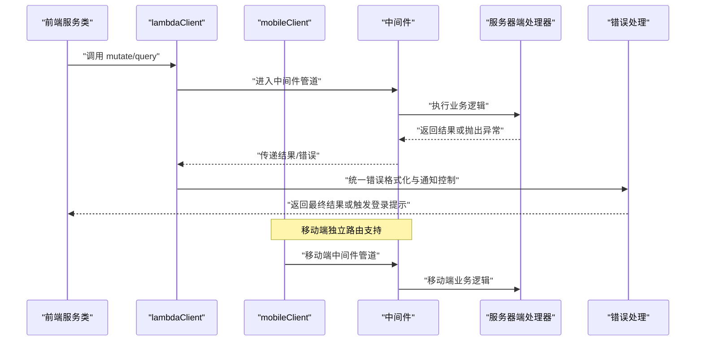

**图表来源**
- [src/services/agent.ts:91-98](file://src/services/agent.ts#L91-L98)
- [src/libs/trpc/client/lambda.ts:19-75](file://src/libs/trpc/client/lambda.ts#L19-L75)
- [src/libs/trpc/lambda/init.ts:19-28](file://src/libs/trpc/lambda/init.ts#L19-L28)
- [src/business/server/trpc-middlewares/lambda.ts:3-9](file://src/business/server/trpc-middlewares/lambda.ts#L3-L9)
- [src/app/(backend)/trpc/mobile/[trpc]/route.ts](file://src/app/(backend)/trpc/mobile/[trpc]/route.ts#L9-L31)

## 详细组件分析

### Agent 服务（AgentService）
职责与能力
- 代理检索与去重：根据市场标识符查询代理是否存在，避免重复创建。
- 创建代理：支持带会话与仅代理两种模式，自动规范化市场代理配置（模型对象转字符串）。
- 知识库与文件绑定：为代理绑定知识库或文件，支持启用/禁用与删除操作。
- 配置更新：支持更新代理配置与元信息，可传入 AbortSignal 控制取消。
- 查询与排序：支持关键词过滤、分页查询代理列表。
- 复制与固定：复制代理并返回新 ID，支持固定/取消固定。

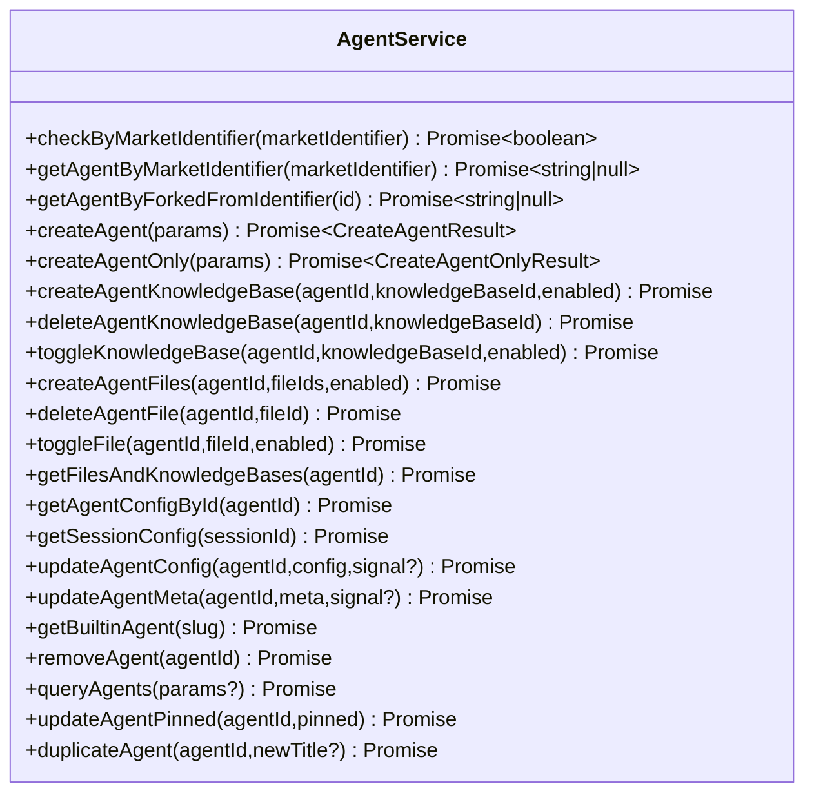

**图表来源**
- [src/services/agent.ts:63-231](file://src/services/agent.ts#L63-L231)

**章节来源**
- [src/services/agent.ts:63-231](file://src/services/agent.ts#L63-L231)

### 聊天服务（AiChatService）
职责与能力
- 服务端消息发送：封装聊天消息发送，支持 AbortController 与上下文控制。
- 结构化输出生成：支持结构化 JSON 输出生成，同样具备中断与上下文控制。

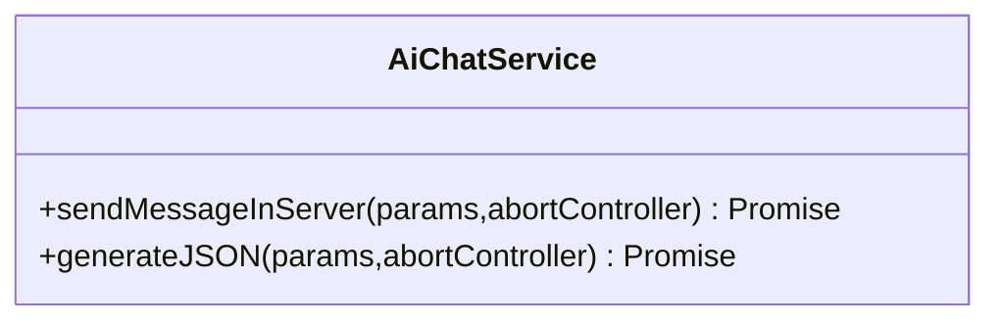

**图表来源**
- [src/services/aiChat.ts:6-25](file://src/services/aiChat.ts#L6-L25)

**章节来源**
- [src/services/aiChat.ts:6-25](file://src/services/aiChat.ts#L6-L25)

### 用户服务（UserService）
职责与能力
- 用户状态与注册周期：获取用户注册时长与初始化状态。
- SSO 提供商：查询可用的单点登录提供商。
- 引导与偏好：更新引导状态、兴趣、头像、全名、用户名、偏好与设置。
- 设置重置：一键重置用户设置。

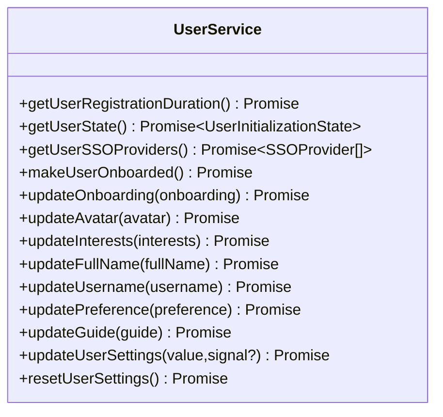

**图表来源**
- [src/services/user/index.ts:13-71](file://src/services/user/index.ts#L13-L71)

**章节来源**
- [src/services/user/index.ts:13-71](file://src/services/user/index.ts#L13-L71)

### 工具服务（ToolService）
职责与能力
- 插件列表：获取插件列表，自动注入语言与分页参数。
- 清单解析：提供工具清单获取与 OpenAI 清单转换能力。

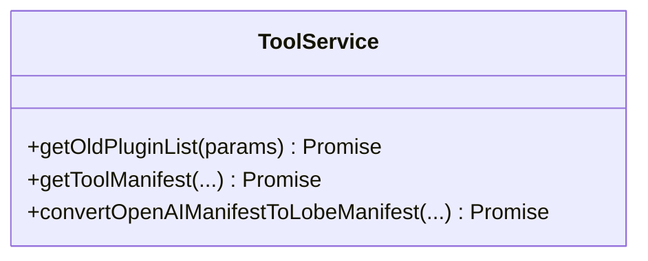

**图表来源**
- [src/services/tool.ts:6-22](file://src/services/tool.ts#L6-L22)

**章节来源**
- [src/services/tool.ts:6-22](file://src/services/tool.ts#L6-L22)

### Agent 运行时客户端（AgentRuntimeClient）
职责与能力
- SSE 流式连接：创建与服务器的事件流连接，支持历史回放、断线重连回调与事件解析。
- 统一错误处理：对连接关闭、解析失败与网络错误进行统一处理与回调。

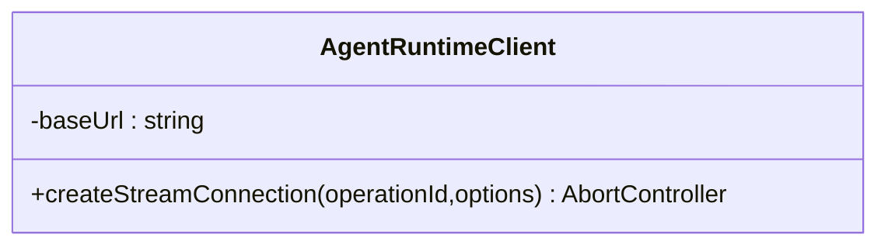

**图表来源**
- [src/services/agentRuntime/client.ts:11-77](file://src/services/agentRuntime/client.ts#L11-L77)

**章节来源**
- [src/services/agentRuntime/client.ts:11-77](file://src/services/agentRuntime/client.ts#L11-L77)

### tRPC 客户端与错误管理
关键特性
- 统一错误处理：拦截 401 并进行防抖登录提示，其他错误记录日志；支持忽略中止错误。
- 批量/非批量策略：对初始加载与慢速接口跳过批处理，其余走批处理以提升吞吐。
- 认证头注入：动态计算并注入认证头，必要时携带模型提供商信息。
- 数据转换：使用 superjson 序列化复杂数据结构。

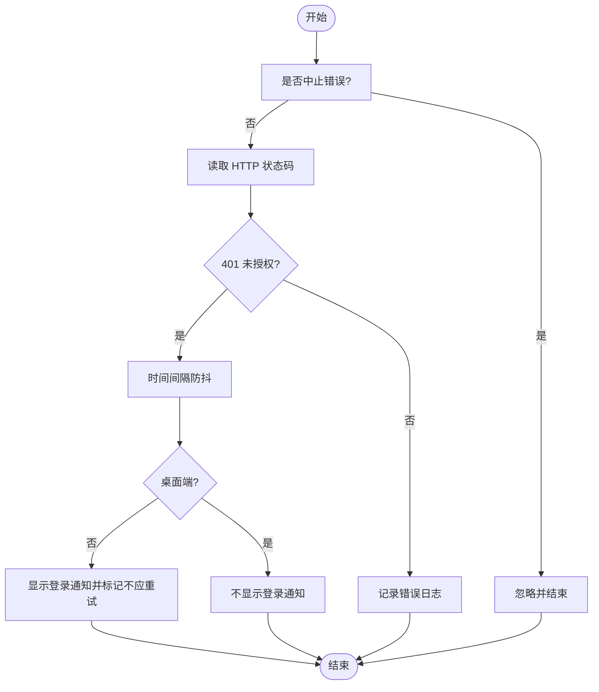

**图表来源**
- [src/libs/trpc/client/lambda.ts:19-75](file://src/libs/trpc/client/lambda.ts#L19-L75)

**章节来源**
- [src/libs/trpc/client/lambda.ts:19-75](file://src/libs/trpc/client/lambda.ts#L19-L75)
- [src/libs/trpc/client/lambda.ts:120-130](file://src/libs/trpc/client/lambda.ts#L120-L130)
- [src/libs/trpc/client/lambda.ts:95-115](file://src/libs/trpc/client/lambda.ts#L95-L115)

### 根路由与中间件
- 根路由聚合：lambdaRouter 和 mobileRouter 分别将 agent、aiChat、user、market、file 等路由聚合，便于版本化与扩展。
- 中间件：当前中间件占位，可用于后续接入配额、存储使用检查等。

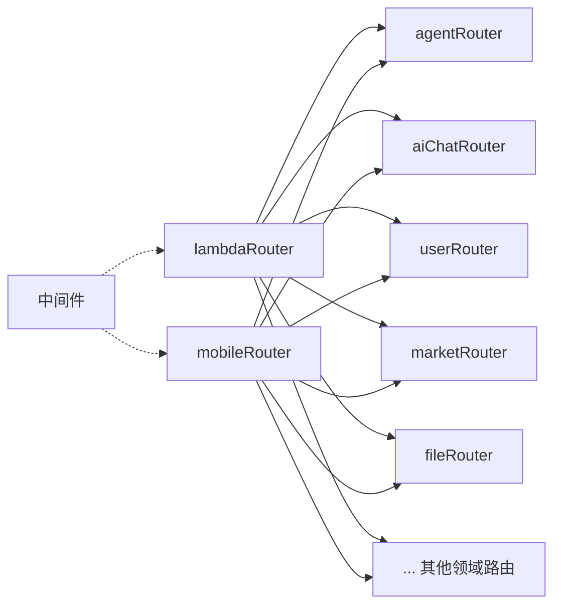

**图表来源**
- [src/server/routers/lambda/index.ts:56-107](file://src/server/routers/lambda/index.ts#L56-L107)
- [src/server/routers/mobile/index.ts:32-58](file://src/server/routers/mobile/index.ts#L32-L58)
- [src/business/server/trpc-middlewares/lambda.ts:3-9](file://src/business/server/trpc-middlewares/lambda.ts#L3-L9)

**章节来源**
- [src/server/routers/lambda/index.ts:56-107](file://src/server/routers/lambda/index.ts#L56-L107)
- [src/server/routers/mobile/index.ts:32-58](file://src/server/routers/mobile/index.ts#L32-L58)
- [src/business/server/trpc-middlewares/lambda.ts:3-9](file://src/business/server/trpc-middlewares/lambda.ts#L3-L9)

## 移动端路由模块

### 移动端根路由（mobileRouter）
移动端路由模块提供了完整的移动端 API 支持，包含以下核心功能：

- **健康检查**：提供 `/trpc/mobile/healthcheck` 端点用于服务状态检测
- **话题管理**：支持批量创建、删除、克隆、搜索和更新话题
- **完整领域覆盖**：包含 agent、aiChat、user、knowledgeBase 等所有核心业务领域的移动端适配

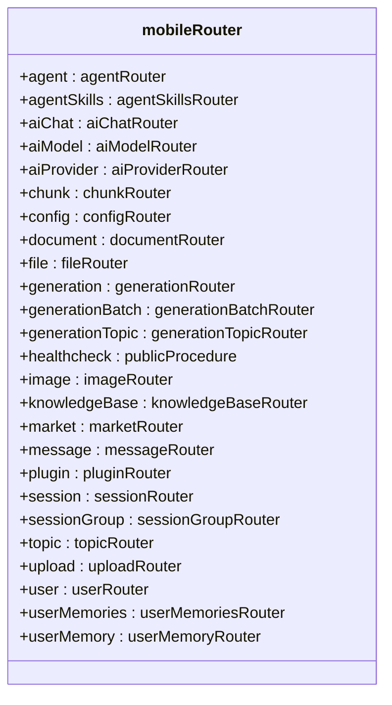

**图表来源**
- [src/server/routers/mobile/index.ts:32-58](file://src/server/routers/mobile/index.ts#L32-L58)

**章节来源**
- [src/server/routers/mobile/index.ts:1-59](file://src/server/routers/mobile/index.ts#L1-L59)

### 移动端话题路由（topicRouter）
移动端话题路由提供了丰富的话题管理功能，支持批量操作和高级查询：

- **批量操作**：支持批量创建、删除和按会话删除话题
- **克隆功能**：支持克隆现有话题并可指定新标题
- **搜索功能**：支持关键词搜索和会话级搜索
- **统计功能**：提供话题数量统计和排名功能
- **权限控制**：使用认证过程保护敏感操作

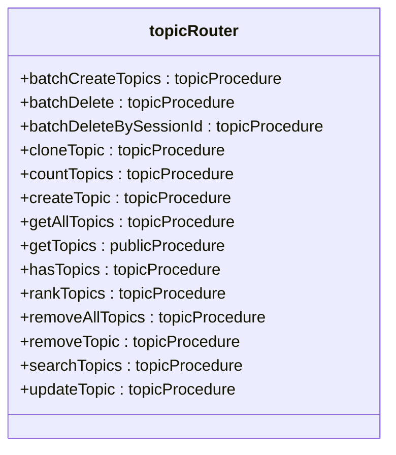

**图表来源**
- [src/server/routers/mobile/topic.ts:17-164](file://src/server/routers/mobile/topic.ts#L17-L164)

**章节来源**
- [src/server/routers/mobile/topic.ts:1-167](file://src/server/routers/mobile/topic.ts#L1-L167)

### 移动端 tRPC 端点
移动端 tRPC 端点提供了专门的移动端 API 接口：

- **端点路径**：`/trpc/mobile`
- **请求处理**：使用 fetchRequestHandler 处理 tRPC 请求
- **上下文创建**：通过 createLambdaContext 创建移动端专用上下文
- **错误处理**：提供移动端特定的错误日志记录
- **响应元数据**：使用 createResponseMeta 生成响应元数据

**章节来源**
- [src/app/(backend)/trpc/mobile/[trpc]/route.ts](file://src/app/(backend)/trpc/mobile/[trpc]/route.ts#L1-L34)

### 移动端 SPA 配置
移动端 SPA 提供了完整的移动端应用支持：

- **入口文件**：`src/spa/entry.mobile.tsx` 定义移动端应用入口
- **路由配置**：`src/spa/router/mobileRouter.config.tsx` 包含完整的移动端路由配置
- **HTML 模板**：`src/app/spa/[variants]/[[...path]]/mobileHtmlTemplate.source.ts` 提供移动端 HTML 模板
- **主题支持**：内置深色/浅色主题切换和 RTL 支持
- **国际化**：支持多语言环境检测和本地化

**章节来源**
- [src/spa/entry.mobile.tsx:1-18](file://src/spa/entry.mobile.tsx#L1-L18)
- [src/spa/router/mobileRouter.config.tsx:47-322](file://src/spa/router/mobileRouter.config.tsx#L47-L322)
- [src/app/spa/[variants]/[[...path]]/mobileHtmlTemplate.source.ts](file://src/app/spa/[variants]/[[...path]]/mobileHtmlTemplate.source.ts#L1-L6)

## 依赖关系分析
- 前端服务类依赖 lambdaClient，后者负责链接、错误处理与批处理策略。
- **移动端服务类**：新增移动端服务类依赖 mobileClient，支持独立的移动端 API 调用。
- 服务器端通过 initTRPC 统一错误格式化与数据转换，中间件可插入横切逻辑。
- 根路由聚合各领域路由，形成清晰的模块边界与扩展点。
- **移动端路由独立**：mobileRouter 提供独立的移动端路由树，与 lambdaRouter 并行存在。

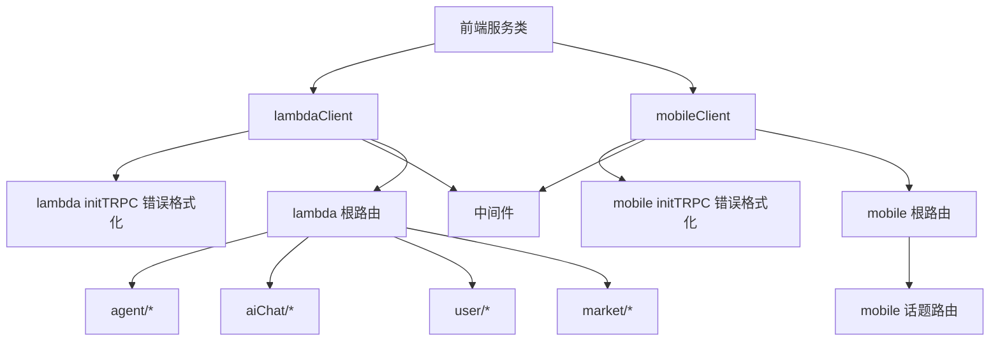

**图表来源**
- [src/libs/trpc/client/lambda.ts:135-141](file://src/libs/trpc/client/lambda.ts#L135-L141)
- [src/libs/trpc/lambda/init.ts:15-33](file://src/libs/trpc/lambda/init.ts#L15-L33)
- [src/server/routers/lambda/index.ts:56-107](file://src/server/routers/lambda/index.ts#L56-L107)
- [src/server/routers/mobile/index.ts:32-58](file://src/server/routers/mobile/index.ts#L32-L58)
- [src/server/routers/mobile/topic.ts:17-164](file://src/server/routers/mobile/topic.ts#L17-L164)

**章节来源**
- [src/libs/trpc/client/lambda.ts:135-141](file://src/libs/trpc/client/lambda.ts#L135-L141)
- [src/libs/trpc/lambda/init.ts:15-33](file://src/libs/trpc/lambda/init.ts#L15-L33)
- [src/server/routers/lambda/index.ts:56-107](file://src/server/routers/lambda/index.ts#L56-L107)
- [src/server/routers/mobile/index.ts:32-58](file://src/server/routers/mobile/index.ts#L32-L58)
- [src/server/routers/mobile/topic.ts:17-164](file://src/server/routers/mobile/topic.ts#L17-L164)

## 性能考量
- 批处理优化：对高频接口启用 httpBatchLink，减少请求数量；对初始加载与慢速接口跳过批处理，保证首屏体验。
- 数据传输：使用 superjson 减少复杂对象序列化开销。
- 取消与中断：通过 AbortController 与中止错误识别，避免无效请求占用资源。
- SSE 连接：Agent 运行时客户端提供断线回调与事件解析，降低前端心智负担。
- **移动端优化**：移动端路由支持更精简的 API 集合，减少不必要的数据传输，提升移动端性能。

**章节来源**
- [src/libs/trpc/client/lambda.ts:120-130](file://src/libs/trpc/client/lambda.ts#L120-L130)
- [src/libs/trpc/client/lambda.ts:116-117](file://src/libs/trpc/client/lambda.ts#L116-L117)
- [src/services/agentRuntime/client.ts:17-74](file://src/services/agentRuntime/client.ts#L17-L74)
- [src/server/routers/mobile/index.ts:32-58](file://src/server/routers/mobile/index.ts#L32-L58)

## 故障排查指南
常见问题与定位
- 401 未授权：客户端会进行防抖处理并触发登录提示（桌面端除外）。若频繁出现，检查会话有效性与认证头注入逻辑。
- 请求被中止：中止错误会被忽略，确认前端是否正确传递 AbortController。
- SSE 连接失败：检查服务器端 /api/agent/stream 端点可达性与 Last-Event-ID 参数。
- **移动端路由问题**：检查 `/trpc/mobile` 端点是否正确配置，确认 mobileRouter 是否正确导入。
- **移动端 SPA 加载失败**：检查移动端 HTML 模板和路由配置，确认移动端入口文件正确加载。

**章节来源**
- [src/libs/trpc/client/lambda.ts:19-75](file://src/libs/trpc/client/lambda.ts#L19-L75)
- [src/services/agentRuntime/client.ts:38-71](file://src/services/agentRuntime/client.ts#L38-L71)
- [src/app/(backend)/trpc/mobile/[trpc]/route.ts](file://src/app/(backend)/trpc/mobile/[trpc]/route.ts#L9-L31)
- [src/spa/entry.mobile.tsx:1-18](file://src/spa/entry.mobile.tsx#L1-L18)

## 结论
本服务层通过 tRPC 实现了类型安全、可维护且高性能的 API 体系。前端服务类以"方法即契约"的方式封装调用，服务器端通过统一的错误格式化与中间件扩展能力，保障了稳定性与可观测性。**新增的移动端路由模块进一步增强了系统的可扩展性，支持独立的移动端 API 端点和话题管理功能，为移动端应用提供了完整的后端支持。** 模块化设计使得新增领域服务与端点变得简单可控。

## 附录

### 如何新增一个 API 端点与业务逻辑（示例路径）
- 定义 tRPC 路由与处理器：参考根路由聚合方式，在对应领域路由中添加过程（procedure），并在服务器端实现业务逻辑。
  - 示例路径：[src/server/routers/lambda/index.ts:56-107](file://src/server/routers/lambda/index.ts#L56-L107)
  - **移动端示例**：[src/server/routers/mobile/index.ts:32-58](file://src/server/routers/mobile/index.ts#L32-L58)
- 在前端服务类中封装调用：
  - 参考现有服务类的 mutate/query 使用方式，添加新方法并传入上下文与信号。
  - 示例路径：[src/services/agent.ts:91-98](file://src/services/agent.ts#L91-L98)
- 若涉及 SSE 或长连接，可复用 Agent 运行时客户端的连接模式。
  - 示例路径：[src/services/agentRuntime/client.ts:17-74](file://src/services/agentRuntime/client.ts#L17-L74)

### API 版本管理建议
- 路由版本化：在根路由中按版本命名空间聚合（例如 lambdaV1Router、lambdaV2Router），逐步迁移。
- **移动端版本化**：移动端路由可独立版本化，支持移动端特有的 API 版本管理。
- 客户端切换：通过环境变量或构建时配置切换 lambdaClient 和 mobileClient 的目标路径。
- 向后兼容：保留旧版本路由一段时间，配合中间件进行渐进式淘汰。

### 性能监控与安全防护
- 性能监控：结合现有错误处理与批处理策略，增加关键端点的耗时埋点与错误率统计。
- 安全防护：在中间件中接入速率限制、配额检查与存储使用上限，防止滥用。
- **移动端安全**：移动端路由应特别注意 API 密钥管理和用户身份验证。

### 测试策略
- 单元测试：针对服务类方法与工具函数编写单元测试，覆盖正常与异常分支。
- 集成测试：在 lambda 和 mobile 路由层编写集成测试，模拟真实请求与响应。
- 端到端测试：结合 e2e 流程，验证从 UI 到后端的完整链路。
- **移动端测试**：新增移动端路由的专门测试套件，验证移动端 API 功能。

### 部署配置与运维监控
- 部署：确保 /trpc/lambda 和 /trpc/mobile 路由可访问，认证头与批处理策略在生产环境生效。
- 运维：结合现有错误处理与日志输出，建立告警与审计机制。
- **移动端监控**：新增移动端 API 的性能监控和错误追踪，确保移动端用户体验。