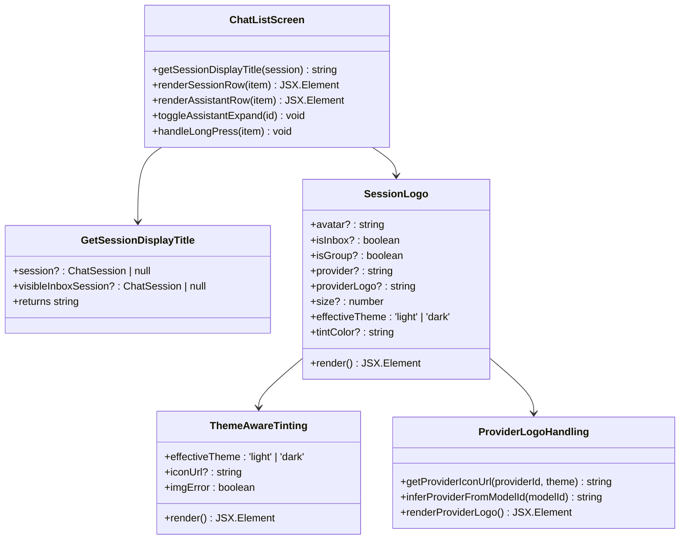
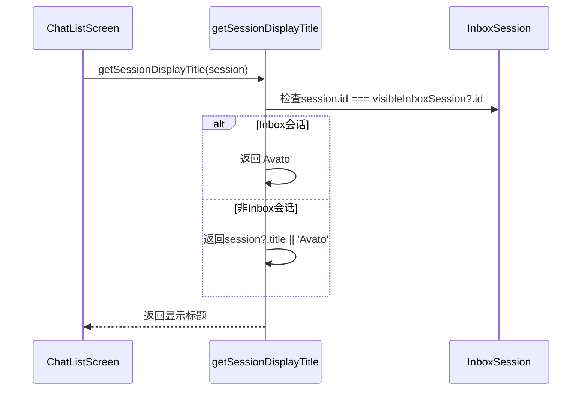
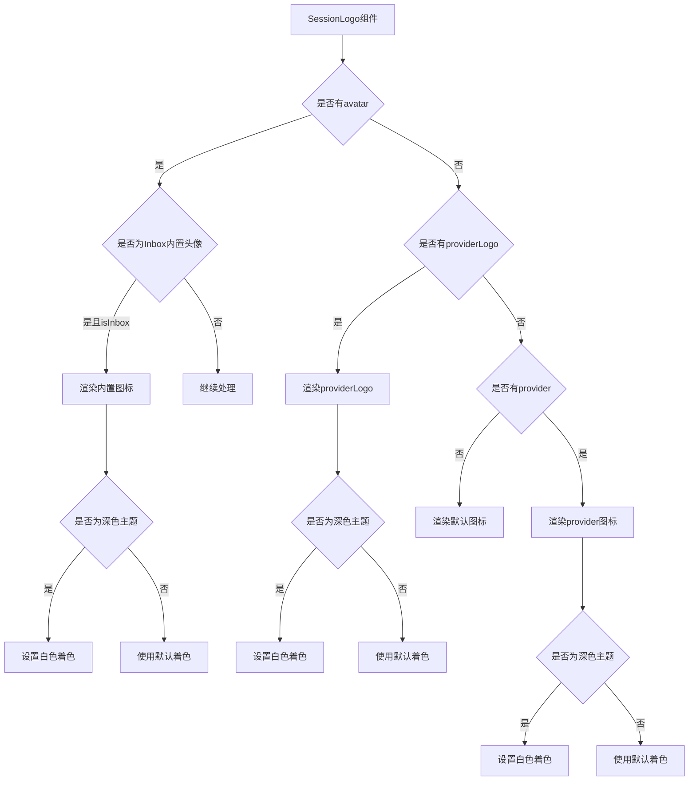
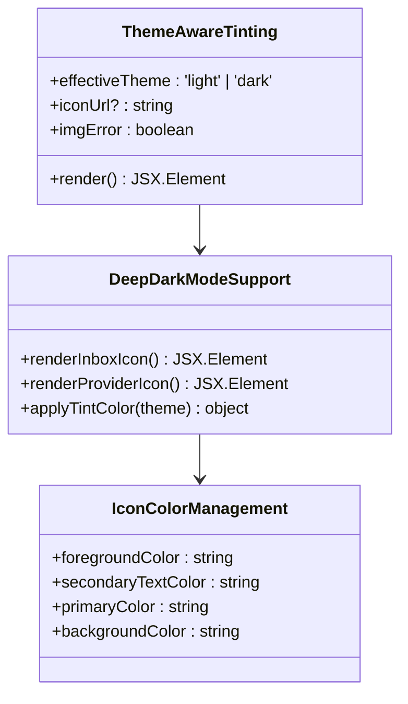
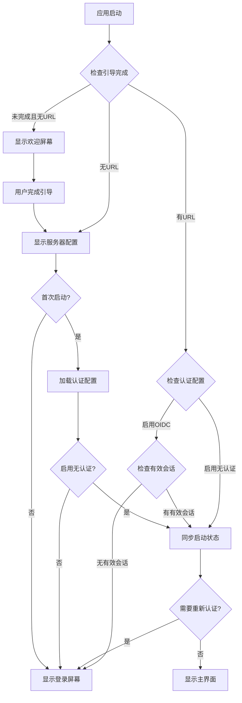
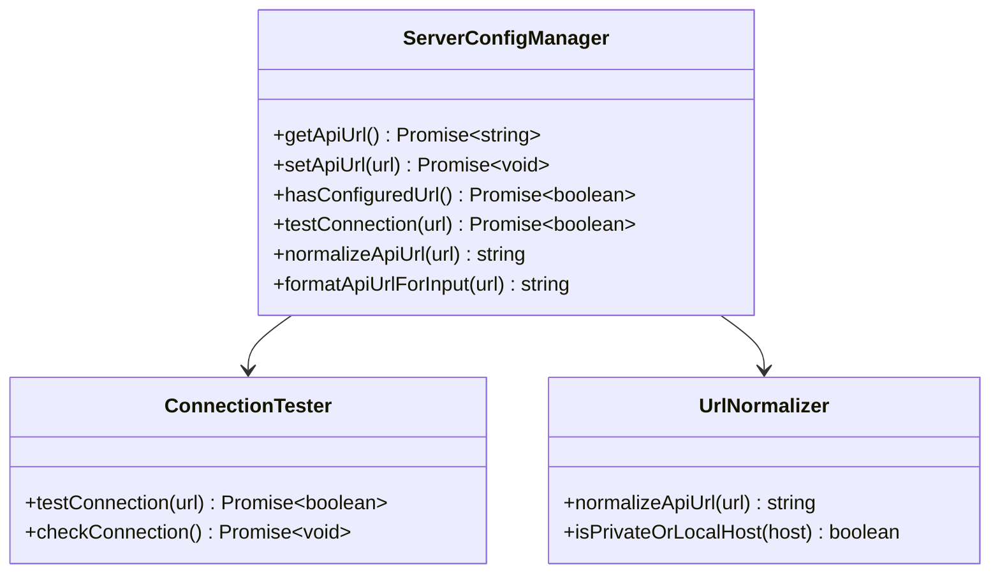
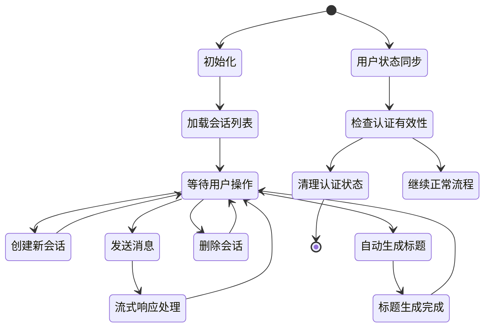
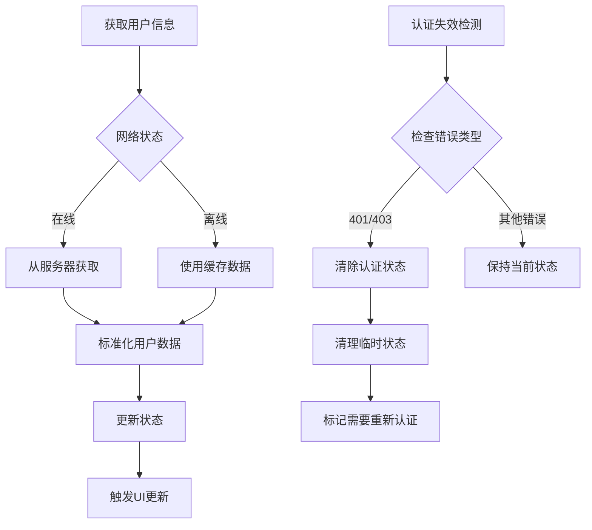
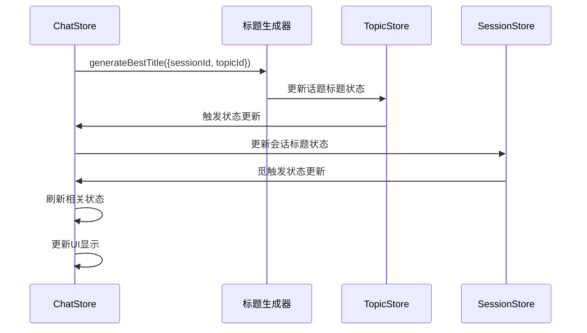
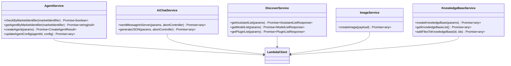

# 移动端 API 服务层

<cite>
**本文档引用的文件**
- [apps/mobile/App.tsx](file://apps/mobile/App.tsx)
- [apps/mobile/package.json](file://apps/mobile/package.json)
- [apps/mobile/src/lib/api.ts](file://apps/mobile/src/lib/api.ts)
- [apps/mobile/src/lib/auth.ts](file://apps/mobile/src/lib/auth.ts)
- [apps/mobile/src/lib/server.ts](file://apps/mobile/src/lib/server.ts)
- [apps/mobile/src/lib/appState.ts](file://apps/mobile/src/lib/appState.ts)
- [apps/mobile/src/lib/i18n.ts](file://apps/mobile/src/lib/i18n.ts)
- [apps/mobile/src/lib/haptics.ts](file://apps/mobile/src/lib/haptics.ts)
- [apps/mobile/src/lib/titleGeneration.ts](file://apps/mobile/src/lib/titleGeneration.ts)
- [apps/mobile/src/store/chat.ts](file://apps/mobile/src/store/chat.ts)
- [apps/mobile/src/store/session.ts](file://apps/mobile/src/store/session.ts)
- [apps/mobile/src/store/user.ts](file://apps/mobile/src/store/user.ts)
- [apps/mobile/src/store/connection.ts](file://apps/mobile/src/store/connection.ts)
- [apps/mobile/src/screens/LoginScreen.tsx](file://apps/mobile/src/screens/LoginScreen.tsx)
- [apps/mobile/src/screens/ServerConfigScreen.tsx](file://apps/mobile/src/screens/ServerConfigScreen.tsx)
- [apps/mobile/src/screens/ChatDetailScreen.tsx](file://apps/mobile/src/screens/ChatDetailScreen.tsx)
- [apps/mobile/src/screens/TopicListScreen.tsx](file://apps/mobile/src/screens/TopicListScreen.tsx)
- [apps/mobile/src/screens/ChatListScreen.tsx](file://apps/mobile/src/screens/ChatListScreen.tsx)
- [apps/mobile/src/components/ui/MessageBubble.tsx](file://apps/mobile/src/components/ui/MessageBubble.tsx)
- [apps/mobile/src/constants/cdn.ts](file://apps/mobile/src/constants/cdn.ts)
- [apps/mobile/src/theme/colors.ts](file://apps/mobile/src/theme/colors.ts)
- [packages/prompts/src/chains/summaryGenerationTitle.ts](file://packages/prompts/src/chains/summaryGenerationTitle.ts)
- [src/services/agent.ts](file://src/services/agent.ts)
- [src/services/aiChat.ts](file://src/services/aiChat.ts)
- [src/services/discover.ts](file://src/services/discover.ts)
- [src/services/image.ts](file://src/services/image.ts)
- [src/services/knowledgeBase.ts](file://src/services/knowledgeBase.ts)
</cite>

## 更新摘要

**变更内容**

- 更新 ChatListScreen 中 getSessionDisplayTitle 函数实现，增强 Inbox 会话标题处理逻辑
- 改进 SessionLogo 组件的 provider logo 处理，支持主题感知的图标渲染
- 优化 theme-aware tinting 机制，确保深色模式下的图标可见性
- 完善主题系统集成，统一图标颜色和样式处理

## 目录

1. [简介](#简介)
2. [项目结构](#项目结构)
3. [核心组件](#核心组件)
4. [架构概览](#架构概览)
5. [详细组件分析](#详细组件分析)
6. [依赖关系分析](#依赖关系分析)
7. [性能考虑](#性能考虑)
8. [故障排除指南](#故障排除指南)
9. [结论](#结论)

## 简介

移动端 API 服务层是 LobeHub 移动应用与后端服务器交互的核心模块。该服务层采用 React Native 技术栈构建，通过 HTTP 协议与后端进行数据交换，实现了完整的聊天、会话管理、文件上传等核心功能。

**更新** 本次更新重点优化了 ChatListScreen 的会话显示逻辑，改进了 getSessionDisplayTitle 函数的实现，增强了 Inbox 会话的特殊处理机制。同时，优化了 SessionLogo 组件的 provider logo 处理，实现了更完善的 theme-aware tinting 功能，确保在深色模式下图标具有良好的可见性。这些改进提升了应用的主题一致性体验和用户界面的专业性。

本服务层的主要特点包括：

- 基于 tRPC 协议的 HTTP 封装
- 支持流式响应处理
- 完整的错误处理机制
- 离线状态检测与恢复
- 多种数据传输格式支持
- 增强的 JSON 语法高亮显示
- 扩展的国际化翻译支持
- **新增** 完整的移动认证系统
- **新增** SSO 单点登录集成
- **新增** 原生应用认证支持
- **新增** 智能应用启动流程
- **新增** 统一的移动端标题生成系统
- **新增** 改进的 ChatListScreen 会话显示逻辑
- **新增** 优化的 provider logo 主题感知处理
- **新增** 增强的 theme-aware tinting 机制

## 项目结构

移动端 API 服务层位于`apps/mobile`目录下，主要包含以下关键组件：

```mermaid
graph TB
subgraph "移动端应用结构"
A[App.tsx] --> B[lib/api.ts]
A --> C[lib/auth.ts]
A --> D[lib/server.ts]
A --> E[lib/i18n.ts]
A --> F[lib/haptics.ts]
A --> G[lib/appState.ts]
A --> H[lib/titleGeneration.ts]
A --> I[store/]
A --> J[screens/ChatListScreen.tsx]
J --> K[getSessionDisplayTitle函数]
J --> L[SessionLogo组件]
L --> M[theme-aware tinting]
L --> N[provider logo处理]
A --> O[constants/cdn.ts]
A --> P[theme/colors.ts]
H --> Q[generateBestTitle函数]
I --> R[chat.ts]
I --> S[session.ts]
I --> T[user.ts]
I --> U[connection.ts]
B --> V[API接口定义]
V --> W[会话管理API]
V --> X[消息管理API]
V --> Y[AI聊天API]
V --> Z[文件上传API]
V --> AA[标题生成API]
AA --> AB[summaryGenerationTitle链路]
W --> AC[会话列表API]
W --> AD[会话创建API]
W --> AE[会话更新API]
W --> AF[会话删除API]
W --> AG[会话搜索API]
X --> AH[消息发送API]
X --> AI[消息接收API]
X --> AJ[消息搜索API]
Y --> AK[聊天对话API]
Y --> AL[JSON生成API]
Y --> AM[流式响应API]
Z --> AN[文件上传API]
Z --> AO[文件下载API]
Z --> AP[文件预览API]
```

**图表来源**

- [apps/mobile/App.tsx:1-233](file://apps/mobile/App.tsx#L1-L233)
- [apps/mobile/src/lib/api.ts:1-200](file://apps/mobile/src/lib/api.ts#L1-L200)
- [apps/mobile/src/lib/auth.ts:1-544](file://apps/mobile/src/lib/auth.ts#L1-L544)
- [apps/mobile/src/lib/server.ts:1-96](file://apps/mobile/src/lib/server.ts#L1-L96)
- [apps/mobile/src/lib/titleGeneration.ts:1-64](file://apps/mobile/src/lib/titleGeneration.ts#L1-L64)
- [apps/mobile/src/screens/ChatListScreen.tsx:1-2746](file://apps/mobile/src/screens/ChatListScreen.tsx#L1-L2746)
- [apps/mobile/src/constants/cdn.ts:1-25](file://apps/mobile/src/constants/cdn.ts#L1-L25)
- [apps/mobile/src/theme/colors.ts:1-470](file://apps/mobile/src/theme/colors.ts#L1-L470)

**章节来源**

- [apps/mobile/App.tsx:1-233](file://apps/mobile/App.tsx#L1-L233)
- [apps/mobile/src/lib/api.ts:1-200](file://apps/mobile/src/lib/api.ts#L1-L200)
- [apps/mobile/src/lib/auth.ts:1-544](file://apps/mobile/src/lib/auth.ts#L1-L544)
- [apps/mobile/src/lib/server.ts:1-96](file://apps/mobile/src/lib/server.ts#L1-L96)
- [apps/mobile/src/lib/titleGeneration.ts:1-64](file://apps/mobile/src/lib/titleGeneration.ts#L1-L64)

## 核心组件

移动端 API 服务层由多个核心组件构成，每个组件负责特定的功能领域：

### 1. 应用入口与初始化

- **App.tsx**: 应用主入口，负责应用启动、网络状态检测、国际化加载、认证状态管理
- **离线状态管理**: 实时监控网络连接状态，提供用户友好的离线提示
- **智能路由选择**: 根据认证状态和配置状态智能选择初始路由

### 2. 认证系统

- **lib/auth.ts**: 完整的移动认证系统，支持 OIDC、SSO、原生应用认证
- **认证配置管理**: 动态加载服务器认证配置，支持多种认证提供商
- **令牌管理**: 安全存储和刷新访问令牌，支持原生飞书认证
- **SSO 集成**: 支持多种 OAuth 提供商，包括飞书、Auth0 等

### 3. 服务器配置管理

- **lib/server.ts**: 服务器 URL 管理，支持动态配置和连接测试
- **URL 规范化**: 自动处理 HTTP/HTTPS 协议转换和主机名标准化
- **连接测试**: 提供健康检查和连接状态验证

### 4. 应用状态管理

- **lib/appState.ts**: 应用启动状态同步，处理认证失效和状态清理
- **store/chat.ts**: 聊天状态管理，处理消息流式传输和错误处理
- **store/session.ts**: 会话状态管理，维护会话列表与活动状态
- **store/user.ts**: 用户状态管理，处理用户信息和内存设置
- **store/connection.ts**: 连接状态管理，实时监控服务器连接状态

### 5. **新增** ChatListScreen 会话显示系统

- **getSessionDisplayTitle 函数**: 增强的会话标题显示逻辑，特别处理 Inbox 会话
- **SessionLogo 组件**: 改进的图标显示组件，支持主题感知的图标渲染
- **theme-aware tinting**: 优化的深色模式图标着色机制
- **provider logo 处理**: 统一的 AI 提供商图标获取和渲染逻辑

### 6. **新增** 主题系统集成

- **theme/colors.ts**: 完整的颜色主题系统，支持明暗模式切换
- **useThemeColors hook**: 响应式的主题颜色获取机制
- **getProviderIconUrl 函数**: 支持主题感知的图标 URL 生成

### 7. 国际化与本地化

- **lib/i18n.ts**: 轻量级国际化系统，支持多语言切换
- **lib/haptics.ts**: 触觉反馈统一管理

### 8. 用户界面组件

- **components/ui/MessageBubble.tsx**: 消息气泡组件，支持 JSON 语法高亮
- **screens/LoginScreen.tsx**: 登录屏幕，集成完整的认证流程
- **screens/ServerConfigScreen.tsx**: 服务器配置屏幕，支持动态 URL 配置
- **screens/ChatDetailScreen.tsx**: 聊天详情屏幕，集成长按生成标题功能
- **screens/TopicListScreen.tsx**: 话题列表屏幕，支持智能重命名功能

### 9. **新增** AI 标题生成链路

- **packages/prompts/src/chains/summaryGenerationTitle.ts**: 基于 AI 的标题生成链路
- **智能提示工程**: 为 AI 模型提供结构化的提示词格式
- **多模态支持**: 支持图像和视频生成的标题生成
- **语言适配**: 根据用户语言偏好生成相应语言的标题

**章节来源**

- [apps/mobile/App.tsx:83-233](file://apps/mobile/App.tsx#L83-L233)
- [apps/mobile/src/lib/auth.ts:1-544](file://apps/mobile/src/lib/auth.ts#L1-L544)
- [apps/mobile/src/lib/server.ts:1-96](file://apps/mobile/src/lib/server.ts#L1-L96)
- [apps/mobile/src/lib/appState.ts:1-77](file://apps/mobile/src/lib/appState.ts#L1-L77)
- [apps/mobile/src/lib/titleGeneration.ts:1-64](file://apps/mobile/src/lib/titleGeneration.ts#L1-L64)
- [apps/mobile/src/store/chat.ts:1-800](file://apps/mobile/src/store/chat.ts#L1-L800)
- [apps/mobile/src/store/session.ts:1-254](file://apps/mobile/src/store/session.ts#L1-L254)
- [apps/mobile/src/store/user.ts:1-163](file://apps/mobile/src/store/user.ts#L1-L163)
- [apps/mobile/src/store/connection.ts:1-39](file://apps/mobile/src/store/connection.ts#L1-L39)
- [apps/mobile/src/lib/i18n.ts:1-800](file://apps/mobile/src/lib/i18n.ts#L1-L800)
- [apps/mobile/src/lib/haptics.ts:1-25](file://apps/mobile/src/lib/haptics.ts#L1-L25)
- [apps/mobile/src/screens/ChatDetailScreen.tsx:980-1020](file://apps/mobile/src/screens/ChatDetailScreen.tsx#L980-L1020)
- [apps/mobile/src/screens/TopicListScreen.tsx:60-90](file://apps/mobile/src/screens/TopicListScreen.tsx#L60-L90)
- [apps/mobile/src/screens/ChatListScreen.tsx:476-480](file://apps/mobile/src/screens/ChatListScreen.tsx#L476-L480)
- [apps/mobile/src/screens/ChatListScreen.tsx:181-340](file://apps/mobile/src/screens/ChatListScreen.tsx#L181-L340)
- [apps/mobile/src/constants/cdn.ts:4-5](file://apps/mobile/src/constants/cdn.ts#L4-L5)
- [apps/mobile/src/theme/colors.ts:446-469](file://apps/mobile/src/theme/colors.ts#L446-L469)
- [packages/prompts/src/chains/summaryGenerationTitle.ts:1-23](file://packages/prompts/src/chains/summaryGenerationTitle.ts#L1-L23)

## 架构概览

移动端 API 服务层采用分层架构设计，确保了良好的可维护性和扩展性：

```mermaid
graph TD
subgraph "表现层"
A[UI组件]
B[导航器]
C[MessageBubble]
D[LoginScreen]
E[ServerConfigScreen]
F[ChatDetailScreen]
G[TopicListScreen]
H[ChatListScreen]
H --> I[getSessionDisplayTitle]
H --> J[SessionLogo组件]
J --> K[theme-aware tinting]
J --> L[provider logo处理]
end
subgraph "状态管理层"
M[ChatStore]
N[SessionStore]
O[UserStore]
P[ConnectionStore]
Q[FileStore]
R[ModelStore]
S[TopicStore]
end
subgraph "认证服务层"
T[lib/auth.ts]
U[认证配置]
V[令牌管理]
W[SSO集成]
end
subgraph "服务器配置层"
X[lib/server.ts]
Y[URL管理]
Z[连接测试]
AA[健康检查]
end
subgraph "API服务层"
BB[lib/api.ts]
CC[认证头管理]
DD[错误处理]
EE[文件上传]
FF[标题生成API]
end
subgraph "应用状态层"
GG[lib/appState.ts]
HH[启动同步]
II[状态清理]
JJ[认证失效检测]
end
subgraph "主题系统层"
KK[theme/colors.ts]
LL[useThemeColors hook]
MM[getProviderIconUrl函数]
NN[主题感知图标]
end
subgraph "标题生成层"
OO[lib/titleGeneration.ts]
PP[generateBestTitle函数]
QQ[AI标题生成链路]
RR[chainSummaryGenerationTitle]
end
subgraph "国际化层"
SS[lib/i18n.ts]
TT[触觉反馈]
UU[类型定义]
end
subgraph "后端服务层"
VV[tRPC服务器]
WW[数据库]
XX[外部服务]
YY[认证服务]
ZZ[SSO提供商]
AAA[AI模型服务]
```

**图表来源**

- [apps/mobile/src/lib/auth.ts:308-336](file://apps/mobile/src/lib/auth.ts#L308-L336)
- [apps/mobile/src/lib/server.ts:67-95](file://apps/mobile/src/lib/server.ts#L67-L95)
- [apps/mobile/src/lib/api.ts:59-68](file://apps/mobile/src/lib/api.ts#L59-L68)
- [apps/mobile/src/lib/appState.ts:17-42](file://apps/mobile/src/lib/appState.ts#L17-L42)
- [apps/mobile/src/lib/i18n.ts:1-800](file://apps/mobile/src/lib/i18n.ts#L1-L800)
- [apps/mobile/src/lib/titleGeneration.ts:17-63](file://apps/mobile/src/lib/titleGeneration.ts#L17-L63)
- [apps/mobile/src/screens/ChatListScreen.tsx:476-480](file://apps/mobile/src/screens/ChatListScreen.tsx#L476-L480)
- [apps/mobile/src/screens/ChatListScreen.tsx:181-340](file://apps/mobile/src/screens/ChatListScreen.tsx#L181-L340)
- [apps/mobile/src/constants/cdn.ts:4-5](file://apps/mobile/src/constants/cdn.ts#L4-L5)
- [apps/mobile/src/theme/colors.ts:446-469](file://apps/mobile/src/theme/colors.ts#L446-L469)
- [packages/prompts/src/chains/summaryGenerationTitle.ts:3-23](file://packages/prompts/src/chains/summaryGenerationTitle.ts#L3-L23)

## 详细组件分析

### ChatListScreen 会话显示系统

ChatListScreen 是移动端的核心界面，负责展示会话列表和处理用户交互。本次更新重点优化了会话显示逻辑：



**图表来源**

- [apps/mobile/src/screens/ChatListScreen.tsx:476-480](file://apps/mobile/src/screens/ChatListScreen.tsx#L476-L480)
- [apps/mobile/src/screens/ChatListScreen.tsx:181-340](file://apps/mobile/src/screens/ChatListScreen.tsx#L181-L340)
- [apps/mobile/src/constants/cdn.ts:4-5](file://apps/mobile/src/constants/cdn.ts#L4-L5)

#### getSessionDisplayTitle 函数实现

getSessionDisplayTitle 函数经过重新设计，增强了 Inbox 会话的特殊处理逻辑：



**图表来源**

- [apps/mobile/src/screens/ChatListScreen.tsx:476-480](file://apps/mobile/src/screens/ChatListScreen.tsx#L476-L480)

#### SessionLogo 组件优化

SessionLogo 组件实现了更完善的主题感知图标渲染：



**图表来源**

- [apps/mobile/src/screens/ChatListScreen.tsx:181-340](file://apps/mobile/src/screens/ChatListScreen.tsx#L181-L340)

#### theme-aware tinting 机制

优化的深色模式图标着色机制确保了良好的视觉一致性：



**图表来源**

- [apps/mobile/src/screens/ChatListScreen.tsx:200-240](file://apps/mobile/src/screens/ChatListScreen.tsx#L200-L240)

**章节来源**

- [apps/mobile/src/screens/ChatListScreen.tsx:476-480](file://apps/mobile/src/screens/ChatListScreen.tsx#L476-L480)
- [apps/mobile/src/screens/ChatListScreen.tsx:181-340](file://apps/mobile/src/screens/ChatListScreen.tsx#L181-L340)
- [apps/mobile/src/constants/cdn.ts:4-5](file://apps/mobile/src/constants/cdn.ts#L4-L5)
- [apps/mobile/src/theme/colors.ts:446-469](file://apps/mobile/src/theme/colors.ts#L446-L469)

### 应用启动流程

应用启动流程经过重新设计，支持智能路由选择和认证状态检测：



**图表来源**

- [apps/mobile/App.tsx:129-204](file://apps/mobile/App.tsx#L129-L204)

#### 服务器配置管理

服务器配置系统提供了灵活的 URL 管理和连接测试功能：



**图表来源**

- [apps/mobile/src/lib/server.ts:67-95](file://apps/mobile/src/lib/server.ts#L67-L95)

**章节来源**

- [apps/mobile/App.tsx:129-204](file://apps/mobile/App.tsx#L129-L204)
- [apps/mobile/src/lib/server.ts:1-96](file://apps/mobile/src/lib/server.ts#L1-L96)

### 状态管理架构

移动端 API 服务层采用 Zustand 状态管理库，实现了高效的状态同步：



**图表来源**

- [apps/mobile/src/store/session.ts:41-253](file://apps/mobile/src/store/session.ts#L41-L253)
- [apps/mobile/src/store/chat.ts:183-538](file://apps/mobile/src/store/chat.ts#L183-L538)
- [apps/mobile/src/lib/appState.ts:17-42](file://apps/mobile/src/lib/appState.ts#L17-L42)
- [apps/mobile/src/store/chat.ts:524-528](file://apps/mobile/src/store/chat.ts#L524-L528)

#### 用户状态管理

用户状态管理负责维护用户信息和认证状态：



**图表来源**

- [apps/mobile/src/store/user.ts:106-132](file://apps/mobile/src/store/user.ts#L106-L132)
- [apps/mobile/src/lib/appState.ts:12-15](file://apps/mobile/src/lib/appState.ts#L12-L15)

#### **新增** 标题生成状态管理

标题生成系统与状态管理深度集成：



**图表来源**

- [apps/mobile/src/store/chat.ts:524-528](file://apps/mobile/src/store/chat.ts#L524-L528)
- [apps/mobile/src/lib/titleGeneration.ts:33-42](file://apps/mobile/src/lib/titleGeneration.ts#L33-L42)

**章节来源**

- [apps/mobile/src/store/session.ts:1-254](file://apps/mobile/src/store/session.ts#L1-L254)
- [apps/mobile/src/store/chat.ts:1-800](file://apps/mobile/src/store/chat.ts#L1-L800)
- [apps/mobile/src/store/user.ts:1-163](file://apps/mobile/src/store/user.ts#L1-L163)
- [apps/mobile/src/lib/appState.ts:1-77](file://apps/mobile/src/lib/appState.ts#L1-L77)
- [apps/mobile/src/lib/titleGeneration.ts:1-64](file://apps/mobile/src/lib/titleGeneration.ts#L1-L64)

## 依赖关系分析

移动端 API 服务层的依赖关系清晰明确，遵循单一职责原则：

```mermaid
graph LR
subgraph "外部依赖"
A[React Native]
B[AsyncStorage]
C[Zustand]
D[Expo生态系统]
E[react-syntax-highlighter]
F[react-native-markdown-display]
G[expo-haptics]
H[expo-clipboard]
I[expo-auth-session]
J[expo-secure-store]
K[expo-web-browser]
L[expo-file-system]
M[expo-blur]
N[react-native-svg]
O[react-native-vector-icons]
end
subgraph "内部模块"
P[lib/api.ts]
Q[lib/auth.ts]
R[lib/server.ts]
S[lib/appState.ts]
T[lib/i18n.ts]
U[lib/haptics.ts]
V[lib/titleGeneration.ts]
W[store/chat.ts]
X[store/session.ts]
Y[store/user.ts]
Z[store/connection.ts]
AA[components/ui/]
BB[screens/]
CC[constants/cdn.ts]
DD[theme/colors.ts]
EE[prompts/]
FF[screens/ChatListScreen.tsx]
GG[lib/appState.ts]
HH[lib/server.ts]
II[lib/auth.ts]
JJ[lib/api.ts]
KK[store/chat.ts]
LL[store/session.ts]
MM[store/user.ts]
NN[store/connection.ts]
OO[lib/i18n.ts]
PP[lib/haptics.ts]
QQ[lib/titleGeneration.ts]
RR[components/ui/MessageBubble.tsx]
SS[constants/cdn.ts]
TT[theme/colors.ts]
UU[prompts/summaryGenerationTitle.ts]
end
subgraph "后端服务"
VV[tRPC服务器]
WW[数据库]
XX[文件存储]
YY[认证服务]
ZZ[SSO提供商]
AAA[AI模型服务]
```

**图表来源**

- [apps/mobile/src/lib/api.ts:13-13](file://apps/mobile/src/lib/api.ts#L13-L13)
- [apps/mobile/src/lib/auth.ts:1-4](file://apps/mobile/src/lib/auth.ts#L1-L4)
- [apps/mobile/src/store/chat.ts:9-18](file://apps/mobile/src/store/chat.ts#L9-L18)
- [apps/mobile/src/store/session.ts:9-16](file://apps/mobile/src/store/session.ts#L9-L16)
- [apps/mobile/package.json:12-52](file://apps/mobile/package.json#L12-L52)

### 核心服务类

移动端 API 服务层还集成了后端服务的 TypeScript 实现：



**图表来源**

- [src/services/agent.ts:63-232](file://src/services/agent.ts#L63-L232)
- [src/services/aiChat.ts:6-26](file://src/services/aiChat.ts#L6-L26)
- [src/services/discover.ts:45-635](file://src/services/discover.ts#L45-L635)
- [src/services/image.ts:9-34](file://src/services/image.ts#L9-L34)
- [src/services/knowledgeBase.ts:4-35](file://src/services/knowledgeBase.ts#L4-L35)

**章节来源**

- [src/services/agent.ts:1-232](file://src/services/agent.ts#L1-L232)
- [src/services/aiChat.ts:1-26](file://src/services/aiChat.ts#L1-L26)
- [src/services/discover.ts:1-635](file://src/services/discover.ts#L1-L635)
- [src/services/image.ts:1-34](file://src/services/image.ts#L1-L34)
- [src/services/knowledgeBase.ts:1-35](file://src/services/knowledgeBase.ts#L1-L35)

## 性能考虑

移动端 API 服务层在设计时充分考虑了性能优化：

### 1. 认证性能优化

- **令牌缓存**: 内存中缓存认证会话，避免重复存储读取
- **智能刷新**: 检查令牌新鲜度，仅在必要时刷新
- **并发处理**: 并发执行启动状态同步，提升启动速度

### 2. 网络连接优化

- **连接池复用**: 复用 HTTP 连接，减少连接建立开销
- **健康检查**: 定期检查服务器状态，及时发现连接问题
- **自动重连**: 网络恢复时自动重连并同步状态

### 3. 状态管理优化

- **乐观更新**: 用户操作立即反映在 UI 上，提升响应速度
- **批量操作**: 合并多个状态更新，减少不必要的渲染
- **缓存策略**: 智能缓存用户数据和配置信息

### 4. **新增** ChatListScreen 性能优化

- **优化的 getSessionDisplayTitle**: 使用 useCallback 缓存计算结果
- **改进的 SessionLogo**: 减少不必要的 re-render 和图标重载
- **主题感知优化**: 避免重复的主题检测和颜色计算
- **provider logo 缓存**: 统一的图标 URL 生成和缓存机制

### 5. **新增** 主题系统性能优化

- **useThemeColors hook**: 响应式主题颜色获取，避免全局重渲染
- **getProviderIconUrl 函数**: 支持主题参数的图标 URL 生成
- **深色模式优化**: 针对深色模式的特殊处理，提升渲染性能

### 6. 文件处理优化

- **异步上传**: 文件上传使用异步任务，不阻塞主线程
- **进度回调**: 实时显示上传进度，提升用户体验
- **缓存管理**: 合理管理上传缓存目录，避免磁盘空间占用

### 7. **更新** 错误处理优化

- 统一的错误分类和处理机制
- 自动重试和降级策略
- 友好的用户错误提示

### 8. **更新** 国际化性能

- 轻量级 i18n 实现，避免重型库依赖
- 动态翻译键值加载
- 本地化资源缓存

**章节来源**

- [apps/mobile/src/screens/ChatListScreen.tsx:476-480](file://apps/mobile/src/screens/ChatListScreen.tsx#L476-L480)
- [apps/mobile/src/screens/ChatListScreen.tsx:181-340](file://apps/mobile/src/screens/ChatListScreen.tsx#L181-L340)
- [apps/mobile/src/constants/cdn.ts:4-5](file://apps/mobile/src/constants/cdn.ts#L4-L5)
- [apps/mobile/src/theme/colors.ts:446-469](file://apps/mobile/src/theme/colors.ts#L446-L469)

## 故障排除指南

### 常见问题及解决方案

#### 1. 认证相关问题

- **症状**: 登录后立即被重定向到登录页面
- **原因**: 认证令牌过期或服务器配置变更
- **解决**: 清除认证缓存，重新登录；检查服务器 URL 配置

#### 2. 服务器连接问题

- **症状**: 应用显示离线状态或连接失败
- **原因**: 服务器 URL 配置错误或网络不可达
- **解决**: 检查服务器配置，使用连接测试功能验证

#### 3. SSO 认证失败

- **症状**: OAuth 流程中断或返回错误
- **原因**: 认证提供商配置错误或网络问题
- **解决**: 检查提供商 ID 和回调 URL 配置，确保网络连接正常

#### 4. 原生应用认证问题

- **症状**: 飞书原生认证无法启动或失败
- **原因**: 应用未正确配置或设备不支持
- **解决**: 检查飞书应用 ID 配置，确保设备支持原生认证

#### 5. 状态同步问题

- **症状**: 用户信息或会话状态不同步
- **原因**: 网络中断或服务器响应异常
- **解决**: 检查网络连接，手动触发状态同步

#### 6. **新增** ChatListScreen 会话显示问题

- **症状**: Inbox 会话标题显示异常或图标不正确
- **原因**: getSessionDisplayTitle 函数逻辑错误或 SessionLogo 组件问题
- **解决**: 检查 Inbox 会话 ID 匹配逻辑，验证图标 URL 生成和主题着色

#### 7. **新增** 主题感知图标问题

- **症状**: 深色模式下图标颜色不正确或不可见
- **原因**: theme-aware tinting 机制失效或颜色计算错误
- **解决**: 检查 useThemeColors hook 的响应性，验证图标着色逻辑

#### 8. **新增** provider logo 加载问题

- **症状**: AI 提供商图标无法加载或显示默认图标
- **原因**: getProviderIconUrl 函数返回错误 URL 或网络问题
- **解决**: 检查 CDN 配置，验证图标 URL 格式和可用性

#### 9. **更新** JSON 显示问题

- **症状**: JSON 内容无法正确语法高亮
- **原因**: react-syntax-highlighter 依赖缺失
- **解决**: 检查 package.json 依赖，重新安装

#### 10. **更新** 国际化显示问题

- **症状**: 界面文字显示为键值而非翻译
- **原因**: i18n 键值缺失或语言包未加载
- **解决**: 检查翻译键值完整性，重新加载语言包

**章节来源**

- [apps/mobile/src/lib/auth.ts:338-385](file://apps/mobile/src/lib/auth.ts#L338-L385)
- [apps/mobile/src/lib/server.ts:83-95](file://apps/mobile/src/lib/server.ts#L83-L95)
- [apps/mobile/src/lib/appState.ts:12-15](file://apps/mobile/src/lib/appState.ts#L12-L15)
- [apps/mobile/src/lib/i18n.ts:1-800](file://apps/mobile/src/lib/i18n.ts#L1-L800)
- [apps/mobile/src/screens/ChatListScreen.tsx:476-480](file://apps/mobile/src/screens/ChatListScreen.tsx#L476-L480)
- [apps/mobile/src/screens/ChatListScreen.tsx:181-340](file://apps/mobile/src/screens/ChatListScreen.tsx#L181-L340)
- [apps/mobile/src/constants/cdn.ts:4-5](file://apps/mobile/src/constants/cdn.ts#L4-L5)

## 结论

移动端 API 服务层展现了现代移动应用开发的最佳实践，通过精心设计的架构和完善的错误处理机制，为用户提供了稳定可靠的聊天体验。本次重大更新重点优化了 ChatListScreen 的会话显示系统，通过改进的 getSessionDisplayTitle 函数和增强的 SessionLogo 组件，显著提升了应用的主题一致性和用户体验。

主要优势包括：

- 清晰的分层架构便于维护
- 完善的错误处理机制提升稳定性
- 高效的状态管理优化用户体验
- 灵活的配置管理适应不同部署环境
- **新增** 完整的移动认证系统，支持多种认证方式
- **新增** SSO 单点登录集成，支持多种 OAuth 提供商
- **新增** 原生应用认证支持，提升认证效率
- **新增** 智能应用启动流程，优化用户体验
- **新增** 统一的移动端标题生成系统，支持 AI 智能标题生成
- **新增** 完善的标题生成状态管理，实现实时 UI 更新
- **新增** 基于 chainSummaryGenerationTitle 的智能提示工程
- **新增** 改进的 ChatListScreen 会话显示逻辑，增强 Inbox 会话处理
- **新增** 优化的 SessionLogo 组件，支持主题感知图标渲染
- **新增** 增强的 theme-aware tinting 机制，确保深色模式下的图标可见性
- **新增** 统一的 provider logo 处理，提升 AI 提供商识别度
- **更新** 改进的 JSON 语法高亮显示
- **更新** 扩展的国际化翻译支持
- **更新** 统一的错误分类和处理机制

通过持续的优化和改进，移动端 API 服务层将继续为用户提供优质的移动聊天服务体验，特别是在认证安全、标题生成智能化、主题一致性体验和用户界面专业性方面达到了新的高度。新的会话显示系统不仅提升了应用的专业性，也为用户提供了更加便捷和一致的会话管理体验。
