# 移动端 API 服务层

<cite>
**本文档引用的文件**
- [apps/mobile/App.tsx](file://apps/mobile/App.tsx)
- [apps/mobile/package.json](file://apps/mobile/package.json)
- [apps/mobile/src/lib/api.ts](file://apps/mobile/src/lib/api.ts)
- [apps/mobile/src/lib/i18n.ts](file://apps/mobile/src/lib/i18n.ts)
- [apps/mobile/src/lib/haptics.ts](file://apps/mobile/src/lib/haptics.ts)
- [apps/mobile/src/store/chat.ts](file://apps/mobile/src/store/chat.ts)
- [apps/mobile/src/store/session.ts](file://apps/mobile/src/store/session.ts)
- [apps/mobile/src/components/ui/MessageBubble.tsx](file://apps/mobile/src/components/ui/MessageBubble.tsx)
- [apps/mobile/src/screens/ChatDetailScreen.tsx](file://apps/mobile/src/screens/ChatDetailScreen.tsx)
- [apps/mobile/src/types/react-native-syntax-highlighter.d.ts](file://apps/mobile/src/types/react-native-syntax-highlighter.d.ts)
- [src/services/agent.ts](file://src/services/agent.ts)
- [src/services/aiChat.ts](file://src/services/aiChat.ts)
- [src/services/discover.ts](file://src/services/discover.ts)
- [src/services/image.ts](file://src/services/image.ts)
- [src/services/knowledgeBase.ts](file://src/services/knowledgeBase.ts)
</cite>

## 更新摘要

**变更内容**

- 新增 JSON 显示功能改进：替换 react-native-syntax-highlighter 为 react-syntax-highlighter
- 增强错误处理机制：集成 classifyError 函数提供统一错误分类
- 国际化支持扩展：完善多语言翻译键值和本地化支持
- 优化用户体验：增强触觉反馈系统和状态管理

## 目录

1. [简介](#简介)
2. [项目结构](#项目结构)
3. [核心组件](#核心组件)
4. [架构概览](#架构概览)
5. [详细组件分析](#详细组件分析)
6. [依赖关系分析](#依赖关系分析)
7. [性能考虑](#性能考虑)
8. [故障排除指南](#故障排除指南)
9. [结论](#结论)

## 简介

移动端 API 服务层是 LobeHub 移动应用与后端服务器交互的核心模块。该服务层采用 React Native 技术栈构建，通过 HTTP 协议与后端进行数据交换，实现了完整的聊天、会话管理、文件上传等核心功能。

**更新** 本次更新重点改进了 JSON 显示功能、增强了错误处理机制，并扩展了国际化支持，为用户提供更加丰富和稳定的移动聊天体验。

本服务层的主要特点包括：

- 基于 tRPC 协议的 HTTP 封装
- 支持流式响应处理
- 完整的错误处理机制
- 离线状态检测与恢复
- 多种数据传输格式支持
- 增强的 JSON 语法高亮显示
- 扩展的国际化翻译支持

## 项目结构

移动端 API 服务层位于`apps/mobile`目录下，主要包含以下关键组件：

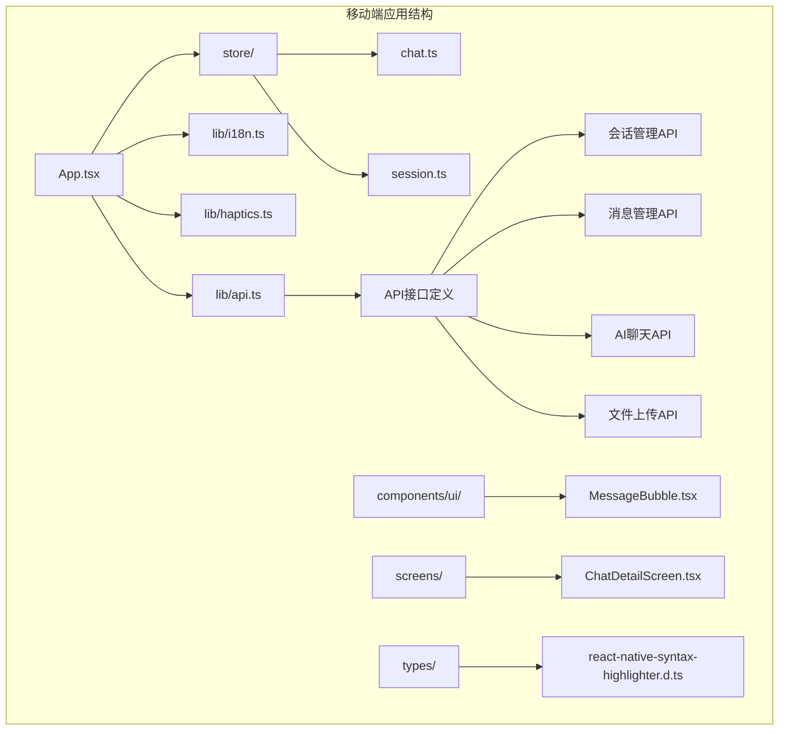

**图表来源**

- [apps/mobile/App.tsx:1-112](file://apps/mobile/App.tsx#L1-L112)
- [apps/mobile/src/lib/api.ts:1-800](file://apps/mobile/src/lib/api.ts#L1-L800)
- [apps/mobile/src/lib/i18n.ts:1-800](file://apps/mobile/src/lib/i18n.ts#L1-L800)

**章节来源**

- [apps/mobile/App.tsx:1-112](file://apps/mobile/App.tsx#L1-L112)
- [apps/mobile/src/lib/api.ts:1-800](file://apps/mobile/src/lib/api.ts#L1-L800)
- [apps/mobile/src/lib/i18n.ts:1-800](file://apps/mobile/src/lib/i18n.ts#L1-L800)

## 核心组件

移动端 API 服务层由多个核心组件构成，每个组件负责特定的功能领域：

### 1. 应用入口与初始化

- **App.tsx**: 应用主入口，负责应用启动、网络状态检测、国际化加载
- **离线状态管理**: 实时监控网络连接状态，提供用户友好的离线提示

### 2. API 服务层

- **lib/api.ts**: 核心 API 服务，封装所有后端接口调用
- **认证管理**: Token 存储与验证
- **配置管理**: 服务器 URL 配置与持久化

### 3. 状态管理

- **store/chat.ts**: 聊天状态管理，处理消息流式传输和错误处理
- **store/session.ts**: 会话状态管理，维护会话列表与活动状态

### 4. 国际化与本地化

- **lib/i18n.ts**: 轻量级国际化系统，支持多语言切换
- **lib/haptics.ts**: 触觉反馈统一管理

### 5. 用户界面组件

- **components/ui/MessageBubble.tsx**: 消息气泡组件，支持 JSON 语法高亮
- **screens/ChatDetailScreen.tsx**: 聊天详情屏幕，集成完整聊天功能

**章节来源**

- [apps/mobile/App.tsx:35-112](file://apps/mobile/App.tsx#L35-L112)
- [apps/mobile/src/lib/api.ts:1-800](file://apps/mobile/src/lib/api.ts#L1-L800)
- [apps/mobile/src/store/chat.ts:1-800](file://apps/mobile/src/store/chat.ts#L1-L800)
- [apps/mobile/src/store/session.ts:1-254](file://apps/mobile/src/store/session.ts#L1-L254)
- [apps/mobile/src/lib/i18n.ts:1-800](file://apps/mobile/src/lib/i18n.ts#L1-L800)
- [apps/mobile/src/lib/haptics.ts:1-25](file://apps/mobile/src/lib/haptics.ts#L1-L25)

## 架构概览

移动端 API 服务层采用分层架构设计，确保了良好的可维护性和扩展性：

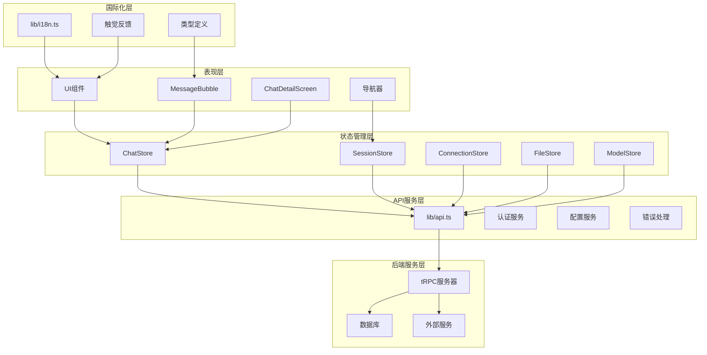

**图表来源**

- [apps/mobile/src/lib/api.ts:1-800](file://apps/mobile/src/lib/api.ts#L1-L800)
- [apps/mobile/src/store/chat.ts:183-538](file://apps/mobile/src/store/chat.ts#L183-L538)
- [apps/mobile/src/store/session.ts:41-253](file://apps/mobile/src/store/session.ts#L41-L253)
- [apps/mobile/src/lib/i18n.ts:1-800](file://apps/mobile/src/lib/i18n.ts#L1-L800)

## 详细组件分析

### API 服务层架构

API 服务层是整个移动端应用的核心，提供了统一的接口访问方式：

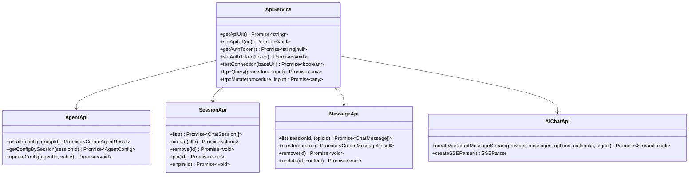

**图表来源**

- [apps/mobile/src/lib/api.ts:139-800](file://apps/mobile/src/lib/api.ts#L139-L800)

#### 认证与配置管理

API 服务层实现了完整的认证和配置管理机制：

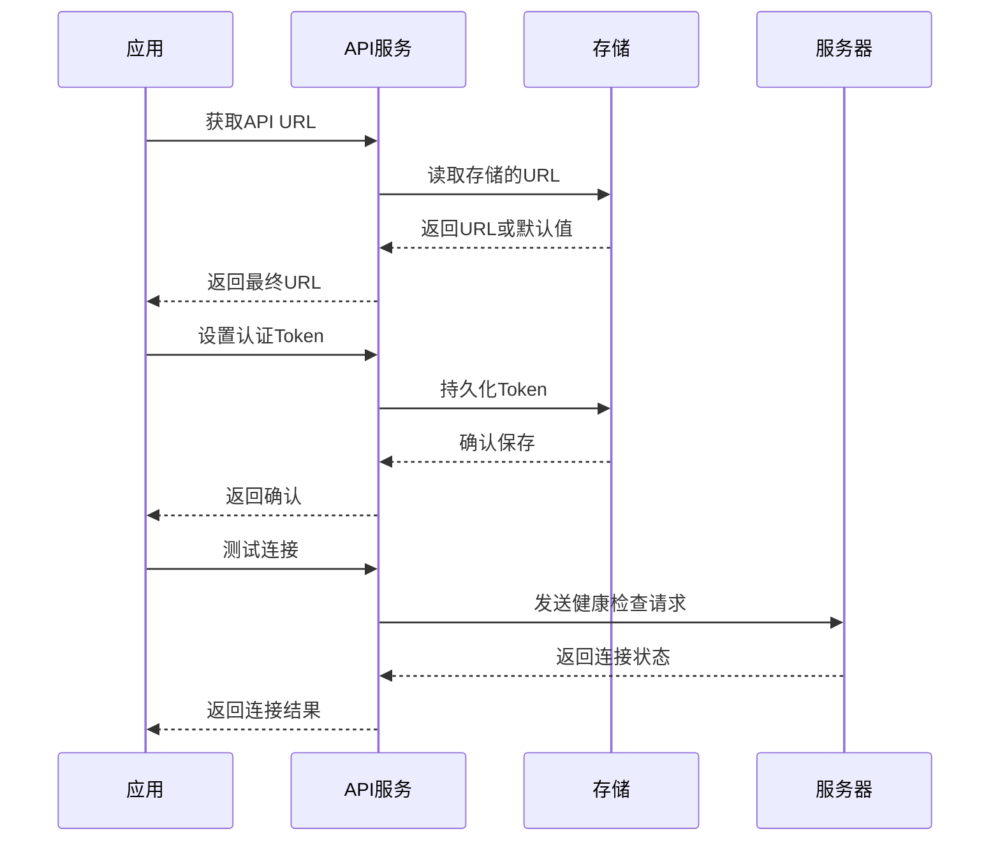

**图表来源**

- [apps/mobile/src/lib/api.ts:47-91](file://apps/mobile/src/lib/api.ts#L47-L91)

#### 聊天消息流处理

聊天功能是移动端 API 服务层的核心特性之一，支持实时消息流式传输：

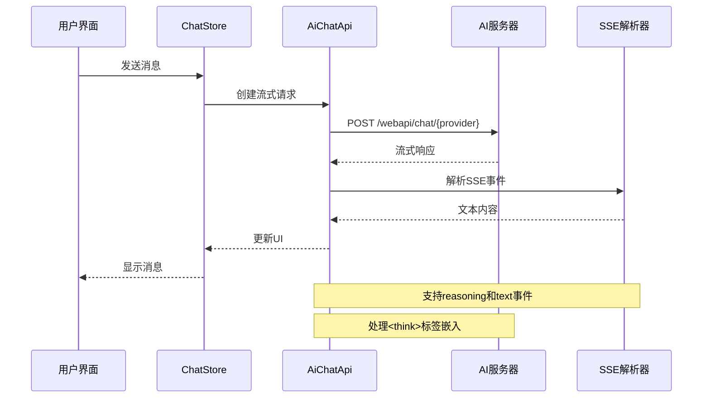

**图表来源**

- [apps/mobile/src/lib/api.ts:351-517](file://apps/mobile/src/lib/api.ts#L351-L517)
- [apps/mobile/src/store/chat.ts:432-450](file://apps/mobile/src/store/chat.ts#L432-L450)

**章节来源**

- [apps/mobile/src/lib/api.ts:1-800](file://apps/mobile/src/lib/api.ts#L1-L800)
- [apps/mobile/src/store/chat.ts:1-800](file://apps/mobile/src/store/chat.ts#L1-L800)

### 错误处理机制

**更新** 新增了统一的错误分类和处理机制：

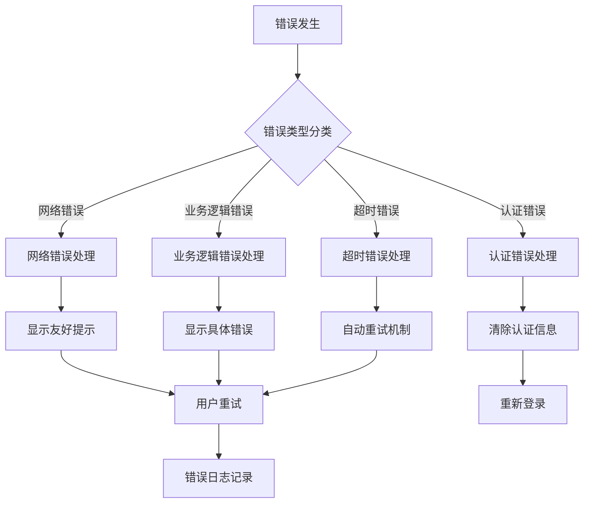

**图表来源**

- [apps/mobile/src/store/chat.ts:215-220](file://apps/mobile/src/store/chat.ts#L215-L220)
- [apps/mobile/src/store/chat.ts:514-538](file://apps/mobile/src/store/chat.ts#L514-L538)

#### 国际化支持扩展

**更新** 国际化系统现已支持更多翻译键值和多语言切换：

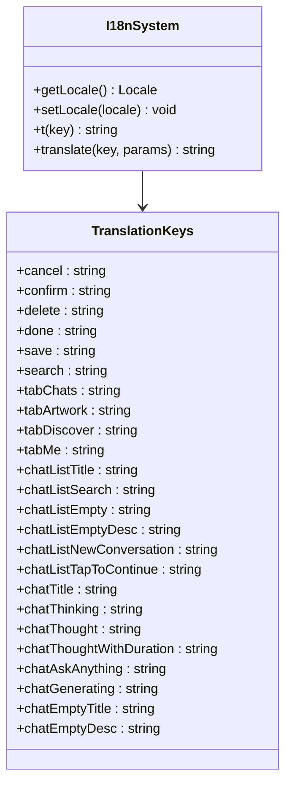

**图表来源**

- [apps/mobile/src/lib/i18n.ts:15-690](file://apps/mobile/src/lib/i18n.ts#L15-L690)

#### JSON 显示功能改进

**更新** 替换 react-native-syntax-highlighter 为 react-syntax-highlighter，提供更好的 JSON 语法高亮：

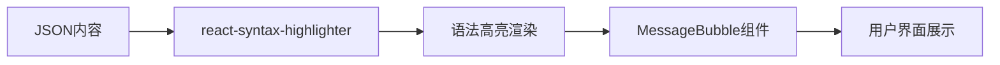

**图表来源**

- [apps/mobile/src/types/react-native-syntax-highlighter.d.ts:1-16](file://apps/mobile/src/types/react-native-syntax-highlighter.d.ts#L1-L16)

**章节来源**

- [apps/mobile/src/lib/api.ts:1-800](file://apps/mobile/src/lib/api.ts#L1-L800)
- [apps/mobile/src/store/chat.ts:1-800](file://apps/mobile/src/store/chat.ts#L1-L800)
- [apps/mobile/src/lib/i18n.ts:1-800](file://apps/mobile/src/lib/i18n.ts#L1-L800)

### 状态管理架构

移动端 API 服务层采用 Zustand 状态管理库，实现了高效的状态同步：

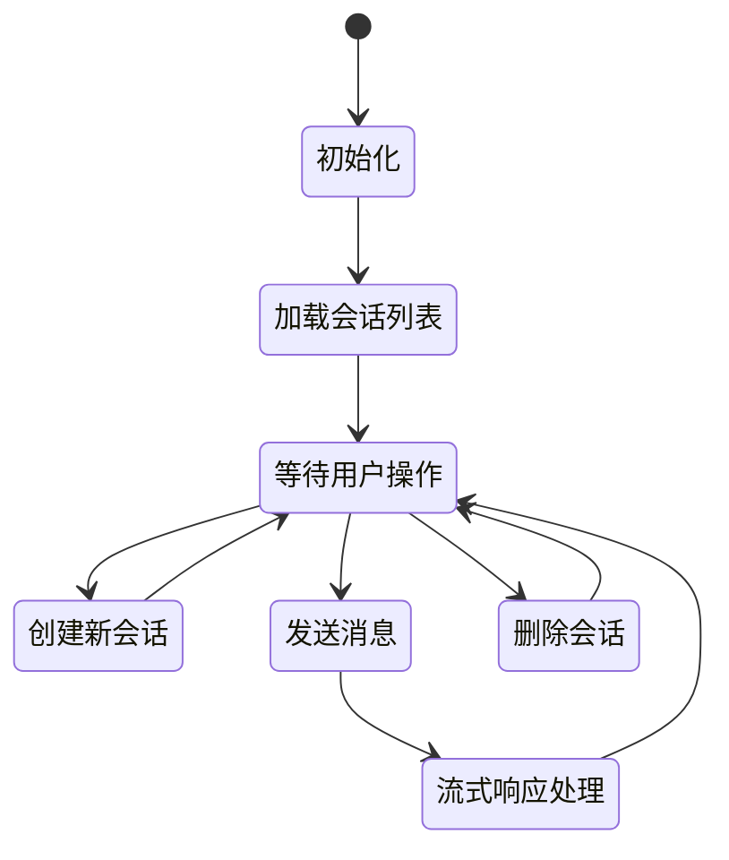

**图表来源**

- [apps/mobile/src/store/session.ts:41-253](file://apps/mobile/src/store/session.ts#L41-L253)
- [apps/mobile/src/store/chat.ts:183-538](file://apps/mobile/src/store/chat.ts#L183-L538)

#### 会话状态管理

会话状态管理负责维护用户的聊天会话列表和当前活动会话：

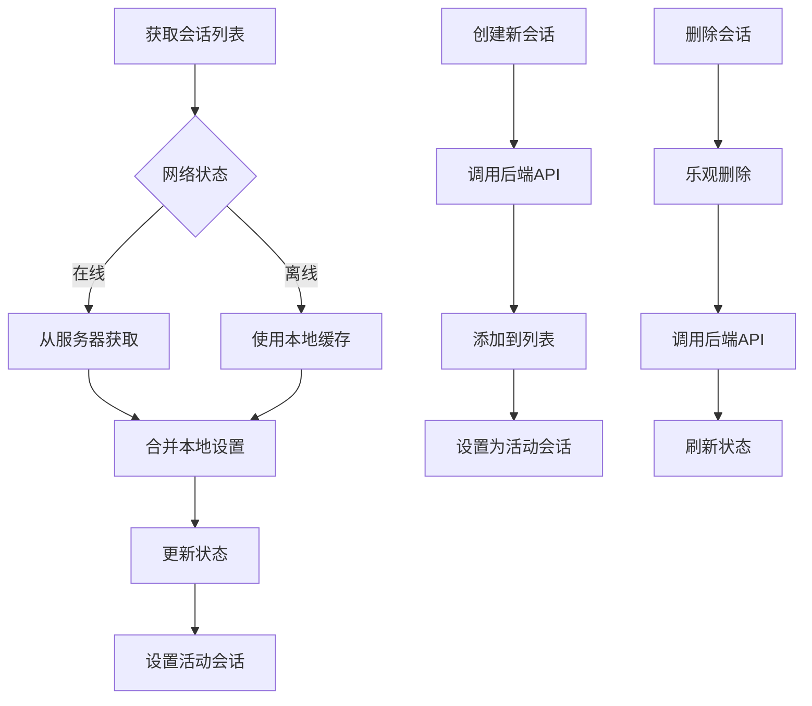

**图表来源**

- [apps/mobile/src/store/session.ts:48-93](file://apps/mobile/src/store/session.ts#L48-L93)
- [apps/mobile/src/store/session.ts:95-150](file://apps/mobile/src/store/session.ts#L95-L150)

**章节来源**

- [apps/mobile/src/store/session.ts:1-254](file://apps/mobile/src/store/session.ts#L1-L254)
- [apps/mobile/src/store/chat.ts:1-800](file://apps/mobile/src/store/chat.ts#L1-L800)

## 依赖关系分析

移动端 API 服务层的依赖关系清晰明确，遵循单一职责原则：

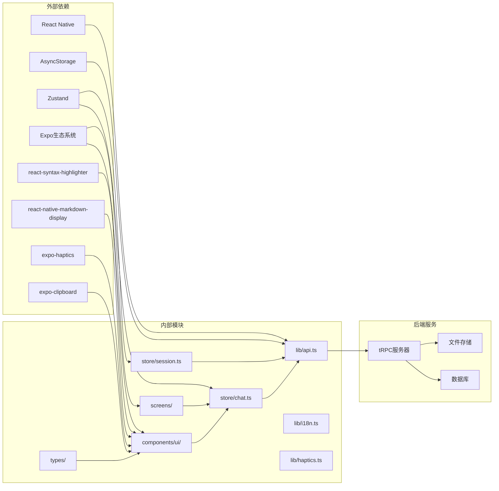

**图表来源**

- [apps/mobile/src/lib/api.ts:12-13](file://apps/mobile/src/lib/api.ts#L12-L13)
- [apps/mobile/src/store/chat.ts:9-18](file://apps/mobile/src/store/chat.ts#L9-L18)
- [apps/mobile/src/store/session.ts:9-16](file://apps/mobile/src/store/session.ts#L9-L16)
- [apps/mobile/package.json:12-44](file://apps/mobile/package.json#L12-L44)

### 核心服务类

移动端 API 服务层还集成了后端服务的 TypeScript 实现：

**图表来源**

- [src/services/agent.ts:63-232](file://src/services/agent.ts#L63-L232)
- [src/services/aiChat.ts:6-26](file://src/services/aiChat.ts#L6-L26)
- [src/services/discover.ts:45-635](file://src/services/discover.ts#L45-L635)
- [src/services/image.ts:9-34](file://src/services/image.ts#L9-L34)
- [src/services/knowledgeBase.ts:4-35](file://src/services/knowledgeBase.ts#L4-L35)

**章节来源**

- [src/services/agent.ts:1-232](file://src/services/agent.ts#L1-L232)
- [src/services/aiChat.ts:1-26](file://src/services/aiChat.ts#L1-L26)
- [src/services/discover.ts:1-635](file://src/services/discover.ts#L1-L635)
- [src/services/image.ts:1-34](file://src/services/image.ts#L1-L34)
- [src/services/knowledgeBase.ts:1-35](file://src/services/knowledgeBase.ts#L1-L35)

## 性能考虑

移动端 API 服务层在设计时充分考虑了性能优化：

### 1. 流式响应处理

- 使用 XMLHttpRequest 替代 fetch 以支持流式传输
- 实现 SSE 事件解析器，处理分段数据传输
- 支持 reasoning 和 text 事件的分离处理

### 2. 状态管理优化

- 采用节流机制减少频繁的 UI 更新
- 乐观更新策略提升用户体验
- 批量操作减少网络请求次数

### 3. 缓存策略

- AsyncStorage 用于本地数据持久化
- 会话状态缓存避免重复请求
- 离线模式支持数据同步

### 4. **更新** 错误处理优化

- 统一的错误分类和处理机制
- 自动重试和降级策略
- 友好的用户错误提示

### 5. **更新** 国际化性能

- 轻量级 i18n 实现，避免重型库依赖
- 动态翻译键值加载
- 本地化资源缓存

## 故障排除指南

### 常见问题及解决方案

#### 1. 网络连接问题

- **症状**: 应用显示离线状态
- **原因**: 网络不可达或服务器无响应
- **解决**: 检查网络连接，重试连接测试

#### 2. 认证失败

- **症状**: API 调用返回 401 错误
- **原因**: Token 过期或无效
- **解决**: 清除存储的 Token 并重新登录

#### 3. 流式响应中断

- **症状**: 消息发送后无响应
- **原因**: 网络不稳定或服务器超时
- **解决**: 检查网络质量，增加重试机制

#### 4. 状态不同步

- **症状**: UI 显示与服务器状态不一致
- **原因**: 异步操作竞态条件
- **解决**: 使用乐观更新和状态回滚

#### 5. **更新** JSON 显示问题

- **症状**: JSON 内容无法正确语法高亮
- **原因**: react-syntax-highlighter 依赖缺失
- **解决**: 检查 package.json 依赖，重新安装

#### 6. **更新** 国际化显示问题

- **症状**: 界面文字显示为键值而非翻译
- **原因**: i18n 键值缺失或语言包未加载
- **解决**: 检查翻译键值完整性，重新加载语言包

**章节来源**

- [apps/mobile/src/lib/api.ts:80-91](file://apps/mobile/src/lib/api.ts#L80-L91)
- [apps/mobile/src/store/chat.ts:514-538](file://apps/mobile/src/store/chat.ts#L514-L538)
- [apps/mobile/src/lib/i18n.ts:1-800](file://apps/mobile/src/lib/i18n.ts#L1-L800)

## 结论

移动端 API 服务层展现了现代移动应用开发的最佳实践，通过精心设计的架构和完善的错误处理机制，为用户提供了稳定可靠的聊天体验。本次更新进一步增强了 JSON 显示功能、错误处理能力和国际化支持，为用户提供了更加丰富和稳定的移动聊天服务体验。

主要优势包括：

- 清晰的分层架构便于维护
- 完善的错误处理机制提升稳定性
- 高效的状态管理优化用户体验
- 灵活的配置管理适应不同部署环境
- **更新** 改进的 JSON 语法高亮显示
- **更新** 扩展的国际化翻译支持
- **更新** 统一的错误分类和处理机制

通过持续的优化和改进，移动端 API 服务层将继续为用户提供优质的移动聊天服务体验。
