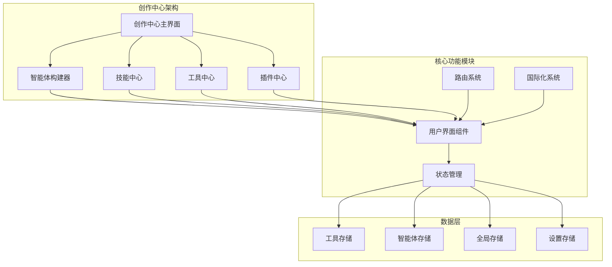
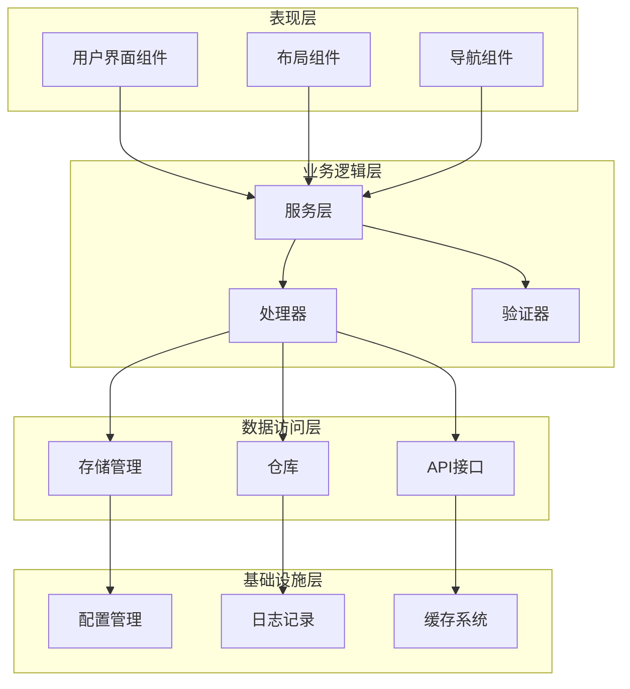
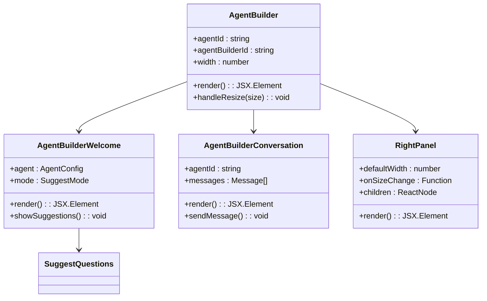
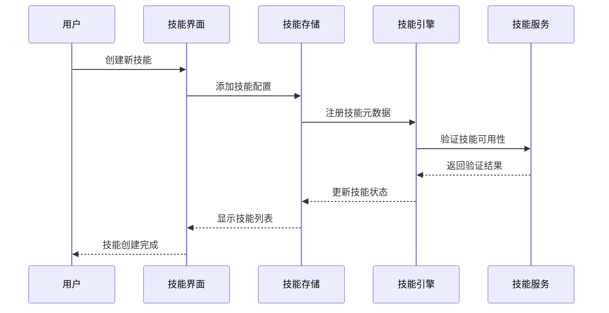
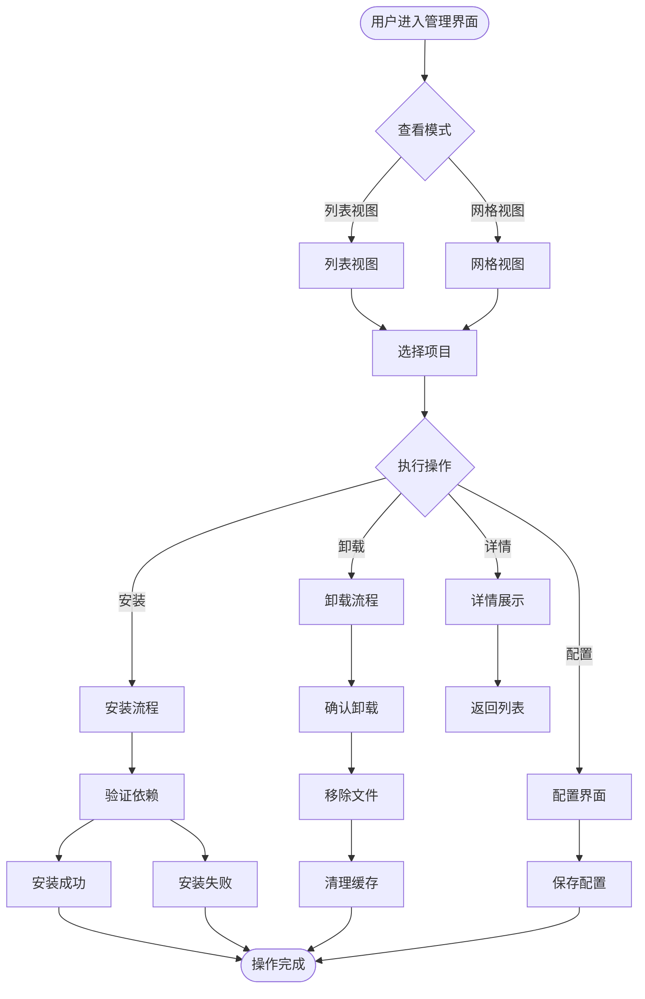
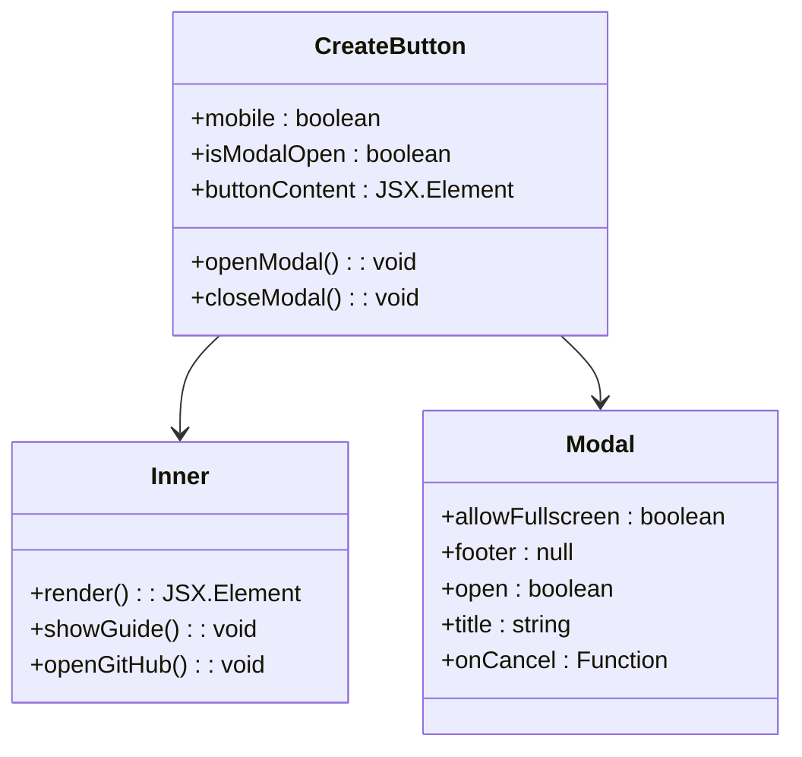
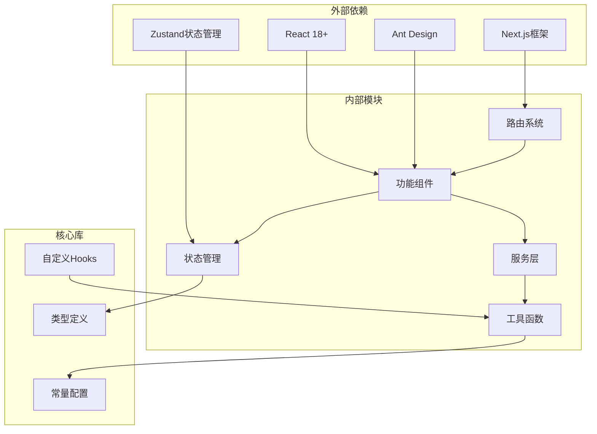

# 创作中心屏幕

<cite>
**本文档引用的文件**
- [src/features/AgentBuilder/index.tsx](file://src/features/AgentBuilder/index.tsx)
- [src/features/AgentBuilder/AgentBuilderWelcome.tsx](file://src/features/AgentBuilder/AgentBuilderWelcome.tsx)
- [src/routes/(main)/community/features/CreateButton/index.tsx](file://src/routes/(main)/community/features/CreateButton/index.tsx)
- [src/routes/(main)/community/features/CreateButton/Inner.tsx](file://src/routes/(main)/community/features/CreateButton/Inner.tsx)
- [src/routes/(main)/community/_layout/index.tsx](file://src/routes/(main)/community/_layout/index.tsx)
- [src/routes/(main)/community/(list)/_layout/index.tsx](file://src/routes/(main)/community/(list)/_layout/index.tsx)
- [src/features/RightPanel/index.tsx](file://src/features/RightPanel/index.tsx)
- [src/store/agent/index.ts](file://src/store/agent/index.ts)
- [src/store/global/index.ts](file://src/store/global/index.ts)
- [src/features/SuggestQuestions/index.tsx](file://src/features/SuggestQuestions/index.tsx)
- [src/features/ChatInput/ActionBar/Tools/PopoverContent.tsx](file://src/features/ChatInput/ActionBar/Tools/PopoverContent.tsx)
- [src/features/ChatInput/ActionBar/Tools/ToolItem.tsx](file://src/features/ChatInput/ActionBar/Tools/ToolItem.tsx)
- [src/features/SkillStore/SkillList/AgentSkillItem.tsx](file://src/features/SkillStore/SkillList/AgentSkillItem.tsx)
- [src/routes/(main)/settings/skill/features/AgentSkillItem.tsx](file://src/routes/(main)/settings/skill/features/AgentSkillItem.tsx)
- [src/services/chat/mecha/skillEngineering.ts](file://src/services/chat/mecha/skillEngineering.ts)
- [src/features/Portal/Home/Body/Plugins/ArtifactList/Item/index.tsx](file://src/features/Portal/Home/Body/Plugins/ArtifactList/Item/index.tsx)
- [src/routes/(main)/home/_layout/Header/components/AddButton.tsx](file://src/routes/(main)/home/_layout/Header/components/AddButton.tsx)
</cite>

## 目录
1. [简介](#简介)
2. [项目结构](#项目结构)
3. [核心组件](#核心组件)
4. [架构概览](#架构概览)
5. [详细组件分析](#详细组件分析)
6. [依赖关系分析](#依赖关系分析)
7. [性能考虑](#性能考虑)
8. [故障排除指南](#故障排除指南)
9. [结论](#结论)

## 简介

创作中心屏幕是 LobeHub 项目中的一个核心功能模块，为用户提供了一个集中的创作和管理界面。该系统支持多种内容创作类型，包括智能体（Agent）构建、技能开发、工具管理和插件配置等。通过统一的界面设计和强大的状态管理系统，用户可以高效地创建、编辑和管理各种创作内容。

创作中心基于 React 和 TypeScript 构建，采用了现代化的前端架构模式，包括组件化设计、状态管理、路由系统和国际化支持。系统支持桌面端和移动端的自适应布局，并提供了丰富的交互体验。

## 项目结构

创作中心屏幕的项目结构采用模块化组织方式，主要分为以下几个核心区域：

**图表来源**
- [src/features/AgentBuilder/index.tsx:1-48](file://src/features/AgentBuilder/index.tsx#L1-L48)
- [src/routes/(main)/community/_layout/index.tsx](file://src/routes/(main)/community/_layout/index.tsx#L1-L22)

**章节来源**
- [src/features/AgentBuilder/index.tsx:1-48](file://src/features/AgentBuilder/index.tsx#L1-L48)
- [src/routes/(main)/community/_layout/index.tsx](file://src/routes/(main)/community/_layout/index.tsx#L1-L22)

## 核心组件

创作中心屏幕包含多个关键组件，每个组件都有特定的功能和职责：

### 智能体构建器组件
智能体构建器是创作中心的核心组件之一，提供了一个完整的智能体开发环境。它包含了智能体配置、对话交互和状态管理等功能。

### 技能管理组件
技能管理组件允许用户创建、编辑和管理各种技能。支持内置技能和自定义技能的安装、卸载和配置。

### 工具管理组件
工具管理组件提供了工具的浏览、安装和配置功能，用户可以通过这些工具扩展智能体的能力。

### 插件管理组件
插件管理组件支持插件的安装、配置和管理，为系统提供额外的功能扩展。

**章节来源**
- [src/features/AgentBuilder/AgentBuilderWelcome.tsx:1-47](file://src/features/AgentBuilder/AgentBuilderWelcome.tsx#L1-L47)
- [src/features/RightPanel/index.tsx](file://src/features/RightPanel/index.tsx)

## 架构概览

创作中心屏幕采用了分层架构设计，确保了系统的可维护性和可扩展性：

**图表来源**
- [src/store/agent/index.ts](file://src/store/agent/index.ts)
- [src/store/global/index.ts](file://src/store/global/index.ts)

## 详细组件分析

### 智能体构建器系统

智能体构建器系统是创作中心的核心功能，提供了完整的智能体开发环境：

**图表来源**
- [src/features/AgentBuilder/index.tsx:14-45](file://src/features/AgentBuilder/index.tsx#L14-L45)
- [src/features/AgentBuilder/AgentBuilderWelcome.tsx:18-44](file://src/features/AgentBuilder/AgentBuilderWelcome.tsx#L18-L44)

智能体构建器系统的主要特点包括：

1. **响应式布局**：支持不同屏幕尺寸的自适应布局
2. **状态管理**：集成全局状态管理系统
3. **实时交互**：提供流畅的用户交互体验
4. **扩展性**：支持插件和工具的动态加载

**章节来源**
- [src/features/AgentBuilder/index.tsx:14-45](file://src/features/AgentBuilder/index.tsx#L14-L45)
- [src/features/AgentBuilder/AgentBuilderWelcome.tsx:18-44](file://src/features/AgentBuilder/AgentBuilderWelcome.tsx#L18-L44)

### 技能管理系统

技能管理系统提供了完整的技能开发和管理功能：

**图表来源**
- [src/services/chat/mecha/skillEngineering.ts:13-33](file://src/services/chat/mecha/skillEngineering.ts#L13-L33)

技能管理系统的架构特点：

1. **多源技能合并**：支持内置技能和数据库技能的统一管理
2. **动态加载**：技能按需加载，提高系统性能
3. **状态同步**：确保技能状态在各个组件间保持一致
4. **扩展机制**：支持第三方技能的集成

**章节来源**
- [src/services/chat/mecha/skillEngineering.ts:13-33](file://src/services/chat/mecha/skillEngineering.ts#L13-L33)

### 工具和插件管理

工具和插件管理组件提供了统一的管理界面：

**图表来源**
- [src/features/ChatInput/ActionBar/Tools/PopoverContent.tsx:26-30](file://src/features/ChatInput/ActionBar/Tools/PopoverContent.tsx#L26-L30)

**章节来源**
- [src/features/ChatInput/ActionBar/Tools/PopoverContent.tsx:26-30](file://src/features/ChatInput/ActionBar/Tools/PopoverContent.tsx#L26-L30)
- [src/features/ChatInput/ActionBar/Tools/ToolItem.tsx:12-40](file://src/features/ChatInput/ActionBar/Tools/ToolItem.tsx#L12-L40)

### 创建按钮系统

创建按钮系统为用户提供了便捷的内容创建入口：

**图表来源**
- [src/routes/(main)/community/features/CreateButton/index.tsx](file://src/routes/(main)/community/features/CreateButton/index.tsx#L14-L47)

**章节来源**
- [src/routes/(main)/community/features/CreateButton/index.tsx](file://src/routes/(main)/community/features/CreateButton/index.tsx#L14-L47)
- [src/routes/(main)/community/features/CreateButton/Inner.tsx](file://src/routes/(main)/community/features/CreateButton/Inner.tsx#L10-L55)

## 依赖关系分析

创作中心屏幕的依赖关系呈现层次化结构：

**图表来源**
- [src/features/AgentBuilder/index.tsx:1-10](file://src/features/AgentBuilder/index.tsx#L1-L10)
- [src/store/agent/index.ts](file://src/store/agent/index.ts)

**章节来源**
- [src/features/AgentBuilder/index.tsx:1-10](file://src/features/AgentBuilder/index.tsx#L1-L10)
- [src/store/agent/index.ts](file://src/store/agent/index.ts)

## 性能考虑

创作中心屏幕在设计时充分考虑了性能优化：

### 渲染优化
- 使用 React.memo 避免不必要的重新渲染
- 实现懒加载机制，延迟加载非关键资源
- 采用虚拟滚动技术处理大量数据项

### 状态管理优化
- 分离关注点，避免全局状态污染
- 实现状态选择器，精确控制组件更新范围
- 使用持久化存储减少初始化时间

### 资源管理
- 图片和媒体资源的懒加载
- 动态导入大型组件
- 缓存策略优化

## 故障排除指南

### 常见问题及解决方案

**智能体构建器无法加载**
- 检查网络连接和API可用性
- 验证用户权限和认证状态
- 查看浏览器控制台错误信息

**技能安装失败**
- 确认技能依赖完整性
- 检查磁盘空间和权限
- 清理缓存后重试

**界面显示异常**
- 刷新页面或清除浏览器缓存
- 检查浏览器兼容性
- 验证CSS样式文件加载情况

**性能问题**
- 关闭不必要的标签页
- 清理浏览器历史记录
- 检查系统资源使用情况

**章节来源**
- [src/features/AgentBuilder/index.tsx:40-42](file://src/features/AgentBuilder/index.tsx#L40-L42)
- [src/features/ChatInput/ActionBar/Tools/PopoverContent.tsx:26-30](file://src/features/ChatInput/ActionBar/Tools/PopoverContent.tsx#L26-L30)

## 结论

创作中心屏幕作为 LobeHub 项目的重要组成部分，展现了现代前端应用的设计理念和技术实践。通过模块化的架构设计、完善的状态管理和丰富的用户体验，该系统为用户提供了强大而易用的创作工具。

系统的主要优势包括：

1. **高度模块化**：清晰的组件分离和职责划分
2. **良好的扩展性**：支持插件和自定义功能的集成
3. **优秀的用户体验**：直观的界面设计和流畅的交互体验
4. **强大的技术基础**：基于最新的前端技术和最佳实践

未来的发展方向包括进一步优化性能、增强AI集成能力、扩展创作工具链以及改善多平台支持。通过持续的技术创新和用户体验改进，创作中心屏幕将继续为用户提供卓越的创作体验。