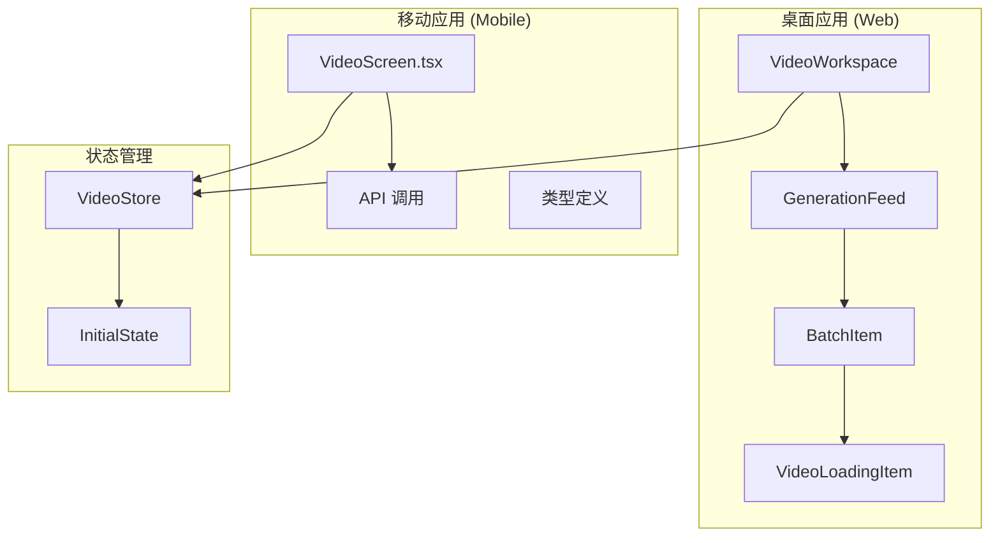
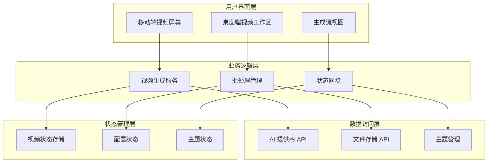
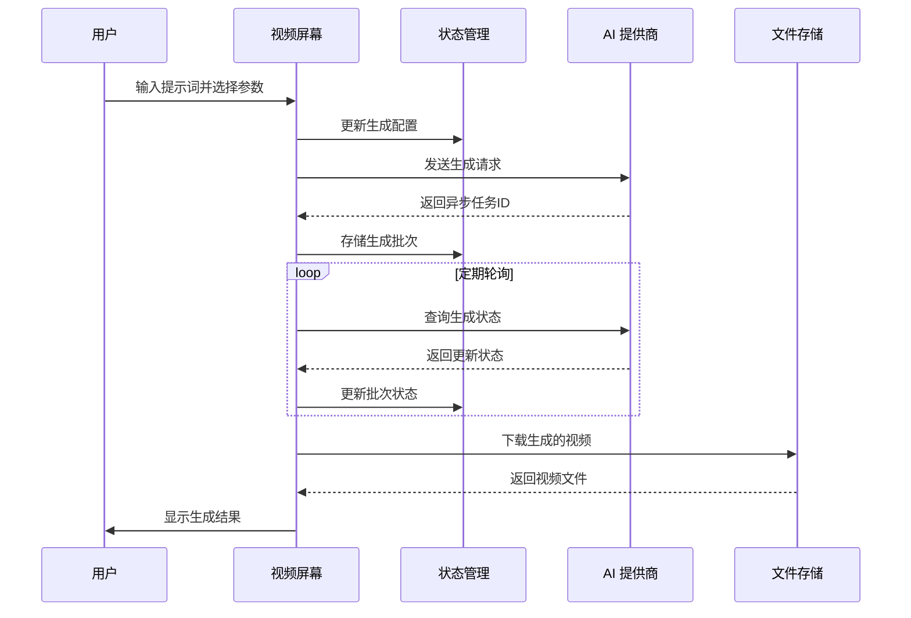
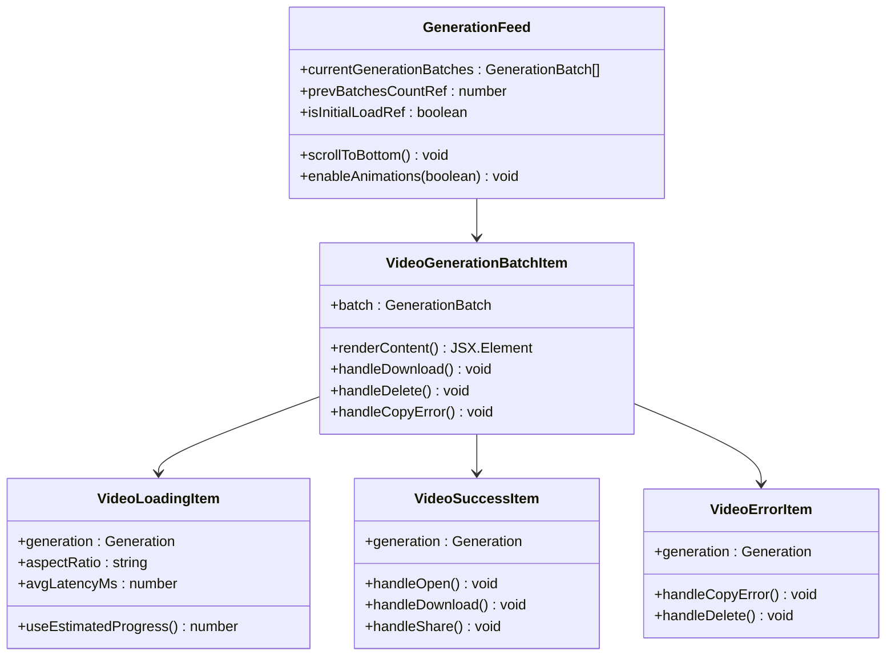
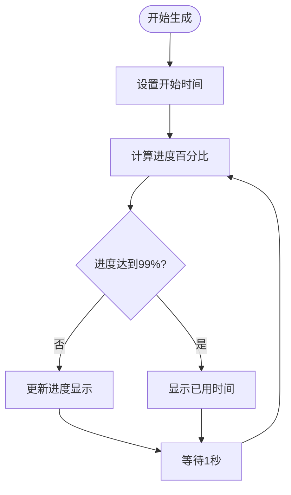
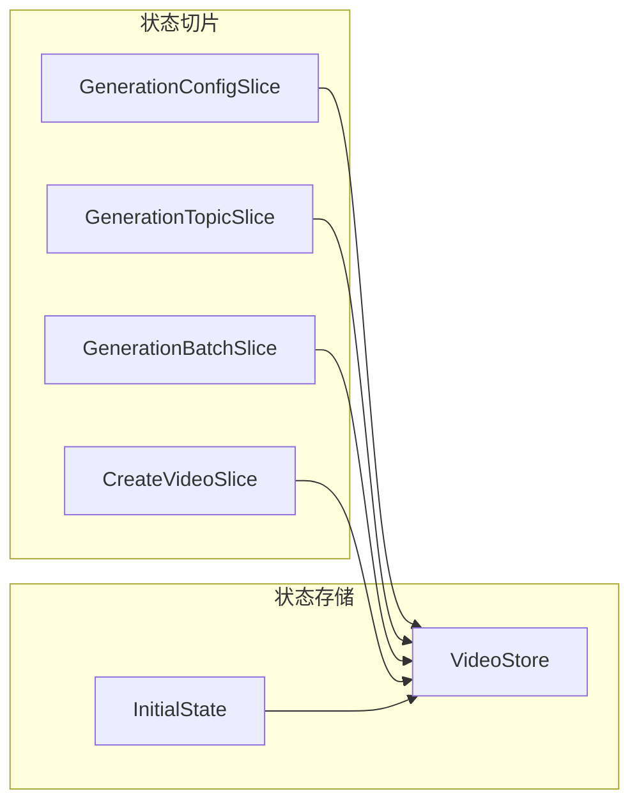
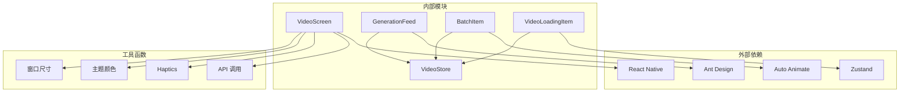

# 视频生成屏幕

<cite>
**本文档引用的文件**
- [apps/mobile/src/screens/VideoScreen.tsx](file://apps/mobile/src/screens/VideoScreen.tsx)
- [src/routes/(main)/video/features/GenerationFeed/index.tsx](file://src/routes/(main)/video/features/GenerationFeed/index.tsx)
- [src/routes/(main)/video/features/GenerationFeed/VideoLoadingItem.tsx](file://src/routes/(main)/video/features/GenerationFeed/VideoLoadingItem.tsx)
- [src/routes/(main)/video/features/GenerationFeed/BatchItem.tsx](file://src/routes/(main)/video/features/GenerationFeed/BatchItem.tsx)
- [src/routes/(main)/video/index.tsx](file://src/routes/(main)/video/index.tsx)
- [src/store/video/store.ts](file://src/store/video/store.ts)
- [apps/mobile/src/types/index.ts](file://apps/mobile/src/types/index.ts)
</cite>

## 目录
1. [简介](#简介)
2. [项目结构](#项目结构)
3. [核心组件](#核心组件)
4. [架构概览](#架构概览)
5. [详细组件分析](#详细组件分析)
6. [依赖关系分析](#依赖关系分析)
7. [性能考虑](#性能考虑)
8. [故障排除指南](#故障排除指南)
9. [结论](#结论)

## 简介

视频生成屏幕是 LobeHub 应用程序中的一个核心功能模块，允许用户通过文本提示生成视频内容。该系统支持多种 AI 视频生成提供商，提供灵活的配置选项，包括分辨率、时长、宽高比和音频生成等参数。

该功能在移动端和桌面端都有完整的实现，采用现代化的 React Native 和 Next.js 技术栈构建，提供了流畅的用户体验和强大的视频生成能力。

## 项目结构

视频生成功能分布在多个应用程序中：

**图表来源**
- [apps/mobile/src/screens/VideoScreen.tsx:442-828](file://apps/mobile/src/screens/VideoScreen.tsx#L442-L828)
- [src/routes/(main)/video/features/GenerationFeed/index.tsx](file://src/routes/(main)/video/features/GenerationFeed/index.tsx#L13-L86)

**章节来源**
- [apps/mobile/src/screens/VideoScreen.tsx:1-1332](file://apps/mobile/src/screens/VideoScreen.tsx#L1-L1332)
- [src/routes/(main)/video/features/GenerationFeed/index.tsx](file://src/routes/(main)/video/features/GenerationFeed/index.tsx#L1-L86)

## 核心组件

### 移动端视频生成屏幕

移动端的视频生成屏幕是整个功能的核心界面，提供了完整的视频生成工作流程：

- **配置面板**：包含分辨率、时长、宽高比等生成参数
- **模型选择**：支持多种 AI 视频生成提供商
- **历史记录**：显示之前的生成批次和结果
- **实时预览**：支持视频文件的下载和分享

### 桌面端视频工作区

桌面端实现了更丰富的视频生成界面：

- **响应式布局**：适配不同屏幕尺寸
- **批量处理**：支持同时管理多个生成任务
- **进度跟踪**：实时显示生成进度和状态
- **错误处理**：友好的错误信息展示

**章节来源**
- [apps/mobile/src/screens/VideoScreen.tsx:442-828](file://apps/mobile/src/screens/VideoScreen.tsx#L442-L828)
- [src/routes/(main)/video/index.tsx](file://src/routes/(main)/video/index.tsx#L12-L28)

## 架构概览

视频生成系统的整体架构采用了分层设计模式：

**图表来源**
- [src/store/video/store.ts:24-38](file://src/store/video/store.ts#L24-L38)
- [apps/mobile/src/screens/VideoScreen.tsx:498-549](file://apps/mobile/src/screens/VideoScreen.tsx#L498-L549)

## 详细组件分析

### 视频生成屏幕组件

视频生成屏幕是一个复杂的 React 组件，包含了以下关键功能：

#### 状态管理
- **生成配置状态**：管理分辨率、时长、宽高比等参数
- **提供商状态**：跟踪可用的 AI 视频生成提供商
- **历史记录状态**：维护生成批次和结果
- **UI 状态**：控制侧边栏、预览等界面元素

#### 核心功能实现

**图表来源**
- [apps/mobile/src/screens/VideoScreen.tsx:693-746](file://apps/mobile/src/screens/VideoScreen.tsx#L693-L746)
- [apps/mobile/src/screens/VideoScreen.tsx:606-643](file://apps/mobile/src/screens/VideoScreen.tsx#L606-L643)

#### 配置选项系统

系统支持多种配置选项：

| 配置项 | 可选值 | 默认值 | 描述 |
|--------|--------|--------|------|
| 分辨率 | 480p, 720p, 1080p | 720p | 输出视频的清晰度 |
| 时长 | 5s, 10s | 5s | 视频播放时长 |
| 宽高比 | adaptive, 16:9, 9:16, 1:1 | adaptive | 视频画面比例 |
| 音频生成 | true, false | true | 是否生成背景音频 |

**章节来源**
- [apps/mobile/src/screens/VideoScreen.tsx:51-54](file://apps/mobile/src/screens/VideoScreen.tsx#L51-L54)

### 生成流视图组件

生成流视图负责展示所有视频生成批次的状态和结果：

**图表来源**
- [src/routes/(main)/video/features/GenerationFeed/index.tsx](file://src/routes/(main)/video/features/GenerationFeed/index.tsx#L13-L86)
- [src/routes/(main)/video/features/GenerationFeed/BatchItem.tsx](file://src/routes/(main)/video/features/GenerationFeed/BatchItem.tsx#L25-L182)

#### 进度估算机制

系统使用智能进度估算来改善用户体验：

**图表来源**
- [src/routes/(main)/video/features/GenerationFeed/VideoLoadingItem.tsx](file://src/routes/(main)/video/features/GenerationFeed/VideoLoadingItem.tsx#L16-L48)

**章节来源**
- [src/routes/(main)/video/features/GenerationFeed/VideoLoadingItem.tsx](file://src/routes/(main)/video/features/GenerationFeed/VideoLoadingItem.tsx#L56-L89)

### 状态管理系统

视频状态管理系统基于 Zustand 实现，提供了高效的状态管理：

**图表来源**
- [src/store/video/store.ts:32-38](file://src/store/video/store.ts#L32-L38)

**章节来源**
- [src/store/video/store.ts:1-50](file://src/store/video/store.ts#L1-L50)

## 依赖关系分析

视频生成功能的依赖关系如下：

**图表来源**
- [apps/mobile/src/screens/VideoScreen.tsx:1-50](file://apps/mobile/src/screens/VideoScreen.tsx#L1-L50)
- [src/routes/(main)/video/features/GenerationFeed/index.tsx](file://src/routes/(main)/video/features/GenerationFeed/index.tsx#L1-L12)

**章节来源**
- [apps/mobile/src/screens/VideoScreen.tsx:44-49](file://apps/mobile/src/screens/VideoScreen.tsx#L44-L49)
- [src/routes/(main)/video/features/GenerationFeed/index.tsx](file://src/routes/(main)/video/features/GenerationFeed/index.tsx#L3-L11)

## 性能考虑

### 内存优化策略

1. **状态选择器**：使用浅比较优化状态更新
2. **组件记忆化**：对不经常变化的组件进行缓存
3. **条件渲染**：只渲染必要的 UI 元素

### 网络请求优化

1. **轮询间隔**：合理的轮询频率避免过度请求
2. **错误重试**：智能的错误处理和重试机制
3. **缓存策略**：利用本地存储减少重复请求

### 用户体验优化

1. **进度反馈**：提供实时的进度指示
2. **触觉反馈**：适当的 haptic 响应增强交互
3. **动画效果**：流畅的过渡动画提升体验

## 故障排除指南

### 常见问题及解决方案

#### 生成失败
- **症状**：视频生成过程中出现错误
- **原因**：网络问题、AI 提供商限制、参数配置错误
- **解决**：检查网络连接，调整生成参数，重新尝试

#### 进度停滞
- **症状**：进度条长时间不变
- **原因**：AI 提供商负载过高、队列拥堵
- **解决**：等待一段时间后重试，或调整生成参数

#### 文件下载失败
- **症状**：无法下载生成的视频文件
- **原因**：存储空间不足、文件权限问题
- **解决**：清理存储空间，检查应用权限

**章节来源**
- [apps/mobile/src/screens/VideoScreen.tsx:728-732](file://apps/mobile/src/screens/VideoScreen.tsx#L728-L732)
- [apps/mobile/src/screens/VideoScreen.tsx:797-799](file://apps/mobile/src/screens/VideoScreen.tsx#L797-L799)

## 结论

视频生成屏幕是一个功能完整、架构清晰的多媒体生成系统。它成功地将复杂的 AI 视频生成技术封装为简单易用的用户界面，为用户提供了高质量的视频创作体验。

该系统的主要优势包括：

1. **跨平台兼容性**：同时支持移动端和桌面端
2. **灵活的配置选项**：满足不同用户的需求
3. **优秀的用户体验**：流畅的界面交互和进度反馈
4. **可扩展的架构**：基于 Zustand 的状态管理和模块化设计

未来可以考虑的功能改进包括：支持更多的 AI 视频生成提供商、增加视频编辑功能、提供更详细的生成统计信息等。