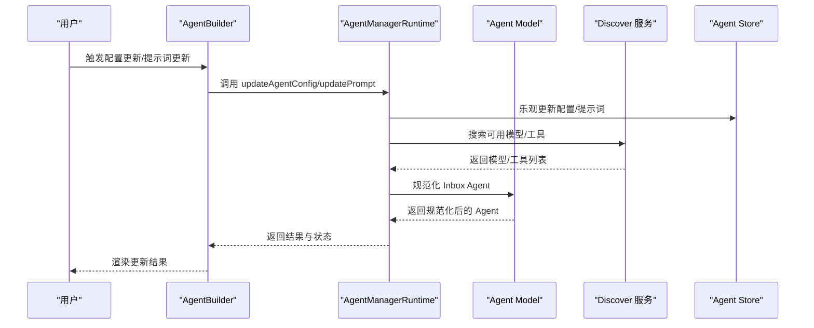
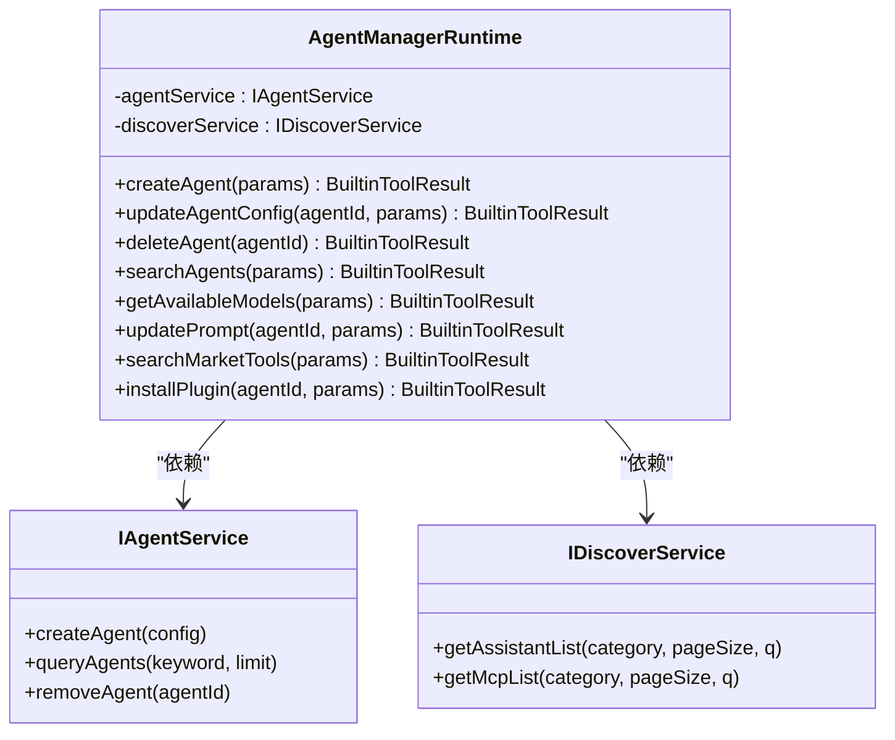
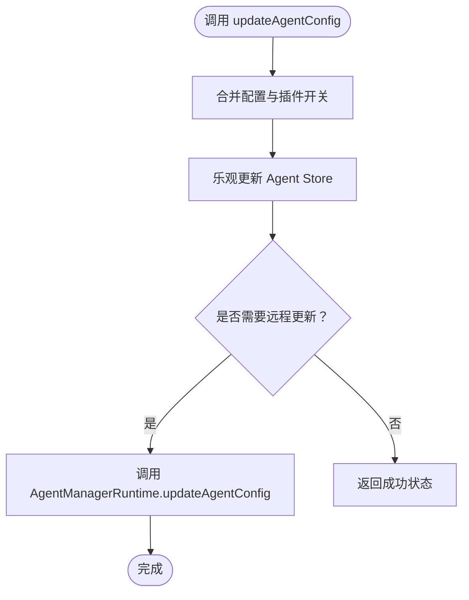
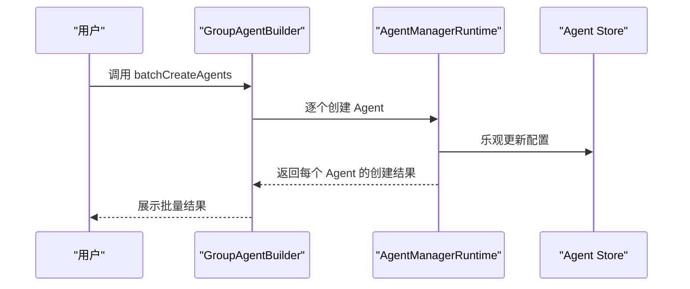
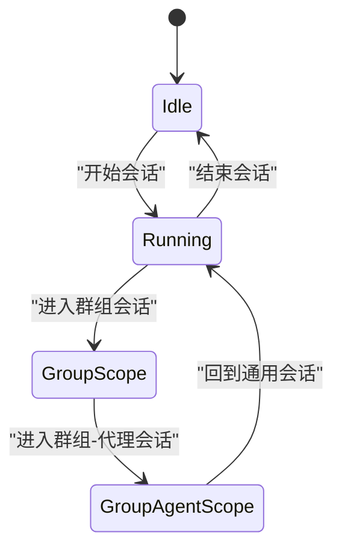
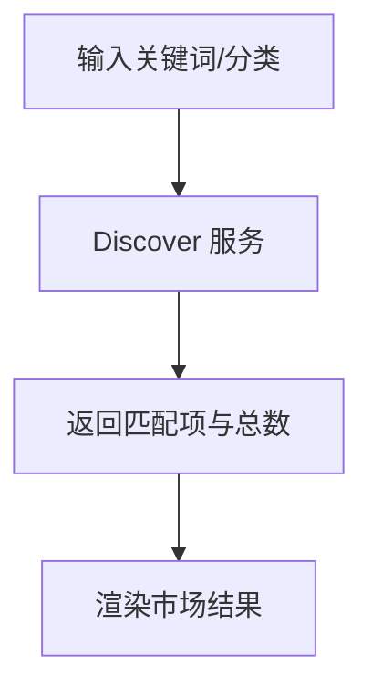
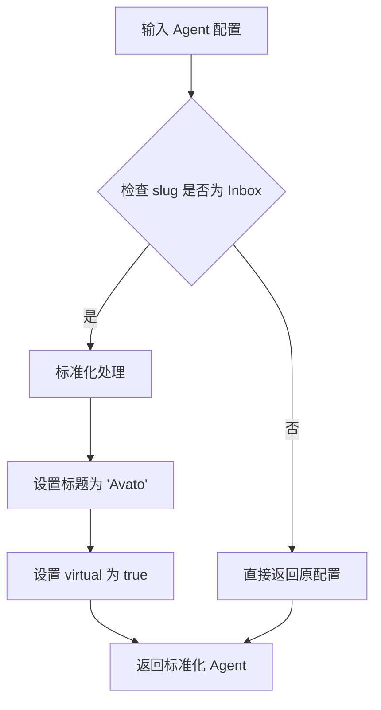
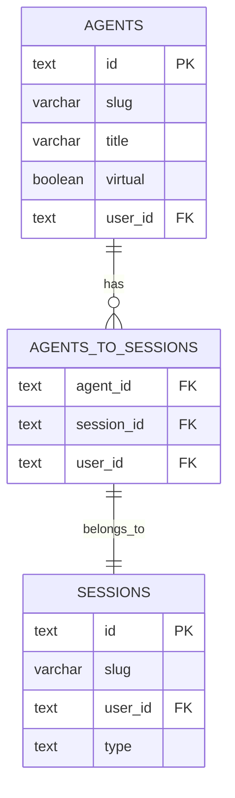
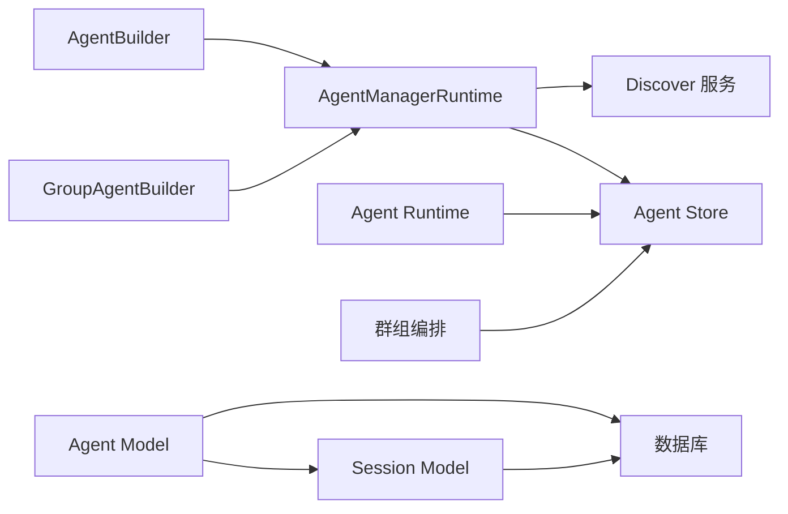

# Agent 管理系统

<cite>
**本文引用的文件**
- [packages/agent-manager-runtime/src/AgentManagerRuntime.ts](file://packages/agent-manager-runtime/src/AgentManagerRuntime.ts)
- [packages/agent-manager-runtime/src/types.ts](file://packages/agent-manager-runtime/src/types.ts)
- [packages/builtin-tool-agent-builder/src/index.ts](file://packages/builtin-tool-agent-builder/src/index.ts)
- [packages/builtin-tool-agent-builder/src/types.ts](file://packages/builtin-tool-agent-builder/src/types.ts)
- [packages/builtin-tool-group-agent-builder/src/index.ts](file://packages/builtin-tool-group-agent-builder/src/index.ts)
- [packages/builtin-tool-group-agent-builder/src/systemRole.ts](file://packages/builtin-tool-group-agent-builder/src/systemRole.ts)
- [packages/builtin-tool-group-agent-builder/src/types.ts](file://packages/builtin-tool-group-agent-builder/src/types.ts)
- [packages/agent-runtime/src/index.ts](file://packages/agent-runtime/src/index.ts)
- [packages/agent-runtime/src/core/index.ts](file://packages/agent-runtime/src/core/index.ts)
- [packages/agent-runtime/src/groupOrchestration/index.ts](file://packages/agent-runtime/src/groupOrchestration/index.ts)
- [src/server/services/discover/index.ts](file://src/server/services/discover/index.ts)
- [src/store/agent/index.ts](file://src/store/agent/index.ts)
- [src/features/Conversation/store.test.ts](file://src/features/Conversation/store.test.ts)
- [packages/types/src/discover/skills.ts](file://packages/types/src/discover/skills.ts)
- [packages/database/src/models/agent.ts](file://packages/database/src/models/agent.ts)
- [packages/database/src/schemas/agent.ts](file://packages/database/src/schemas/agent.ts)
- [packages/database/src/schemas/session.ts](file://packages/database/src/schemas/session.ts)
- [packages/const/src/session.ts](file://packages/const/src/session.ts)
- [src/store/agent/selectors/builtinAgentSelectors.ts](file://src/store/agent/selectors/builtinAgentSelectors.ts)
- [packages/database/src/models/__tests__/agent.test.ts](file://packages/database/src/models/__tests__/agent.test.ts)
</cite>

## 更新摘要
**所做更改**
- 新增 Inbox Agent Canonicalization 系统章节，详细介绍规范化 Inbox Agent 的实现机制
- 更新 Agent 数据库模型，添加 normalizeBuiltinInboxAgent 方法和相关规范化逻辑
- 新增数据库模式修改说明，包括 agents 和 sessions 表的关联关系
- 添加 Inbox Agent 选择器和状态管理相关内容
- 更新架构图以反映 Inbox Agent 规范化流程

## 目录
1. [引言](#引言)
2. [项目结构](#项目结构)
3. [核心组件](#核心组件)
4. [架构总览](#架构总览)
5. [详细组件分析](#详细组件分析)
6. [Inbox Agent Canonicalization 系统](#inbox-agent-canonicalization-系统)
7. [依赖关系分析](#依赖关系分析)
8. [性能考量](#性能考量)
9. [故障排除指南](#故障排除指南)
10. [结论](#结论)
11. [附录](#附录)

## 引言
本文件面向"Agent 管理系统"的使用者与开发者，系统性阐述 Agent 的创建、配置、生命周期管理与分组协作机制；详解 Agent 构建器（Agent Builder）的工作原理（模板选择、参数配置、自动化设置）；说明 Agent 管理工具的批量操作、导入导出与性能监控能力；解释 Agent 运行时环境的架构设计（上下文管理、状态同步、错误处理）；并提供可直接定位到源码路径的示例，帮助快速创建自定义 Agent、配置行为与实现 Agent 协作。同时覆盖调试技巧、性能优化建议与故障排除，并延伸至 Agent 市场集成、版本管理与扩展开发。

**更新** 新增 Inbox Agent Canonicalization 系统，提供规范化 Inbox Agent 的完整实现方案，包括标准化标题、虚拟属性设置和会话绑定机制。

## 项目结构
本仓库采用多包（monorepo）组织方式，围绕 Agent 生命周期与运行时展开的关键模块如下：
- agent-manager-runtime：统一的 Agent 管理运行时，提供 CRUD、搜索、模型/提供商查询、插件/工具安装与提示词更新等能力
- builtin-tool-agent-builder：单 Agent 构建器工具，封装 Agent 配置与提示词更新接口
- builtin-tool-group-agent-builder：群组 Agent 构建器工具，支持成员管理、群组配置与提示词共享
- agent-runtime：Agent 运行时核心、干预检查、用量统计与群组编排
- server/services/discover：市场服务，提供 Agent 列表与工具列表检索
- store/agent：Agent 状态存储与选择器，支撑乐观更新与流式提示词渲染
- database/models：数据库模型层，包含 Agent 规范化、会话管理与知识库关联
- 类型与技能分类：discover/skills.ts 定义市场技能类别

```mermaid
graph TB
subgraph "管理与构建层"
AMR["AgentManagerRuntime<br/>统一管理运行时"]
AB["AgentBuilder 工具"]
GAB["GroupAgentBuilder 工具"]
end
subgraph "运行时层"
AR_CORE["Agent Runtime 核心"]
ORCH["群组编排"]
end
subgraph "市场与存储"
DISCOVER["Discover 服务"]
STORE_AGENT["Agent Store"]
END
subgraph "数据库层"
AGENT_MODEL["Agent Model<br/>规范化 Inbox Agent"]
SESSION_MODEL["Session Model"]
end
AB --> AMR
GAB --> AMR
AMR --> DISCOVER
AMR --> STORE_AGENT
AR_CORE --> STORE_AGENT
ORCH --> STORE_AGENT
AGENT_MODEL --> SESSION_MODEL
```

**图表来源**
- [packages/agent-manager-runtime/src/AgentManagerRuntime.ts:61-72](file://packages/agent-manager-runtime/src/AgentManagerRuntime.ts#L61-L72)
- [packages/builtin-tool-agent-builder/src/index.ts:1-21](file://packages/builtin-tool-agent-builder/src/index.ts#L1-L21)
- [packages/builtin-tool-group-agent-builder/src/index.ts:1-4](file://packages/builtin-tool-group-agent-builder/src/index.ts#L1-L4)
- [packages/agent-runtime/src/core/index.ts:1-4](file://packages/agent-runtime/src/core/index.ts#L1-L4)
- [packages/agent-runtime/src/groupOrchestration/index.ts:1-7](file://packages/agent-runtime/src/groupOrchestration/index.ts#L1-L7)
- [src/server/services/discover/index.ts:2033-2077](file://src/server/services/discover/index.ts#L2033-L2077)
- [src/store/agent/index.ts:1-2](file://src/store/agent/index.ts#L1-L2)
- [packages/database/src/models/agent.ts:29-40](file://packages/database/src/models/agent.ts#L29-L40)
- [packages/database/src/schemas/agent.ts:30-84](file://packages/database/src/schemas/agent.ts#L30-L84)
- [packages/database/src/schemas/session.ts:51-88](file://packages/database/src/schemas/session.ts#L51-L88)

**章节来源**
- [packages/agent-manager-runtime/src/AgentManagerRuntime.ts:1-1060](file://packages/agent-manager-runtime/src/AgentManagerRuntime.ts#L1-L1060)
- [packages/builtin-tool-agent-builder/src/index.ts:1-21](file://packages/builtin-tool-agent-builder/src/index.ts#L1-L21)
- [packages/builtin-tool-group-agent-builder/src/index.ts:1-4](file://packages/builtin-tool-group-agent-builder/src/index.ts#L1-L4)
- [packages/agent-runtime/src/index.ts:1-7](file://packages/agent-runtime/src/index.ts#L1-L7)
- [src/server/services/discover/index.ts:2033-2077](file://src/server/services/discover/index.ts#L2033-L2077)
- [src/store/agent/index.ts:1-2](file://src/store/agent/index.ts#L1-L2)
- [packages/database/src/models/agent.ts:1-615](file://packages/database/src/models/agent.ts#L1-L615)
- [packages/database/src/schemas/agent.ts:1-142](file://packages/database/src/schemas/agent.ts#L1-L142)
- [packages/database/src/schemas/session.ts:1-95](file://packages/database/src/schemas/session.ts#L1-L95)

## 核心组件
- AgentManagerRuntime：统一的 Agent 管理运行时，负责 Agent CRUD、搜索、模型/提供商查询、插件/工具安装与提示词更新。通过注入 IAgentService 与 IDiscoverService 实现运行时无关（前后端均可使用）。
- AgentBuilder 工具：封装单 Agent 的配置更新与提示词更新接口，参数与状态类型清晰，便于在对话上下文中自动注入当前 Agent。
- GroupAgentBuilder 工具：在 AgentBuilder 基础上扩展群组成员管理、群组配置与提示词共享，支持批量创建 Agent 并加入群组。
- Agent Runtime：提供运行时核心能力（干预检查、用量统计）与群组编排（Supervisor、编排配置与类型）。
- Discover 服务：对接市场，提供 Agent 列表与 MCP 工具列表检索。
- Agent Store：提供乐观更新、流式提示词渲染与选择器，支撑 UI 与运行时的状态一致性。
- Agent Model：数据库模型层，负责 Agent 数据的持久化、规范化与关联查询，包括 Inbox Agent 规范化功能。

**章节来源**
- [packages/agent-manager-runtime/src/AgentManagerRuntime.ts:61-72](file://packages/agent-manager-runtime/src/AgentManagerRuntime.ts#L61-L72)
- [packages/builtin-tool-agent-builder/src/types.ts:1-219](file://packages/builtin-tool-agent-builder/src/types.ts#L1-L219)
- [packages/builtin-tool-group-agent-builder/src/types.ts:1-304](file://packages/builtin-tool-group-agent-builder/src/types.ts#L1-L304)
- [packages/agent-runtime/src/core/index.ts:1-4](file://packages/agent-runtime/src/core/index.ts#L1-L4)
- [packages/agent-runtime/src/groupOrchestration/index.ts:1-7](file://packages/agent-runtime/src/groupOrchestration/index.ts#L1-L7)
- [src/server/services/discover/index.ts:2033-2077](file://src/server/services/discover/index.ts#L2033-L2077)
- [src/store/agent/index.ts:1-2](file://src/store/agent/index.ts#L1-L2)
- [packages/database/src/models/agent.ts:21-615](file://packages/database/src/models/agent.ts#L21-L615)

## 架构总览
Agent 管理系统由"构建层""运行时层""市场与存储层"和"数据库层"四部分协同构成。构建层通过 AgentBuilder 与 GroupAgentBuilder 将用户意图转化为对 Agent 的配置与提示词更新；运行时层负责执行与编排；市场与存储层提供模型/工具检索与状态持久化；数据库层负责数据的规范化与关联管理，特别是 Inbox Agent 的规范化处理。



**图表来源**
- [packages/builtin-tool-agent-builder/src/types.ts:31-71](file://packages/builtin-tool-agent-builder/src/types.ts#L31-L71)
- [packages/agent-manager-runtime/src/AgentManagerRuntime.ts:114-223](file://packages/agent-manager-runtime/src/AgentManagerRuntime.ts#L114-L223)
- [packages/database/src/models/agent.ts:29-40](file://packages/database/src/models/agent.ts#L29-L40)
- [src/server/services/discover/index.ts:2033-2077](file://src/server/services/discover/index.ts#L2033-L2077)
- [src/store/agent/index.ts:1-2](file://src/store/agent/index.ts#L1-L2)

## 详细组件分析

### AgentManagerRuntime 组件分析
- 职责边界：统一的 Agent 管理运行时，屏蔽前后端差异，提供一致的 API。
- 关键能力：
  - Agent CRUD：创建、更新配置、删除
  - 搜索：支持用户自有 Agent 与市场 Agent 双通道
  - 模型/提供商：按 Provider 过滤返回可用模型清单
  - 提示词更新：支持普通更新与流式 typewriter 效果
  - 插件/工具安装：支持官方（内置/Klavis/LobehubSkill）与市场（MCP）两类来源
- 错误处理：统一包装错误信息，保留上下文与状态，便于前端反馈与重试



**图表来源**
- [packages/agent-manager-runtime/src/AgentManagerRuntime.ts:61-72](file://packages/agent-manager-runtime/src/AgentManagerRuntime.ts#L61-L72)
- [packages/agent-manager-runtime/src/types.ts:10-54](file://packages/agent-manager-runtime/src/types.ts#L10-L54)

**章节来源**
- [packages/agent-manager-runtime/src/AgentManagerRuntime.ts:79-243](file://packages/agent-manager-runtime/src/AgentManagerRuntime.ts#L79-L243)
- [packages/agent-manager-runtime/src/AgentManagerRuntime.ts:250-325](file://packages/agent-manager-runtime/src/AgentManagerRuntime.ts#L250-L325)
- [packages/agent-manager-runtime/src/AgentManagerRuntime.ts:332-374](file://packages/agent-manager-runtime/src/AgentManagerRuntime.ts#L332-L374)
- [packages/agent-manager-runtime/src/AgentManagerRuntime.ts:381-436](file://packages/agent-manager-runtime/src/AgentManagerRuntime.ts#L381-L436)
- [packages/agent-manager-runtime/src/AgentManagerRuntime.ts:443-494](file://packages/agent-manager-runtime/src/AgentManagerRuntime.ts#L443-L494)
- [packages/agent-manager-runtime/src/AgentManagerRuntime.ts:499-593](file://packages/agent-manager-runtime/src/AgentManagerRuntime.ts#L499-L593)
- [packages/agent-manager-runtime/src/AgentManagerRuntime.ts:805-856](file://packages/agent-manager-runtime/src/AgentManagerRuntime.ts#L805-L856)
- [packages/agent-manager-runtime/src/AgentManagerRuntime.ts:1029-1058](file://packages/agent-manager-runtime/src/AgentManagerRuntime.ts#L1029-L1058)
- [packages/agent-manager-runtime/src/types.ts:10-69](file://packages/agent-manager-runtime/src/types.ts#L10-L69)

### AgentBuilder 组件分析
- 工具标识与 API 名称：集中于 AgentBuilderIdentifier 与 AgentBuilderApiName，屏蔽底层细节
- 参数与状态：
  - 更新配置：支持部分配置与元数据更新，以及插件开关合并
  - 获取可用模型：可按 Provider 过滤
  - 搜索市场工具：支持关键词与分类过滤
  - 更新提示词：支持流式 typewriter 效果
- 自动注入上下文：当前 Agent 上下文自动注入，简化调用



**图表来源**
- [packages/builtin-tool-agent-builder/src/types.ts:31-53](file://packages/builtin-tool-agent-builder/src/types.ts#L31-L53)
- [packages/agent-manager-runtime/src/AgentManagerRuntime.ts:114-223](file://packages/agent-manager-runtime/src/AgentManagerRuntime.ts#L114-L223)

**章节来源**
- [packages/builtin-tool-agent-builder/src/index.ts:1-21](file://packages/builtin-tool-agent-builder/src/index.ts#L1-L21)
- [packages/builtin-tool-agent-builder/src/types.ts:12-24](file://packages/builtin-tool-agent-builder/src/types.ts#L12-L24)
- [packages/builtin-tool-agent-builder/src/types.ts:31-71](file://packages/builtin-tool-agent-builder/src/types.ts#L31-L71)
- [packages/builtin-tool-agent-builder/src/types.ts:123-154](file://packages/builtin-tool-agent-builder/src/types.ts#L123-L154)
- [packages/builtin-tool-agent-builder/src/types.ts:161-170](file://packages/builtin-tool-agent-builder/src/types.ts#L161-L170)

### GroupAgentBuilder 组件分析
- 在 AgentBuilder 基础上扩展群组能力：
  - 成员管理：邀请、移除、批量创建 Agent
  - 群组配置：更新群组元数据与打开消息/问题
  - 共享提示词：更新群组共享提示词
- 参数与状态：
  - 批量创建：传入多个 Agent 创建参数，返回成功/失败计数
  - 邀请/移除：返回被操作 Agent 的标识与名称
  - 更新提示词：支持流式效果



**图表来源**
- [packages/builtin-tool-group-agent-builder/src/types.ts:211-235](file://packages/builtin-tool-group-agent-builder/src/types.ts#L211-L235)
- [packages/builtin-tool-group-agent-builder/src/systemRole.ts:22-38](file://packages/builtin-tool-group-agent-builder/src/systemRole.ts#L22-L38)
- [packages/agent-manager-runtime/src/AgentManagerRuntime.ts:79-109](file://packages/agent-manager-runtime/src/AgentManagerRuntime.ts#L79-L109)

**章节来源**
- [packages/builtin-tool-group-agent-builder/src/index.ts:1-4](file://packages/builtin-tool-group-agent-builder/src/index.ts#L1-L4)
- [packages/builtin-tool-group-agent-builder/src/systemRole.ts:22-38](file://packages/builtin-tool-group-agent-builder/src/systemRole.ts#L22-L38)
- [packages/builtin-tool-group-agent-builder/src/types.ts:12-39](file://packages/builtin-tool-group-agent-builder/src/types.ts#L12-L39)
- [packages/builtin-tool-group-agent-builder/src/types.ts:211-235](file://packages/builtin-tool-group-agent-builder/src/types.ts#L211-L235)
- [packages/builtin-tool-group-agent-builder/src/types.ts:267-303](file://packages/builtin-tool-group-agent-builder/src/types.ts#L267-L303)

### Agent 运行时与上下文管理
- 运行时核心：提供干预检查与用量统计等基础能力
- 群组编排：Supervisor 与编排配置类型，支持群组级协作
- 上下文与作用域：Conversation Store 支持 thread、topic、group、group_agent 等多种作用域，确保运行时上下文正确传递



**图表来源**
- [packages/agent-runtime/src/core/index.ts:1-4](file://packages/agent-runtime/src/core/index.ts#L1-L4)
- [packages/agent-runtime/src/groupOrchestration/index.ts:1-7](file://packages/agent-runtime/src/groupOrchestration/index.ts#L1-L7)
- [src/features/Conversation/store.test.ts:152-198](file://src/features/Conversation/store.test.ts#L152-L198)

**章节来源**
- [packages/agent-runtime/src/index.ts:1-7](file://packages/agent-runtime/src/index.ts#L1-L7)
- [packages/agent-runtime/src/core/index.ts:1-4](file://packages/agent-runtime/src/core/index.ts#L1-L4)
- [packages/agent-runtime/src/groupOrchestration/index.ts:1-7](file://packages/agent-runtime/src/groupOrchestration/index.ts#L1-L7)
- [src/features/Conversation/store.test.ts:152-198](file://src/features/Conversation/store.test.ts#L152-L198)

### 市场集成与技能分类
- 市场服务：提供 Agent 列表与 MCP 工具列表检索，支持分页与关键词过滤
- 技能分类：定义了丰富的技能类别枚举，便于市场筛选与推荐



**图表来源**
- [src/server/services/discover/index.ts:2033-2077](file://src/server/services/discover/index.ts#L2033-L2077)
- [packages/types/src/discover/skills.ts:10-44](file://packages/types/src/discover/skills.ts#L10-L44)

**章节来源**
- [src/server/services/discover/index.ts:2033-2077](file://src/server/services/discover/index.ts#L2033-L2077)
- [packages/types/src/discover/skills.ts:10-44](file://packages/types/src/discover/skills.ts#L10-L44)

## Inbox Agent Canonicalization 系统

### 概述
Inbox Agent Canonicalization 系统是 Agent 管理系统中的重要组成部分，负责规范化 Inbox Agent 的创建、管理和标准化处理。该系统确保每个用户的 Inbox Agent 都具有统一的标准化属性，包括标题、虚拟标记和会话绑定。

### 核心组件

#### normalizeBuiltinInboxAgent 方法
该方法是 Inbox Agent 规范化的核心实现，负责将传入的 Agent 配置转换为标准化的 Inbox Agent：



**图表来源**
- [packages/database/src/models/agent.ts:30-40](file://packages/database/src/models/agent.ts#L30-L40)

#### 规范化流程
1. **标准化标题**：将 Inbox Agent 的标题设置为固定的 'Avato'
2. **虚拟属性设置**：将 virtual 属性强制设置为 true
3. **会话绑定管理**：通过 findCanonicalInboxAgent 和 clearConflictingInboxSlugs 方法管理会话绑定关系

#### 数据库模型修改
Inbox Agent Canonicalization 系统涉及以下数据库模型的修改和关联：



**图表来源**
- [packages/database/src/schemas/agent.ts:30-84](file://packages/database/src/schemas/agent.ts#L30-L84)
- [packages/database/src/schemas/session.ts:51-88](file://packages/database/src/schemas/session.ts#L51-L88)

### 关键实现细节

#### getBuiltinAgent 方法
该方法负责获取或创建内置的 Inbox Agent，包含完整的规范化流程：

1. **检查会话绑定**：通过 findCanonicalInboxAgent 查找与 Inbox 会话绑定的 Agent
2. **清理冲突**：使用 clearConflictingInboxSlugs 清理其他冲突的 Inbox Agent
3. **标准化更新**：更新 Agent 的 slug、title 和 virtual 属性
4. **规范化应用**：通过 normalizeBuiltinInboxAgent 应用标准化规则

#### 会话管理
系统通过 agentsToSessions 表维护 Agent 与会话的多对多关系，确保 Inbox Agent 与正确的会话绑定：

**章节来源**
- [packages/database/src/models/agent.ts:29-615](file://packages/database/src/models/agent.ts#L29-L615)
- [packages/database/src/schemas/agent.ts:1-142](file://packages/database/src/schemas/agent.ts#L1-L142)
- [packages/database/src/schemas/session.ts:1-95](file://packages/database/src/schemas/session.ts#L1-L95)
- [packages/const/src/session.ts](file://packages/const/src/session.ts#L8)
- [src/store/agent/selectors/builtinAgentSelectors.ts:1-60](file://src/store/agent/selectors/builtinAgentSelectors.ts#L1-L60)
- [packages/database/src/models/__tests__/agent.test.ts:1138-1335](file://packages/database/src/models/__tests__/agent.test.ts#L1138-L1335)

## 依赖关系分析
- 组件耦合：
  - AgentManagerRuntime 通过接口 IAgentService 与 IDiscoverService 解耦具体实现
  - AgentBuilder 与 GroupAgentBuilder 仅依赖 AgentManagerRuntime 的公共 API
  - 运行时层与存储层通过 Agent Store 解耦 UI 与业务逻辑
  - 数据库层通过 Agent Model 提供统一的数据访问接口
- 外部依赖：
  - 市场 SDK：Discover 服务封装市场 API
  - Store：Agent Store 提供乐观更新与选择器
  - 数据库：Drizzle ORM 提供类型安全的数据库操作



**图表来源**
- [packages/builtin-tool-agent-builder/src/index.ts:1-21](file://packages/builtin-tool-agent-builder/src/index.ts#L1-L21)
- [packages/builtin-tool-group-agent-builder/src/index.ts:1-4](file://packages/builtin-tool-group-agent-builder/src/index.ts#L1-L4)
- [packages/agent-manager-runtime/src/AgentManagerRuntime.ts:61-72](file://packages/agent-manager-runtime/src/AgentManagerRuntime.ts#L61-L72)
- [src/server/services/discover/index.ts:2033-2077](file://src/server/services/discover/index.ts#L2033-L2077)
- [src/store/agent/index.ts:1-2](file://src/store/agent/index.ts#L1-L2)
- [packages/database/src/models/agent.ts:21-615](file://packages/database/src/models/agent.ts#L21-L615)

**章节来源**
- [packages/agent-manager-runtime/src/types.ts:10-69](file://packages/agent-manager-runtime/src/types.ts#L10-L69)
- [packages/builtin-tool-agent-builder/src/index.ts:1-21](file://packages/builtin-tool-agent-builder/src/index.ts#L1-L21)
- [packages/builtin-tool-group-agent-builder/src/index.ts:1-4](file://packages/builtin-tool-group-agent-builder/src/index.ts#L1-L4)
- [packages/database/src/models/agent.ts:1-615](file://packages/database/src/models/agent.ts#L1-L615)

## 性能考量
- 流式提示词更新：通过分块与延迟实现 typewriter 效果，避免阻塞主线程
- 乐观更新：在本地先更新状态，再异步提交后端，提升交互响应速度
- 结果集限制：搜索与模型列表默认限制数量，减少网络与渲染压力
- 缓存与轮询：OAuth 授权轮询与超时控制，避免长时间阻塞
- 数据库查询优化：通过索引和连接优化提升 Inbox Agent 查询性能

**章节来源**
- [packages/agent-manager-runtime/src/AgentManagerRuntime.ts:419-436](file://packages/agent-manager-runtime/src/AgentManagerRuntime.ts#L419-L436)
- [packages/agent-manager-runtime/src/AgentManagerRuntime.ts:250-325](file://packages/agent-manager-runtime/src/AgentManagerRuntime.ts#L250-L325)
- [packages/agent-manager-runtime/src/AgentManagerRuntime.ts:332-374](file://packages/agent-manager-runtime/src/AgentManagerRuntime.ts#L332-L374)
- [packages/agent-manager-runtime/src/AgentManagerRuntime.ts:869-940](file://packages/agent-manager-runtime/src/AgentManagerRuntime.ts#L869-L940)
- [packages/agent-manager-runtime/src/AgentManagerRuntime.ts:942-1025](file://packages/agent-manager-runtime/src/AgentManagerRuntime.ts#L942-L1025)

## 故障排除指南
- 插件安装失败：
  - 官方工具需授权（Klavis/OAuth），若授权窗口关闭或失败，系统回退轮询检测连接状态
  - 市场工具已安装但未启用，将尝试启用并刷新插件列表
- 提示词更新异常：
  - 若开启流式更新，需确保 Store 正确触发 start/append/finish 流程
- 搜索无结果：
  - 检查关键词与分类参数，确认 Discover 服务可用且返回 totalCount
- 群组协作异常：
  - 确认当前会话作用域（group/group_agent）与上下文是否正确传递
- Inbox Agent 规范化异常：
  - 检查 agentsToSessions 表的关联关系是否正确
  - 确认 normalizeBuiltinInboxAgent 方法的标准化逻辑是否正常执行
  - 验证数据库中是否存在冲突的 Inbox Agent 标识符

**章节来源**
- [packages/agent-manager-runtime/src/AgentManagerRuntime.ts:597-803](file://packages/agent-manager-runtime/src/AgentManagerRuntime.ts#L597-L803)
- [packages/agent-manager-runtime/src/AgentManagerRuntime.ts:805-856](file://packages/agent-manager-runtime/src/AgentManagerRuntime.ts#L805-L856)
- [packages/agent-manager-runtime/src/AgentManagerRuntime.ts:419-436](file://packages/agent-manager-runtime/src/AgentManagerRuntime.ts#L419-L436)
- [src/server/services/discover/index.ts:2033-2077](file://src/server/services/discover/index.ts#L2033-L2077)
- [src/features/Conversation/store.test.ts:152-198](file://src/features/Conversation/store.test.ts#L152-L198)
- [packages/database/src/models/agent.ts:42-66](file://packages/database/src/models/agent.ts#L42-L66)

## 结论
Agent 管理系统以 AgentManagerRuntime 为核心，结合 AgentBuilder 与 GroupAgentBuilder，实现了从创建、配置到运行时协作的完整闭环。通过 Discover 服务与 Store 的解耦设计，系统具备良好的扩展性与跨端兼容性。新增的 Inbox Agent Canonicalization 系统进一步增强了系统的规范性和一致性，确保每个用户的 Inbox Agent 都具有统一的标准化属性。建议在实际使用中充分利用流式更新、乐观更新与作用域上下文，以及 Inbox Agent 规范化功能，以获得更佳的用户体验与性能表现。

## 附录

### 快速上手示例（路径指引）
- 创建单 Agent 并更新配置
  - 使用 AgentBuilder 的 updateAgentConfig 接口，参考参数与状态类型定义
  - 示例路径：[packages/builtin-tool-agent-builder/src/types.ts:31-53](file://packages/builtin-tool-agent-builder/src/types.ts#L31-L53)
- 批量创建群组 Agent
  - 使用 GroupAgentBuilder 的 batchCreateAgents 接口
  - 示例路径：[packages/builtin-tool-group-agent-builder/src/types.ts:211-235](file://packages/builtin-tool-group-agent-builder/src/types.ts#L211-L235)
- 搜索可用模型与工具
  - 使用 AgentManagerRuntime 的 getAvailableModels 与 searchMarketTools
  - 示例路径：[packages/agent-manager-runtime/src/AgentManagerRuntime.ts:332-374](file://packages/agent-manager-runtime/src/AgentManagerRuntime.ts#L332-L374)
  - 示例路径：[packages/agent-manager-runtime/src/AgentManagerRuntime.ts:443-494](file://packages/agent-manager-runtime/src/AgentManagerRuntime.ts#L443-L494)
- 更新提示词（含流式）
  - 使用 AgentManagerRuntime 的 updatePrompt
  - 示例路径：[packages/agent-manager-runtime/src/AgentManagerRuntime.ts:381-436](file://packages/agent-manager-runtime/src/AgentManagerRuntime.ts#L381-L436)
- 群组提示词与成员管理
  - 使用 GroupAgentBuilder 的 updateGroupPrompt 与 invite/remove
  - 示例路径：[packages/builtin-tool-group-agent-builder/src/types.ts:185-209](file://packages/builtin-tool-group-agent-builder/src/types.ts#L185-L209)
  - 示例路径：[packages/builtin-tool-group-agent-builder/src/types.ts:88-100](file://packages/builtin-tool-group-agent-builder/src/types.ts#L88-L100)
- Inbox Agent 规范化
  - 使用 Agent Model 的 getBuiltinAgent 方法获取规范化后的 Inbox Agent
  - 示例路径：[packages/database/src/models/agent.ts:571-613](file://packages/database/src/models/agent.ts#L571-L613)

### 调试与优化建议
- 调试技巧
  - 利用流式更新的分块与延迟，逐步定位渲染卡顿点
  - 在插件安装流程中观察授权窗口状态与轮询间隔
  - 使用测试用例验证 Inbox Agent 规范化逻辑的正确性
- 性能优化
  - 合理设置搜索与模型列表的分页大小
  - 对频繁更新的配置采用节流/防抖策略
  - 优化数据库查询索引，提升 Inbox Agent 查询性能
- 故障排查
  - 记录 AgentManagerRuntime 返回的错误体与状态字段，便于前端反馈与日志追踪
  - 确保 Discover 服务可用性与网络超时配置
  - 验证 agentsToSessions 表的关联完整性，确保 Inbox Agent 正确绑定会话