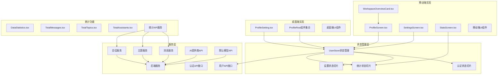
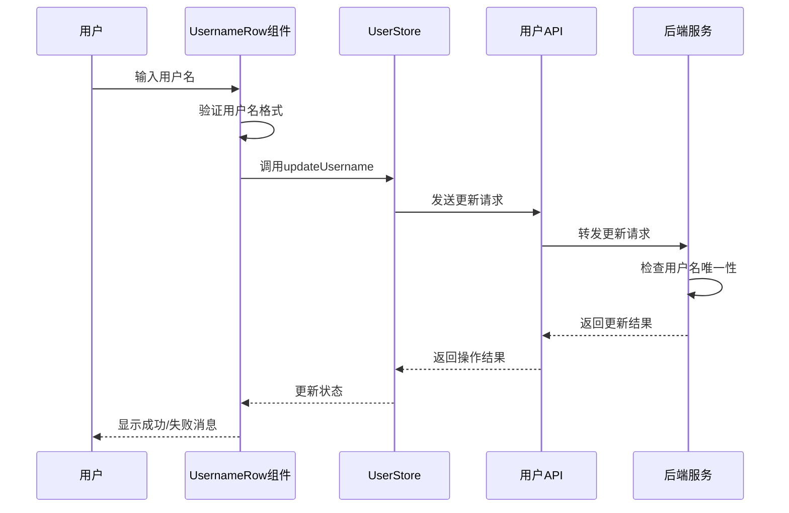
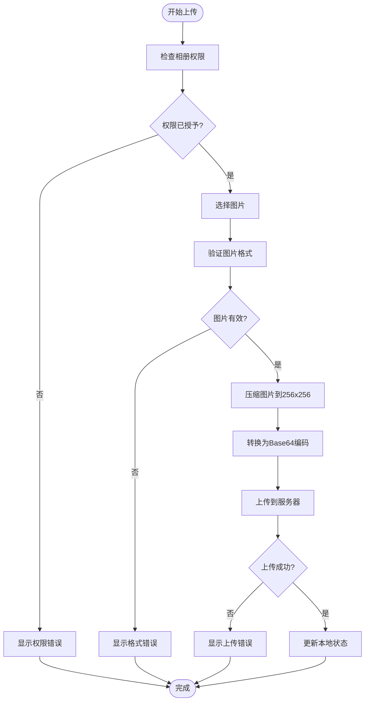
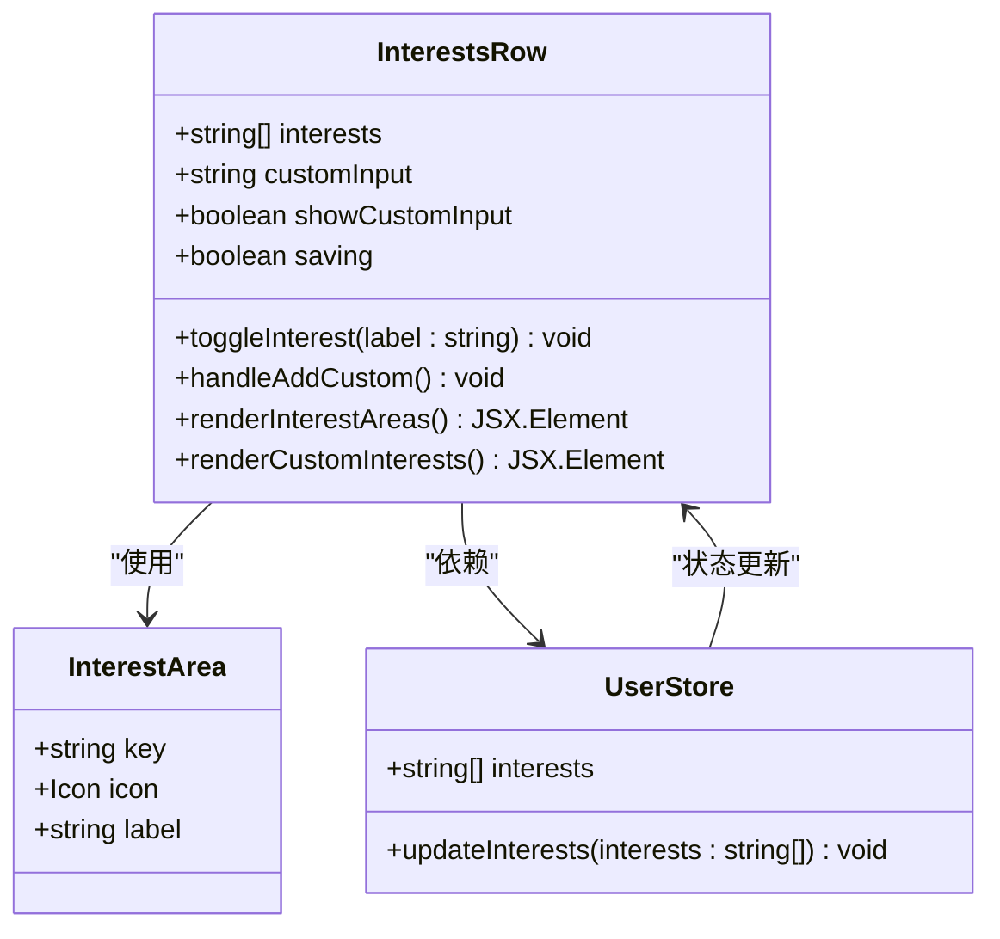
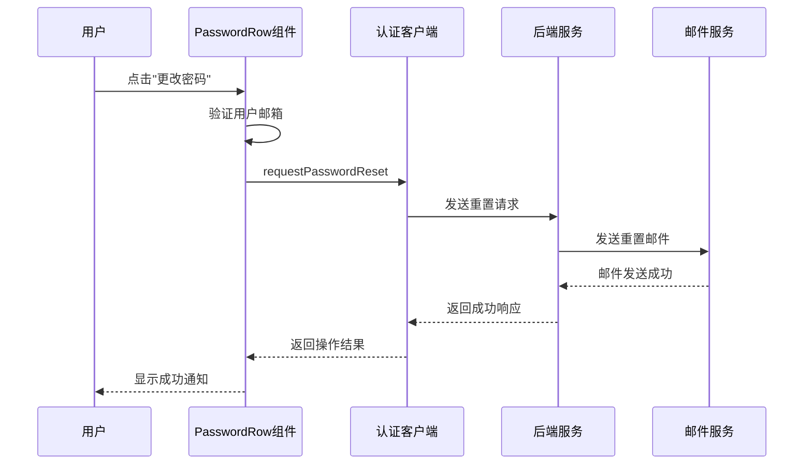
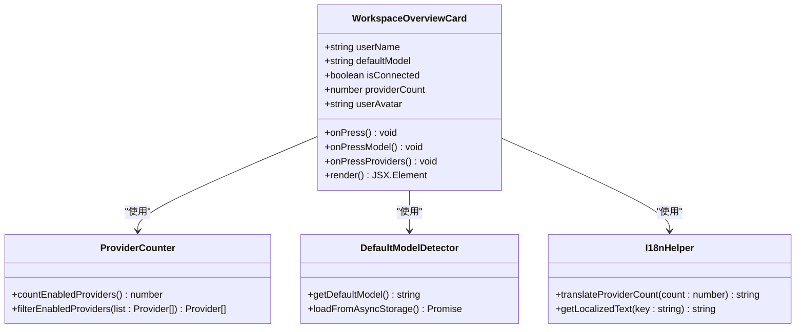
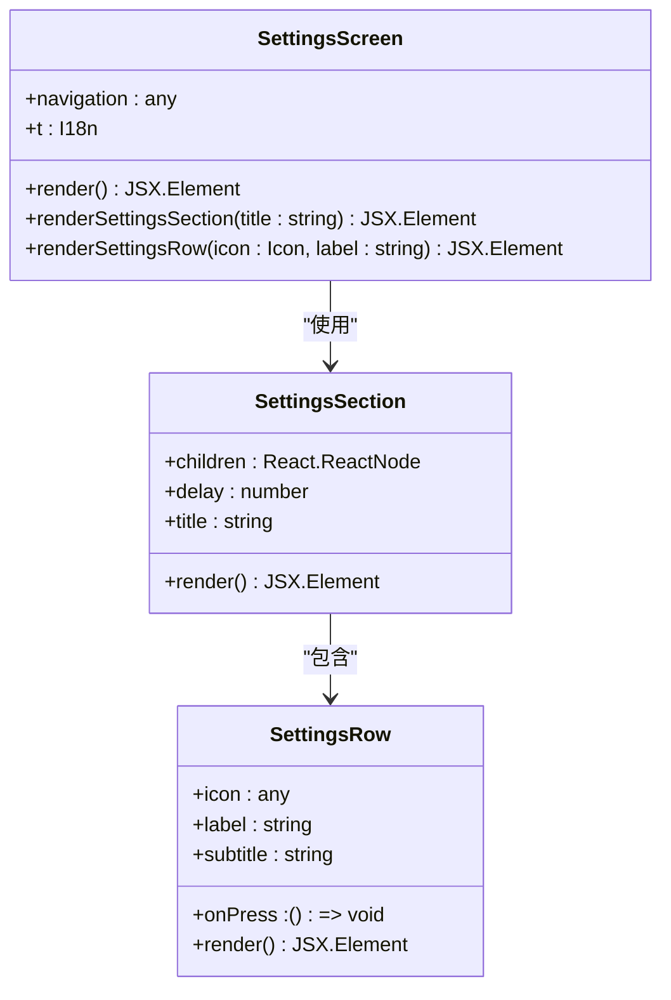
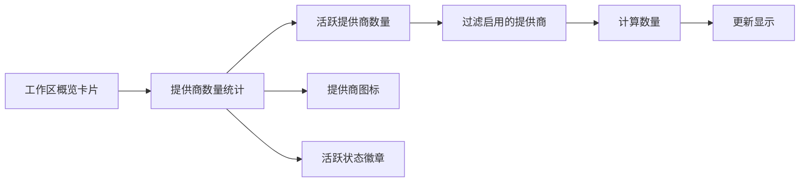
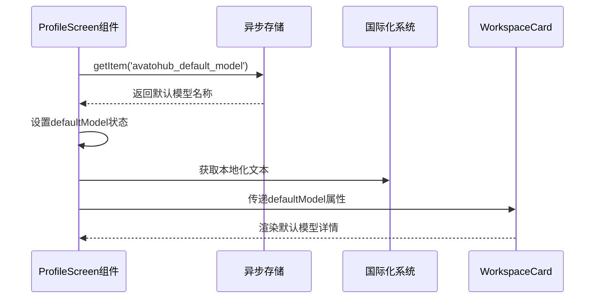
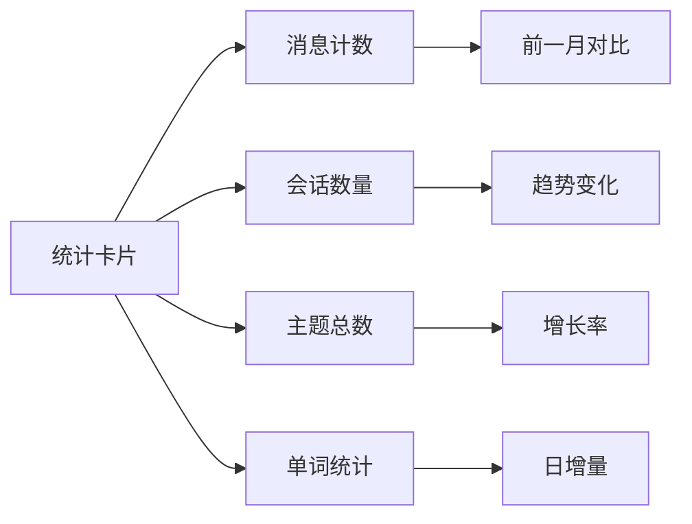

# 个人资料编辑增强

<cite>
**本文档中引用的文件**
- [ProfileScreen.tsx](file://apps/mobile/src/screens/ProfileScreen.tsx)
- [WorkspaceOverviewCard.tsx](file://apps/mobile/src/components/ui/WorkspaceOverviewCard.tsx)
- [SettingsScreen.tsx](file://apps/mobile/src/screens/SettingsScreen.tsx)
- [i18n.ts](file://apps/mobile/src/lib/i18n.ts)
- [StatsScreen.tsx](file://apps/mobile/src/screens/StatsScreen.tsx)
- [DataStatistics.tsx](file://src/features/User/DataStatistics.tsx)
- [TotalMessages.tsx](file://src/routes/(main)/settings/stats/features/overview/TotalMessages.tsx)
- [TotalTopics.tsx](file://src/routes/(main)/settings/stats/features/overview/TotalTopics.tsx)
- [TotalAssistants.tsx](file://src/routes/(main)/settings/stats/features/overview/TotalAssistants.tsx)
- [store.ts](file://src/store/user/store.ts)
- [message.service.ts](file://packages/openapi/src/services/message.service.ts)
- [topic.service.ts](file://packages/openapi/src/services/topic.service.ts)
</cite>

## 更新摘要

**所做更改**

- 更新 ProfileScreen 以显示提供商数量统计功能
- 将屏幕标题从 'Workspace' 重命名为 'Settings' 以提高清晰度
- 增强 WorkspaceOverviewCard 组件以支持提供商数量显示
- 完善国际化支持，添加提供商数量统计的本地化文本

## 目录

1. [简介](#简介)
2. [项目结构](#项目结构)
3. [核心组件](#核心组件)
4. [架构概览](#架构概览)
5. [详细组件分析](#详细组件分析)
6. [提供商数量统计功能](#提供商数量统计功能)
7. [默认模型详情显示](#默认模型详情显示)
8. [使用统计功能](#使用统计功能)
9. [设置页面重构](#设置页面重构)
10. [依赖关系分析](#依赖关系分析)
11. [性能考虑](#性能考虑)
12. [故障排除指南](#故障排除指南)
13. [结论](#结论)

## 简介

本文档详细介绍了 LobeHub 项目中的个人资料编辑增强功能。该功能提供了完整的用户个人信息管理界面，包括全名、用户名、头像、兴趣爱好、密码等信息的编辑和更新能力。系统支持桌面端和移动端两种不同的实现方式，通过统一的状态管理和 API 接口确保数据的一致性和可靠性。

**重要更新**：个人资料屏幕现已重构，新增使用统计功能，包括消息计数、会话数量、主题总数等交互元素，并集成了提供商数量信息显示和默认模型详情展示功能，为用户提供全面的使用数据分析和配置概览。同时，屏幕标题已从 'Workspace' 重命名为 'Settings'，提高了界面的清晰度和用户理解度。

该功能采用现代化的 React 和 TypeScript 技术栈构建，使用 Zustand 状态管理库进行状态持久化，Ant Design 组件库提供 UI 基础组件，实现了响应式设计和良好的用户体验。

## 项目结构

个人资料编辑功能在项目中采用了分层架构设计，主要包含以下层次：



**图表来源**

- [ProfileScreen.tsx:145-189](file://apps/mobile/src/screens/ProfileScreen.tsx#L145-L189)
- [StatsScreen.tsx:222-397](file://apps/mobile/src/screens/StatsScreen.tsx#L222-L397)
- [DataStatistics.tsx:46-88](file://src/features/User/DataStatistics.tsx#L46-L88)
- [WorkspaceOverviewCard.tsx:30-108](file://apps/mobile/src/components/ui/WorkspaceOverviewCard.tsx#L30-L108)

**章节来源**

- [ProfileScreen.tsx:1-203](file://apps/mobile/src/screens/ProfileScreen.tsx#L1-L203)
- [store.ts:1-59](file://src/store/user/store.ts#L1-L59)

## 核心组件

个人资料编辑功能由多个核心组件构成，每个组件负责特定的用户信息管理功能：

### 移动端个人资料编辑屏幕

移动端的个人资料编辑界面提供了完整的用户信息编辑功能，包括：

- **用户基本信息编辑**：全名、用户名、邮箱地址
- **头像上传和编辑**：支持从相册选择图片并自动压缩处理
- **兴趣爱好管理**：预定义的兴趣分类和自定义兴趣添加
- **密码管理**：密码重置和设置功能
- **社交链接配置**：GitHub、Twitter、个人网站等
- **设置页面导航**：跳转到完整的设置页面进行高级配置

### 工作区概览卡片

**更新功能**：WorkspaceOverviewCard 组件现在集成了提供商数量信息和默认模型详情显示：

- **提供商数量统计**：显示当前活跃的 AI 提供商数量
- **默认模型详情**：显示用户当前配置的默认模型名称
- **连接状态指示**：显示服务器连接状态
- **交互式导航**：支持跳转到个人资料编辑、模型选择器、AI 提供商管理页面

### 个人资料统计屏幕

**新增功能**：个人资料屏幕现已集成使用统计功能，提供以下交互元素：

- **消息计数统计**：显示总消息数和前一月对比
- **会话数量统计**：显示会话总数和趋势变化
- **主题总数统计**：显示话题总数和增长情况
- **单词统计**：显示总字数和前一月对比
- **活动热力图**：展示 20 周的活跃度分布
- **排名统计**：模型、助手、主题的 Top-5 排名

### 数据统计组件

**新增组件**：DataStatistics.tsx 提供统一的数据统计展示：

- **实时数据加载**：使用 SWR 实现数据的实时更新
- **百分比变化**：显示与前一日 / 前一月的对比变化
- **响应式布局**：支持桌面端和移动端的不同展示方式
- **今日徽章**：突出显示当日新增消息数量

### 设置页面重构

**更新功能**：SettingsScreen 组件已重构，移除了主题设置选项，专注于更高级别的配置管理：

- **AI 配置管理**：默认代理人的设置和管理
- **数据存储管理**：云端同步和本地存储管理
- **语音功能**：语音识别和文本转语音设置
- **关于页面**：隐私政策和应用信息

### 状态管理系统

系统使用 Zustand 实现集中状态管理，包含多个状态切片：

- **认证状态切片**：处理用户登录状态和认证信息
- **设置状态切片**：管理用户偏好设置和配置选项
- **统计状态切片**：管理使用统计数据和分析结果
- **通用状态切片**：提供基础的用户信息存储
- **引导状态切片**：处理新用户首次设置流程

**章节来源**

- [FullNameRow.tsx](<file://src/routes/(main)/settings/profile/features/FullNameRow.tsx#L1-L42>)
- [UsernameRow.tsx](<file://src/routes/(main)/settings/profile/features/UsernameRow.tsx#L1-L160>)
- [AvatarRow.tsx](<file://src/routes/(main)/settings/profile/features/AvatarRow.tsx#L1-L126>)
- [InterestsRow.tsx](<file://src/routes/(main)/settings/profile/features/InterestsRow.tsx#L1-L183>)
- [ProfileScreen.tsx:145-189](file://apps/mobile/src/screens/ProfileScreen.tsx#L145-L189)
- [StatsScreen.tsx:222-443](file://apps/mobile/src/screens/StatsScreen.tsx#L222-L443)
- [DataStatistics.tsx:46-147](file://src/features/User/DataStatistics.tsx#L46-L147)
- [WorkspaceOverviewCard.tsx:30-108](file://apps/mobile/src/components/ui/WorkspaceOverviewCard.tsx#L30-L108)
- [SettingsScreen.tsx:1-156](file://apps/mobile/src/screens/SettingsScreen.tsx#L1-L156)

## 架构概览

个人资料编辑功能采用分层架构设计，确保了代码的可维护性和扩展性：

```mermaid
graph TD
subgraph "表现层"
MobileUI[移动端UI组件]
DesktopUI[桌面端UI组件]
FormComponents[表单组件]
StatsComponents[统计组件]
WorkspaceCard[工作区概览卡片]
SettingsScreen[设置页面]
end
subgraph "业务逻辑层"
Validation[数据验证器]
Processing[数据处理器]
Notification[通知系统]
StatsCalculator[统计计算器]
ProviderCounter[提供商计数器]
DefaultModelDetector[默认模型检测器]
SettingsManager[设置管理器]
end
subgraph "状态管理层"
UserStore[用户状态管理]
StatsStore[统计状态管理]
SettingsStore[设置状态管理]
LocalStorage[本地存储]
SessionStorage[会话存储]
AsyncStorage[异步存储]
end
subgraph "数据访问层"
APIClient[API客户端]
AuthClient[认证客户端]
StatsClient[统计客户端]
ProviderClient[提供商客户端]
DefaultModelClient[默认模型客户端]
FileUploader[文件上传器]
SettingsClient[设置客户端]
end
subgraph "服务层"
MessageService[消息服务]
TopicService[主题服务]
SessionService[会话服务]
UserService[用户服务]
ProviderService[提供商服务]
DefaultModelService[默认模型服务]
Backend[后端服务]
AsyncStorage[异步存储服务]
Analytics[分析服务]
SettingsService[设置服务]
end
subgraph "外部服务"
CloudStorage[云存储服务]
AuthService[认证服务]
CDN[内容分发网络]
Analytics[分析服务]
```

**图表来源**

- [store.ts:36-47](file://src/store/user/store.ts#L36-L47)
- [ProfileSetupModal.tsx:188-220](file://src/layout/AuthProvider/MarketAuth/ProfileSetupModal.tsx#L188-L220)
- [StatsScreen.tsx:262-311](file://apps/mobile/src/screens/StatsScreen.tsx#L262-L311)
- [ProfileScreen.tsx:52-82](file://apps/mobile/src/screens/ProfileScreen.tsx#L52-L82)

**章节来源**

- [ProfileSetupModal.tsx:1-323](file://src/layout/AuthProvider/MarketAuth/ProfileSetupModal.tsx#L1-L323)
- [route.ts](<file://src/app/(backend)/market/user/me/route.ts#L45-L64>)

## 详细组件分析

### 用户名编辑组件分析

用户名编辑组件实现了完整的用户名管理功能，包括实时验证、冲突检测和错误处理：



**图表来源**

- [UsernameRow.tsx](<file://src/routes/(main)/settings/profile/features/UsernameRow.tsx#L38-L66>)
- [store.ts:36-47](file://src/store/user/store.ts#L36-L47)

该组件的关键特性包括：

- **实时验证**：输入时即时检查用户名格式和长度
- **冲突检测**：通过 API 检测用户名是否已被占用
- **错误处理**：友好的错误提示和恢复机制
- **状态管理**：使用 Zustand 进行状态持久化

**章节来源**

- [UsernameRow.tsx](<file://src/routes/(main)/settings/profile/features/UsernameRow.tsx#L1-L160>)

### 头像上传组件分析

头像上传组件提供了完整的图片处理和上传功能：



**图表来源**

- [AvatarRow.tsx](<file://src/routes/(main)/settings/profile/features/AvatarRow.tsx#L61-L87>)

**章节来源**

- [AvatarRow.tsx](<file://src/routes/(main)/settings/profile/features/AvatarRow.tsx#L1-L126>)

### 兴趣爱好管理组件分析

兴趣爱好管理组件提供了灵活的兴趣标签编辑功能：



**图表来源**

- [InterestsRow.tsx](<file://src/routes/(main)/settings/profile/features/InterestsRow.tsx#L20-L58>)
- [store.ts:36-47](file://src/store/user/store.ts#L36-L47)

**章节来源**

- [InterestsRow.tsx](<file://src/routes/(main)/settings/profile/features/InterestsRow.tsx#L1-L183>)

### 密码管理组件分析

密码管理组件实现了安全的密码重置流程：



**图表来源**

- [PasswordRow.tsx](<file://src/routes/(main)/settings/profile/features/PasswordRow.tsx#L23-L44>)

**章节来源**

- [PasswordRow.tsx](<file://src/routes/(main)/settings/profile/features/PasswordRow.tsx#L1-L70>)

### 工作区概览卡片组件分析

**更新组件**：WorkspaceOverviewCard 组件集成了提供商数量信息和默认模型详情显示功能：



**图表来源**

- [WorkspaceOverviewCard.tsx:30-108](file://apps/mobile/src/components/ui/WorkspaceOverviewCard.tsx#L30-L108)
- [ProfileScreen.tsx:52-82](file://apps/mobile/src/screens/ProfileScreen.tsx#L52-L82)

**章节来源**

- [WorkspaceOverviewCard.tsx:1-108](file://apps/mobile/src/components/ui/WorkspaceOverviewCard.tsx#L1-L108)

### 设置页面组件分析

**更新组件**：SettingsScreen 组件已重构，专注于更高级别的配置管理：



**图表来源**

- [SettingsScreen.tsx:84-156](file://apps/mobile/src/screens/SettingsScreen.tsx#L84-L156)

**章节来源**

- [SettingsScreen.tsx:1-156](file://apps/mobile/src/screens/SettingsScreen.tsx#L1-L156)

## 提供商数量统计功能

**更新章节**：个人资料屏幕现已集成提供商数量统计功能，为用户提供当前活跃 AI 提供商的实时统计信息。

### 工作区概览中的提供商统计

个人资料屏幕顶部的工作区概览卡片现在包含提供商数量统计：



**图表来源**

- [ProfileScreen.tsx:52-82](file://apps/mobile/src/screens/ProfileScreen.tsx#L52-L82)
- [WorkspaceOverviewCard.tsx:92-103](file://apps/mobile/src/components/ui/WorkspaceOverviewCard.tsx#L92-L103)

### 提供商计数实现

**更新功能**：ProfileScreen 组件实现了提供商数量的实时统计功能：

- **并发数据加载**：使用 Promise.all 并行获取消息、主题、提供商数量
- **启用提供商过滤**：只统计 `enabled` 状态的提供商
- **错误处理**：提供商数量获取失败时返回 0
- **状态更新**：将提供商数量存储在 `providerCount` 状态中

### 国际化支持

**更新功能**：添加了提供商数量的本地化文本支持：

- **英文文本**：`{count} active` - 显示活跃提供商数量
- **中文文本**：`{count} 个活跃` - 显示活跃提供商数量
- **动态替换**：使用 `replace()` 方法动态替换 `{count}` 占位符

**章节来源**

- [ProfileScreen.tsx:52-82](file://apps/mobile/src/screens/ProfileScreen.tsx#L52-L82)
- [WorkspaceOverviewCard.tsx:92-103](file://apps/mobile/src/components/ui/WorkspaceOverviewCard.tsx#L92-L103)
- [i18n.ts:914-915](file://apps/mobile/src/lib/i18n.ts#L914-L915)

## 默认模型详情显示

**更新章节**：个人资料屏幕现已集成默认模型详情显示功能，为用户提供当前配置的默认模型信息。

### 默认模型检测实现

**更新功能**：ProfileScreen 组件实现了默认模型的检测和显示功能：



**图表来源**

- [ProfileScreen.tsx:76-82](file://apps/mobile/src/screens/ProfileScreen.tsx#L76-L82)
- [WorkspaceOverviewCard.tsx:82-91](file://apps/mobile/src/components/ui/WorkspaceOverviewCard.tsx#L82-L91)

### 模型详情展示

**更新功能**：WorkspaceOverviewCard 组件现在显示默认模型详情：

- **模型标题**：显示 "Model" 文本标签
- **模型名称**：显示用户当前配置的默认模型名称
- **占位符处理**：如果未配置默认模型，显示 "Not configured" 文本
- **交互功能**：支持跳转到模型选择器页面

### 异步存储集成

**更新功能**：使用 AsyncStorage 实现默认模型的持久化存储：

- **存储键值**：`avatohub_default_model`
- **数据类型**：字符串格式的模型标识符
- **加载时机**：组件挂载时自动加载默认模型配置
- **状态同步**：将存储的模型名称同步到组件状态

**章节来源**

- [ProfileScreen.tsx:76-82](file://apps/mobile/src/screens/ProfileScreen.tsx#L76-L82)
- [WorkspaceOverviewCard.tsx:82-91](file://apps/mobile/src/components/ui/WorkspaceOverviewCard.tsx#L82-L91)

## 使用统计功能

**更新章节**：个人资料屏幕现已集成全面的使用统计功能，为用户提供详细的使用数据分析。

### 个人资料统计卡片

个人资料屏幕顶部的统计卡片提供了快速的使用概览：



**图表来源**

- [ProfileScreen.tsx:145-189](file://apps/mobile/src/screens/ProfileScreen.tsx#L145-L189)

### 移动端统计屏幕

**新增组件**：StatsScreen.tsx 提供完整的统计分析界面：

- **欢迎横幅**：显示注册时长和时间戳
- **概览卡片**：消息、会话、主题、单词的统计
- **活动热力图**：20 周的活跃度可视化
- **排名统计**：模型、助手、主题的 Top-5 排名

### 数据统计组件

**新增组件**：DataStatistics.tsx 提供统一的数据展示：

- **实时数据加载**：使用 SWR 实现数据的实时更新
- **百分比变化**：显示与前一日 / 前一月的对比变化
- **今日徽章**：突出显示当日新增消息数量
- **响应式布局**：支持不同设备的最佳展示效果

### 统计服务层

**新增服务**：统计功能依赖于专门的服务层：

- **消息统计**：统计消息总数、当日数量、字数统计
- **主题统计**：统计主题总数、活跃度分析
- **会话统计**：统计会话数量、时长分析
- **用户统计**：统计用户活跃度、使用模式

**章节来源**

- [ProfileScreen.tsx:145-189](file://apps/mobile/src/screens/ProfileScreen.tsx#L145-L189)
- [StatsScreen.tsx:222-443](file://apps/mobile/src/screens/StatsScreen.tsx#L222-L443)
- [DataStatistics.tsx:46-147](file://src/features/User/DataStatistics.tsx#L46-L147)
- [TotalMessages.tsx:14-51](<file://src/routes/(main)/settings/stats/features/overview/TotalMessages.tsx#L14-L51>)
- [TotalTopics.tsx:14-50](<file://src/routes/(main)/settings/stats/features/overview/TotalTopics.tsx#L14-L50>)
- [TotalAssistants.tsx:14-53](<file://src/routes/(main)/settings/stats/features/overview/TotalAssistants.tsx#L14-L53>)

## 设置页面重构

**更新章节**：个人资料屏幕现已重构，移除了 'Workspace' 标题，改为更清晰的 'Settings' 标题。

### 屏幕标题更新

**更新功能**：ProfileScreen 组件的屏幕标题已从 'Workspace' 更改为 'Settings'：

- **标题文本**：`{t.settingsTitle}` - 显示设置标题
- **国际化支持**：支持多语言本地化
- **清晰度提升**：用户更容易理解页面功能

### 设置项迁移

**更新功能**：部分设置项已从工作区迁移到设置页面：

- **服务器配置**：移动到设置页面的服务器配置部分
- **AI 提供商管理**：移动到设置页面的 AI 配置部分
- **默认模型设置**：移动到设置页面的聊天设置部分
- **语言选择**：移动到设置页面的语言配置部分

### 设置页面功能

**更新功能**：SettingsScreen 组件专注于更高级别的配置管理：

- **AI 配置管理**：默认代理人的设置和管理
- **数据存储管理**：云端同步和本地存储管理
- **语音功能**：语音识别和文本转语音设置
- **关于页面**：隐私政策和应用信息

**章节来源**

- [ProfileScreen.tsx:117](file://apps/mobile/src/screens/ProfileScreen.tsx#L117)
- [SettingsScreen.tsx:84-156](file://apps/mobile/src/screens/SettingsScreen.tsx#L84-L156)

## 依赖关系分析

个人资料编辑功能的依赖关系呈现清晰的分层结构：

```mermaid
graph TB
subgraph "UI层依赖"
ProfileEdit[ProfileEditScreen]
ProfileSetting[ProfileSetting]
ProfileComponents[ProfileRow组件]
StatsScreen[StatsScreen]
DataStats[DataStatistics]
WorkspaceCard[WorkspaceOverviewCard]
SettingsScreen[SettingsScreen]
end
subgraph "状态管理依赖"
UserStore[UserStore]
StatsStore[StatsStore]
SettingsStore[SettingsStore]
Zustand[Zustand库]
DevTools[开发工具]
AsyncStorage[异步存储]
end
subgraph "API层依赖"
UserAPI[用户API]
AuthAPI[认证API]
StatsAPI[统计API]
BetterAuth[BetterAuth客户端]
StatsServices[统计服务]
AIProviderApi[AI提供商API]
DefaultModelApi[默认模型API]
SettingsApi[设置API]
end
subgraph "工具库依赖"
ImageUtils[图片处理工具]
UploadUtils[文件上传工具]
I18nUtils[国际化工具]
TimeUtils[时间处理工具]
FormatUtils[格式化工具]
end
subgraph "第三方依赖"
AntD[Ant Design]
Lucide[Lucide图标]
React[React框架]
Native[React Native]
SWR[SWR数据获取]
AsyncStorage[异步存储库]
```

**图表来源**

- [store.ts:1-59](file://src/store/user/store.ts#L1-L59)
- [ProfileSetupModal.tsx:1-323](file://src/layout/AuthProvider/MarketAuth/ProfileSetupModal.tsx#L1-L323)
- [StatsScreen.tsx:262-311](file://apps/mobile/src/screens/StatsScreen.tsx#L262-L311)
- [WorkspaceOverviewCard.tsx:30-108](file://apps/mobile/src/components/ui/WorkspaceOverviewCard.tsx#L30-L108)

**章节来源**

- [store.ts:1-59](file://src/store/user/store.ts#L1-L59)
- [ProfileSetupModal.tsx:1-323](file://src/layout/AuthProvider/MarketAuth/ProfileSetupModal.tsx#L1-L323)

## 性能考虑

个人资料编辑功能在设计时充分考虑了性能优化：

### 状态管理优化

- 使用 Zustand 的浅比较优化避免不必要的重新渲染
- 分离状态切片减少全局状态更新范围
- 实现状态持久化避免页面刷新丢失数据
- **更新**：统计状态切片的懒加载和按需更新
- **更新**：异步存储的缓存机制减少重复读取
- **更新**：设置状态的分离管理提高响应速度

### 图片处理优化

- 限制图片尺寸到 256x256 减少传输体积
- 使用 Base64 编码减少服务器往返次数
- 实现图片加载状态管理避免界面卡顿

### 网络请求优化

- 实现防抖机制避免频繁的 API 调用
- 使用缓存策略减少重复请求
- 错误重试机制提高成功率
- **更新**：统计数据的批量请求和并发优化
- **更新**：提供商数量的独立缓存策略
- **更新**：设置项的延迟加载机制

### 内存管理优化

- 及时清理事件监听器防止内存泄漏
- 实现组件卸载时的状态清理
- 优化大列表渲染性能
- **更新**：异步存储的内存缓存管理
- **更新**：国际化文本的按需加载
- **更新**：设置页面的组件复用优化

### 数据加载优化

- **更新**：使用 SWR 实现智能缓存和自动刷新
- **更新**：统计数据的分页加载和无限滚动
- **更新**：图表数据的懒加载和按需渲染
- **更新**：提供商列表的本地过滤和排序
- **更新**：设置项的条件渲染和延迟初始化

## 故障排除指南

### 常见问题及解决方案

**用户名冲突问题**

- 症状：用户名更新时报错 "用户名已存在"
- 解决方案：检查用户名唯一性，提供替代建议
- 预防措施：实现实时用户名检查

**头像上传失败**

- 症状：图片上传后无法显示或显示错误
- 解决方案：检查图片格式和大小限制，重新上传
- 预防措施：实现上传进度显示和错误提示

**兴趣爱好保存失败**

- 症状：兴趣标签切换后不生效
- 解决方案：检查网络连接，重新尝试保存
- 预防措施：实现本地状态回滚机制

**密码重置邮件未送达**

- 症状：点击 "更改密码" 无反应
- 解决方案：检查邮箱配置，确认邮件服务商状态
- 预防措施：提供邮件发送状态反馈

**统计数据显示异常**

- 症状：统计卡片显示错误或空白
- 解决方案：检查网络连接，清除缓存重新加载
- 预防措施：实现错误边界和降级显示

**提供商数量显示错误**

- 症状：工作区概览中的提供商数量显示不正确
- 解决方案：检查提供商 API 响应，确认启用状态过滤
- 预防措施：实现提供商状态的本地缓存

**默认模型显示为空**

- 症状：工作区概览中的默认模型显示 "Not configured"
- 解决方案：检查 AsyncStorage 中的存储值，确认模型配置
- 预防措施：实现默认模型的自动检测和回退机制

**统计图表渲染缓慢**

- 症状：统计屏幕加载缓慢或卡顿
- 解决方案：检查数据量大小，优化渲染性能
- 预防措施：实现虚拟滚动和懒加载

**设置页面导航问题**

- 症状：点击设置项无响应或跳转错误
- 解决方案：检查路由配置，确认导航参数正确
- 预防措施：实现导航状态的验证和错误处理

**章节来源**

- [UsernameRow.tsx](<file://src/routes/(main)/settings/profile/features/UsernameRow.tsx#L56-L66>)
- [AvatarRow.tsx](<file://src/routes/(main)/settings/profile/features/AvatarRow.tsx#L76-L84>)
- [InterestsRow.tsx](<file://src/routes/(main)/settings/profile/features/InterestsRow.tsx#L47-L56>)
- [StatsScreen.tsx:317-321](file://apps/mobile/src/screens/StatsScreen.tsx#L317-L321)
- [SettingsScreen.tsx:84-156](file://apps/mobile/src/screens/SettingsScreen.tsx#L84-L156)

## 结论

个人资料编辑增强功能通过模块化的设计和完善的错误处理机制，为用户提供了流畅的个人信息管理体验。系统在移动端和桌面端都实现了统一的功能体验，同时保持了良好的性能表现。

**重要更新**：个人资料屏幕的重构新增了使用统计功能、提供商数量信息显示和默认模型详情展示功能，包括消息计数、会话数量、主题总数等交互元素，以及活跃提供商数量统计和用户默认模型配置概览，为用户提供了全面的使用数据分析能力和配置管理视图。同时，屏幕标题从 'Workspace' 重命名为 'Settings'，显著提高了界面的清晰度和用户理解度。

该功能的主要优势包括：

- **跨平台一致性**：移动端和桌面端提供相同的编辑体验
- **实时统计分析**：提供准确的使用数据和趋势分析
- **交互式统计**：支持点击跳转到详细统计页面
- **提供商概览**：实时显示活跃 AI 提供商数量
- **模型配置管理**：直观展示用户默认模型配置
- **设置页面优化**：清晰的设置导航和功能组织
- **响应式设计**：适配不同设备的最佳展示效果
- **性能优化**：合理的状态管理和网络请求策略
- **可扩展性**：模块化的架构设计便于功能扩展

未来可以考虑的功能增强包括：支持更多统计维度、实现自定义统计报表、增加数据导出功能、提供统计提醒和通知、扩展提供商配置管理、增强设置页面的个性化选项等。

**章节来源**

- [ProfileScreen.tsx:145-189](file://apps/mobile/src/screens/ProfileScreen.tsx#L145-L189)
- [StatsScreen.tsx:222-443](file://apps/mobile/src/screens/StatsScreen.tsx#L222-L443)
- [DataStatistics.tsx:46-147](file://src/features/User/DataStatistics.tsx#L46-L147)
- [WorkspaceOverviewCard.tsx:30-108](file://apps/mobile/src/components/ui/WorkspaceOverviewCard.tsx#L30-L108)
- [SettingsScreen.tsx:1-156](file://apps/mobile/src/screens/SettingsScreen.tsx#L1-L156)
