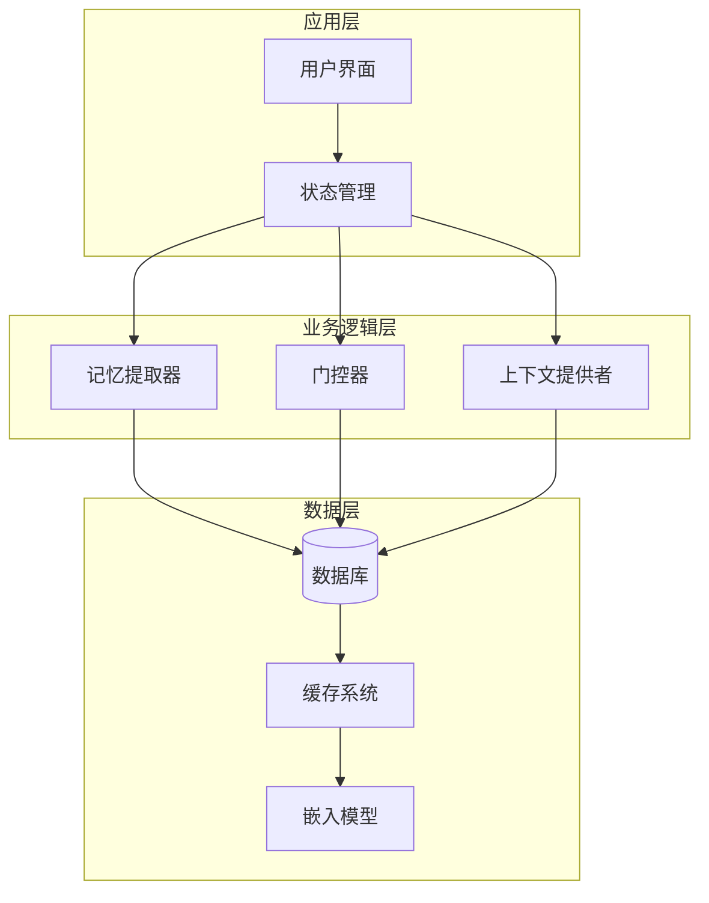
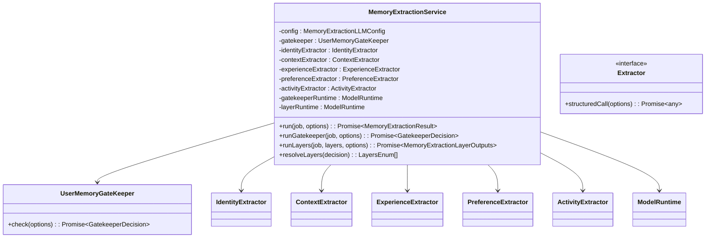
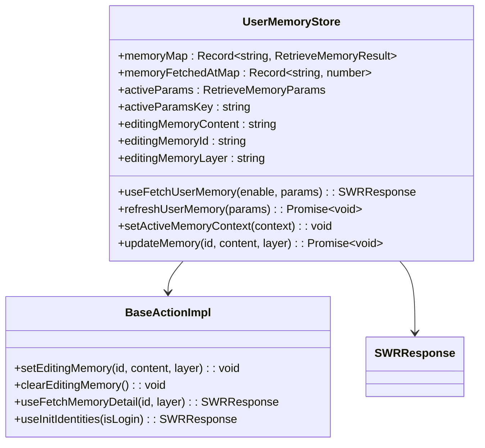
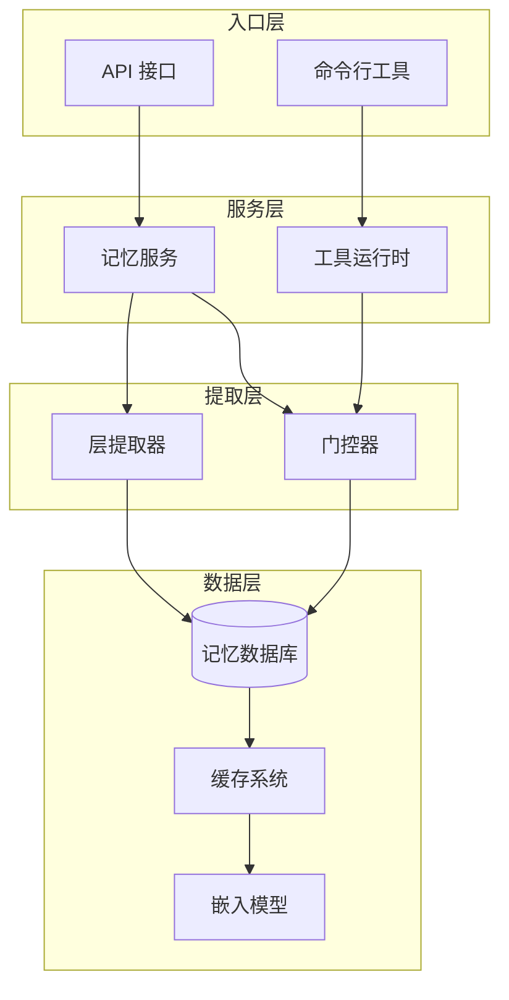
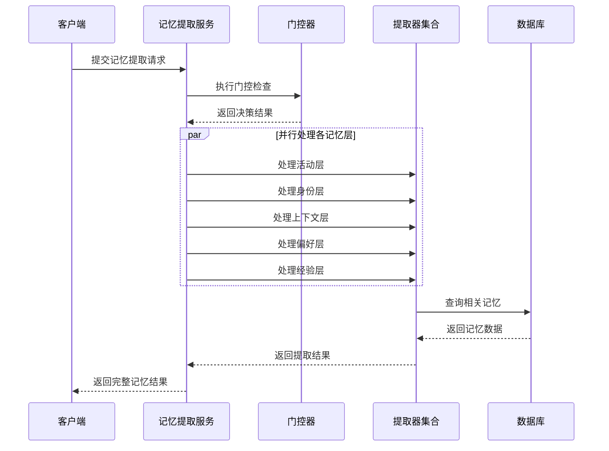
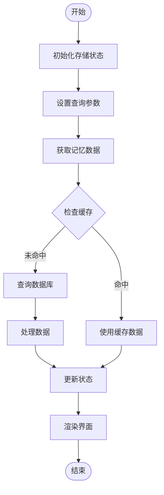
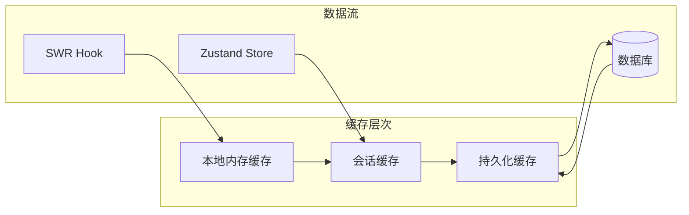

# 内存管理系统

<cite>
**本文档引用的文件**
- [packages/memory-user-memory/src/index.ts](file://packages/memory-user-memory/src/index.ts)
- [packages/memory-user-memory/src/services/extractExecutor.ts](file://packages/memory-user-memory/src/services/extractExecutor.ts)
- [packages/memory-user-memory/src/extractors/index.ts](file://packages/memory-user-memory/src/extractors/index.ts)
- [packages/memory-user-memory/src/providers/index.ts](file://packages/memory-user-memory/src/providers/index.ts)
- [src/store/userMemory/store.ts](file://src/store/userMemory/store.ts)
- [src/store/userMemory/initialState.ts](file://src/store/userMemory/initialState.ts)
- [src/store/userMemory/types.ts](file://src/store/userMemory/types.ts)
- [src/store/userMemory/slices/base/action.ts](file://src/store/userMemory/slices/base/action.ts)
- [src/store/userMemory/utils/cacheKey.ts](file://src/store/userMemory/utils/cacheKey.ts)
- [src/store/userMemory/utils/searchParams.ts](file://src/store/userMemory/utils/searchParams.ts)
- [src/server/services/toolExecution/serverRuntimes/memory.ts](file://src/server/services/toolExecution/serverRuntimes/memory.ts)
</cite>

## 目录

1. [简介](#简介)
2. [项目结构](#项目结构)
3. [核心组件](#核心组件)
4. [架构概览](#架构概览)
5. [详细组件分析](#详细组件分析)
6. [依赖关系分析](#依赖关系分析)
7. [性能考虑](#性能考虑)
8. [故障排除指南](#故障排除指南)
9. [结论](#结论)

## 简介

内存管理系统是 LobeChat 项目中的一个关键组件，负责用户记忆的提取、存储、检索和管理。该系统采用分层架构设计，将不同类型的记忆（活动、身份、上下文、偏好、经验）分离到独立的处理层中，并通过智能门控器来决定哪些层需要被提取。

系统的核心目标是提供高效、可扩展的记忆管理能力，支持多模态数据处理、智能缓存机制和可观测性监控。通过模块化的设计，系统能够灵活地处理各种记忆类型的数据，并为上层应用提供统一的访问接口。

## 项目结构

内存管理系统的整体架构由三个主要层次组成：



**图表来源**

- [packages/memory-user-memory/src/index.ts:1-7](file://packages/memory-user-memory/src/index.ts#L1-L7)
- [src/store/userMemory/store.ts:1-71](file://src/store/userMemory/store.ts#L1-L71)

**章节来源**

- [packages/memory-user-memory/src/index.ts:1-7](file://packages/memory-user-memory/src/index.ts#L1-L7)
- [src/store/userMemory/store.ts:1-71](file://src/store/userMemory/store.ts#L1-L71)

## 核心组件

### 记忆提取服务

记忆提取服务是整个系统的核心执行组件，负责协调各个记忆层的提取过程。它实现了完整的记忆处理流水线，包括门控检查、层级提取和结果整合。



**图表来源**

- [packages/memory-user-memory/src/services/extractExecutor.ts:77-135](file://packages/memory-user-memory/src/services/extractExecutor.ts#L77-L135)

### 状态管理存储

用户记忆状态管理采用 Zustand 库实现，提供了响应式的状态管理和高效的更新机制。存储结构支持多层记忆的并行管理，并集成了 SWR 数据获取和缓存机制。



**图表来源**

- [src/store/userMemory/initialState.ts:21-41](file://src/store/userMemory/initialState.ts#L21-L41)
- [src/store/userMemory/slices/base/action.ts:26-34](file://src/store/userMemory/slices/base/action.ts#L26-L34)

**章节来源**

- [packages/memory-user-memory/src/services/extractExecutor.ts:77-135](file://packages/memory-user-memory/src/services/extractExecutor.ts#L77-L135)
- [src/store/userMemory/initialState.ts:21-41](file://src/store/userMemory/initialState.ts#L21-L41)
- [src/store/userMemory/slices/base/action.ts:26-34](file://src/store/userMemory/slices/base/action.ts#L26-L34)

## 架构概览

内存管理系统的整体架构采用了分层设计模式，确保了各组件之间的松耦合和高内聚。



**图表来源**

- [src/server/services/toolExecution/serverRuntimes/memory.ts:667-698](file://src/server/services/toolExecution/serverRuntimes/memory.ts#L667-L698)
- [packages/memory-user-memory/src/services/extractExecutor.ts:263-283](file://packages/memory-user-memory/src/services/extractExecutor.ts#L263-L283)

## 详细组件分析

### 记忆提取执行流程

记忆提取过程是一个异步的并行处理流程，系统会根据门控器的决策结果来确定需要处理的记忆层。



**图表来源**

- [packages/memory-user-memory/src/services/extractExecutor.ts:215-261](file://packages/memory-user-memory/src/services/extractExecutor.ts#L215-L261)
- [packages/memory-user-memory/src/services/extractExecutor.ts:349-423](file://packages/memory-user-memory/src/services/extractExecutor.ts#L349-L423)

### 状态管理流程

用户记忆的状态管理采用响应式设计，通过 Zustand 实现高效的局部状态更新。



**图表来源**

- [src/store/userMemory/slices/base/action.ts:209-276](file://src/store/userMemory/slices/base/action.ts#L209-L276)

**章节来源**

- [packages/memory-user-memory/src/services/extractExecutor.ts:215-261](file://packages/memory-user-memory/src/services/extractExecutor.ts#L215-L261)
- [src/store/userMemory/slices/base/action.ts:209-276](file://src/store/userMemory/slices/base/action.ts#L209-L276)

### 缓存策略

系统实现了多层次的缓存策略来优化性能和减少数据库查询压力。



**图表来源**

- [src/store/userMemory/utils/cacheKey.ts:3-10](file://src/store/userMemory/utils/cacheKey.ts#L3-L10)
- [src/store/userMemory/slices/base/action.ts:220-272](file://src/store/userMemory/slices/base/action.ts#L220-L272)

**章节来源**

- [src/store/userMemory/utils/cacheKey.ts:3-10](file://src/store/userMemory/utils/cacheKey.ts#L3-L10)
- [src/store/userMemory/slices/base/action.ts:220-272](file://src/store/userMemory/slices/base/action.ts#L220-L272)

## 依赖关系分析

内存管理系统的依赖关系呈现清晰的分层结构，各组件之间的耦合度较低，便于维护和扩展。

```mermaid
graph TB
subgraph "外部依赖"
SWR[SWR]
Zustand[Zustand]
FastDeepEqual[fast-deep-equal]
end
subgraph "内部包"
MemoryUserMemory[packages/memory-user-memory]
ObservabilityOTEL[packages/observability-otel]
Types[@lobechat/types]
end
subgraph "应用层"
UserMemoryStore[src/store/userMemory]
ServerRuntime[src/server/services/toolExecution]
end
SWR --> UserMemoryStore
Zustand --> UserMemoryStore
FastDeepEqual --> UserMemoryStore
MemoryUserMemory --> UserMemoryStore
ObservabilityOTEL --> MemoryUserMemory
Types --> MemoryUserMemory
UserMemoryStore --> ServerRuntime
MemoryUserMemory --> ServerRuntime
```

**图表来源**

- [src/store/userMemory/store.ts:1-7](file://src/store/userMemory/store.ts#L1-L7)
- [packages/memory-user-memory/src/services/extractExecutor.ts:1-12](file://packages/memory-user-memory/src/services/extractExecutor.ts#L1-L12)

**章节来源**

- [src/store/userMemory/store.ts:1-7](file://src/store/userMemory/store.ts#L1-L7)
- [packages/memory-user-memory/src/services/extractExecutor.ts:1-12](file://packages/memory-user-memory/src/services/extractExecutor.ts#L1-L12)

## 性能考虑

内存管理系统在设计时充分考虑了性能优化，采用了多种策略来提升系统的响应速度和资源利用率。

### 并行处理优化

系统使用 Promise.all 实现记忆层的并行处理，显著减少了整体处理时间。每个记忆层的提取都是独立的异步操作，可以充分利用多核 CPU 的计算能力。

### 智能缓存机制

- **多级缓存**：从本地内存到持久化存储的完整缓存链路
- **智能失效**：基于时间戳和内容变更的缓存失效策略
- **预加载机制**：根据用户行为预测可能需要的记忆数据

### 资源管理

- **内存池**：复用对象实例，减少垃圾回收压力
- **流式处理**：大体量数据的流式处理避免内存峰值
- **延迟加载**：按需加载非关键数据

## 故障排除指南

### 常见问题及解决方案

**问题 1：记忆提取失败**

- 检查门控器配置是否正确
- 验证模型运行时的可用性
- 查看日志中的错误堆栈信息

**问题 2：缓存不生效**

- 确认缓存键的生成规则
- 检查缓存过期时间设置
- 验证缓存存储后端的连接状态

**问题 3：性能问题**

- 分析各记忆层的处理耗时
- 检查数据库查询优化
- 监控内存使用情况

**章节来源**

- [packages/memory-user-memory/src/services/extractExecutor.ts:137-151](file://packages/memory-user-memory/src/services/extractExecutor.ts#L137-L151)
- [packages/memory-user-memory/src/services/extractExecutor.ts:153-169](file://packages/memory-user-memory/src/services/extractExecutor.ts#L153-L169)

## 结论

内存管理系统通过模块化的设计和分层架构，成功实现了高效、可扩展的记忆管理功能。系统的关键优势包括：

1. **模块化设计**：清晰的职责分离使得各组件易于维护和测试
2. **高性能处理**：并行处理和智能缓存机制确保了良好的性能表现
3. **可观测性**：完整的指标收集和日志记录便于问题诊断
4. **可扩展性**：灵活的插件架构支持新功能的快速集成

该系统为 LobeChat 提供了强大的记忆管理能力，为用户提供更加智能和个性化的交互体验。通过持续的优化和改进，系统将继续满足不断增长的功能需求和技术挑战。
