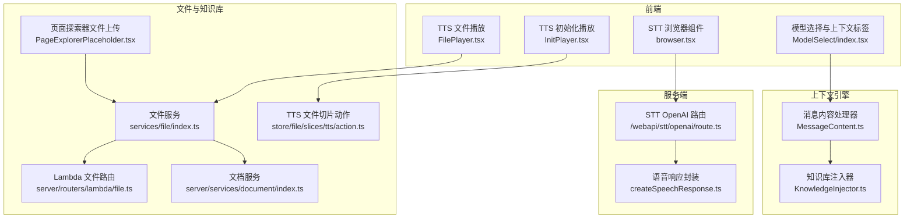
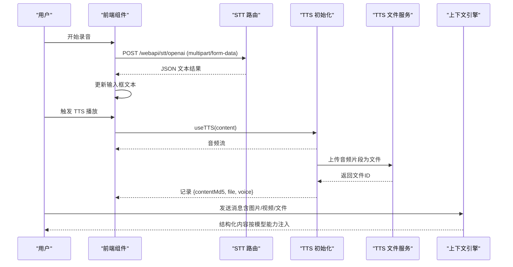
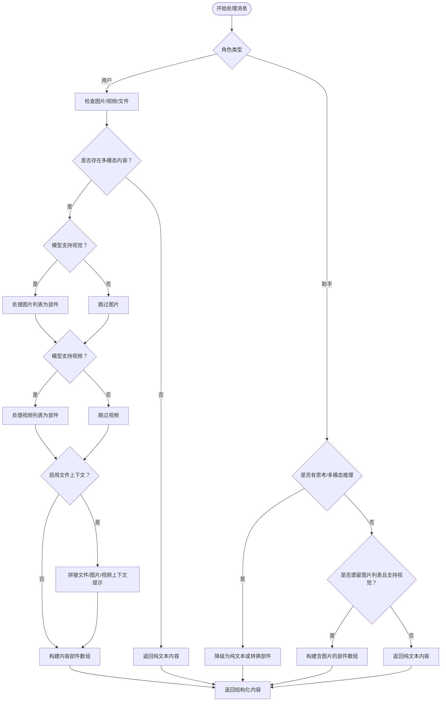
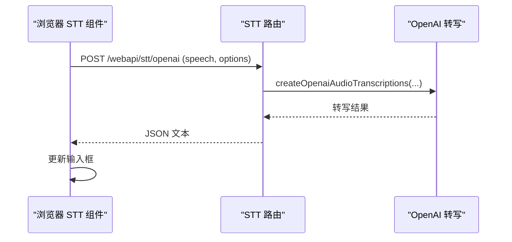
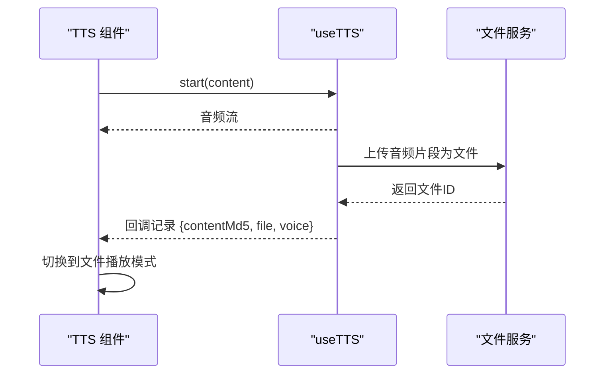
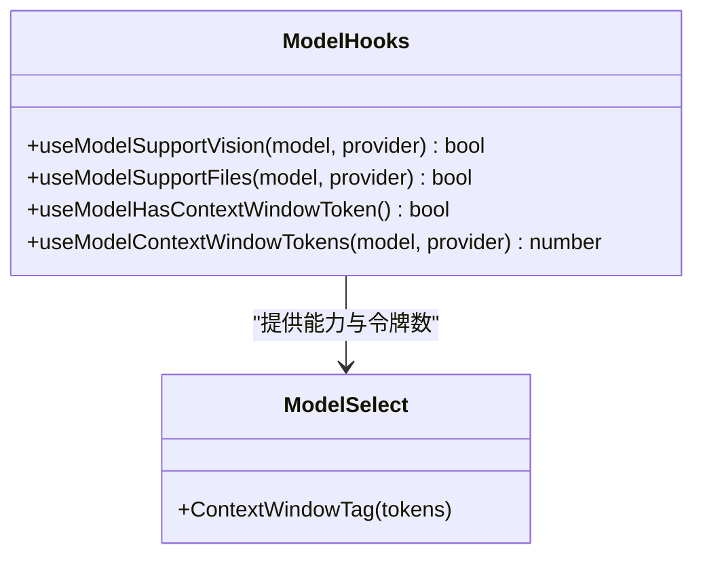
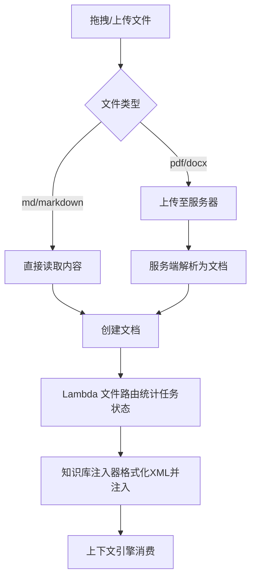
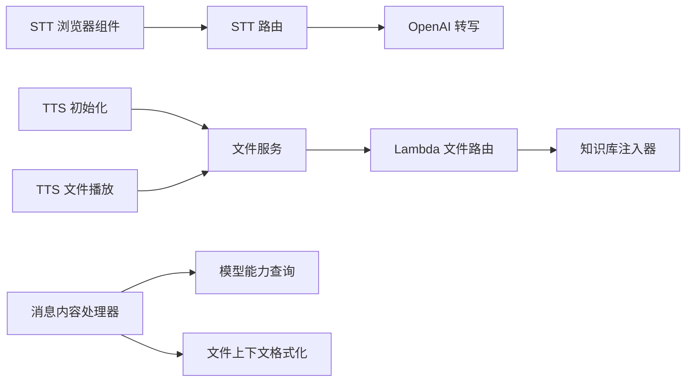

# 多模态交互系统

<cite>
**本文引用的文件**
- [packages/context-engine/src/processors/MessageContent.ts](file://packages/context-engine/src/processors/MessageContent.ts)
- [packages/context-engine/src/processors/__tests__/MessageContent.test.ts](file://packages/context-engine/src/processors/__tests__/MessageContent.test.ts)
- [src/features/Conversation/Messages/components/Extras/TTS/InitPlayer.tsx](file://src/features/Conversation/Messages/components/Extras/TTS/InitPlayer.tsx)
- [src/features/Conversation/Messages/components/Extras/TTS/FilePlayer.tsx](file://src/features/Conversation/Messages/components/Extras/TTS/FilePlayer.tsx)
- [src/features/Conversation/Messages/components/Extras/TTS/index.tsx](file://src/features/Conversation/Messages/components/Extras/TTS/index.tsx)
- [src/features/ChatInput/ActionBar/STT/browser.tsx](file://src/features/ChatInput/ActionBar/STT/browser.tsx)
- [src/app/(backend)/webapi/stt/openai/route.ts](file://src/app/(backend)/webapi/stt/openai/route.ts)
- [apps/cli/src/commands/generate/asr.ts](file://apps/cli/src/commands/generate/asr.ts)
- [src/server/utils/createSpeechResponse.ts](file://src/server/utils/createSpeechResponse.ts)
- [src/hooks/useModelSupportVision.ts](file://src/hooks/useModelSupportVision.ts)
- [src/hooks/useModelSupportFiles.ts](file://src/hooks/useModelSupportFiles.ts)
- [src/hooks/useModelHasContextWindowToken.ts](file://src/hooks/useModelHasContextWindowToken.ts)
- [src/hooks/useModelContextWindowTokens.ts](file://src/hooks/useModelContextWindowTokens.ts)
- [src/components/ModelSelect/index.tsx](file://src/components/ModelSelect/index.tsx)
- [src/store/file/slices/tts/action.ts](file://src/store/file/slices/tts/action.ts)
- [src/store/file/slices/tts/selectors.ts](file://src/store/file/slices/tts/selectors.ts)
- [src/services/file/index.ts](file://src/services/file/index.ts)
- [src/features/PageExplorer/PageExplorerPlaceholder.tsx](file://src/features/PageExplorer/PageExplorerPlaceholder.tsx)
- [src/server/routers/lambda/file.ts](file://src/server/routers/lambda/file.ts)
- [src/server/services/document/index.ts](file://src/server/services/document/index.ts)
- [packages/prompts/src/prompts/knowledgeBaseQA/formatFileContents.ts](file://packages/prompts/src/prompts/knowledgeBaseQA/formatFileContents.ts)
- [packages/context-engine/src/providers/KnowledgeInjector.ts](file://packages/context-engine/src/providers/KnowledgeInjector.ts)
- [docs/changelog/2023-11-14-gpt4-vision.mdx](file://docs/changelog/2023-11-14-gpt4-vision.mdx)
- [docs/changelog/2023-11-19-tts-stt.mdx](file://docs/changelog/2023-11-19-tts-stt.mdx)
- [docs/usage/getting-started/vision.mdx](file://docs/usage/getting-started/vision.mdx)
</cite>

## 目录

1. [简介](#简介)
2. [项目结构](#项目结构)
3. [核心组件](#核心组件)
4. [架构总览](#架构总览)
5. [详细组件分析](#详细组件分析)
6. [依赖关系分析](#依赖关系分析)
7. [性能考量](#性能考量)
8. [故障排查指南](#故障排查指南)
9. [结论](#结论)
10. [附录](#附录)

## 简介

本技术文档面向多模态交互系统，围绕语音合成（TTS）、语音识别（STT）、视觉识别与文件处理展开，系统化阐述多模态数据在前端与后端的处理流程、模型能力判定与切换机制、上下文窗口与推理能力评估、以及文件支持与知识库注入路径。文档同时提供可操作的集成步骤、性能优化策略、错误处理方案与兼容性建议，并给出自定义多模态模型接入与扩展开发指南。

## 项目结构

多模态能力在本仓库中主要分布在以下层次：

- 前端组件层：负责用户交互、TTS 播放控制、STT 录音与文本回填、消息内容渲染与多模态展示。
- 服务层：提供语音合成响应封装、STT 路由与业务 OpenAI 实例构建。
- 上下文引擎层：统一处理消息内容格式转换，支持文本、图片、视频与文件上下文注入。
- 文件与知识库层：文件上传、解析、分块与嵌入任务管理，以及文档与文件的知识库注入。
- 模型能力查询层：通过全局状态查询模型是否支持视觉、视频、文件、上下文窗口等能力。

图表来源

- [src/features/ChatInput/ActionBar/STT/browser.tsx](file://src/features/ChatInput/ActionBar/STT/browser.tsx#L1-L127)
- [src/app/(backend)/webapi/stt/openai/route.ts](<file://src/app/(backend)/webapi/stt/openai/route.ts#L1-L30>)
- [src/server/utils/createSpeechResponse.ts](file://src/server/utils/createSpeechResponse.ts#L1-L55)
- [packages/context-engine/src/processors/MessageContent.ts](file://packages/context-engine/src/processors/MessageContent.ts#L1-L430)
- [packages/context-engine/src/providers/KnowledgeInjector.ts](file://packages/context-engine/src/providers/KnowledgeInjector.ts#L44-L66)
- [src/store/file/slices/tts/action.ts](file://src/store/file/slices/tts/action.ts#L1-L52)
- [src/services/file/index.ts](file://src/services/file/index.ts#L1-L124)
- [src/features/PageExplorer/PageExplorerPlaceholder.tsx](file://src/features/PageExplorer/PageExplorerPlaceholder.tsx#L174-L207)
- [src/server/routers/lambda/file.ts](file://src/server/routers/lambda/file.ts#L231-L255)
- [src/server/services/document/index.ts](file://src/server/services/document/index.ts#L84-L144)

章节来源

- [src/features/ChatInput/ActionBar/STT/browser.tsx](file://src/features/ChatInput/ActionBar/STT/browser.tsx#L1-L127)
- [src/app/(backend)/webapi/stt/openai/route.ts](<file://src/app/(backend)/webapi/stt/openai/route.ts#L1-L30>)
- [src/server/utils/createSpeechResponse.ts](file://src/server/utils/createSpeechResponse.ts#L1-L55)
- [packages/context-engine/src/processors/MessageContent.ts](file://packages/context-engine/src/processors/MessageContent.ts#L1-L430)
- [packages/context-engine/src/providers/KnowledgeInjector.ts](file://packages/context-engine/src/providers/KnowledgeInjector.ts#L44-L66)
- [src/store/file/slices/tts/action.ts](file://src/store/file/slices/tts/action.ts#L1-L52)
- [src/services/file/index.ts](file://src/services/file/index.ts#L1-L124)
- [src/features/PageExplorer/PageExplorerPlaceholder.tsx](file://src/features/PageExplorer/PageExplorerPlaceholder.tsx#L174-L207)
- [src/server/routers/lambda/file.ts](file://src/server/routers/lambda/file.ts#L231-L255)
- [src/server/services/document/index.ts](file://src/server/services/document/index.ts#L84-L144)

## 核心组件

- 消息内容处理器（多模态数据格式转换）
  - 将用户消息中的文本、图片、视频与文件列表转换为多模态内容部件，按模型能力决定是否注入视觉 / 视频支持与文件上下文提示。
- STT 组件（浏览器端语音识别）
  - 基于浏览器 Web Speech API 实现录音、自动停止、错误处理与文本回填。
- TTS 组件（语音合成）
  - 支持初始化合成与文件回放；失败时上传音频并记录文件 ID，后续直接播放本地文件。
- 模型能力查询钩子
  - 查询模型是否支持视觉、视频、文件、上下文窗口令牌数等能力，驱动 UI 与上下文引擎行为。
- 文件与知识库服务
  - 提供文件上传、哈希校验、最近文件 / 页面查询、文档解析与分块 / 嵌入任务状态管理。

章节来源

- [packages/context-engine/src/processors/MessageContent.ts](file://packages/context-engine/src/processors/MessageContent.ts#L69-L127)
- [src/features/ChatInput/ActionBar/STT/browser.tsx](file://src/features/ChatInput/ActionBar/STT/browser.tsx#L47-L124)
- [src/features/Conversation/Messages/components/Extras/TTS/InitPlayer.tsx](file://src/features/Conversation/Messages/components/Extras/TTS/InitPlayer.tsx#L18-L102)
- [src/features/Conversation/Messages/components/Extras/TTS/FilePlayer.tsx](file://src/features/Conversation/Messages/components/Extras/TTS/FilePlayer.tsx#L10-L23)
- [src/hooks/useModelSupportVision.ts](file://src/hooks/useModelSupportVision.ts#L1-L5)
- [src/hooks/useModelSupportFiles.ts](file://src/hooks/useModelSupportFiles.ts#L1-L5)
- [src/hooks/useModelHasContextWindowToken.ts](file://src/hooks/useModelHasContextWindowToken.ts#L1-L10)
- [src/hooks/useModelContextWindowTokens.ts](file://src/hooks/useModelContextWindowTokens.ts#L1-L7)
- [src/services/file/index.ts](file://src/services/file/index.ts#L17-L124)

## 架构总览

多模态交互的关键流程如下：

- STT：浏览器录音 → 服务端 OpenAI 转写 → 返回文本 → 输入框回填。
- TTS：消息文本 → 合成音频流 → 成功则上传 → 记录文件 ID → 后续直接播放本地文件。
- 视觉 / 视频 / 文件：消息进入上下文引擎，根据模型能力与配置决定是否注入多模态部件与文件上下文提示。
- 文件处理：上传文件 → 服务端解析 / 分块 / 嵌入任务 → 知识库注入 → 作为上下文参与对话。

图表来源

- [src/app/(backend)/webapi/stt/openai/route.ts](<file://src/app/(backend)/webapi/stt/openai/route.ts#L6-L29>)
- [src/features/ChatInput/ActionBar/STT/browser.tsx](file://src/features/ChatInput/ActionBar/STT/browser.tsx#L63-L87)
- [src/features/Conversation/Messages/components/Extras/TTS/InitPlayer.tsx](file://src/features/Conversation/Messages/components/Extras/TTS/InitPlayer.tsx#L34-L62)
- [src/store/file/slices/tts/action.ts](file://src/store/file/slices/tts/action.ts#L29-L45)
- [packages/context-engine/src/processors/MessageContent.ts](file://packages/context-engine/src/processors/MessageContent.ts#L79-L127)

## 详细组件分析

### 消息内容处理器（多模态格式转换）

职责与流程：

- 遍历消息列表，区分用户与助手消息。
- 用户消息：若存在图片 / 视频 / 文件，按模型能力注入多模态部件；若启用文件上下文，则拼接文件 / 图片 / 视频的提示文本。
- 助手消息：优先处理 “思考模式” 与 “多模态推理” 内容，必要时将结构化内容降级为纯文本，或转换为 OpenAI 兼容的部件数组。
- 图片 / 视频处理：对本地桌面静态资源进行 base64 转换；视频以 URL 形式注入。
- 输出：保持必要字段，移除已处理的文件相关字段，避免冗余。

图表来源

- [packages/context-engine/src/processors/MessageContent.ts](file://packages/context-engine/src/processors/MessageContent.ts#L79-L335)

章节来源

- [packages/context-engine/src/processors/MessageContent.ts](file://packages/context-engine/src/processors/MessageContent.ts#L69-L430)
- [packages/context-engine/src/processors/**tests**/MessageContent.test.ts](file://packages/context-engine/src/processors/__tests__/MessageContent.test.ts#L28-L541)

### STT（语音转文本）

- 浏览器端录音：基于 Web Speech API，支持自动停止、错误回调与成功回调。
- 服务端转写：接收 multipart/form-data，调用 OpenAI 转写接口，返回 JSON 文本。
- 错误处理：统一封装响应，非 200 状态时提取错误消息并反馈 UI。

图表来源

- [src/features/ChatInput/ActionBar/STT/browser.tsx](file://src/features/ChatInput/ActionBar/STT/browser.tsx#L63-L87)
- [src/app/(backend)/webapi/stt/openai/route.ts](<file://src/app/(backend)/webapi/stt/openai/route.ts#L6-L29>)
- [src/server/utils/createSpeechResponse.ts](file://src/server/utils/createSpeechResponse.ts#L20-L55)

章节来源

- [src/features/ChatInput/ActionBar/STT/browser.tsx](file://src/features/ChatInput/ActionBar/STT/browser.tsx#L1-L127)
- [src/app/(backend)/webapi/stt/openai/route.ts](<file://src/app/(backend)/webapi/stt/openai/route.ts#L1-L30>)
- [src/server/utils/createSpeechResponse.ts](file://src/server/utils/createSpeechResponse.ts#L1-L55)

### TTS（文本转语音）

- 初始化播放：useTTS 钩子触发合成，失败时记录错误；成功则将音频片段上传为文件并记录文件 ID。
- 文件播放：若已有文件且与当前语音 / 内容一致，直接播放本地文件，提升体验与节省带宽。
- 删除清理：删除消息时停止播放并清理 TTS 记录。

图表来源

- [src/features/Conversation/Messages/components/Extras/TTS/InitPlayer.tsx](file://src/features/Conversation/Messages/components/Extras/TTS/InitPlayer.tsx#L34-L62)
- [src/features/Conversation/Messages/components/Extras/TTS/FilePlayer.tsx](file://src/features/Conversation/Messages/components/Extras/TTS/FilePlayer.tsx#L10-L23)
- [src/store/file/slices/tts/action.ts](file://src/store/file/slices/tts/action.ts#L29-L45)

章节来源

- [src/features/Conversation/Messages/components/Extras/TTS/InitPlayer.tsx](file://src/features/Conversation/Messages/components/Extras/TTS/InitPlayer.tsx#L1-L105)
- [src/features/Conversation/Messages/components/Extras/TTS/FilePlayer.tsx](file://src/features/Conversation/Messages/components/Extras/TTS/FilePlayer.tsx#L1-L25)
- [src/features/Conversation/Messages/components/Extras/TTS/index.tsx](file://src/features/Conversation/Messages/components/Extras/TTS/index.tsx#L13-L33)
- [src/store/file/slices/tts/action.ts](file://src/store/file/slices/tts/action.ts#L1-L52)

### 模型能力与上下文窗口

- 能力查询：通过 hooks 查询模型是否支持视觉、视频、文件与上下文窗口令牌数。
- UI 展示：模型选择器中显示上下文令牌数标签，支持无限令牌场景。
- 引擎决策：上下文引擎依据模型能力与配置决定是否注入多模态部件与文件上下文提示。

图表来源

- [src/hooks/useModelSupportVision.ts](file://src/hooks/useModelSupportVision.ts#L1-L5)
- [src/hooks/useModelSupportFiles.ts](file://src/hooks/useModelSupportFiles.ts#L1-L5)
- [src/hooks/useModelHasContextWindowToken.ts](file://src/hooks/useModelHasContextWindowToken.ts#L1-L10)
- [src/hooks/useModelContextWindowTokens.ts](file://src/hooks/useModelContextWindowTokens.ts#L1-L7)
- [src/components/ModelSelect/index.tsx](file://src/components/ModelSelect/index.tsx#L168-L202)

章节来源

- [src/hooks/useModelSupportVision.ts](file://src/hooks/useModelSupportVision.ts#L1-L5)
- [src/hooks/useModelSupportFiles.ts](file://src/hooks/useModelSupportFiles.ts#L1-L5)
- [src/hooks/useModelHasContextWindowToken.ts](file://src/hooks/useModelHasContextWindowToken.ts#L1-L10)
- [src/hooks/useModelContextWindowTokens.ts](file://src/hooks/useModelContextWindowTokens.ts#L1-L7)
- [src/components/ModelSelect/index.tsx](file://src/components/ModelSelect/index.tsx#L168-L202)

### 文件处理与知识库注入

- 上传与解析：页面探索器支持 Markdown、PDF、DOCX 等格式，Markdown 直读内容，其他格式上传后服务端解析为文档。
- Lambda 路由：统计文件分块与嵌入任务状态，支持分页与过滤。
- 知识库注入：将文件内容与知识库条目格式化为 XML 结构提示，注入到上下文引擎，更新元数据计数。

图表来源

- [src/features/PageExplorer/PageExplorerPlaceholder.tsx](file://src/features/PageExplorer/PageExplorerPlaceholder.tsx#L174-L207)
- [src/server/routers/lambda/file.ts](file://src/server/routers/lambda/file.ts#L231-L255)
- [packages/prompts/src/prompts/knowledgeBaseQA/formatFileContents.ts](file://packages/prompts/src/prompts/knowledgeBaseQA/formatFileContents.ts#L1-L31)
- [packages/context-engine/src/providers/KnowledgeInjector.ts](file://packages/context-engine/src/providers/KnowledgeInjector.ts#L44-L66)
- [src/server/services/document/index.ts](file://src/server/services/document/index.ts#L84-L144)

章节来源

- [src/features/PageExplorer/PageExplorerPlaceholder.tsx](file://src/features/PageExplorer/PageExplorerPlaceholder.tsx#L174-L207)
- [src/server/routers/lambda/file.ts](file://src/server/routers/lambda/file.ts#L231-L255)
- [packages/prompts/src/prompts/knowledgeBaseQA/formatFileContents.ts](file://packages/prompts/src/prompts/knowledgeBaseQA/formatFileContents.ts#L1-L31)
- [packages/context-engine/src/providers/KnowledgeInjector.ts](file://packages/context-engine/src/providers/KnowledgeInjector.ts#L44-L66)
- [src/server/services/document/index.ts](file://src/server/services/document/index.ts#L84-L144)

## 依赖关系分析

- 组件耦合
  - STT 组件依赖用户设置与代理设置，确保语言与自动停止策略正确。
  - TTS 组件依赖文件服务与会话存储，实现上传与播放联动。
  - 消息内容处理器依赖模型能力查询与文件上下文配置，决定是否注入多模态部件。
- 外部依赖
  - 浏览器 Web Speech API（STT）、OpenAI 转写（STT）、@lobehub/tts 生态（TTS）。
  - 上下文引擎与提示模板（文件上下文 XML 格式）。

图表来源

- [src/features/ChatInput/ActionBar/STT/browser.tsx](file://src/features/ChatInput/ActionBar/STT/browser.tsx#L26-L45)
- [src/app/(backend)/webapi/stt/openai/route.ts](<file://src/app/(backend)/webapi/stt/openai/route.ts#L1-L30>)
- [src/features/Conversation/Messages/components/Extras/TTS/InitPlayer.tsx](file://src/features/Conversation/Messages/components/Extras/TTS/InitPlayer.tsx#L22-L62)
- [src/store/file/slices/tts/action.ts](file://src/store/file/slices/tts/action.ts#L29-L45)
- [packages/context-engine/src/processors/MessageContent.ts](file://packages/context-engine/src/processors/MessageContent.ts#L37-L48)
- [packages/prompts/src/prompts/knowledgeBaseQA/formatFileContents.ts](file://packages/prompts/src/prompts/knowledgeBaseQA/formatFileContents.ts#L24-L31)
- [src/server/routers/lambda/file.ts](file://src/server/routers/lambda/file.ts#L231-L255)
- [packages/context-engine/src/providers/KnowledgeInjector.ts](file://packages/context-engine/src/providers/KnowledgeInjector.ts#L44-L66)

章节来源

- [src/features/ChatInput/ActionBar/STT/browser.tsx](file://src/features/ChatInput/ActionBar/STT/browser.tsx#L1-L127)
- [src/app/(backend)/webapi/stt/openai/route.ts](<file://src/app/(backend)/webapi/stt/openai/route.ts#L1-L30>)
- [src/features/Conversation/Messages/components/Extras/TTS/InitPlayer.tsx](file://src/features/Conversation/Messages/components/Extras/TTS/InitPlayer.tsx#L1-L105)
- [src/store/file/slices/tts/action.ts](file://src/store/file/slices/tts/action.ts#L1-L52)
- [packages/context-engine/src/processors/MessageContent.ts](file://packages/context-engine/src/processors/MessageContent.ts#L1-L430)
- [packages/prompts/src/prompts/knowledgeBaseQA/formatFileContents.ts](file://packages/prompts/src/prompts/knowledgeBaseQA/formatFileContents.ts#L1-L31)
- [src/server/routers/lambda/file.ts](file://src/server/routers/lambda/file.ts#L231-L255)
- [packages/context-engine/src/providers/KnowledgeInjector.ts](file://packages/context-engine/src/providers/KnowledgeInjector.ts#L44-L66)

## 性能考量

- STT
  - 使用浏览器原生 API，减少网络往返；服务端转写采用流式响应，降低延迟。
  - 在代理运行中自动停止录音，避免无效请求。
- TTS
  - 首次合成后上传为文件，后续直接播放本地文件，减少重复合成与网络传输。
  - 分片上传音频，便于断点续传与并发优化。
- 多模态消息
  - 仅在模型支持视觉 / 视频时注入相应部件，避免不必要的大体积载荷。
  - 文件上下文仅在启用时拼接，减少提示长度与 token 消耗。
- 文件处理
  - 并行创建多个文档，批量处理任务状态；对大文件进行分块与嵌入异步化，避免阻塞主线程。

## 故障排查指南

- STT
  - 症状：录音无响应或报错。
  - 排查：确认浏览器权限、语言设置与代理运行状态；查看服务端返回状态码与错误消息。
  - 参考
    - [src/features/ChatInput/ActionBar/STT/browser.tsx](file://src/features/ChatInput/ActionBar/STT/browser.tsx#L63-L87)
    - [src/app/(backend)/webapi/stt/openai/route.ts](<file://src/app/(backend)/webapi/stt/openai/route.ts#L1-L30>)
    - [src/server/utils/createSpeechResponse.ts](file://src/server/utils/createSpeechResponse.ts#L20-L55)
- TTS
  - 症状：无法播放或上传失败。
  - 排查：检查音频流状态、文件服务可用性与上传权限；确认消息未被删除导致回调被忽略。
  - 参考
    - [src/features/Conversation/Messages/components/Extras/TTS/InitPlayer.tsx](file://src/features/Conversation/Messages/components/Extras/TTS/InitPlayer.tsx#L34-L62)
    - [src/store/file/slices/tts/action.ts](file://src/store/file/slices/tts/action.ts#L29-L45)
- 多模态消息
  - 症状：图片 / 视频未生效或上下文缺失。
  - 排查：确认模型能力开关、文件上下文配置与消息字段是否正确；查看测试用例覆盖场景。
  - 参考
    - [packages/context-engine/src/processors/MessageContent.ts](file://packages/context-engine/src/processors/MessageContent.ts#L79-L127)
    - [packages/context-engine/src/processors/**tests**/MessageContent.test.ts](file://packages/context-engine/src/processors/__tests__/MessageContent.test.ts#L28-L541)
- 文件处理
  - 症状：上传后解析失败或任务状态异常。
  - 排查：检查 Lambda 路由的任务统计逻辑与错误信息；确认文档服务创建与查询路径。
  - 参考
    - [src/features/PageExplorer/PageExplorerPlaceholder.tsx](file://src/features/PageExplorer/PageExplorerPlaceholder.tsx#L174-L207)
    - [src/server/routers/lambda/file.ts](file://src/server/routers/lambda/file.ts#L231-L255)
    - [src/server/services/document/index.ts](file://src/server/services/document/index.ts#L84-L144)

## 结论

本系统通过上下文引擎统一处理多模态消息，结合浏览器与服务端能力实现 STT/ TTS 的高效闭环；通过模型能力查询与上下文窗口令牌数控制，确保在不同模型与场景下的稳定表现。文件与知识库的异步处理与注入机制，进一步增强了多模态对话的上下文丰富度与实用性。建议在实际部署中关注浏览器兼容性、网络稳定性与模型能力开关，持续优化用户体验与性能。

## 附录

- 使用示例（CLI）
  - ASR 命令：将本地音频文件转为文本，支持指定模型与语言。
  - 参考
    - [apps/cli/src/commands/generate/asr.ts](file://apps/cli/src/commands/generate/asr.ts#L9-L68)
- 功能说明
  - 视觉识别：支持多模型视觉能力，注意隐私与准确性限制。
  - 参考
    - [docs/changelog/2023-11-14-gpt4-vision.mdx](file://docs/changelog/2023-11-14-gpt4-vision.mdx#L1-L22)
    - [docs/usage/getting-started/vision.mdx](file://docs/usage/getting-started/vision.mdx#L168-L196)
  - TTS/STT：提供高质量语音选项与语音会话体验。
  - 参考
    - [docs/changelog/2023-11-19-tts-stt.mdx](file://docs/changelog/2023-11-19-tts-stt.mdx#L1-L19)
