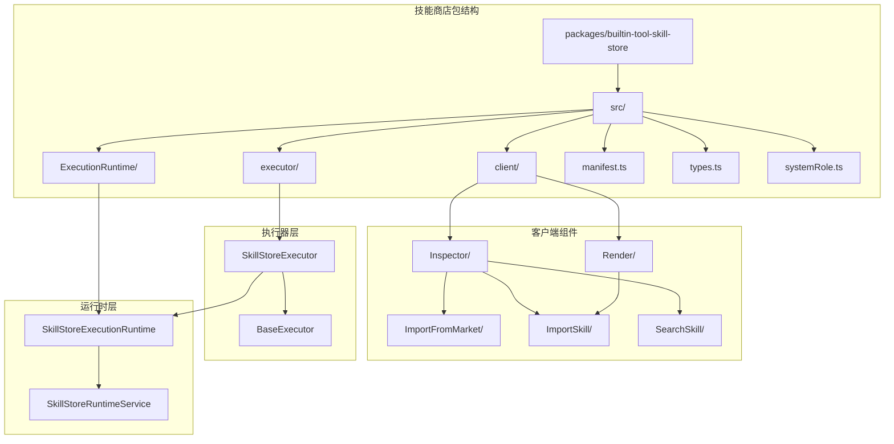
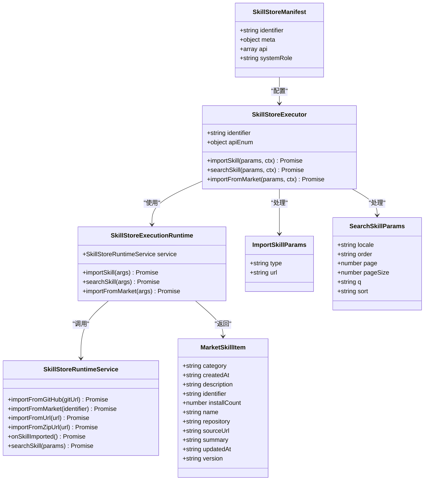
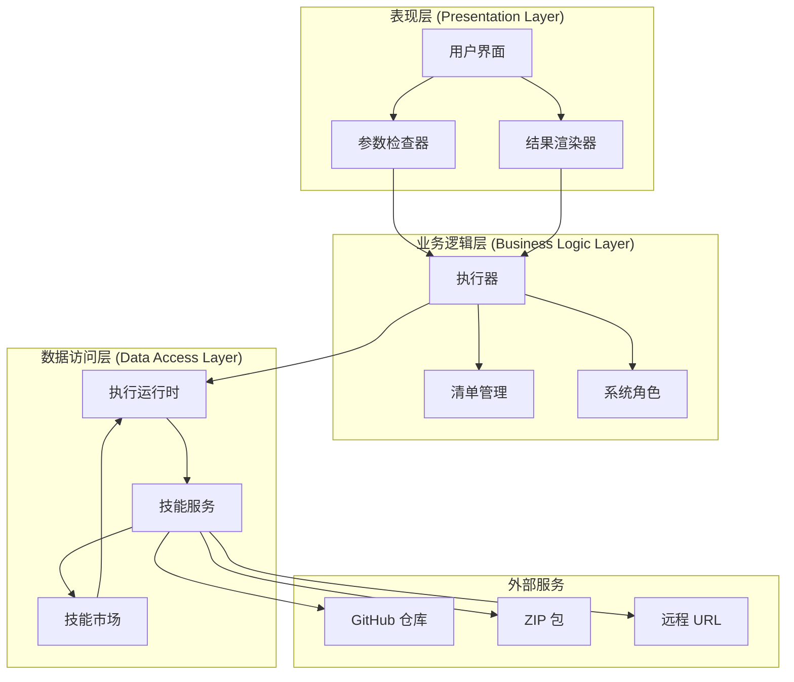
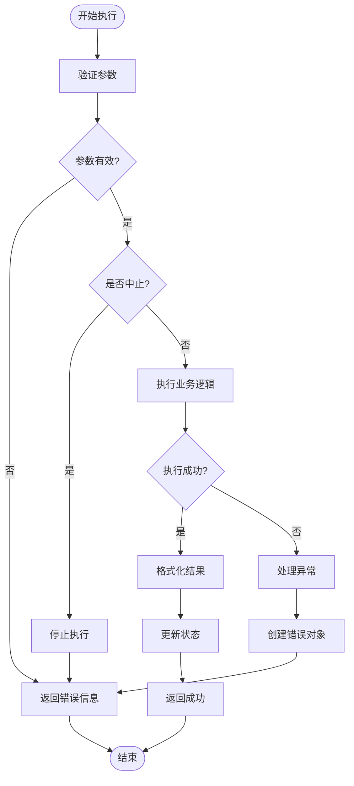
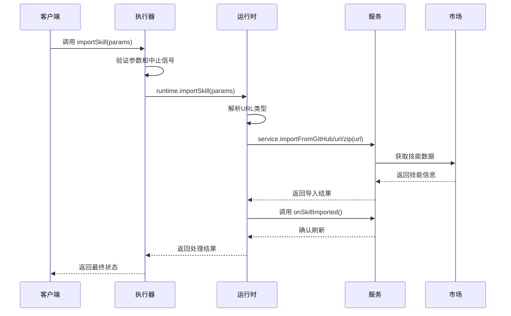
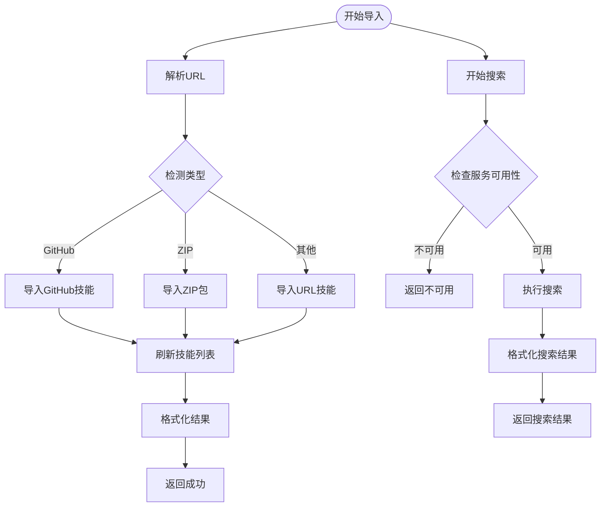
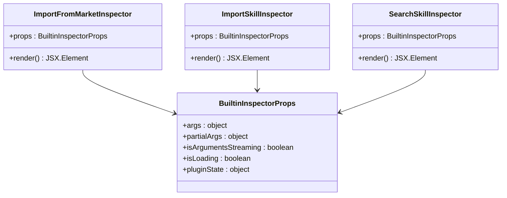
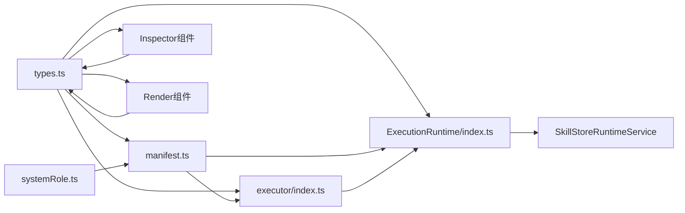

# 动态技能市场加载系统

<cite>
**本文档引用的文件**
- [package.json](file://packages/builtin-tool-skill-store/package.json)
- [index.ts](file://packages/builtin-tool-skill-store/src/index.ts)
- [types.ts](file://packages/builtin-tool-skill-store/src/types.ts)
- [manifest.ts](file://packages/builtin-tool-skill-store/src/manifest.ts)
- [systemRole.ts](file://packages/builtin-tool-skill-store/src/systemRole.ts)
- [client/index.ts](file://packages/builtin-tool-skill-store/src/client/index.ts)
- [executor/index.ts](file://packages/builtin-tool-skill-store/src/executor/index.ts)
- [ExecutionRuntime/index.ts](file://packages/builtin-tool-skill-store/src/ExecutionRuntime/index.ts)
- [client/Inspector/ImportFromMarket/index.tsx](file://packages/builtin-tool-skill-store/src/client/Inspector/ImportFromMarket/index.tsx)
- [client/Inspector/ImportSkill/index.tsx](file://packages/builtin-tool-skill-store/src/client/Inspector/ImportSkill/index.tsx)
- [client/Inspector/SearchSkill/index.tsx](file://packages/builtin-tool-skill-store/src/client/Inspector/SearchSkill/index.tsx)
- [client/Render/ImportSkill/index.tsx](file://packages/builtin-tool-skill-store/src/client/Render/ImportSkill/index.tsx)
</cite>

## 目录

1. [简介](#简介)
2. [项目结构](#项目结构)
3. [核心组件](#核心组件)
4. [架构概览](#架构概览)
5. [详细组件分析](#详细组件分析)
6. [依赖关系分析](#依赖关系分析)
7. [性能考虑](#性能考虑)
8. [故障排除指南](#故障排除指南)
9. [结论](#结论)

## 简介

动态技能市场加载系统是一个基于 LobeChat 生态系统的插件化技能管理框架。该系统允许用户通过多种方式搜索、发现和安装 AI 技能，包括从 LobeHub 市场直接导入、从 URL 导入以及从 ZIP 包导入。系统采用模块化设计，支持动态加载和执行各种类型的技能，为 AI 助手提供丰富的功能扩展能力。

该系统的核心价值在于简化了技能的获取和安装流程，用户无需手动下载和配置复杂的技能包，只需通过简单的 API 调用即可完成整个过程。同时，系统提供了完整的错误处理机制和状态反馈，确保用户能够清晰地了解技能操作的状态和结果。

## 项目结构

动态技能市场加载系统采用清晰的模块化组织结构，主要分为以下几个核心层次：



**图表来源**

- [package.json:1-22](file://packages/builtin-tool-skill-store/package.json#L1-L22)
- [index.ts:1-14](file://packages/builtin-tool-skill-store/src/index.ts#L1-L14)

系统的主要特点包括：

- **分层架构设计**：清晰分离了客户端展示层、执行器层和运行时层
- **模块化组件**：每个功能模块都有独立的文件和职责边界
- **类型安全**：使用 TypeScript 提供完整的类型定义和验证
- **可扩展性**：支持新的技能导入方式和服务提供商

**章节来源**

- [package.json:1-22](file://packages/builtin-tool-skill-store/package.json#L1-L22)
- [index.ts:1-14](file://packages/builtin-tool-skill-store/src/index.ts#L1-L14)

## 核心组件

系统包含多个核心组件，每个组件都有明确的职责和接口定义：

### 主要组件概述

| 组件名称                   | 职责             | 关键特性                              |
| -------------------------- | ---------------- | ------------------------------------- |
| SkillStoreManifest         | 技能商店清单定义 | 定义可用的 API 接口、元数据和系统角色 |
| SkillStoreExecutor         | 执行器类         | 处理 API 调用和错误管理               |
| SkillStoreExecutionRuntime | 运行时环境       | 实际执行技能导入和搜索逻辑            |
| Inspector 组件             | 参数检查器       | 在 UI 中显示参数和状态信息            |
| Render 组件                | 结果渲染器       | 渲染技能操作的结果和状态              |

### 类型系统架构



**图表来源**

- [manifest.ts:6-104](file://packages/builtin-tool-skill-store/src/manifest.ts#L6-L104)
- [executor/index.ts:12-112](file://packages/builtin-tool-skill-store/src/executor/index.ts#L12-L112)
- [ExecutionRuntime/index.ts:30-157](file://packages/builtin-tool-skill-store/src/ExecutionRuntime/index.ts#L30-L157)
- [types.ts:9-90](file://packages/builtin-tool-skill-store/src/types.ts#L9-L90)

**章节来源**

- [types.ts:1-90](file://packages/builtin-tool-skill-store/src/types.ts#L1-L90)
- [manifest.ts:1-104](file://packages/builtin-tool-skill-store/src/manifest.ts#L1-L104)

## 架构概览

系统采用三层架构设计，每层都有明确的职责分工：



**图表来源**

- [client/index.ts:1-5](file://packages/builtin-tool-skill-store/src/client/index.ts#L1-L5)
- [executor/index.ts:12-112](file://packages/builtin-tool-skill-store/src/executor/index.ts#L12-L112)
- [ExecutionRuntime/index.ts:30-157](file://packages/builtin-tool-skill-store/src/ExecutionRuntime/index.ts#L30-L157)

### 数据流处理

系统的数据流遵循以下模式：

1. **用户输入** → **参数验证** → **API 调用**
2. **执行器处理** → **运行时执行** → **服务调用**
3. **结果收集** → **状态更新** → **UI 反馈**

### 错误处理机制



**图表来源**

- [executor/index.ts:23-108](file://packages/builtin-tool-skill-store/src/executor/index.ts#L23-L108)
- [ExecutionRuntime/index.ts:37-79](file://packages/builtin-tool-skill-store/src/ExecutionRuntime/index.ts#L37-L79)

**章节来源**

- [executor/index.ts:1-112](file://packages/builtin-tool-skill-store/src/executor/index.ts#L1-L112)
- [ExecutionRuntime/index.ts:1-157](file://packages/builtin-tool-skill-store/src/ExecutionRuntime/index.ts#L1-L157)

## 详细组件分析

### 执行器组件分析

执行器是系统的核心协调者，负责处理所有 API 调用并管理错误状态：



**图表来源**

- [executor/index.ts:23-50](file://packages/builtin-tool-skill-store/src/executor/index.ts#L23-L50)
- [ExecutionRuntime/index.ts:37-79](file://packages/builtin-tool-skill-store/src/ExecutionRuntime/index.ts#L37-L79)

#### 执行器方法详解

执行器实现了三个核心方法，每个方法都遵循相同的错误处理模式：

**importSkill 方法**

- 支持三种导入方式：GitHub URL、ZIP 包 URL、通用 URL
- 自动检测 GitHub URL 并使用专门的导入逻辑
- 提供统一的错误处理和状态反馈

**searchSkill 方法**

- 支持多字段搜索：名称、描述、摘要
- 支持多种排序方式和分页
- 返回格式化的技能列表

**importFromMarket 方法**

- 从 LobeHub 市场直接导入技能
- 需要用户确认才能执行
- 提供最佳实践建议

**章节来源**

- [executor/index.ts:12-112](file://packages/builtin-tool-skill-store/src/executor/index.ts#L12-L112)

### 运行时组件分析

运行时组件负责实际的技能导入和搜索逻辑执行：



**图表来源**

- [ExecutionRuntime/index.ts:37-121](file://packages/builtin-tool-skill-store/src/ExecutionRuntime/index.ts#L37-L121)

#### 运行时服务接口

运行时通过服务接口与外部系统交互：

**SkillStoreRuntimeService 接口**

- `importFromGitHub`: 从 GitHub 仓库导入技能
- `importFromMarket`: 从市场导入技能（可选）
- `importFromUrl`: 从通用 URL 导入技能
- `importFromZipUrl`: 从 ZIP 包导入技能
- `onSkillImported`: 技能导入后的回调处理
- `searchSkill`: 搜索市场中的技能（可选）

**章节来源**

- [ExecutionRuntime/index.ts:15-28](file://packages/builtin-tool-skill-store/src/ExecutionRuntime/index.ts#L15-L28)

### 客户端组件分析

客户端组件负责用户界面的展示和交互：

#### 参数检查器组件



**图表来源**

- [client/Inspector/ImportFromMarket/index.tsx:20-60](file://packages/builtin-tool-skill-store/src/client/Inspector/ImportFromMarket/index.tsx#L20-L60)
- [client/Inspector/ImportSkill/index.tsx:20-60](file://packages/builtin-tool-skill-store/src/client/Inspector/ImportSkill/index.tsx#L20-L60)
- [client/Inspector/SearchSkill/index.tsx:13-62](file://packages/builtin-tool-skill-store/src/client/Inspector/SearchSkill/index.tsx#L13-L62)

#### 结果渲染器组件

渲染器组件负责将执行结果以友好的方式展示给用户：

**ImportSkill Render 组件**

- 显示导入状态：成功、失败、已更新、已存在
- 使用图标和颜色编码提供视觉反馈
- 格式化显示技能名称和状态信息

**章节来源**

- [client/Inspector/ImportFromMarket/index.tsx:1-60](file://packages/builtin-tool-skill-store/src/client/Inspector/ImportFromMarket/index.tsx#L1-L60)
- [client/Inspector/ImportSkill/index.tsx:1-60](file://packages/builtin-tool-skill-store/src/client/Inspector/ImportSkill/index.tsx#L1-L60)
- [client/Inspector/SearchSkill/index.tsx:1-62](file://packages/builtin-tool-skill-store/src/client/Inspector/SearchSkill/index.tsx#L1-L62)
- [client/Render/ImportSkill/index.tsx:1-69](file://packages/builtin-tool-skill-store/src/client/Render/ImportSkill/index.tsx#L1-L69)

## 依赖关系分析

系统具有清晰的依赖关系结构，确保了模块间的松耦合和高内聚：

```mermaid
graph TB
subgraph "核心依赖"
Types[@lobechat/types]
React[react]
AntdStyle[antd-style]
LobeUI[@lobehub/ui]
Lucide[Lucide React]
end
subgraph "技能商店包"
Package[Skill Store Package]
Index[index.ts]
TypesFile[types.ts]
Manifest[manifest.ts]
SystemRole[systemRole.ts]
end
subgraph "客户端组件"
Client[client/]
Inspector[Inspector/]
Render[Render/]
ImportFromMarket[ImportFromMarket/]
ImportSkill[ImportSkill/]
SearchSkill[SearchSkill/]
end
subgraph "执行器层"
Executor[executor/]
ExecIndex[executor/index.ts]
end
subgraph "运行时层"
Runtime[ExecutionRuntime/]
RuntimeIndex[ExecutionRuntime/index.ts]
end
Package --> Types
Package --> React
Package --> AntdStyle
Package --> LobeUI
Package --> Lucide
Package --> Index
Package --> TypesFile
Package --> Manifest
Package --> SystemRole
Index --> Client
Index --> Executor
Index --> Runtime
Client --> Inspector
Client --> Render
Inspector --> ImportFromMarket
Inspector --> ImportSkill
Inspector --> SearchSkill
Render --> ImportSkill
Executor --> ExecIndex
Runtime --> RuntimeIndex
```

**图表来源**

- [package.json:12-21](file://packages/builtin-tool-skill-store/package.json#L12-L21)
- [index.ts:1-14](file://packages/builtin-tool-skill-store/src/index.ts#L1-L14)

### 外部依赖分析

系统对外部依赖的使用体现了以下原则：

**必需依赖**

- `@lobechat/types`: 提供类型定义和基础接口
- `react`: 用户界面框架
- `@lobehub/ui`: UI 组件库

**可选依赖**

- `antd-style`: 样式解决方案
- `react-i18next`: 国际化支持

**开发依赖**

- `@lobechat/types`: 类型定义（工作空间共享）

### 内部模块依赖



**图表来源**

- [types.ts:1-14](file://packages/builtin-tool-skill-store/src/types.ts#L1-L14)
- [manifest.ts:3-4](file://packages/builtin-tool-skill-store/src/manifest.ts#L3-L4)
- [systemRole.ts:1](file://packages/builtin-tool-skill-store/src/systemRole.ts#L1)

**章节来源**

- [package.json:1-22](file://packages/builtin-tool-skill-store/package.json#L1-L22)
- [client/index.ts:1-5](file://packages/builtin-tool-skill-store/src/client/index.ts#L1-L5)

## 性能考虑

系统在设计时充分考虑了性能优化和用户体验：

### 异步处理优化

- **并发执行**: 支持多个技能导入任务的并发处理
- **进度反馈**: 实时显示导入进度和状态变化
- **资源管理**: 合理管理内存和网络资源使用

### 缓存策略

- **结果缓存**: 对搜索结果进行短期缓存
- **状态持久化**: 保持导入状态的一致性
- **网络优化**: 减少重复的网络请求

### 错误恢复机制

- **自动重试**: 对临时性错误提供重试机制
- **降级处理**: 在服务不可用时提供降级方案
- **状态回滚**: 支持部分成功的操作回滚

## 故障排除指南

### 常见问题及解决方案

**技能导入失败**

- 检查 URL 格式是否正确
- 验证网络连接和权限设置
- 确认目标服务器可访问性

**搜索无结果**

- 尝试不同的搜索关键词
- 检查搜索参数的有效性
- 确认市场服务的可用性

**执行器异常**

- 查看控制台错误日志
- 验证参数类型和格式
- 检查服务接口的实现

### 调试技巧

**参数验证**

- 使用 Inspector 组件查看参数状态
- 监控执行器的输入输出
- 利用浏览器开发者工具调试

**状态跟踪**

- 观察插件状态的变化
- 记录错误发生的时间点
- 分析异常堆栈信息

**章节来源**

- [executor/index.ts:43-49](file://packages/builtin-tool-skill-store/src/executor/index.ts#L43-L49)
- [ExecutionRuntime/index.ts:73-78](file://packages/builtin-tool-skill-store/src/ExecutionRuntime/index.ts#L73-L78)

## 结论

动态技能市场加载系统是一个设计精良的插件化技能管理框架，具有以下显著优势：

**架构优势**

- 清晰的分层设计确保了良好的可维护性
- 模块化组件提供了高度的可扩展性
- 类型安全的实现减少了运行时错误

**功能特性**

- 支持多种技能导入方式，满足不同场景需求
- 完整的错误处理和状态反馈机制
- 用户友好的界面设计和交互体验

**技术亮点**

- 基于 TypeScript 的强类型系统
- 响应式的用户界面组件
- 灵活的服务接口设计

该系统为 AI 助手生态系统提供了强大的技能扩展能力，通过简化的操作流程和完善的错误处理机制，大大降低了技能使用的门槛，为用户提供了更加丰富和个性化的 AI 助手体验。
