# 技能市场系统

<cite>
**本文档引用的文件**
- [README.md](file://README.md)
- [package.json](file://package.json)
- [pnpm-workspace.yaml](file://pnpm-workspace.yaml)
- [builtin-tool-skill-store 包配置](file://packages/builtin-tool-skill-store/package.json)
- [技能商店执行器](file://packages/builtin-tool-skill-store/src/executor/index.ts)
- [技能商店客户端导出](file://packages/builtin-tool-skill-store/src/client/index.ts)
- [技能商店索引导出](file://packages/builtin-tool-skill-store/src/index.ts)
- [内置工具状态初始化](file://src/store/tool/slices/builtin/initialState.ts)
- [内置工具选择器](file://src/store/tool/slices/builtin/selectors.ts)
- [内置工具选择器测试](file://src/store/tool/slices/builtin/selectors.test.ts)
- [AgentSkillItem 插件行组件](file://src/features/SkillStore/SkillList/AgentSkillItem.tsx)
- [技能详情内核组件](file://src/features/SkillStore/SkillDetail/SkillDetailInner.tsx)
- [技能详情头部组件](file://src/features/SkillStore/SkillDetail/Header.tsx)
- [技能详情导航组件](file://src/features/SkillStore/SkillDetail/Nav.tsx)
- [技能详情概览组件](file://src/features/SkillStore/SkillDetail/Overview.tsx)
- [内置技能详情内容](file://src/features/SkillStore/SkillDetail/BuiltinSkillDetailContent.tsx)
- [LobeHub 技能详情内容](file://src/features/SkillStore/SkillDetail/LobehubSkillDetailContent.tsx)
- [Klavis 技能详情内容](file://src/features/SkillStore/SkillDetail/KlavisSkillDetailContent.tsx)
- [技能列表样式](file://src/features/SkillStore/SkillList/style.ts)
- [技能渲染器索引](file://packages/builtin-tool-skill-store/src/client/Render/index.ts)
- [技能搜索渲染器](file://packages/builtin-tool-skill-store/src/client/Render/SearchSkill/index.tsx)
- [内置工具注册表测试](file://src/store/tool/builtinToolRegistry.test.ts)
- [内置工具动作](file://src/store/tool/slices/builtin/action.ts)
- [技能商店服务器运行时](file://src/server/services/toolExecution/serverRuntimes/skillStore.ts)
- [市场技能 API](file://apps/mobile/src/lib/api.ts)
- [移动应用商店屏幕](file://apps/mobile/src/screens/StoreScreen.tsx)
- [Lobe 技能商店执行器](file://src/store/tool/slices/builtin/executors/lobe-skill-store.ts)
- [内置工具标识符](file://src/store/tool/builtinToolRegistry.test.ts)
- [内置推荐技能常量](file://apps/mobile/src/constants/recommendedBuiltins.ts)
- [内置技能图标组件](file://apps/mobile/src/components/ui/BuiltinSkillIcon.tsx)
</cite>

## 更新摘要

**所做更改**

- 新增内置工具系统替代传统技能市场的章节
- 更新技能商店集成架构以反映新的内置工具管理
- 增强内置工具状态管理和安装卸载流程
- 添加移动端内置技能推荐系统
- 更新服务器端技能商店运行时集成

## 目录

1. [简介](#简介)
2. [项目结构](#项目结构)
3. [核心组件](#核心组件)
4. [架构概览](#架构概览)
5. [详细组件分析](#详细组件分析)
6. [内置工具系统](#内置工具系统)
7. [技能商店集成](#技能商店集成)
8. [移动端内置技能支持](#移动端内置技能支持)
9. [服务器端集成](#服务器端集成)
10. [依赖关系分析](#依赖关系分析)
11. [性能考虑](#性能考虑)
12. [故障排除指南](#故障排除指南)
13. [结论](#结论)

## 简介

技能市场系统是 LobeHub 生态系统中的核心组件，负责管理和分发 AI 助手技能（Skills）。该系统提供了一个完整的技能生命周期管理框架，包括技能发现、安装、配置和执行。

**重要更新**：系统现已完全迁移到内置工具系统，替代了传统的技能市场模式。内置工具通过统一的标识符系统和状态管理，为用户提供了更高效、更可靠的技能管理体验。

LobeHub 是一个开源的综合性 AI Agent 框架，支持语音合成、多模态交互和可扩展的功能调用插件系统。该项目采用现代化的技术栈，包括 Next.js、React 19、TypeScript 和 Zustand 状态管理。

## 项目结构

项目采用 monorepo 结构，主要包含以下核心部分：

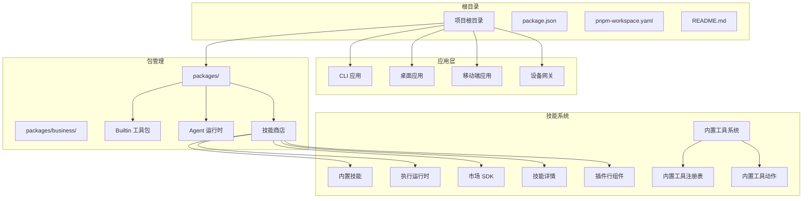

**图表来源**

- [package.json:1-517](file://package.json#L1-L517)
- [pnpm-workspace.yaml:1-23](file://pnpm-workspace.yaml#L1-L23)

**章节来源**

- [README.md:1-969](file://README.md#L1-L969)
- [package.json:1-517](file://package.json#L1-L517)
- [pnpm-workspace.yaml:1-23](file://pnpm-workspace.yaml#L1-L23)

## 核心组件

技能市场系统由多个相互协作的核心组件构成：

### 技能商店执行器

技能商店执行器是系统的核心执行组件，负责处理技能相关的操作请求。它继承自基础执行器类，提供了三个主要方法：

- `importSkill`: 导入单个技能
- `searchSkill`: 搜索技能
- `importFromMarket`: 从市场批量导入技能

### 内置工具管理

**更新** 系统现已完全迁移到内置工具系统，提供更高效的技能管理：

- 内置工具通过统一标识符系统管理
- 支持安装和卸载状态跟踪
- 集成推荐内置技能系统
- 优化的性能和用户体验

### 市场集成

系统与 LobeHub 市场平台深度集成，支持技能的发现、下载和版本管理。

### 技能详情系统

新增了完整的技能详情展示系统，支持多种技能类型的详细信息展示：

- 内置技能详情
- LobeHub 市场技能详情
- Klavis MCP 技能详情
- 多标签页导航（概览、工具、代理）

### 插件行组件增强

插件行组件现在提供更丰富的交互体验：

- 点击标题打开技能详情弹窗
- 支持技能编辑功能
- 增强的操作菜单（下载、卸载、编辑）
- 智能图标识别和显示

**章节来源**

- [技能商店执行器：1-112](file://packages/builtin-tool-skill-store/src/executor/index.ts#L1-L112)
- [内置工具状态初始化：1-28](file://src/store/tool/slices/builtin/initialState.ts#L1-L28)
- [AgentSkillItem 插件行组件：1-162](file://src/features/SkillStore/SkillList/AgentSkillItem.tsx#L1-L162)
- [技能详情内核组件：1-55](file://src/features/SkillStore/SkillDetail/SkillDetailInner.tsx#L1-L55)

## 架构概览

技能市场系统采用分层架构设计，确保了良好的可维护性和扩展性：

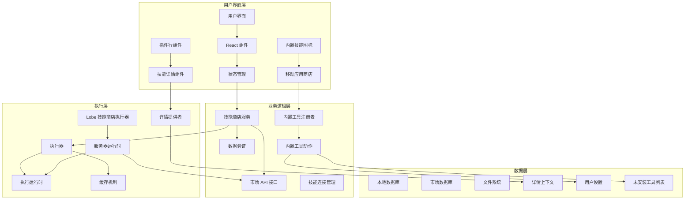

**图表来源**

- [技能商店执行器：12-112](file://packages/builtin-tool-skill-store/src/executor/index.ts#L12-L112)
- [内置工具状态初始化：22-28](file://src/store/tool/slices/builtin/initialState.ts#L22-L28)
- [技能详情内核组件：24-52](file://src/features/SkillStore/SkillDetail/SkillDetailInner.tsx#L24-L52)
- [内置工具注册表测试：7-16](file://src/store/tool/builtinToolRegistry.test.ts#L7-L16)

## 详细组件分析

### 技能商店执行器架构

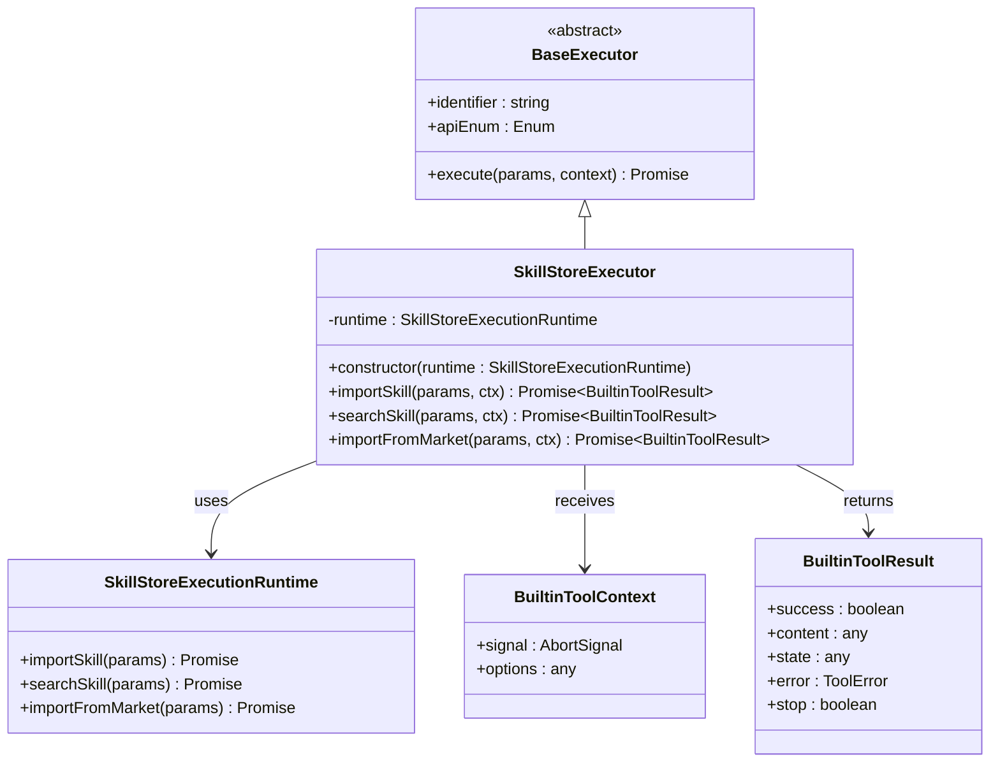

**图表来源**

- [技能商店执行器：12-112](file://packages/builtin-tool-skill-store/src/executor/index.ts#L12-L112)

### 技能生命周期管理

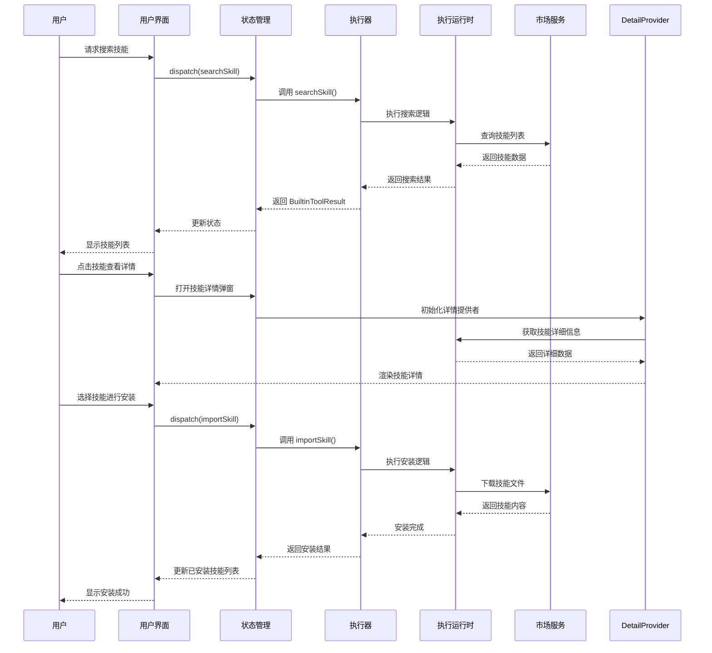

**图表来源**

- [技能商店执行器：23-108](file://packages/builtin-tool-skill-store/src/executor/index.ts#L23-L108)

### 内置工具状态管理系统

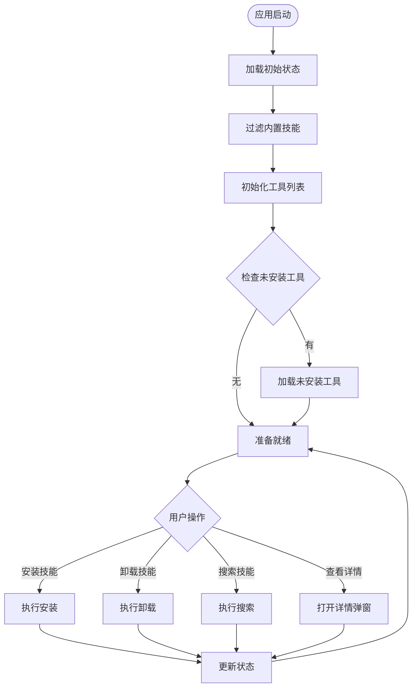

**图表来源**

- [内置工具状态初始化：22-28](file://src/store/tool/slices/builtin/initialState.ts#L22-L28)
- [内置工具选择器：178-185](file://src/store/tool/slices/builtin/selectors.ts#L178-L185)

**章节来源**

- [技能商店执行器：1-112](file://packages/builtin-tool-skill-store/src/executor/index.ts#L1-L112)
- [内置工具状态初始化：1-28](file://src/store/tool/slices/builtin/initialState.ts#L1-L28)
- [内置工具选择器：125-185](file://src/store/tool/slices/builtin/selectors.ts#L125-L185)

## 内置工具系统

**新增** 内置工具系统是新架构的核心组件，提供更高效、更可靠的技能管理：

### 内置工具注册表

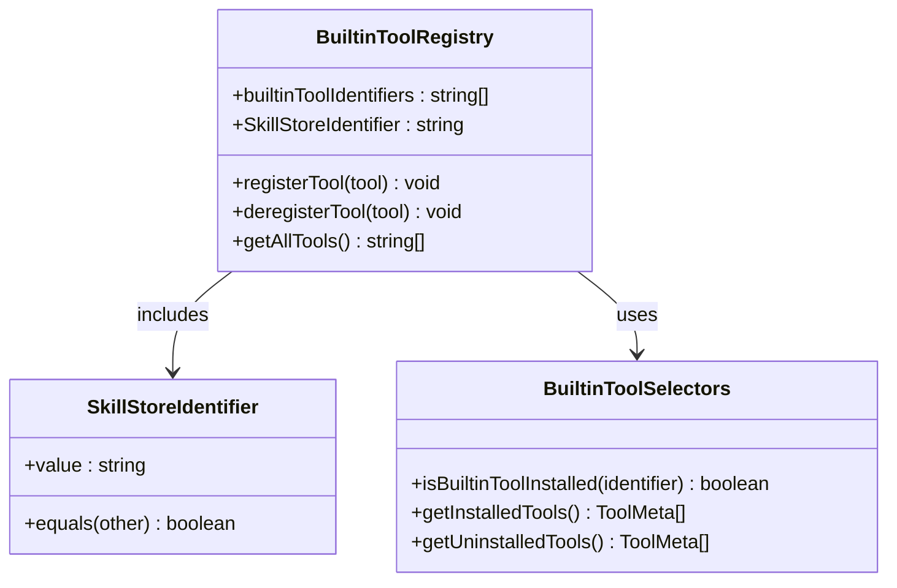

**图表来源**

- [内置工具注册表测试：7-16](file://src/store/tool/builtinToolRegistry.test.ts#L7-L16)

### 内置工具安装管理

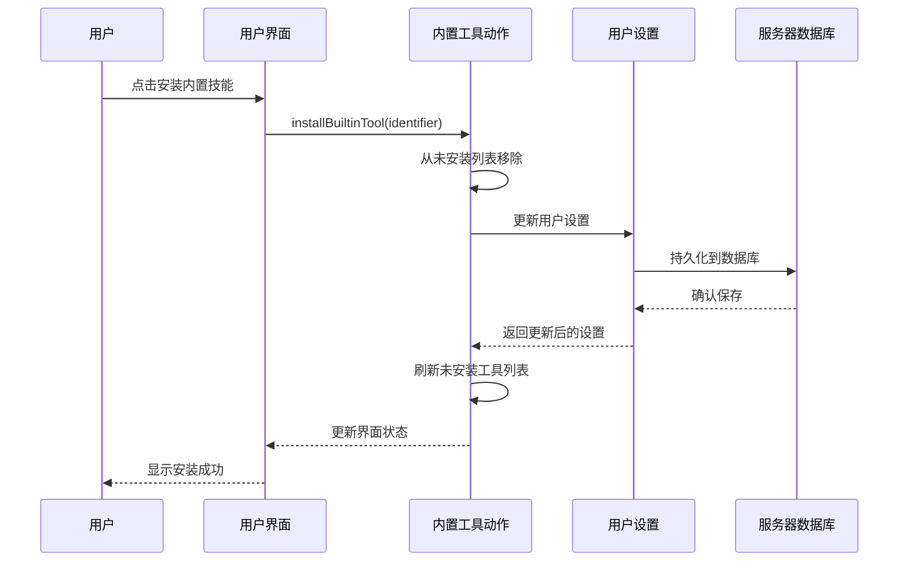

**图表来源**

- [内置工具动作：105-122](file://src/store/tool/slices/builtin/action.ts#L105-L122)

### 内置工具卸载管理

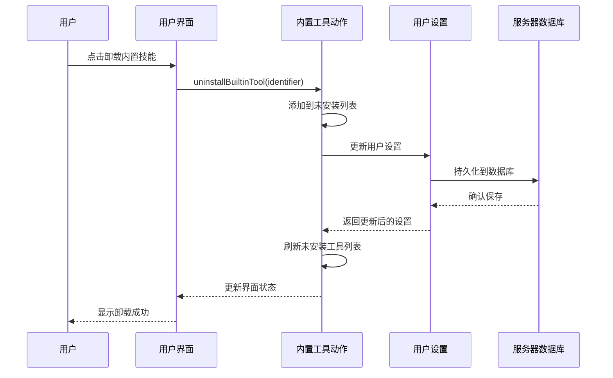

**图表来源**

- [内置工具动作：127-144](file://src/store/tool/slices/builtin/action.ts#L127-L144)

**章节来源**

- [内置工具注册表测试：1-17](file://src/store/tool/builtinToolRegistry.test.ts#L1-L17)
- [内置工具动作：100-178](file://src/store/tool/slices/builtin/action.ts#L100-L178)

## 技能商店集成

**更新** 新的技能商店集成提供了更灵活的技能管理方式：

### Lobe 技能商店执行器

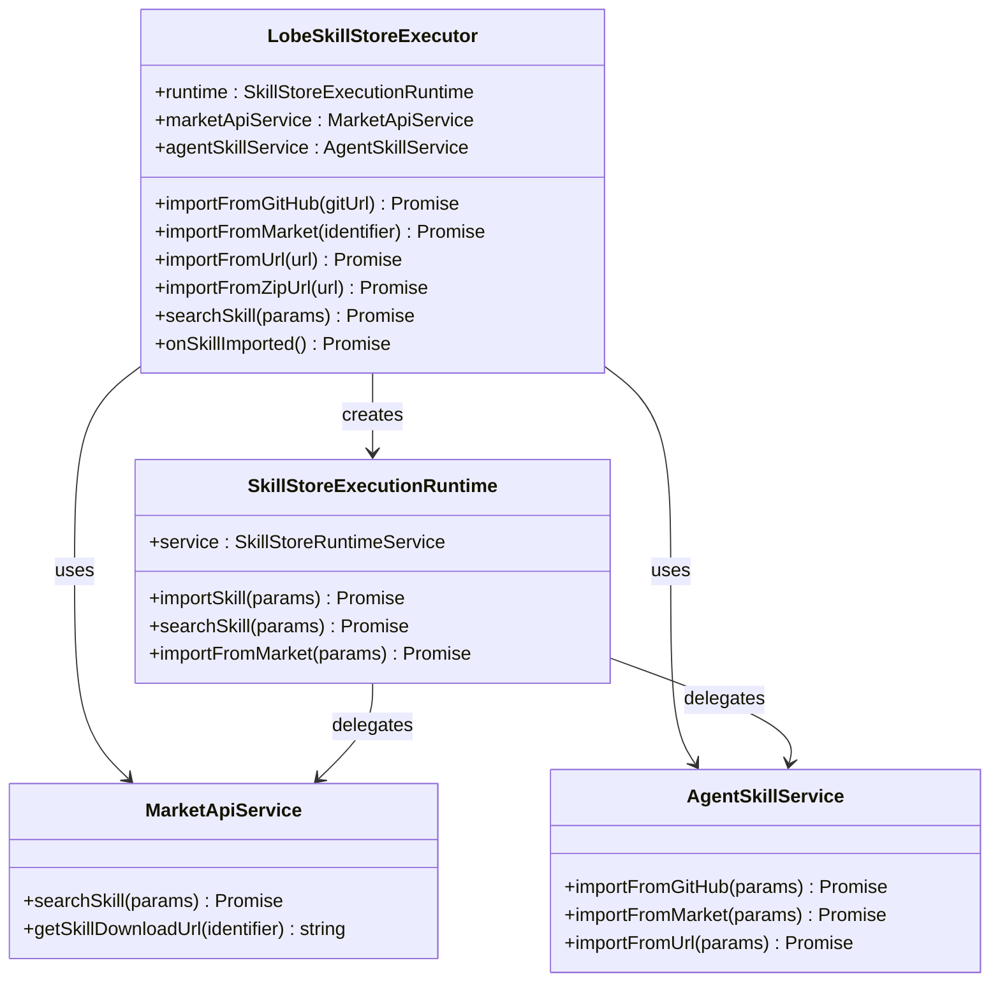

**图表来源**

- [Lobe 技能商店执行器：14-59](file://src/store/tool/slices/builtin/executors/lobe-skill-store.ts#L14-L59)

### 技能商店服务器运行时

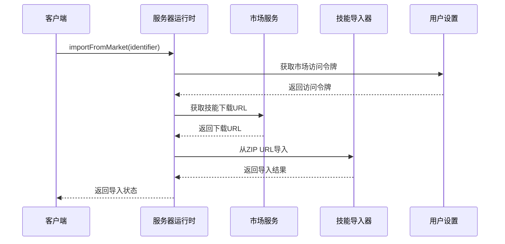

**图表来源**

- [技能商店服务器运行时：66-80](file://src/server/services/toolExecution/serverRuntimes/skillStore.ts#L66-L80)

**章节来源**

- [Lobe 技能商店执行器：1-60](file://src/store/tool/slices/builtin/executors/lobe-skill-store.ts#L1-L60)
- [技能商店服务器运行时：87-125](file://src/server/services/toolExecution/serverRuntimes/skillStore.ts#L87-L125)

## 移动端内置技能支持

**新增** 移动端应用现在完全支持内置技能系统：

### 移动端内置技能推荐

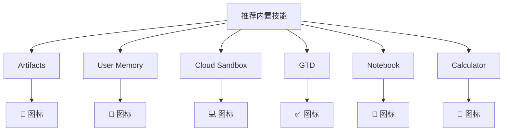

**推荐技能特性**：

- 预安装的内置技能列表
- 响应式图标系统
- 本地化标题和描述
- 类型区分（内置代理 vs 内置工具）

### 移动端商店集成

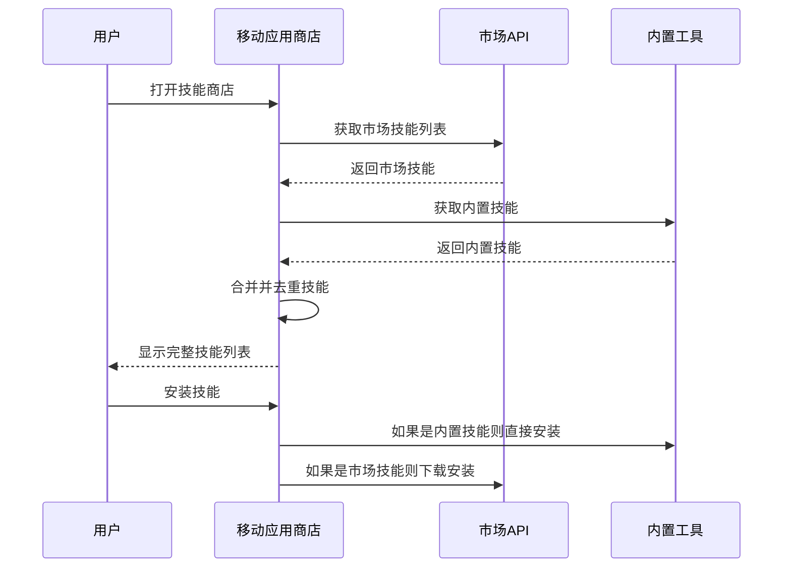

**图表来源**

- [移动端内置技能推荐：17-60](file://apps/mobile/src/constants/recommendedBuiltins.ts#L17-L60)
- [移动应用商店屏幕：1696-1737](file://apps/mobile/src/screens/StoreScreen.tsx#L1696-L1737)

**章节来源**

- [内置推荐技能常量：1-64](file://apps/mobile/src/constants/recommendedBuiltins.ts#L1-L64)
- [内置技能图标组件：1-41](file://apps/mobile/src/components/ui/BuiltinSkillIcon.tsx#L1-L41)
- [移动应用商店屏幕：1696-1737](file://apps/mobile/src/screens/StoreScreen.tsx#L1696-L1737)

## 服务器端集成

**更新** 服务器端现在支持完整的技能商店运行时：

### 服务器运行时注册

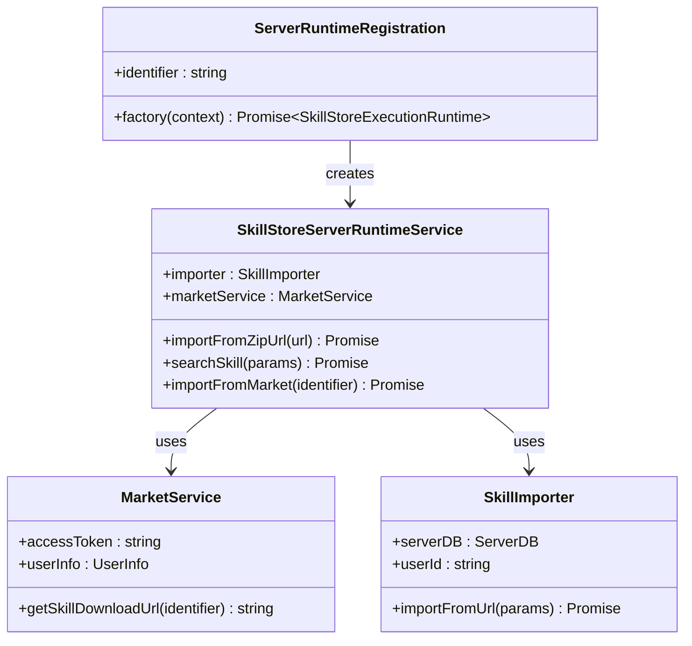

**图表来源**

- [技能商店服务器运行时：87-125](file://src/server/services/toolExecution/serverRuntimes/skillStore.ts#L87-L125)

### 市场技能 API 集成

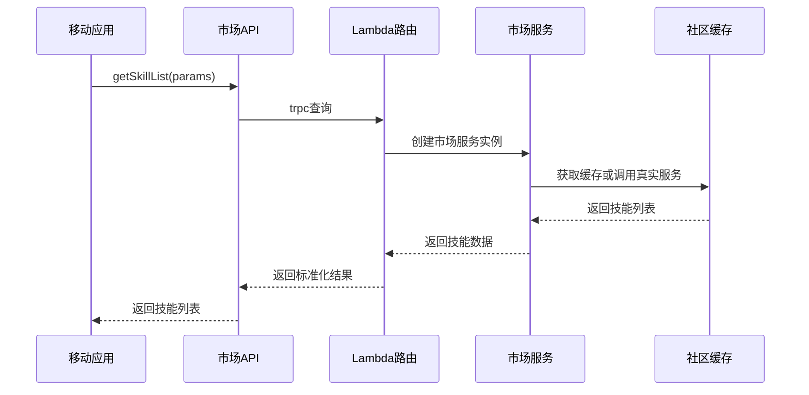

**图表来源**

- [市场技能 API:2370-2389](file://apps/mobile/src/lib/api.ts#L2370-L2389)

**章节来源**

- [技能商店服务器运行时：40-125](file://src/server/services/toolExecution/serverRuntimes/skillStore.ts#L40-L125)
- [市场技能 API:2235-2389](file://apps/mobile/src/lib/api.ts#L2235-L2389)

## 依赖关系分析

技能市场系统在 monorepo 中与其他组件存在紧密的依赖关系：

```mermaid
graph LR
subgraph "技能商店包"
SkillStore[@lobechat/builtin-tool-skill-store]
Client[client 模块]
Executor[executor 模块]
Types[types 模块]
Render[渲染器模块]
ExecutionRuntime[执行运行时模块]
end
subgraph "核心依赖"
Types[@lobechat/types]
UI[@lobehub/ui]
Zustand[zustand]
React[react]
Antd[antd]
Emotion[emotion]
Lucide[lucide-react]
Suspense[suspense]
Lazy[lazy]
Memo[memo]
MarketSDK[@lobehub/market-sdk]
MarketTypes[@lobehub/market-types]
Klavis[klavis]
BuiltinTools[@lobechat/builtin-tools]
BuiltinSkills[@lobechat/builtin-skills]
AgentRuntime[@lobechat/agent-runtime]
Services[@lobechat/services]
end
subgraph "内置工具系统"
BuiltinToolRegistry[内置工具注册表]
BuiltinToolActions[内置工具动作]
BuiltinToolSelectors[内置工具选择器]
MobileRecommended[移动端推荐]
end
subgraph "服务器端"
ServerRuntime[服务器运行时]
MarketService[市场服务]
SkillImporter[技能导入器]
end
SkillStore --> Types
SkillStore --> UI
SkillStore --> Zustand
SkillStore --> React
SkillStore --> Antd
SkillStore --> Emotion
SkillStore --> Lucide
SkillStore --> Suspense
SkillStore --> Lazy
SkillStore --> Memo
SkillStore --> MarketSDK
SkillStore --> MarketTypes
SkillStore --> BuiltinTools
SkillStore --> BuiltinSkills
SkillStore --> AgentRuntime
SkillStore --> Services
Client --> SkillStore
Executor --> SkillStore
Types --> SkillStore
Render --> Client
Render --> UI
Render --> Suspense
Render --> Lazy
Render --> Memo
ExecutionRuntime --> SkillStore
BuiltinToolRegistry --> BuiltinToolActions
BuiltinToolRegistry --> BuiltinToolSelectors
BuiltinToolActions --> UserSettings[用户设置]
BuiltinToolActions --> ServerDB[服务器数据库]
MobileRecommended --> BuiltinToolRegistry
ServerRuntime --> MarketService
ServerRuntime --> SkillImporter
```

**图表来源**

- [builtin-tool-skill-store 包配置：1-22](file://packages/builtin-tool-skill-store/package.json#L1-L22)
- [package.json:158-404](file://package.json#L158-L404)
- [技能渲染器索引：5-9](file://packages/builtin-tool-skill-store/src/client/Render/index.ts#L5-L9)

**章节来源**

- [builtin-tool-skill-store 包配置：1-22](file://packages/builtin-tool-skill-store/package.json#L1-L22)
- [package.json:158-404](file://package.json#L158-L404)
- [技能渲染器索引：1-9](file://packages/builtin-tool-skill-store/src/client/Render/index.ts#L1-L9)

## 性能考虑

技能市场系统在设计时充分考虑了性能优化：

### 缓存策略

- 使用内存缓存存储已安装的技能元数据
- 实现智能的缓存失效机制
- 支持增量更新以减少网络请求

### 异步处理

- 所有技能操作都采用异步模式
- 支持取消操作和错误恢复
- 实现了优雅的降级策略

### 资源管理

- 限制并发技能安装数量
- 实现资源使用监控
- 提供内存使用优化

### 懒加载优化

- **技能详情**：使用 React.lazy 和 Suspense 实现按需加载
- **编辑组件**：仅在需要时加载编辑器组件
- **渲染器**：模块化渲染器支持独立加载
- **内置工具**：预加载推荐内置技能以提升首次体验

### 性能监控

- 组件渲染时间监控
- 内存使用情况跟踪
- 网络请求性能优化

## 故障排除指南

### 常见问题及解决方案

**技能安装失败**

- 检查网络连接和市场服务可用性
- 验证技能兼容性要求
- 查看错误日志获取详细信息

**技能搜索无结果**

- 确认搜索关键词的准确性
- 检查网络代理设置
- 尝试刷新市场缓存

**技能详情加载失败**

- 检查技能标识符的有效性
- 验证技能提供者的连接状态
- 清除浏览器缓存后重试

**插件行组件显示异常**

- 刷新页面缓存
- 检查样式文件加载
- 验证依赖包版本兼容性

**内置工具管理问题**

- 检查用户设置中的未安装工具列表
- 验证服务器数据库连接
- 清理应用缓存后重试

**移动端内置技能显示异常**

- 检查推荐内置技能常量定义
- 验证内置技能图标映射
- 确认移动端商店屏幕的技能合并逻辑

**性能问题**

- 清理浏览器缓存
- 检查系统资源使用情况
- 调整并发操作限制

**章节来源**

- [技能商店执行器：23-108](file://packages/builtin-tool-skill-store/src/executor/index.ts#L23-L108)

## 结论

技能市场系统经过重大升级，现已完全迁移到内置工具系统，为用户提供了更高效、更可靠的技能管理体验。通过模块化的架构设计、完善的错误处理机制和优秀的性能表现，该系统能够满足各种复杂的技能管理需求。

**主要更新亮点**：

- **内置工具系统**：完全替代传统技能市场，提供更高效的技能管理
- **技能商店集成**：保留市场技能支持，同时优化内置工具管理
- **移动端支持**：完整的移动端内置技能推荐和管理
- **服务器端集成**：完整的服务器端技能商店运行时支持
- **性能优化**：懒加载、缓存策略和资源管理的全面优化

系统的主要优势包括：

- 灵活的内置工具生命周期管理
- 高效的缓存和异步处理机制
- 完善的错误处理和恢复能力
- 良好的扩展性和维护性
- 直观的用户界面和交互体验
- 全平台的一致性体验

随着 AI 技术的不断发展，技能市场系统将继续演进，为用户提供更加丰富和强大的技能管理体验。新的内置工具系统和技能商店集成将进一步提升用户的技能访问效率和使用体验。
