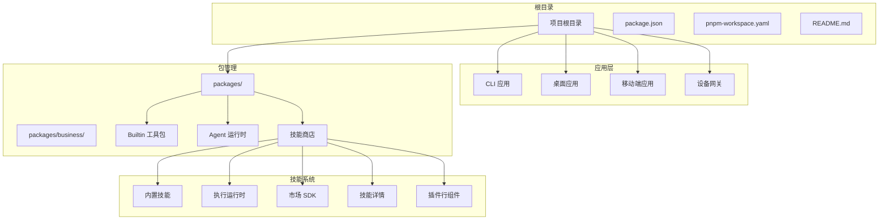
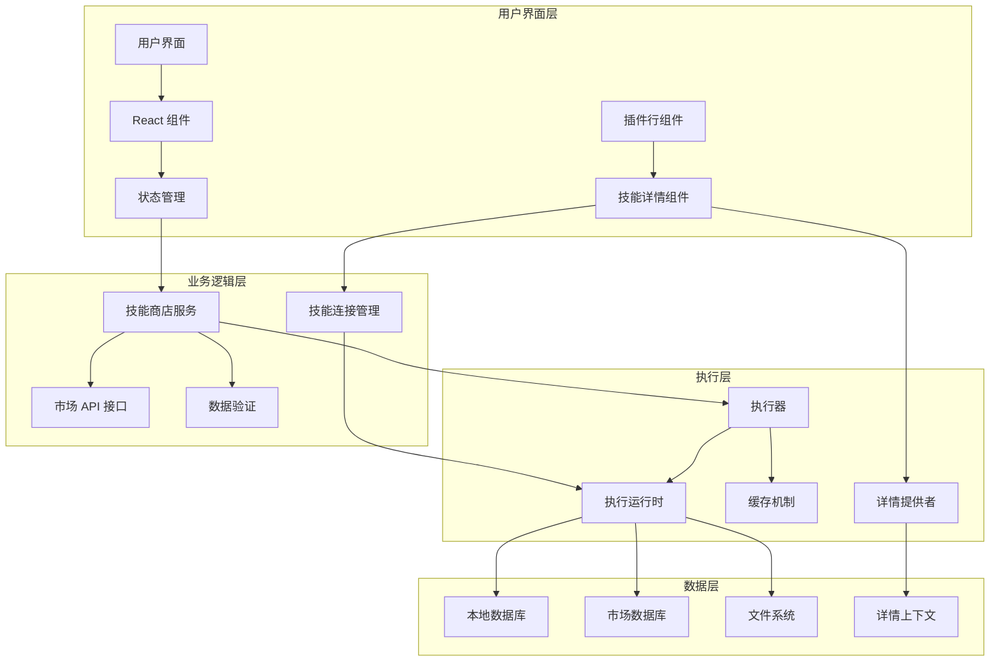
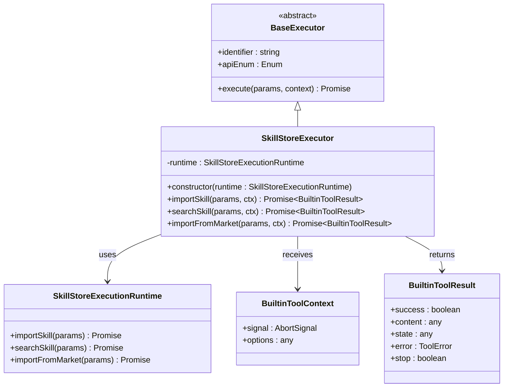
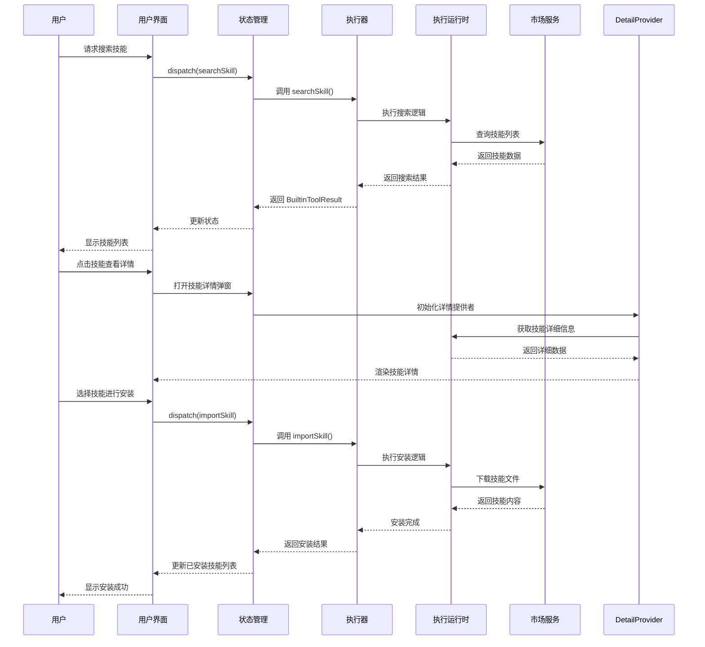
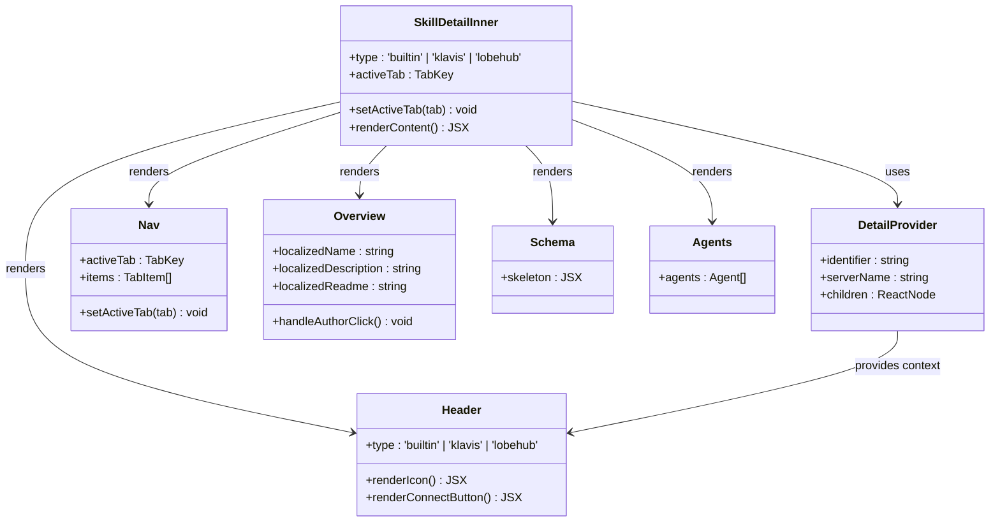
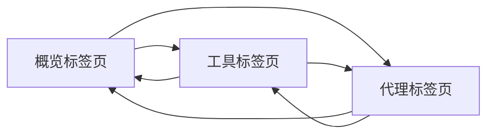
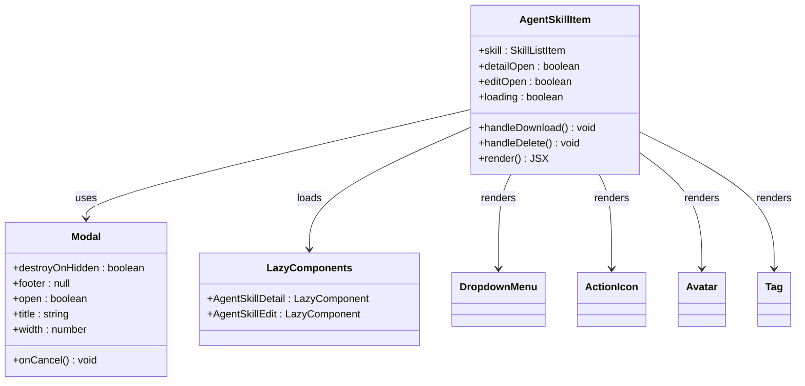
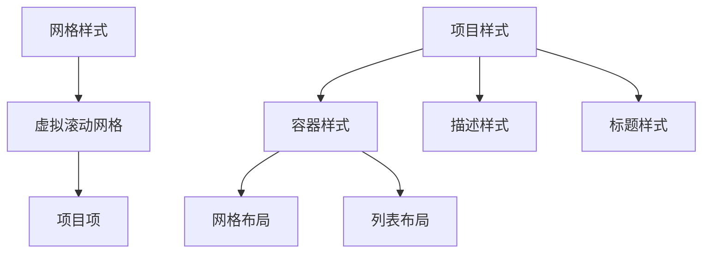

# 技能市场系统

<cite>
**本文档引用的文件**
- [README.md](file://README.md)
- [package.json](file://package.json)
- [pnpm-workspace.yaml](file://pnpm-workspace.yaml)
- [builtin-tool-skill-store 包配置](file://packages/builtin-tool-skill-store/package.json)
- [技能商店执行器](file://packages/builtin-tool-skill-store/src/executor/index.ts)
- [技能商店客户端导出](file://packages/builtin-tool-skill-store/src/client/index.ts)
- [技能商店索引导出](file://packages/builtin-tool-skill-store/src/index.ts)
- [内置工具状态初始化](file://src/store/tool/slices/builtin/initialState.ts)
- [内置工具选择器](file://src/store/tool/slices/builtin/selectors.ts)
- [内置工具选择器测试](file://src/store/tool/slices/builtin/selectors.test.ts)
- [AgentSkillItem 插件行组件](file://src/features/SkillStore/SkillList/AgentSkillItem.tsx)
- [技能详情内核组件](file://src/features/SkillStore/SkillDetail/SkillDetailInner.tsx)
- [技能详情头部组件](file://src/features/SkillStore/SkillDetail/Header.tsx)
- [技能详情导航组件](file://src/features/SkillStore/SkillDetail/Nav.tsx)
- [技能详情概览组件](file://src/features/SkillStore/SkillDetail/Overview.tsx)
- [内置技能详情内容](file://src/features/SkillStore/SkillDetail/BuiltinSkillDetailContent.tsx)
- [LobeHub 技能详情内容](file://src/features/SkillStore/SkillDetail/LobehubSkillDetailContent.tsx)
- [Klavis 技能详情内容](file://src/features/SkillStore/SkillDetail/KlavisSkillDetailContent.tsx)
- [技能列表样式](file://src/features/SkillStore/SkillList/style.ts)
- [技能渲染器索引](file://packages/builtin-tool-skill-store/src/client/Render/index.ts)
- [技能搜索渲染器](file://packages/builtin-tool-skill-store/src/client/Render/SearchSkill/index.tsx)
</cite>

## 更新摘要

**所做更改**

- 新增技能详情功能章节，包含多类型技能详情展示
- 增强插件行组件功能，添加技能详情弹窗和编辑功能
- 更新架构图以反映新的技能详情组件结构
- 添加技能分类和标签系统的说明
- 完善技能连接和安装流程的文档

## 目录

1. [简介](#简介)
2. [项目结构](#项目结构)
3. [核心组件](#核心组件)
4. [架构概览](#架构概览)
5. [详细组件分析](#详细组件分析)
6. [技能详情功能](#技能详情功能)
7. [插件行组件增强](#插件行组件增强)
8. [依赖关系分析](#依赖关系分析)
9. [性能考虑](#性能考虑)
10. [故障排除指南](#故障排除指南)
11. [结论](#结论)

## 简介

技能市场系统是 LobeHub 生态系统中的核心组件，负责管理和分发 AI 助手技能（Skills）。该系统提供了一个完整的技能生命周期管理框架，包括技能发现、安装、配置和执行。

LobeHub 是一个开源的综合性 AI Agent 框架，支持语音合成、多模态交互和可扩展的功能调用插件系统。该项目采用现代化的技术栈，包括 Next.js、React 19、TypeScript 和 Zustand 状态管理。

**更新** 新增了技能详情功能和插件行组件增强，提供更直观的技能访问体验

## 项目结构

项目采用 monorepo 结构，主要包含以下核心部分：



**图表来源**

- [package.json:1-517](file://package.json#L1-L517)
- [pnpm-workspace.yaml:1-23](file://pnpm-workspace.yaml#L1-L23)

**章节来源**

- [README.md:1-969](file://README.md#L1-L969)
- [package.json:1-517](file://package.json#L1-L517)
- [pnpm-workspace.yaml:1-23](file://pnpm-workspace.yaml#L1-L23)

## 核心组件

技能市场系统由多个相互协作的核心组件构成：

### 技能商店执行器

技能商店执行器是系统的核心执行组件，负责处理技能相关的操作请求。它继承自基础执行器类，提供了三个主要方法：

- `importSkill`: 导入单个技能
- `searchSkill`: 搜索技能
- `importFromMarket`: 从市场批量导入技能

### 内置技能管理

系统集成了丰富的内置技能，包括计算器、知识库、网页浏览等实用工具。这些技能通过统一的接口进行管理和调用。

### 市场集成

系统与 LobeHub 市场平台深度集成，支持技能的发现、下载和版本管理。

### 技能详情系统

**新增** 新增了完整的技能详情展示系统，支持多种技能类型的详细信息展示：

- 内置技能详情
- LobeHub 市场技能详情
- Klavis MCP 技能详情
- 多标签页导航（概览、工具、代理）

### 插件行组件增强

**新增** 插件行组件现在提供更丰富的交互体验：

- 点击标题打开技能详情弹窗
- 支持技能编辑功能
- 增强的操作菜单（下载、卸载、编辑）
- 智能图标识别和显示

**章节来源**

- [技能商店执行器：1-112](file://packages/builtin-tool-skill-store/src/executor/index.ts#L1-L112)
- [内置工具状态初始化：1-28](file://src/store/tool/slices/builtin/initialState.ts#L1-L28)
- [AgentSkillItem 插件行组件：1-162](file://src/features/SkillStore/SkillList/AgentSkillItem.tsx#L1-L162)
- [技能详情内核组件：1-55](file://src/features/SkillStore/SkillDetail/SkillDetailInner.tsx#L1-L55)

## 架构概览

技能市场系统采用分层架构设计，确保了良好的可维护性和扩展性：



**图表来源**

- [技能商店执行器：12-112](file://packages/builtin-tool-skill-store/src/executor/index.ts#L12-L112)
- [内置工具状态初始化：22-28](file://src/store/tool/slices/builtin/initialState.ts#L22-L28)
- [技能详情内核组件：24-52](file://src/features/SkillStore/SkillDetail/SkillDetailInner.tsx#L24-L52)

## 详细组件分析

### 技能商店执行器架构



**图表来源**

- [技能商店执行器：12-112](file://packages/builtin-tool-skill-store/src/executor/index.ts#L12-L112)

### 技能生命周期管理



**图表来源**

- [技能商店执行器：23-108](file://packages/builtin-tool-skill-store/src/executor/index.ts#L23-L108)

### 内置工具状态管理系统


**图表来源**

- [内置工具状态初始化：22-28](file://src/store/tool/slices/builtin/initialState.ts#L22-L28)
- [内置工具选择器：178-185](file://src/store/tool/slices/builtin/selectors.ts#L178-L185)

**章节来源**

- [技能商店执行器：1-112](file://packages/builtin-tool-skill-store/src/executor/index.ts#L1-L112)
- [内置工具状态初始化：1-28](file://src/store/tool/slices/builtin/initialState.ts#L1-L28)
- [内置工具选择器：125-185](file://src/store/tool/slices/builtin/selectors.ts#L125-L185)

## 技能详情功能

**新增** 技能详情功能提供了完整的技能信息展示和交互体验：

### 技能详情组件架构



**图表来源**

- [技能详情内核组件：24-52](file://src/features/SkillStore/SkillDetail/SkillDetailInner.tsx#L24-L52)
- [技能详情头部组件：31-144](file://src/features/SkillStore/SkillDetail/Header.tsx#L31-L144)
- [技能详情导航组件：33-71](file://src/features/SkillStore/SkillDetail/Nav.tsx#L33-L71)

### 多类型技能详情支持

系统支持三种类型的技能详情展示：

#### 内置技能详情

- 直接安装到本地
- 无需外部连接
- 显示内置工具信息

#### LobeHub 市场技能详情

- 通过市场 API 获取信息
- 支持技能连接和认证
- 显示市场评分和下载量

#### Klavis MCP 技能详情

- 通过 MCP 协议连接
- 支持动态服务器发现
- 显示服务器状态和工具列表

### 技能详情标签页系统



**标签页功能**：

- **概览**：技能基本信息、描述、作者信息
- **工具**：技能提供的具体工具和 API 详情
- **代理**：使用该技能的代理列表和配置

**章节来源**

- [技能详情内核组件：1-55](file://src/features/SkillStore/SkillDetail/SkillDetailInner.tsx#L1-L55)
- [技能详情头部组件：1-147](file://src/features/SkillStore/SkillDetail/Header.tsx#L1-L147)
- [技能详情导航组件：1-71](file://src/features/SkillStore/SkillDetail/Nav.tsx#L1-L71)
- [技能详情概览组件：1-66](file://src/features/SkillStore/SkillDetail/Overview.tsx#L1-L66)
- [内置技能详情内容：1-17](file://src/features/SkillStore/SkillDetail/BuiltinSkillDetailContent.tsx#L1-L17)
- [LobeHub 技能详情内容：1-17](file://src/features/SkillStore/SkillDetail/LobehubSkillDetailContent.tsx#L1-L17)
- [Klavis 技能详情内容：1-22](file://src/features/SkillStore/SkillDetail/KlavisSkillDetailContent.tsx#L1-L22)

## 插件行组件增强

**新增** 插件行组件经过全面增强，提供更直观的技能访问体验：

### 增强的插件行组件架构



**图表来源**

- [AgentSkillItem 插件行组件：42-162](file://src/features/SkillStore/SkillList/AgentSkillItem.tsx#L42-L162)

### 新增功能特性

#### 技能详情弹窗

- 点击技能标题打开详情弹窗
- 支持全屏查看和快速关闭
- 懒加载详情内容以提升性能

#### 智能操作菜单

- **下载按钮**：支持 ZIP 文件下载（适用于用户技能）
- **编辑按钮**：打开技能配置编辑器（适用于用户技能）
- **卸载按钮**：安全卸载已安装技能
- **更多选项**：下拉菜单提供完整操作集合

#### 图标智能识别

- 自动识别表情符号和简短文本
- URL 图标自动检测和正确显示
- 支持多种图标格式（emoji、图片、SVG）

#### 响应式设计

- 移动端适配的布局调整
- 触摸友好的交互元素
- 智能的网格和列表布局

### 插件行样式系统



**样式特性**：

- 响应式网格布局（2 列在桌面，1 列在移动）
- 悬停效果和交互反馈
- 一致的视觉设计语言
- 可定制的主题样式

**章节来源**

- [AgentSkillItem 插件行组件：1-162](file://src/features/SkillStore/SkillList/AgentSkillItem.tsx#L1-L162)
- [技能列表样式：1-61](file://src/features/SkillStore/SkillList/style.ts#L1-L61)

## 依赖关系分析

技能市场系统在 monorepo 中与其他组件存在紧密的依赖关系：

```mermaid
graph LR
subgraph "技能商店包"
SkillStore[@lobechat/builtin-tool-skill-store]
Client[client 模块]
Executor[executor 模块]
Types[types 模块]
Render[渲染器模块]
end
subgraph "核心依赖"
Types[@lobechat/types]
UI[@lobehub/ui]
Zustand[zustand]
React[react]
Antd[antd]
Emotion[emotion]
Lucide[lucide-react]
Suspense[suspense]
Lazy[lazy]
Memo[memo]
end
subgraph "市场集成"
MarketSDK[@lobehub/market-sdk]
MarketTypes[@lobehub/market-types]
Klavis[klavis]
end
subgraph "工具包"
BuiltinTools[@lobechat/builtin-tools]
BuiltinSkills[@lobechat/builtin-skills]
AgentRuntime[@lobechat/agent-runtime]
Services[@lobechat/services]
end
SkillStore --> Types
SkillStore --> UI
SkillStore --> Zustand
SkillStore --> React
SkillStore --> Antd
SkillStore --> Emotion
SkillStore --> Lucide
SkillStore --> Suspense
SkillStore --> Lazy
SkillStore --> Memo
SkillStore --> MarketSDK
SkillStore --> MarketTypes
SkillStore --> BuiltinTools
SkillStore --> BuiltinSkills
SkillStore --> AgentRuntime
SkillStore --> Services
Client --> SkillStore
Executor --> SkillStore
Types --> SkillStore
Render --> Client
Render --> UI
Render --> Suspense
Render --> Lazy
Render --> Memo
```

**图表来源**

- [builtin-tool-skill-store 包配置：1-22](file://packages/builtin-tool-skill-store/package.json#L1-L22)
- [package.json:158-404](file://package.json#L158-L404)
- [技能渲染器索引：5-9](file://packages/builtin-tool-skill-store/src/client/Render/index.ts#L5-L9)

**章节来源**

- [builtin-tool-skill-store 包配置：1-22](file://packages/builtin-tool-skill-store/package.json#L1-L22)
- [package.json:158-404](file://package.json#L158-L404)
- [技能渲染器索引：1-9](file://packages/builtin-tool-skill-store/src/client/Render/index.ts#L1-L9)

## 性能考虑

技能市场系统在设计时充分考虑了性能优化：

### 缓存策略

- 使用内存缓存存储已安装的技能元数据
- 实现智能的缓存失效机制
- 支持增量更新以减少网络请求

### 异步处理

- 所有技能操作都采用异步模式
- 支持取消操作和错误恢复
- 实现了优雅的降级策略

### 资源管理

- 限制并发技能安装数量
- 实现资源使用监控
- 提供内存使用优化

### 懒加载优化

- **技能详情**：使用 React.lazy 和 Suspense 实现按需加载
- **编辑组件**：仅在需要时加载编辑器组件
- **渲染器**：模块化渲染器支持独立加载

### 性能监控

- 组件渲染时间监控
- 内存使用情况跟踪
- 网络请求性能优化

## 故障排除指南

### 常见问题及解决方案

**技能安装失败**

- 检查网络连接和市场服务可用性
- 验证技能兼容性要求
- 查看错误日志获取详细信息

**技能搜索无结果**

- 确认搜索关键词的准确性
- 检查网络代理设置
- 尝试刷新市场缓存

**技能详情加载失败**

- 检查技能标识符的有效性
- 验证技能提供者的连接状态
- 清除浏览器缓存后重试

**插件行组件显示异常**

- 刷新页面缓存
- 检查样式文件加载
- 验证依赖包版本兼容性

**性能问题**

- 清理浏览器缓存
- 检查系统资源使用情况
- 调整并发操作限制

**章节来源**

- [技能商店执行器：23-108](file://packages/builtin-tool-skill-store/src/executor/index.ts#L23-L108)

## 结论

技能市场系统作为 LobeHub 生态系统的重要组成部分，为用户提供了完整的技能管理解决方案。通过模块化的架构设计、完善的错误处理机制和优秀的性能表现，该系统能够满足各种复杂的技能管理需求。

**主要更新亮点**：

- **技能详情功能**：提供多类型技能的完整信息展示和交互体验
- **插件行组件增强**：支持技能详情弹窗、编辑功能和智能操作菜单
- **响应式设计**：适配多种设备和屏幕尺寸
- **性能优化**：懒加载、缓存策略和资源管理

系统的主要优势包括：

- 灵活的技能生命周期管理
- 高效的缓存和异步处理机制
- 完善的错误处理和恢复能力
- 良好的扩展性和维护性
- 直观的用户界面和交互体验

随着 AI 技术的不断发展，技能市场系统将继续演进，为用户提供更加丰富和强大的技能管理体验。新的技能详情功能和插件行组件增强将进一步提升用户的技能访问效率和使用体验。
