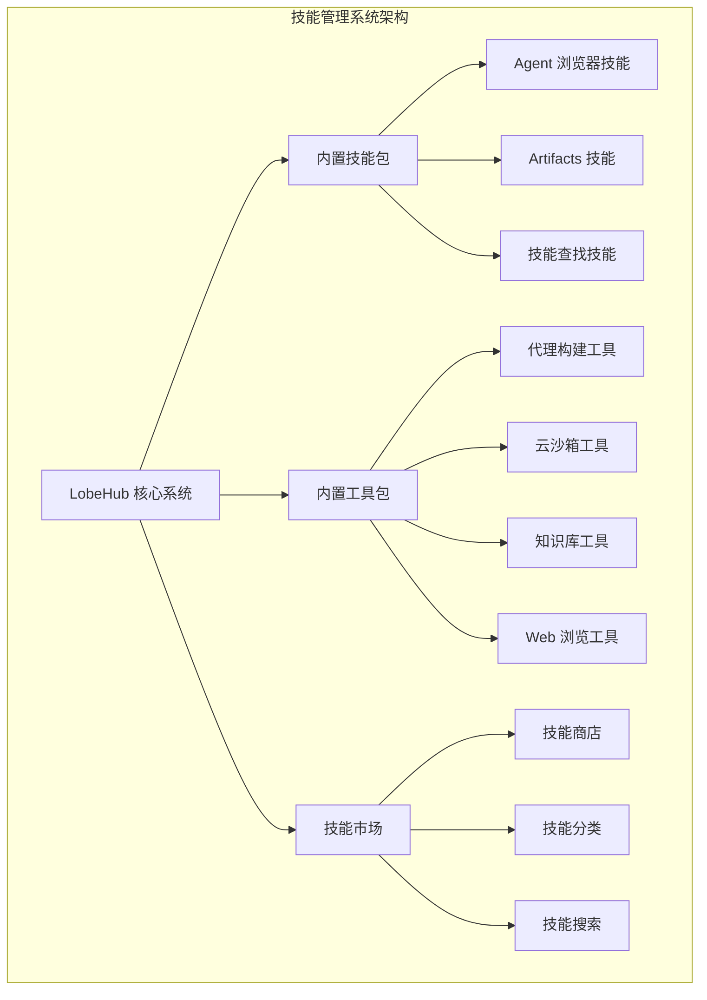
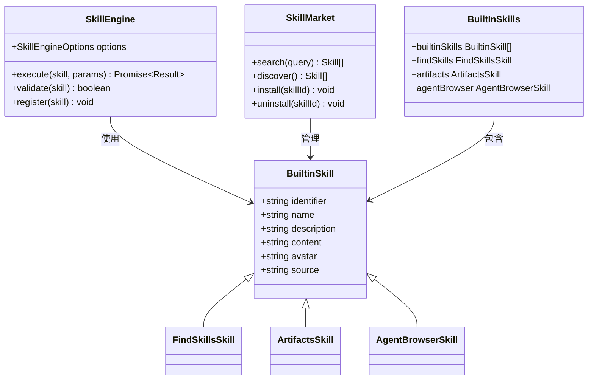
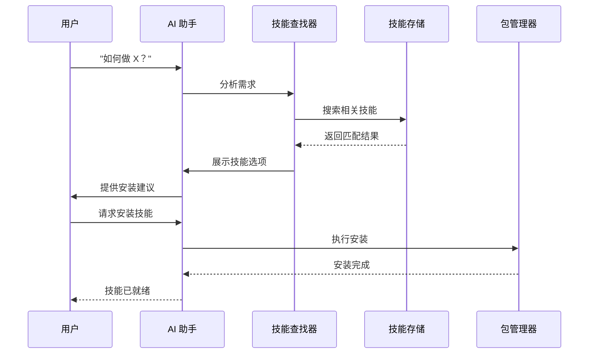
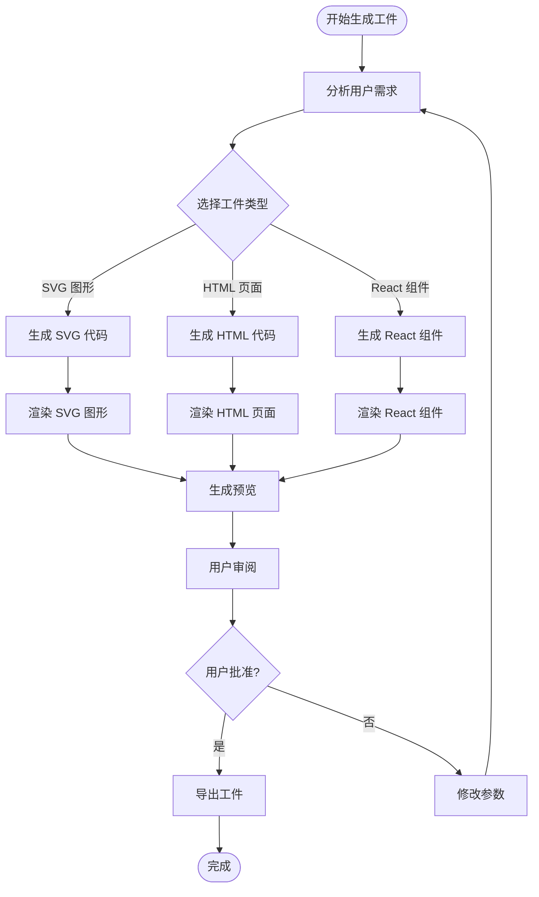
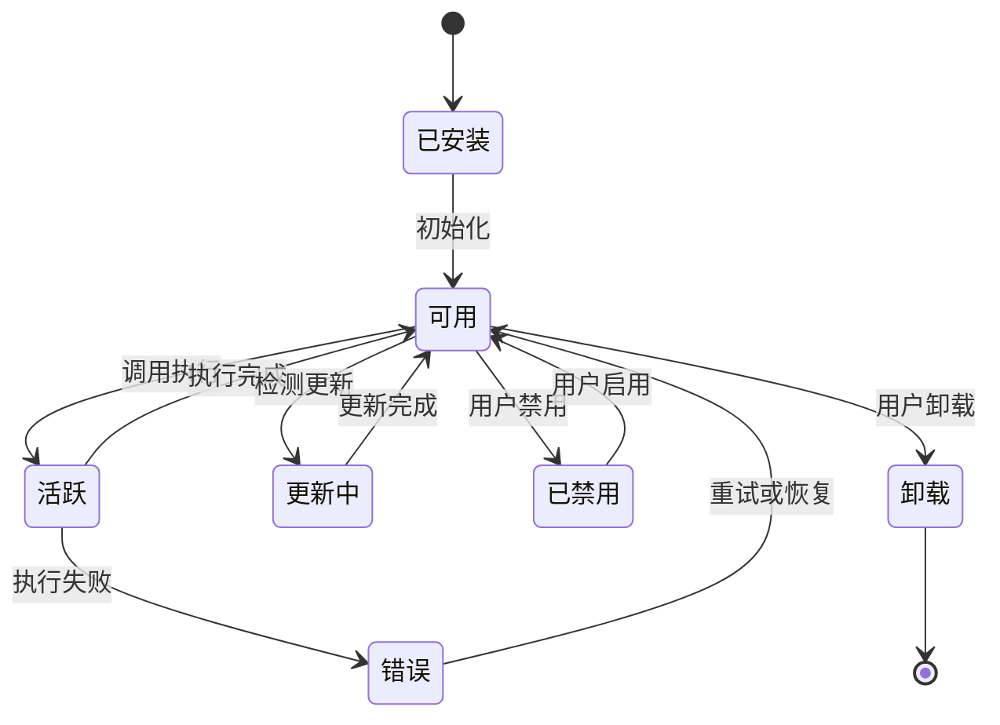

# 技能管理系统

<cite>
**本文档中引用的文件**
- [README.md](file://README.md)
- [package.json](file://package.json)
- [builtin-skills/package.json](file://packages/builtin-skills/package.json)
- [builtin-skills/src/index.ts](file://packages/builtin-skills/src/index.ts)
- [builtin-skills/src/find-skills/index.ts](file://packages/builtin-skills/src/find-skills/index.ts)
- [builtin-skills/src/find-skills/content.ts](file://packages/builtin-skills/src/find-skills/content.ts)
- [builtin-skills/src/artifacts/index.ts](file://packages/builtin-skills/src/artifacts/index.ts)
- [builtin-tools/package.json](file://packages/builtin-tools/package.json)
</cite>

## 目录

1. [简介](#简介)
2. [项目结构](#项目结构)
3. [核心组件](#核心组件)
4. [架构概览](#架构概览)
5. [详细组件分析](#详细组件分析)
6. [依赖关系分析](#依赖关系分析)
7. [性能考虑](#性能考虑)
8. [故障排除指南](#故障排除指南)
9. [结论](#结论)

## 简介

技能管理系统是 LobeHub 生态系统中的核心组件，负责管理和组织各种 AI 助手技能。该系统支持超过 10,000 种技能，为用户提供从基础工具到复杂工作流程的全方位能力扩展。

LobeHub 将技能视为工作的基本单元，提供了一个让人类和 AI 助手共同进化的基础设施。通过技能系统，用户可以轻松发现、安装和使用各种专业技能来增强 AI 助手的能力。

## 项目结构



**图表来源**

- [package.json:158-404](file://package.json#L158-L404)
- [builtin-skills/src/index.ts:1-14](file://packages/builtin-skills/src/index.ts#L1-L14)

**章节来源**

- [README.md:125-141](file://README.md#L125-L141)
- [package.json:30-35](file://package.json#L30-L35)

## 核心组件

### 内置技能包 (Builtin Skills)

内置技能包是技能管理系统的核心组件，提供了预定义的技能集合：

- **Agent 浏览器技能**: 提供网页浏览和信息提取功能
- **Artifacts 技能**: 支持生成可视化和交互式工件
- **技能查找技能**: 帮助用户发现和安装新技能

### 内置工具包 (Builtin Tools)

内置工具包提供了丰富的工具集，支持各种技能开发和执行场景：

- 代理构建工具：用于创建和管理 AI 代理
- 云沙箱工具：提供安全的代码执行环境
- 知识库工具：支持文档管理和检索
- Web 浏览工具：集成网络爬取和信息处理

**章节来源**

- [builtin-skills/src/index.ts:9-14](file://packages/builtin-skills/src/index.ts#L9-L14)
- [builtin-tools/package.json:18-35](file://packages/builtin-tools/package.json#L18-L35)

## 架构概览



**图表来源**

- [builtin-skills/src/find-skills/index.ts:7-15](file://packages/builtin-skills/src/find-skills/index.ts#L7-L15)
- [builtin-skills/src/artifacts/index.ts:7-16](file://packages/builtin-skills/src/artifacts/index.ts#L7-L16)

## 详细组件分析

### 技能查找系统

技能查找系统是用户发现新技能的主要入口点，提供了智能的搜索和推荐功能。



**图表来源**

- [builtin-skills/src/find-skills/content.ts:1-130](file://packages/builtin-skills/src/find-skills/content.ts#L1-L130)

#### 技能分类体系

系统支持多种技能分类，包括：

- **Web 开发**: React、Next.js、TypeScript、CSS、Tailwind
- **测试**: Testing、Jest、Playwright、E2E
- **DevOps**: Deploy、Docker、Kubernetes、CI-CD
- **文档**: Docs、README、Changelog、API-Docs
- **代码质量**: Review、Lint、Refactor、Best-Practices
- **设计**: UI、UX、Design-System、Accessibility
- **生产力**: Workflow、Automation、Git

**章节来源**

- [builtin-skills/src/find-skills/content.ts:92-105](file://packages/builtin-skills/src/find-skills/content.ts#L92-L105)

### Artifacts 工件生成系统

Artifacts 系统支持生成各种类型的可视化内容：



**图表来源**

- [builtin-skills/src/artifacts/index.ts:1-16](file://packages/builtin-skills/src/artifacts/index.ts#L1-L16)

**章节来源**

- [builtin-skills/src/artifacts/index.ts:7-16](file://packages/builtin-skills/src/artifacts/index.ts#L7-L16)

### 技能生命周期管理



## 依赖关系分析

```mermaid
graph LR
subgraph "外部依赖"
A[LangChain] --> C[技能执行引擎]
B[OpenAI SDK] --> C
D[Zustand] --> E[状态管理]
end
subgraph "内部包依赖"
C --> F[@lobechat/builtin-skills]
C --> G[@lobechat/builtin-tools]
F --> H[@lobechat/types]
G --> H
G --> I[@lobechat/const]
end
subgraph "应用层"
J[LobeHub 主应用] --> C
C --> K[技能市场]
end
```

**图表来源**

- [package.json:158-404](file://package.json#L158-L404)
- [builtin-skills/package.json:1-15](file://packages/builtin-skills/package.json#L1-L15)
- [builtin-tools/package.json:1-47](file://packages/builtin-tools/package.json#L1-L47)

**章节来源**

- [package.json:158-404](file://package.json#L158-L404)

## 性能考虑

技能系统在设计时充分考虑了性能优化：

### 并行执行优化

- 技能调用支持并发执行
- 智能队列管理避免资源竞争
- 缓存机制减少重复计算

### 内存管理

- 模块化加载减少内存占用
- 懒加载策略延迟非必要组件
- 自动垃圾回收机制

### 网络优化

- CDN 加速技能包下载
- 智能缓存策略
- 断点续传支持

## 故障排除指南

### 常见问题及解决方案

**技能安装失败**

1. 检查网络连接和代理设置
2. 验证技能包的完整性
3. 查看依赖版本兼容性

**技能执行错误**

1. 检查技能参数格式
2. 验证 API 密钥有效性
3. 查看错误日志获取详细信息

**性能问题**

1. 清理缓存数据
2. 检查系统资源使用情况
3. 调整并发执行限制

**章节来源**

- [builtin-skills/src/find-skills/content.ts:112-128](file://packages/builtin-skills/src/find-skills/content.ts#L112-L128)

## 结论

技能管理系统作为 LobeHub 的核心功能模块，为用户提供了强大而灵活的技能扩展能力。通过模块化的架构设计、完善的生命周期管理和优秀的性能优化，系统能够满足从个人用户到企业级应用的各种需求。

未来的发展方向包括：

- 更智能的技能推荐算法
- 增强的技能开发工具链
- 更好的跨平台兼容性
- 更完善的技能生态建设

该系统为构建下一代 AI 助手生态系统奠定了坚实的基础，将持续推动人类与 AI 助手的共同进化。
