# 技能详情屏幕

<cite>
**本文档引用的文件**
- [SkillDetailScreen.tsx](file://apps/mobile/src/screens/SkillDetailScreen.tsx)
- [api.ts](file://apps/mobile/src/lib/api.ts)
- [types/index.ts](file://apps/mobile/src/types/index.ts)
- [lobe-skills.ts](file://src/store/tool/slices/builtin/executors/lobe-skills.ts)
- [lobe-skill-store.ts](file://src/store/tool/slices/builtin/executors/lobe-skill-store.ts)
- [skill.ts](file://src/services/skill/index.ts)
- [skills.ts](file://packages/types/src/discover/skills.ts)
- [SkillSettingsScreen.tsx](file://apps/mobile/src/screens/SkillSettingsScreen.tsx)
- [APIs.tsx](file://src/features/PluginDetailModal/APIs.tsx)
- [index.tsx](file://src/features/PluginDetailModal/index.tsx)
- [ApiVisualizer.tsx](file://src/features/PluginDevModal/PluginPreview/ApiVisualizer.tsx)
</cite>

## 更新摘要

**变更内容**

- 新增 API 清单显示功能，提供更直观的插件和技能 API 端点展示
- 新增结构化 API 端点卡片布局，支持 API 名称徽章和描述文本显示
- 增强了技能详情屏幕的 API 端点可视化能力
- 新增开发者模式下的 API 可视化组件

## 目录

1. [简介](#简介)
2. [项目结构](#项目结构)
3. [核心组件](#核心组件)
4. [架构概览](#架构概览)
5. [详细组件分析](#详细组件分析)
6. [API 清单显示功能](#api清单显示功能)
7. [依赖关系分析](#依赖关系分析)
8. [性能考虑](#性能考虑)
9. [故障排除指南](#故障排除指南)
10. [结论](#结论)

## 简介

技能详情屏幕是 LobeHub 移动应用中的一个核心功能模块，用于展示和管理 AI 助手技能的详细信息。该屏幕提供了完整的技能浏览体验，包括技能元数据显示、内容渲染、安装 / 卸载操作、清单文件查看等功能。

**更新** 新增了 API 清单显示功能，为插件和技能 API 端点提供更直观的展示方式，支持结构化的 API 端点卡片布局，包含 API 名称徽章和描述文本显示。

该功能支持两种类型的技能：Agent 技能（内置或用户创建）和插件技能（社区 MCP 插件）。用户可以通过技能市场浏览、搜索和安装新的技能，也可以查看已安装技能的详细信息和配置选项。新增的 API 清单功能使得技能的 API 端点展示更加直观和易用。

## 项目结构

技能详情屏幕在项目中的组织结构如下：

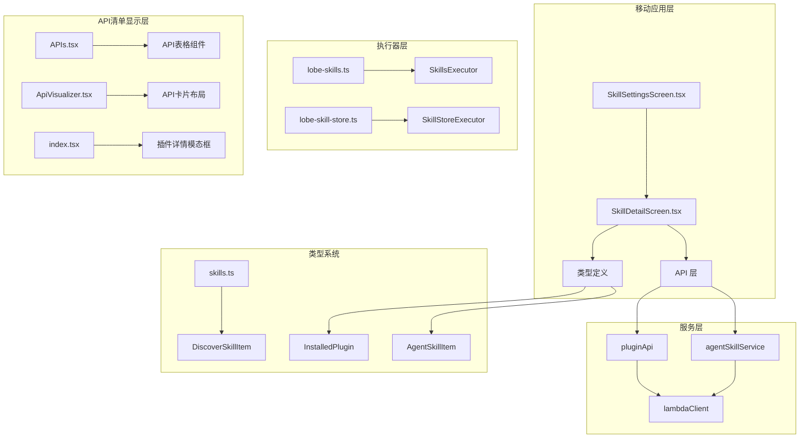

**图表来源**

- [SkillDetailScreen.tsx:1-430](file://apps/mobile/src/screens/SkillDetailScreen.tsx#L1-L430)
- [api.ts:1-200](file://apps/mobile/src/lib/api.ts#L1-L200)
- [APIs.tsx:1-53](file://src/features/PluginDetailModal/APIs.tsx#L1-L53)
- [ApiVisualizer.tsx:1-186](file://src/features/PluginDevModal/PluginPreview/ApiVisualizer.tsx#L1-L186)

**章节来源**

- [SkillDetailScreen.tsx:1-430](file://apps/mobile/src/screens/SkillDetailScreen.tsx#L1-L430)
- [api.ts:1-200](file://apps/mobile/src/lib/api.ts#L1-L200)
- [APIs.tsx:1-53](file://src/features/PluginDetailModal/APIs.tsx#L1-L53)

## 核心组件

技能详情屏幕由多个核心组件构成，每个组件负责特定的功能领域：

### 主要组件架构

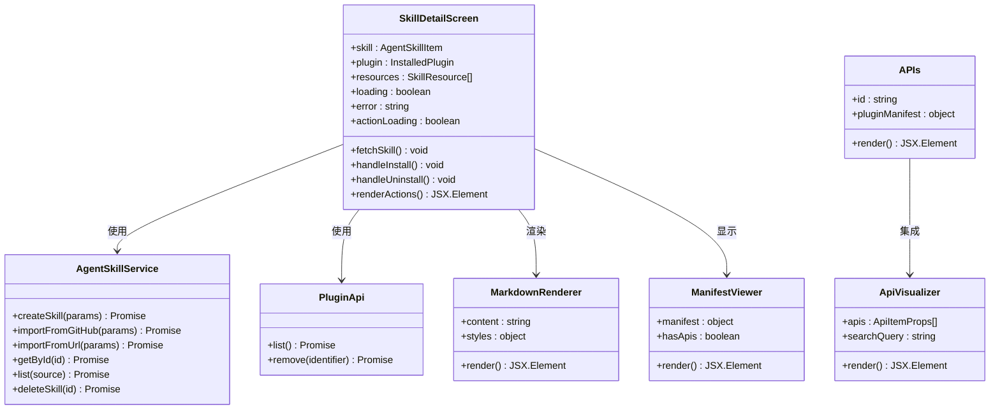

**图表来源**

- [SkillDetailScreen.tsx:53-430](file://apps/mobile/src/screens/SkillDetailScreen.tsx#L53-L430)
- [skill.ts:17-96](file://src/services/skill/index.ts#L17-L96)
- [APIs.tsx:11-53](file://src/features/PluginDetailModal/APIs.tsx#L11-L53)
- [ApiVisualizer.tsx:89-186](file://src/features/PluginDevModal/PluginPreview/ApiVisualizer.tsx#L89-L186)

### 数据流处理

技能详情屏幕采用异步数据加载模式，支持错误处理和重试机制：

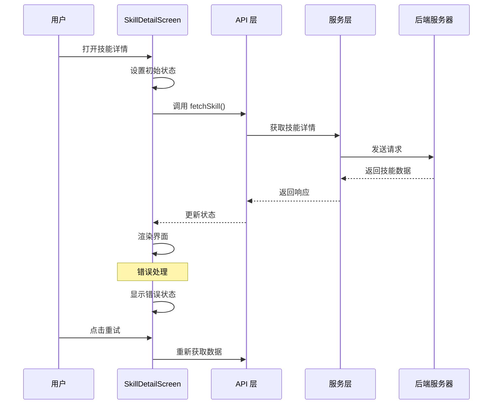

**图表来源**

- [SkillDetailScreen.tsx:71-177](file://apps/mobile/src/screens/SkillDetailScreen.tsx#L71-L177)
- [api.ts:110-137](file://apps/mobile/src/lib/api.ts#L110-L137)

**章节来源**

- [SkillDetailScreen.tsx:53-430](file://apps/mobile/src/screens/SkillDetailScreen.tsx#L53-L430)
- [types/index.ts:376-388](file://apps/mobile/src/types/index.ts#L376-L388)

## 架构概览

技能详情屏幕采用分层架构设计，确保了良好的可维护性和扩展性：

### 整体架构图

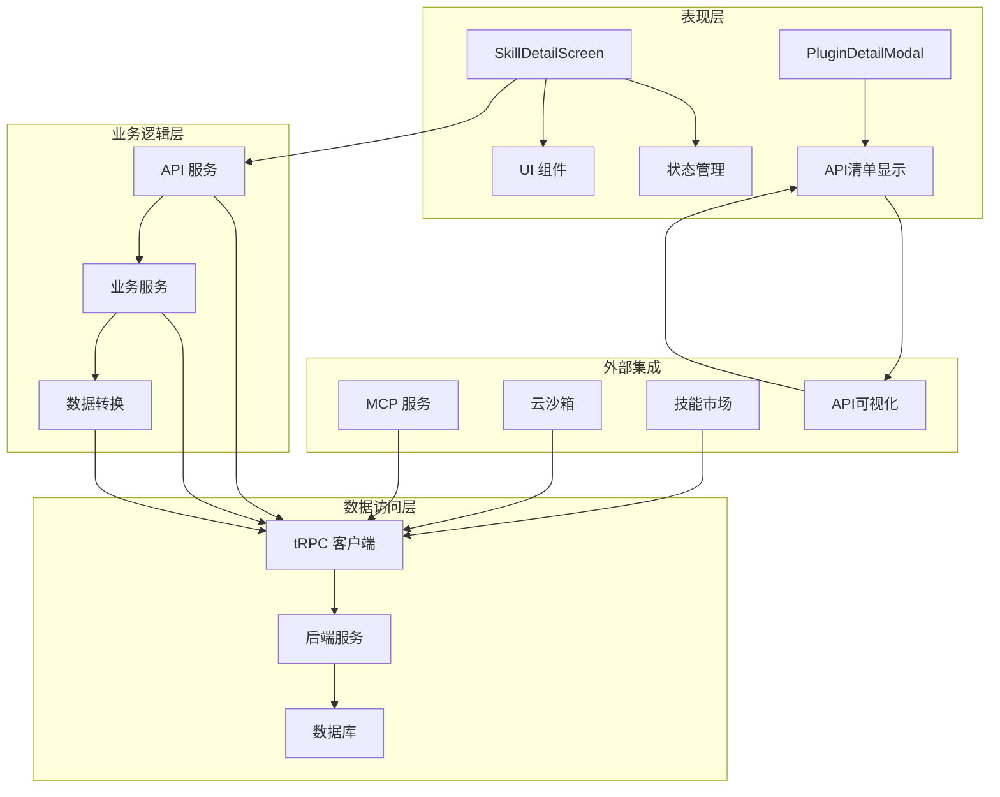

**图表来源**

- [SkillDetailScreen.tsx:1-430](file://apps/mobile/src/screens/SkillDetailScreen.tsx#L1-L430)
- [lobe-skills.ts:16-145](file://src/store/tool/slices/builtin/executors/lobe-skills.ts#L16-L145)
- [APIs.tsx:1-53](file://src/features/PluginDetailModal/APIs.tsx#L1-L53)

### 技能类型处理

系统支持多种技能类型，每种类型都有特定的处理流程：

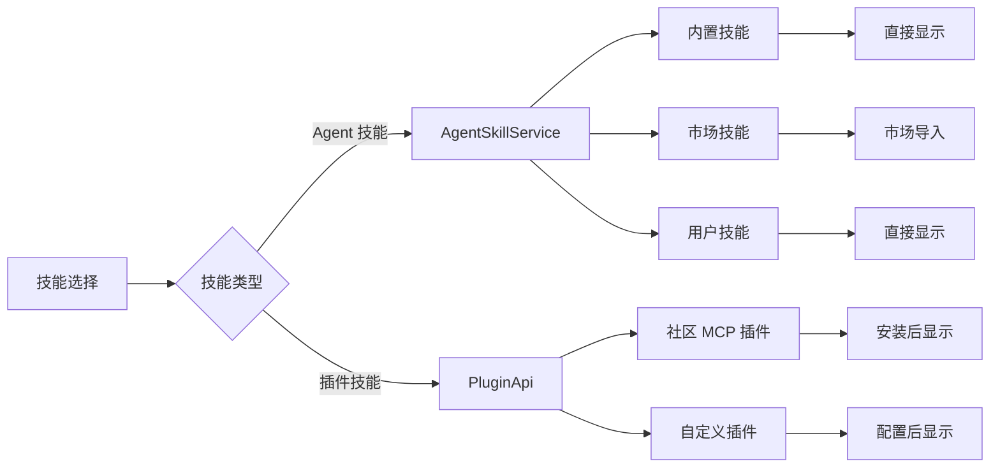

**图表来源**

- [SkillDetailScreen.tsx:75-92](file://apps/mobile/src/screens/SkillDetailScreen.tsx#L75-L92)
- [types/index.ts:364-374](file://apps/mobile/src/types/index.ts#L364-L374)

**章节来源**

- [lobe-skills.ts:1-149](file://src/store/tool/slices/builtin/executors/lobe-skills.ts#L1-L149)
- [lobe-skill-store.ts:1-60](file://src/store/tool/slices/builtin/executors/lobe-skill-store.ts#L1-L60)

## 详细组件分析

### 技能详情屏幕实现

技能详情屏幕是整个功能的核心组件，负责处理所有用户交互和数据展示：

#### 核心功能特性

| 功能特性        | 实现方式                   | 用户价值              |
| --------------- | -------------------------- | --------------------- |
| 技能详情展示    | Markdown 渲染 + 元数据卡片 | 提供完整技能信息      |
| 安装 / 卸载控制 | 条件渲染 + 异步操作        | 支持技能生命周期管理  |
| 错误处理        | 加载状态 + 重试机制        | 提升用户体验稳定性    |
| 响应式设计      | 动态样式 + 安全区域适配    | 适配不同设备尺寸      |
| API 清单显示    | 表格组件 + 卡片布局        | 直观展示 API 端点信息 |

#### 状态管理机制

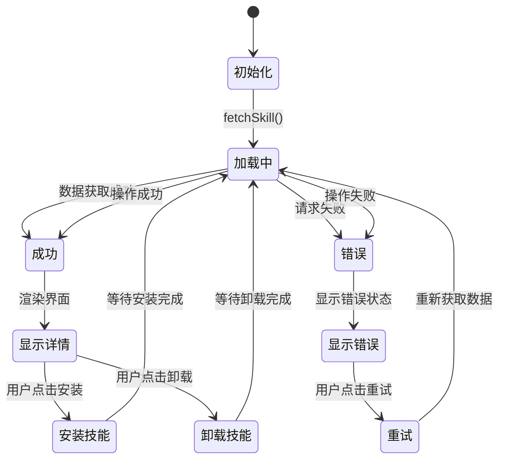

**图表来源**

- [SkillDetailScreen.tsx:62-99](file://apps/mobile/src/screens/SkillDetailScreen.tsx#L62-L99)
- [SkillDetailScreen.tsx:184-228](file://apps/mobile/src/screens/SkillDetailScreen.tsx#L184-L228)

#### 安装流程处理

技能安装和卸载操作具有不同的处理逻辑：

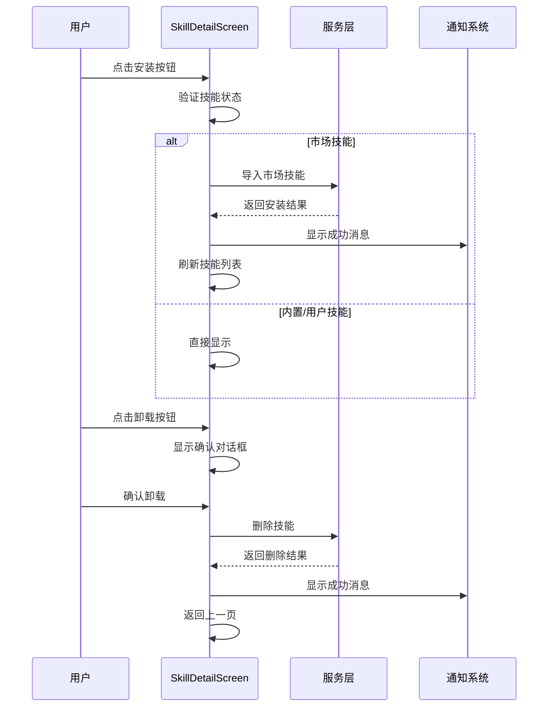

**图表来源**

- [SkillDetailScreen.tsx:102-142](file://apps/mobile/src/screens/SkillDetailScreen.tsx#L102-L142)
- [SkillDetailScreen.tsx:184-228](file://apps/mobile/src/screens/SkillDetailScreen.tsx#L184-L228)

**章节来源**

- [SkillDetailScreen.tsx:53-430](file://apps/mobile/src/screens/SkillDetailScreen.tsx#L53-L430)

### API 服务层

API 服务层提供了统一的数据访问接口，封装了与后端服务的通信细节：

#### API 接口设计

| 接口方法                     | 参数                 | 返回值             | 用途               |
| ---------------------------- | -------------------- | ------------------ | ------------------ |
| agentSkills.getById          | id: string           | AgentSkillItem     | 获取单个技能详情   |
| agentSkills.list             | source?: SkillSource | SkillListItem\[]   | 获取技能列表       |
| agentSkills.importFromMarket | identifier: string   | SkillImportResult  | 从市场导入技能     |
| plugin.getPlugins            | -                    | InstalledPlugin\[] | 获取已安装插件列表 |
| plugin.remove                | identifier: string   | void               | 卸载插件           |

#### 数据传输协议

API 层使用 tRPC 协议进行数据传输，支持超时序列化和反序列化：

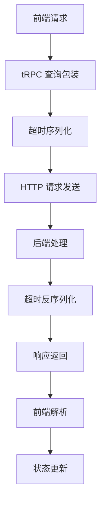

**图表来源**

- [api.ts:110-137](file://apps/mobile/src/lib/api.ts#L110-L137)
- [api.ts:728-806](file://apps/mobile/src/lib/api.ts#L728-L806)

**章节来源**

- [api.ts:1-200](file://apps/mobile/src/lib/api.ts#L1-L200)
- [api.ts:728-806](file://apps/mobile/src/lib/api.ts#L728-L806)

### 类型定义系统

类型定义系统为整个技能详情功能提供了类型安全的保障：

#### 核心类型结构

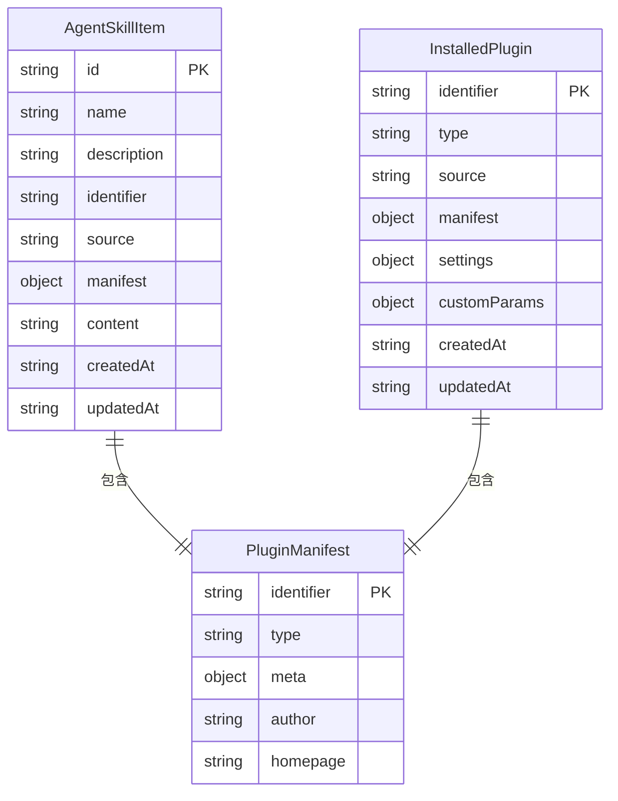

**图表来源**

- [types/index.ts:376-388](file://apps/mobile/src/types/index.ts#L376-L388)
- [types/index.ts:364-374](file://apps/mobile/src/types/index.ts#L364-L374)
- [types/index.ts:355-361](file://apps/mobile/src/types/index.ts#L355-L361)

#### 技能分类系统

系统支持多种技能分类，每种分类都有特定的用途和特征：

| 分类类型               | 适用场景         | 特征描述             |
| ---------------------- | ---------------- | -------------------- |
| AgentToAgentProtocols  | 多智能体协作     | 支持智能体间通信协议 |
| AILLMs                 | 人工智能语言模型 | 集成各种 LLM 服务    |
| BrowserAutomation      | 浏览器自动化     | 自动化网页操作       |
| DataAnalytics          | 数据分析工具     | 统计分析和可视化     |
| DevOpsCloud            | 开发运维         | 云服务管理和部署     |
| ImageVideoGeneration   | 图像视频生成     | AI 内容创作工具      |
| WebFrontendDevelopment | 前端开发         | 网页开发辅助工具     |

**章节来源**

- [types/index.ts:345-405](file://apps/mobile/src/types/index.ts#L345-L405)
- [skills.ts:10-44](file://packages/types/src/discover/skills.ts#L10-L44)

### 执行器集成

执行器层提供了技能的底层执行能力，支持多种执行环境：

#### 技能执行器架构

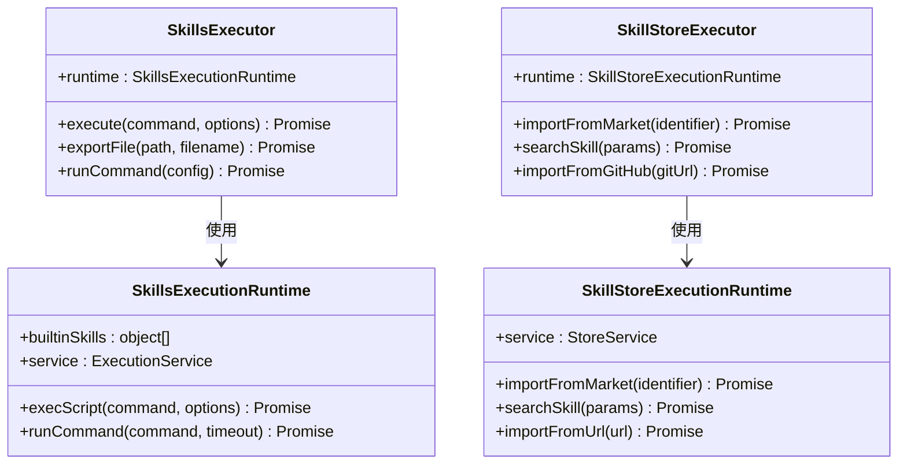

**图表来源**

- [lobe-skills.ts:16-145](file://src/store/tool/slices/builtin/executors/lobe-skills.ts#L16-L145)
- [lobe-skill-store.ts:14-56](file://src/store/tool/slices/builtin/executors/lobe-skill-store.ts#L14-L56)

#### 云沙箱集成

技能执行通过云沙箱提供安全的执行环境：

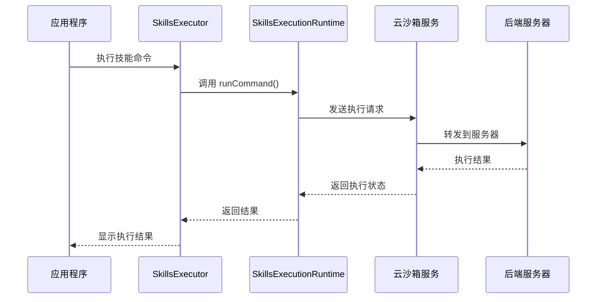

**图表来源**

- [lobe-skills.ts:96-143](file://src/store/tool/slices/builtin/executors/lobe-skills.ts#L96-L143)

**章节来源**

- [lobe-skills.ts:1-149](file://src/store/tool/slices/builtin/executors/lobe-skills.ts#L1-L149)
- [lobe-skill-store.ts:1-60](file://src/store/tool/slices/builtin/executors/lobe-skill-store.ts#L1-L60)

## API 清单显示功能

**新增** 系统新增了 API 清单显示功能，为插件和技能 API 端点提供更直观的展示方式。

### API 清单组件架构

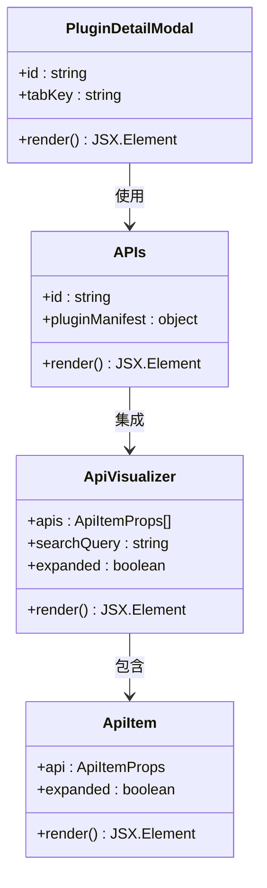

**图表来源**

- [APIs.tsx:11-53](file://src/features/PluginDetailModal/APIs.tsx#L11-L53)
- [ApiVisualizer.tsx:89-186](file://src/features/PluginDevModal/PluginPreview/ApiVisualizer.tsx#L89-L186)
- [index.tsx:27-82](file://src/features/PluginDetailModal/index.tsx#L27-L82)

### API 清单显示特性

| 功能特性     | 实现方式              | 用户价值              |
| ------------ | --------------------- | --------------------- |
| API 表格展示 | Ant Design Table 组件 | 结构化显示 API 端点   |
| API 卡片布局 | 可展开卡片设计        | 详细展示 API 参数信息 |
| 搜索过滤     | 实时搜索功能          | 快速定位 API 端点     |
| 参数类型显示 | 类型徽章标识          | 清晰显示参数类型      |
| 必填参数标记 | 星号标记              | 突出显示必填字段      |

### API 清单数据流

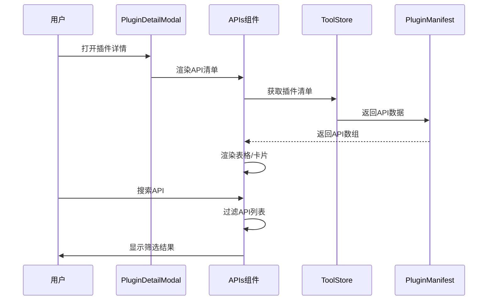

**图表来源**

- [APIs.tsx:13-50](file://src/features/PluginDetailModal/APIs.tsx#L13-L50)
- [ApiVisualizer.tsx:154-183](file://src/features/PluginDevModal/PluginPreview/ApiVisualizer.tsx#L154-L183)

### API 清单布局设计

系统提供了两种 API 清单展示布局：

#### 表格布局（Info 标签页）

- 使用 Ant Design Table 组件展示 API 列表
- 支持固定列宽和边框样式
- 显示 API 名称和描述两列信息
- 适合快速浏览和对比 API 端点

#### 卡片布局（开发者模式）

- 使用可展开卡片展示详细 API 信息
- 支持 API 名称、描述和参数的层级展示
- 提供搜索过滤功能
- 适合深度查看和理解 API 参数

**章节来源**

- [APIs.tsx:1-53](file://src/features/PluginDetailModal/APIs.tsx#L1-L53)
- [ApiVisualizer.tsx:1-186](file://src/features/PluginDevModal/PluginPreview/ApiVisualizer.tsx#L1-L186)
- [index.tsx:1-82](file://src/features/PluginDetailModal/index.tsx#L1-L82)

## 依赖关系分析

技能详情屏幕的依赖关系体现了清晰的分层架构：

### 依赖层次结构

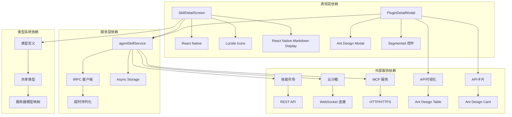

**图表来源**

- [SkillDetailScreen.tsx:9-38](file://apps/mobile/src/screens/SkillDetailScreen.tsx#L9-L38)
- [api.ts:15-45](file://apps/mobile/src/lib/api.ts#L15-L45)
- [APIs.tsx:1-53](file://src/features/PluginDetailModal/APIs.tsx#L1-L53)
- [ApiVisualizer.tsx:1-87](file://src/features/PluginDevModal/PluginPreview/ApiVisualizer.tsx#L1-L87)

### 循环依赖检测

系统通过以下机制避免循环依赖：

1. **单向数据流**: 从 UI 组件到服务层，再到 API 层
2. **接口抽象**: 使用 TypeScript 接口定义依赖契约
3. **动态导入**: 在需要时才导入大型模块
4. **服务定位器**: 通过工厂函数创建服务实例
5. **组件分离**: API 清单功能独立于主技能详情屏幕

**章节来源**

- [SkillDetailScreen.tsx:1-430](file://apps/mobile/src/screens/SkillDetailScreen.tsx#L1-L430)
- [api.ts:1-200](file://apps/mobile/src/lib/api.ts#L1-L200)
- [APIs.tsx:1-53](file://src/features/PluginDetailModal/APIs.tsx#L1-L53)

## 性能考虑

技能详情屏幕在设计时充分考虑了性能优化：

### 性能优化策略

| 优化方面     | 实现方式          | 性能收益         |
| ------------ | ----------------- | ---------------- |
| 懒加载       | 按需加载资源文件  | 减少初始加载时间 |
| 缓存机制     | AsyncStorage 缓存 | 提升重复访问速度 |
| 异步渲染     | 分块渲染大内容    | 改善滚动性能     |
| 内存管理     | 及时清理临时数据  | 防止内存泄漏     |
| 网络优化     | 连接池复用        | 减少网络延迟     |
| API 清单优化 | 表格虚拟滚动      | 提升大数据集性能 |

### 内存使用优化

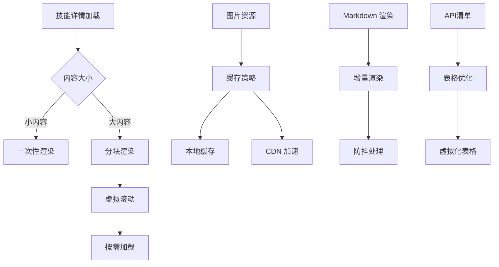

**图表来源**

- [SkillDetailScreen.tsx:264-427](file://apps/mobile/src/screens/SkillDetailScreen.tsx#L264-L427)
- [APIs.tsx:28-49](file://src/features/PluginDetailModal/APIs.tsx#L28-L49)

### 网络性能优化

系统采用多种网络优化技术：

1. **连接复用**: tRPC 客户端自动管理连接池
2. **超时控制**: 智能超时设置防止长时间等待
3. **错误重试**: 指数退避算法处理临时故障
4. **数据压缩**: 传输前对数据进行压缩
5. **API 清单缓存**: 已加载的 API 数据进行缓存

**章节来源**

- [api.ts:80-91](file://apps/mobile/src/lib/api.ts#L80-L91)
- [SkillDetailScreen.tsx:238-256](file://apps/mobile/src/screens/SkillDetailScreen.tsx#L238-L256)

## 故障排除指南

技能详情屏幕提供了完善的错误处理和故障排除机制：

### 常见问题及解决方案

| 问题类型     | 症状                 | 解决方案                   | 预防措施           |
| ------------ | -------------------- | -------------------------- | ------------------ |
| 网络连接失败 | 加载状态持续显示     | 检查网络设置，重试连接     | 实现自动重连机制   |
| 技能加载超时 | 页面空白或加载指示器 | 增加超时时间，显示错误页面 | 实现超时处理逻辑   |
| 安装失败     | 安装按钮禁用         | 检查权限设置，重新登录     | 添加权限检查和提示 |
| 数据不一致   | 显示过期信息         | 手动刷新，清除缓存         | 实现数据同步机制   |
| API 清单为空 | 显示空状态           | 检查插件清单，重新加载     | 实现 API 数据验证  |

### 错误处理流程

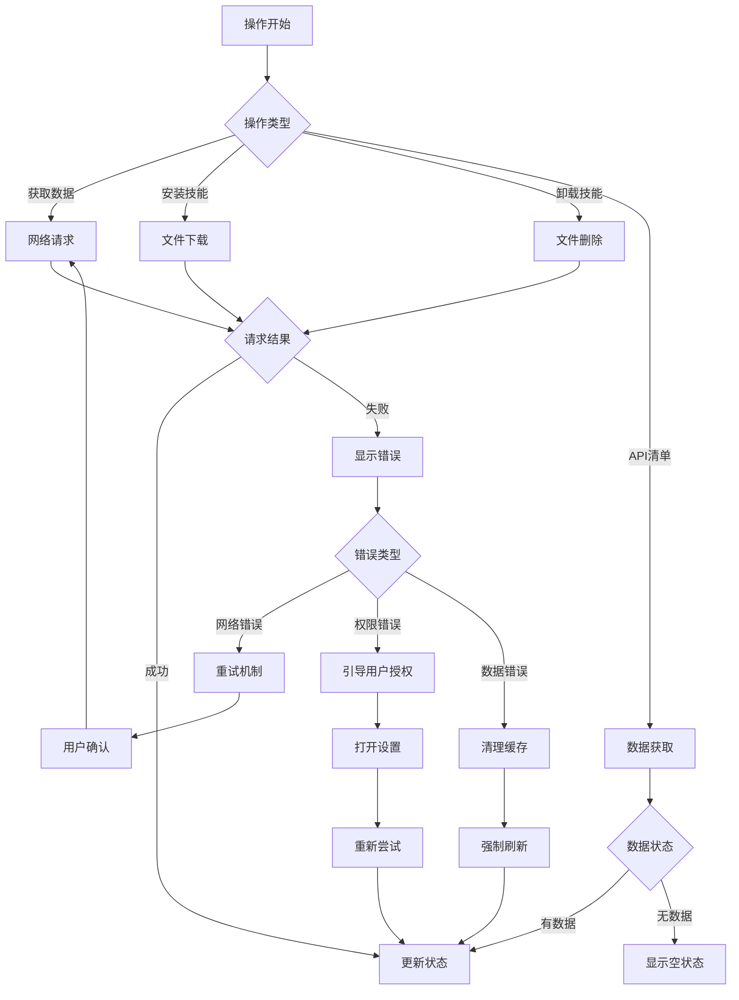

**图表来源**

- [SkillDetailScreen.tsx:93-99](file://apps/mobile/src/screens/SkillDetailScreen.tsx#L93-L99)
- [SkillDetailScreen.tsx:174-177](file://apps/mobile/src/screens/SkillDetailScreen.tsx#L174-L177)
- [APIs.tsx:17-25](file://src/features/PluginDetailModal/APIs.tsx#L17-L25)

### 调试工具和日志

系统集成了多种调试和监控工具：

1. **Haptic 反馈**: 提供触觉反馈增强用户体验
2. **控制台日志**: 详细的错误信息记录
3. **性能监控**: 实时监控加载时间和内存使用
4. **网络调试**: 网络请求的详细跟踪
5. **API 清单调试**: API 数据的详细日志记录

**章节来源**

- [SkillDetailScreen.tsx:93-99](file://apps/mobile/src/screens/SkillDetailScreen.tsx#L93-L99)
- [SkillDetailScreen.tsx:174-177](file://apps/mobile/src/screens/SkillDetailScreen.tsx#L174-L177)
- [APIs.tsx:13-15](file://src/features/PluginDetailModal/APIs.tsx#L13-L15)

## 结论

技能详情屏幕作为 LobeHub 移动应用的重要组成部分，展现了现代移动应用开发的最佳实践。通过清晰的分层架构、完善的状态管理和强大的错误处理机制，该功能为用户提供了流畅、可靠的技能管理体验。

**更新** 新增的 API 清单显示功能进一步增强了技能详情屏幕的能力，提供了更直观的插件和技能 API 端点展示方式。通过结构化的 API 端点卡片布局和表格展示，用户可以更轻松地理解和使用各种 API 端点。

### 主要成就

1. **架构设计**: 采用分层架构确保了代码的可维护性和扩展性
2. **用户体验**: 提供了直观的操作界面和及时的反馈机制
3. **性能优化**: 通过多种优化策略提升了应用的响应速度
4. **错误处理**: 建立了完善的错误处理和恢复机制
5. **类型安全**: 使用 TypeScript 提供了完整的类型安全保障
6. **API 可视化**: 新增了直观的 API 端点展示功能，提升开发体验

### 技术亮点

- **异步数据流**: 采用现代 React Hooks 和异步编程模式
- **状态管理**: 实现了复杂的状态管理和持久化存储
- **API 集成**: 提供了灵活的 API 接口和数据转换机制
- **执行器架构**: 支持多种执行环境和安全的沙箱执行
- **API 清单功能**: 新增了结构化的 API 端点展示和管理功能
- **多布局支持**: 支持表格和卡片两种 API 清单展示布局

该技能详情屏幕不仅满足了当前的功能需求，还为未来的功能扩展和技术演进奠定了坚实的基础。通过持续的优化和改进，它将继续为用户提供优秀的技能管理体验。
