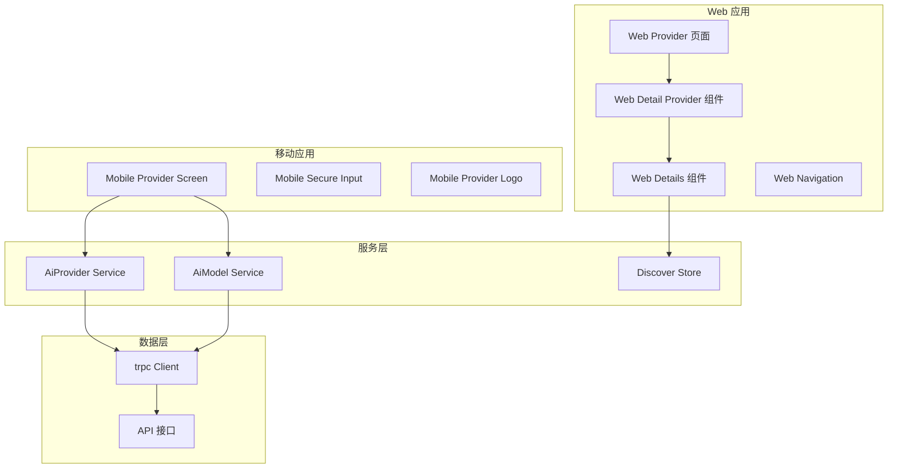
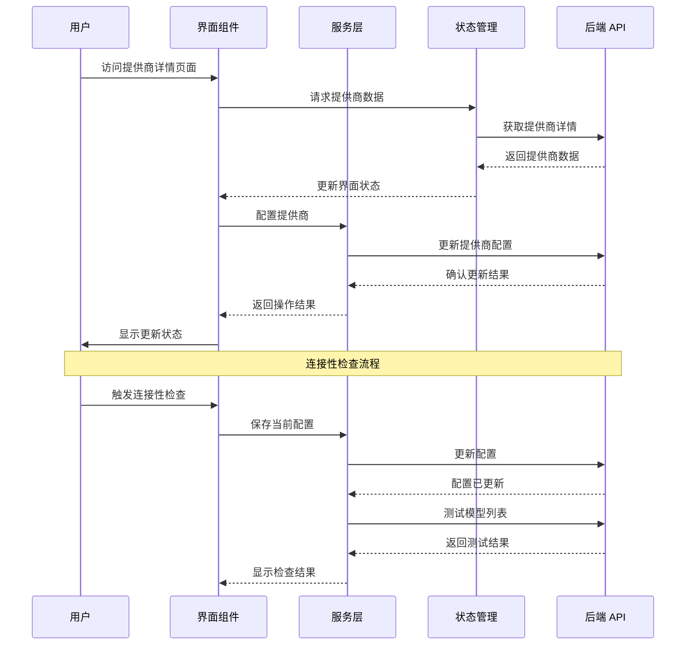
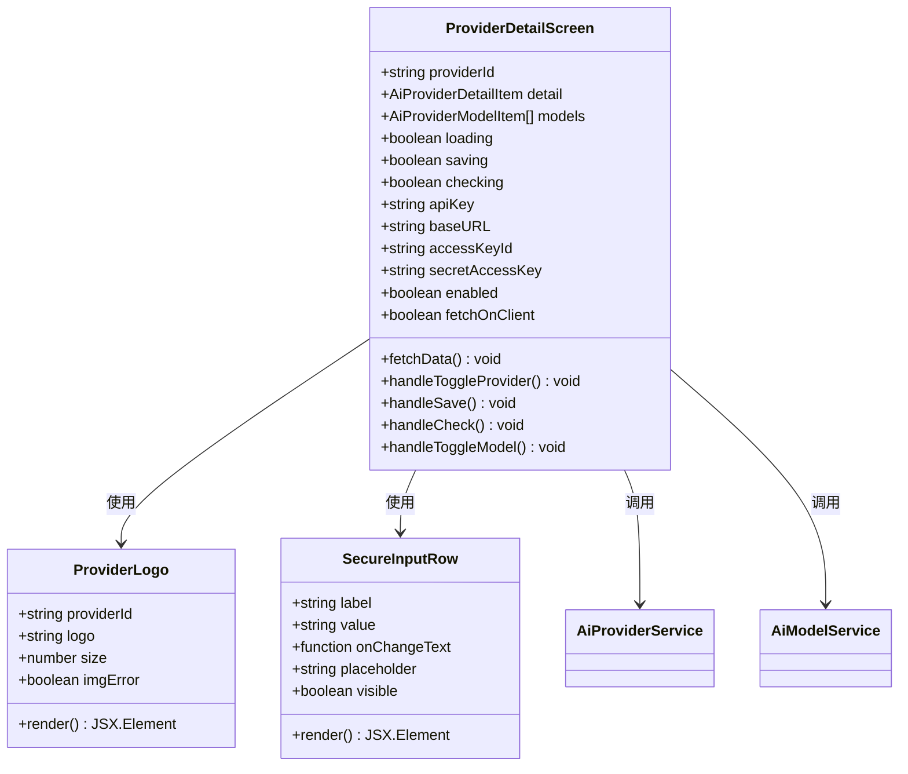
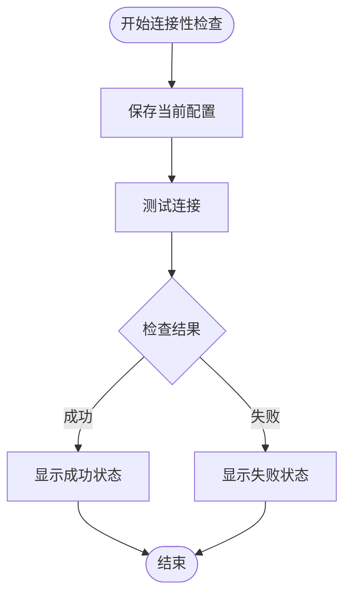
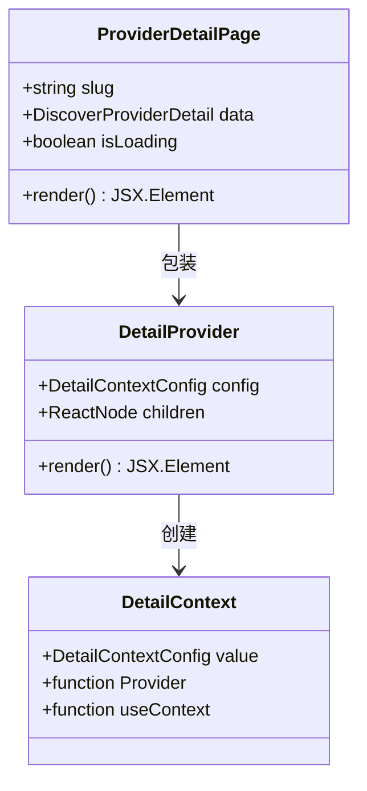
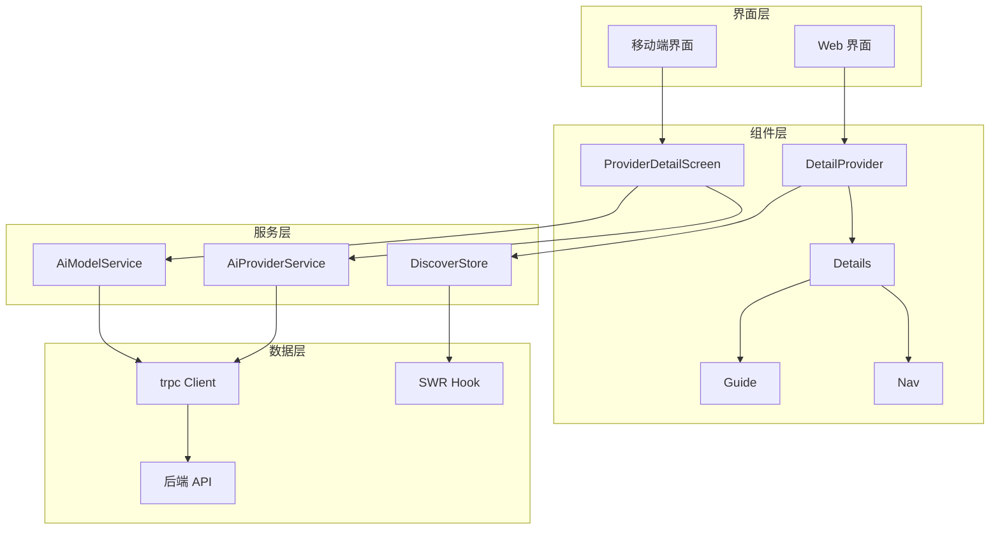

# 提供商详情屏幕

<cite>
**本文档引用的文件**
- [apps/mobile/src/screens/ProviderDetailScreen.tsx](file://apps/mobile/src/screens/ProviderDetailScreen.tsx)
- [src/routes/(main)/community/(detail)/provider/index.tsx](file://src/routes/(main)/community/(detail)/provider/index.tsx)
- [src/routes/(main)/settings/provider/detail/default/ProviderDetialPage.tsx](file://src/routes/(main)/settings/provider/detail/default/ProviderDetialPage.tsx)
- [src/routes/(main)/community/(detail)/provider/features/DetailProvider.tsx](file://src/routes/(main)/community/(detail)/provider/features/DetailProvider.tsx)
- [src/routes/(main)/community/(detail)/provider/features/Details/index.tsx](file://src/routes/(main)/community/(detail)/provider/features/Details/index.tsx)
- [src/routes/(main)/community/(detail)/provider/features/Details/Nav.tsx](file://src/routes/(main)/community/(detail)/provider/features/Details/Nav.tsx)
- [src/routes/(main)/community/(detail)/provider/features/Details/Guide/index.tsx](file://src/routes/(main)/community/(detail)/provider/features/Details/Guide/index.tsx)
- [src/services/aiProvider/index.ts](file://src/services/aiProvider/index.ts)
- [src/services/aiModel/index.ts](file://src/services/aiModel/index.ts)
- [src/store/discover/slices/provider/action.ts](file://src/store/discover/slices/provider/action.ts)
- [apps/mobile/src/navigation/index.tsx](file://apps/mobile/src/navigation/index.tsx)
</cite>

## 目录

1. [简介](#简介)
2. [项目结构](#项目结构)
3. [核心组件](#核心组件)
4. [架构概览](#架构概览)
5. [详细组件分析](#详细组件分析)
6. [依赖关系分析](#依赖关系分析)
7. [性能考虑](#性能考虑)
8. [故障排除指南](#故障排除指南)
9. [结论](#结论)

## 简介

提供商详情屏幕是 LobeChat 应用中的一个关键功能模块，用于展示和管理 AI 提供商的详细信息。该系统支持 Web 和移动端两种界面，提供统一的提供商配置体验。用户可以通过此界面查看提供商的基本信息、配置 API 密钥、设置自定义端点、启用 / 禁用提供商以及管理可用模型。

该系统的核心特性包括：

- 实时提供商状态显示和切换
- 安全的 API 密钥管理（支持隐藏 / 显示）
- 自定义端点配置支持
- 连接性测试功能
- 模型列表管理和筛选
- 客户端侧请求模式切换

## 项目结构

提供商详情功能在项目中采用分层架构设计，主要分布在以下目录：

**图表来源**

- [apps/mobile/src/screens/ProviderDetailScreen.tsx:1-578](file://apps/mobile/src/screens/ProviderDetailScreen.tsx#L1-L578)
- [src/routes/(main)/community/(detail)/provider/index.tsx:1-44](<file://src/routes/(main)/community/(detail)/provider/index.tsx#L1-L44>)

**章节来源**

- [apps/mobile/src/screens/ProviderDetailScreen.tsx:1-578](file://apps/mobile/src/screens/ProviderDetailScreen.tsx#L1-L578)
- [src/routes/(main)/community/(detail)/provider/index.tsx:1-44](<file://src/routes/(main)/community/(detail)/provider/index.tsx#L1-L44>)

## 核心组件

### 移动端提供商详情屏幕

移动端的提供商详情屏幕是整个系统的核心界面，提供了完整的提供商配置功能。该组件使用 React Native 构建，实现了响应式设计和流畅的用户体验。

主要功能特性：

- **提供商头部信息**：显示提供商图标、名称、描述和启用状态切换
- **配置表单区域**：根据提供商类型动态显示相应的配置字段
- **连接性检查**：验证配置的有效性和网络连通性
- **模型管理**：展示和管理提供商的所有可用模型
- **搜索过滤**：支持模型名称搜索和筛选

### Web 端提供商详情页面

Web 端采用模块化设计，通过多个子组件协作实现完整的功能：

- **ProviderDetailPage**：主页面组件，处理路由参数和数据加载
- **DetailProvider**：上下文提供者，传递提供商配置数据
- **Details**：详情内容容器，包含导航和主要内容
- **Header**：页面头部组件
- **Sidebar**：侧边栏组件，显示相关链接和推荐

### 服务层架构

系统采用服务层架构，将业务逻辑与界面分离：

- **AiProviderService**：处理提供商相关的所有 API 调用
- **AiModelService**：管理模型列表和状态更新
- **DiscoverStore**：状态管理，缓存和同步提供商数据

**章节来源**

- [apps/mobile/src/screens/ProviderDetailScreen.tsx:119-578](file://apps/mobile/src/screens/ProviderDetailScreen.tsx#L119-L578)
- [src/routes/(main)/community/(detail)/provider/index.tsx:19-44](<file://src/routes/(main)/community/(detail)/provider/index.tsx#L19-L44>)
- [src/services/aiProvider/index.ts:1-49](file://src/services/aiProvider/index.ts#L1-L49)

## 架构概览

提供商详情系统的整体架构采用分层设计，确保了良好的可维护性和扩展性：

**图表来源**

- [apps/mobile/src/screens/ProviderDetailScreen.tsx:143-255](file://apps/mobile/src/screens/ProviderDetailScreen.tsx#L143-L255)
- [src/services/aiProvider/index.ts:19-33](file://src/services/aiProvider/index.ts#L19-L33)

系统架构的关键特点：

- **响应式设计**：同时支持桌面和移动端界面
- **状态管理**：使用 SWR 进行数据缓存和同步
- **错误处理**：统一的错误处理和用户反馈机制
- **国际化支持**：完整的多语言支持

## 详细组件分析

### 移动端提供商详情屏幕组件

移动端组件是系统中最复杂的界面，实现了完整的提供商配置功能：

**图表来源**

- [apps/mobile/src/screens/ProviderDetailScreen.tsx:43-75](file://apps/mobile/src/screens/ProviderDetailScreen.tsx#L43-L75)
- [apps/mobile/src/screens/ProviderDetailScreen.tsx:78-117](file://apps/mobile/src/screens/ProviderDetailScreen.tsx#L78-L117)

#### 配置字段管理

系统支持多种类型的配置字段，根据提供商的不同需求动态显示：

- **API 密钥字段**：用于标准的 API 密钥认证
- **访问密钥字段**：用于 AWS Bedrock 等特定提供商
- **自定义端点字段**：允许用户指定自定义 API 端点
- **客户端请求开关**：控制是否在客户端直接发起请求

#### 连接性检查机制

连接性检查是系统的重要安全特性：

**图表来源**

- [apps/mobile/src/screens/ProviderDetailScreen.tsx:226-255](file://apps/mobile/src/screens/ProviderDetailScreen.tsx#L226-L255)

**章节来源**

- [apps/mobile/src/screens/ProviderDetailScreen.tsx:119-578](file://apps/mobile/src/screens/ProviderDetailScreen.tsx#L119-L578)

### Web 端提供商详情组件

Web 端采用模块化设计，每个组件负责特定的功能：

#### 详情提供者组件

详情提供者组件是整个 Web 界面的基础，使用 React Context 提供数据共享：

**图表来源**

- [src/routes/(main)/community/(detail)/provider/features/DetailProvider.tsx:10-20](<file://src/routes/(main)/community/(detail)/provider/features/DetailProvider.tsx#L10-L20>)
- [src/routes/(main)/community/(detail)/provider/index.tsx:19-37](<file://src/routes/(main)/community/(detail)/provider/index.tsx#L19-L37>)

#### 详情内容组件

详情内容组件负责组织页面布局和内容展示：

- **导航组件**：提供标签页导航，支持概览、指南和相关项
- **概览组件**：显示提供商的基本信息和统计数据
- **指南组件**：提供详细的集成指南和使用说明
- **相关组件**：显示相关的助手和模型信息

**章节来源**

- [src/routes/(main)/community/(detail)/provider/features/DetailProvider.tsx:1-21](<file://src/routes/(main)/community/(detail)/provider/features/DetailProvider.tsx#L1-L21>)
- [src/routes/(main)/community/(detail)/provider/features/Details/index.tsx:1-48](<file://src/routes/(main)/community/(detail)/provider/features/Details/index.tsx#L1-L48>)

### 服务层组件

服务层组件封装了所有后端 API 调用，提供了统一的接口：

#### AiProviderService

AiProviderService 处理提供商相关的所有操作：

- **创建提供商**：初始化新的提供商配置
- **获取提供商列表**：获取所有可用的提供商
- **获取提供商详情**：获取特定提供商的详细信息
- **切换启用状态**：启用或禁用提供商
- **更新配置**：修改提供商的配置参数

#### AiModelService

AiModelService 管理模型列表和状态：

- **获取模型列表**：获取指定提供商的所有模型
- **切换模型状态**：启用或禁用特定模型
- **批量更新**：支持批量操作多个模型
- **排序管理**：管理模型的显示顺序

**章节来源**

- [src/services/aiProvider/index.ts:1-49](file://src/services/aiProvider/index.ts#L1-L49)
- [src/services/aiModel/index.ts:1-67](file://src/services/aiModel/index.ts#L1-L67)

## 依赖关系分析

提供商详情系统的依赖关系体现了清晰的分层架构：

**图表来源**

- [apps/mobile/src/screens/ProviderDetailScreen.tsx:34-38](file://apps/mobile/src/screens/ProviderDetailScreen.tsx#L34-L38)
- [src/routes/(main)/community/(detail)/provider/features/DetailProvider.tsx:1-7](<file://src/routes/(main)/community/(detail)/provider/features/DetailProvider.tsx#L1-L7>)

### 数据流分析

系统采用单向数据流设计，确保了数据的一致性和可预测性：

1. **数据获取**：组件通过服务层获取数据
2. **状态更新**：用户操作触发状态更新
3. **API 调用**：状态变更通过服务层调用后端 API
4. **数据同步**：后端响应更新本地状态

### 错误处理机制

系统实现了多层次的错误处理：

- **网络错误**：统一的网络错误提示
- **API 错误**：针对不同 API 错误的专门处理
- **用户反馈**：通过 Toast 组件提供即时反馈
- **回滚机制**：操作失败时自动回滚到之前的状态

**章节来源**

- [apps/mobile/src/screens/ProviderDetailScreen.tsx:162-165](file://apps/mobile/src/screens/ProviderDetailScreen.tsx#L162-L165)
- [apps/mobile/src/screens/ProviderDetailScreen.tsx:183-189](file://apps/mobile/src/screens/ProviderDetailScreen.tsx#L183-L189)

## 性能考虑

提供商详情系统在设计时充分考虑了性能优化：

### 数据缓存策略

- **SWR 缓存**：使用 SWR 进行智能缓存和自动刷新
- **本地存储**：敏感数据存储在本地安全存储中
- **增量更新**：支持部分数据更新，减少不必要的重新渲染

### 渲染优化

- **懒加载**：非关键内容采用懒加载策略
- **虚拟滚动**：大量模型列表使用虚拟滚动提升性能
- **防抖处理**：输入字段采用防抖减少不必要的 API 调用

### 网络优化

- **并发请求**：支持多个 API 请求并行执行
- **请求合并**：相似的请求进行合并处理
- **超时控制**：合理的超时设置避免长时间等待

## 故障排除指南

### 常见问题及解决方案

#### 连接性检查失败

**症状**：连接性检查按钮显示红色叉号

**可能原因**：

- API 密钥无效或过期
- 网络连接不稳定
- 自定义端点配置错误

**解决步骤**：

1. 检查 API 密钥格式是否正确
2. 验证网络连接状态
3. 确认自定义端点 URL 的可达性
4. 尝试重新保存配置

#### 模型列表为空

**症状**：模型列表显示为空或只显示少量模型

**可能原因**：

- 网络请求失败
- API 限制导致的数据截断
- 提供商配置不正确

**解决步骤**：

1. 检查网络连接稳定性
2. 刷新页面重新获取数据
3. 验证提供商配置的完整性
4. 联系技术支持获取帮助

#### 状态切换失败

**症状**：启用 / 禁用提供商功能无法正常工作

**可能原因**：

- 权限不足
- 后端服务异常
- 浏览器缓存问题

**解决步骤**：

1. 检查用户权限设置
2. 刷新页面清除缓存
3. 重新登录账户
4. 检查后端服务状态

### 调试工具和技巧

#### 开发者工具

- **浏览器开发者工具**：监控网络请求和响应
- **React DevTools**：检查组件状态和属性
- **Redux DevTools**：调试状态管理问题

#### 日志记录

系统提供了完善的日志记录机制，可以帮助诊断问题：

- **API 调用日志**：记录所有后端 API 调用
- **错误日志**：捕获和记录所有错误信息
- **性能日志**：监控关键操作的性能指标

**章节来源**

- [apps/mobile/src/screens/ProviderDetailScreen.tsx:249-255](file://apps/mobile/src/screens/ProviderDetailScreen.tsx#L249-L255)
- [apps/mobile/src/screens/ProviderDetailScreen.tsx:274-276](file://apps/mobile/src/screens/ProviderDetailScreen.tsx#L274-L276)

## 结论

提供商详情屏幕是 LobeChat 应用中功能最完整、架构最复杂的界面之一。该系统成功地实现了跨平台的一致用户体验，同时保持了高度的可扩展性和可维护性。

### 主要成就

- **统一的配置体验**：无论在 Web 还是移动端，用户都能获得一致的提供商配置体验
- **强大的功能集**：支持多种提供商类型和复杂的配置选项
- **优秀的性能表现**：通过合理的架构设计和优化策略，确保了流畅的用户体验
- **完善的错误处理**：提供了全面的错误处理和用户反馈机制

### 技术亮点

- **模块化设计**：清晰的组件分层和职责分离
- **响应式架构**：同时支持桌面和移动端的优雅适配
- **状态管理**：使用现代的状态管理方案确保数据一致性
- **国际化支持**：完整的多语言支持和本地化处理

### 未来发展方向

随着 AI 行业的快速发展，提供商详情系统还需要持续演进：

- **更多提供商支持**：扩展对新兴 AI 提供商的支持
- **增强的安全性**：加强配置数据的安全保护
- **更好的性能优化**：进一步提升大数据量场景下的性能
- **智能化配置**：利用 AI 技术提供更智能的配置建议

该系统为 LobeChat 的 AI 提供商管理奠定了坚实的基础，为用户提供了强大而易用的工具来管理和配置各种 AI 服务提供商。
