# 插件生态系统

<cite>
**本文引用的文件**
- [README.md](file://README.md)
- [CONTRIBUTING.md](file://CONTRIBUTING.md)
- [2025-12-20-mcp.zh-CN.mdx](file://docs/changelog/2025-12-20-mcp.zh-CN.mdx)
- [2025-07-08-mcp-market.mdx](file://docs/changelog/2025-07-08-mcp-market.mdx)
- [builtin-skills/src/index.ts](file://packages/builtin-skills/src/index.ts)
- [builtin-tools/src/index.ts](file://packages/builtin-tools/src/index.ts)
- [builtin-tool-skill-store/src/index.ts](file://packages/builtin-tool-skill-store/src/index.ts)
- [builtin-tool-calculator/src/index.ts](file://packages/builtin-tool-calculator/src/index.ts)
- [builtin-tool-skills/src/index.ts](file://packages/builtin-tool-skills/src/index.ts)
- [builtin-tool-skills/src/ExecutionRuntime/index.ts](file://packages/builtin-tool-skills/src/ExecutionRuntime/index.ts)
- [src/services/chat/mecha/skillEngineering.ts](file://src/services/chat/mecha/skillEngineering.ts)
- [src/routes/(main)/settings/skill/features/SkillList.tsx](file://src/routes/(main)/settings/skill/features/SkillList.tsx)
- [src/routes/(main)/settings/skill/features/McpSkillItem.tsx](file://src/routes/(main)/settings/skill/features/McpSkillItem.tsx)
- [src/features/SkillStore/SkillList/AddSkillButton.tsx](file://src/features/SkillStore/SkillList/AddSkillButton.tsx)
- [apps/mobile/src/screens/SkillSettingsScreen.tsx](file://apps/mobile/src/screens/SkillSettingsScreen.tsx)
- [docs/usage/community/skill-management.zh-CN.mdx](file://docs/usage/community/skill-management.zh-CN.mdx)
- [docs/usage/community/custom-mcp.mdx](file://docs/usage/community/custom-mcp.mdx)
</cite>

## 更新摘要
**所做更改**
- 新增技能管理系统的详细说明，包括内置技能、MCP技能和自定义技能的分类管理
- 扩展MCP协议支持章节，涵盖云端点、市场集成和连接配置
- 更新技能引擎架构，支持内置技能与数据库技能的统一管理
- 增加技能商店的UI组件和交互流程说明
- 补充技能生命周期管理，从发现到卸载的完整流程

## 目录
1. [引言](#引言)
2. [项目结构](#项目结构)
3. [核心组件](#核心组件)
4. [架构总览](#架构总览)
5. [详细组件分析](#详细组件分析)
6. [技能管理系统](#技能管理系统)
7. [MCP协议支持与市场集成](#mcp协议支持与市场集成)
8. [依赖关系分析](#依赖关系分析)
9. [性能考量](#性能考量)
10. [故障排查指南](#故障排查指南)
11. [结论](#结论)
12. [附录](#附录)

## 引言
本文件面向希望理解与参与 LobeHub 插件生态系统的开发者与运营人员，系统性阐述插件架构设计、内置工具与技能体系、MCP（Model Context Protocol）协议支持、技能商店工作机制、开发与发布流程、安全与性能监控策略，以及与 Agent 系统的集成最佳实践。内容基于仓库中已公开的文档与源码模块进行归纳总结，帮助读者快速上手并构建高质量插件。

## 项目结构
围绕插件生态的关键目录与文件如下：
- 文档与变更日志：docs/changelog 下记录了 MCP 市场、MCP 云端点等关键里程碑
- 内置技能与工具：packages/builtin-skills 与 packages/builtin-tools 提供内置能力清单与默认工具集
- 技能商店：packages/builtin-tool-skill-store 提供技能发现、导入与搜索能力
- 计算器工具：packages/builtin-tool-calculator 展示工具的执行运行时与清单结构
- 技能执行运行时：packages/builtin-tool-skills 提供统一的技能执行接口
- 技能工程服务：src/services/chat/mecha/skillEngineering.ts 实现技能引擎创建
- 技能管理界面：src/routes/(main)/settings/skill/features/ 目录下的各类技能组件
- 顶层说明与贡献指南：README.md 与 CONTRIBUTING.md 提供总体背景与协作流程

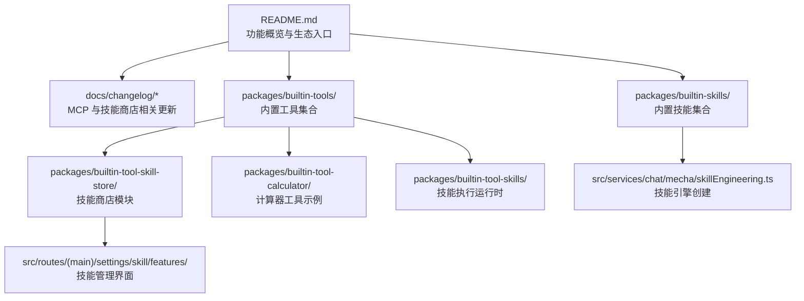

**图表来源**
- [README.md:188-210](file://README.md#L188-L210)
- [builtin-skills/src/index.ts:1-14](file://packages/builtin-skills/src/index.ts#L1-L14)
- [builtin-tools/src/index.ts:1-142](file://packages/builtin-tools/src/index.ts#L1-L142)
- [builtin-tool-skill-store/src/index.ts:1-14](file://packages/builtin-tool-skill-store/src/index.ts#L1-L14)
- [builtin-tool-calculator/src/index.ts:1-200](file://packages/builtin-tool-calculator/src/index.ts#L1-L200)
- [builtin-tool-skills/src/index.ts:1-11](file://packages/builtin-tool-skills/src/index.ts#L1-L11)
- [src/services/chat/mecha/skillEngineering.ts:1-33](file://src/services/chat/mecha/skillEngineering.ts#L1-L33)

**章节来源**
- [README.md:188-210](file://README.md#L188-L210)
- [builtin-skills/src/index.ts:1-14](file://packages/builtin-skills/src/index.ts#L1-L14)
- [builtin-tools/src/index.ts:1-142](file://packages/builtin-tools/src/index.ts#L1-L142)
- [builtin-tool-skill-store/src/index.ts:1-14](file://packages/builtin-tool-skill-store/src/index.ts#L1-L14)
- [builtin-tool-calculator/src/index.ts:1-200](file://packages/builtin-tool-calculator/src/index.ts#L1-L200)
- [builtin-tool-skills/src/index.ts:1-11](file://packages/builtin-tool-skills/src/index.ts#L1-L11)
- [src/services/chat/mecha/skillEngineering.ts:1-33](file://src/services/chat/mecha/skillEngineering.ts#L1-L33)

## 核心组件
- 内置技能（Builtin Skills）
  - 聚焦于特定领域的能力封装，如浏览器代理、产物（Artifacts）处理等
  - 通过统一导出与聚合，便于在 Agent 中按需启用
- 内置工具（Builtin Tools）
  - 提供默认工具 ID 列表与工具清单，覆盖本地系统、知识库、网页浏览、云沙箱、GTD、笔记本、计算器、远程设备等
  - 支持桌面端可见性开关与隐藏策略，确保不同平台体验一致
- 技能商店（Skill Store）
  - 提供技能搜索、从市场导入、技能导入等 API 与类型定义
  - 作为 MCP 生态的"入口"，连接外部技能与本地 Agent 执行环境
- 计算器工具（Calculator）
  - 展示工具的执行运行时、清单与系统提示词，是实现复杂业务逻辑的参考模板
- 技能执行运行时（Skills Execution Runtime）
  - 提供统一的技能执行接口，支持内置技能与数据库技能的统一管理
  - 包含脚本执行、文件导出、资源读取等功能

**章节来源**
- [builtin-skills/src/index.ts:1-14](file://packages/builtin-skills/src/index.ts#L1-L14)
- [builtin-tools/src/index.ts:21-32](file://packages/builtin-tools/src/index.ts#L21-L32)
- [builtin-tools/src/index.ts:34-142](file://packages/builtin-tools/src/index.ts#L34-L142)
- [builtin-tool-skill-store/src/index.ts:1-14](file://packages/builtin-tool-skill-store/src/index.ts#L1-L14)
- [builtin-tool-calculator/src/index.ts:1-200](file://packages/builtin-tool-calculator/src/index.ts#L1-L200)
- [builtin-tool-skills/src/index.ts:1-11](file://packages/builtin-tool-skills/src/index.ts#L1-L11)
- [builtin-tool-skills/src/ExecutionRuntime/index.ts:1-261](file://packages/builtin-tool-skills/src/ExecutionRuntime/index.ts#L1-L261)

## 架构总览
下图展示了插件生态在 Agent 系统中的位置与交互关系：内置工具与技能作为基础能力，技能商店负责技能发现与导入；MCP 协议支撑跨服务的云端点与市场集成，提升可扩展性与生态活力。

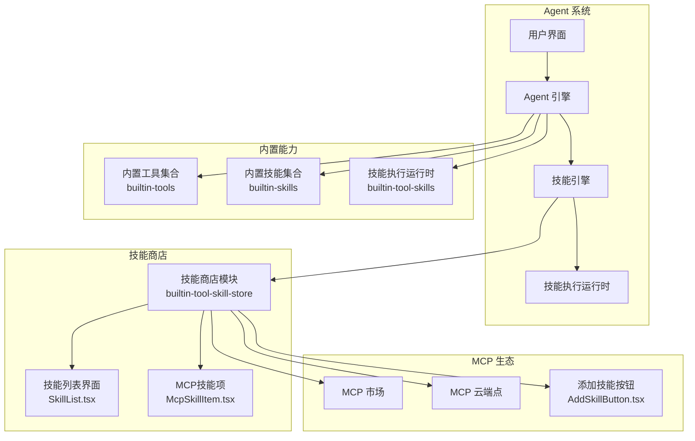

**图表来源**
- [builtin-tools/src/index.ts:21-32](file://packages/builtin-tools/src/index.ts#L21-L32)
- [builtin-skills/src/index.ts:1-14](file://packages/builtin-skills/src/index.ts#L1-L14)
- [builtin-tool-skill-store/src/index.ts:1-14](file://packages/builtin-tool-skill-store/src/index.ts#L1-L14)
- [builtin-tool-skills/src/index.ts:1-11](file://packages/builtin-tool-skills/src/index.ts#L1-L11)
- [src/services/chat/mecha/skillEngineering.ts:1-33](file://src/services/chat/mecha/skillEngineering.ts#L1-L33)
- [src/routes/(main)/settings/skill/features/SkillList.tsx](file://src/routes/(main)/settings/skill/features/SkillList.tsx#L60-L127)
- [src/routes/(main)/settings/skill/features/McpSkillItem.tsx](file://src/routes/(main)/settings/skill/features/McpSkillItem.tsx#L75-L97)
- [src/features/SkillStore/SkillList/AddSkillButton.tsx:71-96](file://src/features/SkillStore/SkillList/AddSkillButton.tsx#L71-L96)

## 详细组件分析

### 组件一：内置工具集合（builtin-tools）
- 设计要点
  - 默认工具 ID 列表集中声明，保证前后端一致性
  - 工具清单以"标识符 + 清单 + 可见性/可发现性"三元组组织，便于统一调度
  - 桌面端可见性策略与隐藏策略分离，适配多端差异化体验
- 关键行为
  - 将"工具清单"注入 Agent 引擎，使其具备函数调用与结果渲染能力
  - 通过隐藏/可发现字段控制在不同场景下的呈现与可用性

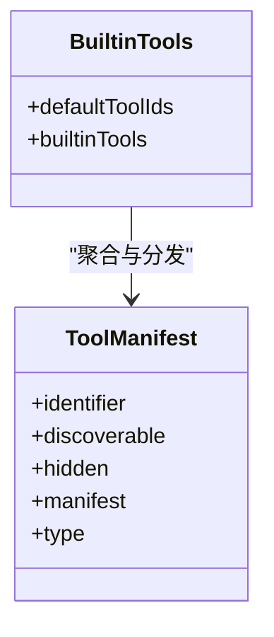

**图表来源**
- [builtin-tools/src/index.ts:21-32](file://packages/builtin-tools/src/index.ts#L21-L32)
- [builtin-tools/src/index.ts:34-142](file://packages/builtin-tools/src/index.ts#L34-L142)

**章节来源**
- [builtin-tools/src/index.ts:21-32](file://packages/builtin-tools/src/index.ts#L21-L32)
- [builtin-tools/src/index.ts:34-142](file://packages/builtin-tools/src/index.ts#L34-L142)

### 组件二：内置技能集合（builtin-skills）
- 设计要点
  - 技能以"标识符 + 清单"的形式导出，便于统一注册与调用
  - 聚合数组包含当前可用技能，支持按需扩展
- 典型用途
  - 浏览器代理、产物（Artifacts）处理等场景化能力

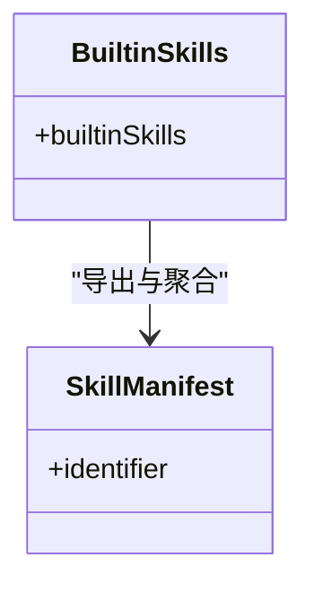

**图表来源**
- [builtin-skills/src/index.ts:1-14](file://packages/builtin-skills/src/index.ts#L1-L14)

**章节来源**
- [builtin-skills/src/index.ts:1-14](file://packages/builtin-skills/src/index.ts#L1-L14)

### 组件三：技能商店（builtin-tool-skill-store）
- 功能定位
  - 提供技能搜索、从市场导入、技能导入等能力
  - 定义 API 名称与状态类型，支撑前端交互与后端执行
- 与 Agent 的集成
  - 作为 MCP 生态的"入口"，将外部技能与本地执行环境对接
  - 通过系统提示词与执行运行时，实现安全可控的技能调用

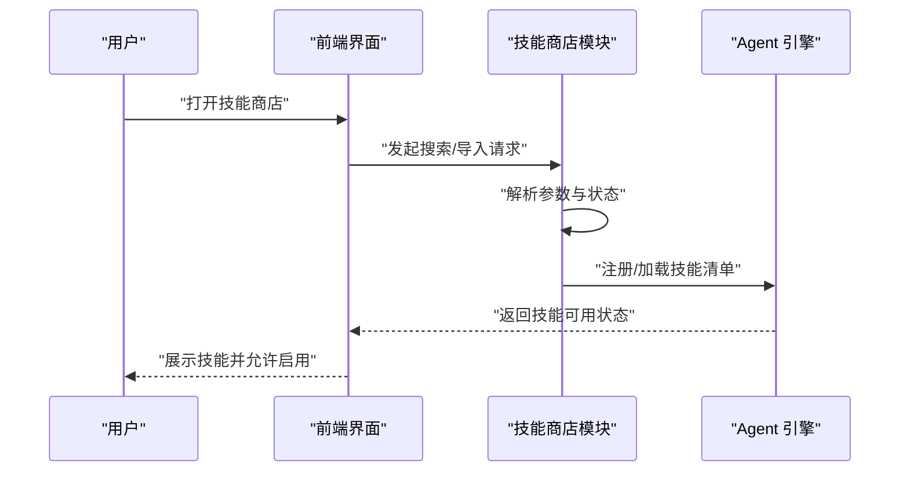

**图表来源**
- [builtin-tool-skill-store/src/index.ts:1-14](file://packages/builtin-tool-skill-store/src/index.ts#L1-L14)

**章节来源**
- [builtin-tool-skill-store/src/index.ts:1-14](file://packages/builtin-tool-skill-store/src/index.ts#L1-L14)

### 组件四：计算器工具（builtin-tool-calculator）
- 设计要点
  - 展示"执行运行时 + 清单 + 类型定义"的完整结构
  - 适合实现复杂业务逻辑与安全边界控制
- 开发参考
  - 可作为自定义插件的模板，遵循相同的清单与运行时模式

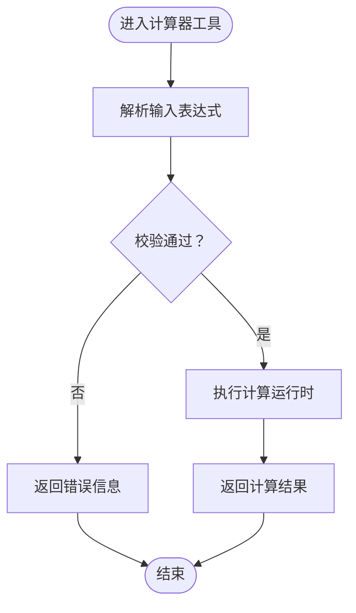

**图表来源**
- [builtin-tool-calculator/src/index.ts:1-200](file://packages/builtin-tool-calculator/src/index.ts#L1-L200)

**章节来源**
- [builtin-tool-calculator/src/index.ts:1-200](file://packages/builtin-tool-calculator/src/index.ts#L1-L200)

### 组件五：技能执行运行时（builtin-tool-skills）
- 设计要点
  - 提供统一的技能执行接口，支持内置技能与数据库技能的统一管理
  - 包含脚本执行、文件导出、资源读取等功能
  - 支持云端沙箱执行和传统命令执行两种模式
- 关键功能
  - execScript：执行脚本命令，支持配置和描述信息
  - exportFile：导出文件到云端存储
  - readReference：安全读取技能资源文件
  - runSkill：运行指定技能，优先检查内置技能再查询数据库

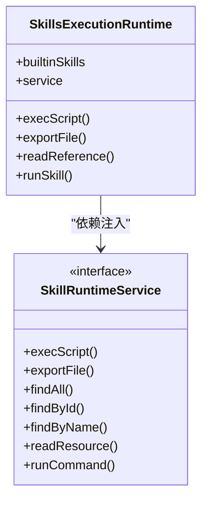

**图表来源**
- [builtin-tool-skills/src/ExecutionRuntime/index.ts:1-261](file://packages/builtin-tool-skills/src/ExecutionRuntime/index.ts#L1-L261)

**章节来源**
- [builtin-tool-skills/src/index.ts:1-11](file://packages/builtin-tool-skills/src/index.ts#L1-L11)
- [builtin-tool-skills/src/ExecutionRuntime/index.ts:1-261](file://packages/builtin-tool-skills/src/ExecutionRuntime/index.ts#L1-L261)

## 技能管理系统

### 技能引擎架构
技能引擎通过合并来自工具存储的所有技能源来创建，包括内置技能和数据库技能：

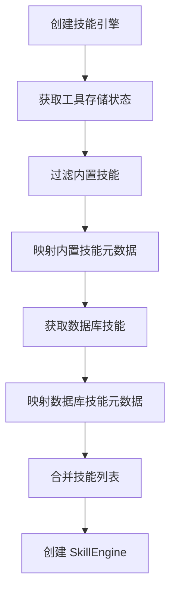

**图表来源**
- [src/services/chat/mecha/skillEngineering.ts:13-33](file://src/services/chat/mecha/skillEngineering.ts#L13-L33)

**章节来源**
- [src/services/chat/mecha/skillEngineering.ts:1-33](file://src/services/chat/mecha/skillEngineering.ts#L1-L33)

### 技能分类管理
技能管理系统将技能分为三大类：

1. **集成技能**：内置工具、LobeHub连接服务和Klavis集成
2. **社区MCP**：来自MCP市场的MCP服务器
3. **自定义MCP**：手动添加的MCP服务器

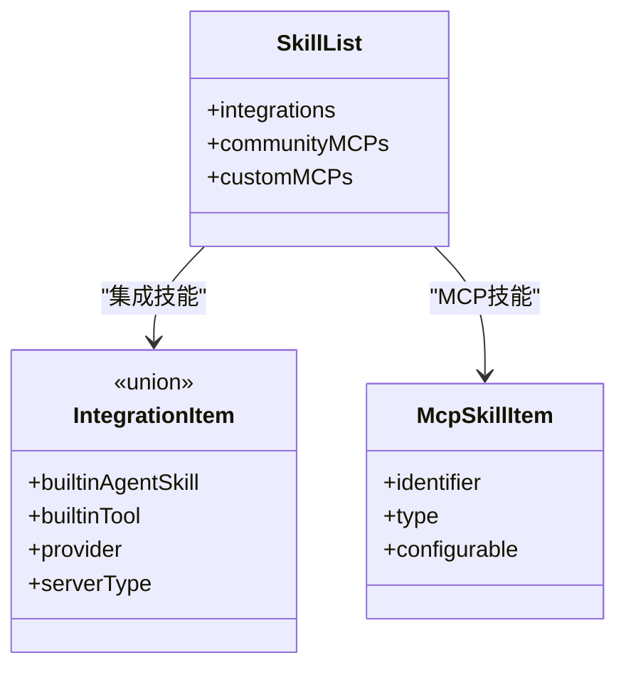

**图表来源**
- [src/routes/(main)/settings/skill/features/SkillList.tsx](file://src/routes/(main)/settings/skill/features/SkillList.tsx#L115-L127)

**章节来源**
- [src/routes/(main)/settings/skill/features/SkillList.tsx](file://src/routes/(main)/settings/skill/features/SkillList.tsx#L60-L127)

### 技能生命周期管理
技能从发现到卸载的完整生命周期：

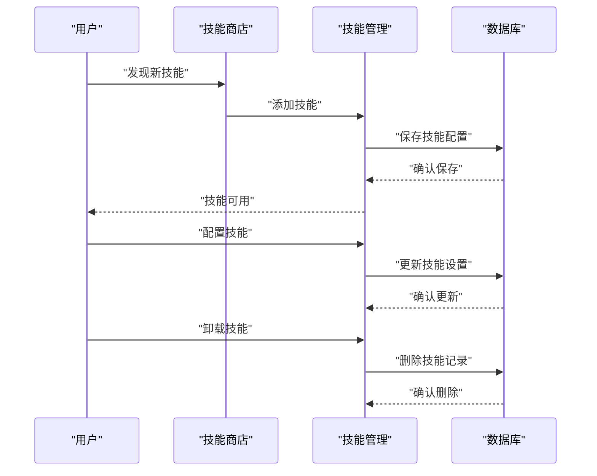

**章节来源**
- [docs/usage/community/skill-management.zh-CN.mdx:51-94](file://docs/usage/community/skill-management.zh-CN.mdx#L51-L94)
- [src/features/SkillStore/SkillList/AddSkillButton.tsx:71-96](file://src/features/SkillStore/SkillList/AddSkillButton.tsx#L71-L96)

## MCP协议支持与市场集成

### MCP云端点与市场扩展
LobeHub在MCP协议方面进行了重大扩展：

- **MCP云端点**：支持市场云端点MCP集成，扩展工具生态
- **MCP市场**：提供一键安装功能，支持数千种MCP插件
- **多种连接类型**：支持HTTP端点和STDIO命令两种连接方式
- **认证系统**：集成Amazon Cognito和Google SSO，提供页面访问保护

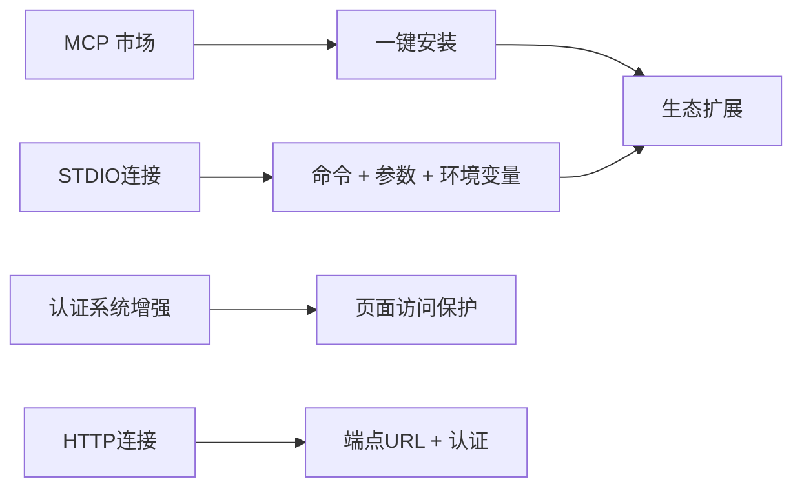

**图表来源**
- [2025-07-08-mcp-market.mdx:17-23](file://docs/changelog/2025-07-08-mcp-market.mdx#L17-L23)
- [2025-12-20-mcp.zh-CN.mdx:15-21](file://docs/changelog/2025-12-20-mcp.zh-CN.mdx#L15-L21)

**章节来源**
- [2025-07-08-mcp-market.mdx:1-32](file://docs/changelog/2025-07-08-mcp-market.mdx#L1-L32)
- [2025-12-20-mcp.zh-CN.mdx:1-27](file://docs/changelog/2025-12-20-mcp.zh-CN.mdx#L1-L27)

### MCP技能配置与管理
MCP技能的配置流程包括HTTP类型和STDIO类型的详细设置：

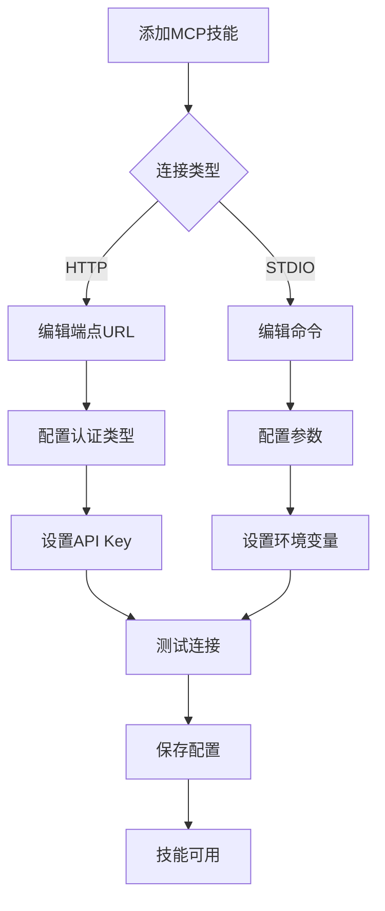

**图表来源**
- [src/routes/(main)/settings/skill/features/McpSkillItem.tsx](file://src/routes/(main)/settings/skill/features/McpSkillItem.tsx#L75-L97)
- [apps/mobile/src/screens/SkillSettingsScreen.tsx:324-371](file://apps/mobile/src/screens/SkillSettingsScreen.tsx#L324-L371)

**章节来源**
- [docs/usage/community/skill-management.zh-CN.mdx:113-132](file://docs/usage/community/skill-management.zh-CN.mdx#L113-L132)
- [docs/usage/community/custom-mcp.mdx:114-136](file://docs/usage/community/custom-mcp.mdx#L114-L136)
- [src/routes/(main)/settings/skill/features/McpSkillItem.tsx](file://src/routes/(main)/settings/skill/features/McpSkillItem.tsx#L75-L97)
- [apps/mobile/src/screens/SkillSettingsScreen.tsx:324-371](file://apps/mobile/src/screens/SkillSettingsScreen.tsx#L324-L371)

## 依赖关系分析
- 组件耦合
  - Agent 引擎依赖内置工具与技能清单进行能力装配
  - 技能引擎通过技能工程服务创建，整合内置技能与数据库技能
  - 技能商店作为中介，连接 MCP 市场与 Agent 引擎
  - 技能执行运行时提供统一的技能执行接口
- 外部依赖
  - MCP 协议与云端点为生态扩展提供标准接口
  - 认证与搜索提供商增强用户体验与安全性

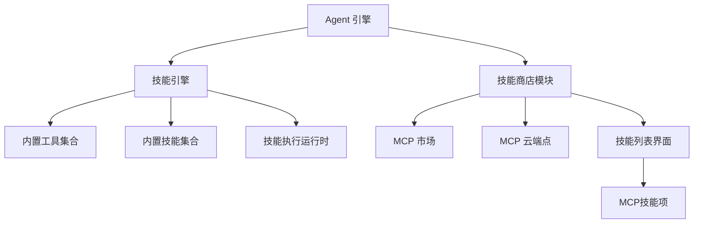

**图表来源**
- [builtin-tools/src/index.ts:21-32](file://packages/builtin-tools/src/index.ts#L21-L32)
- [builtin-skills/src/index.ts:1-14](file://packages/builtin-skills/src/index.ts#L1-L14)
- [builtin-tool-skill-store/src/index.ts:1-14](file://packages/builtin-tool-skill-store/src/index.ts#L1-L14)
- [builtin-tool-skills/src/index.ts:1-11](file://packages/builtin-tool-skills/src/index.ts#L1-L11)
- [src/services/chat/mecha/skillEngineering.ts:1-33](file://src/services/chat/mecha/skillEngineering.ts#L1-L33)
- [src/routes/(main)/settings/skill/features/SkillList.tsx](file://src/routes/(main)/settings/skill/features/SkillList.tsx#L60-L127)

**章节来源**
- [builtin-tools/src/index.ts:21-32](file://packages/builtin-tools/src/index.ts#L21-L32)
- [builtin-skills/src/index.ts:1-14](file://packages/builtin-skills/src/index.ts#L1-L14)
- [builtin-tool-skill-store/src/index.ts:1-14](file://packages/builtin-tool-skill-store/src/index.ts#L1-L14)
- [builtin-tool-skills/src/index.ts:1-11](file://packages/builtin-tool-skills/src/index.ts#L1-L11)
- [src/services/chat/mecha/skillEngineering.ts:1-33](file://src/services/chat/mecha/skillEngineering.ts#L1-L33)
- [src/routes/(main)/settings/skill/features/SkillList.tsx](file://src/routes/(main)/settings/skill/features/SkillList.tsx#L60-L127)

## 性能考量
- 工具与技能的可见性与可发现性控制，有助于减少不必要的初始化开销
- 桌面端专用工具仅在桌面端可见，避免移动端冗余资源占用
- MCP 市场与云端点的引入提升了按需扩展能力，降低全局负载
- 技能引擎的内置技能优先检查机制，减少数据库查询开销
- 统一的技能执行运行时接口，提供更好的性能监控和错误处理

## 故障排查指南
- 插件未显示或不可用
  - 检查工具清单中的 discoverable/hidden 字段是否符合当前平台策略
  - 确认技能商店的导入流程是否成功完成
- MCP 市场安装异常
  - 核对网络连通性与认证配置
  - 查看变更日志中关于 MCP 市场与云端点的最新修复项
- 技能执行失败
  - 检查技能名称是否正确，确认内置技能与数据库技能的区分
  - 验证MCP连接配置，包括端点URL、认证类型和API Key
  - 查看技能执行运行时的日志输出，定位具体错误原因
- 开发与调试
  - 参考贡献指南进行分支与提交流程
  - 使用本地开发命令启动前端与后端，结合变更日志定位问题

**章节来源**
- [builtin-tools/src/index.ts:57-59](file://packages/builtin-tools/src/index.ts#L57-L59)
- [CONTRIBUTING.md:1-89](file://CONTRIBUTING.md#L1-L89)
- [2025-07-08-mcp-market.mdx:25-32](file://docs/changelog/2025-07-08-mcp-market.mdx#L25-L32)
- [builtin-tool-skills/src/ExecutionRuntime/index.ts:208-260](file://packages/builtin-tool-skills/src/ExecutionRuntime/index.ts#L208-L260)

## 结论
LobeHub 插件生态系统以"内置工具 + 内置技能 + 技能商店 + MCP 协议"为核心，形成从能力装配到生态扩展的完整闭环。通过清晰的清单与运行时结构、桌面端差异化策略、MCP 市场与云端点的引入，系统在灵活性、安全性与可扩展性之间取得平衡。新增的技能管理系统进一步完善了从发现、安装、配置到管理的全生命周期流程。建议在开发自定义插件时，遵循现有工具与技能的结构范式，结合技能商店的 API 与类型定义，确保与 Agent 引擎的无缝集成。

## 附录
- 快速参考
  - 内置工具默认 ID 列表与清单聚合路径
  - 技能商店 API 名称与状态类型导出路径
  - 计算器工具的执行运行时与清单结构路径
  - 技能执行运行时的统一接口定义
- 变更与路线
  - MCP 市场与云端点相关更新记录
  - 技能管理系统的功能扩展说明
- 技术规范
  - MCP连接类型与配置要求
  - 技能生命周期管理流程
  - 安全边界控制与错误处理机制

**章节来源**
- [builtin-tools/src/index.ts:21-32](file://packages/builtin-tools/src/index.ts#L21-L32)
- [builtin-tool-skill-store/src/index.ts:1-14](file://packages/builtin-tool-skill-store/src/index.ts#L1-L14)
- [builtin-tool-calculator/src/index.ts:1-200](file://packages/builtin-tool-calculator/src/index.ts#L1-L200)
- [builtin-tool-skills/src/index.ts:1-11](file://packages/builtin-tool-skills/src/index.ts#L1-L11)
- [builtin-tool-skills/src/ExecutionRuntime/index.ts:1-261](file://packages/builtin-tool-skills/src/ExecutionRuntime/index.ts#L1-L261)
- [2025-07-08-mcp-market.mdx:1-32](file://docs/changelog/2025-07-08-mcp-market.mdx#L1-L32)
- [2025-12-20-mcp.zh-CN.mdx:1-27](file://docs/changelog/2025-12-20-mcp.zh-CN.mdx#L1-L27)
- [docs/usage/community/skill-management.zh-CN.mdx:1-145](file://docs/usage/community/skill-management.zh-CN.mdx#L1-L145)