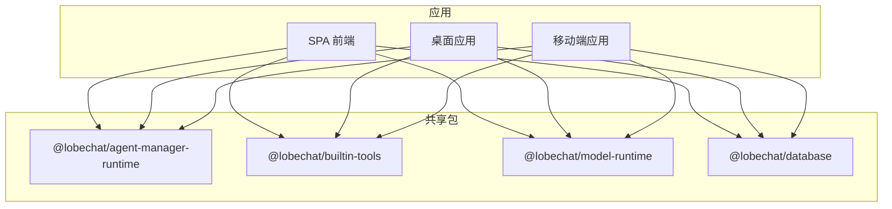
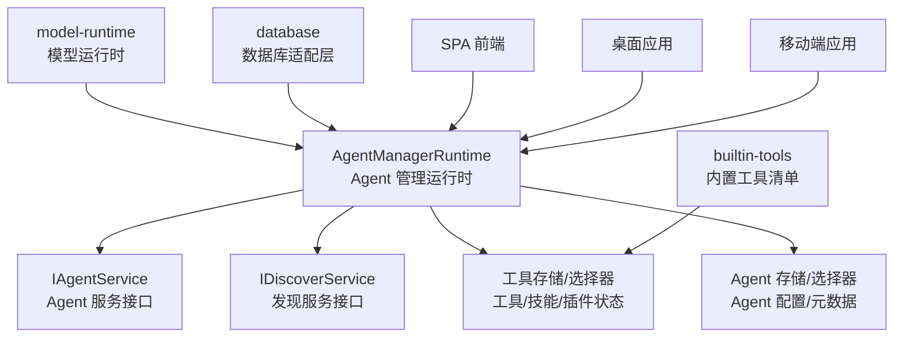
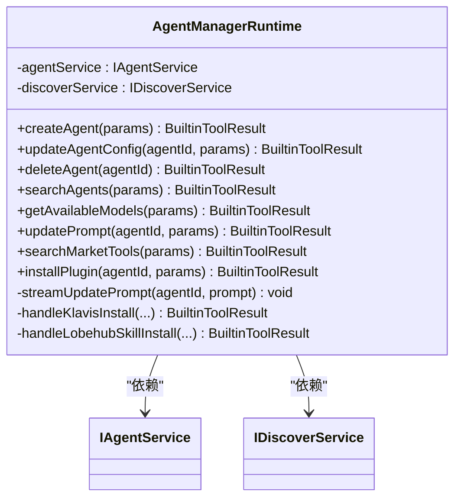
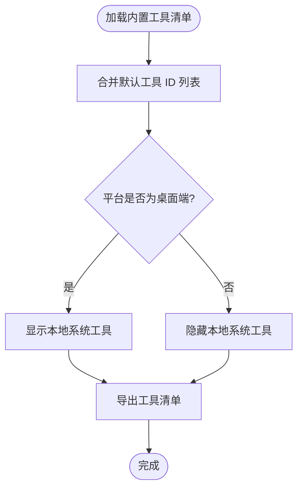
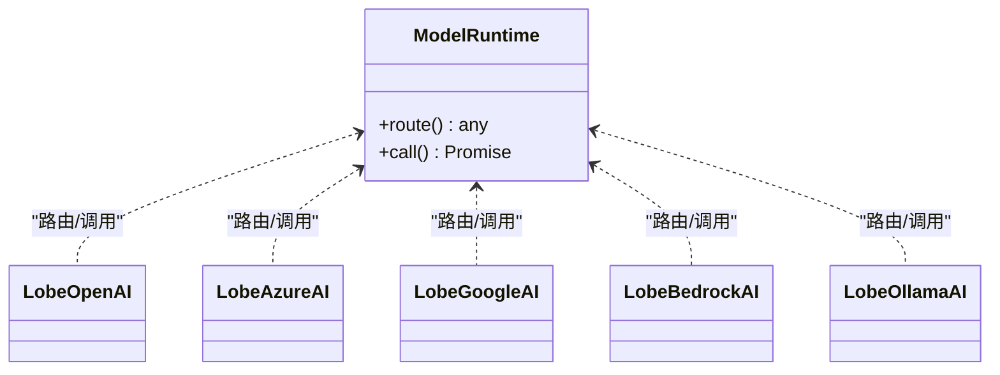
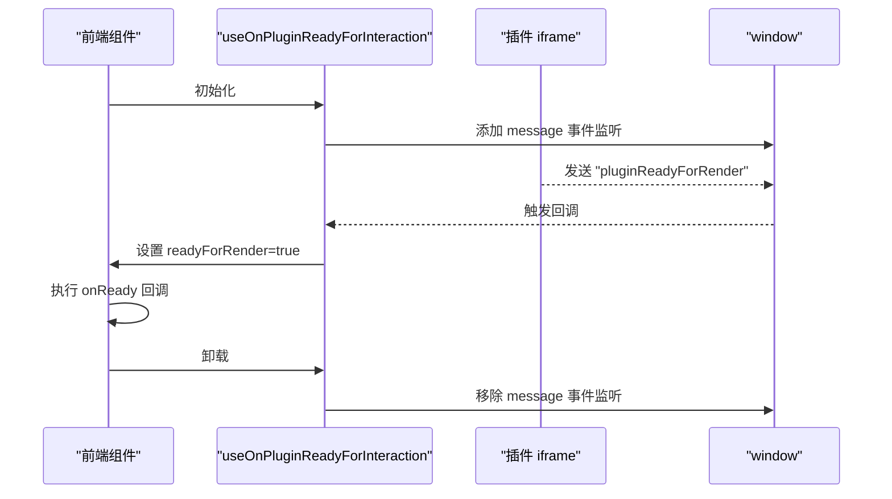
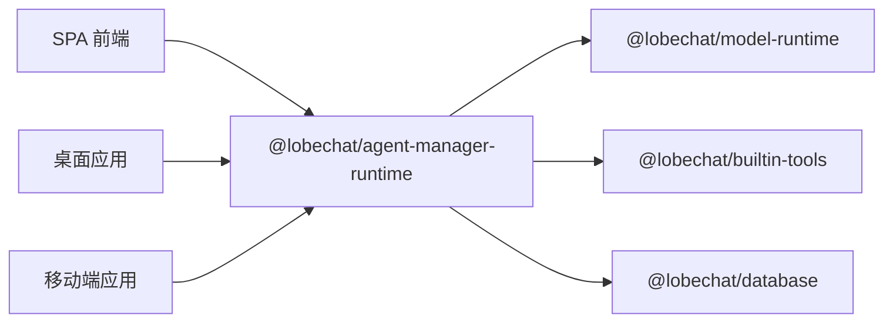

# 核心功能模块

<cite>
**本文引用的文件**
- [README.md](file://README.md)
- [AGENTS.md](file://AGENTS.md)
- [packages/agent-manager-runtime/src/AgentManagerRuntime.ts](file://packages/agent-manager-runtime/src/AgentManagerRuntime.ts)
- [packages/agent-manager-runtime/src/index.ts](file://packages/agent-manager-runtime/src/index.ts)
- [packages/builtin-tools/src/index.ts](file://packages/builtin-tools/src/index.ts)
- [packages/model-runtime/src/index.ts](file://packages/model-runtime/src/index.ts)
- [packages/database/src/index.ts](file://packages/database/src/index.ts)
- [packages/agent-runtime/package.json](file://packages/agent-runtime/package.json)
- [packages/builtin-tools/package.json](file://packages/builtin-tools/package.json)
- [packages/model-runtime/package.json](file://packages/model-runtime/package.json)
- [packages/database/package.json](file://packages/database/package.json)
- [src/features/PluginsUI/Render/utils/iframeOnReady.ts](file://src/features/PluginsUI/Render/utils/iframeOnReady.ts)
- [src/features/PluginsUI/Render/utils/iframeOnReady.test.ts](file://src/features/PluginsUI/Render/utils/iframeOnReady.test.ts)
</cite>

## 目录

1. [引言](#引言)
2. [项目结构](#项目结构)
3. [核心组件](#核心组件)
4. [架构总览](#架构总览)
5. [详细组件分析](#详细组件分析)
6. [依赖分析](#依赖分析)
7. [性能考虑](#性能考虑)
8. [故障排查指南](#故障排查指南)
9. [结论](#结论)
10. [附录](#附录)

## 引言

本文件面向 LobeHub 的核心功能模块，围绕 Agent 管理系统、多模态交互、插件生态系统与跨平台支持进行系统化说明。文档从设计理念、实现原理、使用方法到模块协作与数据流进行全面阐述，并提供配置要点、参数说明、最佳实践与扩展指南，帮助初学者快速上手，同时为高级开发者提供深入的技术细节。

## 项目结构

LobeHub 采用 monorepo 结构，核心能力由多个共享包（packages）与前端应用（apps）协同完成。核心模块包括：

- Agent 管理运行时：负责 Agent 的创建、更新、删除、搜索以及模型 / 插件工具的发现与安装。
- 内置工具集：统一注册与暴露内置工具清单，支持桌面端条件可见性与默认工具集合。
- 模型运行时：抽象多 Provider 的模型调用与路由，提供兼容工厂与错误处理。
- 数据库适配层：提供数据库访问适配器、压缩与类型导出，支撑本地 / 远程数据库部署。
- 插件渲染与交互：通过消息通道与 iframe 生命周期管理，实现插件就绪与交互。

**图表来源**

- [packages/agent-manager-runtime/src/index.ts](file://packages/agent-manager-runtime/src/index.ts#L1-L2)
- [packages/builtin-tools/package.json](file://packages/builtin-tools/package.json#L1-L47)
- [packages/model-runtime/package.json](file://packages/model-runtime/package.json#L1-L46)
- [packages/database/package.json](file://packages/database/package.json#L1-L38)

**章节来源**

- [AGENTS.md](file://AGENTS.md#L18-L38)
- [README.md](file://README.md#L125-L561)

## 核心组件

- Agent 管理运行时（AgentManagerRuntime）
  - 职责：统一处理 Agent 的增删改查、搜索、模型 / Provider 列表、插件 / 工具市场搜索与安装、系统提示词更新（含流式）。
  - 关键能力：服务注入解耦、乐观更新、状态回滚、OAuth 授权流程封装、内置工具与官方服务识别。
- 内置工具集（builtin-tools）
  - 职责：集中声明与导出内置工具清单，控制默认工具集合与桌面端可见性。
  - 关键能力：工具标识符、清单元数据、类型标注、条件隐藏 / 显示。
- 模型运行时（model-runtime）
  - 职责：抽象多 Provider 的模型调用，提供统一路由与兼容工厂，导出各 Provider 实现。
  - 关键能力：模型列表、路由选择、错误转换、用量转换、URI 解析。
- 数据库适配层（database）
  - 职责：提供数据库适配器、压缩工具与类型导出，支持客户端 / 服务端测试。
  - 关键能力：ID 生成、压缩策略、类型安全。
- 插件渲染与交互（PluginsUI）
  - 职责：通过消息通道监听插件就绪事件，管理 iframe 生命周期与交互时机。
  - 关键能力：事件监听、清理、回调触发。

**章节来源**

- [packages/agent-manager-runtime/src/AgentManagerRuntime.ts](file://packages/agent-manager-runtime/src/AgentManagerRuntime.ts#L61-L72)
- [packages/builtin-tools/src/index.ts](file://packages/builtin-tools/src/index.ts#L25-L32)
- [packages/model-runtime/src/index.ts](file://packages/model-runtime/src/index.ts#L1-L49)
- [packages/database/src/index.ts](file://packages/database/src/index.ts#L1-L5)
- [src/features/PluginsUI/Render/utils/iframeOnReady.ts](file://src/features/PluginsUI/Render/utils/iframeOnReady.ts#L1-L25)

## 架构总览

下图展示了 Agent 管理运行时与内置工具、模型运行时、数据库及前端应用之间的交互关系：

**图表来源**

- [packages/agent-manager-runtime/src/AgentManagerRuntime.ts](file://packages/agent-manager-runtime/src/AgentManagerRuntime.ts#L36-L59)
- [packages/builtin-tools/src/index.ts](file://packages/builtin-tools/src/index.ts#L34-L141)
- [packages/model-runtime/src/index.ts](file://packages/model-runtime/src/index.ts#L1-L49)
- [packages/database/src/index.ts](file://packages/database/src/index.ts#L1-L5)

## 详细组件分析

### Agent 管理运行时（AgentManagerRuntime）

- 设计理念
  - 运行时与服务解耦：通过构造函数注入服务接口，支持前后端不同实现。
  - 乐观更新与状态回退：对 Agent 配置与元数据变更采用乐观更新，失败时可回滚。
  - 流式体验：系统提示词支持分片流式更新，模拟打字机效果。
  - 多源发现：统一聚合用户自有 Agent 与市场 Agent；工具 / 插件支持内置、官方与市场三类来源。
- 核心流程
  - Agent CRUD：创建、更新（含插件开关）、删除。
  - 搜索：按关键词、分类、来源（用户 / 市场 / 全部）检索。
  - 模型 / Provider：基于启用列表过滤与汇总。
  - 插件 / 工具：内置工具直接启用；官方服务（如 Klavis、LobehubSkill）支持 OAuth 授权；市场工具走 MCP 安装。
  - 提示词：支持普通更新与流式更新。
- 关键数据结构与复杂度
  - 搜索与去重：时间复杂度近似 O (n)，n 为返回条目数。
  - 插件启用 / 禁用：基于数组过滤与合并，时间复杂度 O (m)，m 为当前插件数。
  - 流式提示词：按固定块大小与延迟输出，时间复杂度 O (p)，p 为提示词长度。
- 错误处理
  - 统一错误包装与状态回传，区分业务错误与网络错误，便于前端展示与重试。

**图表来源**

- [packages/agent-manager-runtime/src/AgentManagerRuntime.ts](file://packages/agent-manager-runtime/src/AgentManagerRuntime.ts#L61-L72)
- [packages/agent-manager-runtime/src/AgentManagerRuntime.ts](file://packages/agent-manager-runtime/src/AgentManagerRuntime.ts#L79-L109)
- [packages/agent-manager-runtime/src/AgentManagerRuntime.ts](file://packages/agent-manager-runtime/src/AgentManagerRuntime.ts#L114-L223)
- [packages/agent-manager-runtime/src/AgentManagerRuntime.ts](file://packages/agent-manager-runtime/src/AgentManagerRuntime.ts#L247-L325)
- [packages/agent-manager-runtime/src/AgentManagerRuntime.ts](file://packages/agent-manager-runtime/src/AgentManagerRuntime.ts#L332-L374)
- [packages/agent-manager-runtime/src/AgentManagerRuntime.ts](file://packages/agent-manager-runtime/src/AgentManagerRuntime.ts#L381-L414)
- [packages/agent-manager-runtime/src/AgentManagerRuntime.ts](file://packages/agent-manager-runtime/src/AgentManagerRuntime.ts#L443-L494)
- [packages/agent-manager-runtime/src/AgentManagerRuntime.ts](file://packages/agent-manager-runtime/src/AgentManagerRuntime.ts#L499-L593)
- [packages/agent-manager-runtime/src/AgentManagerRuntime.ts](file://packages/agent-manager-runtime/src/AgentManagerRuntime.ts#L597-L722)
- [packages/agent-manager-runtime/src/AgentManagerRuntime.ts](file://packages/agent-manager-runtime/src/AgentManagerRuntime.ts#L724-L800)

**章节来源**

- [packages/agent-manager-runtime/src/AgentManagerRuntime.ts](file://packages/agent-manager-runtime/src/AgentManagerRuntime.ts#L61-L800)

### 内置工具集（builtin-tools）

- 设计理念
  - 统一注册与导出：集中声明内置工具清单，支持默认工具集合与平台条件可见性。
  - 类型安全：通过类型标注保证工具清单与元数据一致性。
- 关键能力
  - 默认工具集合：在前端与服务端保持一致的默认工具列表。
  - 条件可见性：桌面端特定工具可见，其他平台隐藏。
  - 工具标识符与清单：便于 Agent 管理运行时识别与启用。

**图表来源**

- [packages/builtin-tools/src/index.ts](file://packages/builtin-tools/src/index.ts#L25-L32)
- [packages/builtin-tools/src/index.ts](file://packages/builtin-tools/src/index.ts#L57-L62)
- [packages/builtin-tools/src/index.ts](file://packages/builtin-tools/src/index.ts#L34-L141)

**章节来源**

- [packages/builtin-tools/src/index.ts](file://packages/builtin-tools/src/index.ts#L1-L142)

### 模型运行时（model-runtime）

- 设计理念
  - Provider 抽象：统一多 Provider 的模型调用入口，屏蔽差异。
  - 兼容工厂：提供 OpenAI 兼容运行时工厂，便于扩展与迁移。
  - 错误与用量：提供错误转换与用量转换工具，提升可观测性与成本控制。
- 关键能力
  - Provider 导出：OpenAI、Azure、Google、Bedrock、Ollama 等。
  - 路由与上下文：提供路由运行时与上下文构建工具。
  - 辅助工具：URI 解析、属性回退、价格查询等。

**图表来源**

- [packages/model-runtime/src/index.ts](file://packages/model-runtime/src/index.ts#L1-L49)

**章节来源**

- [packages/model-runtime/src/index.ts](file://packages/model-runtime/src/index.ts#L1-L49)

### 数据库适配层（database）

- 设计理念
  - 适配器模式：统一数据库访问接口，支持客户端 / 服务端差异化实现。
  - 压缩与类型：提供压缩工具与类型导出，保障数据一致性与传输效率。
- 关键能力
  - 适配器导出：数据库适配器、压缩工具、类型定义。
  - ID 生成：提供稳定 ID 生成策略。
  - 测试支持：分别针对客户端与服务端提供测试配置。

**章节来源**

- [packages/database/src/index.ts](file://packages/database/src/index.ts#L1-L5)
- [packages/database/package.json](file://packages/database/package.json#L1-L38)

### 插件渲染与交互（PluginsUI）

- 设计理念
  - 消息通道：通过 window\.postMessage 与插件通信，等待插件就绪信号后执行回调。
  - 生命周期管理：监听与清理消息事件，避免内存泄漏。
- 关键流程
  - 监听插件就绪事件：仅响应指定通道类型。
  - 触发回调：就绪后调用传入回调，支持依赖项变更。
  - 清理资源：组件卸载时移除事件监听。

**图表来源**

- [src/features/PluginsUI/Render/utils/iframeOnReady.ts](file://src/features/PluginsUI/Render/utils/iframeOnReady.ts#L1-L25)

**章节来源**

- [src/features/PluginsUI/Render/utils/iframeOnReady.ts](file://src/features/PluginsUI/Render/utils/iframeOnReady.ts#L1-L25)
- [src/features/PluginsUI/Render/utils/iframeOnReady.test.ts](file://src/features/PluginsUI/Render/utils/iframeOnReady.test.ts#L1-L76)

## 依赖分析

- 包间依赖
  - agent-manager-runtime 依赖 model-runtime、builtin-tools、database 等能力，用于模型列表、工具清单与存储适配。
  - builtin-tools 依赖内置工具包与常量，导出工具清单供 Agent 管理运行时使用。
  - model-runtime 依赖多 Provider SDK 与工具库，提供统一调用入口。
  - database 提供适配器与类型，被 Agent 管理运行时用于持久化与状态管理。
- 应用侧依赖
  - SPA、桌面与移动端均依赖上述共享包，形成统一的能力复用。

**图表来源**

- [packages/agent-manager-runtime/package.json](file://packages/agent-manager-runtime/package.json#L1-L20)
- [packages/builtin-tools/package.json](file://packages/builtin-tools/package.json#L1-L47)
- [packages/model-runtime/package.json](file://packages/model-runtime/package.json#L1-L46)
- [packages/database/package.json](file://packages/database/package.json#L1-L38)

**章节来源**

- [packages/agent-manager-runtime/package.json](file://packages/agent-manager-runtime/package.json#L1-L20)
- [packages/builtin-tools/package.json](file://packages/builtin-tools/package.json#L1-L47)
- [packages/model-runtime/package.json](file://packages/model-runtime/package.json#L1-L46)
- [packages/database/package.json](file://packages/database/package.json#L1-L38)

## 性能考虑

- Agent 管理运行时
  - 搜索限制：对返回条目数进行上限控制，避免过度渲染与网络压力。
  - 乐观更新：减少网络往返，提升交互流畅度；失败时快速回滚。
  - 流式提示词：分块与延迟输出，兼顾实时性与性能。
- 模型运行时
  - Provider 路由：根据模型能力与可用性进行路由选择，避免无效调用。
  - 错误与用量转换：提前收敛错误与用量，降低上层处理成本。
- 数据库适配层
  - 压缩策略：对大字段进行压缩，减少存储与传输开销。
- 插件渲染
  - 事件监听清理：避免重复监听导致的内存泄漏与性能下降。

\[本节为通用指导，无需列出具体文件来源]

## 故障排查指南

- Agent 管理运行时
  - 创建 / 更新失败：检查服务注入与网络连通性；查看返回的错误状态与消息类型，定位具体环节。
  - 插件安装异常：确认插件来源（内置 / 官方 / 市场），核对 OAuth 授权流程与服务器状态。
  - 流式提示词未生效：检查流式更新逻辑与延迟设置，确保前端正确接收分片。
- 模型运行时
  - Provider 无法调用：检查 API Key、代理配置与模型可用性；查看错误转换后的具体错误码。
  - 路由不生效：核对模型能力与路由规则，确认上下文构建是否正确。
- 数据库适配层
  - 读写异常：检查适配器实现与连接配置；验证压缩 / 解压流程。
- 插件渲染
  - 插件未就绪：确认消息通道类型与事件监听是否正确；检查 iframe 加载与通信链路。

**章节来源**

- [packages/agent-manager-runtime/src/AgentManagerRuntime.ts](file://packages/agent-manager-runtime/src/AgentManagerRuntime.ts#L106-L108)
- [packages/agent-manager-runtime/src/AgentManagerRuntime.ts](file://packages/agent-manager-runtime/src/AgentManagerRuntime.ts#L584-L592)
- [src/features/PluginsUI/Render/utils/iframeOnReady.ts](file://src/features/PluginsUI/Render/utils/iframeOnReady.ts#L1-L25)
- [src/features/PluginsUI/Render/utils/iframeOnReady.test.ts](file://src/features/PluginsUI/Render/utils/iframeOnReady.test.ts#L1-L76)

## 结论

LobeHub 的核心功能模块以共享包形式实现高内聚、低耦合的架构设计。Agent 管理运行时提供统一的 Agent 生命周期与生态集成能力；内置工具集与模型运行时分别承担 “工具清单” 与 “多 Provider 调用” 的抽象；数据库适配层保障数据一致性与可移植性；插件渲染机制则打通了前端与外部生态的交互边界。通过服务注入、乐观更新、流式渲染与消息通道等设计，系统在易用性、可扩展性与性能之间取得平衡。

\[本节为总结性内容，无需列出具体文件来源]

## 附录

- 使用场景与最佳实践
  - Agent 管理：优先使用内置工具作为默认集合，按需启用第三方插件；利用流式提示词提升交互体验。
  - 多模态交互：结合模型运行时的 Provider 能力，按需选择具备视觉 / 推理 / 函数调用能力的模型。
  - 插件生态：优先使用官方服务（如 Klavis、LobehubSkill）以获得更稳定的授权与工具列表；市场插件注意权限与稳定性。
  - 跨平台支持：桌面端可启用本地系统工具；移动端与 SPA 保持一致的工具集与交互体验。
- 配置选项与参数说明
  - Agent 管理运行时：支持关键词、分类、来源、数量限制等搜索参数；支持插件开关与配置字段更新。
  - 模型运行时：支持 Provider 路由、上下文构建、错误转换与用量转换。
  - 数据库适配层：提供适配器、压缩与类型导出，支持客户端 / 服务端测试。
  - 插件渲染：通过消息通道等待插件就绪，支持依赖项变更触发回调。

**章节来源**

- [packages/agent-manager-runtime/src/AgentManagerRuntime.ts](file://packages/agent-manager-runtime/src/AgentManagerRuntime.ts#L250-L325)
- [packages/agent-manager-runtime/src/AgentManagerRuntime.ts](file://packages/agent-manager-runtime/src/AgentManagerRuntime.ts#L443-L494)
- [packages/builtin-tools/src/index.ts](file://packages/builtin-tools/src/index.ts#L25-L32)
- [packages/model-runtime/src/index.ts](file://packages/model-runtime/src/index.ts#L1-L49)
- [packages/database/src/index.ts](file://packages/database/src/index.ts#L1-L5)
- [src/features/PluginsUI/Render/utils/iframeOnReady.ts](file://src/features/PluginsUI/Render/utils/iframeOnReady.ts#L1-L25)
